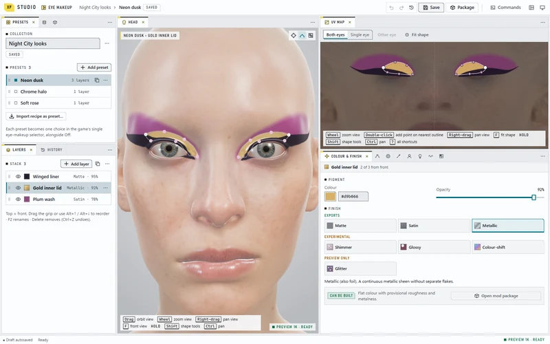
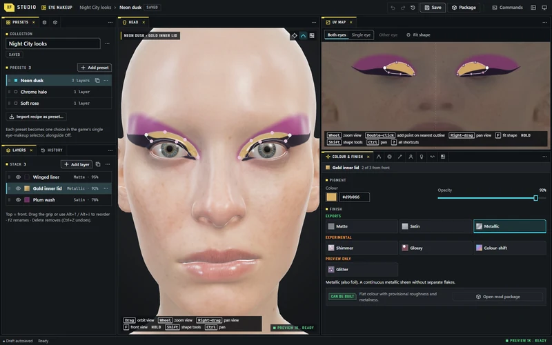

<h1 align="center">
  <picture>
    <source media="(prefers-color-scheme: dark)" srcset="docs/images/readme/banner-dark.svg">
    <source media="(prefers-color-scheme: light)" srcset="docs/images/readme/banner-light.svg">
    
  </picture>
</h1>

**Make Cyberpunk 2077 your own.** XF Studio is a project for authoring and customizing the game, beginning with your own V and growing toward other parts of the game over time. Eye makeup is the first working feature, not the limit of the studio. Today you can draw layered makeup directly on a character's face, tune colour and finish, arrange complete presets, and save them in a local library. The goal for this first feature is to bring an authored collection into the game through one eye-makeup selector.

<p align="center">
  <a href="docs/images/readme/studio-light.webp"></a>
  <a href="docs/images/readme/studio-dark.webp"></a>
  <br>
  <sub>Cyberpunk 2077 © CD PROJEKT RED; the 3D head is rendered from the player's own game files.</sub>
</p>

The current eye-makeup editor is a working prototype. It supports head and UV editing, Bézier and softness controls, whole-shape and warp adjustments, a deforming preview, saved-character import, recipe and collection files, and PNG mask export. Its browser finish previews include experimental looks; they are not all game materials. **Check mod export** reports unsupported active details before packaging. **Build mod files** can produce a private, independently verified candidate from the supported content, currently Matte, Satin and Metallic. A private diagnostic package is installed in a new MO2 profile but has not been launched or verified in the game. An isolated installed Electrobun trial has also built and checked a candidate; there is no public release yet. See [current state](docs/status.md) and the [collection-to-mod guide](research/authoring/studio-to-mod-pipeline.md) for the precise boundaries.

## Try the local editor

The editor needs [Bun](https://bun.sh/), and its 3D head preview needs your own Cyberpunk 2077 installation and the WolvenKit CLI: the Studio derives the head, eye plate and eyes from your game files locally. The repository intentionally excludes game files, extracted mod resources, personal saves, databases and credentials. Follow the [setup notes](projects/xf-studio/authoring/README.md#quick-start), then from `projects/xf-studio/authoring` run:

```powershell
bun install --frozen-lockfile
bun start
```

Open [127.0.0.1:4317](http://127.0.0.1:4317/) while the server runs. The [editor guide](projects/xf-studio/authoring/README.md#use) covers controls, local storage and verification. Work with a separate `?verify=1` browser workspace when testing changes to avoid touching an active draft.

## Projects

| Project | Where it stands |
|---|---|
| [XF Studio](projects/xf-studio/README.md) | Broad Cyberpunk authoring vision, starting with eye-makeup creation for V. Further character and game areas are future work to define one feature at a time. |
| [Photo Mode Tools](projects/xf-photo-mode-tools/README.md) | Independent peer project. Its clean implementation is still at the research stage. |

The repository also keeps an agent-facing [knowledge base](knowledge/README.md) of how the game's resources fit together, [focused experiments](experiments/), [source-grounded research](research/) and [validation notes](docs/validation.md) beside the projects. [Community credits](docs/community-credits.md) record what we learned from other creators and the boundaries on reuse. Contributors can start with the [developer orientation](docs/developer-orientation.md) and [working rules](AGENTS.md).

XF Studio was previously called XF Appearance Studio and XF Eye Artistry. The project now lives at `projects/xf-studio`; older data identifiers remain for compatibility. [The naming contract](projects/xf-studio/data/naming.md) explains which new resources use `xfs_`.

## License

XF Studio is released under the [MIT License](LICENSE). Third-party components keep their own licences; see the [community credits](docs/community-credits.md).
