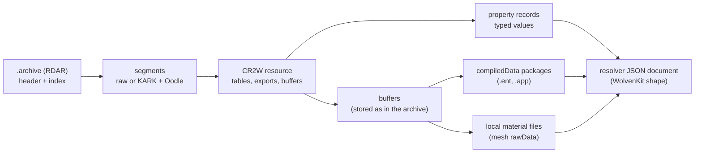

# Archive and resource formats

**Maturity: Draft.** How a game `.archive` stores resources, how a resource's CR2W bytes encode its objects, and how XF Studio's native reader (R&D, not yet used by the app) turns them into the same JSON documents the resolver reads from WolvenKit. Everything here was checked against game 2.31's own archives and installed mods, with WolvenKit CLI 9.0.1 as the reference. It is offline evidence: it says what the files hold, not what the engine does with them.

Grades follow the [knowledge base](README.md) legend. **[resource]** here means the native reader decoded the bytes and the result matched WolvenKit's output, byte for byte or leaf for leaf; **[source]** means the layout is described in a community tool or SDK listed under [Sources](#sources), and this page only restates format facts. XF Studio's reader is written from those facts and from the bytes. It contains no code from WolvenKit, which is GPL-3.0 and serves only as a documentation source and a test oracle.

## 1. The `.archive` container (RDAR)

### 1.1 Header

| Offset | Field | Notes | Grade |
|---|---|---|---|
| 0 | magic `RDAR` | | [resource] [source] [wiki] |
| 4 | u32 version | 12 in every archive seen | [resource] [wiki] |
| 8 | u64 index offset, u32 index size | where the index block lies | [resource] [wiki] |
| 20 | u64 debug offset, u32 debug size | always 0 | [wiki] |
| 32 | u64 file size | | [wiki] |
| 40 | u32 custom-data length | non-zero only in some mod archives; the block starts at byte 172 | [resource] [wiki] |

The optional custom-data block holds a file-name list. Its magic is the u32 conventionally written `LXRS` (the bytes on disk read `SRXL`), then u32 version (1), u32 uncompressed size, u32 stored size and u32 name count. The payload is NUL-separated depot paths: an Oodle stream with no `KARK` header when the stored size is smaller, raw otherwise. WolvenKit-packed mod archives carry it, and game archives do not. [resource] [wiki] The engine finds resources by hash alone, so it presumably ignores the list [hypothesis]. Names matter only to tools: the resolver names a resource from a mod's list when no reference gives its path. Across the game and the reference mod list (1,157 archives), the largest block is 0.01 MiB stored and its list 0.37 MiB decompressed. [resource]

### 1.2 Index

The index block holds u32 table offset (8), u32 table size, u64 CRC, u32 file count, u32 segment count and u32 dependency count. Then come the file entries (56 bytes each), the segments (16 bytes each) and the dependencies (u64 depot hash each). [resource] [wiki]

- **File entry:** u64 depot hash, i64 timestamp, u32 inline-buffer count, u32 first segment, u32 end segment (exclusive), u32 first dependency, u32 end dependency, then a 20-byte SHA-1. [resource] [wiki] The wiki describes the end indexes as "last"; they are exclusive.
- **The SHA-1 is the extracted file's in game archives, not in most mod archives.** In `basegame_4_appearance.archive`, 300 of 300 sampled entries carry the SHA-1 of the extracted file (§1.4: body and buffers as stored). Over five entries per archive of all 1,157 archives, 882 of 5,955 matched and 5,073 did not, in 991 archives: mod packers write some other digest. So the SHA-1 cannot check a mod resource's bytes. [resource]
- 44 entries in the reference mod list have an empty segment range (first segment = end segment). The reader refuses them as malformed, and they fall back to WolvenKit. [resource]
- **Segment:** u64 offset, u32 stored size, u32 size. [resource] [wiki]
- Game archives list entries sorted by hash, so a lookup is a binary search after one pass over the hashes. Opening an archive of about 81,000 entries takes 6–9 ms, and a small mod archive 0.3 ms. [resource]

### 1.3 Depot hashes

A depot hash is FNV-1a 64 of the **sanitized** path. The sanitizer strips an opening quote and any leading slashes and stops at a closing quote. It collapses runs of `/` and `\` into one `\` and lower-cases ASCII letters. The SDK limits the path to 216 characters. [source] RED4ext.SDK `include/RED4ext/ResourcePath.hpp` `HashSanitized`; red4ext-rs `src/types/res.rs` applies the same rules. This is also the key of the Studio's [mod loading](mod-loading.md) depot index.

### 1.4 A resource is its segments

The first segment is the CR2W body and the others are its buffers. [resource] [source] WolvenKit `ArchiveReader.cs`

- A segment whose stored size equals its size is stored raw. Otherwise it is a `KARK` stream (§2). [resource]
- The header's file size is not trusted alone: the reader requires every segment to end inside the file as it is on disk. [resource]
- **An extracted resource file is the decompressed body followed by the buffer segments exactly as stored.** The CR2W buffer table records a compressed buffer's disk size as the stored size, so the file stays self-consistent. [resource] Native extraction matched WolvenKit `unbundle` byte for byte on all 138 sampled entries (60 each from two game archives and 18 from a mod) and on all 2,348 resources in the resolver's cache.

## 2. Compression: `KARK` and Oodle

A compressed segment is a `KARK` header (u32 magic, u32 uncompressed size) followed by one Oodle LZ stream. [resource] (every compressed segment of game 2.31's content archives) [source] WolvenKit `WolvenKit.Core/Compression/Oodle.cs`. A compressed segment without the header never occurred, and the reader refuses one rather than guess.

The game ships the decoder as `bin/x64/oo2ext_7_win64.dll`, which exports the public Oodle Data API `OodleLZ_Decompress` (14 arguments: source, source length, destination, exact raw length, fuzz-safe, check-CRC, verbosity, dictionary base and size, callback, callback data, decoder memory and size, thread phase). [source] Cyber Engine Tweaks `src/reverse/TweakDB/ResourcesList.cpp` calls the same export from the running game with fuzz-safe 1, check-CRC 1 and thread phase 3. XF Studio loads the DLL from the user's own game folder through Bun's FFI. It passes fuzz-safe 1, check-CRC 0, verbosity 0, no dictionary, callback or decoder memory, and thread phase 3 (unthreaded). It requires the returned count to equal the raw length. [resource] Loading takes about 1 ms. The DLL has no version resource, so its identity is a short SHA-256. **XF Studio never ships, copies or redistributes the Oodle library.**

- **The DLL is checked before it is loaded.** Game 2.31's `oo2ext_7_win64.dll` (1,234,056 bytes) carries a valid Authenticode signature by CD PROJEKT S.A. (issuer DigiCert Trusted G4 Code Signing RSA4096 SHA384 2021 CA1). [resource] XF Studio loads it only when its SHA-256 is on a known list or its signature is valid and names CD PROJEKT S.A. It holds the file open without write or delete sharing from the check until the load, so the bytes checked are the bytes loaded.
- **The streams carry no checksum.** Given 440 truncated or corrupted copies of 40 real compressed segments, Oodle decoded 135 to other bytes of the right length instead of refusing them. Passing check-CRC 1 changed nothing. [resource] A corrupted archive can therefore yield wrong bytes that decompress cleanly. Only the CR2W checks (§3) catch them, and the entry SHA-1 does for game archives only (§1.2).

## 3. CR2W resources

A resource file starts with a 40-byte header: `CR2W`, u32 version (195 in 2.31), u32 flags, u64 timestamp, u32 build version, u32 objects end, u32 buffers end, u32 CRC32 and u32 chunk count. Ten table headers follow, each (u32 offset, u32 count, u32 CRC32). [resource] [source] WolvenKit `CR2WReader.cs`

| Table | Content | Used for |
|---|---|---|
| 0 strings | NUL-terminated text pool (count = bytes) | names, import paths |
| 1 names | u32 string offset, u32 FNV-1a 32 hash | every CName, type name and property name by index |
| 2 imports | u32 string offset, u16 class-name index, u16 flags | `rRef`/`raRef` targets; flags `Obligatory`, `Template`, `Soft`, `Embedded`, `Inplace` |
| 3 properties | 16 bytes each | not needed to read |
| 4 exports | u16 class-name index, u16 object flags, u32 parent, u32 data size, u32 data offset, u32 template, u32 CRC32 | one object each; export 0 is the root |
| 5 buffers | u32 flags, u32 index, u32 offset, u32 disk size, u32 memory size, u32 CRC32 | `DataBuffer` payloads; disk ≠ memory size means a `KARK` segment |
| 6 embedded files | u32 import index (1-based), u32 chunk index, u64 path hash, … | resources embedded in another |

All grades [resource]. **An export's body** is a 0x00 byte, then property records (u16 name index, u16 type-name index, u32 size counting itself, then the value), ended by a u16 0. Nested structs repeat that layout. A file writes only the properties that differ from the class default (§6.3). The reader checks every record's size against what its value consumed, so a misread fails instead of drifting. [resource]

- **Names and import paths** are found through one pass over the string pool's terminators and decoded once per offset. The longest entry seen is 159 bytes. [resource]
- **Embedded-file records** (16 bytes each) name distinct exports other than the root (export 0), and there are never more of them than exports. The reader refuses a table that breaks these rules or lies outside the file.

A few classes append data after the terminator. [resource] [source] WolvenKit's class-specific readers

- `CMaterialInstance`: u32 count, then per parameter u32 size (counting itself and the two names), u16 parameter name, u16 type name and the value. These are the material's parameter values, which WolvenKit shows as `values`.
- `CMaterialTemplate`: groups until the end, each a u8 count of (u8 type, u16 offset, u16 name index). This is `parameterInfo`.
- Any other trailing data is refused (the resource falls back to WolvenKit).

## 4. Value encodings

A property's type string names its encoding; the CR2W file carries it, so values can be read without the RTTI. [resource] [source] WolvenKit `CR2WReader.cs`

| Type | Encoding |
|---|---|
| `Bool`, integers, `Float`, `Double` | little-endian, natural width; `Bool` one byte |
| `CName`, enums | u16 name index (an enum stores its member's name) |
| bitfields | u16 name indexes of the set members, ended by 0 |
| `String`, `NodeRef` | variable-length signed count (first byte: sign, "more", 6 bits; then 7 bits and "more" per byte, at most four such bytes); negative = UTF-8 bytes, positive = UTF-16 units |
| `array:T` | u32 count, elements |
| `static:N,T` / `[N]T` | u32 count, elements (written as `{Elements}`) |
| `handle:T`, `whandle:T` | i32 export index + 1 (0 = null) |
| `rRef:T`, `raRef:T` | u16 import index + 1 (0 = none) |
| `DataBuffer` | u32: 0x80000000 empty; below it an inline length followed by the bytes; otherwise the buffer-table index + 1, xor 0x80000000 |
| `serializationDeferredDataBuffer` | u16 buffer-table index + 1 |
| `TweakDBID`, `CRUID`, `Int64`, `Uint64` | u64 |
| `CVariant` | u16 type name, u32 size, value |
| `LocalizationString` | u64, string |

All [resource]. `curveData`/`multiChannelCurve` values (for example in `.env` resources) are not decoded yet, and those resources fall back to WolvenKit. Every encoded value takes at least one byte, so a count larger than the bytes left is malformed.

## 5. Resource kinds the resolver reads

### 5.1 Roots verified

The native reader has matched the reference JSON on every field the resolver reads for these root classes (see the evidence in §7): `gameuiCharacterCustomizationInfoResource` (`.inkcharcustomization`), `appearanceAppearanceResource` (`.app`), `entEntityTemplate` (`.ent`), `CMesh`, `MorphTargetMesh`, `CMaterialInstance` (`.mi`), `CMaterialTemplate` (`.mt`), `CBitmapTexture` (`.xbm`, header only), `CHairProfile`, `CSkinProfile`, `CGradient`, `Multilayer_Setup` and `Multilayer_LayerTemplate`. [resource]

### 5.2 Buffers that hold objects

- `meshMeshMaterialBuffer.rawData` holds **complete CR2W files back to back**, the mesh's local materials. Each file's length is its own header's buffers-end. [resource]
- `entEntityTemplate.compiledData` and `appearanceAppearanceDefinition.compiledData` hold an **object package** (§5.3). [resource]

### 5.3 Object packages (`compiledData`)

The header is byte-packed: u8 version (4), u8 layout (2 in newer files), u16 section count (7 with a reference pool, otherwise 6) and u32 root count. Then come the optional reference descriptor and data offsets, the name, chunk descriptor and chunk data offsets, an i16 root index, a u16 CRUID count and the CRUIDs (u64). Section offsets count from the end of the CRUIDs. [resource] [source] WolvenKit `RedPackageReader.cs`

- Reference descriptors: u32 with bits 0–22 offset, 23–30 size and 31 "sync". The data is path text in `.ent` packages and a **u64 path hash in `.app` packages**, so an `.app` names its part `.ent`s by hash only. WolvenKit fills in names from its own path list. [resource]
- Name descriptors: u32 with bits 0–23 offset and 24–31 size (NUL included). Chunk descriptors: u32 type-name index and u32 offset. [resource]
- An object is a u16 field count, then (u16 name, u16 type, u32 offset from the object's start) per field, then the values. The encodings match CR2W except that handles are i32 object indexes (−1 null), references are i16 indexes, strings are u16-length UTF-8, bitfields are a u8 count of u16 names and buffers are inline. [resource]
- The roots are the objects no handle refers to, in chunk order, paired with the CRUIDs by position. [resource]
- **Layout is strict in practice.** In every `.ent` and `.app` package of the resolver's cache, an object's values are contiguous and in field-table order. The first value starts right after the table and each ends exactly where the next begins. Chunks follow one another in order, and every package is version 4. `.app` reference data is always 8 bytes. [resource] The reader requires all of this, so a file cannot point two fields at one nested object and make it decode twice. It refuses versions 2 and 3, which differ (for example in TweakDBIDs) and were never seen.
- A type name inside a package must be a class the RTTI knows. The reader holds hashes of all 15,715 class names in the RTTI dump ([Sources](#sources)), besides the slice with property lists. A name the RTTI does not know, perhaps an enum from a newer game, is refused rather than read as a struct. [resource]
- With layout 2, `worldCompiledEffectInfo` stores its arrays in memory layout rather than as fields. Names are u16 indexes, `Vector3` is 3 f32 and `Quaternion` 4 f32. Placement infos take 4 bytes and event infos 32. [resource] [source]

## 6. The resolver's JSON conventions

The resolver reads documents in the shape of WolvenKit's serializer (WKitJsonVersion 0.0.9). The native reader writes the same shape. [resource] (differential harness, §7)

### 6.1 Objects

`$type` comes first, then every property of the class in English collation order, including those the file left out (§6.3). [resource]

### 6.2 Handles and buffers

A handle is written as `{HandleId, Data}` where its object first appears (depth-first in key order) and as `{HandleRefId}` afterwards. Roots are written plainly. A buffer is `{BufferId, Flags, Bytes}`, numbered in write order, and a parsed buffer carries `Data` instead. The resolver's cache trims `Bytes` to `{$trimmedBase64Length}`. [resource]

### 6.3 Defaults

A CR2W file omits a property equal to its class default, but the JSON shows every property. For an omitted property the reader writes the value WolvenKit shows, learned per class from WolvenKit output of game and mod resources, and otherwise the type's zero value. The RTTI slice that lists each class's properties comes from a community RTTI dump ([Sources](#sources)). [resource] The engine's own defaults were not read, so a class never seen in training gets zeros. On a hold-out set every field the resolver reads still matched, but other fields of unseen classes may not [hypothesis].

### 6.4 Derived properties

WolvenKit adds some properties that the file does not store as properties: `CMaterialInstance.values` (§3) and `metadata`, `meshMeshMaterialBuffer.materials` (the local material roots, §5.2), `entEntityTemplate.entity` and `components` (from its package) and `appearanceAppearanceDefinition.components` (its package's roots). The reader adds the same ones. [resource]

### 6.5 What the JSON cannot say

Two facts about a resource have no place in the JSON, so the reader reports them beside it. [resource]

- **A stored type that disagrees with the RTTI.** A body-UV framework mod's `.app` stores `castShadows` as `Bool` where the RTTI has `shadowsShadowCastingMode` (§7). The value is decoded by the stored type and a note names the property and both types. No resource in the resolver's cache has such a mismatch.
- **Where a watched property was left out.** `rendChunk.renderMask` is written as `"0"` whether the file stores no flags or omits the property, and the resolver treats the two differently. The reader lists the JSON paths where it was omitted. In the 1,722 distinct cached resources every chunk stores it, so the difference only matters for a mod that omits it.

### 6.6 Numbers and paths

A `Float` is the float32 rounded to 9 significant digits, ties to even, which matches .NET's `G9` format. 64-bit integers are strings. Paths are lower-cased, with `/` turned into `\`, repeated separators collapsed and quotes and slashes trimmed (the §1.3 sanitizer). An empty reference is `{DepotPath: 0, Flags}`, with `Soft` for `raRef`. [resource]

## 7. Evidence and performance

Offline measurements on game 2.31 with WolvenKit CLI 9.0.1, 26 September 2026. Tools and tests are listed in [the reader's backlog page](../research/backlog/native-archive-reader.md#evidence-so-far).

| Check | Result |
|---|---|
| Bytes vs `unbundle` | 138/138 sampled entries and 2,348/2,348 cached resolver resources identical (SHA-256) [resource] |
| Documents vs `convert` | All 2,348 equal leaf for leaf except two name-only gaps: `.app` package references are hashes, and CCO `icon` TweakDBIDs are hashes (same ids). Resolver models equal for all 2,348 [resource] |
| Hold-out | Defaults learned from half the resources: resolver models equal on the other 1,100 [resource] |
| Speed | Resource read 0.06–0.16 ms; decode + JSON per resource: `.mi` 0.07 ms, `.xbm` 0.14, `.ent` 0.3, `.mt` 0.6, `.app` 4.3, `.mesh` 4.2, `.morphtarget` 31 (the player head's 12.5 MB body: 160 ms). A WolvenKit launch costs 2.6–3.1 s before doing any work [resource] |
| Cold resolve of the reference save (MO2 route, 1,079 archives, fresh caches) | WolvenKit only: 90–95 s, 23 launches, 612 resources extracted (117 MB of cached JSON). Native first: 2.7–2.9 s, no launches, 519 resources read natively, none fell back. The route open (3–4 s) is the same either way [resource] |
| Cold resolve of the default V with one framework piercing (same route) | WolvenKit only: 119 s, 25 launches. Native first: 3.9 s, no launches, none fell back [resource] |
| Hardened reader (§8) | Documents of all 1,722 distinct cached resources byte-identical to the unhardened reader's; the harness results unchanged. Mutation fuzz: no internal failure in 2.4 million synthetic mutants or 15 s of mutated real resources, slowest case 5 ms [resource] |

The cold resolve also showed that native reading is stricter about types than about bytes. A body-UV framework mod's `.app` stores `castShadows` as `Bool` where the current RTTI says `shadowsShadowCastingMode`. WolvenKit 8.17.4 and 9.0.1 both refuse to serialize it ([tooling](tooling.md#success-and-failure)), so the WolvenKit route leaves that appearance unresolved. The native reader decodes each value by the type the file declares and resolved it. The two resolved characters differ only in that appearance. What the engine does with the mistyped field is not known ([mod loading open question 5](mod-loading.md#open-questions)).

## 8. Reading untrusted files safely

Mod archives are untrusted input, and every size and count in them is chosen by the file. The reader treats them so. [resource] (regression tests, fuzzing and the §7 measurements)

- **Checked before use.** Every offset, size and count is checked against the real file size, the containing window or the bytes left before anything is allocated. A cursor never moves backwards. A string's length is built arithmetically, so it cannot wrap negative.
- **Budgets per resource.** Separate caps bound the resource read from the archive, the body, each buffer and the bytes decoded to names and parsed buffers. Further caps bound the values decoded, the JSON values written (defaults can make a few bytes ask for a large object) and nesting. Each cap is the largest measured on real resources times a margin. The table and its basis are on the [backlog page](../research/backlog/native-archive-reader.md#budgets).
- **Typed refusals.** A refusal is `malformed`, `unsupported`, `over-budget` or `decompress`. File-system trouble is `io`, and anything else is `internal`, a reader bug, never mistaken for an ordinary fallback.
- **Time.** Decoding can run in a worker with a time budget per resource. A resource over it is abandoned by ending the worker, which frees everything it allocated, and it falls back to WolvenKit. Bun ignores worker heap limits, so memory is bounded by the caps, not by the runtime.
- **No lasting file handles.** A read opens the archive, checks it is still the file whose index was parsed, reads and closes. So an installer or mod manager can replace an archive by rename, which Windows refuses while another process holds it open, and a replaced archive is re-indexed.

## 9. Where this lives in XF Studio

`projects/xf-studio/authoring/src/native/` holds the code. `rdar-archive.ts`, `kark.ts`, `oodle.ts` and `archive-reader.ts` cover §1–2; `cr2w-file.ts`, `cr2w-reader.ts`, `red-values.ts` and `red-package.ts` cover §3–5; `red-json-writer.ts`, `red-defaults.ts`, `json-numbers.ts` and `resource-document.ts` cover §6. `native-errors.ts` and `limits.ts` hold the typed failures and budgets of §8. `native-decode.ts` and `native-decode-worker.ts` hold the in-process and worker decoders, and `native-fetch-port.ts` holds the `NativeFirstFetcher` prototype. The code is not wired into the app; the [backlog page](../research/backlog/native-archive-reader.md) holds the integration plan and the texture and mesh phases.

## Open questions

1. The engine's own defaults for omitted properties (read them from the RTTI at runtime through the bridge, instead of learning from WolvenKit output).
2. How does the engine treat a property whose stored type disagrees with the RTTI (`castShadows` as `Bool`)? Skip, convert, or fail the resource? The reader reports such properties (§6.5).
3. `rendChunk.renderMask` absent from a file is written as 0 (WolvenKit's default), which the resolver reads as "not drawn". Is that the engine's default too? The reader reports where it was absent (§6.5).
4. The meaning of the index CRC, and whether the engine checks the per-entry SHA-1. It is the extracted file's SHA-1 in game archives but not in most mod archives (§1.2), which suggests the engine does not check it [hypothesis].
5. `curveData` encoding (needed for `.env` and animation-adjacent resources).
6. Texture (`.xbm` mip data) and mesh render-blob decoding, the reader's phases 3 and 4.

## Sources

Format facts were learned from the following, at these commits, without copying code:

- WolvenKit ([GitHub](https://github.com/WolvenKit/WolvenKit), GPL-3.0) at `11720772`: `WolvenKit.RED4/Archive/IO/ArchiveReader.cs`, `CR2WReader.cs`, `RedPackageReader.cs`, `WolvenKit.Core/Compression/Oodle.cs`, `WolvenKit.Common/RED4/CR2W/JSON/RedJsonSerializer.cs`. Studied as documentation only, and its CLI 9.0.1 serves as the byte and JSON oracle.
- Cyberpunk 2077 Modding Wiki at `be2f44eed841`: `for-mod-creators-theory/files-and-what-they-do/file-formats/README.md` §Archive Format (tables, no images; section history by manavortex, muad_ and Zhincore).
- RED4ext.SDK ([GitHub](https://github.com/wopss/RED4ext.SDK), MIT) at `ad7277714ad3`: `include/RED4ext/ResourcePath.hpp`, `include/RED4ext/Hashing/FNV1a.hpp`.
- Cyber Engine Tweaks at `9a8522f2a3d6`: `src/reverse/TweakDB/ResourcesList.cpp` (the `OodleLZ_Decompress` call).
- red4ext-rs at `d419d98d8b81`: `src/types/res.rs` (path sanitizing).
- The scripting RTTI dump exported by psiberx with a fork of wopss's RED4.RTTIDumper, as published in `red-dump-json` at `a8e52990`. It supplies class property lists, enums and bitfields; the dump dates from May 2025, so newer properties come only from learned keys.
