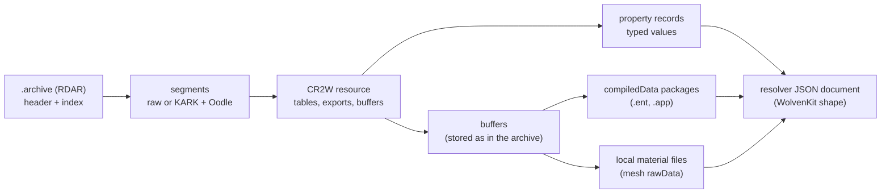

# Archive and resource formats

**Maturity: Draft.** How a game `.archive` stores resources, how the mesh render blobs hold vertices (§12), how a facial setup packs its solver tables (§13), how a resource's CR2W bytes encode its objects, and how XF Studio's native reader turns them into the same JSON documents the resolver used to read only from WolvenKit (the resolver now reads natively first, §9). Everything here was checked against game 2.31's own archives and installed mods, with WolvenKit CLI 9.0.1 as the reference. It is offline evidence: it says what the files hold, not what the engine does with them.

Grades follow the [knowledge base](README.md) legend. **[resource]** here means the native reader decoded the bytes and the result matched WolvenKit's output, byte for byte or leaf for leaf; **[source]** means the layout is described in a community tool or SDK listed under [Sources](#sources), and this page only restates format facts. XF Studio's reader is written from those facts and from the bytes. It contains no code from WolvenKit, which is GPL-3.0 and serves only as a documentation source and a test oracle.

```mermaid
flowchart LR
  A[".archive (RDAR)<br/>header + index"] --> S["segments<br/>raw or KARK + Oodle"]
  S --> C["CR2W resource<br/>tables, exports, buffers"]
  C --> P["property records<br/>typed values"]
  C --> B["buffers<br/>(stored as in the archive)"]
  B --> K["compiledData packages<br/>(.ent, .app)"]
  B --> L["local material files<br/>(mesh rawData)"]
  P --> J["resolver JSON document<br/>(WolvenKit shape)"]
  K --> J
  L --> J
```

## 1. The `.archive` container (RDAR)

### 1.1 Header

| Offset | Field | Notes | Grade |
|---|---|---|---|
| 0 | magic `RDAR` | | [resource] [source] [wiki] |
| 4 | u32 version | 12 in every archive seen | [resource] [wiki] |
| 8 | u64 index offset, u32 index size | where the index block lies | [resource] [wiki] |
| 20 | u64 debug offset, u32 debug size | always 0 | [wiki] |
| 32 | u64 file size | | [wiki] |
| 40 | u32 custom-data length | non-zero only in some mod archives; the block starts at byte 172 | [resource] [wiki] |

The optional custom-data block holds a file-name list. Its magic is the u32 conventionally written `LXRS` (the bytes on disk read `SRXL`), then u32 version (1), u32 uncompressed size, u32 stored size and u32 name count. The payload is NUL-separated depot paths: an Oodle stream with no `KARK` header when the stored size is smaller, raw otherwise. WolvenKit-packed mod archives carry it, and game archives do not. [resource] [wiki] The engine finds resources by hash alone, so it presumably ignores the list [hypothesis]. Names matter only to tools: the resolver names a resource from a mod's list when no reference gives its path. Across the game and the reference mod list (1,157 archives), the largest block is 0.01 MiB stored and its list 0.37 MiB decompressed. [resource]

### 1.2 Index

The index block holds u32 table offset (8), u32 table size, u64 CRC, u32 file count, u32 segment count and u32 dependency count. Then come the file entries (56 bytes each), the segments (16 bytes each) and the dependencies (u64 depot hash each). [resource] [wiki]

- **File entry:** u64 depot hash, i64 timestamp, u32 inline-buffer count, u32 first segment, u32 end segment (exclusive), u32 first dependency, u32 end dependency, then a 20-byte SHA-1. [resource] [wiki] The wiki describes the end indexes as "last"; they are exclusive.
- **The SHA-1 is the extracted file's in game archives, not in most mod archives.** In `basegame_4_appearance.archive`, 300 of 300 sampled entries carry the SHA-1 of the extracted file (§1.4: body and buffers as stored). Over five entries per archive of all 1,157 archives, 882 of 5,955 matched and 5,073 did not, in 991 archives: mod packers write some other digest. So the SHA-1 cannot check a mod resource's bytes. [resource]
- 44 entries in the reference mod list have an empty segment range (first segment = end segment). The reader refuses them as malformed, and they fall back to WolvenKit. [resource]
- **Segment:** u64 offset, u32 stored size, u32 size. [resource] [wiki]
- Game archives list entries sorted by hash, so a lookup is a binary search after one pass over the hashes. Opening an archive of about 81,000 entries takes 6–9 ms, and a small mod archive 0.3 ms. The largest index block in game 2.31 is 28.6 MiB (a `content` archive), and the indexes of all 1,157 archives of the reference setup (game, EP1 and 1,100 mod archives) come to 96.2 MiB together; the largest mod archive index is 0.53 MiB. [resource]

### 1.3 Depot hashes

A depot hash is FNV-1a 64 of the **sanitized** path. The sanitizer strips an opening quote and any leading slashes and stops at a closing quote. It collapses runs of `/` and `\` into one `\` and lower-cases ASCII letters. The SDK limits the path to 216 characters. [source] RED4ext.SDK `include/RED4ext/ResourcePath.hpp` `HashSanitized`; red4ext-rs `src/types/res.rs` applies the same rules. This is also the key of the Studio's [mod loading](mod-loading.md) depot index.

### 1.4 A resource is its segments

The first segment is the CR2W body and the others are its buffers. [resource] [source] WolvenKit `ArchiveReader.cs`

- A segment whose stored size equals its size is stored raw. Otherwise it is a `KARK` stream (§2). [resource]
- The header's file size is not trusted alone: the reader requires every segment to end inside the file as it is on disk. [resource]
- **An extracted resource file is the decompressed body followed by the buffer segments exactly as stored.** The CR2W buffer table records a compressed buffer's disk size as the stored size, so the file stays self-consistent. [resource] Native extraction matched WolvenKit `unbundle` byte for byte on all 138 sampled entries (60 each from two game archives and 18 from a mod) and on all 2,348 resources in the resolver's cache.

## 2. Compression: `KARK` and Oodle

A compressed segment is a `KARK` header (u32 magic, u32 uncompressed size) followed by one Oodle LZ stream. [resource] (every compressed segment of game 2.31's content archives) [source] WolvenKit `WolvenKit.Core/Compression/Oodle.cs`. A compressed segment without the header never occurred, and the reader refuses one rather than guess.

The game ships the decoder as `bin/x64/oo2ext_7_win64.dll`, which exports the public Oodle Data API `OodleLZ_Decompress` (14 arguments: source, source length, destination, exact raw length, fuzz-safe, check-CRC, verbosity, dictionary base and size, callback, callback data, decoder memory and size, thread phase). [source] Cyber Engine Tweaks `src/reverse/TweakDB/ResourcesList.cpp` calls the same export from the running game with fuzz-safe 1, check-CRC 1 and thread phase 3. XF Studio loads the DLL from the user's own game folder through Bun's FFI. It passes fuzz-safe 1, check-CRC 0, verbosity 0, no dictionary, callback or decoder memory, and thread phase 3 (unthreaded). It requires the returned count to equal the raw length. [resource] Loading takes about 1 ms. The DLL has no version resource, so its identity is a short SHA-256. **XF Studio never ships, copies or redistributes the Oodle library.**

- **The same DLL also compresses.** Its export names include `OodleLZ_Compress`, `OodleLZ_CompressWithContext`, `OodleLZ_CompressOptions_GetDefault`, `OodleLZ_GetCompressedBufferSizeNeeded` and the compression levels. [observed] (a string scan of game 2.31's `oo2ext_7_win64.dll` on the reference installation, 29 September 2026; not yet called). So a native archive writer could compress segments with the player's own copy of the game's compressor, through the same adapter and signature check as decompression, instead of storing them uncompressed. Whether the game cares which level wrote a segment is still to be established.
- **WolvenKit 9.0.1 compresses with Kraken: bodies at Normal, buffers at Optimal2.** Every one of the 34 segments of an XF Studio archive (15 resources: plate meshes and morph targets, XBM textures, `.app` and customization files; 21.9 MB raw, 1.75 MB stored) is reproduced byte for byte by `OodleLZ_Compress` of the game's `oo2ext_7_win64.dll` with compressor 8 (Kraken), no options, no dictionary: each resource's first segment (its CR2W body, compressed by `pack`) at level 4 (Normal), and each buffer segment (compressed earlier by `import` or `convert deserialize`) at level 6 (Optimal2). [resource] (30 September 2026, development PC; decompressed and recompressed through bun:ffi). Recompressing all 34 raw segments takes, single-threaded: HyperFast4 7 ms (2.59 MB), SuperFast 22 ms (1.89 MB), VeryFast 34 ms, Fast 61 ms, Normal 80 ms (1.80 MB), Optimal1 0.6 s, Optimal2 1.9 s (1.75 MB), Optimal3 2.7 s, Optimal4 5.1 s (1.70 MB). [resource] So in a WolvenKit Build compression costs at most about 2 s of CPU, far less than WolvenKit's own start-up per launch (about 2.3 s); a fast level only pays once resources are written natively ([pipeline](../research/authoring/studio-to-mod-pipeline.md#build-speed-and-stage-progress)).
- **The DLL is checked before it is loaded.** Game 2.31's `oo2ext_7_win64.dll` (1,234,056 bytes) carries a valid Authenticode signature by CD PROJEKT S.A. (issuer DigiCert Trusted G4 Code Signing RSA4096 SHA384 2021 CA1). [resource] XF Studio loads it only when its SHA-256 is on a known list or its signature is valid and names CD PROJEKT S.A. It holds the file open without write or delete sharing from the check until the load, hashes the bytes read through that handle and loads the handle's final path (junctions resolved), so the bytes checked are the bytes loaded even if a junction in the game folder is repointed meanwhile. While the file is held, Windows also refuses to rename the folders above it. The one residual window is a drive letter redefined for the same user between check and load. [resource] (tests with junctions, 26 September 2026) An unknown hash is checked through PowerShell asynchronously, so a host's event loop never waits on it.
- **Unloading needs `FreeLibrary`.** Bun 1.4.2's `close` on a `bun:ffi` library does not unload it on Windows: a copy of the library stayed mapped (opening it for writing failed with `EBUSY`) after `close`, and one `FreeLibrary` for the one load freed it [resource: 27 September 2026]. So XF Studio releases the library itself (`oodle.ts`), with one `FreeLibrary` per load and never Bun's `close` as well, and refuses any decompression after that. The decode worker releases it after a minute idle, so a game update or repair can replace the file while the Studio is open (§8).
- **The streams carry no checksum.** Given 440 truncated or corrupted copies of 40 real compressed segments, Oodle decoded 135 to 149 of them (two runs) to other bytes of the right length instead of refusing them. Passing check-CRC 1 changed nothing. [resource] A corrupted archive can therefore yield wrong bytes that decompress cleanly. Only the CR2W checks (§3) catch them, and the entry SHA-1 does for game archives only (§1.2).

## 3. CR2W resources

A resource file starts with a 40-byte header: `CR2W`, u32 version (195 in 2.31), u32 flags, u64 timestamp, u32 build version, u32 objects end, u32 buffers end, u32 CRC32 and u32 chunk count. Ten table headers follow, each (u32 offset, u32 count, u32 CRC32). [resource] [source] WolvenKit `CR2WReader.cs`

| Table | Content | Used for |
|---|---|---|
| 0 strings | NUL-terminated text pool (count = bytes) | names, import paths |
| 1 names | u32 string offset, u32 FNV-1a 32 hash | every CName, type name and property name by index |
| 2 imports | u32 string offset, u16 class-name index, u16 flags | `rRef`/`raRef` targets; flags `Obligatory`, `Template`, `Soft`, `Embedded`, `Inplace` |
| 3 properties | 16 bytes each | not needed to read |
| 4 exports | u16 class-name index, u16 object flags, u32 parent, u32 data size, u32 data offset, u32 template, u32 CRC32 | one object each; export 0 is the root |
| 5 buffers | u32 flags, u32 index, u32 offset, u32 disk size, u32 memory size, u32 CRC32 | `DataBuffer` payloads; disk ≠ memory size means a `KARK` segment |
| 6 embedded files | u32 import index (1-based), u32 chunk index, u64 path hash, … | resources embedded in another |

All grades [resource]. **An export's body** is a 0x00 byte, then property records (u16 name index, u16 type-name index, u32 size counting itself, then the value), ended by a u16 0. Nested structs repeat that layout. A file writes only the properties that differ from the class default (§6.3). The reader checks every record's size against what its value consumed, so a misread fails instead of drifting. [resource]

- **Names and import paths** are found through one pass over the string pool's terminators and decoded once per offset. The longest entry seen is 159 bytes. [resource]
- **Embedded-file records** (16 bytes each) name distinct exports other than the root (export 0), and there are never more of them than exports. The reader refuses a table that breaks these rules or lies outside the file.

A few classes append data after the terminator. [resource] [source] WolvenKit's class-specific readers

- `CMaterialInstance`: u32 count, then per parameter u32 size (counting itself and the two names), u16 parameter name, u16 type name and the value. These are the material's parameter values, which WolvenKit shows as `values`.
- `CMaterialTemplate`: groups until the end, each a u8 count of (u8 type, u16 offset, u16 name index). This is `parameterInfo`.
- Any other trailing data is refused (the resource falls back to WolvenKit).

## 4. Value encodings

A property's type string names its encoding; the CR2W file carries it, so values can be read without the RTTI. [resource] [source] WolvenKit `CR2WReader.cs`

| Type | Encoding |
|---|---|
| `Bool`, integers, `Float`, `Double` | little-endian, natural width; `Bool` one byte |
| `CName`, enums | u16 name index (an enum stores its member's name) |
| bitfields | u16 name indexes of the set members, ended by 0 |
| `String`, `NodeRef` | variable-length signed count (first byte: sign, "more", 6 bits; then 7 bits and "more" per byte, at most four such bytes); negative = UTF-8 bytes, positive = UTF-16 units |
| `array:T` | u32 count, elements |
| `static:N,T` / `[N]T` | u32 count, elements (written as `{Elements}`) |
| `handle:T`, `whandle:T` | i32 export index + 1 (0 = null) |
| `rRef:T`, `raRef:T` | u16 import index + 1 (0 = none) |
| `DataBuffer` | u32: 0x80000000 empty; below it an inline length followed by the bytes; otherwise the buffer-table index + 1, xor 0x80000000 |
| `serializationDeferredDataBuffer` | u16 buffer-table index + 1 |
| `TweakDBID`, `CRUID`, `Int64`, `Uint64` | u64 |
| `CVariant` | u16 type name, u32 size, value |
| `LocalizationString` | u64, string |

All [resource]. `curveData`/`multiChannelCurve` values (for example in `.env` resources) are not decoded yet, and those resources fall back to WolvenKit. Every encoded value takes at least one byte, so a count larger than the bytes left is malformed.

## 5. Resource kinds the resolver reads

### 5.1 Roots verified

The native reader has matched the reference JSON on every field the resolver reads for these root classes (see the evidence in §7): `gameuiCharacterCustomizationInfoResource` (`.inkcharcustomization`), `appearanceAppearanceResource` (`.app`), `entEntityTemplate` (`.ent`), `CMesh`, `MorphTargetMesh`, `CMaterialInstance` (`.mi`), `CMaterialTemplate` (`.mt`), `CBitmapTexture` (`.xbm`; its pixels in §10), `CHairProfile`, `CSkinProfile`, `CGradient`, `Multilayer_Setup`, `Multilayer_LayerTemplate`, and the dangle and deformation rigs and graphs, `animRig` (`.rig`) and `animAnimGraph` (`.animgraph`). [resource]

`JsonResource` is read only when a request asks for it, and for the creator catalogue only with the payload class the documents were checked on: its `root` handle must hold `localizationPersistenceOnScreenEntries` (the game's and mods' `onscreens.json` texts), otherwise the resource falls back as `not-verified`. On all 1,113 text resources of the reference route (19 languages; the game's own files and every mod's declared ones), the documents equal WolvenKit's leaf for leaf [resource]. The clothing host reads one other `JsonResource`, the visual-tag preset, which WolvenKit can't serialize ([worn clothing §4.1](clothing.md#41-where-visual-tags-come-from-source-wiki)).

### 5.2 Buffers that hold objects

- `meshMeshMaterialBuffer.rawData` holds **complete CR2W files back to back**, the mesh's local materials. Each file's length is its own header's buffers-end. [resource]
- `entEntityTemplate.compiledData` and `appearanceAppearanceDefinition.compiledData` hold an **object package** (§5.3). [resource]

### 5.3 Object packages (`compiledData`)

The header is byte-packed: u8 version (4), u8 layout (2 in newer files), u16 section count (7 with a reference pool, otherwise 6) and u32 root count. Then come the optional reference descriptor and data offsets, the name, chunk descriptor and chunk data offsets, an i16 root index, a u16 CRUID count and the CRUIDs (u64). Section offsets count from the end of the CRUIDs. [resource] [source] WolvenKit `RedPackageReader.cs`

- Reference descriptors: u32 with bits 0–22 offset, 23–30 size and 31 "sync". The data is path text in `.ent` packages and a **u64 path hash in `.app` packages**, so an `.app` names its part `.ent`s by hash only. WolvenKit fills in names from its own path list. [resource]
- Name descriptors: u32 with bits 0–23 offset and 24–31 size (NUL included). Chunk descriptors: u32 type-name index and u32 offset. [resource]
- An object is a u16 field count, then (u16 name, u16 type, u32 offset from the object's start) per field, then the values. The encodings match CR2W except that handles are i32 object indexes (−1 null), references are i16 indexes, strings are u16-length UTF-8, bitfields are a u8 count of u16 names and buffers are inline. [resource]
- The roots are the objects no handle refers to, in chunk order, paired with the CRUIDs by position. [resource]
- **Layout is strict in practice.** In every `.ent` and `.app` package of the resolver's cache, an object's values are contiguous and in field-table order. The first value starts right after the table and each ends exactly where the next begins. Chunks follow one another in order, and every package is version 4. `.app` reference data is always 8 bytes. [resource] The reader requires all of this, so a file cannot point two fields at one nested object and make it decode twice. It refuses versions 2 and 3, which differ (for example in TweakDBIDs) and were never seen.
- A type name inside a package must be a class the RTTI knows. The reader holds hashes of all 15,715 class names in the RTTI dump ([Sources](#sources)), besides the slice with property lists. A name the RTTI does not know, perhaps an enum from a newer game, is refused rather than read as a struct. [resource]
- With layout 2, `worldCompiledEffectInfo` stores its arrays in memory layout rather than as fields. Names are u16 indexes, `Vector3` is 3 f32 and `Quaternion` 4 f32. Placement infos take 4 bytes and event infos 32. [resource] [source]

## 6. The resolver's JSON conventions

The resolver reads documents in the shape of WolvenKit's serializer (WKitJsonVersion 0.0.9). The native reader writes the same shape. [resource] (differential harness, §7)

### 6.1 Objects

`$type` comes first, then every property of the class in English collation order, including those the file left out (§6.3). [resource]

### 6.2 Handles and buffers

A handle is written as `{HandleId, Data}` where its object first appears (depth-first in key order) and as `{HandleRefId}` afterwards. Roots are written plainly. A buffer is `{BufferId, Flags, Bytes}`, numbered in write order, and a parsed buffer carries `Data` instead. The resolver's cache trims `Bytes` to `{$trimmedBase64Length}`. [resource]

### 6.3 Defaults

A CR2W file omits a property equal to its class default, but the JSON shows every property. For an omitted property the reader writes, looking along the class and then its base classes:

1. the value WolvenKit shows, learned per class from WolvenKit output of game and mod resources (`rtti-defaults.json`, `tools/native-cr2w-diff.ts --learn`) [resource];
2. else the class default of a plain-valued property (a number, boolean, name, enum or bitfield) that isn't the type's zero, as WolvenKit's generated type classes set it (`rtti-class-defaults.json`, `tools/native-class-defaults.ts`: 375 defaults in 139 classes of the slice, none disagreeing with a learned value) [source: WolvenKit's generated classes at the commit in [Sources](#sources)];
3. else the type's zero value.

The learned table only knows properties some sampled file left out. Before the class defaults (reader version 3), a property no sampled file omitted read as zero: vanilla `purple_ombre.hp` and `liliac.hp` (and a hair-colour mod's copies) leave `CHairProfile.sampleCount` out, its class default is 64, and the reader wrote 0, so every hair drawn with those colours was dropped (PIPE-110) [resource]. Others the table now covers include `CSkinProfile`'s scales (roughness 0.75 and 1.25, lobe mix 0.8, blur 1.2), `Quaternion.r` (1) and `entMeshComponent.isEnabled` (true). Values set with `new` in the generated classes (structs, arrays, handles) are not taken; a struct's own properties have their own defaults, but a class that sets a struct field differently from the struct's default, or an omitted array whose default has entries (`CHairProfile.gradientEntriesID` defaults to two), still reads as the struct's default or empty [hypothesis: no sampled file omits them]. That WolvenKit's generated defaults are the engine's is inferred from how the classes are generated (from the game's RTTI), not read from the engine [hypothesis]. The RTTI slice that lists each class's properties comes from a community RTTI dump ([Sources](#sources)).

### 6.4 Derived properties

WolvenKit adds some properties that the file does not store as properties: `CMaterialInstance.values` (§3) and `metadata`, `meshMeshMaterialBuffer.materials` (the local material roots, §5.2), `entEntityTemplate.entity` and `components` (from its package) and `appearanceAppearanceDefinition.components` (its package's roots). The reader adds the same ones. [resource]

### 6.5 What the JSON cannot say

Three facts about a resource have no place in the JSON, so the reader reports them beside it, and the resolver turns them into rule notes on the model and the record ([mod loading §6](mod-loading.md#6-implementation-and-reproduction)). [resource]

- **A stored type that disagrees with the RTTI.** A body-UV framework mod's `.app` stores `castShadows` as `Bool` where the RTTI has `shadowsShadowCastingMode` (§7). The value is decoded by the stored type and a note names the property and both types. No resource in the resolver's cache has such a mismatch.
- **Where a watched property was left out.** `rendChunk.renderMask` is written as `"0"` whether the file stores no flags or omits the property. The two mean the same: a file omits a property equal to its class default (§3), and `rendChunk`'s default mask is no flags [source: WolvenKit's generated `rendChunk` class, built from the game's RTTI defaults, sets non-zero defaults for its other fields, such as the vertex layout hash and the index chunk type, and none for the mask]. So such a chunk is not drawn, as WolvenKit's answer reads. The reader still lists the JSON paths where the mask was omitted, and the resolver notes it on the part (`R12-property-absent`). Until 27 September the resolver read an omitted mask as drawn, which a review found wrong (NATIVE-41). In the 2,448 cached resources every chunk stores it.
- **An array record holding more than its count.** A record's size bounds its value, and an array's count comes first. A hair replacer pack's meshes store `rendRenderMeshBlobHeader.renderLODs` with a count of 1 in front of 4 floats. WolvenKit keeps reading elements while the record has bytes left, so its JSON shows all four [source: WolvenKit `Red4Reader.ReadCArray`, studied as documentation]; the reader does the same, stopping at an element that uses no bytes (so a record can't make it loop), and notes it. Before, it refused such a resource as malformed and WolvenKit answered it. Whether the engine reads past the count is unread.

### 6.6 Numbers and paths

A `Float` is the float32 rounded to 9 significant digits, ties to even, which matches .NET's `G9` format. 64-bit integers are strings. Paths are lower-cased, with `/` turned into `\`, repeated separators collapsed and quotes and slashes trimmed (the §1.3 sanitizer). An empty reference is `{DepotPath: 0, Flags}`, with `Soft` for `raRef`. [resource]

## 7. Evidence and performance

Offline measurements on game 2.31 with WolvenKit CLI 9.0.1, 26 September 2026. Tools and tests are listed in [the reader's backlog page](../research/backlog/native-archive-reader.md#evidence-so-far).

| Check | Result |
|---|---|
| Bytes vs `unbundle` | 138/138 sampled entries and 2,348/2,348 cached resolver resources identical (SHA-256) [resource] |
| Documents vs `convert` | All 2,348 equal leaf for leaf except two name-only gaps: `.app` package references are hashes, and CCO `icon` TweakDBIDs are hashes (same ids). Resolver models equal for all 2,348 [resource]. Rerun on 27 September over 2,448 cached resources (a copy of the Studio's cache, including creator, body and cyberware resources first read since): three `.mlsetup`s differed (`Multilayer_Layer.microblendContrast` left out, WolvenKit's default 0.5, the reader's 0), so the defaults were learned again from the larger set (3 added: that one and `entSkinnedMeshComponent.castShadows`/`castLocalShadows` = `Default`; none changed or dropped). All 2,446 decodable documents then equal except the name-only gaps, and the 44 hair-pack meshes WolvenKit extracted after the reader refused them now equal too [resource] |
| Hold-out | Defaults learned from half the resources: resolver models equal on the other 1,100 [resource] |
| Speed | Resource read 0.06–0.16 ms; decode + JSON per resource: `.mi` 0.07 ms, `.xbm` 0.14, `.ent` 0.3, `.mt` 0.6, `.app` 4.3, `.mesh` 4.2, `.morphtarget` 31 (the player head's 12.5 MB body: 160 ms). A WolvenKit launch costs 2.6–3.1 s before doing any work [resource] |
| Cold resolve of the reference save (MO2 route, 1,079 archives, fresh caches) | WolvenKit only: 90–95 s, 23 launches, 612 resources extracted (117 MB of cached JSON). Native first: 2.7–2.9 s, no launches, 519 resources read natively, none fell back. The route open (3–4 s) is the same either way [resource]. Through the integrated fetch port with the hosts' worker (27 September): 4.0–4.2 s, no launches, 515 native reads, none fell back (3.5 s decoding in-process) [resource] |
| Cold resolve of the default V with one framework piercing (same route) | WolvenKit only: 119 s, 25 launches. Native first: 3.9 s, no launches, none fell back [resource] |
| Creator texts (27 September) | The 1,113 `onscreens` text resources of the reference route in 19 languages, WolvenKit's JSON from `tools/catalogue-texts-oracle.ts` (15 launches, 69 s) against the native reader (`tools/native-cr2w-diff.ts`, 1.1 ms per resource): all documents equal leaf for leaf, and the catalogue's text entries equal [resource]. Before the RTTI slice gained `JsonResource` and the on-screen classes, only the entries were equal (the left-out properties were missing) |
| Rigs and graphs (27 September, NATIVE-64) | Every cached `.rig` and `.animgraph` of the reference route (57 of each: vanilla hair dangles and deformation rigs, CCXL and framework hair; `tools/native-cr2w-diff.ts`): bytes identical, all 57 rig documents and 55 graph documents equal WolvenKit's leaf for leaf, including on a hold-out half. The two deformation graphs nest 844 and 840 levels (one chain of handles); since PIPE-114 the nesting budget is 2,048 and they decode natively, their documents equal to WolvenKit's but for defaults the RTTI slice doesn't list, and their compiled deformation programs identical. The graphs needed the anim classes in the RTTI slice and 605 learned defaults (editor-only fields the RTTI dump lacks, and struct defaults such as `animDyngConstraintLink.lookAtAxis` (1, 0, 0), which WolvenKit sets with `new` and the class-default tool skips). Decode 0.4 ms (rig) and 0.8 ms (graph); a hairstyle's physics now costs 3–47 ms cold instead of a 3.3 s WolvenKit launch [resource] |
| Hardened reader (§8) | Documents of all 1,722 distinct cached resources byte-identical to the unhardened reader's; the harness results unchanged. Mutation fuzz: no internal failure in 3.3 million synthetic mutants (slowest 7 ms) or 18,700 mutated real resources (slowest 9 ms) [resource] |

The cold resolve also showed that native reading is stricter about types than about bytes. A body-UV framework mod's `.app` stores `castShadows` as `Bool` where the current RTTI says `shadowsShadowCastingMode`. WolvenKit 8.17.4 and 9.0.1 both refuse to serialize it ([tooling](tooling.md#success-and-failure)), so the WolvenKit route leaves that appearance unresolved. The native reader decodes each value by the type the file declares and resolved it. The two resolved characters differ only in that appearance. What the engine does with the mistyped field is not known ([mod loading open question 5](mod-loading.md#open-questions)).

## 8. Reading untrusted files safely

Mod archives are untrusted input, and every size and count in them is chosen by the file. The reader treats them so. [resource] (regression tests, fuzzing and the §7 measurements)

- **Checked before use.** Every offset, size and count is checked against the real file size, the containing window or the bytes left before anything is allocated. A cursor never moves backwards. A string's length is built arithmetically, so it cannot wrap negative.
- **Budgets per resource.** Separate caps bound the resource read from the archive, the body, each buffer, the string pool and the bytes decoded to names and parsed buffers. Further caps bound the values decoded, the JSON values written (defaults can make a few bytes ask for a large object) and nesting. Each cap is the largest measured on real resources times a margin. The table and its basis are on the [backlog page](../research/backlog/native-archive-reader.md#budgets).
- **Structures sized by the file are budgeted, not only its bytes.** A file can be small on disk and still ask for a large structure: a string pool of zeros compresses to a few KB. The pool's terminator index (4 bytes per entry) counts against the decoded-bytes budget before it is allocated, and decoded names are capped by count as well as by bytes, since each distinct entry costs about 150 bytes in memory however short it is. An archive's index block is capped on its own, and a pool of parsed archives drops the least recently used indexes past a total. An index that is not sorted by hash is searched through a sorted order of its positions, 4 bytes per entry.
- **Typed refusals.** A refusal is `malformed`, `unsupported`, `over-budget` or `decompress`. File-system trouble is `io`, a decoder worker that could not start is `unavailable`, and anything else is `internal`, a reader bug, never mistaken for an ordinary fallback.
- **Time.** Decoding can run in a worker with a time budget per resource. A resource over it is abandoned by ending the worker, which frees everything it allocated, and it falls back to WolvenKit. Bun ignores worker heap limits, so memory is bounded by the caps, not by the runtime.
- **Only the current worker is heard.** Every message, error and exit is checked against the worker in use, and each answer echoes the id of the request it answers, so a late answer from a replaced worker can never be taken for the next resource's.
- **A worker that won't start is not retried for every request.** A worker that fails, exits or is not ready within 15 s while starting makes the decoder answer `unavailable` (the resource falls back to WolvenKit) for a minute, then one new start is tried. After three failed starts in a row it stays unavailable for the session.
- **The game's library is not held while nothing is read.** A worker idle for a minute is told to close: it releases the Oodle library (§2) and exits, and the next request starts another in well under a second. A worker ended for running over its time budget is terminated and keeps the library loaded until the process exits.
- **No lasting file handles.** A read opens the archive, checks it is still the file whose index was parsed, reads and closes. So an installer or mod manager can replace an archive by rename, which Windows refuses while another process holds it open, and a replaced archive is re-indexed.

## 9. Where this lives in XF Studio

`projects/xf-studio/authoring/src/native/` holds the code. `rdar-archive.ts`, `kark.ts`, `oodle.ts` and `archive-reader.ts` cover §1–2; `cr2w-file.ts`, `cr2w-reader.ts`, `red-values.ts` and `red-package.ts` cover §3–5; `red-json-writer.ts`, `red-defaults.ts`, `json-numbers.ts` and `resource-document.ts` cover §6. `native-errors.ts` and `limits.ts` hold the typed failures and budgets of §8. `native-decode.ts` and `native-decode-worker.ts` hold the in-process and worker decoders, and `native-fetch-port.ts` the `NativeFirstFetcher`. Textures (§10): `bcn.ts` (block formats), `xbm-texture.ts` (the layout, the served mip, rows) and `texture-decode.ts` (one texture to its PNG, in the worker); `src/native-texture-export.ts` wraps the character details' exporter, natively first and WolvenKit per texture ([mod loading §6](mod-loading.md#6-implementation-and-reproduction)). Animation sets and rigs (§11): `anim-set.ts` (pure) and `anim-decode.ts` (the index, clip and rig requests the decode worker answers). Meshes (§12): `mesh-blob.ts` (the render blob and vertex streams), `morph-blob.ts` (morph targets), `mesh-glb.ts` (WolvenKit's GLB conventions) and `mesh-decode.ts` (one mesh from an archive, in the worker); `src/native-geometry-export.ts` wraps the exporter for geometry the same way. The resolver reads through it: one decoder per game folder, native first and WolvenKit per resource ([mod loading §6](mod-loading.md#6-implementation-and-reproduction)); the creator catalogue's on-screen texts go through the same fetch port (`ResolverFetcher.fetchJsonResource`, at background priority), and the clothing host decodes the item visual-tag preset ([worn clothing §4.1](clothing.md#41-where-visual-tags-come-from-source-wiki)) in a worker of its own. The [backlog page](../research/backlog/native-archive-reader.md) holds the measurements and the texture and mesh phases.

## 10. Textures (`.xbm`)

The texture reader (phase 3) decodes a `CBitmapTexture`'s pixels to the PNG the preview is served. Offline evidence on game 2.31 and the reference MO2 route, 27 September 2026, with WolvenKit CLI 9.0.1's `uncook --uext png` as the oracle; the block formats themselves are written from the Khronos Data Format Specification 1.3 ([Sources](#sources)).

### 10.1 Layout

| Where | What | Grade |
|---|---|---|
| `CBitmapTexture.setup` (`STextureGroupSetup`) | `compression` (`ETextureCompression`), `rawFormat` (`ETextureRawFormat`, read when the compression is `TCM_None`) and `isGamma`. Omitted, they are `TCM_None`, `TRF_TrueColor` and false | [resource] |
| `renderTextureResource.renderResourceBlobPC` | a handle to export 1, a `rendRenderTextureBlobPC` | [resource] |
| `header.sizeInfo` | width and height of the **stored** mip 0 (and `depth` for a volume) | [resource] |
| `header.textureInfo` | `type` (omitted: `TEXTYPE_2D`), `textureDataSize`, `sliceSize`, `sliceCount`, `mipCount`, `dataAlignment` (8 in every sample) | [resource] |
| `header.mipMapInfo[i]` | `placement.offset` and `placement.size` of mip i inside a slice, and a `layout` (`rowPitch`, `slicePitch`) | [resource] |
| `textureData` | a `serializationDeferredDataBuffer`: every slice's mips back to back, largest first, down to 1×1 | [resource] |

- **The blob holds the PC-cooked texture.** A texture whose `platformMipBiasPC` is 1 stores its mip 0 at half the `CBitmapTexture` width and height (the vanilla head's `h0_000_wa_c__basehead_rm01.xbm` says 2048² and stores 1024²), and WolvenKit's PNG has the stored size. So the blob's `sizeInfo`, not the root's width, is what a texture holds [resource]. That the bias is exactly the number of halvings dropped is inferred from the samples, not read from the engine [hypothesis].
- **A mip table can undersell the data.** MELUMINARY's CCXL cap mask (`base\mel_ccxl_hair\materials\custom_tx\ldm_cap_mask.xbm`, BC7) has a 4096² `sizeInfo` and root size, but its `textureDataSize`, `mipCount` and `mipMapInfo` describe a 1024² chain (11 mips, 1,398,128 bytes), while its data buffer holds the whole 4096² chain (13 mips, 22,369,648 bytes). WolvenKit exports a 4096² PNG; the reader now does the same when the table doesn't fit and the data is exactly `sizeInfo`'s chain, computing the mips back to back from the start of the data, and its PNG is bit-identical to WolvenKit 9.0.1's [resource]. Anything else that doesn't fit is still refused (PIPE-111). What the engine does with such a texture is unread.
- **The mip layout's pitches are not reliable.** `base\surfaces\microblends\default.xbm` (BC7, 64²) gives mip 0 a row pitch of 595,391,616 and a slice pitch of 32,761; its placement is right. The reader never reads the pitches: each mip's size is computed from its format and dimensions and must fit inside its placement, and every placement inside the slice [resource].
- **Formats.** The compression names the block format as WolvenKit's exporter maps it [source: WolvenKit `CommonFunctions.GetDXGIFormat`]: `TCM_DXTNoAlpha` BC1, `TCM_DXTAlpha` and `TCM_DXTAlphaLinear` BC3, `TCM_Normalmap` and `TCM_QualityRG` BC5, `TCM_QualityR` BC4, `TCM_QualityColor` BC7, `TCM_HalfHDR_*` BC6H; `TCM_None` with `TRF_TrueColor` is RGBA8, `TRF_Grayscale` R8 and `TRF_R8G8` R8G8. The five block formats are confirmed by decoding [resource]. The default V with the body on the reference route uses 63 distinct textures: 21 BC7, 16 BC1, 14 BC5, 10 BC4 and 2 BC3 (the placeholders), no raw or HDR ones; its four largest are a body texture mod's 8192² maps (two BC7, one BC5, one BC1) [resource].
- The reader decodes 2-D, one-slice textures in those block formats and the three raw formats. Cube maps, arrays, volumes (the creator's grading LUT is a 32³ `TRF_HDRFloat` volume), HDR formats and BC6H are refused as unsupported, and WolvenKit exports them.

### 10.2 What WolvenKit's PNGs hold

The preview has always been served WolvenKit's PNGs, and the native PNG is the same image [resource: the oracle below]:

- **Rows are flipped:** the PNG's first row is the last row stored (WolvenKit flips on export [source: WolvenKit `Uncook.UncookXBM`]).
- **Channels:** BC5 is red and green with blue 0 and alpha 255, **no Z reconstruction** (the preview's shaders rebuild Z from XY); BC4 and R8 are grey (R = G = B); R8G8 is red and green with blue 0.
- **Colour is raw:** an `isGamma` texture's bytes are not converted (a BC7 sRGB albedo decodes to its stored values); the record's colour flag says how to read them.
- **Arithmetic:** BC7 is exact integer arithmetic as the specification defines it. BC1, BC3 and BC5 interpolate in single precision and round to nearest (DirectXTex's decoder, which WolvenKit calls). A lone BC4 channel is interpolated in single precision and **truncated**: the level is ⌊((e0/255·w0 + e1/255·w1) · (1/d)) · 255⌋, with the reciprocal of 7 or 5 in single precision. This rule was fitted to WolvenKit's output and agrees on all 94,696 distinct endpoint and index combinations of three real BC4 maps; the plain integer quotient misses 10 of them and rounding to nearest misses 26,687 [resource].

### 10.3 Evidence and cost

| Check | Result |
|---|---|
| Oracle (`tools/native-texture-oracle.ts`), the default V's textures | All 59 textures up to 4096² **bit-identical** to WolvenKit's PNGs, texel for texel and channel for channel: 19 BC7, 15 BC1, 13 BC5, 10 BC4, 2 BC3 (and 10 vanilla samples, also identical). The four 8192² maps were decoded natively only (WolvenKit needs gigabytes for them) [resource] |
| Lower mips | Mips 1 and 2 against WolvenKit's mip 0 box-halved: mean absolute error 0.2–0.45 levels for a colour map and a mask, 7–11 for a normal map (the game's own mips are not box means) [resource] |
| Decode time (TypeScript, one thread) | 4096² BC7 0.43–0.5 s, BC5 0.33 s; 1024² BC7 26 ms; PNG at zlib level 3 about 0.3 s for a 4096² map. The default V's 63 textures take 5.4–6.1 s through the worker, and each 8192² map is served from its 4096² mip in 0.25–0.6 s [resource] |
| Memory | The worker decodes a block row at a time straight into the PNG stream, so neither the texels nor the filtered rows are ever whole. The process's peak for one 4096² BC7 map is 221 MiB (base 72 MiB), for one 8192² map 300 MiB, over all 63 textures 438 MiB [resource] |
| Hostile input | 3,000 mutated texture resources and random blocks of every format: typed refusals only, no reader bug (`tests/native-texture.test.ts`) [resource] |

A native module was not needed: the slowest map decodes in about half a second. The texture reader's output rules are versioned (`NATIVE_TEXTURE_VERSION`, part of its cache identity).

### 10.4 Layer masks (`.mlmask`)

A `Multilayer_Mask`'s layers are rebuilt by XF Studio's mask reader (`src/native/mlmask.ts`, PREV-190), to the images WolvenKit 9.0.1 exports. The layout is read from the resource [resource] and the reconstruction rules from WolvenKit's exporter at tag 9.0.1 (`WolvenKit.Modkit/RED4/Tools/MlmaskTools.cs`, `DecodeLayerBuffers`; `WolvenKit.Common/DDS/BlockCompression.cs`, `DecodeBC4Inner`) [source: studied, reimplemented]; that the engine samples a mask the same way is not established [hypothesis].

| Where | What | Grade |
|---|---|---|
| `renderResourceBlob.renderResourceBlobPC` | a handle to a `rendRenderMultilayerMaskBlobPC`: `header` (`atlasWidth`, `atlasHeight`, `numLayers`, `maskWidth`, `maskHeight`, `maskWidthLow`, `maskHeightLow`, `maskTileSize`, `version`, `flags`), `atlasData` and `tilesData` (deferred buffers) | [resource] |
| `atlasData` | a BC4 image of padded tiles: each `maskTileSize` texels with one texel of padding on every side, `maskTileSize + 2` apart | [resource, source] |
| `tilesData` | little-endian 32-bit words: two per tile of the full-size grid (`maskWidth`×`maskHeight` in tiles of `maskTileSize`): the offset of the tile's declarations and a bit set of the layers it holds; then the same for a low-resolution grid (one tile per `maskWidth / maskWidthLow` full-size tiles); then the declarations. A layer's declaration is the word at the offset plus the number of lower layers the tile holds: its atlas tile (bits 0–9 across, 10–19 down) and how far its texels are scaled (bits 20–23 across, 24–27 down, as shifts) | [source, resource: the oracle below] |

- A texel reads the full-size grid first and the low-resolution grid where the full-size one holds nothing for its layer; texels neither holds are 0.
- A layer without any full-size tile is written at the low-resolution size, sampled nearest from the full-size image; the others at full size. So one mask's layers can differ in size (a hair clip mask: 4×4, then 128×128 twice).
- The atlas is decoded by WolvenKit's own BC4 routine, not DirectXTex's (which its texture export uses): each level `(e0·(7−i) + e1·i) / 7` of the endpoints over 255 in single precision (or `/ 5`, with 0 and 1 for the last two indices when e0 ≤ e1), then times 255 and truncated.
- WolvenKit writes each layer as grey RGBA in the stored row order (unlike its texture PNGs, not flipped); XF Studio writes grey RGB, the same texels.

| Check | Result |
|---|---|
| Oracle (`tools/native-mask-oracle.ts --route`), every mask WolvenKit 9.0.1 had exported into the reference installation's caches | 15 distinct masks, all **texel-identical**: vanilla hair bands and clips, a CCXL hairstyle's 20-layer mask, a mod hair tie, garments (jeans with 2048² layers, shorts, a torn shirt, racing shoes, goggles, aviators), the personal link, eyes and earrings, including low-resolution-only layers [resource] |
| Random masks against a per-texel transcription of WolvenKit's exporter (`tests/native-mask.test.ts`) | 300 masks of full, low-resolution and empty layers, identical [source] |
| Time (one thread, the reader worked a tile at a time) | 0.5–27 ms for most masks; 73 ms for the goggles' 20 layers, 310 ms for the jeans' (six 2048² layers); a per-texel reading took 0.5 s and 2.1 s for those two [resource] |

Masks are cached like textures, under the mask reader's identity (`NATIVE_MASK_IDENTITY`: its output version and the resource reader's). The reader's limits bound what a header can make it allocate (NATIVE-71): at most 8192² a side, 32 layers and, all layers counted at the full size, 20×4096² texels together (the reference installation's largest, the CCXL hairstyle's 20 layers); a mask over them is refused as over budget before any layer is made, and WolvenKit exports it. Layers are rebuilt and encoded one at a time, so a decode lane holds one layer's texels (a 5 KB file asking for 2048²×32 once took 1 s and 165 MB with every layer held).

## 11. Animation sets and rigs (`.anims`, `.rig`)

The pose library reads animation sets natively ([poses §3](poses.md#3-what-a-pose-clip-holds) holds the key format; offline evidence on game 2.31 and the reference MO2 route, 27 September 2026).

- **Read record by record, not as a document.** An `animAnimSet` is a root export holding `animations` (handles to `animAnimSetEntry` → `animAnimation` → an animation buffer export), `animationDataChunks` (structs holding a deferred buffer each) and `rig` (`rRef:animRig`). Some sets carry values the document reader refuses (`curveData:Float` in a clip's additional tracks: open question 5), so `anim-set.ts` walks each export's property records and decodes only the ones a pose needs, stepping over the rest by their record size. A set then lists in well under a millisecond per clip, and listing never reads a key block [resource].
- **Defaults.** An omitted `animationType` is `Normal` (the enum's first member); omitted `animAnimDataAddress` fields are 0xFFFFFFFF, meaning no chunk [source: WolvenKit's generated classes, from the game's RTTI].
- **Rigs have trailing data.** An `animRig` keeps one i16 parent index and one 48-byte reference transform per bone after its property terminator (§3's "other trailing data"). The document reader writes that table as `boneParentIndexes` and `boneTransforms`, as WolvenKit's JSON does, and `readAnimRig` (the pose library's record reader) reads it too; both require it to be exactly as long as `boneNames` says [resource] [source: WolvenKit's rig appendix reader, as documentation].
- **SIMD clips.** An `animAnimationBufferSimd` stores every frame of every joint for four-wide evaluation: rotations per frame in groups of four joints (four x, four y, four z; w rebuilt as for compressed keys), quantised to `quantizationBits` bits packed from the least significant bit and padded to 16 bytes (or float32 with w when 0); then the evaluated translations (per frame, groups of four, joints named at the end), the scales (one constant or per frame), the float tracks (one constant, or per frame padded to four), the copied translations (one per joint for every frame) and the two joint lists. `anim-set.ts` folds a channel that never changes into a constant key and gives the rest one key per frame. The preview idles `ui_closeup_shot`, `ui_expose_hand_loop` and `ui_gender_selection` use it; decoded natively they match WolvenKit's export within 2.1 × 10⁻⁶ [resource] [source: the section order in WolvenKit's `AnimSIMD.cs`, as documentation] [offline: `tools/native-idle-oracle.ts`].
- **A rig's A pose.** `aPoseLS` (an `array:QsTransform`, local to each parent) is the pose the body meshes are bound in and the rest WolvenKit's clip export gives a skeleton's nodes; `readAnimRig` returns it beside the reference pose when it has one per bone [resource].
- **Animation graphs read leniently.** The preview puppet's body graph (`player_paperdoll.animgraph`) holds blend curves (`curveData:Float`) the document reader refuses, and its nodes nest one inside the next at first reference, deeper than the default nesting budget. The idle host asks for it with `lenient` (such a property is left out and named in the answer's `skipped`) and `maxDepth` (at most 4,096); the resolver never does, so its documents stay exact [source: the Studio].
- **Budgets.** Every key count is checked against the key block's length before anything is allocated, a chunk index against the set's chunk list, and a key's channel against the three that exist; a clip may declare at most four million keys [resource: `tests/anim-set.test.ts`].

## 12. Meshes (`.mesh`, `.morphtarget`)

The mesh reader (phase 4) turns a `CMesh` or `MorphTargetMesh` into the GLB the preview has always been served, WolvenKit 9.0.1's `uncook --mesh-export-type MeshOnly` export (the LOD filter and garment support on, no materials). Offline evidence on game 2.31 and the reference MO2 route, 27 September 2026; the conventions were read in WolvenKit's `MeshTools`, `MorphTargetTools` and `RigTools` as documentation and checked against its output ([Sources](#sources)).

### 12.1 The render blob

| Where | What | Grade |
|---|---|---|
| `CMesh.renderResourceBlob`, `MorphTargetMesh.blob.baseBlob` | a handle to a `rendRenderMeshBlob`: `header` and `renderBuffer` (one buffer: every chunk's vertex streams, `vertexBufferSize` bytes, then the indices at `indexBufferOffset`, `indexBufferSize` bytes) | [resource] |
| `header.renderChunkInfos[i]` (`rendChunk`) | `numVertices`, `numIndices`, `lodMask`, `vertexFactory`, `renderMask`; `chunkIndices` (`pe`: index type, always `IBCT_IndexUShort` in the samples; `teOffset`: start past `indexBufferOffset`); `chunkVertices.byteOffsets` (where each stream starts, by stream index) and `vertexLayout` (`elements`, `slotStrides`) | [resource] |
| `header.quantizationScale`, `quantizationOffset` | positions are `PT_Short4N`: short / 32767 · scale + offset | [resource] |
| `header.bonePositions` | one per joint the exporter writes (their count, not `boneNames`', sets the skin's size) | [resource] |

- **Elements lie back to back** in list order inside their stream, each as wide as its packing type, and the stream's stride is `slotStrides[stream]`. The layouts of every character mesh in the reference set: stream 0 position (`PT_Short4N`), skin indices (`PT_UByte4`, one element per four influences) and weights (`PT_UByte4N`), and on garment-support meshes the offset (`PS_ExtraData`, `PT_Float16_4`); stream 1 UV0 (`PT_Float16_2`); stream 2 normal and tangent (`PT_Dec4`, 10:10:10:2); stream 3 colour (`PT_Color`) and UV1; stream 4 light-blocker intensity on some; stream 7 per-instance data. Vertex factories 3–6, 28 and 30 [resource]. The list ends at a `PS_Invalid` element.
- **10:10:10:2** fields decode as x · 2/1023 − 1; the top two bits give a tangent's sign (0 → 1, 3 → −1). Morph deltas use the same for normals and tangents, and unsigned fields /1023 · scale + offset for positions [source: WolvenKit `Converters`] [resource: bit-identical output].
- **Garment support.** `meshMeshParamGarmentSupport` or `garmentMeshParamGarment` among `CMesh.parameters` turns the stream-0 offset into the `GarmentSupport` morph target; `garmentMeshParamGarment.chunks[i].garmentFlags` holds four bytes a vertex (support weight, cap, two unused), which become `_GARMENTSUPPORTWEIGHT` and `_GARMENTSUPPORTCAP`. A buffer shorter than its vertices (the KS UV framework's arm) is left out, as WolvenKit's repaired copy leaves it [resource].
- Non-finite floats appear in real files: a head decal's morph target stores `-inf` position scales for targets with no diffs [resource].

### 12.2 WolvenKit's GLB conventions

- **Chunks:** only `lodMask` exactly 1, one mesh and node each, named `submesh_NN_LOD_1` by chunk index. A chunk whose first triangle recurs later (double-sided) keeps only the triangles whose face normal points against the mean of its vertices' normals, and is named `…_doubled` (185 of the 559 cached exports).
- **Space:** (x, y, z) → (x, z, −y) for positions, normals, tangents, joints and deltas; winding swapped (i1, i0, i2); normals and tangents normalised after the swap; UV0 flipped (v → 1 − v), UV1 as stored; colours bytes / 255.
- **Skin:** weights bytes / 255, renormalised in single precision; a vertex weighing nothing is bound wholly to joint 0. Joints: one per `bonePositions` entry under an `Armature` node, placed at the inverse of the bone's rig matrix (rotation from that inverse, unit scale), else at its stored position; joint names from `boneNames`. When the skin addresses more joints than there are positions and the names cover them, WolvenKit refuses to write the GLB (its repair route fills the positions from the rig matrices); the reader gives the repaired result directly and notes it (a CCXL ponytail, 45 positions for 141 bones).
- **Morph targets:** one glTF target per entry, named `<name>_<regionName>`; position, normal and tangent (three components) deltas; the first mapping entry for a vertex wins; a chunk counting diffs without a mapping has none and takes no room. **The joints come from the base mesh where the game finds it**, not only from the morph target's own archive: the character details pass the resolver's effective base mesh (after ArchiveXL patches) and its winning archive, and the reader falls back to the path the file names in its own archive. WolvenKit exports per archive, so a morph target whose winning archive lacks its base mesh gets no skin from it; on the reference route those were the nails morph mod (`a0_000_pwa_base__nails_l/r`, base in a nails framework: 5 joints now), the facial-rig fix mod's head and earring morph targets (`h0_000_pwa__morphs`: 254 joints now; `i1_000_pwa__morphs_earring_04`) and two piercing morphs (`fpm72`, whose base is a game mesh, and one PRC nose-ring variant) [resource]. ArchiveXL's bundle gives the eyebrow morph target (`heb_000_pwa__morphs`) a stub base mesh without bones or render blob (`archive_xl\characters\…\heb_000_pwa__basehead_01.mesh`); a base mesh without bones is passed over for the one the file names, which keeps the brows' 74 joints [hypothesis: the game skins it with its own base mesh's bones; the brows follow the head in game]. The oracle compares against WolvenKit with the same-archive rule (no `base` given). `faceRegion` is not written.
- `extras.materialNames` per chunk from every appearance, a short list padded by repeating from after the first occurrence of its last name; `@…` suffixes cut. Mesh GLBs carry `extras.experimentalMergedMeshes: false`, morph GLBs none.
- **Encoding differences that don't change values:** the reader writes morph deltas as sparse accessors (the vertices a target moves), one buffer view per accessor in order; WolvenKit writes them dense. The preview's chunk copy (`keepGlbMeshes`) stores them sparse anyway.

### 12.3 Arithmetic

Every vertex value is computed in single precision step by step (`Math.fround`), as the C# does: position short / 32767, times scale, plus offset; normalisation as √((x² + y²) + z²) then each component divided; weights summed in order and multiplied by 1/sum. That makes all vertex data bit-identical. Joint transforms and inverse bind matrices are computed in double precision and rounded once, so they differ from WolvenKit's float arithmetic (System.Numerics `Matrix4x4.Invert`, `Quaternion.CreateFromRotationMatrix`) by rounding.

### 12.4 Evidence and cost

| Check | Result |
|---|---|
| Oracle (`tools/native-mesh-oracle.ts`), the Studio's export cache: WolvenKit 9.0.1 GLBs and extracted files of the reference setup (519 meshes, 40 morph targets; 552 distinct) | All 552 equal in structure (meshes, names, attributes, extras, targets, joint names, skin presence). Positions, normals, tangents, colours, both UV sets, joints, weights, indices, garment attributes and every morph delta (15.6 M position components) **bit-identical**. Joint transforms within 4.1 × 10⁻⁷, inverse bind matrices within 6.6 × 10⁻⁷ (32% bit-identical) [resource] |
| Fresh WolvenKit 9.0.1 exports (the oracle's `--fresh`), six resources from `basegame_4_appearance.archive` (head mesh, head, teeth, body and eye-decal morph targets, left arm) | Same result; WolvenKit took 7.4 s for the six, the reader 7–232 ms each [resource] |
| Sample the task named | head (`h0_000_pwa_c__basehead.mesh`, `h0_000_pwa__morphs.morphtarget`, 105 targets), body (`t0_000_pwa_base__full.morphtarget`, its two breast targets), arms (`a0_000_pwa_base_hq__l/r.mesh`, the left one short garment flags), hair cards (vanilla and CCXL hair meshes with garment attributes), teeth (`ht_000_pwa__morphs`), decal plates (the `hx_000` decals, the XF Eye Artistry plate), CCXL lashes: all in the 552 |
| Speed (TypeScript, one thread) | decode and GLB median 8 ms, slowest 0.42 s (a CCXL lash morph target, 21 targets); the player head's morph target 0.18–0.23 s [resource] |
| Hostile input | 2,400 mutated meshes and morph targets: typed refusals only (`tests/native-mesh.test.ts`); crafted blobs for the budgets below (`tests/native-mesh-budgets.test.ts`) |
| The oracle again after the budgets were added (27 September 2026; the export cache then held 556 resources) | The same report, resource for resource, as the run just before the change [resource] |

The reader refuses (and WolvenKit exports): cloth parameters (`meshMeshParamCloth`, `…_Graphical`; none in the reference set), 32-bit indices, positions not `PT_Short4N` and other packings of the decoded usages, per-vertex data past stream 4, an index past its chunk, a skin addressing joints past its rig, and a LOD 1 chunk without vertices or triangles (glTF accessors hold at least one element). The mesh reader's output rules are versioned (`NATIVE_MESH_VERSION`); its cache identity also carries the resource reader's version and data hash.

Budgets (`MeshLimits`, checked before anything is allocated): what the LOD 1 chunks' vertex streams read stays in proportion to the vertex buffer: their distinct ranges must fit it and all their reads together four times it, so a small file can't point many chunks at one range (chunks do share streams: the vanilla earring morph targets' instanced copies share their colours and second UVs, and 52 hair meshes give LOD 2 the range of LOD 1; over 718 reference meshes and morph targets the LOD 1 reads come to at most 1.14 times the buffer) [resource]; a decode's peak is estimated at 640 bytes a LOD 1 vertex and 8 an index (540–640 measured for the character layout: decoded streams, their glTF form, the writer's copies and the GLB), plus 128 a morph delta row and 1 KB a target on a chunk, against 512 MB (the largest reference mesh, a hair mod's 504,036 LOD 1 vertices, is about 330 MB); targets times chunks at most 16,384 (the reference set: 105 × 23 at most); joints at most `maxBones` however their count is found. Each chunk's diff and mapping starts are running sums worked out once per target.

## 13. Facial setups (`.facialsetup`)

The root is `animFacialSetup` (version 8 on 2.31). Its properties decode generically; its three `DataBuffer`s (`bakedData`, `mainPosesData`, `correctivePosesData`) hold the solver's tables and poses, which the reader parses into the `Data` objects WolvenKit's JSON shows (`src/native/facial-setup.ts`, derived in `resource-document.ts`). What the tables mean is the [facial solver specification](../research/animation/facial-solver-spec.md) §3.2 [resource].

- **Packed, no padding.** Every table is little-endian and follows the previous one directly, whatever its alignment (floats sit at odd offsets). Each table's length comes from the setup's own counts: `info` (`animFacialSetup_BufferInfo`: `numLipsyncOverridesIndexMapping`, `numJointRegions`, and one `animFacialSetup_OneSermoBufferInfo` per part) and `posesInfo` (per part: main and corrective poses, transforms and scales). A buffer whose length differs from what its counts need is refused [resource].
- **`bakedData`**: `LipsyncOverridesIndexMapping` (u16 each), `JointRegions` (u8 each), then per part in the order Face, Tongue, Eyes: `EnvelopesPerTrackMapping` (u16 track, u8 LOD, u8 envelope), `GlobalLimits` (f32 max, mid, min; u16 track; u8 envelope; u8 cachable), `InfluencedPoses` (u16 track, u8 count, u8 type), `InfluenceIndices` (u16), `UpperLowerFace` and `LipsyncPosesSides` (u16 track, u8, u8), `GlobalCorrectiveEntries` and `InbetweenCorrectiveEntries` (u16 index, then a u16 holding the driver in bits 4–15 and a flag in bits 0–3), `CorrectiveInfluencedPoses` (u16 index, u8 count, u8 type), `CorrectiveInfluenceIndices` (u16), `AllMainPoses` (u16 track, u8 in-between count, u8), `AllMainPosesInbetweens` and their scope multipliers (f32), `Wrinkles` (u16) [resource].
- **Pose buffers**: per part in the order Face, Tongue, Eyes: its poses (16 bytes: u32 first transform, u32 first scale, a u16 whose low 15 bits count the transforms and whose top bit marks a scale pose, then u16, u8 and u8 flags and two zero bytes), its transforms (32 bytes: rotation i j k r and translation x y z as f32, u16 joint, u8 region, u8), its scales (four f32) [resource]. The flag fields other than the middle u8 are zero in every vanilla pose, so their widths are a reading [hypothesis].
- **Evidence.** The female and male player setups and their skeletons decode equal to WolvenKit 8.17.4's JSON leaf for leaf (`tools/native-facial-oracle.ts`, 28 September 2026); the setup decodes in 40–60 ms. The buffers are Oodle-compressed in the archive. Mutated buffers are refused with typed errors (`tests/native-facial-setup.test.ts`) [resource].

## Open questions

1. The engine's own defaults for omitted properties (read them from the RTTI at runtime through the bridge, instead of learning from WolvenKit output).
2. How does the engine treat a property whose stored type disagrees with the RTTI (`castShadows` as `Bool`)? Skip, convert, or fail the resource? The reader reports such properties (§6.5). And does it read an array record past its count, as WolvenKit does?
3. Does the engine skip drawing a render chunk whose `renderMask` lacks `MCF_RenderInScene`? The resolver assumes so (the vanilla hair `*_shadow` meshes store only `MCF_RenderInShadows`), and an omitted mask is the class default, no flags (§6.5), so it applies there too; no runtime check yet.
4. The meaning of the index CRC, and whether the engine checks the per-entry SHA-1. It is the extracted file's SHA-1 in game archives but not in most mod archives (§1.2), which suggests the engine does not check it [hypothesis].
5. `curveData` encoding (needed for `.env` and animation-adjacent resources). Animation sets step around it (§11).
6. Cloth parameters and the `.Material.json` materials file (§12); whether the engine samples a layer mask's tiles as WolvenKit's exporter rebuilds them (§10.4). Does `platformMipBiasPC` alone decide how many mips the PC blob drops (§10.1)? Which LOD does the engine draw for the player at creator distance (the export takes `lodMask` 1 only), and does it read a `rendChunk` count of diffs whose mapping count is zero as none (§12.2, WolvenKit's reading)?

## Sources

Format facts were learned from the following, at these commits, without copying code:

- WolvenKit ([GitHub](https://github.com/WolvenKit/WolvenKit), GPL-3.0) at `11720772`: `WolvenKit.RED4/Archive/IO/ArchiveReader.cs`, `CR2WReader.cs`, `RedPackageReader.cs`, `WolvenKit.RED4/Types/IO/Red4Reader.cs` (`ReadCArray`: elements past an array's count), `WolvenKit.Core/Compression/Oodle.cs`, `WolvenKit.Common/RED4/CR2W/JSON/RedJsonSerializer.cs`. Studied as documentation only, and its CLI 9.0.1 serves as the byte and JSON oracle.
- Cyberpunk 2077 Modding Wiki at `be2f44eed841`: `for-mod-creators-theory/files-and-what-they-do/file-formats/README.md` §Archive Format (tables, no images; section history by manavortex, muad_ and Zhincore).
- RED4ext.SDK ([GitHub](https://github.com/wopss/RED4ext.SDK), MIT) at `ad7277714ad3`: `include/RED4ext/ResourcePath.hpp`, `include/RED4ext/Hashing/FNV1a.hpp`.
- Khronos Data Format Specification 1.3 ([HTML](https://registry.khronos.org/DataFormat/specs/1.3/dataformat.1.3.html), CC BY 4.0; copy fetched 27 September 2026, SHA-256 `2d9850c6c657…`): §18 S3TC (BC1, BC3), §19 RGTC (BC4, BC5) and §20.1 BPTC (BC7), with Tables 109–120 (modes, partitions, anchors, weights). The BC7 tables in `bcn.ts` were checked against the parsed tables, entry for entry.
- WolvenKit at `11720772`, as documentation for the mesh export conventions (§12): `WolvenKit.Modkit/RED4/Tools/MeshTools.cs` (`GetMeshesinfo`, `ContainRawMesh`, `RemoveDoubleFaces`, `GetOrphanRig`, `WriteGarmentParametersToMesh`, `AddSubMeshesToModel`), `MorphTargetTools.cs`, `RigTools.cs` (`ExportNodes`), `Tools/Common/StructFunctions.cs` (`TenBitShifted`, `TenBitUnsigned`, `hfconvert`) and `WolvenKit.Common/Model/Arguments/ExportArgs.cs` (the defaults: LOD filter and garment support on). Its CLI 9.0.1 is the GLB oracle.
- WolvenKit at `11720772`, as documentation: `WolvenKit.Common/RED4/CommonFunctions.cs` (`GetDXGIFormat`, compression to format), `WolvenKit.Modkit/RED4/Uncook.cs` (`UncookXBM`, flipped on export) and `WolvenKit.Common/DDS/Texconv.cs`.
- Cyber Engine Tweaks at `9a8522f2a3d6`: `src/reverse/TweakDB/ResourcesList.cpp` (the `OodleLZ_Decompress` call).
- red4ext-rs at `d419d98d8b81`: `src/types/res.rs` (path sanitizing).
- The scripting RTTI dump exported by psiberx with a fork of wopss's RED4.RTTIDumper, as published in `red-dump-json` at `a8e52990`. It supplies class property lists, enums and bitfields; the dump dates from May 2025, so newer properties come only from learned keys.
