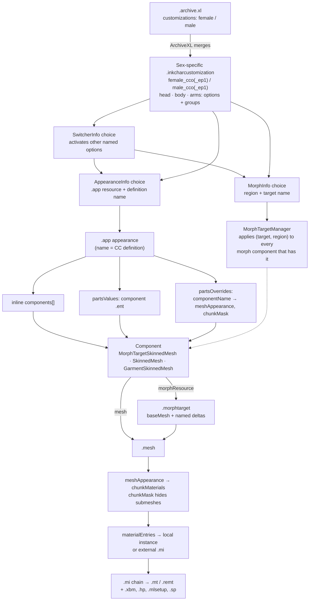
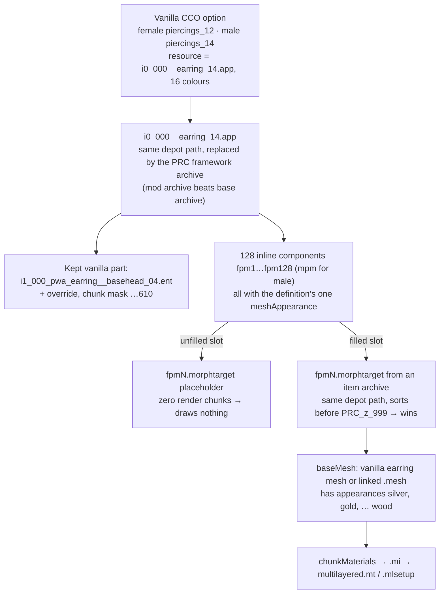

# Character-customisation file chain

**Maturity: Draft.** Consolidated and cross-checked for vanilla 2.31 female and male resources, ArchiveXL 1.27.3 source, one decoded 2.31 save and the implemented resolver's run on the reference installation. Not yet runtime-tested in the areas marked **[hypothesis]**. Evidence grades follow the [knowledge rules](README.md): **[source]** engine/framework/tool source, **[resource]** extracted game or mod resources, **[wiki]** Modding Docs text or image, **[runtime]** running game, **[hypothesis]** not yet established.

This page answers four questions for XF Studio agents:

1. How does a character-creator (CC) choice become geometry and materials? (render any V in the Studio viewport)
2. What options exist, and how are they identified? (expose every CC option as a Studio control)
3. How does a save store the choices? (later write-back and shareable CC presets)
4. How do mods add options? (our own eye-makeup selector via ArchiveXL/CCXL)

Material and shader internals (`.mt`/`.remt` templates, skin, hair, eye and decal shaders) are covered in [materials and shaders](materials-and-shaders.md); this page stops at "which material instance and which inputs".

## Evidence snapshot

| Source | Version | What it established |
|---|---|---|
| Installed game resources | 2.31 (resource `GameVersion` 2310). `female_cco`, `male_cco` and their `_ep1` twins; representative `.app`, player `.ent` and `.charcustpreset` files | Option lists, groups, links, `.app` → `.ent` → component wiring. Extracted with WolvenKit CLI 8.17.4 (`unbundle`, `convert serialize`) into ignored `research/consumers/cc-file-chain/`. SHA-256 of the four `.inkcharcustomization` resources are in the [option inventory](../research/character-customization/cc-option-inventory.json). |
| [Vanilla CCO evidence](../research/character-customization/vanilla-cco-evidence.md) | 2026-09-25 | Extraction steps, resource hashes and the detailed observations behind sections 2, 3, 6 and 7. |
| [CC option inventory](../research/character-customization/cc-option-inventory.json) | `xfs/cc-option-inventory-1`, generated from the above | Machine-readable, asset-free: every vanilla group, option, choice name, `.app` path, link family, preset and version-migration entry for both body genders; EP1 files as diffs. |
| ArchiveXL source | 1.27.3, commit `5474e34d` | CCXL merge, fixes, scopes, dynamic appearances ([merge boundary](../research/character-customization/ccxl-merge-boundary.md)). |
| WolvenKit source | commit `11720772` | Save node reader **and writer**, resource types (`gameuiCharacterCustomizationPreset`, `…UiPreset`, CC controller components). |
| Reference save | 2.31, save version 269, preset version 12 | One real female V: groups, resolved appearances, morphs ([save import](../research/eye-artistry/save-import.md)). |
| Modding Docs clone | `be2f44ee` | Documented relationships and editor screenshots ([wiki chain map](../research/character-customization/file-chain-map.md)); CCXL guides. |
| XF Studio character resolver | 2026-09-25, reference installation (MO2 route) | Resolves the reference save and PRC option 12 from data; reproduces the hand-traced chains and records every unproven precedence rule. [Validation](../research/character-customization/resolver-validation.md) |
| [Head CC render evidence](../research/character-customization/head-cc-render-evidence.md) | 2026-09-25, resolver at `afb474e` on four synthetic creator states (direct route) plus the reference save; one MO2 profile scanned for skin overrides | Material templates and key parameters of every head option, the skin type/tone split, decoded skin tint arithmetic, and how complexion mods take effect ([head CC rendering](head-cc-rendering.md)). |
| Legacy xf-omega generator | commit `28c822ea` (2025-08-10), design notes in the legacy `sx-cp2077` docs at `b139ccab` (2026-04-18) | The predecessor female eye-makeup CCXL generator. The reference save still contains three of its selections, so the game accepted its resources. Reference only: its lessons are summarised in [legacy lessons](#lessons-from-the-legacy-generator). |

## 1. The chain at a glance

Read the diagram top-down. The three option types branch differently: an **appearance** option names an `.app` and one of its definitions; a **morph** option names a morph target that is applied by `(target, region)` across components; a **switcher** only activates other options. An `.app` appearance can list components inline and/or pull them from component `.ent` files; both are overridden by name. Rendered and inspected: see [diagram review](#diagram-review).

### Naming conventions [resource]

Resource names are systematic, which makes a resolver and a human reviewer much faster. These meanings are inferred from consistent use across the extracted resources, not from CDPR documentation.

| Token | Meaning | Examples |
|---|---|---|
| `pwa` / `pma` | player woman / man, average build | `h0_000_pwa__morphs.morphtarget`, `player_man_average\` |
| `wa` / `ma` | woman / man (shared or NPC body) | `t0_000_wa_base__full_breast_big` |
| `h0_` | head skin mesh | `h0_000_pwa_c__basehead.mesh` |
| `he_` | eyes mesh (eyeballs **and** vanilla lashes as separate chunks) | `he_000_pwa_c__basehead.mesh` |
| `heb_` | eyebrows | `heb_000_pwa__morphs.morphtarget` |
| `hel_` | eyelash **appearance resource** (it re-uses the `he_` mesh) | `hel_000__basehead.app` |
| `ht_` | teeth and mouth interior | `ht_000_pwa__morphs.morphtarget` |
| `hx_` | head decals and overlays: makeup, freckles/blush, pimples, tattoos, scars, face cyberware, personal-link decal | `hx_000_pwa__morphs_makeup_eyes_01.morphtarget` |
| `hh_` / `hb_` | head hair / facial hair (beards) | `hh_000_pwa__hairs_059.app`, `hb_000_pma__big_beard.app` |
| `i0_` / `i1_` | intimate items (nipples, genitals, pubic hair) / head items (earrings) | `i0_000_base__genitals.app`, `i1_000_pwa__morphs_earring_01.morphtarget` |
| `t0_` / `tx_` | torso and full body / body tattoos | `t0_000_pwa_base__full.morphtarget`, `tx_000_pwa_base__full_tattoo_01` |
| `a0_` | arms, hands, nails, arm cyberware | `a0_000_base__nails.app` |
| `l0_` / `n0_` | legs and feet / FPP neck | `l0_000_base__cs_flat.app`, `n0_000_base_fpp__neck.app` |
| `_c__` | a `.mesh` (the "component" mesh) | `h0_000_pwa_c__basehead.mesh` |
| `__morphs` | a `.morphtarget` | `he_000_pwa__morphs.morphtarget` |
| `NN_xx_name` | skin tone: number, ethnicity family, name | `01_ca_pale`, `05_bl_espresso`; variant `01_ca_pale_00_warm_ivory` |

## 2. The `.inkcharcustomization` resource

Root type `gameuiCharacterCustomizationInfoResource` [resource] [source]. There is **one per body gender**, and the game ships two pairs:

| Resource | Head / body / arms options | Head / body / arms groups |
|---|---|---|
| `base\gameplay\gui\fullscreen\main_menu\female_cco.inkcharcustomization` | 405 / 73 / 32 | 10 / 7 / 18 |
| `base\gameplay\gui\fullscreen\main_menu\male_cco.inkcharcustomization` | 483 / 52 / 23 | 11 / 5 / 13 |
| `ep1\gameplay\gui\fullscreen\main_menu\female_cco_ep1.inkcharcustomization` | same option names as base; 34 head, 2 body option diffs | same names; reordered groups, two extra arms group entries |
| `ep1\gameplay\gui\fullscreen\main_menu\male_cco_ep1.inkcharcustomization` | same option names; 15 head, 1 body option diffs | TPP/TPP_photomode gain `eyelash_color` and pimples |

**The EP1 twin is the one in use when Phantom Liberty is installed.** The reference save's `tpp_head_face_rig` hash `14034739559546167190` equals FNV-1a64 of `ep1\characters\head\player_base_heads\appearances\head\face_rig\h0_000__basehead_face_rig_ep1.app`, a path only the `_ep1` resources reference [resource]. ArchiveXL's bundled fixes target all four paths [source: `bundle/source/resources/PlayerCustomization*Fix.xl`]. A resolver must therefore pick the pair that matches the installation, not assume the `base\` path. The diffs are small (skin-colour definition metadata with unchanged names, a few index and link fixes, male lash/pimple group membership, the EP1 face rig) and recorded in the inventory.

### Root fields

| Field | Content | Merged by ArchiveXL? |
|---|---|---|
| `headCustomizationOptions`, `bodyCustomizationOptions`, `armsCustomizationOptions` | Handles to options (below) | Yes |
| `headGroups`, `bodyGroups`, `armsGroups` | `gameuiOptionsGroup {name, options: CName[]}` | Yes, existing group names only |
| `perspectiveInfo` | `{name, fpp, tpp}` group pairs for body and arms (e.g. `holstered_strong` → `holstered_strong_fpp` / `_tpp`) | No |
| `uiPresets` | three named `.charcustpreset` resources: `corpo`, `nomad`, `street` | No |
| `excludedFromRandomize` | option names (genitals, pubic hair, etc.) | No |
| `version` | `12` (matches the save's preset version 12) | No |
| `versionUpdateInfo` | per-version option migrations for older saves, e.g. version 7 activates `hair_color_fpp_01` (definition `default`) wherever `hair_color1` is active, without replacing it | No |

Merge behaviour: [source] ArchiveXL `Extension.cpp` lines 254–332; see the [merge boundary](../research/character-customization/ccxl-merge-boundary.md).

### Option types [resource] [source]

All options share `name`, `index`, `defaultIndex`, `localizedName` (a localisation key such as `UI-CharacterCreation-eyes`), `uiSlot`, `link`, `linkController`, `editTags`, `hidden`, `enabled`, `randomizeCategory`, `censorFlag`, `censorFlagAction`, `onDeactivateActions`.

| Type | Extra fields | Choice list | What a choice points at |
|---|---|---|---|
| `gameuiAppearanceInfo` | `resource` (`.app`, soft), `useThumbnails` | `definitions[]`: `gameuiIndexedAppearanceDefinition {name, index, localizedName, color, icon (TweakDBID, e.g. OptionsIcons.BrownLiquorice), tags, actions, randomizationInfo}` | The `.app` appearance whose name equals `definition.name`. An empty resource plus definitions is a **colour-only controller** (`skin_color`). |
| `gameuiSwitcherInfo` | `uiSlots[]`, `switchVisibility` | `options[]`: `gameuiSwitcherOption {index, localizedName, names[], actions, tags}` | Other option names to activate (usually disabled options). One choice can activate several options at once, e.g. hairstyle N activates `hair_colorN` and `hair_color_fpp_N`. |
| `gameuiMorphInfo` | none | `morphNames[]`: `{index, localizedName, morphName}`; `None` means no morph | A morph target name. Region = option name. |

### Identity, and why indices are not identity

- **Option identity:** `name` within the head/body/arms list. Names are stable across base/EP1 [resource].
- **Choice identity:** `(option, definition name)` for appearances, `(region, morphName)` for morphs, `localizedName` for switcher choices. ArchiveXL merges choices on exactly these keys [source: `Extension.cpp` 465–557].
- **Indices are regenerated.** ArchiveXL rewrites every choice index after merging [source: `RegenerateIndexes`, lines 605–637], and vanilla itself contains duplicate option indices (`makeupEyes_09` and `_10` are both 460) [resource]. Never persist an index as identity. The Studio should match saves by `(app hash, definition)` and `(region, target)` as the [resolver contract](../research/character-customization/mod-source-resolution.md) already requires.

### Links: how one colour follows several options [resource]

`link` is a free-form key shared by a family of options. Options with `linkController = 1` are the ones the UI drives; followers with `linkController = 0` (usually `hidden`) receive the same **choice index**. Evidence: every member of a family has the same number of definitions, and the vanilla UI presets store equal values across the family.

| Link key | Controller(s) | Followers | Choices |
|---|---|---|---|
| `skin color` | `skin_color` (empty resource, 12 colour definitions) | 97 female / 72 male options: all `skin_type_0N`, head/neck proxies, face cyberware, facial tattoos, body, arms (every cyberware and holster variant), nipples, genitals, feet | 12 skin tones |
| `hairstyle` / `hairstyle color` | `hairstyle`, `hairstyle_cyberware` / every `hair_colorN` | FPP hair shadows | 51 styles / 35 colours |
| `eyebrows color` | each `eyebrows_colorN` | – | 35 colours |
| `beard color` (male) | each `beard_colorN_M` | – | 35 colours |
| `makeupEyes color`, `makeupLips color`, `makeupCheeks color`, `makeupPimples color`, `piercings color` | each style option | – | 14, 1–14, 4 or 16, 6, 16 |
| `makeupLips type` | `makeupLips`, `makeupLips_glossy`, `makeupLips_matte` | – | 38 lip styles per finish |
| `nails_color`, `nails_size` | `nails_color(_tpp)`, `nails_l` | `nails_color_fpp`, launcher/mantis nail variants, `nails_r` | 54 colours, 2 lengths |
| `breast_size`, `genitals_size`, `nipples type`, `body_tattoo`, `genitals hairstyle type`/`color` | the visible option(s) | FPP twins or the alternative anatomy options | – |

The wiki's [CC options page](https://github.com/CDPR-Modding-Documentation/Cyberpunk-Modding-Docs/blob/be2f44eed8419342ec13f72ed9cab008e9f7b289/for-mod-creators-theory/files-and-what-they-do/file-formats/character-creator/.inkcharactercustomization-cc-options.md) (manavortex and IslandDancer, 2025) states that `link` syncs a selection across options [wiki]. The vanilla UI preset `ui_preset_female_corpo.charcustpreset` stores `skin_color = 10` and the value 10 for `body_color`, `nipples_01`, `genitals_04`, every arm option and `neck`; `nails_color_tpp = nails_color_fpp = 31` [resource]. This is the strongest offline evidence for the link semantics; the exact propagation code is native and unread **[hypothesis for edge cases, e.g. followers with a different choice count]**.

EP1 anomaly [resource]: in `female_cco_ep1`, eye-makeup styles 21–36 carry the link key `LocKey#43269` instead of `makeupEyes color`, so under the link rule a colour chosen on styles 1–20 would not carry over to 21–36 (test ask 8).

Consequence for the Studio: choosing a skin tone is one control, but the renderer must apply that index to **every** linked option that is active, including tattoos and face cyberware whose colour follows skin tone.

### Slots, switchers and visibility [resource]

- A switcher's `uiSlots` name the slots whose content it swaps. `makeupLips_type` (slot `makeupLips_type`) → `makeupLips`/`_glossy`/`_matte` switchers (slot `makeupLips`) → 38 appearance options each (slot `makeupLips_color`). This is a three-level tree: finish → style → colour.
- Most target options are `enabled = 0` and become active only when a switcher choice names them. `hidden = 1` options never get their own UI row (proxies, FPP twins, colour followers).
- `switchVisibility` and `actions` exist on switchers and choices; vanilla actions are rare. [source] ArchiveXL does not copy `switchVisibility`, `hidden`, `enabled` or `linkController` onto an **existing** option during a merge, only onto a wholly new option.
- `editTags` = `NewGame`, `HairDresser`, `Ripperdoc`: which editing context may change the option (new game, mirror/hairdresser, ripperdoc) [resource]. Body skin colour is `NewGame`/`Ripperdoc`; makeup and hair add `HairDresser`.

### Groups: who consumes a choice [resource]

Groups do **not** define the UI; they tell each consumer which active options belong to it. The same option can sit in several groups (e.g. `eyes_color` is in `TPP`, `TPP_photomode` and `character_customization`).

| Group (head) | Contents | Consumer |
|---|---|---|
| `TPP`, `TPP_photomode` | head skin, eyes/eye colour, lashes, brows, teeth, facial tattoos, scars, pimples, morph regions, face rig | The third-person head (the head is an item in `AttachmentSlots.TppHead` [source: ArchiveXL `PuppetState/Handler.cpp:19`]); photo-mode puppet. Consumer wiring **[hypothesis]**. |
| `face` | face cyberware, piercings, eye/lip/cheek makeup | `gameuiCharacterCustomizationFaceController {groupName: face}` on the player entities [resource]. CCXL makeup, including the legacy selectors in the reference save, lands here. |
| `hairs`, `FPP_hairs` | hair style/colour; FPP shadow-only hair | `gameuiCharacterCustomizationHairstyleController {groupName: hairs}` |
| `beards` (male only) | beard options | `gameuiCharacterCustomizationBeardController` |
| `FPP`, `TPP_proxy`, `FPP_proxy` | FPP neck; low-detail head/neck proxies | FPP body; LOD/shadow proxies **[hypothesis]** |
| `character_customization` | nearly every head option | The creator preview puppet. The save duplicates choices here. |
| `finalSceneBruises` | `finalSceneBruises` (quest q307 beaten-up face) | `gameuiCharacterCustomizationBrokenNoseController {finalSceneGroup}` type exists [source]; quest-driven |

Body groups: `FPP_Body`/`TPP_Body` (perspective pair), `character_creation`, `genitals` and `breast` (consumed by `gameuiCharacterCustomizationGenitalsController {bottomBodyGroupName: genitals, upperBodyGroupName: breast}`), `lifted_feet`/`flat_feet` (`…FeetController`). Arms groups are holster/cyberware states (`holstered_default`, `holstered_strong`, `holstered_nanowire`, `holstered_launcher`, `holstered_mantis`, their `unholstered_*`, `personal_link_*`) consumed via `perspectiveInfo`, plus `nails` (`…NailsController`) and `…ArmCyberwareController`. Female arms groups are split `_tpp`/`_fpp`; male groups are not [resource].

## 3. From `.app` to pixels

### `.app` definitions [resource] [wiki]

Every vanilla CC `.app` holds **both** body genders' appearances, distinguished by name (`…pwa…`/`…pma…`, `female__…`/`male__…`, `w__`/`m__`) and `visualTags` (`Female`/`Male`). The CC definition name equals the appearance name. Typical definition:

- `partsValues[]`: one or more component `.ent` files, e.g. `…\appearances\entity\face_decals\hx_000_pwa__basehead_makeup_eyes_01.ent`.
- `partsOverrides[].componentsOverrides[]`: `{componentName, meshAppearance, chunkMask}` applied to that `.ent`'s components.
- `components[]`: inline components. In vanilla CC `.app`s they mirror the `partsValues` components with the overrides applied, but inline components can also be the only source of geometry (PRC and the legacy generator rely on this; see section 6). The [wiki chain map](../research/character-customization/file-chain-map.md) covers `partsValues`/`partsOverrides` screenshots and ArchiveXL's empty-`partResource` handling.

Three variant mechanisms appear, often combined:

| Mechanism | Used by | Evidence |
|---|---|---|
| **meshAppearance** selects material set | skin tones (`01_ca_pale`), eye colours (`gradient_green`), hair/brow/lash colours (`blonde_platinum__01`, `eyelashes__…`), makeup colours (`black_01`), lip finish (`black_01_02` glossy, `black_01_03` matte), piercing metals | [resource] |
| **chunkMask** selects submeshes | scars (one `scars_01` appearance; each scar is a different mask), eyes vs vanilla lashes (same `he_` mesh: eyes mask `…551614` hides chunk 0, lashes mask `…551609` hides chunks 1–2), earrings, body/feet | [resource]; the `he_` mesh has three chunks (12,393 / 668 / 152 vertices) per [native-eye intake](../research/eye-artistry/native-eye-preview-intake-gate.md) |
| **Different morphtarget / mesh** | makeup styles (`makeup_eyes_01…36`), tattoo designs, hairstyles, beards, cyberware variants | [resource] |

Makeup and decal `.app` overrides also name the head skin component `MorphTargetSkinnedMesh7243`, which the decal `.ent` does not own; its purpose is unknown **[hypothesis: harmless carry-over from a shared authoring template]**.

### Components [resource]

| Component type | Used for | Deformation |
|---|---|---|
| `entMorphTargetSkinnedMeshComponent` (`morphResource`) | head, eyes, brows, teeth, all head decals (makeup, tattoos, scars, cyberware), earrings, female body/breast, genitals, beards | Skinned **and** receives CC morph targets |
| `entSkinnedMeshComponent` (`mesh`) | hair, hair shadow meshes, FPP neck, seam-fix body pieces | Skinned only |
| `entGarmentSkinnedMeshComponent` (`mesh`) | arms, nails, nipples (FPP), feet, body scars/tattoos (male), censorship underpants | Skinned; participates in garment/visual-tag hiding ([ArchiveXL `VisualTags.xl`]) |
| `entAnimatedComponent` | face rig graph (`…paperdoll_sermo.animgraph`), hair dangle physics, genital dangle | Animation |

`entMorphTargetManagerComponent` on the player entity [resource] is the likely applier of the region/target pairs to all morph components **[hypothesis]**.

### Morph targets [resource] [wiki]

- `.morphtarget` = `baseMesh` reference plus an embedded geometry blob and `targets[]`, each `{name, regionName}`, e.g. `{h091, eyes}` [resource]. WolvenKit's GLB export names the shape keys `<name>_<region>` (`h091_eyes`), which is what the Studio's assets use; the head/plate master carries 105 female targets (5 regions × 21).
- Female morph options offer `None` plus 21 targets per region (`h011`…`h211` for eyes, `h0N2` nose, `h0N3` mouth, `h0N4` jaw, `h0N5` ear); male offers 20 (`…h201`) [resource]. The last digit encodes the region.
- **Every component that follows the face carries matching targets, but only for the regions it needs**: head and brows carry all 105; eyes and lashes the 21 `eyes` targets; a vanilla earring placeholder the 21 `ear` targets; a nose ring the 21 `nose` targets; a PRC linked-mesh ring all 105 [resource]. The pair `(target, region)` is the key, and the save stores both. A component without a region's targets simply does not follow that slider **[hypothesis; consistent with every inspected resource]**.
- **The eyes follow the eye shape through their own morph resource.** The installed eye entity `he_000_pwa__basehead.ent` binds `he_000_pwa__morphs.morphtarget` (21 `eyes` targets, `baseMesh` = `he_000_pwa_c__basehead.mesh`), separate from the head's `h0_000_pwa__morphs.morphtarget`; both carry the pair `{h091, eyes}` and the other 20, and the 34 joint matrices the two `h091` targets share are identical [resource] ([experiment 015 trace](../experiments/015-native-eye-assembly/source-graph-trace.md)). A shape moves the eyeball, lash and wetness chunks by up to about 4 mm. XF Studio's derived preview applies each eye-shape choice to every mesh carrying that `(target, region)` pair (`src/face-morphs.ts`); with the eyes left static, 18 of the 21 shapes left the eyeball showing through 35–354 of the 680 lid/socket rim vertices; with the eye targets, 14 shapes are within one vertex of the neutral assembly's 12, the worst is 41 (`h121`), and `h181`/`h191` rise from 3/7 to 16/19 (offline, derived 2.31 assets, nearest-vertex signed-gap proxy) [resource; game rendering not compared].
- **Resource order is not option order.** The `eyes` option's `morphNames` (`None`, `h011` … `h211`) follow the morph resources' target order, but the vanilla female `nose` option lists `h112` after `h162` [resource]. Choice identity is the `(region, target)` pair; a selector must take its order and labels from the merged CCO, never from a mesh. The creator's choice labels are two-digit positions (`localizedName` `01` = `None`, `10` = `h091`) [resource].
- The [morphtarget guide](https://github.com/CDPR-Modding-Documentation/Cyberpunk-Modding-Docs/blob/be2f44eed8419342ec13f72ed9cab008e9f7b289/for-mod-creators-theory/3d-modelling/morphtargets.md) (no page author evidenced) says the engine activates targets by name and region, face regions blend together while chest size is exclusive, and mods cannot add new activation names, only reuse existing ones [wiki].
- **Facial rigs.** Each head `.app` uses a face-rig component; the game ships 22 female and 21 male per-shape skeleton rigs, and the [NPV rig guide](https://github.com/CDPR-Modding-Documentation/Cyberpunk-Modding-Docs/blob/be2f44eed8419342ec13f72ed9cab008e9f7b289/modding-guides/npcs/fixing-eye-clipping-in-npvs-by-replacing-facial-rigs.md) (saltypigloaf, 2025) reports that vanilla V always uses rig 000 whatever the sliders, a known cause of eye clipping that community rig-fix mods address [wiki]. The Studio's saved-head morph binds should account for this ([brow idle gap](../research/animation/brow-idle-gap.md), experiments 012/015).
- **Exporting a morph target with its rig.** WolvenKit resolves a `.morphtarget`'s `baseMesh` itself: CLI `uncook` of the morph target from the game archives (or `export … -gp <game>` of an extracted copy) writes a bone-bound GLB with the base mesh's skin (254 joints, two four-influence sets for the female head) and every target as a shape key. No custom exporter is needed. CLI 8.17.4 reproduces experiment 012's bound head byte for byte; 9.0.1 gives identical positions, UVs, influences and morph deltas but gives joint nodes rest rotations with matching inverse binds, so rest deformation is identical [resource] ([experiment 013](../experiments/013-native-preview-core/README.md)). The export keeps native vertex and triangle order, so the eye plate recipe's native face IDs select the same rows in the GLB [resource].
- Body morphs: `breast` (female: `t0_000_wa_base__full_breast_small` / none / `_big`), `nails_l`/`nails_r` (long nails), `penis_base`/`penis_circumcised` size. There is **no vanilla body-shape slider** beyond these.

### Meshes and materials

`meshAppearance` → `chunkMaterials` names → `materialEntries` (local buffer or external `.mi`) → `.mi` chain → template. Resolved examples: skin → `skin.mt` with a four-level `.mi` chain ([saved skin chain](../research/eye-artistry/saved-skin-resource-chain.md)); teeth → `teeth_base.mi` → `skin.mt` with its own skin profile; hair → `hair.mt` + `.hp` profile ([hair profile](../research/eye-artistry/saved-hair-profile-resolution.md)); brows → `mesh_decal_double_diffuse`-family instance with a gradient ([brow audit](../research/eye-artistry/brow-texture-audit.md)); eye makeup → `makeup_NN_<colour>.mi` → `makeup_color__NN_<colour>.mi` → `mesh_decal.mt` on one shared mesh for all 36 styles; lipstick → `mesh_decal_double_diffuse` or `mesh_decal` depending on the style; cheeks, pimples, scars, facial tattoos, face cyberware and male stubble → `mesh_decal`; piercings → `multilayered.mt`; the eye mesh's third chunk (wetness) → `eye_shadow.mt` [resource]. The per-option templates, key parameters and chunk roles are tabulated in [head CC rendering §1](head-cc-rendering.md#1-every-head-option-at-a-glance). Shader behaviour: [materials and shaders](materials-and-shaders.md).

## 4. Every CC detail, and what drives it

Female and male names differ only where stated. "Opt" is the option type (A = appearance, S = switcher, M = morph). All counts are vanilla 2.31 [resource]; per-option detail is in the [inventory](../research/character-customization/cc-option-inventory.json). The wiki's [CCXL overview](https://github.com/CDPR-Modding-Documentation/Cyberpunk-Modding-Docs/blob/be2f44eed8419342ec13f72ed9cab008e9f7b289/for-mod-creators-theory/core-mods-explained/archivexl/archivexl-character-creator-additions/README.md) has a matching table of vanilla `uiSlot` names and option types [wiki]. Its [character-creator cheat sheet](https://github.com/CDPR-Modding-Documentation/Cyberpunk-Modding-Docs/blob/be2f44eed8419342ec13f72ed9cab008e9f7b289/for-mod-creators-theory/references-lists-and-overviews/cheat-sheet-character-creator.md) (last updated January 2025) lists fewer choices than the 2.31 resources (e.g. eye makeup 1–20 against 36 styles, lip styles 1–20 against 38, face cyberware 1–8 against 16); the resource counts are current, but which choices the UI actually shows is test ask 9.

| Detail | Options (type) | `.app` / resources | Variant mechanism | Notes |
|---|---|---|---|---|
| **Skin tone** | `skin_color` (A, colour-only, 12 tones, controller of `skin color`) | none of its own; drives every linked option | Linked index → each follower's meshAppearance. On the head the tone is **only** the material chain's `TintColor`/`TintScale` (multiply, or overlay when the scale is negative); the albedo comes from the skin type ([head CC rendering §2](head-cc-rendering.md#2-skin-type-tone-and-the-complexion-texture-set)) | Tones: `01_ca_pale`, `01_ca_pale_00_warm_ivory`, `02_ca_limestone`, `02_ca_limestone_00_beige`, `03_ca_senna`, `03_ca_senna_00_amber`, `_01_honey`, `_02_band`, `04_ca_almond`, `04_ca_almond_00_umber`, `05_bl_espresso`, `06_bl_dark`; same for both genders |
| **Skin type** (complexion) | `skin_type` (S, 5) → `skin_type_01…05` (A, 12 defs each) | `h0_000__basehead.app`, `…_d02…d05.app` → `h0_000_pwa__basehead.ent` → `h0_000_pwa__morphs.morphtarget` → `h0_000_pwa_c__basehead.mesh` | Different `.app` per type; the head mesh has 60 local materials, one per (tone, type), whose `Albedo` is the type's `h0_000_pwa_c__basehead_d0N.xbm` | Chain to textures: [saved skin chain](../research/eye-artistry/saved-skin-resource-chain.md) |
| **Facial morphs** (eyes, nose, mouth, jaw, ears) | `eyes`, `nose`, `mouth`, `jaw`, `ear` (M, 21/20 targets + None) | head and all face-following morphtargets | Named morph target per region | No separate cheek/brow sliders in vanilla |
| **Eye colour** | `eyes_color` (A, 71) | `he_000__basehead.app` → `he_000_pwa__morphs.morphtarget` (21 eye targets) | meshAppearance (e.g. `gradient_brown`), chunk 0 hidden | ArchiveXL remaps this app to `archive_xl\…\he_000_pwa__basehead.app` and adds `@eyes` material names [source]; mod example: [modded eye resolution](../research/eye-artistry/modded-eye-resolution.md) |
| **Eyelashes** | `eyelash_color` (A, 35 colours) | `hel_000__basehead.app` re-uses the **eye** component `he_000_pwa__basehead` | meshAppearance `eyelashes__<colour>` with chunks 1–2 hidden | No lash *style* option in vanilla; CCXL lash mods add styles ([head details](../research/eye-artistry/head-details.md)) |
| **Eyebrows** | `eyebrows` (S, 14 choices: 13 styles plus `eyebrows_color0`, which has no resource) → `eyebrows_color1…13` (A, 35 colours each, link `eyebrows color`) | `heb_000__basehead_NN.app` → `face_decals\heb_000_pwa__basehead.ent` → `heb_000_pwa__morphs.morphtarget` (105 targets) | One `.app` per style; colour by meshAppearance (`<colour>__NN`) | ArchiveXL remaps to per-sex `archive_xl\…\heb_000_pwa__basehead_NN.app` [source] |
| **Hair style + colour** | `hairstyle` (S, 51) → `hair_colorN` (A, 35 colours, tags e.g. `brown_liquorice`) + `hair_color_fpp_N` (A, hidden shadow); `hairstyle_cyberware` twin when face cyberware changes the scalp | `hh_NNN_pwa__hairs_XXX(.app)` → `entity\hairs\…ent` → hair `.mesh` (e.g. `hh_033_wa__player.mesh`) + shadow mesh + dangle animgraph | meshAppearance = colour name → material with `.hp` profile | Hair colour tags are appended to TweakDB `ItemFactory.HairColors.hairColors` by ArchiveXL for CCXL colours [source]; the reference save's `tags` are `ash_brown` and `Short`, i.e. the colour tag plus a length tag **[hypothesis: derived from the hair choice]** |
| **Beard** (male) | `beard` (S) → `beard0…12` (S, per-style colour lists) → `beard_colorN_M` (A, 35 colours) | `facial_hairs\hb_000_pma__*.app` → beard morphtarget + `beard_shadow_01` | Two-level switcher; colour by meshAppearance with `@beard` dynamic names [source: `PlayerCustomizationBeardFix.xl`] | Group `beards` |
| **Eye makeup** | `makeupEyes` (S, Off + 36) → `makeupEyes_01…36` (A, 14 colours) | `makeup_eyes\hx_000__basehead_makeup_eyes_NN.app` → `face_decals\hx_000_pwa__basehead_makeup_eyes_NN.ent` → `hx_000_pwa__morphs_makeup_eyes_NN.morphtarget` | Style = resource; colour = meshAppearance (`black_01`) | Group `face`. The XF Studio product target |
| **Lipstick** | `makeupLips_type` (S: none / regular / glossy / matte) → `makeupLips`, `_glossy`, `_matte` (S, 38 styles) → 114 style options (A, 1–14 colours) | `makeup_lips\hx_000__basehead_makeup_lips_NN(_02/_03).app` → one `hx_000_pwa__morphs_makeup_lips_01.morphtarget` | Finish = `.app` suffix and meshAppearance suffix `_02`/`_03`; style/colour by meshAppearance | Named NPC looks (`nicola`, `trauma`, `mox`, …) are single-colour styles; regular-finish styles 30–38 have no edit tags |
| **Cheeks / freckles / blush** | `makeupCheeks` (S, Off + 24) → `makeupCheeks_01…24` (A: 1–4 freckles, 4 colours; 5–24 blush `makeup_cheeks_01…20`, 16 colours) | `makeup_freckles\hx_000__basehead_makeup_{freckles,cheeks}_NN.app` → `hx_000_pwa__morphs_makeup_freckles_01.morphtarget` | Style = resource; colour = meshAppearance | Group `face` |
| **Pimples / blemishes** | `makeupPimples` (S) → `makeupPimples_01…03` (A, 6) | `pimples\hx_000__basehead_pimples_01.app` | meshAppearance + chunkMask | Group `TPP` |
| **Facial tattoos** | `facial_tattoo` (S, Off + 15) → `facial_tattoo_01…15` (A, 12 tones, link `skin color`); legacy hidden `tattoo` (A, 7) | `tattoos\hx_000__tattoo_NN.app` → `entity\tattoo\hx_000_pwa__tattoo_NN.ent` → tattoo morphtarget | Design = resource; **colour follows skin tone** (meshAppearance `01_ca_pale`) | |
| **Face scars** | `scars` (A, Off + 13) | `hx_000__scars.app` → `hx_000_pwa__morphs_scars_01.morphtarget` | Same meshAppearance, **different chunkMask per scar** | |
| **Face cyberware** | `cyberware` (S, Off + 16) → `cyberware_01…16` (A, 12 tones) | `hx_000__cyberware.app` (386 appearances) → `entity\cyberware\hx_000_pwa__cyberware_NN.ent` | Design = component; tone = linked meshAppearance | Switcher choice also swaps `hairstyle` ↔ `hairstyle_cyberware`. Since patch 2.2, options 8–16 are appearances inside other decal meshes (e.g. `makeup_eyes_01.mesh` carries `cyberware_01`), per the [head cheat sheet](https://github.com/CDPR-Modding-Documentation/Cyberpunk-Modding-Docs/blob/be2f44eed8419342ec13f72ed9cab008e9f7b289/for-mod-creators-theory/references-lists-and-overviews/cheat-sheet-head/README.md) [wiki]. In 2.31 the resolver also finds this for lower-numbered choices (option 03 draws the freckle mesh's `cyberware_04`), and the appearances exist in the player meshes, contrary to the sheet's warning [resource] |
| **Piercings** | `piercings` (S, Off + 14 female, Off + 16 male) → `piercings_NN` (A, 16 metals/colours) | `piercings\i0_000__earring_NN.app` → up to three `entity\items\i1_000_pwa_earring__basehead_0N.ent` + morphtargets | chunkMask per style, meshAppearance per colour | [Vanilla piercing preview](../research/jewellery/vanilla-piercing-preview.md) |
| **Teeth** | `teeth` (A, 5: default, silver, gold, …) | `ht_000__basehead.app` → `ht_000_pwa__basehead.ent` → `ht_000_pwa__morphs.morphtarget` | meshAppearance | Mouth *shape* is the `mouth` morph, not this option |
| **Neck / proxies / face rig** | `neck`, `tpp_head_proxy`, `fpp_head_proxy` (hidden, `skin color`), `tpp_head_face_rig`, `…_photomode` | `n0_000_base_fpp__neck.app`, `proxy\h0_000__basehead_proxy.app`, `face_rig\h0_000__basehead_face_rig(_ep1).app` (animgraph + facial anims) | – | Not user-visible; required for a full in-game assembly |
| **Body skin** | `body_color`, `fpp_body_color` (+ `_censored`) (A, 12, hidden, `skin color`) | `t0_000_base__full.app` → female `t0_000_pwa_base__full.morphtarget`; male `t0_000_pma_base__full.mesh` | Tone by meshAppearance; chunkMask hides regions | |
| **Breast size** (female) | `breast` (M: small / none / big) | `t0_000_pwa_base__full.morphtarget` targets | Morph | Group `breast`, genitals controller |
| **Nipples** | `nipples` (S) → `nipples_01…04` female, `_01…02` male (A, 12 tones) + FPP twins | `i0_000_base__nipple.app`, `i0_000_fpp__nipple.app` | Tone link | |
| **Genitals and pubic hair** | `genitals` (S, 4 combinations of `genitals_0N` + `penis_*` size morph + `*_hairstyle` switcher) | `i0_000_base__genitals.app` (88 appearances, both anatomies), `i0_000_base__genitals_hairstyle_NN.app` | Tone link; size morphs; hairstyle colour link | Available to both body genders; excluded from randomise; censorship options (`underpants`, `*_censored`) |
| **Body tattoos / scars** | `body_tattoo` (S, Off + 7) + FPP twin; `body_scars` (S, 3 choices over 5 options) | `t0_000_base__tattoo_NN.app`, `t0_000_fpp__tattoo_NN.app`, `scars_000_base.app` | Tone link; scars by chunkMask | Female body tattoos are morph-skinned; male ones garment meshes |
| **Feet** | `lifted_feet`, `flat_feet` (A, hidden, tone) | `l0_000_base__full.app`, `l0_000_base__cs_flat.app` | Tone link, chunkMask | Chosen by footwear (feet controller), not by the player |
| **Nails** | `nails_l`/`nails_r` (M, long/short) + `nails_color(_tpp/_fpp)` (A, 54: plain, `…__multilayer` designs) | `a0_000_base__nails.app`, `a0_000_fpp__nails.app` | Morph length; colour/design by meshAppearance | Arms part; `nails` group |
| **Arms and arm cyberware** | ~25 hidden arm options per holster/weapon state (A, 12 tones) | `a0_000_*` and `arms\<cyberware>\…app` | Tone link; state chosen by equipped cyberware via `perspectiveInfo` groups | Not a CC choice beyond tone |

## 5. How ArchiveXL/CCXL extends the lists

Details and line references: [CCXL merge boundary](../research/character-customization/ccxl-merge-boundary.md) and [catalogue probe](../research/character-customization/catalog-prototype.md). Summary [source] ArchiveXL 1.27.3:

1. **Registration.** An `.xl` lists `customizations: {female: [...], male: [...]}`. ArchiveXL prefetches each resource and merges it into the loaded base male or female resource (`MergeCustomEntries`). There is no male/female sharing: a mod that supports both body genders registers two resources (e.g. `*_pwa` and `*_pma`).
2. **Fixes first.** `FixCustomizationOptions` applies `resource.fix.paths` to base options before any mod merge: e.g. vanilla `he_000__basehead.app` → `archive_xl\…\he_000_pwa__basehead.app`, `heb_000__basehead_NN.app` and `hel_000__basehead.app` likewise. Each remap registers an app override so saved descriptors using the old path still resolve.
3. **Groups.** Group entries are appended only to existing groups with the same name; a new group name is ignored.
4. **Named options** merge into the same-named, same-typed option (definitions by `name`, morphs and switcher choices by `localizedName`), otherwise the whole option is appended. A new option may carry any metadata; a merge into an existing option does not change its top-level metadata.
5. **Anonymous overlays** (no `name`) target existing options by `uiSlot` and/or `link`, with `*` suffix wildcards, in a second pass. Source note: the link-wildcard flag is computed from the slot string (`Extension.cpp:379` reads `sourceSlotStr`), so a link-only wildcard does not appear to take effect **[source reading; not runtime-tested]**.
6. **App overrides.** When a merged definition's option names a different `.app` than the target option, ArchiveXL records `(target app, definition) → (mod app, definition)` and rewrites appearance descriptors at `OnGetAppearances`/`OnChangeAppearance(s)`. This is why a saved choice can carry the **vanilla-option-associated** app hash yet render from a mod app (see the Unique Eyes example in the catalogue probe).
7. **Dynamic customization appearances.** `FixCustomizationAppearance` clones a template appearance inside the `player_customization.app` scope for a missing requested name; the suffix after `__` becomes the mesh appearance. Combined with mesh `names`/`context` fixes (`@eyes`, `@lashes`, `@beard`, `@cap`, `@dread`), one template can serve many colours. The [scopes and extensions guide](https://github.com/CDPR-Modding-Documentation/Cyberpunk-Modding-Docs/blob/be2f44eed8419342ec13f72ed9cab008e9f7b289/for-mod-creators-theory/core-mods-explained/archivexl/archivexl-character-creator-additions/ccxl-theory-scopes-and-extensions.md) (manavortex) illustrates the makeup variant: an `@context` material naming `MakeupBaseMaterial`, an `@makeup` material pointing at `*…\{material}.mi`, and one small colour `.mi` per colour; it warns that several styles in one mesh block later colour extension [wiki].
8. **Indices** are regenerated; hair-colour tags go to the TweakDB flat.
9. **Removal.** ArchiveXL can remove every custom entry it registered (`RemoveCustomEntries`) [source]; whether the game calls this on reload is runtime behaviour **[hypothesis]**.

XF Studio's single eye-makeup selector (one switcher with Off and complete-look choices in the `face` group) follows this model; see [experiment 005](../experiments/005-preset-collection/README.md) and the [ArchiveXL strategy](../research/archive-xl/eye-artistry-strategy.md).

## 6. Case study: why PRC piercings work in game

eagul's PRC Fully Modular Jewellery Framework predates CCXL and uses **no** `.xl`, `.inkcharcustomization`, TweakXL record, script or ArchiveXL feature [resource: archive listing in the [PRC inventory](../research/jewellery/prc-inventory.md)]. It works purely by replacing files that vanilla already reads. Once the Studio interprets archives the way the game does, PRC support is a side effect, not an adapter.

| Step | Mechanism | Grade |
|---|---|---|
| 1. Option | Vanilla female `piercings_12` and male `piercings_14` both point at `i0_000__earring_14.app` with 16 colour definitions. The author's "option 12 for female, 14 for male" is simply this vanilla mapping (the female list skips `earring_12`/`13`). | [resource] |
| 2. `.app` replacement | `PRC_z_999_Framework_128.archive` contains the same depot path `base\characters\head\player_base_heads\appearances\head\piercings\i0_000__earring_14.app`. A mod archive's copy of a path wins over the base game's. | Tool sources (WolvenKit's resolver and ArchiveXL's archive groups put mods first) plus the mod working for users; native engine rule not read **[source + community runtime]** |
| 3. Kept vanilla geometry | Each of the 32 appearances keeps vanilla style 12's `partsValues` part and override, with chunk mask changed from `…612` to `…610`. Selecting option 12 shows that vanilla piece plus the bank. | [resource] |
| 4. Slot bank | Each appearance adds 128 `entMorphTargetSkinnedMeshComponent`s directly to `components[]` (`fpm1`…`fpm128` female, `mpm…` male), each referencing `eagul\piercingmorphs\female\fpmN.morphtarget`. Inline components are part of the appearance just like `partsValues` components. | [resource] [wiki: `.app` guide, `components`/`partsValues`] |
| 5. Empty slots | The placeholders are byte-identical morph targets (based on vanilla `i1_000_pwa_c__basehead_earring_01.mesh`, 21 `ear` targets) whose embedded geometry has **zero render chunks**, so an unfilled slot renders nothing. | [resource] (SHA-256 `417b1ff3…` for `fpm1`, `fpm9`, `fpm50` placeholders) |
| 6. Filling a slot | Item archives such as `PRC_f_72_nostril_ring_right_1.archive` ship the same depot path `…\fpm72.morphtarget` with real geometry. They win because `PRC_f_…` sorts before `PRC_z_999_…` under the default first-alphabetical-wins archive order. | [source: MO2 Cyberpunk guide and plugin] **[hypothesis for the native engine order]** |
| 7. Shared colour | Every one of the 128 components in a definition uses the **same** `meshAppearance` (`silver`, `gold`, `plastic_black`, `cooper`, …, `wood`). Each item's base mesh must define mesh appearances with those names; its `chunkMaterials` then choose per-submesh materials (the nose stud's second chunk is always `default__02` → `base\eagul\mat_1.mi` → silver `.mlsetup`). Hence one colour choice for all installed items. | [resource] ([PRC catalogue audit](../research/jewellery/prc-catalog-audit.md)) |
| 8. Following the face | Item morph targets carry region targets matching the CC morph names (a nose ring the 21 `nose` targets, a linked-mesh ring all 105), so face sliders move them like vanilla piercings. | [resource] + **[hypothesis: manager applies by (target, region)]** |
| 9. Save | The save stores `(FNV-1a64 of earring_14.app, i0_000_pwa__earring__NN_colour)` in the `face` group, identical to vanilla option 12. Uninstalling PRC reverts to vanilla style 12 with no broken reference. | [resource: save structure] **[hypothesis: behaviour after uninstall]** |

Limits that follow from the design: one colour for every item; slot numbers collide between packs (three septum packs all use `fpm17`); a pack's slot is only visible if its archive wins; vanilla style 12 cannot be used on its own while PRC is installed.

What the Studio needs from this: nothing PRC-specific. The generic rules in [section 8](#8-generic-resolver-specification) — archive precedence, inline plus `partsValues` components, zero-chunk geometry, mesh-appearance lookup on each component's own base mesh, and resolving `baseMesh` through the **same** mount set — produce the PRC result, and the implemented resolver does so on the reference installation ([validation](../research/character-customization/resolver-validation.md#prc-as-vanilla-piercing-option-12)).

## 7. How a save stores CC choices

Full format and reader: [save import](../research/eye-artistry/save-import.md). Summary:

- Node `CharacetrCustomization_Appearances` (engine spelling): `dataExists`, an unknown `u32`, preset `version` (12), `isMale` (body gender), `isBrainGenderMale` (voice), then head, arms and body **group lists**, `perspectiveInfo` and `tags` [source: WolvenKit `CharacterCustomizationAppearancesParser.cs`].
- Each group is `{name, appearances[{resourceHash u64, definition, name (option name), censorFlag, censorFlagAction}], morphs[{region, target, censorFlag, censorFlagAction}]}`.
- `resourceHash` = FNV-1a64 of the lower-case `.app` depot path. Verified for teeth, lip, cheek, neck and EP1 face-rig entries of the reference save [resource].
- **The save stores resolved output, not UI state.** It lists, per consumer group, the active appearance options with their chosen definition, and the non-`None` morphs. It does not store switcher choices, link indices or colour-only controllers (`skin_color` never appears; its choice is visible only as the definition of `skin_type_05`, `body_color`, arms and so on). The same choice is repeated in every group that contains the option: in the reference save, eye colour appears in `TPP`, `TPP_photomode` and `character_customization`.
- By contrast, the vanilla **UI preset** `.charcustpreset` (`gameuiCharacterCustomizationUiPreset`) stores the **index state**: `{optionName, isActive, value}` for every option, `value = 0xFFFFFFFF` when unset, plus `isMaleVO` [resource] [source]. WolvenKit also registers `.ccstate` as a `gameuiCharacterCustomizationPreset` resource, the same type as the save node [source: `FileTypeHelper.cs`].

### Writing back: what is known

| Known | Unknown |
|---|---|
| WolvenKit has a byte-level **writer** for this node and a whole-save writer (`CyberpunkSaveWriter`) [source]. The layout is simple length-prefixed strings and integers. | Whether the game rebuilds the editable CC state (for the mirror/ripperdoc) from the stored appearances, or trusts them as-is. A write that changes only one group could render inconsistently between TPP, photo mode, FPP and the creator. |
| The Studio reader decodes the node completely with zero trailing bytes; no Studio writer exists. | Whether `version` differences trigger `versionUpdateInfo` migration on load. |
| Consistency rules can be derived offline: for a chosen UI state, every group containing an active option must list it with the same definition, and linked followers must use the linked index. | How censor flags, `Unknown1`, `isBrainGenderMale` and tags (hair colour and length) are validated. |
| Removing a mod leaves unresolvable hashes; ArchiveXL maps some old paths through app overrides. | How the game treats an entry whose app hash or definition no longer exists (drop, default, or corrupt). |

The safe order is: generate the complete group set from an option state using the effective CCO, write to a copy, re-read with both the Studio reader and WolvenKit, then verify in game. CC presets for sharing should store the **UI state** (option names + choice identities, like `.charcustpreset` but by name rather than index) and derive the save representation, not the reverse.

## 8. Generic resolver specification

Principle: the Studio interprets game files the way the game and its core frameworks do. Vanilla piercings, PRC, CCXL packs, hair-colour packs and future mods must all resolve from data through the same rules; there are no mod-specific adapters. Where a rule is not yet proven, the resolver reports the uncertainty instead of guessing.

**Status: phase 1 implemented** in `projects/xf-studio/authoring/src` (`character-resolver.ts` and the pure modules it uses; host adapter `resolver-host.ts`; CLI `tools/resolve-character.ts`). It reproduces the hand-traced eyes, hair, brows, lashes, skin and PRC chains of the reference installation from data alone; see the [resolver validation](../research/character-customization/resolver-validation.md). Archive precedence and ArchiveXL semantics are consolidated in [mod loading](mod-loading.md). No Studio UI consumes it yet.

### Inputs

1. **Installation view:** base game `archive/pc/content`, `archive/pc/ep1` (if present), `archive/pc/mod`, the ArchiveXL bundle directory, plus the mod manager's virtual view (MO2 profile with overwrite, or manual files). Vortex and REDmod are later adapters. [Source discovery](../research/authoring/source-discovery-foundation.md) enumerates the files; `resolver-host.ts` reads RDAR indexes and extracts resources with WolvenKit CLI into an ignored JSON cache.
2. **Framework declarations:** every visible `.xl` in ArchiveXL's load order (`customizations`, `resource.scope`/`fix`/`patch`/`copy`/`link`). TweakXL records are presentation only (R11) and not read yet.
3. **Character input:** a decoded save node (`inputFromSave`) or a UI option state (`descriptorsFromUiState`: option → definition, morph or switcher choice).

### Rules, in application order

| # | Rule | Implemented from | Status and grade |
|---|---|---|---|
| R1 | **Archive precedence.** MO2 virtual path first (overwrite, then the first `modlist.txt` row); then the mod group (visible `archive/pc/mod/modlist.txt`, else first-alphabetical), the ArchiveXL bundle group, EP1, content. Every candidate is kept. | [Mod loading §1–2](mod-loading.md#1-the-stages-in-order) | **Implemented** (`archive-precedence.ts`). Tool-source rules [source]; the native engine order is unread, so every mod-over-base, base-internal and collation-sensitive decision carries an ambiguity record |
| R2 | **CCO selection.** Body gender picks the male or female CCO; the `_ep1` twin when EP1 archives are mounted. | Save face-rig hash (section 2) | **Implemented** (`ccoPath`). [resource]; confirm with a male EP1 save |
| R3 | **ArchiveXL resource metadata:** scopes (transitive), fixes (`paths`, mesh `names`, `context`), copies and links (rejected over existing paths), patches of meshes, morph targets and `.app` definitions. | ArchiveXL `ResourceMeta`, `ResourceLink`, `ResourcePatch` | **Implemented** (`archivexl-config.ts`, `resource-graph.ts`) [source]. `.ent` patches (R6b) and `!exclude` tags not yet |
| R4 | **CCO merge:** fix base option paths (registering app overrides), then per custom resource: groups, unnamed expansion, named options, a second pass for anonymous `uiSlot`/`link` overlays; regenerate indices; collect hair-colour tags. | ArchiveXL `Customization/Extension.cpp` 254–637 | **Implemented** (`cco-model.ts`), including the link-wildcard quirk [source] |
| R5 | **State → descriptors.** From a UI state: activate switcher targets, propagate link indices from controllers to followers, emit `(app, definition)` and `(region, target)` per group. From a save: the stored descriptors. | Section 2; vanilla UI presets | **Implemented, simple rule.** Links [resource-inferred]; a follower with fewer choices keeps its default and records `link-index-out-of-range` **[hypothesis]** |
| R6 | **Descriptor → appearance.** Apply app overrides; load the winning `.app`; pick the appearance by name; if absent and in the `player_customization.app` scope, build ArchiveXL's dynamic appearance. | ArchiveXL `ApplyAppOverride`, `FixCustomizationAppearance` | **Implemented** [source] |
| R6b | **Always-on entity additions** through `.ent` patches of the player entities. | [wiki] facial cyberware guide; ArchiveXL `PlayerBaseScope.xl` | Not implemented |
| R7 | **Appearance → components.** Inline components (compiled package first) ∪ components of each existing `partsValues` `.ent` (missing parts dropped, as ArchiveXL does); `partsOverrides` by component name; in the customization scope, ArchiveXL's first-override mesh appearance on the appearance's own mesh components. | [wiki] `.app` guide; ArchiveXL `FixCustomizationComponents`, Garment `OnResolveDefinition` | **Implemented.** Same-named inline and part components are treated as one; several same-named components in one appearance are all kept and flagged **[hypothesis]** |
| R8 | **Component → geometry.** Morph targets after patches (a copied or patched blob counts), then `baseMesh` through the same mount set; zero render chunks draw nothing; the chunk mask selects visible chunks. | PRC placeholders; head details; PRC preview | **Implemented** (provenance and chunk counts; no GLB export) [resource] |
| R9 | **Morphs.** Apply each `(target, region)` to every morph component whose `targets[]` contain it. | Save + morph resources | **Implemented** as a report of which components each pair reaches; manager semantics **[hypothesis]** |
| R10 | **Materials.** Mesh appearance (with patches, `names` fixes and expansion) → chunk material → target entry, patch-mesh entry or `@template` → instance chain to `.mt`/`.remt`, with `@context` parameters and `*{attr}` path expansion; effective parameters nearest-first. | ArchiveXL `Mesh` extension; [materials and shaders](materials-and-shaders.md) | **Implemented** to the template and resource parameters; shader semantics are not interpreted [source] |
| R11 | **Presentation only (TweakXL):** icons and localisation keys. | Legacy generator; vanilla definitions | Not implemented [resource] |
| R12 | **Later, full body:** visual-tag hiding, garment offsets, feet/genital controllers. | ArchiveXL `VisualTags.xl` | Deferred |

### Output: a renderable description

`ResolvedCharacter` (`character-resolver.ts`, schema `xfs/resolved-character-1`) lists one entry per unique saved or derived `(option, definition)` with the groups that use it, the requested and effective `.app` (with any override), who provided the choice (base CCO or which custom resource), the appearance status (`defined`, `dynamic` with its template, or `missing`) and its components. Each component carries its origin (inline or part), final mesh appearance and chunk mask, geometry provenance (`.morphtarget`, `.mesh`, render-chunk count, visible chunks, `drawsNothing`, patch sources), morph regions and the saved morphs that reach it, and per visible chunk the material route, instance chain, template and effective parameters. Every resource reference is a `Provenance`: depot path and hash, winning archive and provider, losing alternatives, the rule and its grade, copy/link hops and the extracted-byte SHA-256. Character-level `ambiguities` and `gaps` list everything unproven or unresolved. Reports stay local because they name installed mods.

Everything is data: a vanilla piercing, a PRC slot and a CCXL earring produce the same shape, differing only in provenance.

### Retiring the PRC-specific code

Demonstrated: with PRC installed, resolving vanilla piercing option 12 yields the framework's `.app`, its 128-slot bank (placeholders drawing nothing, filled slots from their item archives by alphabetical order), the kept vanilla part with the framework's chunk mask, and the stud's `default__02` → `base\eagul\mat_1.mi` material ([validation](../research/character-customization/resolver-validation.md#prc-as-vanilla-piercing-option-12)). The old code stays until the replacement is wired into the preview:

| Current code | Replaced by | Migration step |
|---|---|---|
| `tools/intake_prc.ts`, `xfs/local-prc-piercings-1` manifest | Resolver provenance plus one content-addressed geometry cache keyed by `(depot hash, container fingerprint)` | 1. Add a geometry adapter that exports each resolved, drawing morph-target component to GLB (WolvenKit `export` or `uncook` with the winning archives), cached by that key. |
| `tools/intake_piercings.ts` (vanilla) and `xfs/local-vanilla-piercings-2` | The same resolver with the option list from the merged CCO | 2. Build the piercing selector from `loadMergedCco` + `descriptorsFromUiState` instead of the vanilla manifest. |
| `aggregatePrcStyle` and `prc_active_bank` in `src/piercing-preview.ts` | The resolved appearance's own component list with its shared `meshAppearance` | 3. Render any resolved appearance's drawing components; delete the aggregation. |
| Single-slot `prc_fpmNN` styles | A generic "inspect component" toggle | 4. Offer per-component visibility from the resolved list. |
| PRC notes in `src/studio-ui/panels/preview.ts`, `prcError`/`prcAvailable` in `src/presentation-status.ts` and `src/studio-startup.ts` | Per-component provenance and ambiguity shown the same way for every source | 5. Present provenance through a typed capability, then remove the PRC notes, manifests and tools together. |

Consequence for the UI: with PRC installed, the vanilla "Piercing 12" choice **is** the PRC bank in game. Showing vanilla style 12 and a separate "PRC" style side by side, as today, misrepresents what the game renders.

## 9. Male and female, NPCs and later full-body work

- **Body gender = entity.** The player is `player_wa_*` or `player_ma_*` (TPP, FPP, photo mode, cutscene, reflection variants, plus EP1 copies; list in ArchiveXL `PlayerBaseScope.xl`) [source]. The save's `isMale` corresponds to the CCO and entity choice; `isBrainGenderMale` (the presets' `isMaleVO`) is independent (voice) [source: field names; the selection mechanism itself is **[hypothesis]**].
- **Separate option catalogues.** Male has beards (a 13-choice `beard` switcher over 13 per-style colour switchers), 20 instead of 21 face targets per region, no breast morph, a two-choice nipple switcher, no split `_tpp`/`_fpp` arms groups, and different body `.app` choices (`t0_000_pma_base__full.mesh`, male body is not morph-skinned) [resource]. Genital choices are available to both.
- **Shared `.app` files.** Most CC `.app` files contain both genders' appearances; a resolver keys on the definition name, never on the file alone.
- **NPC reuse.** Vanilla NPC and photo-mode entities reuse the same head bases (`PhotoModeScope.xl` lists NPC photo-mode puppets such as Judy and Panam alongside `player_wa_photomode`) [source]. `h0_000_tattoo.app` carries named NPC tattoos (`tygerclaw`, `valentino`) and lip styles carry NPC names, showing the same resources dress NPCs [resource]. Converting a V into an NPC ("NPV") bakes the chosen options into a standalone `.app`: the [NPV guide](https://github.com/CDPR-Modding-Documentation/Cyberpunk-Modding-Docs/blob/be2f44eed8419342ec13f72ed9cab008e9f7b289/modding-guides/npcs/npv-v-as-custom-npc/README.md) (manavortex, crediting NoraLee for the process) reads the CC numbers in game, keeps only the used head parts, applies the matching shape keys to **every** head part in Blender and re-imports them; its [app structure screenshot](https://github.com/CDPR-Modding-Documentation/Cyberpunk-Modding-Docs/blob/be2f44eed8419342ec13f72ed9cab008e9f7b289/.gitbook/assets/npv_app_structure.png) is an illustrated map from CC categories to components (`h0_head`, `he_eyes`, `ht_teeth`, `heb_eyebrows`, `hx_makeup_eyes` with `black_07`, `hx_makeup_lips_01` with `peach_04_03`, `i1_earring`, tattoo, cyberware, hair, body) [wiki, editor illustration]. The Studio's renderer is effectively a live NPV: the same parts, but morphs applied at runtime instead of baked.
- **Full-body customisation later.** Body coverage today is limited to skin tone, breast size, nipples, genitals, body tattoos/scars, nails and feet. There is no vanilla body-shape morph. Body mods (e.g. replacer bodies) change `t0_`/`a0_`/`l0_` meshes and rely on garment refitters; they are out of scope for the head-focused Studio but the same chain applies. The wiki's [garment-support page](https://github.com/CDPR-Modding-Documentation/Cyberpunk-Modding-Docs/blob/be2f44eed8419342ec13f72ed9cab008e9f7b289/for-mod-creators-theory/3d-modelling/garment-support-how-does-it-work/README.md) gives the component-prefix layering scores (`s0` 0, `l0` 10, `a0` 20, `t0` 30, `h0` 40, … `hh` 90) that decide which garment deforms over which body part [wiki].

## 10. Studio rendering readiness

Source: audit of `projects/xf-studio/authoring/src` on 2026-09-25. The per-option templates each gap needs and the ranked render plan are in [head CC rendering](head-cc-rendering.md#6-render-plan-ranked-by-visual-gain-per-effort). "Selectable" means a Studio control exists; "Save" means it renders only when an imported save matches.

| Detail | Needed to render | Path today | Status | Gap |
|---|---|---|---|---|
| Head mesh + facial morphs | head `.morphtarget`/`.mesh`, 105 targets | Derived from the user's installed game with all 105 targets and the eye plate cut from the same rows (`src/preview-core-*.ts` over `src/game-asset-export.ts`), loaded through one typed render record (`src/core-detail-loader.ts`); this is the only source of the preview head | **Save** (5 regions) + **selectable eye shape** (22 choices, listed from the head's `eyes` targets; the derived eyes follow it) | No nose/mouth/jaw/ear selectors; male head absent; vanilla base-game head only, not the effective mod winner |
| Skin tone / type | 5 type `.app`s × 12 tones → `skin.mt` chain (albedo, packed normal, roughness R/B, microdetail, skin profile) | The head mesh's `default` appearance maps (pale D01), derived from the game | **Not wired** | Saved `skin_type`/tone ignored; installed complexion mods ignored (base-game maps only); no tint, microdetail or SSS; skin shader adapter needed |
| Eye colour | `he_` mesh appearance → eye `.mi` → textures | Derived preview: the native eyeball chunk (static at its bind pose, with the eye morph resource's 21 eye-shape targets) with the `gradient_brown` base albedo, no gradient; exact saved pair (`src/eye-appearance.ts`) | **Save** (one choice) | General eye catalogue; iris gradient, refraction and the `eye_shadow` wetness chunk (chunk roles differ by body gender) |
| Eyebrows + colour | `heb_` morph/mesh per style, decal material + gradient | Vanilla mesh + one Arkhe style (`src/brow-material.ts`) | **Save** + visibility | Other styles, vanilla 13 styles × 35 colours, colour accuracy |
| Eyelashes + colour | vanilla: `he_` chunk 0 + `eyelashes__<colour>`; CCXL: own mesh | One CCXL lash mesh, flat colour (`src/lash-profile.ts`) | **Save** + visibility | Vanilla lashes, `.hp`-based colour |
| Hair + colour | hair `.app` → mesh(es) + `.hp` + cap | One modded hair (`src/hair-preview.ts`, `src/hair-shading.ts`) | **Save** + visibility | Vanilla 51 styles, colour catalogue, physics |
| XF Studio eye makeup | recipe → plate | `src/makeup-stack.ts` | **Selectable** (authoring) | Game parity of finishes |
| Vanilla eye/lip/cheek makeup, pimples | `hx_` morphtarget per style + decal `.mi` | none | **Missing** | Needed to judge our makeup against vanilla layers |
| Facial tattoos, face scars, face cyberware | `hx_` morphtargets, chunk masks, tone link | none | **Missing** | Same decal adapter as makeup |
| Piercings | `i1_` earring morphtargets + chunk masks + metal `.mi` | Vanilla 14 × 16 and private PRC (`src/piercing-preview.ts`) | **Selectable** + save (female) | Male; material fidelity |
| Teeth | `ht_` morph/mesh + `teeth_base.mi` | Chain traced only | **Missing** | Visible when mouth opens (idle) |
| Beard (male) | `hb_` morphtargets + beard `.mi` | none | **Missing** | Male head first |
| Body, nails, arms, genitals, body tattoos | `t0_`/`a0_`/`l0_`/`i0_` resources | save decodes, nothing renders | **Missing** | Out of current head scope |
| Idle/face rig | face rig animgraph + facial anims | vanilla CC idle clip (`src/idle-animation.ts`) | **Selectable** (motion panel), female | Male; wrinkle maps |
| Male V | `pma` variants of all the above | `applySavedV` refuses male saves | **Missing** | Whole male asset set |

Common prerequisites: wiring the implemented [generic resolver](#8-generic-resolver-specification) (it already yields the merged option catalogue and each choice's resources) into the preview in place of today's exact-hash special cases for eyes, brows, lashes, hair and PRC, plus feeding its resolved components through the generic geometry/texture exporter (`src/game-asset-export.ts`, which already caches exports per depot path and archive source) and the typed render record; one **morph-target mesh path** for all `hx_` decals (makeup, pimples, tattoos, scars and face cyberware share morph-skinned decal meshes over the head, so one geometry path plus the decal material family covers them); and the skin shader adapter. The derived `head.glb` reads the base game's content archives only; a resolver-driven head would load the **winning** `h0_000_pwa__morphs.morphtarget`, which matters because installed mods (for example a facial-rig fix) can replace it ([saved skin chain](../research/eye-artistry/saved-skin-resource-chain.md)).

## Lessons from the legacy generator

From the legacy xf-omega eye-makeup generator (female only, reference only) and its design notes:

- It registered one switcher per layer in `character_customization` and `face`, with an Off option and colour lists linked through a `link` string; its variant options were `enabled = 0` behind the switcher, mirroring vanilla. Vanilla uses `"<option> color"` link keys with a space; the legacy code used `colour`, which still works because the key is only a shared string.
- It placed a morph-skinned component **directly** in each `.app` appearance, instead of vanilla's `partsValues` `.ent` plus `partsOverrides`. The game accepted this (so does PRC, section 6); the vanilla structure is still preferable for ArchiveXL's customization fallback, which operates on `partsOverrides`.
- Its option indices collided across layers. ArchiveXL regenerates choice indices but not option indices; keep option indices unique and never rely on them for identity.
- A 4 layers × 20 designs × 49 colours × 4 finishes matrix (15,680 appearances) made the mod slow to open in WolvenKit ([measured structure](../research/archive-xl/eye-artistry-strategy.md)). XF Studio compiles only authored complete looks.
- UI icon atlases imported as `TEXG_Generic_Color` looked washed out in game; they must be `TEXG_Generic_UI`.

## Diagram review

| Date | Tool | Observations |
|---|---|---|
| 2026-09-25 | Mermaid CLI 11.17.0 (npx, headless Chrome); both diagrams rendered to temporary PNGs at 800 px and 1600 px and inspected at both sizes | First render of the chain diagram drew switchers as a self-loop whose label collided with the morph label; it was redrawn with separate choice nodes and an explicit inline-components branch. All labels, arrow directions, the dotted morph-manager edge and the PRC filled/unfilled branches are legible at 800 px. Renders contain only documentation text and were not committed. |

## Open questions

1. How exactly does link propagation handle a follower whose choice count differs from the controller (e.g. `tpp_head_proxy` has 16 definitions against 12 tones; the corpo preset stores 0 for it)?
2. Which consumer applies the `TPP`, `TPP_photomode`, `FPP`, proxy and `character_customization` groups? The CC controller components cover `hairs`, `face`, `beards`, `nails`, `genitals`/`breast` and feet; the head item and photo mode are unconfirmed.
3. On load, does the game rebuild option state from the save's appearance lists (needed for the mirror to show the right selection), and what happens to entries whose hash or definition is missing?
4. Does `entMorphTargetManagerComponent` silently skip components without a target, or does it fail? (Affects CCXL accessories lacking a region.)
5. Is the link-wildcard branch in ArchiveXL's anonymous overlay intentionally tied to the slot suffix?
6. Why do decal `.app` overrides name the head component `MorphTargetSkinnedMesh7243`?
7. How are `censorFlag`/`censorFlagAction` used (all zero in the reference save)?
8. Does ArchiveXL remove and re-merge custom entries on every load, so that uninstalled options disappear cleanly?
9. What is the native engine rule for a depot path present in both a base-game and a mod archive, and for bundle order? Tool sources (WolvenKit, ArchiveXL) put mods first; PRC depends on it, but the native lookup has not been read or measured.
10. Are eye-makeup styles 21–36 in the EP1 CCO deliberately on a separate link key, and are all resource-listed choices visible in the UI?
11. How does the engine treat several components with the same name in one appearance (the reference installation's teeth `.app` from a morph-additions mod has 16)?
12. The EP1 CCO and the reference save use `i0_000_pwa_base__vagina__01_ca_pale_00_warm_ivory`, which no installed `i0_000_base__genitals.app` defines. What does the engine fall back to?
13. Does the engine load resources that WolvenKit 8.17.4 and 9.0.1 reject as an older layout (a replacement feet `.app` with `castShadows` stored as `Bool`)?

## In-game test asks

Each is a small check for one prepared session; record game, ArchiveXL, TweakXL and Codeware versions and whether Phantom Liberty is installed.

1. **Link propagation.** In the creator, pick skin tone 3, then switch skin type 1 → 5 and toggle face tattoo 6. Do skin type, tattoo, neck and hands all keep tone 3? Screenshot face and hands.
2. **Lip finish tree.** Choose lipstick style 8 colour 6, then switch finish regular → glossy → matte → none → glossy. Does the style and colour survive the finish switch and return after "none"?
3. **Save representation.** Save once with a vanilla-only look (no CCXL), change only eye makeup colour at a mirror, save again. Hand both saves over for diffing: we expect exactly the `face` and `character_customization` entries to change.
4. **Mirror reconstruction.** Load a save, open the mirror and confirm every slider shows the saved choice (not index 0). This tests whether option state is rebuilt from the save.
5. **Missing-mod behaviour.** With a throwaway save using one CCXL eye colour, disable that mod, load, note what the eyes show, open the mirror, then re-enable and load the *original* save. (Do not overwrite the original.)
6. **Photo mode.** In photo mode, check that makeup, piercings and brows match TPP. This tests the `TPP_photomode` versus `face` group split.
7. **PRC as vanilla option 12.** With the PRC framework and its two enabled item packs, choose Piercings 12 silver, then gold. Expected: the vanilla style-12 piece plus the nose stud and both nose rings appear together and all change colour together (the stud's small second part stays silver). Then move the nose slider: the rings should follow. This confirms archive precedence, the zero-chunk placeholders and the shared `meshAppearance` in one look.
8. **EP1 eye-makeup colour carry-over.** Choose eye makeup style 5 with colour teal, then switch to style 25. Does teal carry over? The EP1 CCO gives styles 21–36 a different link key, so we expect it may not.
9. **Visible choice counts.** Count the choices the creator actually shows for eye makeup, lip style (each finish), cheek makeup, face cyberware and facial tattoos. The 2.31 resources list 36, 38, 24, 16 and 15; the wiki cheat sheet lists 20, 20, 14, 8 and 11.

## Related pages

[Head CC rendering](head-cc-rendering.md) · [Mod loading](mod-loading.md) · [Resolver validation](../research/character-customization/resolver-validation.md) · [Materials and shaders](materials-and-shaders.md) · [Wiki file-chain map](../research/character-customization/file-chain-map.md) · [CCXL merge boundary](../research/character-customization/ccxl-merge-boundary.md) · [Catalogue probe](../research/character-customization/catalog-prototype.md) · [Source resolution](../research/character-customization/mod-source-resolution.md) · [Save import](../research/eye-artistry/save-import.md) · [CC controls and presets backlog](../research/backlog/cc-controls-and-presets.md)
