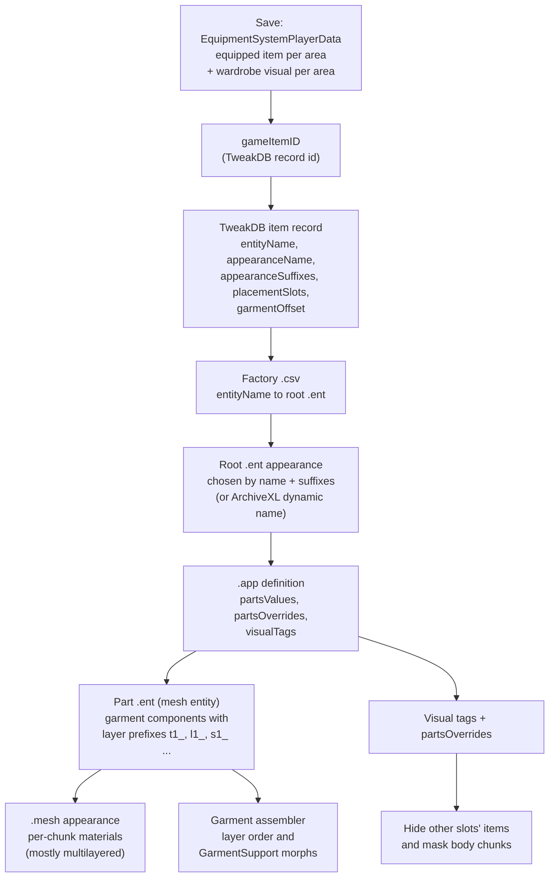

# Worn clothing

**Maturity: Draft.** Consolidated on 26 September 2026 from the installed 2.31 game (scripts, TweakDB, one vanilla item's full resource chain, the player body resources), the scripting RTTI dump, WolvenKit's save parsers, ArchiveXL 1.27.3 and EquipmentEx source, one decoded 2.31 save and the Modding Docs. Nothing on this page has runtime evidence yet. Since 26 September the Studio reads what a save's V wears and draws it over the body ([body rendering](body-rendering.md)): the clothing render plan's phases 1–4 (§6). Evidence grades follow the [knowledge rules](README.md): **[source]** engine/framework/tool source or decompiled scripts, **[resource]** extracted game or mod resources, **[wiki]** Modding Docs text or image, **[runtime]** running game, **[hypothesis]** not yet established. The build plan is in the [clothing render backlog](../research/backlog/clothing-render.md).

This page answers five questions for XF Studio agents:

1. How does a save record what V wears, and what does the Studio's save import read today?
2. How does an item ID become the meshes that are drawn, per body gender, camera and body mod?
3. How do garments layer over each other and hide the body under them?
4. What materials do clothes use, and how much of that does the Studio already draw?
5. What would rendering worn clothing in the Studio take? (Summary here; plan in the backlog page.)

## Evidence snapshot

| Source | Version | What it established |
|---|---|---|
| Game scripts | 2.31 `r6\cache\final.redscripts` (SHA-256 `2119046f…ee86`), decompiled with redscript-cli 0.5.31 into a private scratch folder; `cyberpunk/systems/equipmentSystem.script` | Which equipment fields persist, the wardrobe (transmog) and hide logic, the slot-to-tag table, underwear and censorship rules |
| Scripting RTTI dump | The dump psiberx exported, as published in `red-dump-json` at `a8e52990` (May 2025, before 2.31) | Field lists of `EquipmentSystemPlayerData`, `gameSLoadout`, `gameSSlotVisualInfo`, `gameClothingSet`, `gameItemID`, the garment classes and `appearanceAppearanceDefinition` |
| WolvenKit | commit `11720772`: `WolvenKit.RED4/Save/Parser/WardrobeSystemParser.cs`, `WardrobeSystemClothingSetsParser.cs`, `ScriptableSystemsContainerParser.cs`, `Save/Helper/InventoryHelper.cs`, `Archive/IO/RedPackageReader.File.cs` | Save node layouts for the wardrobe, item IDs and the script-system package |
| Reference save | 2.31, save version 269 | Node sizes and which classes its script-system package holds (§2.5) |
| Check save | 2.31, save version 269, 169 nodes (private) | The loadout the Studio's reader decodes end to end (§2.5) |
| WolvenKit hash lists | `usedhashes.kark` at the same commit | The depot paths of the cooked visual-tag preset (§4.1) |
| Installed TweakDB | 2.31 `r6\cache\tweakdb_ep1.bin`, read with the Studio's `tweakdb-flats.ts` | Vanilla clothing record fields (§3.1) |
| Installed game resources | 2.31, read with the Studio's native archive reader (read-only, 26 September) | One item's whole chain: `clothing.csv` factory → `player_inner_torso_item.ent` → `t1_tshirt_01.app` / `t1_shirt_01.app` → part `.ent` → `.mesh` → multilayered materials; the resolver's cached player-body `.ent` and `.mesh` resources |
| ArchiveXL source | [1.27.3](https://github.com/psiberx/cp2077-archive-xl/tree/5474e34d56112f5d8843ae863e1e72ff510957c0), MIT | Dynamic appearances, suffix and body-state attributes, visual tags and body-hiding rules, garment offsets |
| EquipmentEx source | [commit `3208ff4c`](https://github.com/psiberx/cp2077-equipment-ex/tree/3208ff4c1caa2e3f08c3e20a8e7c3e6b1e95124d), MIT | Outfit persistence, outfit slots and their garment offsets, how it overrides the wardrobe |
| Codeware source | [commit `613a1cb8`](https://github.com/psiberx/cp2077-codeware/tree/613a1cb830ecf33508ffca839d3ea631073504ef), MIT | `AttachmentSlotData` (what an attachment slot shows), wardrobe helpers |
| Modding Docs clone | `be2f44ee` (canonical `upstream/main`) | Item structure, suffixes and substitutions, dynamic variants, tags and their body diagrams, garment support, first-person fixes, body mods; pages and images cited inline |

Modding Docs links below are to that commit. Short forms: **[items]** [ArchiveXL item structure explained](https://github.com/CDPR-Modding-Documentation/Cyberpunk-Modding-Docs/blob/be2f44eed8419342ec13f72ed9cab008e9f7b289/modding-guides/items-equipment/adding-new-items/archive-xl-item-structure-explained.md) (manavortex); **[suffixes]** [ArchiveXL suffixes and substitutions](https://github.com/CDPR-Modding-Documentation/Cyberpunk-Modding-Docs/blob/be2f44eed8419342ec13f72ed9cab008e9f7b289/for-mod-creators-theory/core-mods-explained/archivexl/archivexl-suffixes-and-substitutions.md) (mana vortex); **[tags]** [ArchiveXL tags](https://github.com/CDPR-Modding-Documentation/Cyberpunk-Modding-Docs/blob/be2f44eed8419342ec13f72ed9cab008e9f7b289/for-mod-creators-theory/core-mods-explained/archivexl/archivexl-tags.md) (mana vortex, last updated by LadyLea); **[garment]** [Garment support: how does it work?](https://github.com/CDPR-Modding-Documentation/Cyberpunk-Modding-Docs/blob/be2f44eed8419342ec13f72ed9cab008e9f7b289/for-mod-creators-theory/3d-modelling/garment-support-how-does-it-work/README.md) (crediting psiberx for the algorithm's explanation, redacted-c01 and Auska); **[dynamic]** [ArchiveXL dynamic variants](https://github.com/CDPR-Modding-Documentation/Cyberpunk-Modding-Docs/blob/be2f44eed8419342ec13f72ed9cab008e9f7b289/modding-guides/items-equipment/adding-new-items/archivexl-dynamic-variants/README.md) (mana vortex); **[fpp]** [First-person perspective fixes](https://github.com/CDPR-Modding-Documentation/Cyberpunk-Modding-Docs/blob/be2f44eed8419342ec13f72ed9cab008e9f7b289/modding-guides/items-equipment/first-person-perspective-fixes.md) (FronkenZeepa, updated by LadyLea); **[bodies]** [ArchiveXL body mods and refits](https://github.com/CDPR-Modding-Documentation/Cyberpunk-Modding-Docs/blob/be2f44eed8419342ec13f72ed9cab008e9f7b289/for-mod-creators-theory/core-mods-explained/archivexl/archivexl-body-mods-and-refits/README.md) (mana vortex, updated by LadyLea).

## 1. The chain at a glance

The item side mirrors the character-creator chain in [the CC file chain](cc-file-chain.md) from the `.app` onward: the same `.app` → part `.ent` → component → `.mesh` → material steps, with an item factory and TweakDB record in front instead of a creator option. The resolver's `.app`, `partsOverrides`, chunk-mask and dynamic-material rules therefore carry over [source: `character-resolver.ts` rules R6–R7].

## 2. What the save records

### 2.1 Equipment [source]

The player's equipment lives in the script system `EquipmentSystem`, whose persistent `m_ownerData: array<ref<EquipmentSystemPlayerData>>` holds one record per owner. `EquipmentSystemPlayerData` persists these fields (script names; the RTTI and the save drop the `m_` prefix):

| Field | Type | Meaning |
|---|---|---|
| `m_equipment` | `SLoadout` | `equipAreas[]`, each `{areaType: gamedataEquipmentArea, equipSlots[{itemID, slotID}], activeIndex}`, plus `equipmentSets` |
| `m_clothingSlotsInfo` | `[SSlotInfo]` | The fixed slot table: area, attachment slot and the visual tag that hides it (§4.2) |
| `m_clothingVisualsInfo` | `[SSlotVisualInfo]` | One entry per clothing area: `{areaType, isHidden, visualItem}`, the wardrobe override and hide flag |
| `m_wardrobeDisabled`, `m_lastActiveWardrobeSet` | `Bool`, `gameWardrobeClothingSetIndex` | Wardrobe state (`Slot1`…`Slot7`, `INVALID`) |
| `m_lastUsedStruct`, `m_slotActiveItemsInHands`, `m_hotkeys` | | Weapons and hotkeys, not visual |

The clothing areas are `Head`, `Face`, `OuterChest`, `InnerChest`, `Legs`, `Feet`, `Outfit`, `UnderwearTop` and `UnderwearBottom` (`InitializeClothingOverrideInfo`; `Outfit` is excluded from the visual table by `GetVisualSlotIndex`). An item ID is `{id: TweakDBID, rngSeed: u32, uniqueCounter: u16, flags: u8}` [source: RTTI `gameItemID`]; in save item records WolvenKit reads it as a u64 TweakDBID, u32 seed, one structure byte, u16 counter and u8 flags [source: `InventoryHelper.ReadItemInfo`].

A TweakDBID is a CRC-32 of the record name plus the name's length, so it can't be turned back into a name, but it doesn't need to be: the Studio's TweakDB reader addresses a record's fields from its ID alone (`childId(record, ".appearanceName")`) [source: `tweakdb-flats.ts`].

### 2.2 Wardrobe (transmog) [source]

- **What is drawn in an area** is `GetVisualItemInSlot(area)`: the wardrobe's `visualItem` when a wardrobe set is active and the area has one, otherwise the equipped item. `IsSlotOverriden` is true only while a set is active and the area's `visualItem` is valid.
- **Sets** are native `gameWardrobeSystem` data: `ClothingSet {setID, clothingList: [SSlotVisualInfo], iconID}`, at most seven. `EquipWardrobeSet` unequips any `Outfit` item, marks the set active, then for each area equips its visual item or clears the area.
- **Save nodes.** `WardrobeSystem` lists the wardrobe's known appearances, each an appearance name and an item ID; `WardrobeSystem_ClothingSets` holds the sets, which WolvenKit decodes only as six fixed-size item entries per set with unknown fields [source: WolvenKit parsers]. The active set itself is native (`gameWardrobeSystem.GetActiveClothingSetIndex`): `WardrobeSystem_ClothingSets` starts, after the node ID, with a u8 set count and a u32 that is 8 in saves without sets, the value of `gameWardrobeClothingSetIndex.INVALID` (`Slot1`…`Slot7` = 0…6, `COUNT` 7, `INVALID` 8) [resource; RTTI dump] [hypothesis: that u32 is the active set's index; the Studio reads it so].
- **Transmog blocking.** Items tagged `TransmogBlocked` keep their own look (`AddItemToSlot`, `ClearVisuals`).

### 2.3 The "hide" flags [source]

There is no separate hide switch per item. An area is hidden in two ways, and both end in the same place:

1. **Hidden by the player in a wardrobe set.** A set entry with no item clears that area: `ClearVisuals` sets `isHidden = true`, and an item equipped there afterwards is attached with the appearance name `empty_appearance_default` (`AddItemToSlot`).
2. **Hidden by another item's visual tag.** When an item equips, `OnEquipProcessVisualTags` hides every area whose tag the item carries (for example a coat tagged `hide_T1` hides the inner-chest item), and `ClearItemAppearance` switches the hidden item to `empty_appearance_default`. Unequipping restores it.

So "hidden" is recorded as `isHidden` in `m_clothingVisualsInfo`, and the drawn result of a hidden area is the empty appearance. **Underwear** is special: the bottom is hidden whenever the legs area shows an item or `hide_L1` is active; the top is hidden only in censored builds (`IsBuildCensored` asks the character-customisation system whether nudity is allowed) when the inner chest shows an item or `hide_T1` is active.

### 2.4 EquipmentEx outfits [source]

EquipmentEx is a script mod that replaces the wardrobe with named outfits over 30+ extra slots:

- **Persistence.** `EquipmentEx.OutfitSystem` (a `ScriptableSystem`) has `persistent m_state: ref<OutfitState>`, and `OutfitState` persists `m_disabled`, `m_active`, `m_parts` (the outfit being worn: `OutfitPart {m_itemID, m_slotID}`), `m_outfits` (`OutfitSet {m_name, m_parts, m_timestamp}`) and `m_mappings` (user slot remaps). It is saved in the `.dat` through the ordinary persistent-field mechanism, beside the vanilla equipment data (§2.5); there is no side file.
- **Slots.** `OutfitSlots.*` attachment-slot records (Head, Balaclava, Mask, Glasses, the torso layers `TorsoUnder` … `TorsoAux`, legs, feet, jewellery and body-suit slots), each with a default garment offset (for example `Head` 310000, `TorsoUnder` 120000, `TorsoOuter` 210000), listed in `scripts/OutfitConfig.reds` and **created by redscript at runtime** (`RegisterOutfitSlots.reds`), so they are not in the compiled TweakDB.
- **Drawing.** While an outfit is active, EquipmentEx clears every base area's visuals (`HideEquipment`: `ClearVisuals` on each area, then locks visual changes), attaches each part as a preview item in its outfit slot, and turns ArchiveXL's garment offsets on (§4.5). It makes the vanilla wardrobe calls no-ops and converts old wardrobe sets into outfits on first use.

What the game draws with EquipmentEx active therefore depends on EquipmentEx's script logic, not only on vanilla data in the save.

### 2.5 In the reference save [resource]

The reference 2.31 save has 330 nodes. The relevant ones: `ScriptableSystemsContainer` (89,926 bytes, one object package holding `EquipmentSystemPlayerData` with `equipment`, `clothingSlotsInfo` and `clothingVisualsInfo`, and also `EquipmentEx.OutfitState` with `parts` and `outfits`, since EquipmentEx is installed), `inventory` (13,073 bytes, 159 `itemData` children), `WardrobeSystem` (1,952 bytes, 326 known appearances) and `WardrobeSystem_ClothingSets` (9 bytes: no vanilla sets). The package format is the one the native archive reader decodes for `.ent`/`.app` `compiledData`, except that the save variant stores a u32 CRUID count where a resource package has an i16 root index and a u16 count [source: WolvenKit `RedPackageReader.File.cs`]. Every object carries its own field table (names, stored types and offsets), so a class no RTTI dump knows (a script mod's) is still walkable, and a field of a type a reader doesn't decode is skipped by the next field's offset [resource: the Studio's reader, below].

A second, newer 2.31 save of the same V (the private check save: 169 nodes, `ScriptableSystemsContainer` 21,482 bytes: after the node ID a u32 size, then the package: version 4, six sections, 57 CRUIDs) holds two `EquipmentSystemPlayerData` objects: the player's (`ownerID.hash` = 1, with `equipment`, `lastUsedStruct`, `clothingSlotsInfo`, `clothingVisualsInfo`, `hotkeys`) and an owner with only `ownerID` (9000324), `clothingSlotsInfo` and `clothingVisualsInfo`. Fields at their default are not written (no `activeIndex` for slot 0, no `isHidden` when false, no `uniqueCounter`) [resource]. Its player wears a vest, a T-shirt, trousers, boots and the basic underwear bottom (hidden, under the trousers); a save taken while EquipmentEx dresses V hides every vanilla area (`isHidden` on each, `HideEquipment`), so the save alone shows no clothes [resource].

### 2.6 What the Studio reads [source]

`save-reader.ts` decodes the creator appearance node ([save import](../research/eye-artistry/save-import.md)) and, in the same pass, the loadout (`save-loadout.ts`): the player's `EquipmentSystemPlayerData` from `ScriptableSystemsContainer` through a small self-describing package reader (`save-package.ts`: fixed-size values, TweakDBIDs, names and the enums it is told, arrays, handles as indexes, nested objects by their field tables; bounded by its chunk), and the active wardrobe set from `WardrobeSystem_ClothingSets`. It keeps, per clothing area, the active slot's item record ID and the saved visual item and hide flag. A save whose script data can't be read still loads its V, with no loadout. It never reads a script mod's data (EquipmentEx's outfit sits in the same package and is left alone). It reads no inventory, and nothing resolves TweakXL YAML yet (clothing render phase 5; the creator catalogue notes the same gap: `cc-presentation.ts`).

## 3. From item ID to drawn meshes

### 3.1 The TweakDB item record [resource] [wiki]

Vanilla clothing records in the 2.31 TweakDB (inheritance is already flattened into each record's flats):

| Record | `entityName` | `appearanceName` | `appearanceSuffixes` | `placementSlots` / area |
|---|---|---|---|---|
| `Items.TShirt_01_basic_01` | `player_inner_torso_item` | `t1_tshirt_01_basic_01_` | Gender | `AttachmentSlots.Chest` / InnerChest |
| `Items.Shirt_01_basic_01` | `player_inner_torso_item` | `t1_shirt_01_basic_01_` | Gender, Camera, Partial | `AttachmentSlots.Chest` / InnerChest |
| `Items.Jacket_01_basic_01` | `player_outer_torso_item` | `t2_jacket_01_basic_01_` | Gender, Camera | `AttachmentSlots.Torso` / OuterChest |
| `Items.Pants_01_basic_01` | `player_legs_item` | `l1_pants_01_basic_01_` | Gender | `AttachmentSlots.Legs` |
| `Items.Boots_01_basic_01` | `player_feet_item` | `s1_boots_01_basic_01_` | Gender | `AttachmentSlots.Feet` |
| `Items.Helmet_01_basic_01` | `player_head_item` | `h1_helmet_01_basic_01_` | Gender, Camera | `AttachmentSlots.Head` |
| `Items.Glasses_01_basic_01` | `player_face_item` | `f1_glasses_01_basic_01_` | Gender, Camera | `AttachmentSlots.Eyes` |
| `Items.Underwear_Basic_01_Top` / `_Bottom` | `player_underwear_top_item` / `…_bottom_item` | `t1_underwear_01_basic_01_` / `l1_underwear_01_basic_01_` | Gender | `UnderwearTop` / `UnderwearBottom` |

Records also carry `garmentOffset` (Int32), `visualTags` (a CName array, empty on the vanilla items read), `isGarment`, `equipArea`, `itemType` and `useHeadgearGarmentAggregator` [wiki: saltypigloaf's field dumps in the cyberware and iconic-weapon guides; resource: the 2.31 TweakDB]. The Studio's TweakDB reader decodes CName, String, TweakDBID and its arrays, CName arrays, Int32, Bool, Float, resource references and LocKeys (`tweakdb-flats.ts`). The suffix records are `itemsFactoryAppearanceSuffix.Gender`, `.Camera`, `.Partial`, `.HairType` (vanilla; their `scriptedSystem` is `None`, native) and ArchiveXL's `.BodyType`, `.ArmsState`, `.FeetState`, `.LegsState` [resource; source]. Mod items are usually added with TweakXL YAML (`$base` inheritance, `$instances` expansion), which is not in the compiled blob [wiki: [items], [dynamic]].

### 3.2 Factory, root entity and suffixes [resource] [source] [wiki]

- `entityName` is looked up in the item factory. Vanilla clothing uses `base\gameplay\factories\items\clothing.csv` (and `ep1\…\clothing.csv` with Phantom Liberty), a `C2dArray` whose rows map, for example, `player_inner_torso_item` to `base\gameplay\items\equipment\torso\player_inner_torso_item.ent`; WolvenKit serializes the rows as `compiledData: [[name, path, preload], …]` [resource]. The engine's own factory list is native (ArchiveXL's FactoryIndex waits for `vehicles.csv`, the last of it, before adding the `.xl` factories); the item factories it ships are `items\clothing.csv`, `items.csv`, `cyberware.csv`, `consumables.csv` under `base\gameplay\factories\`, and `ep1`'s clothing and cyberware [resource: present in the 2.31 archives]. ArchiveXL `.xl` files add factories (`factories:`) [source: FactoryIndex; wiki: [items]]; the reference profile's mods declare several hundred. The native reader cannot yet decode a `C2dArray`'s rows (they sit in data after the properties) [resource].
- The **root entity** has one appearance per item look and suffix combination: `player_inner_torso_item.ent` lists 754, for example `t1_tshirt_01_basic_01_&Female` → `t1_tshirt_01.app` / `basic_01_w`, and `t1_shirt_01_basic_01_&Female&TPP&Part` → `t1_shirt_01.app` / `basic_01_w_partial` [resource].
- **Suffixes** are evaluated from `itemsFactoryAppearanceSuffix` records: `Gender` (`Female`/`Male`), `Camera` (`TPP`/`FPP`), `Partial` (`Full`/`Part`, driven by `hide_T1part` on the torso item) and `HairType` (`Short`, `Long`, `Dreads`, `Buzz`, `Bald`) [wiki: [suffixes]]. ArchiveXL adds `BodyType`, `ArmsState`, `FeetState` and `LegsState` suffix records and appends them to the default suffix order [source: ArchiveXL `PuppetState/Extension.cpp` `OnTweakDBReady`]. The most specific matching root appearance wins: `&Female&TPP` beats `&Female`, which beats the bare name [wiki: [suffixes], "Suffix load order"].
- If a root entity has the visual tag `EmptyAppearance:FPP`, `:Male` or `:Female` and the selector carries that suffix, ArchiveXL returns the empty appearance [source: `Garment/Extension.cpp` `OnResolveAppearance`].

### 3.3 `.app`, part entity and mesh [resource]

`t1_tshirt_01.app` definition `basic_01_w` has `partsValues` = `base\characters\garment\player_equipment\torso\t1_071_pwa_tank__basic.ent` and one `partsOverrides` entry that sets component `t1_071_wa_tank__basic7841`'s `meshAppearance` to `moro`. That part entity holds one `entGarmentSkinnedMeshComponent` of mesh `…\t1_071_tank__basic\t1_071_pwa_tank__basic.mesh`, with `renderingPlaneAnimationParam = renderPlane` and the visual tag `Tight` in its `visualTagsSchema`. The mesh has 32 appearances (`moro`, `yellow`, `white_punk`, …); each names the chunk materials, for example `moro` = `ml_t1_071_ma_green_moro`, `decal`, `ml_t1_071_ma_green_moro`. The male look (`basic_01_m`) uses a separate `_pma_` part entity and mesh.

Camera and sleeve variants differ only in chunk masks: `t1_shirt_01.app`'s `basic_01_w_fpp` clears chunk 1 of the shirt (mask `…FFFD`) and shows a cuff component that the third-person look hides (mask `0`), and `basic_01_w_partial` clears chunks 1 and 2 (`…FFF9`) [resource]. The resolver already applies `partsOverrides` and chunk masks this way for creator parts (rule R7).

### 3.4 ArchiveXL dynamic appearances [source] [wiki]

Newer mod items use one root appearance and substitution instead of a suffix matrix:

- The root `.ent` carries the visual tag `DynamicAppearance` and the record's `appearanceName` contains `!`: the text before it is the base name, everything after is `{variant}`, `+` splits it into `{variant.1}`, `{variant.2}` …, and `attr=value` pieces override attributes. Vanilla suffixes are blanked for such items [source: `Garment/Dynamic.cpp`, `Extension.cpp` `OnResolveSuffixes`].
- **Definition choice:** every `.app` definition whose base name matches is a candidate; names may carry `!variant` parts and `&attr=value` conditions. A definition with variants scores 100 plus one per condition; an unconditional one is the fallback; the best matching one is cloned under the full name, and an empty definition results if candidates exist but none match. Components named with conditions are switched the same way inside each name group [source: `Garment/States.cpp` `SelectDynamicAppearance`, `ToggleConditionalComponents`].
- **Substitution:** mesh-component paths and `meshAppearance` values starting with `*` get `{attr}` replaced from the name's parts first, then the entity state: `gender` (`w`/`m`), `camera` (`tpp`/`fpp`), `body`, `arms`, `feet`, `sleeves`, `skin_color`, `hair_type`, `hair_color`, `eyes_color`, `nails_color`, `variant`. A trailing `?` blanks a component whose value doesn't resolve. If a resolved mesh is missing, ArchiveXL retries with `body` and then `feet` set to `base_body` and `flat` [source: `ProcessString`, `ResolvePath`]. The wiki warns that a missing `{variant}` mesh crashes the game [wiki: [dynamic]].
- The Studio already expands `*…{attr}…` material paths and ArchiveXL's creator appearance cloning (`expandDynamicPath`, `dynamicAppearance` in `character-resolver.ts`); item definitions need the `!`/`&` selection and component-path substitution on top.

### 3.5 Body gender, body mods and body states [source] [wiki]

- `{gender}` and the `Gender` suffix come from the player's body gender, `{camera}` from the vanilla camera suffix [source: `CollectStateData`, `GetSuffixData`].
- **`{body}`:** body mods declare `player: bodyTypes: [Name]` in `.xl` and patch a component named `Body:Name` (or tag the entity or a morph-target component) into the player entity; otherwise the value is `base_body`, which also covers vanilla-shaped replacers [source: `PuppetState/Extension.cpp` `GetBodyType`; wiki: [bodies], with a table of known body tags]. Refits then ship `…__{body}.mesh` variants, and ArchiveXL resource links can point several body names at one mesh.
- **`{feet}`** (female V only in vanilla): `Flat`, `Lifted`, `HighHeels` or `FlatShoes` from the feet item's tags (`HighHeels`, `FlatShoes`, `force_FlatFeet`); **`{arms}`** from the equipped arm cyberware; **`{sleeves}`** `Part` when the torso slot's item has `hide_T1part` [source: `PuppetState/Handler.cpp`, `Attachment/Extension.cpp`].
- These are all derivable offline from the worn items, the body gender and the resolved player entity, so a resolver can compute them without the game.

## 4. Layering and body hiding

### 4.1 Where visual tags come from [source] [wiki]

An item's visual tags are the union of its root entity's `visualTagsSchema` and its resolved `.app` definition's `visualTags`. The game reads them through a cooked `AppearanceNameVisualTagsPreset` (entity path hash + appearance name → tags); ArchiveXL hooks `GetVisualTags` to add the tags from the resources, which is what makes `.app` tags work for mod items [source: ArchiveXL `Garment/Extension.cpp` `OnGetVisualTags`; RTTI `gameAppearanceNameVisualTagsPreset_Entity`]. Hiding tags only take effect in the `.app` [wiki: [tags]].

**The cooked preset** is `base\entities\appearancename_visualtags.json` (`basegame_4_gamedata.archive`), and with Phantom Liberty `ep1\entities\appearancename_visualtags.json` (`ep1_2_gamedata.archive`), a superset (1,351 and 1,907 entities in 2.31, the player items' entries identical) [resource; paths from WolvenKit's hash list]. Each is a `JsonResource` whose root is `gameAppearanceNameVisualTagsPreset {presets: [{entityPathHash, entityRigPathHash, appearancesToTags: [{appearanceName, visualTags}], commonVisualTags}]}`, keyed by the root entity's path hash and the **root** appearance name (`t2_vest_14_basic_01_&Female&TPP` → `Large`; `t1_tshirt_01_q000_nomad_&Female` → `Tight`, `Cotton`); the vanilla hide tags live here (`player_outer_torso_item.ent`'s appearances use `hide_T1`, `hide_T1part`, `hide_L1`, `hide_S1`, `hide_T2`, `hide_Genitals`, `Coat`, `Collar`) [resource]. The vanilla `.app` definitions read carry none. WolvenKit 9.0.1 doesn't serialize the resource; the Studio's native reader decodes it (8.3 MB and 13.0 MB of JSON) [resource].

### 4.2 Vanilla slot hiding [source]

| Tag | Hides the item in | Attachment slot |
|---|---|---|
| `hide_T2` | OuterChest | `AttachmentSlots.Torso` |
| `hide_T1` | InnerChest | `AttachmentSlots.Chest` |
| `hide_L1` | Legs | `AttachmentSlots.Legs` |
| `hide_S1` | Feet | `AttachmentSlots.Feet` |
| `hide_H1` | Head | `AttachmentSlots.Head` |
| `hide_F1` | Face | `AttachmentSlots.Eyes` |
| `hide_Genitals` | UnderwearBottom | `AttachmentSlots.UnderwearBottom` |

Source: `InitializeClothingSlotsInfo`. `IsVisualTagActive` checks the active `Outfit` item and every visible clothing area; `hide_T1part` switches the inner torso to its partial (`&Part`) look while the outer chest is visible. Other base-game tags include `hide_Hair` [wiki: [tags]].

### 4.3 Masking the body [resource] [source] [wiki]

The female body `t0_000_pwa_base__full` is an `entMorphTargetSkinnedMeshComponent` whose entity carries the visual tag `PlayerBodyPart`; its mesh has eight chunks and one appearance per skin tone [resource]. ArchiveXL's bundled `VisualTags.xl` maps tags to components, prefixes and chunks [source]:

| Tag | Hides |
|---|---|
| `hide_Head` | `h0_`, `he_`, `heb_`, `ht_`, `hx_`, `i1_`, beards and four head morph components |
| `hide_Arms` | `a0_`, `left_arm`, `right_arm` |
| `hide_Torso` | `n0_`, `tx_`, body chunks 0–3 (TPP body and the female FPP torso), seam fixes, nipples |
| `hide_Chest` / `hide_CollarBone` / `hide_UpperAbdomen` / `hide_LowerAbdomen` | body chunk 0 / 1 / 2 / 3 |
| `hide_Legs` | `l0_`, `s0_`, body chunks 4–7 |
| `hide_Thighs` / `hide_Calves` / `hide_Ankles` / `hide_Feet` | body chunk 4 / 5 / 6 / 7 (the last three also mask the `l0_` feet variants) |
| `HighHeels`, `FlatShoes` | body chunks 5–7, and **show** chunks 0–2 of the matching `l0_` feet mesh |

Any mod's `.xl` can add tags the same way (`overrides: tags: <tag>: <component or prefix>: {hide|show: [chunks]}`), and unlike `partsOverrides` a tag can also un-hide [source: `Garment/Config.cpp`; wiki: [tags], "Adding Custom tags", with body-mod examples]. `ChunkMask` turns a hide list into the mask of every other chunk (an empty list, or `hide: 0`, hides the whole component), a show list into the listed chunks' bits, and a bare number or list without an operation into a hiding mask; per component the showing masks are ORed and the hiding masks ANDed, then applied as `(original | shows) & hides`, by exact name and by prefix [source: `ChunkMask.hpp`, `States.cpp` `ApplyChunkMaskOverride`]. **Only an `.app` definition's own `visualTags` register these rules** (`RegisterComponentOverrides(appearance)`), never the preset's or the root entity's tags [source], so vanilla items, whose definitions carry no tags, mask no body chunk this way: vanilla clothing relies on the garment assembler instead (§4.5). The prefix is the text up to the first `_` when that `_` is at index 2–5 [source: `Garment/Prefix.cpp`]. LadyLea's body diagrams on the tags page ([female](https://github.com/CDPR-Modding-Documentation/Cyberpunk-Modding-Docs/blob/be2f44eed8419342ec13f72ed9cab008e9f7b289/.gitbook/assets/fem_hide_tags.png), [male](https://github.com/CDPR-Modding-Documentation/Cyberpunk-Modding-Docs/blob/be2f44eed8419342ec13f72ed9cab008e9f7b289/.gitbook/assets/masc_hide_tags.png)) colour the same eight body submeshes and list the tags beside them [wiki, image]; the female diagram also lists body submeshes for the base-game `hide_L1` (4–6), `hide_S1` (7) and `hide_Genitals` (3), which neither the scripts nor ArchiveXL's rules show [hypothesis: they come from cooked data or the garment assembler].

### 4.4 `partsOverrides` onto the body [source] [wiki]

An item `.app`'s `partsOverrides` entry with an empty `partResource` applies by component name to the whole player, so an item can hide body chunks directly; ArchiveXL records these per item on equip and applies them before the garment is computed (`RegisterComponentOverrides`, `ApplyChunkMaskOverride`: the original mask, then every show mask, then every hide mask, by exact name and by prefix) [source]. The wiki's example hides a submesh of `t0_000_pwa_base__full` this way [wiki: [influencing other items](https://github.com/CDPR-Modding-Documentation/Cyberpunk-Modding-Docs/blob/be2f44eed8419342ec13f72ed9cab008e9f7b289/modding-guides/items-equipment/influencing-other-items.md)].

### 4.5 Garment support: layer order and morphs

- **Layer order** comes from the component prefix: `s0` 0, `l0` 10, `a0` 20, `t0` 30, `h0` 40, `s1` 50, `l1` 60, `t1` 70, `i1` 80, `hh` 90, `h1` 100, `h2` 110, `t2` 120, plus a `visualTagsSchema` modifier (`PlayerBodyPart` −2000, `Tight` −1000, `Normal` 0, `Large` +1000, `XLarge` +2000); components with the same prefix in one entity don't squish each other; with EquipmentEx the outfit slot's offset decides instead [wiki: [garment]]. The T-shirt above is `t1_` and `Tight`; the body is `t0_` and `PlayerBodyPart` [resource].
- **Garment offsets.** The engine passes each item's `garmentOffset` into the garment request; on entities ArchiveXL tracks it **clears** these offsets unless `ArchiveXL.EnableGarmentOffsets()` was called, which EquipmentEx does while an outfit is active [source: ArchiveXL `ApplyOffsetOverrides`, `src/Red/GarmentAssembler.hpp`; EquipmentEx `OutfitSystem.reds`]. With ArchiveXL installed and no outfit active, the prefix and tag score alone decide.
- **Morphs.** Garment and body meshes carry a `meshMeshParamGarmentSupport` (`chunkCapVertices`, `customMorph`) and a `garmentMeshParamGarment` whose chunks store vertices, indices, `morphOffsets`, `garmentFlags` and UVs; the female body mesh has both, `customMorph = 1` and empty caps [resource; field names from the RTTI]. The GarmentSupport shape morphs a lower layer inward where a higher layer covers it; its strength and a "cap" that stops a mesh crushing the layers below are painted as the `_GARMENTSUPPORTWEIGHT` and `_GARMENTSUPPORTCAP` vertex colours [wiki: [garment]; [painting garment support](https://github.com/CDPR-Modding-Documentation/Cyberpunk-Modding-Docs/blob/be2f44eed8419342ec13f72ed9cab008e9f7b289/for-mod-creators-theory/3d-modelling/garment-support-how-does-it-work/painting-garment-support-parameters.md) by revenantFun]. The page's [example image](https://github.com/CDPR-Modding-Documentation/Cyberpunk-Modding-Docs/blob/be2f44eed8419342ec13f72ed9cab008e9f7b289/.gitbook/assets/garment_support_in_action.png) shows the same trousers tucked into two different boots [wiki, image].
- **The assembler is native.** The per-vertex computation happens in the engine's garment assembler; ArchiveXL only swaps meshes and applies masks before it runs [source]. The RTTI names its inputs: `garmentGarmentLayerParams` (bending offset, smoothing radius and strength, collar area, hidden-triangle removal with a ray length in cm) and a cooked per-`.app` `entGarmentParameter` (visible triangle indices and morph offset scales per chunk, `hideComponent`, `removeHiddenTriangles`) [source: RTTI]. How the offsets are chosen per vertex is not in any source we have [hypothesis: a short outward ray test per inner vertex against outer layers, given `rayLengthInCM`]. Body mods without GarmentSupport data are why vanilla jackets clip on them [wiki: painting page].

### 4.6 First and third person [source] [wiki]

Each camera can use a different root appearance (`&FPP`/`&TPP`, `&camera=`), chunk masks, or separate `_fpp` meshes; the female player has separate first-person torso, neck and arm meshes (`t0_000_pwa_fpp__torso` is in every ArchiveXL body rule) [source; wiki: [fpp], [body cheat sheet](https://github.com/CDPR-Modding-Documentation/Cyberpunk-Modding-Docs/blob/be2f44eed8419342ec13f72ed9cab008e9f7b289/for-mod-creators-theory/references-lists-and-overviews/cheat-sheet-body.md)]. Components with `visibilityAnimationParam = invisible_in_fpp` disappear in first person, and sleeve and glove components use `renderingPlaneAnimationParam = renderPlane` so they draw in front of the arms [wiki: [fpp]]. ArchiveXL adds custom Head and Eyes sub-slots to the TPP representation so they swap like vanilla headwear [source: `Attachment/Extension.cpp` `OnAttachTPP`]. The Studio only ever shows third person, so it resolves with `Camera = TPP`.

## 5. Clothing materials

- **Colour variants are mesh appearances.** A look picks a mesh appearance through `partsOverrides` (or a `*{variant}` substitution), and each appearance maps chunks to material entries [resource: §3.3; wiki: [items]].
- **Most garments are multilayered.** In `t1_071_pwa_tank__basic.mesh` every look's main chunks use `engine\materials\multilayered.mt` with the shared mask `ml_t1_071.mlmask` and one `.mlsetup` per colourway (`ml_t1_071_basic.mlsetup`, `…_green_moro.mlsetup`, `…_yellow.mlsetup`), and a separate `decal` chunk has its own material [resource]. The wiki names other multilayered variants and non-layered garments that use `.mt`/`.mi` textures [wiki: [multilayered](https://github.com/CDPR-Modding-Documentation/Cyberpunk-Modding-Docs/blob/be2f44eed8419342ec13f72ed9cab008e9f7b289/for-mod-creators-theory/materials/multilayered/README.md)].
- **Mod recolours** use ArchiveXL dynamic materials (`@dynamic` entries whose setup path contains `{material}`, several variables from ArchiveXL 1.27), resource patches that merge appearances into refits, and `@context` values [wiki: ArchiveXL dynamic materials and resource patching pages]. The resolver already handles these for creator meshes ([mod loading §5](mod-loading.md)).

**What the Studio already covers.** The browser's layered adapter (`layered-material.ts`, `layered-setup.ts`) implements the game's `multilayered.mt` arithmetic (front-to-back coverage, levels, colour masks, microblends, the global normal), reads `.mlsetup`/`.mltemplate` through the resolver and bakes each material once into base colour, normal and roughness/metalness maps, then lights it as a standard surface ([materials and shaders §4.6](materials-and-shaders.md)). It already draws creator piercings. For garments two limits matter: the bake is capped at 2,048 pixels, so a torso-sized garment gets roughly 2 pixels per millimetre against the 20 per millimetre the bake targets (fine at full-body framing, soft in close-ups), and garments also use templates the adapter doesn't know yet (decals on clothes, emissive, glass for visors, cloth and hair variants for hat hair) [source: `BAKE_SIZE`, `BAKE_TEXELS_PER_METRE`; hypothesis for the template list beyond the tank top].

## 6. How the Studio draws worn clothing

The [clothing render plan](../research/backlog/clothing-render.md)'s phases 1–4 are built (26 September 2026). What each step does, and what it doesn't yet:

1. **What V wears** comes from the save (§2.6): per clothing area the item the game shows before other items' tags hide it (`GetVisualItemInSlot`: a wardrobe set's visual item while one is active, never for underwear, else the equipped item) and the saved hide flag (`wornAreas`).
2. **The Clothing setting** (`clothing-dressing.ts`, the character context's `character.setClothing`, with its own Undo): **As saved**, **Without headwear and face items** (the default while the eye-makeup editor is open; the head and face areas), **Underwear only** (the save's underwear, each missing piece filled with `Items.Underwear_Basic_01_Top`/`_Bottom`, the top for a female V only; the lowest state, provisional decision 3) and **Choose areas** (the save's items of the areas picked). It never edits the save or the recipe. The request carries the save's areas and the areas the setting shows (`xfs/character-request-5`).
3. **Items to garments** (`clothing-resolver.ts`, host ports in `clothing-host.ts`): TweakDB record → factory table (the game's item factories, then every `.xl` factory) → root entity → most specific root appearance for the V's suffixes (female/male, third person, `Part` when the shown outer torso item carries `hide_T1part`, the creator's hair tag, `base_body`, `BaseArms`) → `.app` definition → components, through the same definition resolver as a creator choice (`resolveAppDefinition`: R6–R10). Tags are the record's, the cooked preset's, the root entity's and the definition's.
4. **Hiding**: the vanilla slot table between shown areas; a saved hide flag stays only when no saved item's tag explains it (a wardrobe set's empty area), otherwise the tags decide again, so taking a coat off shows the shirt it hid; the underwear rules (§2.3, with the censored top rule, which follows "underwear on"); `EmptyAppearance:<suffix>` on the root.
5. **Onto V** (ArchiveXL `RegisterComponentOverrides`): each drawn item's definition `visualTags` through every `.xl` tag rule, and its entity-wide `partsOverrides` (masks and mesh appearances), become `ComponentOverrides` the V's body and arms resolve with (chunk masks before materials, so a shown chunk gets its materials too). The head keeps its parts (it is the makeup's canvas); what an item would hide there is reported as the gap `worn-item-hides-head`. Footwear sets the feet group to `lifted_feet` (ArchiveXL `ResolveFeetState`: any visible feet item; `HighHeels` and `FlatShoes`/`force_FlatFeet` states come from the tags and their `.xl` rules).
6. **Record and drawing** (`xfs/render-detail-9`): a `clothing` slot of garment components, lower layer first, each with its `garment` (area, item record ID, layer score: prefix base plus its part entity's size tag, §4.5). Garments draw through the existing adapters (almost all chunks are `multilayered.mt`, baked by the layered adapter; `mesh_decal` chunks as decals; `metal_base.remt` shadow meshes and other unsupported templates are left out and counted). A garment without shape keys of its own carries the body's applied shape (breast size) from the nearest body vertex (`xfs_body_shape`), and coincident layers are ordered by a polygon offset of their layer rank; both stand in for garment support (§4.5), which is not built. The Body toggle hides the clothes with the body; the Character panel's **Clothing** section has the setting, a switch per area the save dresses, and its own Undo and Redo.

**Not yet** (plan phases 5–8): TweakXL items and ArchiveXL dynamic appearances (reported per item, "items a mod adds aren't read yet"), the runtime bridge's worn-item snapshot (the exact answer when a script mod such as EquipmentEx dresses V; a save taken then hides every area, and the Studio says so), garment support (layers clip at edges), and a wardrobe to pick items from the installed catalogue. Item labels are words of the appearance name, not the game's localised names. Provenance and captures: [clothing render evidence](../research/character-customization/clothing-render-evidence.md).

## Open questions

1. The save package's objects are read from their own field tables (§2.6). Is the u32 after `WardrobeSystem_ClothingSets`' set count the active set's index (8 = `INVALID` in saves without sets; a save with an active set would confirm it)?
2. Answered (§4.1): the cooked preset is `base\entities\appearancename_visualtags.json` (and the `ep1` superset); it holds the vanilla items' hide tags per root appearance. Still open: does the game read only the `ep1` one when Phantom Liberty is installed (the Studio assumes so)?
3. Does the base game itself mask body submeshes for `hide_L1`, `hide_S1` and `hide_Genitals`, as the tag diagram lists?
4. What exactly does the garment assembler compute per vertex, and can the cooked `entGarmentParameter` be reused offline for a fixed combination of layers?
5. The XF Eye Artistry component is named `xfs_c<key>_makeup` (prefix `xfs_`), so ArchiveXL's `hide_Head` rule, which hides `h0_`, `hx_` and the other head prefixes, would not hide it [source: `preset-collection.ts`, `VisualTags.xl`]. Does a full-head item tagged `hide_Head` leave the makeup visible in game, and should the component take an `hx_` prefix like vanilla head decals? Vanilla helmets may not use that tag at all [hypothesis].
6. How does the Studio learn EquipmentEx's runtime-created slot records (and their offsets) without a mod-specific adapter: a runtime TweakDB snapshot through the bridge, or only the bridge's worn-item snapshot?

## In-game test asks

Batch these into one session once the save reader and resolver exist (see the [backlog](../research/backlog/clothing-render.md#in-game-checks)):

1. A reference outfit per layer (inner shirt, jacket, trousers tucked into boots, a hat) in third person and photo mode, captured from fixed camera presets, against the Studio's render of the same save.
2. The same V with a vanilla wardrobe set active and one area set to empty, to check the hide path.
3. With EquipmentEx: an active outfit, then the bridge's worn-item snapshot compared with what the save alone predicts.
4. A full-head item tagged `hide_Head` (and a vanilla helmet) over XF Eye Artistry makeup (question 5).
5. A refit on one body mod, to check `{body}` resolution.

## Related pages

[CC file chain](cc-file-chain.md) · [Head CC rendering](head-cc-rendering.md) · [Body rendering](body-rendering.md) · [Mod loading](mod-loading.md) · [Materials and shaders](materials-and-shaders.md) · [Archive and resource formats](archive-format.md) · [Piercings and jewellery](jewellery-resources.md) · [Runtime access](runtime-access.md) · [Save import](../research/eye-artistry/save-import.md) · [Clothing render backlog](../research/backlog/clothing-render.md)
