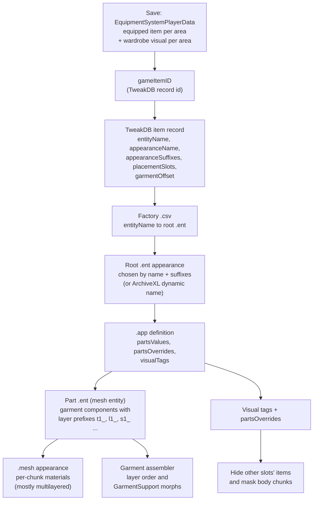

# Worn clothing

**Maturity: Draft.** Consolidated on 26 September 2026 from the installed 2.31 game (scripts, TweakDB, one vanilla item's full resource chain, the player body resources), the scripting RTTI dump, WolvenKit's save parsers, ArchiveXL 1.27.3 and EquipmentEx source, one decoded 2.31 save and the Modding Docs. Nothing on this page has runtime evidence yet, and the Studio renders no clothing today; the unclothed body it will dress renders since 26 September ([body rendering](body-rendering.md)). Evidence grades follow the [knowledge rules](README.md): **[source]** engine/framework/tool source or decompiled scripts, **[resource]** extracted game or mod resources, **[wiki]** Modding Docs text or image, **[runtime]** running game, **[hypothesis]** not yet established. The build plan is in the [clothing render backlog](../research/backlog/clothing-render.md).

This page answers five questions for XF Studio agents:

1. How does a save record what V wears, and what does the Studio's save import read today?
2. How does an item ID become the meshes that are drawn, per body gender, camera and body mod?
3. How do garments layer over each other and hide the body under them?
4. What materials do clothes use, and how much of that does the Studio already draw?
5. What would rendering worn clothing in the Studio take? (Summary here; plan in the backlog page.)

## Evidence snapshot

| Source | Version | What it established |
|---|---|---|
| Game scripts | 2.31 `r6\cache\final.redscripts` (SHA-256 `2119046f…ee86`), decompiled with redscript-cli 0.5.31 into a private scratch folder; `cyberpunk/systems/equipmentSystem.script` | Which equipment fields persist, the wardrobe (transmog) and hide logic, the slot-to-tag table, underwear and censorship rules |
| Scripting RTTI dump | The dump psiberx exported, as published in `red-dump-json` at `a8e52990` (May 2025, before 2.31) | Field lists of `EquipmentSystemPlayerData`, `gameSLoadout`, `gameSSlotVisualInfo`, `gameClothingSet`, `gameItemID`, the garment classes and `appearanceAppearanceDefinition` |
| WolvenKit | commit `11720772`: `WolvenKit.RED4/Save/Parser/WardrobeSystemParser.cs`, `WardrobeSystemClothingSetsParser.cs`, `ScriptableSystemsContainerParser.cs`, `Save/Helper/InventoryHelper.cs`, `Archive/IO/RedPackageReader.File.cs` | Save node layouts for the wardrobe, item IDs and the script-system package |
| Reference save | 2.31, save version 269 | Node sizes and which classes its script-system package holds (§2.5) |
| Installed TweakDB | 2.31 `r6\cache\tweakdb_ep1.bin`, read with the Studio's `tweakdb-flats.ts` | Vanilla clothing record fields (§3.1) |
| Installed game resources | 2.31, read with the Studio's native archive reader (read-only, 26 September) | One item's whole chain: `clothing.csv` factory → `player_inner_torso_item.ent` → `t1_tshirt_01.app` / `t1_shirt_01.app` → part `.ent` → `.mesh` → multilayered materials; the resolver's cached player-body `.ent` and `.mesh` resources |
| ArchiveXL source | [1.27.3](https://github.com/psiberx/cp2077-archive-xl/tree/5474e34d56112f5d8843ae863e1e72ff510957c0), MIT | Dynamic appearances, suffix and body-state attributes, visual tags and body-hiding rules, garment offsets |
| EquipmentEx source | [commit `3208ff4c`](https://github.com/psiberx/cp2077-equipment-ex/tree/3208ff4c1caa2e3f08c3e20a8e7c3e6b1e95124d), MIT | Outfit persistence, outfit slots and their garment offsets, how it overrides the wardrobe |
| Codeware source | [commit `613a1cb8`](https://github.com/psiberx/cp2077-codeware/tree/613a1cb830ecf33508ffca839d3ea631073504ef), MIT | `AttachmentSlotData` (what an attachment slot shows), wardrobe helpers |
| Modding Docs clone | `be2f44ee` (canonical `upstream/main`) | Item structure, suffixes and substitutions, dynamic variants, tags and their body diagrams, garment support, first-person fixes, body mods; pages and images cited inline |

Modding Docs links below are to that commit. Short forms: **[items]** [ArchiveXL item structure explained](https://github.com/CDPR-Modding-Documentation/Cyberpunk-Modding-Docs/blob/be2f44eed8419342ec13f72ed9cab008e9f7b289/modding-guides/items-equipment/adding-new-items/archive-xl-item-structure-explained.md) (manavortex); **[suffixes]** [ArchiveXL suffixes and substitutions](https://github.com/CDPR-Modding-Documentation/Cyberpunk-Modding-Docs/blob/be2f44eed8419342ec13f72ed9cab008e9f7b289/for-mod-creators-theory/core-mods-explained/archivexl/archivexl-suffixes-and-substitutions.md) (mana vortex); **[tags]** [ArchiveXL tags](https://github.com/CDPR-Modding-Documentation/Cyberpunk-Modding-Docs/blob/be2f44eed8419342ec13f72ed9cab008e9f7b289/for-mod-creators-theory/core-mods-explained/archivexl/archivexl-tags.md) (mana vortex, last updated by LadyLea); **[garment]** [Garment support: how does it work?](https://github.com/CDPR-Modding-Documentation/Cyberpunk-Modding-Docs/blob/be2f44eed8419342ec13f72ed9cab008e9f7b289/for-mod-creators-theory/3d-modelling/garment-support-how-does-it-work/README.md) (crediting psiberx for the algorithm's explanation, redacted-c01 and Auska); **[dynamic]** [ArchiveXL dynamic variants](https://github.com/CDPR-Modding-Documentation/Cyberpunk-Modding-Docs/blob/be2f44eed8419342ec13f72ed9cab008e9f7b289/modding-guides/items-equipment/adding-new-items/archivexl-dynamic-variants/README.md) (mana vortex); **[fpp]** [First-person perspective fixes](https://github.com/CDPR-Modding-Documentation/Cyberpunk-Modding-Docs/blob/be2f44eed8419342ec13f72ed9cab008e9f7b289/modding-guides/items-equipment/first-person-perspective-fixes.md) (FronkenZeepa, updated by LadyLea); **[bodies]** [ArchiveXL body mods and refits](https://github.com/CDPR-Modding-Documentation/Cyberpunk-Modding-Docs/blob/be2f44eed8419342ec13f72ed9cab008e9f7b289/for-mod-creators-theory/core-mods-explained/archivexl/archivexl-body-mods-and-refits/README.md) (mana vortex, updated by LadyLea).

## 1. The chain at a glance

The item side mirrors the character-creator chain in [the CC file chain](cc-file-chain.md) from the `.app` onward: the same `.app` → part `.ent` → component → `.mesh` → material steps, with an item factory and TweakDB record in front instead of a creator option. The resolver's `.app`, `partsOverrides`, chunk-mask and dynamic-material rules therefore carry over [source: `character-resolver.ts` rules R6–R7].

## 2. What the save records

### 2.1 Equipment [source]

The player's equipment lives in the script system `EquipmentSystem`, whose persistent `m_ownerData: array<ref<EquipmentSystemPlayerData>>` holds one record per owner. `EquipmentSystemPlayerData` persists these fields (script names; the RTTI and the save drop the `m_` prefix):

| Field | Type | Meaning |
|---|---|---|
| `m_equipment` | `SLoadout` | `equipAreas[]`, each `{areaType: gamedataEquipmentArea, equipSlots[{itemID, slotID}], activeIndex}`, plus `equipmentSets` |
| `m_clothingSlotsInfo` | `[SSlotInfo]` | The fixed slot table: area, attachment slot and the visual tag that hides it (§4.2) |
| `m_clothingVisualsInfo` | `[SSlotVisualInfo]` | One entry per clothing area: `{areaType, isHidden, visualItem}`, the wardrobe override and hide flag |
| `m_wardrobeDisabled`, `m_lastActiveWardrobeSet` | `Bool`, `gameWardrobeClothingSetIndex` | Wardrobe state (`Slot1`…`Slot7`, `INVALID`) |
| `m_lastUsedStruct`, `m_slotActiveItemsInHands`, `m_hotkeys` | | Weapons and hotkeys, not visual |

The clothing areas are `Head`, `Face`, `OuterChest`, `InnerChest`, `Legs`, `Feet`, `Outfit`, `UnderwearTop` and `UnderwearBottom` (`InitializeClothingOverrideInfo`; `Outfit` is excluded from the visual table by `GetVisualSlotIndex`). An item ID is `{id: TweakDBID, rngSeed: u32, uniqueCounter: u16, flags: u8}` [source: RTTI `gameItemID`]; in save item records WolvenKit reads it as a u64 TweakDBID, u32 seed, one structure byte, u16 counter and u8 flags [source: `InventoryHelper.ReadItemInfo`].

A TweakDBID is a CRC-32 of the record name plus the name's length, so it can't be turned back into a name, but it doesn't need to be: the Studio's TweakDB reader addresses a record's fields from its ID alone (`childId(record, ".appearanceName")`) [source: `tweakdb-flats.ts`].

### 2.2 Wardrobe (transmog) [source]

- **What is drawn in an area** is `GetVisualItemInSlot(area)`: the wardrobe's `visualItem` when a wardrobe set is active and the area has one, otherwise the equipped item. `IsSlotOverriden` is true only while a set is active and the area's `visualItem` is valid.
- **Sets** are native `gameWardrobeSystem` data: `ClothingSet {setID, clothingList: [SSlotVisualInfo], iconID}`, at most seven. `EquipWardrobeSet` unequips any `Outfit` item, marks the set active, then for each area equips its visual item or clears the area.
- **Save nodes.** `WardrobeSystem` lists the wardrobe's known appearances, each an appearance name and an item ID; `WardrobeSystem_ClothingSets` holds the sets, which WolvenKit decodes only as six fixed-size item entries per set with unknown fields [source: WolvenKit parsers]. Neither WolvenKit nor the scripts show where the active set index is saved beyond `m_lastActiveWardrobeSet` [hypothesis: that field is enough to restore it].
- **Transmog blocking.** Items tagged `TransmogBlocked` keep their own look (`AddItemToSlot`, `ClearVisuals`).

### 2.3 The "hide" flags [source]

There is no separate hide switch per item. An area is hidden in two ways, and both end in the same place:

1. **Hidden by the player in a wardrobe set.** A set entry with no item clears that area: `ClearVisuals` sets `isHidden = true`, and an item equipped there afterwards is attached with the appearance name `empty_appearance_default` (`AddItemToSlot`).
2. **Hidden by another item's visual tag.** When an item equips, `OnEquipProcessVisualTags` hides every area whose tag the item carries (for example a coat tagged `hide_T1` hides the inner-chest item), and `ClearItemAppearance` switches the hidden item to `empty_appearance_default`. Unequipping restores it.

So "hidden" is recorded as `isHidden` in `m_clothingVisualsInfo`, and the drawn result of a hidden area is the empty appearance. **Underwear** is special: the bottom is hidden whenever the legs area shows an item or `hide_L1` is active; the top is hidden only in censored builds (`IsBuildCensored` asks the character-customisation system whether nudity is allowed) when the inner chest shows an item or `hide_T1` is active.

### 2.4 EquipmentEx outfits [source]

EquipmentEx is a script mod that replaces the wardrobe with named outfits over 30+ extra slots:

- **Persistence.** `EquipmentEx.OutfitSystem` (a `ScriptableSystem`) has `persistent m_state: ref<OutfitState>`, and `OutfitState` persists `m_disabled`, `m_active`, `m_parts` (the outfit being worn: `OutfitPart {m_itemID, m_slotID}`), `m_outfits` (`OutfitSet {m_name, m_parts, m_timestamp}`) and `m_mappings` (user slot remaps). It is saved in the `.dat` through the ordinary persistent-field mechanism, beside the vanilla equipment data (§2.5); there is no side file.
- **Slots.** `OutfitSlots.*` attachment-slot records (Head, Balaclava, Mask, Glasses, the torso layers `TorsoUnder` … `TorsoAux`, legs, feet, jewellery and body-suit slots), each with a default garment offset (for example `Head` 310000, `TorsoUnder` 120000, `TorsoOuter` 210000), listed in `scripts/OutfitConfig.reds` and **created by redscript at runtime** (`RegisterOutfitSlots.reds`), so they are not in the compiled TweakDB.
- **Drawing.** While an outfit is active, EquipmentEx clears every base area's visuals (`HideEquipment`: `ClearVisuals` on each area, then locks visual changes), attaches each part as a preview item in its outfit slot, and turns ArchiveXL's garment offsets on (§4.5). It makes the vanilla wardrobe calls no-ops and converts old wardrobe sets into outfits on first use.

What the game draws with EquipmentEx active therefore depends on EquipmentEx's script logic, not only on vanilla data in the save.

### 2.5 In the reference save [resource]

The reference 2.31 save has 330 nodes. The relevant ones: `ScriptableSystemsContainer` (89,926 bytes, one object package holding `EquipmentSystemPlayerData` with `equipment`, `clothingSlotsInfo` and `clothingVisualsInfo`, and also `EquipmentEx.OutfitState` with `parts` and `outfits`, since EquipmentEx is installed), `inventory` (13,073 bytes, 159 `itemData` children), `WardrobeSystem` (1,952 bytes, 326 known appearances) and `WardrobeSystem_ClothingSets` (9 bytes: no vanilla sets). The package format is the one the native archive reader already decodes for `.ent`/`.app` `compiledData`, except that the save variant stores a u32 CRUID count [source: WolvenKit `RedPackageReader.File.cs`]; script-mod classes such as `EquipmentEx.OutfitState` are not in the RTTI dump, which the native reader currently requires for every class [source: [archive format §5.3](archive-format.md)].

### 2.6 What the Studio reads today [source]

`save-reader.ts` locates only the `CharacetrCustomization_Appearances` node and decodes the creator appearance groups, morphs, perspectives and tags ([save import](../research/eye-artistry/save-import.md)). It reads no equipment, wardrobe or inventory data, and nothing in `projects/xf-studio/authoring/src` resolves items or reads TweakXL YAML (the creator catalogue notes that TweakXL-added records stay unresolved: `cc-presentation.ts`).

## 3. From item ID to drawn meshes

### 3.1 The TweakDB item record [resource] [wiki]

Vanilla clothing records in the 2.31 TweakDB (inheritance is already flattened into each record's flats):

| Record | `entityName` | `appearanceName` | `appearanceSuffixes` | `placementSlots` / area |
|---|---|---|---|---|
| `Items.TShirt_01_basic_01` | `player_inner_torso_item` | `t1_tshirt_01_basic_01_` | Gender | `AttachmentSlots.Chest` / InnerChest |
| `Items.Shirt_01_basic_01` | `player_inner_torso_item` | `t1_shirt_01_basic_01_` | Gender, Camera, Partial | `AttachmentSlots.Chest` / InnerChest |
| `Items.Jacket_01_basic_01` | `player_outer_torso_item` | `t2_jacket_01_basic_01_` | Gender, Camera | `AttachmentSlots.Torso` / OuterChest |
| `Items.Pants_01_basic_01` | `player_legs_item` | `l1_pants_01_basic_01_` | Gender | `AttachmentSlots.Legs` |
| `Items.Boots_01_basic_01` | `player_feet_item` | `s1_boots_01_basic_01_` | Gender | `AttachmentSlots.Feet` |
| `Items.Helmet_01_basic_01` | `player_head_item` | `h1_helmet_01_basic_01_` | Gender, Camera | `AttachmentSlots.Head` |
| `Items.Glasses_01_basic_01` | `player_face_item` | `f1_glasses_01_basic_01_` | Gender, Camera | `AttachmentSlots.Eyes` |
| `Items.Underwear_Basic_01_Top` / `_Bottom` | `player_underwear_top_item` / `…_bottom_item` | `t1_underwear_01_basic_01_` / `l1_underwear_01_basic_01_` | Gender | `UnderwearTop` / `UnderwearBottom` |

Records also carry `garmentOffset` (Int32), `isGarment`, `equipArea`, `itemType` and `useHeadgearGarmentAggregator` [wiki: saltypigloaf's field dumps in the cyberware and iconic-weapon guides]. The Studio's TweakDB reader decodes only CName, String, TweakDBID, TweakDBID arrays, resource references and LocKeys today, so `garmentOffset` and any CName-array field need two more value types. Mod items are usually added with TweakXL YAML (`$base` inheritance, `$instances` expansion), which is not in the compiled blob [wiki: [items], [dynamic]].

### 3.2 Factory, root entity and suffixes [resource] [source] [wiki]

- `entityName` is looked up in the item factory. Vanilla clothing uses `base\gameplay\factories\items\clothing.csv`, a `C2dArray` whose rows map, for example, `player_inner_torso_item` to `base\gameplay\items\equipment\torso\player_inner_torso_item.ent` [resource]. ArchiveXL `.xl` files can add factories [wiki: [items]]. The native reader cannot yet decode a `C2dArray`'s rows (they sit in data after the properties) [resource].
- The **root entity** has one appearance per item look and suffix combination: `player_inner_torso_item.ent` lists 754, for example `t1_tshirt_01_basic_01_&Female` → `t1_tshirt_01.app` / `basic_01_w`, and `t1_shirt_01_basic_01_&Female&TPP&Part` → `t1_shirt_01.app` / `basic_01_w_partial` [resource].
- **Suffixes** are evaluated from `itemsFactoryAppearanceSuffix` records: `Gender` (`Female`/`Male`), `Camera` (`TPP`/`FPP`), `Partial` (`Full`/`Part`, driven by `hide_T1part` on the torso item) and `HairType` (`Short`, `Long`, `Dreads`, `Buzz`, `Bald`) [wiki: [suffixes]]. ArchiveXL adds `BodyType`, `ArmsState`, `FeetState` and `LegsState` suffix records and appends them to the default suffix order [source: ArchiveXL `PuppetState/Extension.cpp` `OnTweakDBReady`]. The most specific matching root appearance wins: `&Female&TPP` beats `&Female`, which beats the bare name [wiki: [suffixes], "Suffix load order"].
- If a root entity has the visual tag `EmptyAppearance:FPP`, `:Male` or `:Female` and the selector carries that suffix, ArchiveXL returns the empty appearance [source: `Garment/Extension.cpp` `OnResolveAppearance`].

### 3.3 `.app`, part entity and mesh [resource]

`t1_tshirt_01.app` definition `basic_01_w` has `partsValues` = `base\characters\garment\player_equipment\torso\t1_071_pwa_tank__basic.ent` and one `partsOverrides` entry that sets component `t1_071_wa_tank__basic7841`'s `meshAppearance` to `moro`. That part entity holds one `entGarmentSkinnedMeshComponent` of mesh `…\t1_071_tank__basic\t1_071_pwa_tank__basic.mesh`, with `renderingPlaneAnimationParam = renderPlane` and the visual tag `Tight` in its `visualTagsSchema`. The mesh has 32 appearances (`moro`, `yellow`, `white_punk`, …); each names the chunk materials, for example `moro` = `ml_t1_071_ma_green_moro`, `decal`, `ml_t1_071_ma_green_moro`. The male look (`basic_01_m`) uses a separate `_pma_` part entity and mesh.

Camera and sleeve variants differ only in chunk masks: `t1_shirt_01.app`'s `basic_01_w_fpp` clears chunk 1 of the shirt (mask `…FFFD`) and shows a cuff component that the third-person look hides (mask `0`), and `basic_01_w_partial` clears chunks 1 and 2 (`…FFF9`) [resource]. The resolver already applies `partsOverrides` and chunk masks this way for creator parts (rule R7).

### 3.4 ArchiveXL dynamic appearances [source] [wiki]

Newer mod items use one root appearance and substitution instead of a suffix matrix:

- The root `.ent` carries the visual tag `DynamicAppearance` and the record's `appearanceName` contains `!`: the text before it is the base name, everything after is `{variant}`, `+` splits it into `{variant.1}`, `{variant.2}` …, and `attr=value` pieces override attributes. Vanilla suffixes are blanked for such items [source: `Garment/Dynamic.cpp`, `Extension.cpp` `OnResolveSuffixes`].
- **Definition choice:** every `.app` definition whose base name matches is a candidate; names may carry `!variant` parts and `&attr=value` conditions. A definition with variants scores 100 plus one per condition; an unconditional one is the fallback; the best matching one is cloned under the full name, and an empty definition results if candidates exist but none match. Components named with conditions are switched the same way inside each name group [source: `Garment/States.cpp` `SelectDynamicAppearance`, `ToggleConditionalComponents`].
- **Substitution:** mesh-component paths and `meshAppearance` values starting with `*` get `{attr}` replaced from the name's parts first, then the entity state: `gender` (`w`/`m`), `camera` (`tpp`/`fpp`), `body`, `arms`, `feet`, `sleeves`, `skin_color`, `hair_type`, `hair_color`, `eyes_color`, `nails_color`, `variant`. A trailing `?` blanks a component whose value doesn't resolve. If a resolved mesh is missing, ArchiveXL retries with `body` and then `feet` set to `base_body` and `flat` [source: `ProcessString`, `ResolvePath`]. The wiki warns that a missing `{variant}` mesh crashes the game [wiki: [dynamic]].
- The Studio already expands `*…{attr}…` material paths and ArchiveXL's creator appearance cloning (`expandDynamicPath`, `dynamicAppearance` in `character-resolver.ts`); item definitions need the `!`/`&` selection and component-path substitution on top.

### 3.5 Body gender, body mods and body states [source] [wiki]

- `{gender}` and the `Gender` suffix come from the player's body gender, `{camera}` from the vanilla camera suffix [source: `CollectStateData`, `GetSuffixData`].
- **`{body}`:** body mods declare `player: bodyTypes: [Name]` in `.xl` and patch a component named `Body:Name` (or tag the entity or a morph-target component) into the player entity; otherwise the value is `base_body`, which also covers vanilla-shaped replacers [source: `PuppetState/Extension.cpp` `GetBodyType`; wiki: [bodies], with a table of known body tags]. Refits then ship `…__{body}.mesh` variants, and ArchiveXL resource links can point several body names at one mesh.
- **`{feet}`** (female V only in vanilla): `Flat`, `Lifted`, `HighHeels` or `FlatShoes` from the feet item's tags (`HighHeels`, `FlatShoes`, `force_FlatFeet`); **`{arms}`** from the equipped arm cyberware; **`{sleeves}`** `Part` when the torso slot's item has `hide_T1part` [source: `PuppetState/Handler.cpp`, `Attachment/Extension.cpp`].
- These are all derivable offline from the worn items, the body gender and the resolved player entity, so a resolver can compute them without the game.

## 4. Layering and body hiding

### 4.1 Where visual tags come from [source] [wiki]

An item's visual tags are the union of its root entity's `visualTagsSchema` and its resolved `.app` definition's `visualTags`. The game reads them through a cooked `AppearanceNameVisualTagsPreset` (entity path hash + appearance name → tags); ArchiveXL hooks `GetVisualTags` to add the tags from the resources, which is what makes `.app` tags work for mod items [source: ArchiveXL `Garment/Extension.cpp` `OnGetVisualTags`; RTTI `gameAppearanceNameVisualTagsPreset_Entity`]. Hiding tags only take effect in the `.app` [wiki: [tags]]. The two vanilla `.app` definitions read here carry no tags, so vanilla tags such as `hide_H1` presumably come from the cooked preset [hypothesis].

### 4.2 Vanilla slot hiding [source]

| Tag | Hides the item in | Attachment slot |
|---|---|---|
| `hide_T2` | OuterChest | `AttachmentSlots.Torso` |
| `hide_T1` | InnerChest | `AttachmentSlots.Chest` |
| `hide_L1` | Legs | `AttachmentSlots.Legs` |
| `hide_S1` | Feet | `AttachmentSlots.Feet` |
| `hide_H1` | Head | `AttachmentSlots.Head` |
| `hide_F1` | Face | `AttachmentSlots.Eyes` |
| `hide_Genitals` | UnderwearBottom | `AttachmentSlots.UnderwearBottom` |

Source: `InitializeClothingSlotsInfo`. `IsVisualTagActive` checks the active `Outfit` item and every visible clothing area; `hide_T1part` switches the inner torso to its partial (`&Part`) look while the outer chest is visible. Other base-game tags include `hide_Hair` [wiki: [tags]].

### 4.3 Masking the body [resource] [source] [wiki]

The female body `t0_000_pwa_base__full` is an `entMorphTargetSkinnedMeshComponent` whose entity carries the visual tag `PlayerBodyPart`; its mesh has eight chunks and one appearance per skin tone [resource]. ArchiveXL's bundled `VisualTags.xl` maps tags to components, prefixes and chunks [source]:

| Tag | Hides |
|---|---|
| `hide_Head` | `h0_`, `he_`, `heb_`, `ht_`, `hx_`, `i1_`, beards and four head morph components |
| `hide_Arms` | `a0_`, `left_arm`, `right_arm` |
| `hide_Torso` | `n0_`, `tx_`, body chunks 0–3 (TPP body and the female FPP torso), seam fixes, nipples |
| `hide_Chest` / `hide_CollarBone` / `hide_UpperAbdomen` / `hide_LowerAbdomen` | body chunk 0 / 1 / 2 / 3 |
| `hide_Legs` | `l0_`, `s0_`, body chunks 4–7 |
| `hide_Thighs` / `hide_Calves` / `hide_Ankles` / `hide_Feet` | body chunk 4 / 5 / 6 / 7 (the last three also mask the `l0_` feet variants) |
| `HighHeels`, `FlatShoes` | body chunks 5–7, and **show** chunks 0–2 of the matching `l0_` feet mesh |

Any mod's `.xl` can add tags the same way (`overrides: tags: <tag>: <component or prefix>: {hide|show: [chunks]}`), and unlike `partsOverrides` a tag can also un-hide [source: `Garment/Config.cpp`; wiki: [tags], "Adding Custom tags", with body-mod examples]. The prefix is the text up to the first `_` when that `_` is at index 2–5 [source: `Garment/Prefix.cpp`]. LadyLea's body diagrams on the tags page ([female](https://github.com/CDPR-Modding-Documentation/Cyberpunk-Modding-Docs/blob/be2f44eed8419342ec13f72ed9cab008e9f7b289/.gitbook/assets/fem_hide_tags.png), [male](https://github.com/CDPR-Modding-Documentation/Cyberpunk-Modding-Docs/blob/be2f44eed8419342ec13f72ed9cab008e9f7b289/.gitbook/assets/masc_hide_tags.png)) colour the same eight body submeshes and list the tags beside them [wiki, image]; the female diagram also lists body submeshes for the base-game `hide_L1` (4–6), `hide_S1` (7) and `hide_Genitals` (3), which neither the scripts nor ArchiveXL's rules show [hypothesis: they come from cooked data or the garment assembler].

### 4.4 `partsOverrides` onto the body [source] [wiki]

An item `.app`'s `partsOverrides` entry with an empty `partResource` applies by component name to the whole player, so an item can hide body chunks directly; ArchiveXL records these per item on equip and applies them before the garment is computed (`RegisterComponentOverrides`, `ApplyChunkMaskOverride`: the original mask, then every show mask, then every hide mask, by exact name and by prefix) [source]. The wiki's example hides a submesh of `t0_000_pwa_base__full` this way [wiki: [influencing other items](https://github.com/CDPR-Modding-Documentation/Cyberpunk-Modding-Docs/blob/be2f44eed8419342ec13f72ed9cab008e9f7b289/modding-guides/items-equipment/influencing-other-items.md)].

### 4.5 Garment support: layer order and morphs

- **Layer order** comes from the component prefix: `s0` 0, `l0` 10, `a0` 20, `t0` 30, `h0` 40, `s1` 50, `l1` 60, `t1` 70, `i1` 80, `hh` 90, `h1` 100, `h2` 110, `t2` 120, plus a `visualTagsSchema` modifier (`PlayerBodyPart` −2000, `Tight` −1000, `Normal` 0, `Large` +1000, `XLarge` +2000); components with the same prefix in one entity don't squish each other; with EquipmentEx the outfit slot's offset decides instead [wiki: [garment]]. The T-shirt above is `t1_` and `Tight`; the body is `t0_` and `PlayerBodyPart` [resource].
- **Garment offsets.** The engine passes each item's `garmentOffset` into the garment request; on entities ArchiveXL tracks it **clears** these offsets unless `ArchiveXL.EnableGarmentOffsets()` was called, which EquipmentEx does while an outfit is active [source: ArchiveXL `ApplyOffsetOverrides`, `src/Red/GarmentAssembler.hpp`; EquipmentEx `OutfitSystem.reds`]. With ArchiveXL installed and no outfit active, the prefix and tag score alone decide.
- **Morphs.** Garment and body meshes carry a `meshMeshParamGarmentSupport` (`chunkCapVertices`, `customMorph`) and a `garmentMeshParamGarment` whose chunks store vertices, indices, `morphOffsets`, `garmentFlags` and UVs; the female body mesh has both, `customMorph = 1` and empty caps [resource; field names from the RTTI]. The GarmentSupport shape morphs a lower layer inward where a higher layer covers it; its strength and a "cap" that stops a mesh crushing the layers below are painted as the `_GARMENTSUPPORTWEIGHT` and `_GARMENTSUPPORTCAP` vertex colours [wiki: [garment]; [painting garment support](https://github.com/CDPR-Modding-Documentation/Cyberpunk-Modding-Docs/blob/be2f44eed8419342ec13f72ed9cab008e9f7b289/for-mod-creators-theory/3d-modelling/garment-support-how-does-it-work/painting-garment-support-parameters.md) by revenantFun]. The page's [example image](https://github.com/CDPR-Modding-Documentation/Cyberpunk-Modding-Docs/blob/be2f44eed8419342ec13f72ed9cab008e9f7b289/.gitbook/assets/garment_support_in_action.png) shows the same trousers tucked into two different boots [wiki, image].
- **The assembler is native.** The per-vertex computation happens in the engine's garment assembler; ArchiveXL only swaps meshes and applies masks before it runs [source]. The RTTI names its inputs: `garmentGarmentLayerParams` (bending offset, smoothing radius and strength, collar area, hidden-triangle removal with a ray length in cm) and a cooked per-`.app` `entGarmentParameter` (visible triangle indices and morph offset scales per chunk, `hideComponent`, `removeHiddenTriangles`) [source: RTTI]. How the offsets are chosen per vertex is not in any source we have [hypothesis: a short outward ray test per inner vertex against outer layers, given `rayLengthInCM`]. Body mods without GarmentSupport data are why vanilla jackets clip on them [wiki: painting page].

### 4.6 First and third person [source] [wiki]

Each camera can use a different root appearance (`&FPP`/`&TPP`, `&camera=`), chunk masks, or separate `_fpp` meshes; the female player has separate first-person torso, neck and arm meshes (`t0_000_pwa_fpp__torso` is in every ArchiveXL body rule) [source; wiki: [fpp], [body cheat sheet](https://github.com/CDPR-Modding-Documentation/Cyberpunk-Modding-Docs/blob/be2f44eed8419342ec13f72ed9cab008e9f7b289/for-mod-creators-theory/references-lists-and-overviews/cheat-sheet-body.md)]. Components with `visibilityAnimationParam = invisible_in_fpp` disappear in first person, and sleeve and glove components use `renderingPlaneAnimationParam = renderPlane` so they draw in front of the arms [wiki: [fpp]]. ArchiveXL adds custom Head and Eyes sub-slots to the TPP representation so they swap like vanilla headwear [source: `Attachment/Extension.cpp` `OnAttachTPP`]. The Studio only ever shows third person, so it resolves with `Camera = TPP`.

## 5. Clothing materials

- **Colour variants are mesh appearances.** A look picks a mesh appearance through `partsOverrides` (or a `*{variant}` substitution), and each appearance maps chunks to material entries [resource: §3.3; wiki: [items]].
- **Most garments are multilayered.** In `t1_071_pwa_tank__basic.mesh` every look's main chunks use `engine\materials\multilayered.mt` with the shared mask `ml_t1_071.mlmask` and one `.mlsetup` per colourway (`ml_t1_071_basic.mlsetup`, `…_green_moro.mlsetup`, `…_yellow.mlsetup`), and a separate `decal` chunk has its own material [resource]. The wiki names other multilayered variants and non-layered garments that use `.mt`/`.mi` textures [wiki: [multilayered](https://github.com/CDPR-Modding-Documentation/Cyberpunk-Modding-Docs/blob/be2f44eed8419342ec13f72ed9cab008e9f7b289/for-mod-creators-theory/materials/multilayered/README.md)].
- **Mod recolours** use ArchiveXL dynamic materials (`@dynamic` entries whose setup path contains `{material}`, several variables from ArchiveXL 1.27), resource patches that merge appearances into refits, and `@context` values [wiki: ArchiveXL dynamic materials and resource patching pages]. The resolver already handles these for creator meshes ([mod loading §5](mod-loading.md)).

**What the Studio already covers.** The browser's layered adapter (`layered-material.ts`, `layered-setup.ts`) implements the game's `multilayered.mt` arithmetic (front-to-back coverage, levels, colour masks, microblends, the global normal), reads `.mlsetup`/`.mltemplate` through the resolver and bakes each material once into base colour, normal and roughness/metalness maps, then lights it as a standard surface ([materials and shaders §4.6](materials-and-shaders.md)). It already draws creator piercings. For garments two limits matter: the bake is capped at 2,048 pixels, so a torso-sized garment gets roughly 2 pixels per millimetre against the 20 per millimetre the bake targets (fine at full-body framing, soft in close-ups), and garments also use templates the adapter doesn't know yet (decals on clothes, emissive, glass for visors, cloth and hair variants for hat hair) [source: `BAKE_SIZE`, `BAKE_TEXELS_PER_METRE`; hypothesis for the template list beyond the tank top].

## 6. Rendering worn clothing in the Studio (summary)

The plan in the [backlog](../research/backlog/clothing-render.md), in short:

1. **Worn-item sources:** the vanilla loadout and wardrobe from the save (a generic save-package reader, no mod adapters); a read-only "what is attached to each slot" snapshot from the runtime bridge, which is the exact answer when EquipmentEx or any other script mod decides the look; and the Studio's own wardrobe, where the user picks items.
2. **Resolver additions, all data-driven:** item records from the compiled TweakDB (plus a TweakXL YAML reader for mod items), factories, suffix and ArchiveXL dynamic selection, visual-tag hiding and body masking from vanilla rules plus every installed `.xl`, and layer scores.
3. **Rendering:** garment components drawn over the body-render track's body, body chunks masked by tags, then an approximation of garment support; the layered adapter for materials.
4. **An undress/dress control:** "As saved", "Without headwear and face items" (the default while editing eye makeup, since helmets, glasses and masks cover the eyes) and "Underwear only".

## Open questions

1. Which bytes of the save hold the active wardrobe set, and can the save package's script-class objects be read with type names from the package itself when the RTTI doesn't know the class?
2. Where does the cooked visual-tag preset live, and does it hold the vanilla `hide_*` tags of every vanilla item?
3. Does the base game itself mask body submeshes for `hide_L1`, `hide_S1` and `hide_Genitals`, as the tag diagram lists?
4. What exactly does the garment assembler compute per vertex, and can the cooked `entGarmentParameter` be reused offline for a fixed combination of layers?
5. The XF Eye Artistry component is named `xfs_c<key>_makeup` (prefix `xfs_`), so ArchiveXL's `hide_Head` rule, which hides `h0_`, `hx_` and the other head prefixes, would not hide it [source: `preset-collection.ts`, `VisualTags.xl`]. Does a full-head item tagged `hide_Head` leave the makeup visible in game, and should the component take an `hx_` prefix like vanilla head decals? Vanilla helmets may not use that tag at all [hypothesis].
6. How does the Studio learn EquipmentEx's runtime-created slot records (and their offsets) without a mod-specific adapter: a runtime TweakDB snapshot through the bridge, or only the bridge's worn-item snapshot?

## In-game test asks

Batch these into one session once the save reader and resolver exist (see the [backlog](../research/backlog/clothing-render.md#in-game-checks)):

1. A reference outfit per layer (inner shirt, jacket, trousers tucked into boots, a hat) in third person and photo mode, captured from fixed camera presets, against the Studio's render of the same save.
2. The same V with a vanilla wardrobe set active and one area set to empty, to check the hide path.
3. With EquipmentEx: an active outfit, then the bridge's worn-item snapshot compared with what the save alone predicts.
4. A full-head item tagged `hide_Head` (and a vanilla helmet) over XF Eye Artistry makeup (question 5).
5. A refit on one body mod, to check `{body}` resolution.

## Related pages

[CC file chain](cc-file-chain.md) · [Head CC rendering](head-cc-rendering.md) · [Body rendering](body-rendering.md) · [Mod loading](mod-loading.md) · [Materials and shaders](materials-and-shaders.md) · [Archive and resource formats](archive-format.md) · [Piercings and jewellery](jewellery-resources.md) · [Runtime access](runtime-access.md) · [Save import](../research/eye-artistry/save-import.md) · [Clothing render backlog](../research/backlog/clothing-render.md)
