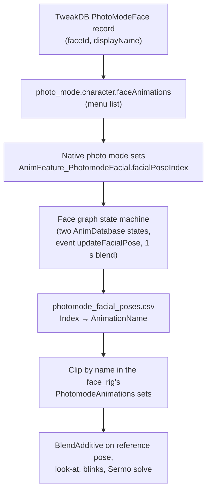

# Facial expressions and idles

**Maturity: Draft.** Consolidated on 26 September 2026 from the installed 2.31 game's resources, its decompiled scripts, the REDmod TweakDB sources shipped with the game, ArchiveXL 1.27.3 and WolvenKit source, installed photo-mode mods, the Modding Docs and the Cyberpunk Blender add-on. Nothing here has runtime evidence of its own. Evidence grades follow the [knowledge rules](README.md): **[source]** engine, framework or tool source or decompiled scripts, **[resource]** extracted game or mod resources, **[wiki]** Modding Docs text or image, **[runtime]** running game, **[hypothesis]** not yet established. Provenance, hashes and commands are in the [expressions evidence note](../research/animation/expressions-evidence.md).

This page answers how V's face gets an expression in photo mode and an idle in the character creator, how mods add to either, and what a Studio expression or idle editor would have to produce. How the facial rig turns controls into bone motion (and the blink in particular) is the subject of [Facial animation and the blink](facial-animation.md); the Studio's current creator-idle preview is described in [CC idle](../research/animation/cc-idle.md). The design options built on these facts are in the [expressions and idles brief](../research/backlog/expressions-and-idles-brief.md).

## 1. The face is driven by controls, not bones

V's face is a solver rig. An animation drives **414 float tracks** on the face skeleton, and the facial setup (`.facialsetup`) turns those values into local bone deltas on 266 of the skeleton's 344 joints [resource] [source].

| Track block (in `trackNames` order) | Count | What it is |
|---|---:|---|
| Envelopes | 13 | Global gates: `faceEnvelope`, `upperFace`, `lowerFace`, `antiStretch`, three lipsync envelopes, `jaliJaw`, `jaliLips`, and four "muzzle" mutes for lips, eyes, brows and eye directions |
| Main-pose weights | 141 | The artist-meaningful controls, 0–1 (see below) |
| Lipsync override weights | 86 | `…AnimOverrideWeight`, reference value 1 |
| Lipsync pose outputs | 141 | Solver outputs |
| Wrinkle outputs | 33 | Solver outputs that can drive wrinkle shading |

The **reference values** matter for anything additive: envelopes and override weights rest at 1, every main pose at 0 [resource]. The main poses are 121 face poses (with 133 in-betweens, 255 correctives, 68 limits and 31 influences), 12 eye poses and 18 tongue poses that share the two jaw controls [resource: pwa basehead facialsetup, measured by the wiki/add-on survey in the evidence note]. The solver order and stages are documented in the add-on's `animation/facial/solver.py` (pinned commit `7a4ee793`) [source].

**Artist-friendly controls** exist by name and mostly come in left/right pairs [resource]:

| Region | Controls |
|---|---|
| Brows | `eye_[lr]_brows_raise_in`, `…raise_out`, `…lower`, `…lateral` |
| Lids | `eye_[lr]_blink`, `…widen`, `…oculi_squint_inner`, `…squint_outer_lower`, `…squint_outer_upper` |
| Gaze and pupils | `eye_[lr]_dir_up/dn/in/out`, `eye_[lr]_pupil_narrow/wide` |
| Nose and cheeks | `nose_[lr]_snear`, `…compress`, `…breathe_in/out`; `cheek_[lr]_suck`, `…puff` |
| Lips (about 40) | corners up/down/wide/stretch/sharp-up/pull, `lips_apart_*`, `…together_*`, `…purse`, `…funnel`, `…suck_*`, `…puff_*`, `…tighten_*`, `…upper_raise`, `…lower_raise`, `…chin_raise`, `…mid_shift_*`, `…nasolabialDeepener`, sticky-lip cutscene controls |
| Jaw | `jaw_mid_open`, `…close`, `…shift_l/r/fwd/back`, `…clench` |
| Neck and ears | `neck_[lr]_stretch`, platysma and sternocleidomastoid flex, `neck_throat_open`, `ear_[lr]_shift_up` |
| Tongue | 16 tongue controls |

Because every clip speaks this control vocabulary, **an expression is a vector of named control weights**, independent of face shape: the same vector plays on any V whose face rig uses the same facial setup [resource; portability across face shapes is a hypothesis to test].

### Which facial setup V actually uses

Every vanilla player `face_rig` component, female and male, in the creator, gameplay and photo-mode appearance files, references **the male player setup** `base\characters\head\pma\h0_001_ma_c__player\h0_001_ma_c__player_rigsetup.facialsetup`, with the gender's own `h0_000_p[wm]a_c__basehead_skeleton.rig` [resource: `face_rig\h0_000__basehead_face_rig.app`, `…_face_rig_photomode.app`, `ep1\…\h0_000__basehead_face_rig_ep1.app`]. Its track mapping (13/141/86/33), 266 used joints and part info are identical to the female `h0_000_pwa_c__basehead_rigsetup.facialsetup` the Studio's idle bake uses, but its **main-pose and corrective transform data differ** and its `useFemaleAnimSet` flag is 0 where the female setup's is 1 [resource]. Whether the engine really solves the female V with that setup, or substitutes another (the Facial Customisation Rig Fix mod adds a facial-customisation component to every player entity), is not established [hypothesis]; it matters for fidelity and is on the runtime list.

## 2. Which graph drives V's face where

| Context | Face graph (`face_rig` component) | Animation sets on the face | Grade |
|---|---|---|---|
| Character creator and inventory preview ("paperdoll") | `_facial_graphs\player_woman_paperdoll_sermo.animgraph` (male: `pma_paperdoll_sermo`) | `ui_female_face.anims` (priority 128) plus the generic facial sets in `man_face_base_animations` | [resource] |
| Photo mode | `player_woman_photomode_sermo.animgraph` (male: `player_man_photomode_sermo`) | `PhotomodeAnimations`: `ui\photomode\photomode_female_facial.anims` and the empty `photomode__v_female__facial.anims` (male twins) | [resource] |
| Gameplay third-person head | The gameplay `face_rig` appearance also uses the paperdoll graph | as the creator | [resource]; what plays outside the creator is [hypothesis] |
| Scenes and dialogue | Scene facial animation is pushed through the graph's `FacialMixerSlot` | `facialCinematicAnimSets` / lipsync sets on the scene | [wiki] [resource: slot node present]; "V has no lipsync" [wiki] |

Both player face graphs share one spine [resource]: reference pose, then **`BlendAdditive` (local, tracks added)** of the context's clip, then `FacialMixerSlot`, `FacialSharedMetaPose`, a facial look-at controller, neck/head twist constraints, eye-direction tracks, and finally the `Sermo` node that runs the facial setup. The look-at controller plays **additive blink clips on gaze changes**: `additive__blink_fast__01` or `…blink_half__01` after 0.15 s (minimum transition 0.85 s) and `additive__blink_slow__01` after 0.25 s (minimum 5 s); these live in `generic_facial_additives.anims` with `tiny` and `normal` variants [resource]. No periodic blink node was found in either graph [resource]; the creator idle clip bakes its own blinks as tracks ([CC idle](../research/animation/cc-idle.md)).

## 3. Photo-mode expressions

### The chain

| Link | Evidence | Grade |
|---|---|---|
| Record type `PhotoModeFace` (`PhotoModeItem` + `int faceId`; fields `displayName`, `locked`) | REDmod `database\photomode\schema.tweak`; `PhotoModeFace_Record.FaceId()` in the decompiled scripts | [resource] [source] |
| 15 vanilla records `PhotoModeFaces.facial_neutral` … `facial_singing_03`, faceId 0–14 | REDmod `faces.tweak`; confirmed present with the same display keys in the installed `tweakdb.bin` and `tweakdb_ep1.bin` | [resource] |
| The menu lists 12 of them (neutral, charming, furious, bored, pissed, pleased, disgusted, happy, scared, surprised, sadness, whistling); the three singing faces are defined but not listed | `photo_mode.character.faceAnimations` in REDmod `photomode.tweak` | [resource] |
| `AnimFeature_PhotomodeFacial { facialPoseIndex: Int32 }` is the only input | decompiled `orphans.script`; the graph's `animFeatures[0]` and two `IntInput` nodes (group `PhotomodeFacial`) | [source] [resource] |
| faceId is passed as `facialPoseIndex` | native; the Mega Pack's records use faceId = CSV Index for 202 faces | [hypothesis], strongly supported by [resource] |
| The CSV `anim_motion_database\photomode_facial_poses.csv` maps Index → `AnimationName`, `streamingContext` (`photomode`), `FallbackAnimationName` (15 vanilla rows, each its own fallback) | extracted 2D array | [resource] |
| Two `AnimDatabase` states swap on the external event `updateFacialPose` with a 1 s linear blend, so changing expression cross-fades | graph | [resource] |
| Vanilla `AnimDatabase` nodes have `isLooped` 0: an expression clip plays once and holds | graph; the Mega Pack's override sets it to 1 to loop animated faces | [resource] |
| Clips are found by name among the `face_rig`'s animation sets; with duplicate names the first match wins | [wiki] (custom facial expressions guide); set order within a component is [hypothesis] | [wiki] |
| Photo mode menu attribute keys: V expression 28, NPC expression 56 | Photo Mode Pose Selector's Lua | [resource] |
| NPC photo-mode puppets can change expression unless `expressionChangingPhotoModePuppet` is false for them | `photomode.tweak` | [resource] |

### What a vanilla expression is

Every vanilla photo-mode expression is a **single pose**: 2 frames, 0.033 s, all 344 joints at reference and all 414 float tracks stored as constants [resource]. Fourteen are `AdditiveFromRefPose`; `facial_sadness` is `Additive` and stores absolute values (envelopes and override weights at 1) instead of deltas [resource]. Because main poses rest at 0 and the solver clamps weights to 0–1 [source], both encodings give the same main-pose weights; they differ only in envelope/override tracks, which saturate [hypothesis].

Decoded female clips (`photomode_female_facial.anims`) are **sparse control vectors** [resource]:

| Expression | Non-zero controls | Strongest controls |
|---|---:|---|
| neutral | 2 | gaze down 0.009 |
| charming | 22 | right sharp corner-up 0.73, right/left corner-up 0.47/0.32, upper lips apart 0.25 |
| happy | 32 | upper lips apart 0.86, right sharp corner-up 0.82, corners up ~0.55, outer squints 0.33 |
| furious | 32 | inner squints 0.9, left snear 0.86, brows lower 0.86, brows lateral 0.84, jaw forward 0.78 |
| scared | 33 | platysma flex 0.98, widen 0.8, inner brow raise 0.65–0.76 |
| surprised | 32 | left widen 0.8, brow raises 0.46–0.62, throat open 0.6 |
| bored | 35 | lips together 0.9, inner brow raise 0.53–0.64, lids 0.18 |
| whistling | 42 | funnel, puff, apart 1.0; gaze out 0.81 |

The expressions are asymmetric by design (charming, disgusted and pissed favour one side), and several hold partly closed lids (bored 0.18, sadness 0.13, whistling ~0.5, singing_01 1.0) [resource]. Male clips live in `photomode_male_facial.anims` against the male skeleton; Johnny has his own set [resource]. The two `photomode__v…_facial.anims` sets attached to V's face rig are empty [resource].

## 4. Photo-mode poses and "idles"

Poses are **body** clips; faces are separate [resource].

- A pose is a `PhotoModePose` record (`animationName`, `category`, `acceptedWeaponConfig`, `poseStateConfig`, `lookAtPreset`, garment-tag filters, `positionOffset`, `rotation`, `animationTime`, `poseSize`, `allowMoveUpDown`), appended to `photo_mode.character.femalePoses` / `malePoses` or a per-NPC list; categories are `PhotoModePoseCategory` records in `poseCategories` [resource] [source].
- The **"Idle" category is a pose category**, not motion: its vanilla clips (`idle_stand_01` … `idle__sniper`, 133 female clips in `photomode__female__idle.anims`) are all 2-frame static poses; the 2.3 "natural" poses are 2–3 frames [resource]. Photo mode therefore has **no body idle loop**; the only motion is look-at and the gaze-triggered blinks. Community tools freeze even that with individual time dilation [resource: Photo Mode Pose Selector].
- The photo-mode puppet (`player_wa_photomode(_ep1).ent`) runs `base\gameplay\anim_graphs\player_photomode.animgraph`, which carries a workspot slot, a mixer slot, `AnimFeature_PhotomodePoseCategory` and head/chest rotation features, plus a default `idle__neutral__female__default` [resource]. How the engine plays a pose by `animationName` is native [hypothesis: through the slot].
- Pose clips carry only 13 body float tracks (body-part visibility, predictive look-at, foot IK) and no face tracks, in vanilla and in every inspected pose pack [resource].

## 5. The character-creator idle

The creator and inventory face graph (`player_woman_paperdoll_sermo.animgraph`) selects clips from `AnimFeature_Paperdoll`, which the preview controller sets from the camera slot [resource] [source: `entityPreviewGameController.script`, `OnSetCameraSetupEvent`]:

| Camera slot | Feature set | Face clip |
|---|---|---|
| `UI_HeadPreview`, `UI_Skin` | `characterCreation_Head` | `ui_closeup_shot` (loop) |
| `UI_Eyes` | `…_Head`, `…_Eyes` | `ui_closeup_shot_eyes` once (4.00 s), then `ui_closeup_shot` |
| `UI_Nose` | `…_Head`, `…_Nose` | `ui_closeup_shot_nose` once (5.67 s), then loop |
| `UI_Lips` | `…_Head`, `…_Lips` | `ui_closeup_shot_lips` once (5.33 s), then loop |
| `UI_Jaw` | `…_Head`, `…_Jaw` | `ui_closeup_shot_chin` once (10.00 s), then loop |
| `UI_Hairs` | `…_Head`, `…_Hair` | `ui_closeup_shot_hair` once (5.17 s), then loop |
| `UI_Teeth` | `…_Head`, `…_Teeth` | `ui_expose_teeth` (loop) |
| `UI_FingerNails` | `…_Nails` | `ui_expose_hand` |
| body / other | none of the head flags | `ui_fullbody_shot`, `ui_closeup_to_fullbody` |
| inventory | `inventoryScreen` | `ui_inventory_pickup` once, then `ui_closeup_shot` |

The close-up state machine starts in the looping `closeup` state. Setting a section flag enters that section's one-shot; its end event moves to a second `closeup` state, which returns to the start only when the flag is false **and** a 15-second timed condition fires, so a section's showcase clip plays once per visit rather than repeating [resource; the timed condition's exact semantics are a hypothesis]. Transitions blend 0.5 s.

So "the game has one idle" is right for the creator's **looping** face idle: `ui_closeup_shot` (22.07 s, `AdditiveFromRefPose`, body counterpart 12.33 s in `ui_female.anims`) is the only loop in the close-up view [resource]. The section clips are `Additive` one-shot showcases, and the eyes showcase is the strong bilateral brow movement noted in the [brow idle gap](../research/animation/brow-idle-gap.md): it plays when the creator's eyes section is opened [resource; to confirm in game].

Elsewhere the game has **many facial idles, but for NPCs**: `generic_average_female_facial_idle.anims` holds 20 looping emotion idles (`idle__neutral__female`, `…joy…`, `…anger…`, `…fear…` and so on, 21–29 s, `AdditiveFromRefPose`), used by NPC reactions and by AMM [resource]. The player's face rig lists these generic sets too [resource], but no vanilla graph path was found that loops one on V outside scenes [hypothesis].

## 6. How mods add expressions, poses and idles

| What | Route | Limits | Grade |
|---|---|---|---|
| New photo-mode **pose** | ArchiveXL `animations:` entry (`entity` = scope `photomode_wa.ent` / `_ma` / `_mb` or explicit `.ent`, `set` = `.anims`); TweakXL `PhotoModePoses.<id>` (`$base: PhotoModePoses.idle_stand_01`) appended to the pose lists, optional category and localisation | Additive and conflict-free; well trodden (45 installed mods use `animations:`) | [resource] [wiki] |
| New photo-mode **expression** (Photomode Facial Expression Mega Pack) | TweakXL `PhotoModeFaces.<id>` (`$base: facial_neutral`, new `faceId`) appended to `faceAnimations`; a **whole-file replacement** of `photomode_facial_poses.csv` with the extra rows; ArchiveXL `resource.patch` of `face_rig\h0_000__basehead_face_rig_photomode.app` (and each NPC photo-mode app) re-declaring the `PhotomodeAnimations` component with the vanilla set plus new sets; whole-file replacements of both photo-mode face graphs to loop animated faces | The CSV and the graphs are single-owner files, so two expression mods conflict; ArchiveXL can merge animation-setup entries and patch entities, apps and meshes, but not 2D arrays or animation graphs; no photo-mode scope covers face apps; 217 rows are shown to work, no list cap found | [resource] [source] |
| Replace a vanilla expression | Overwrite a `facial_*` entry in `photomode_*_facial.anims` (copy any facial clip and rename it) | Global and exclusive; a fixed set of 12 visible slots | [wiki] |
| AMM expressions | Runtime: `AnimFeature_FacialReaction { category, idle }` applied to the NPC after resetting its reaction manager; clips are the generic NPC facial idles (`idle__<emotion>__…`) | Uses the NPC reaction system, not photo mode | [resource] |
| AMM poses | Workspot: spawn a collab entity and `PlayInDeviceSimple` / `SendJumpToAnimEnt` | AMM-only | [resource] [wiki] |
| Creator idle | No mod inspected changes it. Candidate routes: replace `ui_female_face.anims`, or add a same-named clip at a higher priority through ArchiveXL `animations:` with `component: face_rig` | Name shadowing by priority is untested | [hypothesis] |

ArchiveXL's `animations:` entries accept `entity` (path or scope), `set`, `priority`, `vars` and **`component`**; entries are appended to the matching `entAnimatedComponent`'s `animations.gameplay` when it initialises, keyed by the component owner's template path, or by the component name plus that path [source: ArchiveXL 1.27.3 `Extensions/Animation/Config.cpp`, `Extension.cpp`]. Whether the face rig's owner template is the head item's entity is not established [hypothesis].

## 7. Authoring and export

- **An expression exports as a vanilla-shaped clip**: one `.anims` entry, 2 frames, `AdditiveFromRefPose`, the face skeleton's 344 joints at reference and 414 constant float tracks carrying the control vector [resource: every vanilla expression has this shape]. An animated expression or idle is the same with keyed tracks at 30 fps [resource: the creator and NPC idles].
- **WolvenKit can write it.** `ModTools.ImportAnims` reads glTF animations with `trackKeys` / `constTrackKeys` extras, keeps `animationType` (including `AdditiveFromRefPose`), and encodes a compressed buffer by default or SIMD when asked; the format is picked from a `.anims.glb` file name [source: WolvenKit 9.0.2 nightly `AnimationTools.cs`, `ModTools.Types.cs`]. It needs the set's rig resolvable from the game archives. Vanilla facial clips use the compressed buffer, so the SIMD re-import caveat in [CC idle](../research/animation/cc-idle.md) does not apply to them. Whether the 9.0.1 CLI's `import` reaches this path is untested [hypothesis].
- **The Blender add-on** round-trips the same `trackKeys` / `constTrackKeys` extras and can solve and preview a facial setup, but has no expression authoring UI and no evidence of a clip being re-imported and played in game [source] [wiki].
- **Registration** follows §6: TweakXL records for the menu, a clip set on the photo-mode face rig, and a CSV row per expression.

Nothing in this section has been tried end to end; the first in-game test decides it.

## Open questions

Questions 1 and 2 have bridge commands ready (`face.rig.read` and `photo.expression.index`, offline only) and are on the runtime bridge's next [test card](../research/runtime/runtime-bridge-test-card.md#expression-checks-r1-and-r2).

1. Does the engine use the male player facial setup for the female V, as the `face_rig` components say? The face rig lives on the photo-mode head **item** (`Items.PlayerWaPhotomodeHead` in `AttachmentSlots.TppHead`), not on the puppet, and that item's own `player_wa_tpp_head.ent` carries a placeholder `face_rig` (demo_vicky facial setup, `woman_average_sermo` graph, no sets) beside the photo-mode `.app`'s one [resource]. A read-only CET probe of the live head item is prepared in [session 3 Part D](../experiments/022-session-3/README.md#part-d-expression-console-checks-optional) ([API evidence](../research/animation/expressions-evidence.md#session-3-probes)).
2. Is faceId passed straight to `facialPoseIndex`, and does the database look rows up by the Index column or by position (can Index values be sparse)? With the Mega Pack, menu position and faceId differ for most faces ("Static: Sleeping" is 57th in the menu list (index 56) but has faceId 60), so picking it in the menu tells the two apart; its CSV's Index equals row position everywhere, so sparseness needs a test CSV (brief R5) [resource].
3. Does ArchiveXL `animations:` with `component: face_rig` reach the photo-mode face rig, and does a higher-priority set shadow a vanilla clip name?
4. Does a WolvenKit-imported 2-frame `AdditiveFromRefPose` float-track clip play in photo mode exactly as the preview solves it?
5. What does the paperdoll graph play on V's face outside the creator, and can a scene or reaction feature drive a looping facial idle on V?
6. Can a photo-mode pose clip with many frames animate while photo mode is open, or does photo mode's time freeze it? (The Mega Pack says its animated faces loop, which suggests the face at least keeps time.)
7. Do the expression mods' baked blinks stack with the look-at blink additives?

## Related pages

[CC idle](../research/animation/cc-idle.md) · [Brow idle gap](../research/animation/brow-idle-gap.md) · [Idle controls design](../research/animation/idle-controls-design.md) · [Idle guide](../docs/idle-animation-guide.md) · [Runtime access](runtime-access.md) · [Mod loading](mod-loading.md) · [CC file chain](cc-file-chain.md) · [Expressions and idles brief](../research/backlog/expressions-and-idles-brief.md)
