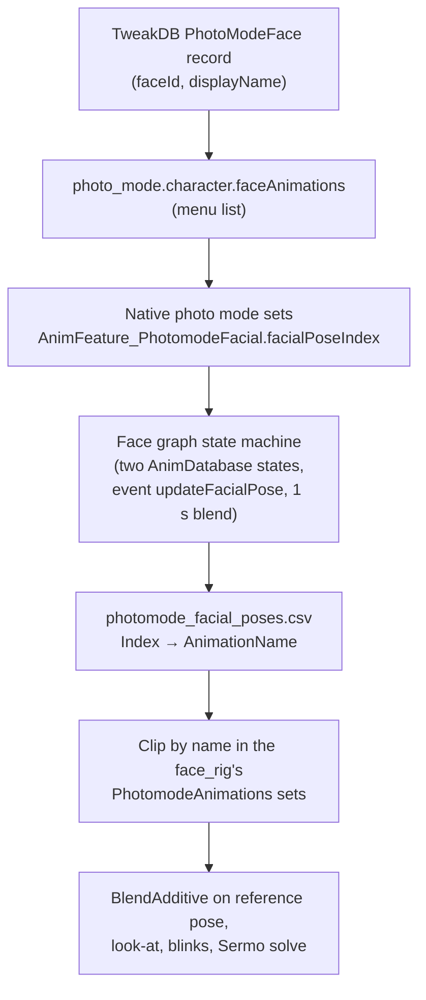

# Facial expressions and idles

**Maturity: Draft.** Consolidated on 26 September 2026 (the control measurements, natural expressions, cheek range and wrinkle regions of §8 on 27 September) from the installed 2.31 game's resources, its decompiled scripts, the REDmod TweakDB sources shipped with the game, ArchiveXL 1.27.3 and WolvenKit source, installed photo-mode mods, the Modding Docs and the Cyberpunk Blender add-on. Runtime evidence from the bridge's session 4 (28 September; [experiment 029](../experiments/029-session-4/README.md#35-n7-photo-mode-expressions-parity-eye-and-skin-light)) answers which face rig is live and how the expression index is applied (§1, §3). Evidence grades follow the [knowledge rules](README.md): **[source]** engine, framework or tool source or decompiled scripts, **[resource]** extracted game or mod resources, **[wiki]** Modding Docs text or image, **[runtime]** running game, **[hypothesis]** not yet established. Provenance, hashes and commands are in the [expressions evidence note](../research/animation/expressions-evidence.md).

This page answers how V's face gets an expression in photo mode and an idle in the character creator, how mods add to either, and what a Studio expression or idle editor would have to produce. How the facial rig turns controls into bone motion (and the blink in particular) is the subject of [Facial animation and the blink](facial-animation.md); the Studio's current creator-idle preview is described in [CC idle](../research/animation/cc-idle.md). The design options built on these facts are in the [expressions and idles brief](../research/backlog/expressions-and-idles-brief.md).

## 1. The face is driven by controls, not bones

V's face is a solver rig. An animation drives **414 float tracks** on the face skeleton, and the facial setup (`.facialsetup`) turns those values into local bone deltas on 266 of the skeleton's 344 joints [resource] [source].

| Track block (in `trackNames` order) | Count | What it is |
|---|---:|---|
| Envelopes | 13 | Global gates: `faceEnvelope`, `upperFace`, `lowerFace`, `antiStretch`, three lipsync envelopes, `jaliJaw`, `jaliLips`, and four "muzzle" mutes for lips, eyes, brows and eye directions |
| Main-pose weights | 141 | The artist-meaningful controls, 0–1 (see below) |
| Lipsync override weights | 86 | `…AnimOverrideWeight`, reference value 1; lip-sync clips lower them to mute the expression's mouth ([lip sync](lipsync.md)) |
| Lipsync pose outputs | 141 | Despite the name, values lip-sync clips write and the solver adds to the main-pose weights ([lip sync](lipsync.md)) |
| Wrinkle outputs | 33 | Solver outputs, each `1 − (1 − w)²` of one control, named after the regions of `defaultfaceregions.regionset` that the skin shader wrinkles (§8) |

The **reference values** matter for anything additive: override weights and most envelopes rest at 1 (`antiStretch`, `lipSyncEnvelope` and the four muzzles rest at 0), every main pose at 0 [resource]. The main poses are 121 face poses (with 133 in-betweens, 255 correctives, 68 limits and 31 influences), 12 eye poses and 18 tongue poses that share the two jaw controls [resource: pwa basehead facialsetup, measured by the wiki/add-on survey in the evidence note]. The solver's stages are described, in our own words, in the clean-room [facial solver specification](../research/animation/facial-solver-spec.md), read from the add-on at pinned commit `7a4ee793` [source].

**Artist-friendly controls** exist by name and mostly come in left/right pairs [resource]:

| Region | Controls |
|---|---|
| Brows | `eye_[lr]_brows_raise_in`, `…raise_out`, `…lower`, `…lateral` |
| Lids | `eye_[lr]_blink`, `…widen`, `…oculi_squint_inner`, `…squint_outer_lower`, `…squint_outer_upper` |
| Gaze and pupils | `eye_[lr]_dir_up/dn/in/out`, `eye_[lr]_pupil_narrow/wide` |
| Nose and cheeks | `nose_[lr]_snear`, `…compress`, `…breathe_in/out`; `cheek_[lr]_suck`, `…puff` |
| Lips (about 40) | corners up/down/wide/stretch/sharp-up/pull, `lips_apart_*`, `…together_*`, `…purse`, `…funnel`, `…suck_*`, `…puff_*`, `…tighten_*`, `…upper_raise`, `…lower_raise`, `…chin_raise`, `…mid_shift_*`, `…nasolabialDeepener`, sticky-lip cutscene controls |
| Jaw | `jaw_mid_open`, `…close`, `…shift_l/r/fwd/back`, `…clench` |
| Neck and ears | `neck_[lr]_stretch`, platysma and sternocleidomastoid flex, `neck_throat_open`, `ear_[lr]_shift_up` |
| Tongue | 16 tongue controls |

Because every clip speaks this control vocabulary, **an expression is a vector of named control weights**, independent of face shape: the same vector plays on any V whose face rig uses the same facial setup [resource; portability across face shapes is a hypothesis to test].

### Which facial setup V actually uses

Every vanilla player `face_rig` component, female and male, in the creator, gameplay and photo-mode appearance files, references **the male player setup** `base\characters\head\pma\h0_001_ma_c__player\h0_001_ma_c__player_rigsetup.facialsetup`, with the gender's own `h0_000_p[wm]a_c__basehead_skeleton.rig` [resource: `face_rig\h0_000__basehead_face_rig.app`, `…_face_rig_photomode.app`, `ep1\…\h0_000__basehead_face_rig_ep1.app`]. Against the female head's own `h0_000_pwa_c__basehead_rigsetup.facialsetup` it has the same track mapping (13/141/86/33), part info, envelopes, limits, influences, main poses and in-betweens, and 254 of 255 face correctives with the same names and drivers (stored in another order; one purse-and-funnel corrective differs by side and in-between), but **different pose data**: 77 of the 133 main face in-between poses and 238 of the 255 face correctives move other joint lists, by up to 19° and 7 mm; and its `useFemaleAnimSet` flag is 0 where the female setup's is 1 [resource] ([experiment 031](../experiments/031-photo-mode-facial-setup/README.md)).

**In photo mode the engine does use it for the female V** [runtime, session 4]. The live `face_rig` sits on the photo-mode **stand-in** (`NPCPuppet`), not on the head item `Items.PlayerWaPhotomodeHead`, which carries no `face_rig`, `man_face_base_animations` or `PhotomodeAnimations` at all. The stand-in's `face_rig` reports these path hashes (FNV-1a64 of the lower-case depot path), which match these files [offline]:

| Field | Hash | Depot path |
|---|---|---|
| Facial setup | `6833a322173f7bdd` | `base\characters\head\pma\h0_001_ma_c__player\h0_001_ma_c__player_rigsetup.facialsetup` (the male player setup) |
| Graph | `5e58ab89d2287d68` | `base\animations\facial\_facial_graphs\player_woman_photomode_sermo.animgraph` |
| Rig | `5af1e771498830a5` | `base\characters\head\player_base_heads\player_female_average\h0_000_pwa_c__basehead\h0_000_pwa_c__basehead_skeleton.rig` |

The same entity holds `man_face_base_animations` (57 gameplay sets) and `PhotomodeAnimations` (16 sets), all at priority 200, on a profile with the Photomode Facial Expression Mega Pack and one XF Expressions set installed. So the placeholder `face_rig` in `player_wa_tpp_head.ent` isn't the live one in photo mode. Whether the creator and gameplay faces use it too wasn't read.

**The difference shows, and the preview now follows the game** (design D1, 29 September). Solved on the female skeleton, the two setups put the same expression's joints 1.6 to 5.8 mm apart (median 2.8 mm over the vanilla photo-mode expressions); a smile at 0.5 to 0.7 bunches beside the nose about 9 points less with the male setup (the fold gap closes 38 to 46 % against 47 to 56 %) and lifts the malar cheek 25 to 30 % more [offline] ([experiment 031](../experiments/031-photo-mode-facial-setup/README.md)). The Studio's facial host solves with the setup the photo-mode face rig names for the female skeleton, read from the winning `.app` and its ArchiveXL patches (`readFaceRigSetup`), so a mod that re-points the face rig is followed; the blink and the idle share that face. The female head's own setup is the fallback and a developer's comparison (`XFS_FACIAL_SETUP=female-head`).

## 2. Which graph drives V's face where

| Context | Face graph (`face_rig` component) | Animation sets on the face | Grade |
|---|---|---|---|
| Character creator and inventory preview ("paperdoll") | `_facial_graphs\player_woman_paperdoll_sermo.animgraph` (male: `pma_paperdoll_sermo`) | `ui_female_face.anims` (priority 128) plus the generic facial sets in `man_face_base_animations` | [resource] |
| Photo mode | `player_woman_photomode_sermo.animgraph` (male: `player_man_photomode_sermo`) | `PhotomodeAnimations`: `ui\photomode\photomode_female_facial.anims` and the empty `photomode__v_female__facial.anims` (male twins) | [resource]; the graph, and both components on the photo-mode stand-in, confirmed in game [runtime] (§1) |
| Gameplay third-person head | The gameplay `face_rig` appearance also uses the paperdoll graph | as the creator | [resource]; what plays outside the creator is [hypothesis] |
| Scenes and dialogue | Scene facial animation and lip sync are pushed through the graph's `FacialMixerSlot` | `facialCinematicAnimSets` on the scene; lip-sync sets found through the per-language lipmap, V's included ([lip sync](lipsync.md)) | [wiki] [resource: slot node present; V has lip-sync sets in 456 scenes, although the wiki's generator guide says V has none] |

Both player face graphs share one spine [resource]: reference pose, then **`BlendAdditive` (local, tracks added)** of the context's clip, then `FacialMixerSlot`, `FacialSharedMetaPose`, a facial look-at controller, neck/head twist constraints, eye-direction tracks, and finally the `Sermo` node that runs the facial setup. The look-at controller plays **additive blink clips on gaze changes**: `additive__blink_fast__01` or `…blink_half__01` after 0.15 s (minimum transition 0.85 s) and `additive__blink_slow__01` after 0.25 s (minimum 5 s); these live in `generic_facial_additives.anims` with `tiny` and `normal` variants [resource]. No periodic blink node was found in either graph [resource]; the creator idle clip bakes its own blinks as tracks ([CC idle](../research/animation/cc-idle.md)).

## 3. Photo-mode expressions

### The chain

```mermaid
flowchart TD
  A["TweakDB PhotoModeFace record<br/>(faceId, displayName)"] --> B["photo_mode.character.faceAnimations<br/>(menu list)"]
  B --> C["Native photo mode sets<br/>AnimFeature_PhotomodeFacial.facialPoseIndex"]
  C --> D["Face graph state machine<br/>(two AnimDatabase states,<br/>event updateFacialPose, 1 s blend)"]
  D --> E["photomode_facial_poses.csv<br/>Index → AnimationName"]
  E --> F["Clip by name in the face_rig's<br/>PhotomodeAnimations sets"]
  F --> G["BlendAdditive on reference pose,<br/>look-at, blinks, Sermo solve"]
```

| Link | Evidence | Grade |
|---|---|---|
| Record type `PhotoModeFace` (`PhotoModeItem` + `int faceId`; fields `displayName`, `locked`) | REDmod `database\photomode\schema.tweak`; `PhotoModeFace_Record.FaceId()` in the decompiled scripts | [resource] [source] |
| 15 vanilla records `PhotoModeFaces.facial_neutral` … `facial_singing_03`, faceId 0–14 | REDmod `faces.tweak`; confirmed present with the same display keys in the installed `tweakdb.bin` and `tweakdb_ep1.bin` | [resource] |
| The menu lists 12 of them (neutral, charming, furious, bored, pissed, pleased, disgusted, happy, scared, surprised, sadness, whistling); the three singing faces are defined but not listed | `photo_mode.character.faceAnimations` in REDmod `photomode.tweak` | [resource] |
| `AnimFeature_PhotomodeFacial { facialPoseIndex: Int32 }` is the only input | decompiled `orphans.script`; the graph's `animFeatures[0]` and two `IntInput` nodes (group `PhotomodeFacial`) | [source] [resource] |
| faceId is passed as `facialPoseIndex`, and it is the CSV's index, **not the menu's option value** | `photo.expression.index` 60 on the stand-in shows "Static: Sleeping" (faceId 60), which the menu offers as option value 56; index 56 shows "Static: Skeptical" (menu value 52). The menu's value is the entry's position in the list; with the Mega Pack and one XF set installed it trails the faceId by 4 at Sleeping and by 10 at the list's end (faceIds 217–219 at menu values 207–209). The Mega Pack's records use faceId = CSV Index for 202 faces | [runtime] session 4; [resource] |
| **Only the stand-in takes the feature**: `AnimFeature_PhotomodeFacial` applied to the photo-mode stand-in changes the face and holds (5 s and more); applied to the head item it does nothing. Undo through the menu restores it | bridge `photo.expression.index` on both targets | [runtime] session 4 |
| The CSV `anim_motion_database\photomode_facial_poses.csv` maps Index → `AnimationName`, `streamingContext` (`photomode`), `FallbackAnimationName` (15 vanilla rows, each its own fallback) | extracted 2D array | [resource] |
| Two `AnimDatabase` states swap on the external event `updateFacialPose` with a 1 s linear blend, so changing expression cross-fades | graph | [resource] |
| Vanilla `AnimDatabase` nodes have `isLooped` 0: an expression clip plays once and holds | graph; the Mega Pack's override sets it to 1 to loop animated faces | [resource] |
| Clips are found by name among the `face_rig`'s animation sets; with duplicate names the first match wins | [wiki] (custom facial expressions guide); set order within a component is [hypothesis] | [wiki] |
| Photo mode menu attribute keys: V expression 28, NPC expression 56 | Photo Mode Pose Selector's Lua | [resource] |
| NPC photo-mode puppets can change expression unless `expressionChangingPhotoModePuppet` is false for them | `photomode.tweak` | [resource] |

### What a vanilla expression is

Every vanilla photo-mode expression is a **single pose**: 2 frames, 0.033 s, all 344 joints at reference and all 414 float tracks stored as constants [resource]. Fourteen are `AdditiveFromRefPose`; `facial_sadness` is `Additive` and stores absolute values (envelopes and override weights at 1) instead of deltas [resource]. Because main poses rest at 0 and the solver clamps weights to 0–1 [source], both encodings give the same main-pose weights; they differ only in envelope/override tracks, which saturate [hypothesis].

Decoded female clips (`photomode_female_facial.anims`) are **sparse control vectors** [resource]:

| Expression | Non-zero controls | Strongest controls |
|---|---:|---|
| neutral | 2 | gaze down 0.009 |
| charming | 22 | right sharp corner-up 0.73, right/left corner-up 0.47/0.32, upper lips apart 0.25 |
| happy | 32 | upper lips apart 0.86, right sharp corner-up 0.82, corners up ~0.55, outer squints 0.33 |
| furious | 32 | inner squints 0.9, left snear 0.86, brows lower 0.86, brows lateral 0.84, jaw forward 0.78 |
| scared | 33 | platysma flex 0.98, widen 0.8, inner brow raise 0.65–0.76 |
| surprised | 32 | left widen 0.8, brow raises 0.46–0.62, throat open 0.6 |
| bored | 35 | lips together 0.9, inner brow raise 0.53–0.64, lids 0.18 |
| whistling | 42 | funnel, puff, apart 1.0; gaze out 0.81 |

The expressions are asymmetric by design (charming, disgusted and pissed favour one side), and several hold partly closed lids (bored 0.18, sadness 0.13, whistling ~0.5, singing_01 1.0) [resource]. Male clips live in `photomode_male_facial.anims` against the male skeleton; Johnny has his own set [resource]. The two `photomode__v…_facial.anims` sets attached to V's face rig are empty [resource].

## 4. Photo-mode poses and "idles"

Poses are **body** clips; faces are separate [resource]. The full pose chain (lists, records, clip format, the deformation rig and the mod routes) is in [poses](poses.md).

- A pose is a `PhotoModePose` record (`animationName`, `category`, `acceptedWeaponConfig`, `poseStateConfig`, `lookAtPreset`, garment-tag filters, `positionOffset`, `rotation`, `animationTime`, `poseSize`, `allowMoveUpDown`), appended to `photo_mode.character.femalePoses` / `malePoses` or a per-NPC list; categories are `PhotoModePoseCategory` records in `poseCategories` [resource] [source].
- The **"Idle" category is a pose category**, not motion: its vanilla clips (`idle_stand_01` … `idle__sniper`, 133 female clips in `photomode__female__idle.anims`) are all 2-frame static poses; the 2.3 "natural" poses are 2–3 frames [resource]. Photo mode therefore has **no body idle loop**; the only motion is look-at and the gaze-triggered blinks. Community tools freeze even that with individual time dilation [resource: Photo Mode Pose Selector].
- The photo-mode puppet (`player_wa_photomode(_ep1).ent`) runs `base\gameplay\anim_graphs\player_photomode.animgraph`, which carries a workspot slot, a mixer slot, `AnimFeature_PhotomodePoseCategory` and head/chest rotation features, plus a default `idle__neutral__female__default` [resource]. How the engine plays a pose by `animationName` is native [hypothesis: through the slot].
- Pose clips carry only 13 body float tracks (body-part visibility, predictive look-at, foot IK) and no face tracks, in vanilla and in every inspected pose pack [resource].

## 5. The character-creator idle

The creator and inventory face graph (`player_woman_paperdoll_sermo.animgraph`) selects clips from `AnimFeature_Paperdoll`, which the preview controller sets from the camera slot [resource] [source: `entityPreviewGameController.script`, `OnSetCameraSetupEvent`]:

| Camera slot | Feature set | Face clip |
|---|---|---|
| `UI_HeadPreview`, `UI_Skin` | `characterCreation_Head` | `ui_closeup_shot` (loop) |
| `UI_Eyes` | `…_Head`, `…_Eyes` | `ui_closeup_shot_eyes` once (4.00 s), then `ui_closeup_shot` |
| `UI_Nose` | `…_Head`, `…_Nose` | `ui_closeup_shot_nose` once (5.67 s), then loop |
| `UI_Lips` | `…_Head`, `…_Lips` | `ui_closeup_shot_lips` once (5.33 s), then loop |
| `UI_Jaw` | `…_Head`, `…_Jaw` | `ui_closeup_shot_chin` once (10.00 s), then loop |
| `UI_Hairs` | `…_Head`, `…_Hair` | `ui_closeup_shot_hair` once (5.17 s), then loop |
| `UI_Teeth` | `…_Head`, `…_Teeth` | `ui_expose_teeth` (loop) |
| `UI_FingerNails` | `…_Nails` | `ui_expose_hand` |
| body / other | none of the head flags | `ui_fullbody_shot`, `ui_closeup_to_fullbody` |
| inventory | `inventoryScreen` | `ui_inventory_pickup` once, then `ui_closeup_shot` |

The close-up state machine starts in the looping `closeup` state. Setting a section flag enters that section's one-shot; its end event moves to a second `closeup` state, which returns to the start only when the flag is false **and** a 15-second timed condition fires, so a section's showcase clip plays once per visit rather than repeating [resource; the timed condition's exact semantics are a hypothesis]. Transitions blend 0.5 s.

The body graph (`player_paperdoll.animgraph`) loops its own clip per screen: `ui_closeup_shot`, `ui_fullbody_shot`, the nails loop, gender selection and the inventory's `UI_full_shot` ([body animation §2](body-animation.md#2-the-preview-idles)).

So "the game has one idle" is right for the creator's **looping** face idle: `ui_closeup_shot` (22.07 s, `AdditiveFromRefPose`, body counterpart 12.33 s in `ui_female.anims`) is the only loop in the close-up view [resource]. The section clips are `Additive` one-shot showcases, and the eyes showcase is the strong bilateral brow movement noted in the [brow idle gap](../research/animation/brow-idle-gap.md): it plays when the creator's eyes section is opened [resource; to confirm in game]. They store deltas like the loop (their envelope tracks add 0) [resource]. The eye camera serves the eyes, eyebrows, eyelash colour and eye makeup rows, and the creator requests a row's camera when the row is hovered or changed, so moving between an eye-area row and any other row can play the showcase again [source; the replay timing is a hypothesis]. Its brows move about 11 times as far as the loop's; the Studio plays it as the **Creator close-up, eyes section** idle ([facial animation §6](facial-animation.md#6-the-idles-upper-face)).

Elsewhere the game has **many facial idles, but for NPCs**: `generic_average_female_facial_idle.anims` holds 20 looping emotion idles (`idle__neutral__female`, `…joy…`, `…anger…`, `…fear…` and so on, 21–29 s, `AdditiveFromRefPose`), used by NPC reactions and by AMM [resource]. The player's face rig lists these generic sets too [resource], but no vanilla graph path was found that loops one on V outside scenes [hypothesis].

## 6. How mods add expressions, poses and idles

| What | Route | Limits | Grade |
|---|---|---|---|
| New photo-mode **pose** | ArchiveXL `animations:` entry (`entity` = scope `photomode_wa.ent` / `_ma` / `_mb` or explicit `.ent`, `set` = `.anims`); TweakXL `PhotoModePoses.<id>` (`$base: PhotoModePoses.idle_stand_01`) appended to the pose lists, optional category and localisation | Additive and conflict-free; well trodden (45 installed mods use `animations:`) | [resource] [wiki] |
| New photo-mode **expression** (Photomode Facial Expression Mega Pack) | TweakXL `PhotoModeFaces.<id>` (`$base: facial_neutral`, new `faceId`) appended to `faceAnimations`; a **whole-file replacement** of `photomode_facial_poses.csv` with the extra rows; ArchiveXL `resource.patch` of `face_rig\h0_000__basehead_face_rig_photomode.app` (and each NPC photo-mode app) re-declaring the `PhotomodeAnimations` component with the vanilla set plus new sets; whole-file replacements of both photo-mode face graphs to loop animated faces | The CSV and the graphs are single-owner files, so two expression mods conflict; ArchiveXL can merge animation-setup entries and patch entities, apps and meshes, but not 2D arrays or animation graphs; no photo-mode scope covers face apps; 217 rows are shown to work, no list cap found | [resource] [source] |
| Replace a vanilla expression | Overwrite a `facial_*` entry in `photomode_*_facial.anims` (copy any facial clip and rename it) | Global and exclusive; a fixed set of 12 visible slots | [wiki] |
| AMM expressions | Runtime: `AnimFeature_FacialReaction { category, idle }` applied to the NPC after resetting its reaction manager; clips are the generic NPC facial idles (`idle__<emotion>__…`) | Uses the NPC reaction system, not photo mode | [resource] |
| AMM poses | Workspot: spawn a collab entity and `PlayInDeviceSimple` / `SendJumpToAnimEnt` | AMM-only | [resource] [wiki] |
| Creator idle | No mod inspected changes it. Candidate routes: replace `ui_female_face.anims`, or add a same-named clip at a higher priority through ArchiveXL `animations:` with `component: face_rig` | Name shadowing by priority is untested | [hypothesis] |

**Adding beside other expression mods.** The Mega Pack's patch `.app` holds V's two photo-mode face appearances, each with one `entAnimationSetupExtensionComponent` named `PhotomodeAnimations` (the vanilla component's id), bound to `face_rig` by an `entAnimationControlBinding`, in the appearance's `compiledData` package; its menu records use literal `displayName` strings [resource]. ArchiveXL merges a patch appearance's components by **name and id**: a match replaces, anything else is added [source: ArchiveXL 1.27.3 `ResourcePatch/Extension.cpp` `MergeComponents`]. So two mods that both re-declare `PhotomodeAnimations` replace each other's sets, while a component with a new name adds its sets beside theirs; the vanilla appearance already binds two extension components to `face_rig` [resource]. TweakXL records and `!append-once` list entries are additive; only the table is single-owner.

ArchiveXL's `animations:` entries accept `entity` (path or scope), `set`, `priority`, `vars` and **`component`**; entries are appended to the matching `entAnimatedComponent`'s `animations.gameplay` when it initialises, keyed by the component owner's template path, or by the component name plus that path [source: ArchiveXL 1.27.3 `Extensions/Animation/Config.cpp`, `Extension.cpp`]. Whether the face rig's owner template is the head item's entity is not established [hypothesis].

## 7. Authoring and export

- **An expression exports as a vanilla-shaped clip**: one `.anims` entry, 2 frames, `AdditiveFromRefPose`, the face skeleton's 344 joints at reference and 414 constant float tracks carrying the control vector [resource: every vanilla expression has this shape]. An animated expression or idle is the same with keyed tracks at 30 fps [resource: the creator and NPC idles]. Byte layout of a vanilla static face [resource, decoded 28 September]: 1,032 constant joint keys (identical in every static face of a gender's set), then 414 constant track keys in track order, every track but the main poses 0; 19,824 bytes; duration 0.0333333351 s. The Studio writes this layout directly and has WolvenKit `deserialize` the set's JSON, since WolvenKit rebuilds a set's data from `animationDataChunks` and each clip's `dataAddress` and ignores its own decoded copy on write [source: WolvenKit `AnimationReader`, `animAnimationBufferCompressed`].
- **WolvenKit can write it.** `ModTools.ImportAnims` reads glTF animations with `trackKeys` / `constTrackKeys` extras, keeps `animationType` (including `AdditiveFromRefPose`), and encodes a compressed buffer by default or SIMD when asked; the format is picked from a `.anims.glb` file name [source: WolvenKit 9.0.2 nightly `AnimationTools.cs`, `ModTools.Types.cs`]. It needs the set's rig resolvable from the game archives. Vanilla facial clips use the compressed buffer, so the SIMD re-import caveat in [CC idle](../research/animation/cc-idle.md) does not apply to them. Whether the 9.0.1 CLI's `import` reaches this path is untested [hypothesis].
- **The Blender add-on** round-trips the same `trackKeys` / `constTrackKeys` extras and can solve and preview a facial setup, but has no expression authoring UI and no evidence of a clip being re-imported and played in game [source] [wiki].
- **Registration** follows §6: TweakXL records for the menu, a clip set on the photo-mode face rig through a separately named component, and a CSV row per expression. The table is one file per game: a mod built for the player's own setup carries the installed table's rows; a mod to share can't carry another mod's rows and so conflicts with any other expression mod over the table ([export design §6.3](../research/animation/expression-editor-design.md#63-the-expression-table-and-precedence-decision-2)).

Nothing in this section has been tried end to end; the first in-game test decides it.

### What the Studio's expression editor reads (phase 1)

The [expression editor](../research/animation/expression-editor-design.md#phase-1-status) reads the facts above from the player's own files, the way the game resolves them:

- **A clip's float tracks** sit in its `animAnimationBufferCompressed` data after the joint keys: 8 bytes per key, animated keys as `u16` normalised time, `u16` track, `f32` value, then constant keys as `u16` track, `u16` time, `f32` value; the data is at the clip's `dataAddress` in the set's `animationDataChunks` [source: WolvenKit `animAnimationBufferCompressed.ReadBuffer`, read and reimplemented]. Decoding the vanilla female set this way reproduces the table in §3 (`facial_happy`: upper lips apart 0.86, right sharp corner up 0.82) [offline].
- **The installed expressions on the reference setup**: the winning table is the Mega Pack's (217 rows); V's photo-mode face rig and the pack's `resource.patch` of it list the animation sets by **hash only** (`ResourcePath` stored as `uint64` in the cooked file), so a reader must look them up by hash; every row's clip is found in an attached set (15 from the base game, 202 from the pack) [offline, 27 September].
- **The rig's controls** come from the female head's skeleton (`trackNames`, `referenceTracks`) and its facial setup's `info.tracksMapping` (13 envelopes, 141 main poses, 86 overrides, 33 wrinkles) [resource].
- **Solving** one pose with the pinned IO Suite solver takes about 0.7 ms after the setup compiles (about 0.2 s) [offline].
- **A change between expressions** can play as motion (the drawer's Transitions, [design §5.5](../research/animation/expression-editor-design.md#55-animated-transitions)): the control weights are blended in time before each frame's solve, which is where photo mode's graph blends its tracks, and the default (1 s, linear) is the graph's own `updateFacialPose` transition [resource]. The Studio solves every frame of the change exactly, so correctives respond as the weights move; whether the game's switch looks the same is open question 9 [hypothesis].

## 8. Natural expressions: FACS on V's rig

What the controls do, measured by solving each one alone with the pinned solver and posing the face skeleton, and checked in the Studio's live preview ([natural expressions](../research/animation/natural-expressions.md), [experiment 026](../experiments/026-natural-expressions/README.md)). All of it is preview evidence on the female head's own facial setup; none is from the game.

- **Most FACS action units have a counterpart** among the main-pose controls: AU1 `eye_[lr]_brows_raise_in`, AU2 `…raise_out`, AU4 `…brows_lower` with `…brows_lateral` (which draws the brow **toward the nose**), AU5 `…widen`, AU6 `eye_[lr]_oculi_squint_outer_lower` (cheek and lower lid up) with some `…outer_upper` (outer brow down), AU7 `…squint_inner`, AU9 `nose_[lr]_snear`, AU10 `lips_[lr]_upper_raise` and `lips_[lr]_pull`, AU11 `…nasolabialDeepener`, AU12 `…corner_up`, AU13 `…corner_sharp_up`, AU14 `…corner_wide`, AU15 `…corner_dn`, AU16 `lips_[lr]_lower_raise` with `lips_apart_dn`, AU17 `lips_chin_raise`, AU18 `…purse`, AU20 `…corner_stretch`, AU22 `…funnel`, AU25 `lips_apart_*`, AU26/27 `jaw_mid_open`, AU28 `lips_suck_*`, AU61–64 `eye_[lr]_dir_*` [observed] [offline]. The full table, with measured motion, is in the research note.
- **Names mislead in places.** `nose_[lr]_breathe_in` flares the nostril and `…breathe_out` narrows it; `lips_[lr]_lower_raise` lowers that side of the lower lip; `lips_together_*` seal an open mouth (ARKit's `mouthClose`) and do nothing on closed lips [offline] [observed].
- **Seven controls move no joint on their own**: `lips_tighten_up`, `lips_tighten_dn`, `jaw_mid_clench`, `lips_corner_sticky`, `eye_[lr]_pupil_narrow` and `neck_throat_adamsApple_up`; `jaw_mid_close` only cancels `jaw_mid_open`. Four are modifiers of a partner control (`lips_tighten_*` change the same lip's seal or puff, `jaw_mid_clench` changes `jaw_mid_close`, `…adamsApple_up` works against `…adamsApple_dn`); **`lips_corner_sticky` and both `…pupil_narrow` move nothing in any combination**, in the female and the male player setup alike, and none of the seven feeds a wrinkle output [offline]. The Studio's host finds such controls with the solver and the drawer doesn't offer them.
- **The neck and head turn and tilt controls don't move the head.** `neck_[lr]_turn`, `neck_up/dn_turn`, `neck_[lr]_tilt`, `head_neck_up/dn_turn` and `head_neck_[lr]_tilt` deform neck and jaw-line skin by up to 24 mm and leave the nose and brow in place: they are correctives for head motion the body skeleton drives [offline] [observed].
- **Ranges differ by an order of magnitude**, so a weight means nothing until multiplied by its control's range: at 1, `lips_[lr]_corner_up` moves the mouth corner 21 mm and `lips_[lr]_purse` the lips 17 mm, while `…squint_inner` moves the lower lid 1.7 mm and `…corner_sharp_up` the corner 2.6 mm. Most controls are exactly linear in weight; a few (outer-lower squint, funnel, purse, suck, jaw open) bend by 10 to 22 % [offline].
- **Why vanilla faces look fake**, measured: the vanilla smiles keep the eyes 85 to 100 % open (`facial_happy`: lower lid up 0.8 mm, corners up 5.5 to 8.2 mm), so the smile never reaches the eyes; a Duchenne smile with the same mouth closes them to about 63 % (lower lid up 2.4 mm). Several faces drive many controls near their limits at once (`facial_furious` 10 at 0.7 or more, `facial_whistling` 19), mix action units that belong to other expressions (surprise with lip purse, funnel and cheek suck; disgust with an open jaw), use controls that move nothing in a still face, or lift one mouth corner more than twice the other (`facial_charming`, `facial_pleased`), which reads as deliberate [offline]. The 33 wrinkle outputs are not rendered in the preview, so crow's feet and nose wrinkles are missing there; whether the game renders them for photo-mode faces is open [hypothesis].
- **Cheek range** ([natural expressions §9](../research/animation/natural-expressions.md#9-cheek-range-how-far-the-upper-cheek-can-move)). At weight 1 the cheek raiser (AU6, `…squint_outer_lower`) lifts the malar cheek 2.6 mm and moves it 4.5 mm, mostly forward; the sneer lifts it 5.6 mm, the smile 3.9, the nasolabial deepener 2.8. Controls add up exactly unless they share a corrective: AU6, AU12, AU11 and AU9 all at 1 lift it 9.5 mm, 2.8 mm less than the sum. Weights clamp at 1. These figures are the female head's setup; the male player setup the game uses lifts the malar cheek more under a smile (1.69 against 1.32 mm at 1) and under the cheek raiser (2.33 against 1.91 mm) but moves it less forward ([experiment 031](../experiments/031-photo-mode-facial-setup/README.md)) [offline]. Real smiles move the cheek 4.5 to 7.9 mm at 51 to 59° upward (Fishman et al. 2022) [literature], so the rig's reach is enough; `facial_happy` lifts the cheek 3.4 mm under a mouth that on a real face comes with about 4.4 to 5.6 [offline].
- **Wrinkle regions.** The skin shader's wrinkle rectangles are `engine\materials\defaults\defaultfaceregions.regionset`: 33 regions named exactly after the 33 wrinkle outputs, each stretch or squash. Crow's feet (`…squint_outer_lower/upper`), the nasolabial fold (`lips_*_corner_up`), nose lines (`nose_*_snear`), forehead and glabella, mouth, chin and neck are covered; the lower lid and infraorbital bulge are not [resource]. The preview draws none of them, which is much of why its smiles look stiff; whether the engine drives them for photo-mode faces is open (question 8).
- **Symmetry and opposing pairs** ([natural expressions §10](../research/animation/natural-expressions.md#10-symmetry-opposing-pairs-and-gaze)). Gaze is anatomical per eye: `eye_l_dir_in` and `eye_r_dir_in` are mirror images (both toward the nose), so "both eyes look left" is the left eye's `out` with the right eye's `in` (both pupils move 4.2 to 4.3 mm toward V's left at 0.5); both `in` cross the eyes. Every left/right skin pair is an exact mirror image (cosine 1.00). Opposing pairs, proposed by name and confirmed by solving (displacement cosine −0.57 to −1.00; rejected proposals −0.20 or above) [offline]:

  | Axis | Ends (negative ↔ positive) |
  |---|---|
  | Gaze, each eye | left ↔ right (left eye `dir_out` ↔ `dir_in`, right eye `dir_in` ↔ `dir_out`); down ↔ up |
  | Nostril, each side | in ↔ out (`breathe_out` ↔ `breathe_in`, the flare) |
  | Jaw | left ↔ right; back ↔ forward |
  | Mouth (`lips_mid_shift_*`) | left ↔ right; down ↔ up |
  | Face gravity | left ↔ right; back ↔ forward |
  | Neck turn, neck tilt, head turn and tilt (neck skin) | left ↔ right; down ↔ up |
  | Tongue base, tongue tip | left ↔ right; down ↔ up; base back ↔ front |

  Not opposing (stay separate): brow raise inner/outer, mouth corner up/down, lip suck, puff and part up/down, tongue twist and base forward. The Studio's host confirms the pairs on the setup it solves with and the drawer shows each as one −100 to 100 % control, keeping both raw weights of a mixed pair until it is moved.
- **Five natural samples** (warm smile, confusion, disgust, mild surprise, thinking) are FACS recipes at low to moderate intensity, committed as expression presets in [`data/expression-samples/`](../projects/xf-studio/authoring/data/expression-samples/).
- **MediaPipe's 52 ARKit-named blendshapes can drive V** through a mapping onto these controls (7 to 12 ms detection plus a 6 to 8 ms solve per frame). On V's renders they recover gaze, blinks, brow raises and smiles well but miss brow lowering, the nose wrinkle, the upper-lip raise and one-sided mouth movements. On unmirrored frames MediaPipe's *Left* is the subject's left. `@mediapipe/tasks-vision` uploads usage metrics to Google every minute unless the page blocks it [offline] [source].

### How game expressions read in photo mode (session 4)

At face framing in game [runtime, the maintainer's judgement, 28 September]:
- Expressions look better in the Studio's preview than in game, where they read more comical, and the game's lighting makes a large difference to how well a face renders.
- The Studio's render quality is something the game reaches only under near-perfect lighting.
- Photo-mode expressions usually read as unrealistic and undercut a photo's gravity, unless frozen at a very subtle intensity.
- The cheek bulge beside the nose on smiling is a consistent trait of the game's rig at every framing. The default photo-mode face framing, about 66° at about 35 cm ([photo mode §4](photo-mode.md#4-camera-placement)), exaggerates it, but a portrait lens doesn't remove it ([experiment 029](../experiments/029-session-4/README.md#34-n13-cheek-check)).

So the value of authored expressions lies in subtle, low-intensity faces; exporting at a chosen intensity is banked in the [backlog](../research/backlog/README.md).

## Open questions

Questions 1 and 2 were answered in session 4 (§1, §3): photo mode's live face rig is on the stand-in and solves with the male player setup, and faceId is the table index, applied only to the stand-in, while the menu's option value is a list position. What remains of them:

1. Do the creator and the gameplay head use the male setup too? Their face rig `.app` files name it [resource], and the Studio's idle follows it; `face.rig.read` in the creator and in gameplay answers it. So does a read with the Mega Pack disabled, which tells which sets are the pack's.
2. Can table indices be sparse (the database looking rows up by the Index column rather than by position)? That still needs a test table (brief R5).
3. Does ArchiveXL `animations:` with `component: face_rig` reach the photo-mode face rig, and does a higher-priority set shadow a vanilla clip name? (Export no longer needs this: it attaches through a resource patch, §6.)
4. Does a WolvenKit-imported 2-frame `AdditiveFromRefPose` float-track clip play in photo mode exactly as the preview solves it?
5. What does the paperdoll graph play on V's face outside the creator, and can a scene or reaction feature drive a looping facial idle on V?
6. Can a photo-mode pose clip with many frames animate while photo mode is open, or does photo mode's time freeze it? (The Mega Pack says its animated faces loop, which suggests the face at least keeps time.)
7. Do the expression mods' baked blinks stack with the look-at blink additives?
8. Does the engine feed the facial solver's wrinkle outputs through `defaultfaceregions.regionset` to the head's skin shader in photo mode and the creator (crow's feet on a close-up of `facial_happy`)?
9. Does photo mode's switch between two expressions look like a steady 1 s blend of the two faces (the graph's linear transition on the tracks before the solve), and what does a second switch during a blend start from? Filming a switch from neutral to `facial_happy` beside the Studio's transition at 1 s Linear answers the first part.

## Related pages

[Natural expressions](../research/animation/natural-expressions.md) · [CC idle](../research/animation/cc-idle.md) · [Brow idle gap](../research/animation/brow-idle-gap.md) · [Idle controls design](../research/animation/idle-controls-design.md) · [Idle guide](../docs/idle-animation-guide.md) · [Runtime access](runtime-access.md) · [Mod loading](mod-loading.md) · [CC file chain](cc-file-chain.md) · [Expressions and idles brief](../research/backlog/expressions-and-idles-brief.md)
