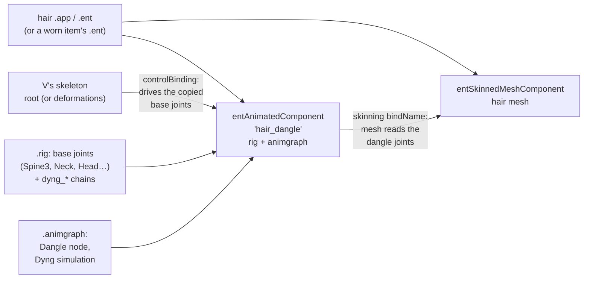

# Hair and jewellery dangle physics

**Maturity: Draft.** This page covers how a hairstyle, an earring or any other part declares "physics" (the swinging joints the modding community calls dangle bones), what the resources hold, what the game is expected to do with them, and what the Studio's preview does today. It was consolidated on 27 September 2026 from the installed 2.31 game, the resolver's cached `.app` and `.ent` documents, WolvenKit 9.0.1 serialisations of the vanilla and modded `.rig` and `.animgraph` files listed under [Sources](#sources), the WolvenKit type definitions, RED4ext.SDK's generated layouts and the Modding Docs. **Nothing on this page has runtime evidence yet**, and the solver's arithmetic has not been read from the executable. Grades follow the [knowledge rules](README.md): **[source]** engine, framework or tool source, type definitions or decompiled scripts; **[resource]** extracted game or mod resources; **[wiki]** Modding Docs at `be2f44ee`; **[offline]** our own measurements; **[runtime]** the running game; **[hypothesis]** not yet established. The implementation plan for the preview is the [hair physics plan](../research/animation/hair-physics-plan.md), which also holds the hashes and exact inputs.

## 1. The chain at a glance

A hairstyle with physics is an ordinary hairstyle plus one animated component per swinging part. That component carries a small rig (a copy of the upper-body joints plus chains of `dyng_*` joints hanging from `Head`) and an animation graph whose single working node simulates those chains. The hair mesh is weighted to the chain joints and names that component as its skeleton [resource]. The Modding Docs describe the same pairing: dangle bones need "corresponding .rig and .animgraph files", and the graph moves the chains, which move the weighted mesh [wiki: `for-mod-creators-theory/3d-modelling/meshes-and-armatures-rigging/dangle-bones/README.md`, eagul].

## 2. How a hairstyle declares physics

### 2.1 Components and bindings

| Part | Animated component (`rig`, `graph`) | `controlBinding` | `parentTransform` | Mesh `skinning` | Grade |
|---|---|---|---|---|---|
| Vanilla V hairstyle 1 (`hh_001_pwa__hairs_033.ent`, mesh `hh_033_wa__player.mesh`) | `hair_dangle`: `hh_033_wa__player_dangle.rig`, `…_dangle.animgraph` | `Component` | `Component` | `hair_dangle` | [resource] |
| Vanilla hairstyle 90 (`hh_004_pwa__hairs_090.ent`) | `hair_dangle` | `Component` | `Component` | `hair_dangle` | [resource] |
| Vanilla short hairstyle (`hh_019_pwa__hairs_044.ent`) and every first-person hair entity cached | none | – | – | `Component` | [resource] |
| CCXL, "vanilla style" (MELUMINARY `lm097_hair.app`, 2 parts; `emma2_hair.app`, 4 parts; anruimurasaki's High Ponytail, 2 parts; the `KYLIN_FEMV_CCXL_FLUFFYWOLFCUT` wolf cut, 3 parts) | one per part | `root` | `root` | the part's dangle component | [resource] |
| CCXL, "deformations style" (Nola Dreamer's Sofie, 5 parts; the `atomiic_hair` double bun, 2 parts; the `atomiic_hair` Bree) | one per part, named `<part>_dangle` | `deformations` | none | the part's dangle component | [resource] |
| Physics earrings, worn items (Kwek's Small Fancy Hoop Earrings; Claire's Jewellery with physics) | `kwek_earrings_02_dangles`; `earrings_dangles` (the vanilla NPC Claire's `h0_001_wa_l__clair_dangle_skeleton.rig` and `i1_006_wa_earring__clair.animgraph`) | `Component` | `Component` | **`Component`, not the dangle component** | [resource] |
| Vanilla creator piercings (`i0_000__earring_01…03, 09, 10, 14.app`, the six cached) | none | – | – | `root` | [resource] |

- `Component` is an `entExternalComponent` whose `externalComponentName` is `root`: the entity borrows the wearer's main animated component, V's body skeleton [resource]. The CCXL `.app` files name `root` directly.
- `deformations` is the animated component that solves V's helper joints ([poses §4](poses.md#4-how-photo-mode-plays-a-pose)). The two CCXL conventions therefore take their input pose from different components: before or after the helper-joint solve [resource for the names; hypothesis for the consequence].
- **Several components can share one name.** MELUMINARY and the wolf cut name every part's component `hair_dangle`, and every part's mesh binds to `hair_dangle` [resource]. In the reference save's `lm097` both parts' rigs and graphs are byte-identical copies of the vanilla long-hair set (below), so which one a mesh finds cannot matter there. How the engine resolves a duplicate name when the rigs differ (`emma2`'s four parts) is [hypothesis].
- **The earrings bind to the body, not to the dangle component.** Both physics earrings skin their mesh to `Component` while their dangle component is controlled by, and parented to, the same `Component` [resource]. Their `dyng_earring_*` joints exist only in the dangle rig. That they swing in game (their titles say so) implies that a dangle component controlled by a skeleton adds its simulated joints to that skeleton's pose, or that skinning finds joints by name across the entity's animated components [hypothesis; in-game check H5 below]. Hair, by contrast, always names the dangle component.
- The Modding Docs' CCXL hair guide gives the inverse recipe: a part with no physics deletes its `hair_dangle` component and binds `parentTransform` and `skinning` to `root` [wiki: `for-mod-creators-theory/core-mods-explained/archivexl/archivexl-character-creator-additions/ccxl-hairs.md`, "My hair mesh is not animated", manavortex].

### 2.2 The dangle rig

| Rig | Joints | Base joints copied from V's rig | Chains (`dyng_*`, parented to `Head`) | Grade |
|---|---:|---|---|---|
| `hh_033_wa__player_dangle.rig` | 50 | `Root`, `Spine3`, `LeftShoulder`, `Neck`, `RightShoulder`, `Neck1`, `Head` | 7 chains `dyng_hair_01…07`, 5 or 7 joints each (43 joints), chain length 0.20 m (three) and 0.43 m (four) | [resource] [offline] |
| `hh_107_wa__girl_longhair_dangle_skeleton.rig` | 47 | the same 7 | `dyng_back_chain_01…05` (6 joints each) and `dyng_left_chain`, `dyng_right_chain` (5 each), 0.22–0.30 m | [resource] [offline] |
| `nd_hair_sofie_pt1.rig` | 55 | the 7 plus `LeftArm`, `RightArm` | 8 side chains `dyng_hair_left/right_01…04` and `dyng_hair_back`, 0.15–0.28 m | [resource] [offline] |
| Kwek `earrings_02.rig` | 6 | `Root`, `Head` | `dyng_earring_left/right_01…02`, 0.08 m each | [resource] [offline] |

- The base joints have V's names, and every chain hangs from `Head` [resource]. The Docs note the consequence: a chain parented to `Head` follows every head turn, which causes clipping for long hair, and a moved chain must be moved in the `.rig` and in the mesh's bone matrices together [wiki: `…/dangle-bones/moving-a-dangle-chain.md`, eagul].
- `levelOfDetailStartIndices` is 7 or 9: the base joints come first [resource].
- **Modded "physics enabled" hair usually transplants vanilla sets.** MELUMINARY's `lm097_hair_pt2` and `lm127_hair_pt1` and Nola Dreamer's `nd_hair_sofie_pt5` ship `.rig` and `.animgraph` files byte-identical to the vanilla `hh_107_wa__girl_longhair` pair (SHA-256 `8d3dd083…` and `66b788c4…`) [resource]. This is the workflow the Docs teach: transfer a donor's skeleton and weights [wiki: eagul; `modding-guides/items-equipment/transferring-dangle-bones.md`, PinkyJulien]. Sofie's other parts carry their own tuning.

### 2.3 The animation graph

Every inspected dangle graph has the same five-node spine [resource]:

`ReferencePoseTerminator` → `SharedMetaPose` → `PoseLsToMs` → **`Dangle`** → `PoseMsToLs` → `Output`

The input pose is shared with the controlling component (the node name and the binding suggest that the base joints arrive already posed [hypothesis]); the dangle node works in model space; the result goes back to local space. The `Dangle` node holds one `dangleConstraint`:

| Where | Field | Values seen | Meaning | Grade |
|---|---|---|---|---|
| Simulation | class | `animDangleConstraint_SimulationDyng` in 84 of the 85 vanilla hair graphs (the 85th has no dangle node) and in every modded graph inspected | a particle solver ("Dyng"); of the other classes, `…Pendulum` occurs in 6 vehicle graphs and `…Spring` in one wrist item, and `…SingleBone` and `…PositionProjection` in none | [resource] census of 525 vanilla graphs |
| Simulation | `substepTime`, `solverIterations` | 0.01 s, 1 (all) | a fixed 100 Hz substep, one constraint pass per substep | [resource]; meaning [hypothesis] |
| Simulation | `alpha` | 1 | blend of the simulated result over the input pose | [hypothesis] |
| Simulation | `rotateParentToLookAtDangle` | 1 (all) | each joint is turned to aim at its simulated child (the link's `lookAtAxis`, X), so joints rotate and keep their lengths | [hypothesis] |
| Simulation | `dangleAltersTransformsOfItsChildren`, `parentRotationAlters…` (two flags), `HACK_checkDangleTeleport` | 0 (all) | – | [resource] |
| Simulation | `collisionRoundedShapes` | 0 to 9 per graph (41 of 85 vanilla hair graphs have some): `bone`, `transformLS`, `x/y/zBoxExtent`, `roundedCornerRadius`. On hair only `zBoxExtent` is non-zero, which makes each a capsule along its local Z | collision volumes on V's upper body: shoulders, `Neck`, `Neck1`, `Spine3`, `Head`, and in some graphs the upper arms. `hh_033` has four (both shoulders, radius 0.06 m; `Neck`, 0.06; `Spine3`, 0.12) and **none on the head** | [resource]; capsule reading [hypothesis] |
| Particles | `gravityWS` | 9.81 (all) | gravity along world down | [resource] |
| Particles | `externalForceWS`; `externalForceWsLink` | (0, 0, 0); linked only in `hh_033`, to a `VectorInput` `DangleExternalInput.fictitiousAccelerationWs` fed by `AnimFeature_DangleExternalInput` | an extra acceleration; no decompiled 2.31 script writes this feature, so any writer is native | [resource] [source] SDK `AnimFeature_DangleExternalInput.hpp`, scripts grep |
| Particle (one per chain joint) | `isFree` | 0 on each chain's first joint, 1 elsewhere | a fixed particle follows the input pose; free ones are simulated | [resource]; meaning [hypothesis] |
| Particle | `mass` | 0.1–1 (hair), 0.3–1 (earrings) | weight in constraint corrections | [hypothesis] |
| Particle | `damping` | 1 (`hh_033`), 1.2–2.5 (`hh_210`), 3 (`hh_107`), 4 (Sofie pt1), 0.1 (Claire earring) | velocity loss per second | [hypothesis] |
| Particle | `pullForceFactor` | 0 (`hh_033`, most of `hh_210`), 20–30 (`hh_107`), 25 (Sofie pt1), 3 or 0 (Kwek), 30 (Claire earring) | a spring back toward the animated position | [hypothesis] |
| Particle | `collisionCapsuleRadius`, `…HeightExtent`, `…AxisLS` | 0 (a point) on `hh_033`; 0.01–0.04 m on long hair | the particle's own collision size | [resource]; meaning [hypothesis] |
| Particle | `projectionType` | `ShortestPath` (all) | how a violating position is corrected | [resource] |
| Constraints | `animDyngConstraintMulti` holding `Link`, `Cone` and (7 hair graphs) `Ellipsoid` | – | – | [resource] |
| Link | `linkType`, bounds | `KeepFixedDistance`, 100 % / 100 % (all hair) | rigid rest length between consecutive joints; enum also has `KeepVariableDistance`, `Greater`, `Closer` | [resource] [source] WolvenKit enums |
| Cone | `constraintType`, `halfOfMaxApertureAngle`, `coneAttachmentBone`, `coneTransformLS`, `constrainedBone` | `HalfCone` or `Cone`, `ShortestPathRotational`; 10° near the root widening to 40–60° toward the tip on `hh_033`, 45° throughout on `hh_107`; `coneTransformLS` a 90° turn about X | limits the angle of each segment relative to its parent segment; what distinguishes `HalfCone` from `Cone` is [hypothesis] | [resource] |
| Ellipsoid | `bone`, `ellipsoidTransformLS`, `constraintRadius`, `constraintScale1/2` | – | keeps particles outside (or inside) an ellipsoid on a bone | [source] WolvenKit class; meaning [hypothesis] |

Class defaults, for fields a file leaves out: particle `mass` 1, `damping` 1, `isFree` true, capsule axis (0.5, 0, 0), projection `ShortestPath` [source: WolvenKit `animDyngParticle.cs`].

Tuning differs a lot between hairstyles (`hh_033` hangs free with no pull and no head collider; `hh_107` is stiff and springs back), so a preview must take every value from the resource, never a per-style or per-mod constant.

### 2.4 How the mesh skins to the joints

WolvenKit's mesh export lists every joint flat under the armature, with no parent links [offline: the preview cache's GLBs]. The `hh_033` mesh uses `Head`, `Neck1` and all 43 chain joints; 10,980 of its 13,068 vertices carry more than 1 % chain weight. Sofie pt1 uses 106 joints, mostly `Head` and face joints, and only 2,546 of 25,424 vertices move with its chains [offline]. The chain structure (parents, rest lengths) therefore has to come from the `.rig`, not from the mesh export.

## 3. What drives the chains in game

| Claim | Grade |
|---|---|
| The dangle component is evaluated as its own animated component with its own graph | [resource] (component and graph per part) |
| Its base joints take the pose of the component its `controlBinding` names (`root` or `deformations`), so the fixed first particle of each chain follows V's head | [hypothesis]: the binding's name, the copied joint names and the `SharedMetaPose` input support it |
| Head and body motion from the playing animation (creator idle, gameplay, a photo-mode pose) reaches the chains only through those base joints | [hypothesis] |
| World motion of the character (walking, turning, vehicles) also drives the chains, because gravity is in world space and particle state persists between frames | [hypothesis] |
| `fictitiousAccelerationWs` is an extra acceleration input wired only in V's default hairstyle `hh_033` (1 of 85 vanilla hair graphs); no script sets it | [resource] [source]; its native writer is unknown |
| Collision is only against the graph's own rounded shapes on V's joints (and the particles' own capsules): no hair-to-hair, no head-mesh and no clothing collision | [resource] (no other collision data in the graphs) |
| Every parameter the solver uses is in the graph; missing fields take the class defaults above | [resource] [source]; the formulas are [hypothesis] until read from the executable |
| Photo mode, which pauses the world, freezes or keeps simulating the dangles | unknown; in-game check H2 |

## 4. What the Studio does today

- **The resolver drops animated components.** Only mesh components reach the render record, so the dangle rig and graph are never read, and the render coverage audit lists hair physics as absent (rank 7) [source: the Studio].
- **The chain joints follow the idle rigidly, joint by joint.** `IdleAnimation` binds each mesh joint the idle clip doesn't drive to its skeleton parent, and a flat-exported joint with none to the rig segment nearest it within 0.25 m (`nearestDriver`, meant for the body's helper joints). With flat exports, every chain joint takes that last route. Measured against `woman_base.rig`, `hh_033`'s 43 chain joints split between `Head` (26), `Neck1` (9), `RightShoulder` (7) and `Neck` (1); the long-hair set's 40 between `Head` (9), `Neck1` (13), `Spine3` (6), the shoulders (9) and `Neck` (3) [offline]. One strand's root therefore follows the head while its tip follows the shoulder or spine, and a head turn shears it. Under the creator idle's small motion this is hard to see; under a posed head turn it would stretch the hair. In game the whole chain hangs from `Head`, so a still solution would at least keep each chain rigid on the head.
- **With the idle off,** the hair shows its bind pose, which is the authored shape [offline].
- **No gravity, inertia or collision** is applied anywhere [source].

The [plan](../research/animation/hair-physics-plan.md) fixes the binding first (every chain follows its own rig parent), then adds a data-driven solver of these graphs, off by default until the in-game checks below pass.

## Open questions

1. The Dyng solver's arithmetic in 2.31: the integration scheme, how `damping`, `pullForceFactor` and `mass` enter, the difference between `HalfCone` and `Cone` and the cone axis inside `coneTransformLS`, the rounded-shape and particle-capsule collision, `alpha` and the look-at step. Read from the executable, as the [hair profile bake](hair-shading.md#3-base-colour) was.
2. Does the controlling component's pose feed the base joints as §3 supposes, and what happens when the named component (`deformations`) is absent?
3. How does the engine resolve several animated components with one name whose rigs differ?
4. How do worn earrings whose mesh skins to `root` pick up their dangle joints (§2.1)?
5. Who writes `fictitiousAccelerationWs`, and when?
6. Does photo mode freeze the dangles, keep them simulating, or settle them once?
7. Does the creator puppet have a `deformations` component, so that "deformations style" CCXL hair swings in the creator?

## In-game test asks

Batch with the next session. Record the game and ArchiveXL versions and the hair and earring mods in use; video at 60 fps where motion matters.

1. **H1 Creator sway.** Default V, hairstyle 1 (`hh_033`), creator hair section, 10 s of the idle from the side and from behind: does the hair visibly move, and how far do the tips travel?
2. **H2 Photo mode.** The same V in photo mode with a vanilla idle pose, then after rotating the head with the photo-mode head controls: do the strands stay rigid on the head, fall with gravity, or stay frozen at their previous shape?
3. **H3 Shoulder collision.** Photo mode, head turned fully left and right: do long strands (the reference save's `lm097`) rest on the shoulders or pass through them?
4. **H4 Duplicate names.** The reference save's `lm097` (two parts, both components named `hair_dangle`): do both parts swing, and together?
5. **H5 Worn earrings.** Kwek's hoop earrings or Claire's earrings, worn: do they swing although their mesh binds to the body skeleton?
6. **H6 Inertia.** Gameplay, third person: walk, stop sharply and turn in place: does hair swing past and settle (world-space inertia)?

## Sources

- Installed game 2.31: `basegame_4_appearance.archive` (the dangle rigs), the vanilla `.animgraph` set extracted for the [expressions study](../research/animation/expressions-evidence.md) (525 graphs, 85 under `base\characters\common\hair`), serialised one file at a time with WolvenKit CLI 9.0.1. Hashes are in the [plan's evidence section](../research/animation/hair-physics-plan.md#10-evidence-and-sources).
- Installed mods on the reference MO2 profile: Nola Dreamer's hair Sofie (Nexus 21844, 1.0.0.0), MELUMINARY Long Length Pak Vol. 3, anruimurasaki's High Ponytail, the Fluffy Wolfcut, Bree and double-bun CCXL packs (their `.app` files from the resolver cache), Kwek's Small Fancy Hoop Earrings with Physics (Nexus 7020, 1.1.0.0) and Claire's Jewellery with physics (Nexus 12863, 0.2.0.0).
- WolvenKit at `7876aae07`: `WolvenKit.RED4/Types/Classes/animDyng*.cs`, `animDangleConstraint_SimulationDyng.cs` and the enums in `Enums/cp77enums.cs` (field names, class defaults, `animDyngConstraintLinkType`, `animDyngParticleProjectionType`).
- RED4ext.SDK at `ad727771`: `Generated/anim/DangleConstraint_Simulation*.hpp`, `AnimFeature_DangleExternalInput.hpp`.
- 2.31 scripts decompiled with redscript-cli 0.5.31: no reference to `DangleExternalInput` or `fictitiousAcceleration`.
- [wiki] at `be2f44ee`: `for-mod-creators-theory/3d-modelling/meshes-and-armatures-rigging/dangle-bones/README.md` and `moving-a-dangle-chain.md` (eagul; the latter last updated by Shota Meipariani), `modding-guides/items-equipment/transferring-dangle-bones.md` (PinkyJulien), `for-mod-creators-theory/core-mods-explained/archivexl/archivexl-character-creator-additions/ccxl-hairs.md`, `for-mod-creators-theory/files-and-what-they-do/components/documented-components/README.md` (animated components add physics to hair and garments), `for-mod-creators-theory/references-lists-and-overviews/cheat-sheet-head/hair.md` (creator hairstyle 1 is `hh_033_wa__player`).

## Related pages

[Hair shading](hair-shading.md) · [Body rendering](body-rendering.md) · [Poses](poses.md) · [Piercings and jewellery](jewellery-resources.md) · [CC file chain](cc-file-chain.md) · [Hair physics plan](../research/animation/hair-physics-plan.md)
