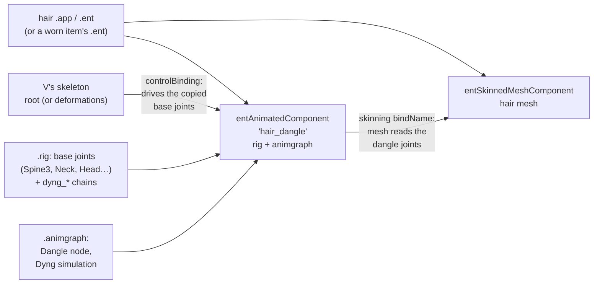

# Hair and jewellery dangle physics

**Maturity: Draft.** This page covers how a hairstyle, an earring or any other part declares "physics" (the swinging joints the modding community calls dangle bones), what the resources hold, what the game does with them, and what the Studio's preview does today. It was consolidated on 27 September 2026 from the installed 2.31 game, the resolver's cached `.app` and `.ent` documents, WolvenKit 9.0.1 serialisations of the vanilla and modded `.rig` and `.animgraph` files listed under [Sources](#sources), the WolvenKit type definitions, RED4ext.SDK's generated layouts, the Modding Docs, and the solver's code in the 2.31 executable ([§5](#5-solver-arithmetic-231-executable)). **Nothing on this page has runtime evidence yet.** Grades follow the [knowledge rules](README.md): **[source]** engine, framework or tool source, type definitions or decompiled scripts; **[exe]** read in the disassembled 2.31 `Cyberpunk2077.exe` (this page's extra grade: the instructions were read, the game was not run); **[resource]** extracted game or mod resources; **[wiki]** Modding Docs at `be2f44ee`; **[offline]** our own measurements; **[runtime]** the running game; **[hypothesis]** not yet established. The implementation plan for the preview is the [hair physics plan](../research/animation/hair-physics-plan.md), which also holds the hashes and exact inputs.

## 1. The chain at a glance



A hairstyle with physics is an ordinary hairstyle plus one animated component per swinging part. That component carries a small rig (a copy of the upper-body joints plus chains of `dyng_*` joints hanging from `Head`) and an animation graph whose single working node simulates those chains. The hair mesh is weighted to the chain joints and names that component as its skeleton [resource]. The Modding Docs describe the same pairing: dangle bones need "corresponding .rig and .animgraph files", and the graph moves the chains, which move the weighted mesh [wiki: `for-mod-creators-theory/3d-modelling/meshes-and-armatures-rigging/dangle-bones/README.md`, eagul].

## 2. How a hairstyle declares physics

### 2.1 Components and bindings

| Part | Animated component (`rig`, `graph`) | `controlBinding` | `parentTransform` | Mesh `skinning` | Grade |
|---|---|---|---|---|---|
| Vanilla V hairstyle 1 (`hh_001_pwa__hairs_033.ent`, mesh `hh_033_wa__player.mesh`) | `hair_dangle`: `hh_033_wa__player_dangle.rig`, `…_dangle.animgraph` | `Component` | `Component` | `hair_dangle` | [resource] |
| Vanilla hairstyle 90 (`hh_004_pwa__hairs_090.ent`) | `hair_dangle` | `Component` | `Component` | `hair_dangle` | [resource] |
| Vanilla short hairstyle (`hh_019_pwa__hairs_044.ent`) and every first-person hair entity cached | none | – | – | `Component` | [resource] |
| CCXL, "vanilla style" (MELUMINARY `lm097_hair.app`, 2 parts; `emma2_hair.app`, 4 parts; anruimurasaki's High Ponytail, 2 parts; the `KYLIN_FEMV_CCXL_FLUFFYWOLFCUT` wolf cut, 3 parts) | one per part | `root` | `root` | the part's dangle component | [resource] |
| CCXL, "deformations style" (Nola Dreamer's Sofie, 5 parts; the `atomiic_hair` double bun, 2 parts; the `atomiic_hair` Bree) | one per part, named `<part>_dangle` | `deformations` | none | the part's dangle component | [resource] |
| Physics earrings, worn items (Kwek's Small Fancy Hoop Earrings; Claire's Jewellery with physics) | `kwek_earrings_02_dangles`; `earrings_dangles` (the vanilla NPC Claire's `h0_001_wa_l__clair_dangle_skeleton.rig` and `i1_006_wa_earring__clair.animgraph`) | `Component` | `Component` | **`Component`, not the dangle component** | [resource] |
| Vanilla creator piercings (`i0_000__earring_01…03, 09, 10, 14.app`, the six cached) | none | – | – | `root` | [resource] |

- `Component` is an `entExternalComponent` whose `externalComponentName` is `root`: the entity borrows the wearer's main animated component, V's body skeleton [resource]. The CCXL `.app` files name `root` directly.
- `deformations` is the animated component that solves V's helper joints ([poses §4](poses.md#4-how-photo-mode-plays-a-pose)). The two CCXL conventions therefore take their input pose from different components: before or after the helper-joint solve [resource for the names; hypothesis for the consequence].
- **Several components can share one name.** MELUMINARY and the wolf cut name every part's component `hair_dangle`, and every part's mesh binds to `hair_dangle` [resource]. In the reference save's `lm097` both parts' rigs and graphs are byte-identical copies of the vanilla long-hair set (below), so which one a mesh finds cannot matter there. How the engine resolves a duplicate name when the rigs differ (`emma2`'s four parts) is [hypothesis].
- **The earrings bind to the body, not to the dangle component.** Both physics earrings skin their mesh to `Component` while their dangle component is controlled by, and parented to, the same `Component` [resource]. Their `dyng_earring_*` joints exist only in the dangle rig. That they swing in game (their titles say so) implies that a dangle component controlled by a skeleton adds its simulated joints to that skeleton's pose, or that skinning finds joints by name across the entity's animated components [hypothesis; in-game check H5 below]. Hair, by contrast, always names the dangle component.
- The Modding Docs' CCXL hair guide gives the inverse recipe: a part with no physics deletes its `hair_dangle` component and binds `parentTransform` and `skinning` to `root` [wiki: `for-mod-creators-theory/core-mods-explained/archivexl/archivexl-character-creator-additions/ccxl-hairs.md`, "My hair mesh is not animated", manavortex].

### 2.2 The dangle rig

| Rig | Joints | Base joints copied from V's rig | Chains (`dyng_*`, parented to `Head`) | Grade |
|---|---:|---|---|---|
| `hh_033_wa__player_dangle.rig` | 50 | `Root`, `Spine3`, `LeftShoulder`, `Neck`, `RightShoulder`, `Neck1`, `Head` | 7 chains `dyng_hair_01…07`, 5 or 7 joints each (43 joints), chain length 0.20 m (three) and 0.43 m (four) | [resource] [offline] |
| `hh_107_wa__girl_longhair_dangle_skeleton.rig` | 47 | the same 7 | `dyng_back_chain_01…05` (6 joints each) and `dyng_left_chain`, `dyng_right_chain` (5 each), 0.22–0.30 m | [resource] [offline] |
| `nd_hair_sofie_pt1.rig` | 55 | the 7 plus `LeftArm`, `RightArm` | 8 side chains `dyng_hair_left/right_01…04` and `dyng_hair_back`, 0.15–0.28 m | [resource] [offline] |
| Kwek `earrings_02.rig` | 6 | `Root`, `Head` | `dyng_earring_left/right_01…02`, 0.08 m each | [resource] [offline] |

- The base joints have V's names, and every chain hangs from `Head` [resource]. The Docs note the consequence: a chain parented to `Head` follows every head turn, which causes clipping for long hair, and a moved chain must be moved in the `.rig` and in the mesh's bone matrices together [wiki: `…/dangle-bones/moving-a-dangle-chain.md`, eagul].
- `levelOfDetailStartIndices` is 7 or 9: the base joints come first [resource].
- **Modded "physics enabled" hair usually transplants vanilla sets.** MELUMINARY's `lm097_hair_pt2` and `lm127_hair_pt1` and Nola Dreamer's `nd_hair_sofie_pt5` ship `.rig` and `.animgraph` files byte-identical to the vanilla `hh_107_wa__girl_longhair` pair (SHA-256 `8d3dd083…` and `66b788c4…`) [resource]. This is the workflow the Docs teach: transfer a donor's skeleton and weights [wiki: eagul; `modding-guides/items-equipment/transferring-dangle-bones.md`, PinkyJulien]. Sofie's other parts carry their own tuning.

### 2.3 The animation graph

Every inspected dangle graph has the same five-node spine [resource]:

`ReferencePoseTerminator` → `SharedMetaPose` → `PoseLsToMs` → **`Dangle`** → `PoseMsToLs` → `Output`

The input pose is shared with the controlling component (the node name and the binding suggest that the base joints arrive already posed [hypothesis]); the dangle node works in model space; the result goes back to local space. The `Dangle` node holds one `dangleConstraint`:

| Where | Field | Values seen | Meaning | Grade |
|---|---|---|---|---|
| Simulation | class | `animDangleConstraint_SimulationDyng` in 84 of the 85 vanilla hair graphs (the 85th has no dangle node) and in every modded graph inspected | a particle solver ("Dyng"); of the other classes, `…Pendulum` occurs in 6 vehicle graphs and `…Spring` in one wrist item, and `…SingleBone` and `…PositionProjection` in none | [resource] census of 525 vanilla graphs |
| Simulation | `substepTime`, `solverIterations` | 0.01 s, 1 (all) | the substep length and the constraint passes per substep; the number of substeps per frame is filtered and capped at 3 ([§5.1](#51-frames-and-substeps)) | [resource]; meaning [exe] |
| Simulation | `alpha` | 1 | per-joint blend of the output over the input pose (1 writes the simulated transform, 0 keeps the input) | [exe] |
| Simulation | `rotateParentToLookAtDangle` | 1 (all) | each link's first joint is turned so that its `lookAtAxis` (X) points at the second joint's simulated position; every joint is also moved to its own simulated position ([§5.5](#55-output-to-the-pose)) | [exe] |
| Simulation | `dangleAltersTransformsOfItsChildren`, `parentRotationAlters…` (two flags), `HACK_checkDangleTeleport` | 0 (all) | – | [resource] |
| Simulation | `collisionRoundedShapes` | 0 to 9 per graph (41 of 85 vanilla hair graphs have some): `bone`, `transformLS`, `x/y/zBoxExtent`, `roundedCornerRadius`. On hair only `zBoxExtent` is non-zero, which makes each a capsule along its local Z | collision volumes on V's upper body: shoulders, `Neck`, `Neck1`, `Spine3`, `Head`, and in some graphs the upper arms. `hh_033` has four (both shoulders, radius 0.06 m; `Neck`, 0.06; `Spine3`, 0.12) and **none on the head**. The extents are half-extents, so a hair shape is a capsule of half-length `zBoxExtent` along its local Z | [resource]; shape [exe] |
| Particles | `gravityWS` | 9.81 (all) | gravity (0, 0, −`gravityWS`) in world space, turned into the component's model space each frame, not divided by mass | [resource] [exe] |
| Particles | `externalForceWS`; `externalForceWsLink` | (0, 0, 0); linked only in `hh_033`, to a `VectorInput` `DangleExternalInput.fictitiousAccelerationWs` fed by `AnimFeature_DangleExternalInput` | a world-space force (divided by each particle's `mass`); a linked input replaces `externalForceWS` rather than adding to it. No decompiled 2.31 script writes this feature, so any writer is native | [resource] [exe] [source] SDK `AnimFeature_DangleExternalInput.hpp`, scripts grep |
| Particle (one per chain joint) | `isFree` | 0 on each chain's first joint, 1 elsewhere | a fixed particle is placed on the input pose every substep and counts as infinitely heavy in links; free ones are integrated | [resource]; meaning [exe] |
| Particle | `mass` | 0.1–1 (hair), 0.3–1 (earrings) | divides every force (damping, pull, external; not gravity) and weights link corrections | [exe] |
| Particle | `damping` | 1 (`hh_033`), 1.2–2.5 (`hh_210`), 3 (`hh_107`), 4 (Sofie pt1), 0.1 (Claire earring) | linear drag: acceleration −(`damping`/`mass`)·velocity, capped at 50 m/s² | [exe] |
| Particle | `pullForceFactor` | 0 (`hh_033`, most of `hh_210`), 20–30 (`hh_107`), 25 (Sofie pt1), 3 or 0 (Kwek), 30 (Claire earring) | a spring toward the particle's own animated position: acceleration (`pullForceFactor`/`mass`)·(animated − current) | [exe] |
| Particle | `collisionCapsuleRadius`, `…HeightExtent`, `…AxisLS` | 0 (a point) on `hh_033`; 0.01–0.04 m on long hair | with `ShortestPath`, the radius is added to every rounded shape's radius (the height and axis are unused); with `Directed` the particle is a capsule | [resource]; meaning [exe] |
| Particle | `projectionType` | `ShortestPath` (all) | `Disabled` skips shape collision for the particle; `ShortestPath` pushes it to the nearest surface point | [resource] [exe] |
| Constraints | `animDyngConstraintMulti` holding `Link`, `Cone` and (7 hair graphs) `Ellipsoid` | – | – | [resource] |
| Link | `linkType`, bounds | `KeepFixedDistance`, 100 % / 100 % (all hair) | target length = lower bound % × rest length; the other types clamp to [lower, upper] (`KeepVariableDistance`), at least lower (`Greater`) or at most upper (`Closer`) | [resource] [source] WolvenKit enums; arithmetic [exe] |
| Cone | `constraintType`, `halfOfMaxApertureAngle`, `coneAttachmentBone`, `coneTransformLS`, `constrainedBone` | `HalfCone` or `Cone`, `ShortestPathRotational`; 10° near the root widening to 40–60° toward the tip on `hh_033`, 45° throughout on `hh_107`; `coneTransformLS` a 90° turn about X | limits the direction from the attachment joint's **animated** frame (`coneTransformLS` applied to it) to the constrained particle to a cone of `halfOfMaxApertureAngle` degrees around that frame's X; `HalfCone` also forbids the frame's +Z side, `HingePlane` keeps the particle in the X–Y plane ([§5.3](#53-constraints-in-order)) | [resource]; meaning [exe] |
| Ellipsoid | `bone`, `ellipsoidTransformLS`, `constraintRadius`, `constraintScale1/2` | – | keeps a particle inside an ellipsoid centred on its own animated frame: radius `constraintRadius` in X and Y, times `constraintScale1` toward −Z and `constraintScale2` toward +Z | [source] WolvenKit class; meaning [exe] |

Class defaults, for fields a file leaves out: particle `mass` 1, `damping` 1, `isFree` true, capsule axis (0.5, 0, 0), projection `ShortestPath` [source: WolvenKit `animDyngParticle.cs`].

Tuning differs a lot between hairstyles (`hh_033` hangs free with no pull and no head collider; `hh_107` is stiff and springs back), so a preview must take every value from the resource, never a per-style or per-mod constant.

### 2.4 How the mesh skins to the joints

WolvenKit's mesh export lists every joint flat under the armature, with no parent links [offline: the preview cache's GLBs]. The `hh_033` mesh uses `Head`, `Neck1` and all 43 chain joints; 10,980 of its 13,068 vertices carry more than 1 % chain weight. Sofie pt1 uses 106 joints, mostly `Head` and face joints, and only 2,546 of 25,424 vertices move with its chains [offline]. The chain structure (parents, rest lengths) therefore has to come from the `.rig`, not from the mesh export.

## 3. What drives the chains in game

| Claim | Grade |
|---|---|
| The dangle component is evaluated as its own animated component with its own graph | [resource] (component and graph per part) |
| Its base joints take the pose of the component its `controlBinding` names (`root` or `deformations`), so the fixed first particle of each chain follows V's head | [hypothesis]: the binding's name, the copied joint names and the `SharedMetaPose` input support it |
| Head and body motion from the playing animation (creator idle, gameplay, a photo-mode pose) reaches the chains only through those base joints | [hypothesis] |
| Particle state persists between frames in the dangle component's model space. Gravity and the external force are turned from world space by the character's world rotation every frame, so a tilted character sees gravity tilt. World motion (walking, turning, vehicles) moves the particles relative to V only in the per-frame mode 1, which carries the particle state through the change of the character's world transform; in mode 0 the hair travels rigidly with V ([§5.1](#51-frames-and-substeps)) | [exe]; which mode gameplay, the creator and photo mode use is [hypothesis] |
| `fictitiousAccelerationWs` is an extra acceleration input wired only in V's default hairstyle `hh_033` (1 of 85 vanilla hair graphs); no script sets it | [resource] [source]; its native writer is unknown |
| Collision is only against the graph's own rounded shapes on V's joints (and the particles' own capsules): no hair-to-hair, no head-mesh and no clothing collision | [resource] (no other collision data in the graphs) |
| Every per-hairstyle parameter the solver uses is in the graph (missing fields take the class defaults above). The only other inputs are five engine settings, the frame's two time steps and a per-frame mode ([§5](#5-solver-arithmetic-231-executable)) | [resource] [source] [exe] |
| Photo mode, which pauses the world, freezes or keeps simulating the dangles. The solver runs no substep while the frame's time-dilation ratio is 0.05 or less, and then leaves every particle, fixed roots included, where it was ([§5.1](#51-frames-and-substeps)) | the rule [exe]; whether photo mode's pause reaches the dangle component that way is unknown; in-game check H2 |

## 4. What the Studio does today

- **The resolver drops animated components.** Only mesh components reach the render record, so the dangle rig and graph are never read, and the render coverage audit lists hair physics as absent (rank 7) [source: the Studio].
- **The chain joints follow the idle rigidly, joint by joint.** `IdleAnimation` binds each mesh joint the idle clip doesn't drive to its skeleton parent, and a flat-exported joint with none to the rig segment nearest it within 0.25 m (`nearestDriver`, meant for the body's helper joints). With flat exports, every chain joint takes that last route. Measured against `woman_base.rig`, `hh_033`'s 43 chain joints split between `Head` (26), `Neck1` (9), `RightShoulder` (7) and `Neck` (1); the long-hair set's 40 between `Head` (9), `Neck1` (13), `Spine3` (6), the shoulders (9) and `Neck` (3) [offline]. One strand's root therefore follows the head while its tip follows the shoulder or spine, and a head turn shears it. Under the creator idle's small motion this is hard to see; under a posed head turn it would stretch the hair. In game the whole chain hangs from `Head`, so a still solution would at least keep each chain rigid on the head.
- **With the idle off,** the hair shows its bind pose, which is the authored shape [offline].
- **No gravity, inertia or collision** is applied anywhere [source].

The [plan](../research/animation/hair-physics-plan.md) fixes the binding first (every chain follows its own rig parent), then adds a data-driven solver of these graphs, off by default until the in-game checks below pass.

## 5. Solver arithmetic (2.31 executable)

Read on 27 September 2026 from the 2.31 `Cyberpunk2077.exe` with Capstone, through the `dangle` mode of [`exe_hair.py`](../research/materials/shader-system/exe_hair.py), which finds the classes from their RTTI names. Addresses and method are in the [plan's evidence section](../research/animation/hair-physics-plan.md#10-evidence-and-sources). Everything below is **[exe]** unless graded otherwise. It says what the instructions compute, not that the game has been seen to move this way.

The solver works in the dangle component's **model space**, the pose after `PoseLsToMs`, with Z up. Each particle keeps a position `x`, a velocity `v`, the position `xPrev` before the current substep, and its bone's model-space input transform for the previous and current frame (`animPrev`, `animCur`). Each substep interpolates those into `anim`. Transform interpolation lerps translation and scale and normalises a lerp of the rotations, with the second rotation's sign flipped when the dot product is negative. Frames compose parent-first: `bone ∘ transformLS`.

### 5.1 Frames and substeps

Five engine settings (group `Dangle`, all floats) apply to every dangle. No override was found in the installed `engine/config` or `r6/config` [resource].

| Setting | Default | Use |
|---|---:|---|
| `MaxPhysicsStepsCount` | 3 | most substeps in one frame |
| `PhysicsStepsCountLowPassFilterRc` | 1 s | time constant of the substep-count filter |
| `MinTimeDilatation` | 0.05 | at or below this ratio, no substep runs |
| `MaxTimeDilatation` | 1 | cap on the ratio that scales the substep |
| `SolverIterationsWhenSkippingPhysics` | 1 | least constraint passes on a reset frame |

```ts
// Update, once per frame. The update context supplies two time steps and a mode.
// realDt drives the step count and gameDt / realDt the substep length, as the
// "TimeDilatation" names suggest ([hypothesis] for which context field is which).
lastDt = realDt;
accumulator += realDt;
dilation = realDt > 1e-6 ? gameDt / realDt : 0;

// Evaluate
if (mode === 1 && entityWorld !== storedEntityWorld)   // translation exact, rotation within 1e-5
  carry(delta(storedEntityWorld, entityWorld));        // re-express x, v, animCur, forces, shapes
if (mode === 2 || needsReset) { reset(true); resetFrame = true; needsReset = false; }
const n = Math.trunc(accumulator / substepTime);
accumulator -= n * substepTime;
smoothed += (lastDt / (lastDt + PhysicsStepsCountLowPassFilterRc)) * (n - smoothed);
const steps = Math.min(Math.max(Math.floor(smoothed + 0.5), 1), MaxPhysicsStepsCount);
const h = Math.min(dilation, MaxTimeDilatation) * substepTime;       // the substep's dt
if (dilation > MinTimeDilatation) {
  beginFrame();   // animPrev = animCur; animCur = input pose of each particle's bone; forces and shapes likewise
  const iterations = resetFrame ? Math.max(solverIterations, SolverIterationsWhenSkippingPhysics) : solverIterations;
  for (let i = 0; i < steps; i++) {
    const f = (i + 1) / steps;
    kinematic(f);                    // anim = interp(animPrev, animCur, f); gravity and external force lerped
    if (!resetFrame) integrate(h);
    for (let k = 0; k < iterations; k++) {
      dyngConstraint.project();      // the Multi's innerConstraints, in file order
      if (collisionRoundedShapes.length) { collideShapes(f); dyngConstraint.collide(); }
    }
    if (!resetFrame) updateVelocities(h);
  }
}
if (resetFrame) reset(false);        // v = 0, animPrev = animCur = pose; positions kept
output();                            // §5.5, even when no substep ran
storedEntityWorld = entityWorld;
```

- `reset(true)` puts every particle on its bone's input position with zero velocity. The graph's first evaluation does this (`needsReset`), and so does mode 2 [exe]; the quest workspot command's `dangleResetSimulation` flag is a likely source of mode 2 [source: RED4ext.SDK `questUseWorkspotParamsV1`; the link is a hypothesis]. On a reset frame the constraints still run, but there is no integration or velocity update.
- **Mode 1** is what gives world-space inertia. The particle state is carried through the change of the character's world transform, so a walking or turning V leaves the free particles behind in the world. Mode 0 keeps everything in model space. Which mode each situation uses (gameplay, creator, photo mode) is unread [hypothesis].
- **The substep length is fixed; the substep count is filtered.** Every substep advances `substepTime × min(dilation, 1)` whatever the frame time. The count is the rounded, low-pass-filtered number of whole substeps that have accrued, at least 1 and at most 3. The simulation therefore runs faster or slower than real time depending on frame rate [offline, from the rule above]:

| Frame rate | Steady substeps per frame | Simulated ÷ real time |
|---:|---:|---:|
| 30 fps | 3 | 0.9 |
| 60 fps | 2 (after about 2.3 s at 1, if the filter starts at 0) | 1.2 |
| 100 fps | 1 | 1.0 |
| 144 fps | 1 | 1.44 |

### 5.2 Forces and integration

```ts
// gravity and external force, per frame, world -> model space by the character's world rotation qW:
gravity  = rotate(conj(qW), [0, 0, -gravityWS]);
external = rotate(conj(qW), externalForceWsLink ? linkedValue : externalForceWS);   // the link replaces, not adds

accel(p) = (p.pullForceFactor / p.mass) * (p.anim.t - p.x)          // spring to its own animated position
         + external / p.mass
         + clampLength(-(p.damping / p.mass) * p.v, 50)             // drag, at most 50 m/s²
         + gravity;                                                 // not divided by mass

integrate(h): for each particle (file order) {
  p.xPrev = p.x;
  if (!p.isFree) { p.x = p.anim.t; continue; }                      // fixed: placed on the pose
  p.v += 0.5 * h * accel(p);
  p.x += h * p.v;
}
updateVelocities(h): if (h === 0) return; for each free particle {
  p.v = (p.x - p.xPrev) / h + 0.5 * h * accel(p);                   // accel with the corrected x and the half-step v
}
```

This is velocity Verlet (a half kick, a drift, a half kick), except that the second kick starts from the velocity the corrected position implies. Constraint and collision corrections therefore feed back into velocity, as in position-based dynamics. `mass` scales only the drag, the spring and the external force: in free fall with no drag, every particle falls alike. For `hh_107` (`mass` 0.6, `pullForceFactor` 30, `damping` 3) the spring is 50 s⁻² (about 1.1 Hz) with a drag of 5 s⁻¹, a damping ratio of about 0.35. For `hh_033` (`mass` 0.4, `damping` 1, no pull) it is a free pendulum with a drag of 2.5 s⁻¹ [offline arithmetic].

### 5.3 Constraints in order

`solverIterations` passes run per substep. Each pass projects the Multi's `innerConstraints` in file order, Gauss–Seidel style: each correction is written at once and seen by the next constraint. The order differs between graphs: `hh_033` interleaves link and cone root to tip; `hh_107` lists each chain's links from the tip [resource].

```ts
// Link (bone1 -> p1, bone2 -> p2); rest = |refPose(bone2).t - refPose(bone1).t|, measured once at initialisation
const d = p2.x - p1.x, L = |d|;
const lo = lengthLowerBoundRatioPercentage * 0.01 * rest, hi = lengthUpperBoundRatioPercentage * 0.01 * rest;
const target = { KeepFixedDistance: lo, KeepVariableDistance: clamp(L, lo, hi),
                 Greater: Math.max(L, lo), Closer: Math.min(L, hi) }[linkType];
if (target === L) return;
const nrm = L === 0 ? [1, 0, 0] : d / L, e = L - target;
if (p1.isFree && p2.isFree) { p1.x += (p2.mass / (p1.mass + p2.mass)) * e * nrm; p2.x -= (p1.mass / (p1.mass + p2.mass)) * e * nrm; }
else if (p2.isFree) p2.x -= e * nrm;
else if (p1.isFree) p1.x += e * nrm;
```

`KeepFixedDistance` uses only the lower percentage. `refPose` is a transform array the initialiser reads through the graph context: by every sign it is the rig's reference pose in model space, so `rest` is the rig's joint-to-joint distance [hypothesis for the array's identity].

```ts
// Cone (constrainedBone -> pc, coneAttachmentBone -> pa); cosHalf = cos(halfOfMaxApertureAngle°)
if (!pc.isFree) return;
const F = pa.anim ∘ coneTransformLS;          // the attachment's ANIMATED frame, not its simulated position
const apex = F.t, axis = F.q·[1,0,0], plane = F.q·[0,0,1];
let w = pc.x - apex;
if (constraintType === HingePlane) w -= dot(w, plane) * plane;
if (constraintType === HalfCone)   w -= Math.max(dot(w, plane), 0) * plane;
let u = normalize(w);                            // a zero vector stays zero
if (dot(u, axis) < cosHalf) u = rotateAbout(axis, normalize(cross(axis, u)), halfOfMaxApertureAngle);  // onto the rim
// keep pc's current distance r = |pc.x - pa.x| from the SIMULATED attachment: roots t of |apex + t·u - pa.x| = r
if (two roots and the second >= 0) pc.x = the root point nearer pc.x;
else if (a root t >= 0)            pc.x = apex + t * u;
else                               pc.x = apex + Math.max(dot(pc.x - apex, u), 0) * u;   // no root: project onto the ray
```

Inside the cone, and on the permitted side of the plane, the step leaves `pc` where it is (up to rounding). On `hh_033` every `coneTransformLS` is a 90° turn about X, so the cone's axis is the attachment joint's own X (along the strand) and `HalfCone` forbids the side toward the joint's −Y [resource + exe].

```ts
// Ellipsoid (bone -> p): keeps p inside an ellipsoid on its OWN animated frame
if (!p.isFree) return;
const E = p.anim ∘ ellipsoidTransformLS, c = E.t, R = constraintRadius;   // R = 0 takes an unread branch
let d = p.x - c; const L = |d|; if (L <= 1e-4) return;
const n = d / L, l = rotate(conj(E.q), n);
const Rz = R * (l.z < 0 ? constraintScale1 : constraintScale2);
const rDir = 1 / |[l.x / R, l.y / R, l.z / Rz]|;                            // centre-to-surface distance along n
if (L > rDir) { const g = normalize(rotate(E.q, [l.x / R**2, l.y / R**2, l.z / Rz**2]));
                d -= (dot(g, d) - rDir * dot(g, n)) * g; }                   // onto the tangent plane there
const m = Math.max(Rz, R); if (|d| > m) d *= m / |d|;
p.x = c + d;
```

### 5.4 Collision

After each constraint pass, when the simulation has rounded shapes:

```ts
// collideShapes(f): every particle with projectionType !== Disabled, against every shape, both in file order
const S = interp(shape.prev, shape.cur, f);              // shape.cur = bonePose(shape.bone) ∘ transformLS
const q = rotate(conj(S.q), p.x - S.t);                  // shape-local; scale ignored
const r = roundedCornerRadius + p.collisionCapsuleRadius;
const dist = |max(abs(q) - [xBoxExtent, yBoxExtent, zBoxExtent], 0)| - r;
if (dist < 0 && p.projectionType === ShortestPath) p.x += rotate(S.q, nearestSurfacePoint(q) - q);
```

- For the shapes hair uses (only `zBoxExtent` non-zero), the nearest surface point is that of a capsule with half-length `zBoxExtent` and radius `r`. Beyond an end: `cap + r·normalize(q − cap)` with `cap = (0, 0, ±zBoxExtent)`. Along the side: `(r·normalize(q.x, q.y), q.z)`. The branches for spheres (all extents 0), X- or Y-capsules and general boxes exist but were not read.
- With `Directed`, the particle collides as a capsule along `collisionCapsuleAxisLS`; not read in detail, and used by no inspected graph [resource].
- **Cone capsules** (`dyngConstraint.collide()`; only cones implement it). Each cone with a non-`Disabled` `projectionType` tests a capsule against the shapes' current-frame transforms. The capsule starts at the attachment particle, points toward the constrained one, and has length 2·`collisionCapsuleHeightExtent` and radius `collisionCapsuleRadius`. The test is skipped when the attachment itself lies within 1 mm of the shape. On penetration, `ShortestPathRotational` turns the constrained particle about the attachment, keeping their distance, to the nearest free direction; `DirectedRotational` (only with `HingePlane`) turns it toward the cone frame's Z. The rotation solve itself was not decoded. Every inspected hair cone has radius and height 0, so this step does nothing on them [resource].

### 5.5 Output to the pose

Once per frame, after the substeps (or without them), particles are written in ascending bone-index order, so parents come before children [exe: the initialiser sorts the particle list by pose index].

```ts
for (const p of particlesByBoneIndex) {
  for (const link of linksWhoseBone2Is(p.bone)) {          // built from each Link at initialisation
    if (rotateParentToLookAtDangle && |pose[p.bone].t - pose[link.bone1].t|² > 1e-5) {
      const P = pose[link.bone1], from = rotate(P.q, link.lookAtAxis), to = p.x - P.t;
      if (|to| > 1.19e-7) P.q = shortestArc(from, to) * P.q;  // parent turned to aim at p's simulated position
      write(link.bone1, P);
    }
  }
  write(p.bone, { t: p.x, q: pose[p.bone].q, s: pose[p.bone].s });   // moved to its simulated position
}
write(bone, T): pose[bone] = alpha === 1 ? T : alpha === 0 ? pose[bone] : interp(pose[bone], T, alpha);
```

Every chain joint ends at its particle's position, and every joint with a linked child is turned toward that child. The tip joint keeps its input rotation, which follows `Head`. A fixed root sits on its input position, so the root joint only turns. Look-at entries not built by a link check at run time that the parent's `lookAtAxis` points at the child in the input pose (within 0.001 of the dot product); links appear to skip that check [exe for the check; hypothesis for which entries skip it]. The three `…AltersTransforms…` flags take further branches that were not read (all hair graphs have them 0).

### 5.6 Test vectors

Computed in single precision from the rules above [offline]; a TypeScript solver in doubles should agree to about 1e-6 relative. All use `h` = 0.01 s.

| Case | Input | After substep 1 | After 2 | After 3 |
|---|---|---|---|---|
| Free fall (`hh_033` particle: `mass` 0.4, `damping` 1, no pull), gravity 9.81, from rest | `x.z`, `v.z` | −0.00049050, −0.0974869 | −0.00194368, −0.192552 | −0.00433563, −0.285255 |
| Spring (`hh_107` particle: `mass` 0.6, `damping` 3, `pullForceFactor` 30), no gravity, start 0.1 m from its animated position at rest | `x`, `v` along the offset | 0.0997500, −0.0493122 | 0.0990198, −0.0959467 | 0.0978368, −0.139805 |

- **Drag cap:** `mass` 0.1, `damping` 1, `v` = (100, 0, 0) → drag acceleration (−50, 0, 0), not −1000.
- **Link:** free p1 at the origin (`mass` 0.4), free p2 at (0, 0, −0.15) (`mass` 0.1), rest 0.1, `KeepFixedDistance` 100 % → p1 (0, 0, −0.01), p2 (0, 0, −0.11). With p1 fixed: p2 (0, 0, −0.10).
- **Shoulder capsule** (`roundedCornerRadius` 0.06, `zBoxExtent` 0.09), particle radius 0.01, shape-local point (0.05, 0, 0.02) → distance −0.02, pushed by (+0.02, 0, 0).
- **Substep counts:** see the table in §5.1.

### 5.7 Not read yet

The per-frame mode's source; which context fields hold `realDt` and `gameDt`; the filter's starting value; the shape branches other than the Z-capsule; the `Directed` particle projection; the cone capsule's rotation solve; the zero-force early exit; `HACK_checkDangleTeleport` (0 in every graph); and the three `…AltersTransforms…` branches. None changes a vanilla hair graph's result except the mode, which decides world-space inertia.

## Open questions

1. Which per-frame mode (§5.1) does the game use for V's hair in gameplay, in the creator and in photo mode? It decides whether walking and turning swing the hair (H6) and what a paused world does (H2). Where does the update context get it?
2. Does the controlling component's pose feed the base joints as §3 supposes, and what happens when the named component (`deformations`) is absent?
3. How does the engine resolve several animated components with one name whose rigs differ?
4. How do worn earrings whose mesh skins to `root` pick up their dangle joints (§2.1)?
5. Who writes `fictitiousAccelerationWs`, and when? (It enters as a force, divided by mass, §5.2.)
6. Does photo mode freeze the dangles, keep them simulating, or settle them once? §5.1 predicts a complete freeze, roots included, if its pause brings the time-dilation ratio to 0.05 or below.
7. Does the creator puppet have a `deformations` component, so that "deformations style" CCXL hair swings in the creator?

## In-game test asks

Batch with the next session. Record the game and ArchiveXL versions and the hair and earring mods in use; video at 60 fps where motion matters.

1. **H1 Creator sway.** Default V, hairstyle 1 (`hh_033`), creator hair section, 10 s of the idle from the side and from behind: does the hair visibly move, and how far do the tips travel?
2. **H2 Photo mode.** The same V in photo mode with a vanilla idle pose, then after rotating the head with the photo-mode head controls: do the strands stay rigid on the head, fall with gravity, or stay frozen at their previous shape? A full freeze (§5.1) would leave even the strands' roots behind when the head turns, a visible gap at the scalp.
3. **H3 Shoulder collision.** Photo mode, head turned fully left and right: do long strands (the reference save's `lm097`) rest on the shoulders or pass through them?
4. **H4 Duplicate names.** The reference save's `lm097` (two parts, both components named `hair_dangle`): do both parts swing, and together?
5. **H5 Worn earrings.** Kwek's hoop earrings or Claire's earrings, worn: do they swing although their mesh binds to the body skeleton?
6. **H6 Inertia.** Gameplay, third person: walk, stop sharply and turn in place: does hair swing past and settle (world-space inertia, the solver's mode 1), or travel rigidly with V (mode 0)?

## Sources

- Installed game 2.31: `basegame_4_appearance.archive` (the dangle rigs), the vanilla `.animgraph` set extracted for the [expressions study](../research/animation/expressions-evidence.md) (525 graphs, 85 under `base\characters\common\hair`), serialised one file at a time with WolvenKit CLI 9.0.1. Hashes are in the [plan's evidence section](../research/animation/hair-physics-plan.md#10-evidence-and-sources).
- Installed mods on the reference MO2 profile: Nola Dreamer's hair Sofie (Nexus 21844, 1.0.0.0), MELUMINARY Long Length Pak Vol. 3, anruimurasaki's High Ponytail, the Fluffy Wolfcut, Bree and double-bun CCXL packs (their `.app` files from the resolver cache), Kwek's Small Fancy Hoop Earrings with Physics (Nexus 7020, 1.1.0.0) and Claire's Jewellery with physics (Nexus 12863, 0.2.0.0).
- WolvenKit at `7876aae07`: `WolvenKit.RED4/Types/Classes/animDyng*.cs`, `animDangleConstraint_SimulationDyng.cs` and the enums in `Enums/cp77enums.cs` (field names, class defaults, `animDyngConstraintLinkType`, `animDyngParticleProjectionType`).
- RED4ext.SDK at `ad727771`: `Generated/anim/DangleConstraint_Simulation*.hpp`, `AnimFeature_DangleExternalInput.hpp`.
- 2.31 scripts decompiled with redscript-cli 0.5.31: no reference to `DangleExternalInput` or `fictitiousAcceleration`.
- The 2.31 `Cyberpunk2077.exe` (SHA-256 `a7de8294…0991`), read with Capstone 5.0.9 through the `dangle` mode of [`exe_hair.py`](../research/materials/shader-system/exe_hair.py); method and addresses in the [plan's evidence section](../research/animation/hair-physics-plan.md#10-evidence-and-sources).
- [wiki] at `be2f44ee`: `for-mod-creators-theory/3d-modelling/meshes-and-armatures-rigging/dangle-bones/README.md` and `moving-a-dangle-chain.md` (eagul; the latter last updated by Shota Meipariani), `modding-guides/items-equipment/transferring-dangle-bones.md` (PinkyJulien), `for-mod-creators-theory/core-mods-explained/archivexl/archivexl-character-creator-additions/ccxl-hairs.md`, `for-mod-creators-theory/files-and-what-they-do/components/documented-components/README.md` (animated components add physics to hair and garments), `for-mod-creators-theory/references-lists-and-overviews/cheat-sheet-head/hair.md` (creator hairstyle 1 is `hh_033_wa__player`).

## Related pages

[Hair shading](hair-shading.md) · [Body rendering](body-rendering.md) · [Poses](poses.md) · [Piercings and jewellery](jewellery-resources.md) · [CC file chain](cc-file-chain.md) · [Hair physics plan](../research/animation/hair-physics-plan.md)
