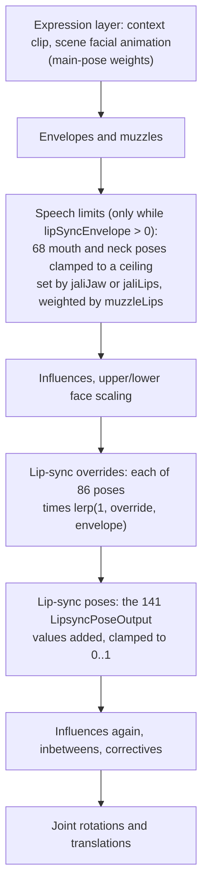
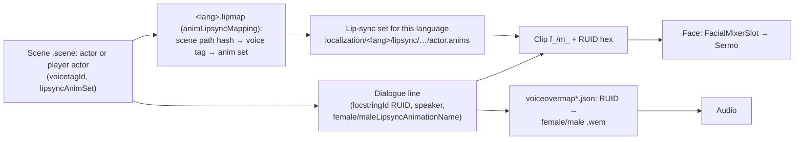

# Lip sync: how spoken lines move the face

**Maturity: Draft.** Consolidated on 27 September 2026 from the installed 2.31 game's English voice archive, one serialised lip-sync map, three serialised lip-sync animation sets and one voiced scene (WolvenKit CLI 9.0.1, in a private scratch folder), the female player head's facial setup solved with the Cyberpunk Blender add-on's facial solver (pinned `7a4ee793`), WolvenKit's type definitions (`11720772`), the decompiled 2.31 scripts, the Modding Docs at `be2f44ee`, Audioware's documentation, three installed voiced-quest mods and the JALI paper. **Nothing on this page has runtime evidence.** Grades follow the [knowledge rules](README.md): **[source]** engine, framework or tool source, decompiled scripts or type definitions; **[resource]** extracted game or mod resources; **[wiki]** Modding Docs; **[paper]** a published paper; **[offline]** measured by our own tools, never the game; **[hypothesis]** not established. The design built on these facts is the [lip-sync design](../research/animation/lipsync-design.md); the proof of concept is [experiment 027](../experiments/027-lipsync-poc/README.md).

This page answers: *where does a spoken line's facial animation live, what is in it, how does the game play it together with an expression, and how could new voiced lines get lip sync of their own?* The facial rig itself (414 control tracks, the facial setup and its solver) is described in [facial expressions](facial-expressions.md) and [facial animation](facial-animation.md); voice lines, voicesets and subtitles in [NPC reactions](npc-reactions.md#3-how-an-npc-picks-and-plays-a-voice-line).

## 1. The short answers

- **Every voiced line has a baked facial clip.** CD PROJEKT RED generated them with JALI Research's tools from each recording and its transcript, per language ([JALI in Cyberpunk 2077](https://www.gameanim.com/2020/12/05/cyberpunk-2077-procedural-facial-animation/)). The game ships the result as ordinary facial animation clips, one per line and per V gender variant, in per-language voice archives [resource]. There is no JALI code in the game to call: the analysis happened offline [hypothesis, strongly supported: no lip-sync generator exists in the scripts or resources we read].
- **A clip is found by scene, actor voice tag and line.** A per-language **lip-sync map** (`.lipmap`) maps each scene to the lip-sync animation set of each speaking voice tag; the scene's dialogue line names its clip (`f_<RUID in hex>` / `m_<RUID in hex>`) [resource].
- **A clip drives the face's dedicated lip-sync channel,** not the expression controls: a fade envelope, JALI's jaw and lip strength (`jaliJaw`, `jaliLips`), 141 `…LipsyncPoseOutput` tracks added on top of the expression, and 86 `…AnimOverrideWeight` tracks that mute the expression where speech needs the mouth [resource]. The facial setup combines the two layers, so a smiling face can talk and keep much of its smile [source: the add-on's solver; engine behaviour a hypothesis that the solver matches].
- **V does have lip sync.** The English voice archive holds 328 `v.anims` sets, and the lip-sync map lists V's voice tag in 456 scenes (ripperdoc mirror scenes among them) [resource]. The Modding Docs guide says "V has no lipsync" and WolvenKit's generator skips player actors [wiki]; that is true of the generator, not of the game data.
- **Modders reuse, they don't generate.** The wiki's WolvenKit guide copies existing vanilla clips into a mod's lip-sync map, Audioware's guide matches existing clips to new audio the way dubbing does, and three installed voiced-quest mods ship lip-sync maps that point at vanilla sets [wiki] [source: Audioware docs] [resource]. We found no mod or tool that generates CP2077 lip sync from new audio.
- **Generating it ourselves looks feasible.** The target format is fully readable, the Studio already runs the solver that plays it, and open tools give phone timing from audio plus transcript. Our proof of concept produced a clip in the lip-sync channel whose solved lip gap, mouth width and jaw rotation fall in the same ranges as a vanilla V clip, with the lips closing to within 0.25 mm on every bilabial [offline].

## 2. What a lip-sync clip holds

Measured on the 33 clips of two English sets: V's set for the scene `q004_04b_after_tutorial` (8 clips, female and male V lines) and Judy's set for the same scene (25 clips) [resource].

| Property | Value | Grade |
|---|---|---|
| Container | `animAnimSet` (`.anims`) per actor per scene per language, at `base\localization\<lang>\lipsync\<scene path>\<actor>.anims` | [resource] |
| Rig | The speaker's face skeleton: V's set names `base\characters\head\pma\h0_001_ma_c__player\h0_001_ma_c__player_skeleton.rig` for both genders' clips; Judy's names her own `h0_001_wa_c__judy_skeleton.rig`. All have 414 float tracks, and the player rig's track names equal the female basehead's | [resource] |
| Clip names | `f_<16 hex digits>` and `m_<16 hex digits>`: the line's locstring RUID in hex (`1740411693169090560` → `f_18272F36BE47A000`), for female and male V. An NPC's set has an `m_` twin only where its line differs by V's gender | [resource] |
| Type and rate | `AdditiveFromRefPose`, 30 fps, as long as the line (1.4 to 8.8 s in the sample), compressed buffer, no events | [resource] |
| Joints | A few rotation keys on `Head`, `Neck` and `Neck1` (head movement; scenes can turn it off with the dialogue line's `voParams.disableHeadMovement`); no other bones | [resource] [source: `scnDialogLineVoParams`] |

### The tracks it animates

The clip adds to the rig's reference tracks (envelopes and override weights rest at 1, everything else at 0) [resource].

| Track block | Used in the sample | What it does | Grade |
|---|---|---|---|
| `lipSyncEnvelope` | every clip, 0 → 1 → 0 | Fades the whole lip-sync channel in (median 0.43 s, 0.2 to 0.8 s) before the first sound and out (median 0.6 s) after the last. With it at 0 the solver skips the lip-sync stages | [resource] [source] |
| `muzzleLips` | every clip, follows the envelope | How strongly the expression's mouth poses are clamped to their speech limits (below) | [resource] [source] |
| `jaliJaw`, `jaliLips` | every clip, smooth curves, deltas −0.46 to +0.71 (so 0.54 to 1.71 in absolute terms) | JALI's JA and LI: how open the jaw and how active the lips are, varying slowly with the delivery. In the solver they set the ceilings of the expression's jaw and lip poses | [resource] [source] [paper] |
| `upperFace`, `lowerFace`, `muzzleBrows`, `muzzleEyes` | most clips, small | Scale or mute the expression's upper and lower face, brows and lids while speaking | [resource] |
| `…LipsyncPoseOutput` (141, one per main pose) | 100 of the 141 animate at least once | The speech itself, **added** to the expression's main-pose weights: jaw open (up to 0.6), lips together (up to 1.08, the bilabials), purse and funnel (rounding), stretch, corner stretch and corner up (spreading), lower lip suck (F and V), tongue base up, back and lift, tip up and down, throat and Adam's apple, neck. It also carries the speech's non-verbal motion: brow raises (up to 0.45), blinks (up to 0.96), squints, pupil widening and small gaze moves | [resource] |
| `…AnimOverrideWeight` (86: nose, lips, cheeks, jaw, neck, tongue) | 65 animate | Negative deltas that mute the expression's value of the same pose. For the jaw, tongue and most lip poses the delta is exactly minus the lip-sync value; for the lip-corner family (upper raise, pull, corner up, wide, stretch, lower raise, corner down) it sits near −0.5 to −0.65 for the whole line, so a smile is partly muted while speaking | [resource] |
| Main poses | 22, all ≤ 0.1 | Small head, neck, "face gravity" and gaze motion | [resource] |
| Wrinkle outputs | none | Computed by the solver | [resource] |

Left and right values are identical in the sample (JALI's output is symmetric). The setup's lip-sync poses carry a side flag (1 left, 2 right) and the rig has `lipSyncLeftEnvelope`/`lipSyncRightEnvelope` (reference 1, not animated in any sample clip); the add-on's solver reads neither [resource] [source]. What they do in the engine is open.

## 3. How the face combines an expression with speech

The facial setup's solver runs these stages on every frame (the add-on's reimplementation, `animation/facial/solver.py` at `7a4ee793`; the stage order matches the setup's data layout, the arithmetic is the community's reading) [source]:

- **The speech limits** are data in the facial setup. In the female basehead setup the jaw open and close, purse, funnel, lips together, suck, puff, tighten and tongue poses have ceilings of 0 (speech owns them), while corner up, wide, stretch and lower raise keep 0.35 to 0.5 and upper raise and pull 0.1 to 0.3 [resource]. The ceiling moves from its minimum (JA or LI of 0) through its midpoint (1, the reference) to its maximum (2) [source]. So a speaking face keeps a moderate smile or frown and loses any expression-driven jaw or lip rounding.
- **This is JALI's layering in the game's terms:** the expression is one layer, speech another, and JALI's two strengths decide how much room the expression's mouth keeps [paper] [source].
- **Where it enters the graph.** V's face graphs run the context's clip through `BlendAdditive`, then a `FacialMixerSlot`, then look-at and eye tracks, then the `Sermo` node that runs the setup [resource]. Scene facial animation and lip sync are pushed into the mixer slot natively; no script function plays lip sync (the decompiled 2.31 scripts contain none) [resource] [source]. Playing a lip-sync clip is the scene and voice-over systems' job.

## 4. How a line finds its clip

| Link | Evidence | Grade |
|---|---|---|
| `base\localization\en-us.lipmap`: `languageCodeName`, 3,495 `scenePaths` (path hashes), `scenePreviewPaths`, and per scene `sceneEntries { actorVoiceTags[], animSets[] }`, 7,490 set references in all | serialised | [resource] |
| V's voice tag `1103967280742240864` is mapped in 456 scenes; the ripperdoc scene `hey_spr_ripperdoc_01` maps V and the ripperdoc's voice | serialised; scene hashes computed with FNV-1a64 of the lower-cased path | [resource] |
| A scene's `playerActors[0].lipsyncAnimSet` and each actor's `lipsyncAnimSet` index `resouresReferences.lipsyncAnimSets` (sic), whose entries point at an editor-time path (`…\versions\gold\lipsync\en\…`); the language's lipmap supplies the real set | `hey_spr_ripperdoc_01.scene` (gold) | [resource]; the substitution itself [wiki] |
| Each `scnscreenplayDialogLine` has `locstringId`, `speaker`, `addressee`, a gender mask and `femaleLipsyncAnimationName`/`maleLipsyncAnimationName` | same scene | [resource] |
| Audio: `voiceovermap.json` (plus `_1`, `_holocall`, `_helmet`, `_rewinded`) ties a string id to female and male `.wem`; `stringidvariantlengthsreport.json` records line durations | English voice archive listing; the wiki voice-line guide (chromoxolon) | [resource] [wiki] |
| 5,688 lip-sync sets and 84,567 `.wem` files in the English voice archive; 520 of the sets belong to generic voicesets, so crowd barks are lip-synced too | archive listing | [resource] |
| Mods register their own lipmaps per language with ArchiveXL `localization: lipmaps:` and their audio with `vomaps:`; ArchiveXL merges lipmaps at start-up | wiki guides; ArchiveXL log sample on the core-mods page; three installed mods | [wiki] [resource] |
| Scene global setting `syncLipsyncToSceneTime` | type definition | [source] |

## 5. How modders add voiced lines today

| Route | What it does about the face | Grade |
|---|---|---|
| **WolvenKit "Generate vanilla lipsync anim sets"** (Scene editor, nightly 2026-09-09 or newer; guide by Akiway) | Copies the vanilla clips a scene's lines already name, from the installed voice languages, into per-language sets and lipmaps plus an ArchiveXL file. Explicitly does not create animation from new audio; skips V | [wiki] |
| **Custom voice line in a scene** (guide by chromoxolon) | `.wav` → `.wem` with Wwise 2023.1.14 (the game's version, mono, 48 kHz, Vorbis), a `locVoiceoverMap` JSON registered with `vomaps:`. No lip sync of its own | [wiki] |
| **Audioware** (Nexus 12001; 1.8.0 installed, 1.9.9 the latest GitHub release) | Plays arbitrary audio with subtitles. Its scene-dialogue guide reuses existing clips matched to new lines by duration and flow; the engine needs a matching `.wem` for the lip sync to play, and cuts the clip when the `.wem` ends, so its guide makes silent `.wem` files of the clip's length; line durations go into `stringidvariantlengthsreport.json`, which needs Codeware or redscript because ArchiveXL can't merge it | [source: Audioware documentation, "Scene dialog lines"] |
| **Installed voiced-quest mods** ("I Really Want To Stay At Your House - Judy", "Lizzie's Braindances", "Roller Coaster Enhanced") | Ship only lipmaps for up to 11 languages that point their scenes at vanilla lip-sync sets, with vanilla audio | [resource] |
| AI voice-swap mods for V (seen on Nexus, not inspected) | Re-map voice-over and lipmaps so the swapped audio still meets its vanilla clip | lead only |

## 6. Building blocks for our own generator

| Piece | Candidates | Licence | Grade |
|---|---|---|---|
| Phone timing from audio + transcript | **Rhubarb Lip Sync 1.14.0** (Daniel Wolf): PocketSphinx recogniser guided by a dialogue file; its debug log gives ARPAbet phones with times, its output nine mouth shapes (A–H, X). Ran in about 1 s and 0.2 GB on a 6 s clip | MIT; dependencies MIT, BSD, Boost | [offline] |
| | **Montreal Forced Aligner** (Kaldi-based, many languages, pretrained models) | MIT (the models carry their own licences, to check per language) | [source: repository licence] |
| | **Gentle** (Kaldi-based, English) | MIT; little maintained | [source: repository licence] |
| Viseme sets | Preston Blair mouth shapes (Rhubarb's A–H); the 15 Oculus/Meta visemes (`sil PP FF TH DD kk CH SS nn RR aa E ih oh ou`) as a naming convention only: Meta's lip-sync SDK itself is under Meta's own SDK licence, not an open one | — | [hypothesis on licence terms: read before any use of SDK code] |
| Rules | The JALI paper: onsets 120 ms before the sound (150 ms for lip-protruding visemes), apex held to 75 % of the phone, 120/150 ms decay; bilabials close, labiodentals touch, sibilants narrow the jaw; tongue-only phones leave the lips to their neighbours; lip-heavy visemes start early and end late; JA and LI from the intensity and pitch of stressed vowels and the high-frequency energy of fricatives and plosives, each compared within its class | published paper; whether JALI Inc. holds patents on the method is not established | [paper]; patents [hypothesis] |
| Solver | The Studio's warm external IO Suite solver already implements the lip-sync stages | GPL-3.0, run as a separate program | [source] |

## 7. What the proof of concept showed

[Experiment 027](../experiments/027-lipsync-poc/README.md): a 6 s synthetic English line (Windows speech synthesis, local only), Rhubarb phones, our own JALI-style generator writing the lip-sync channel, solved on the female basehead setup and compared with two vanilla V clips [offline]:

| Measure (relative to rest) | Generated | Vanilla `f_142541A57329F000` | Vanilla `m_142534CFEA29F000` |
|---|---|---|---|
| Lip gap, median / 90th percentile while open | 4.3 / 10.7 mm | 4.0 / 8.4 mm | 5.0 / 9.1 mm |
| Lip gap, maximum | 14.8 mm | 11.4 mm | 11.1 mm |
| Mouth width change | −14.3 to +8.6 mm | −12.0 to +10.6 mm | −5.1 to +9.8 mm |
| Jaw joint rotation, maximum | 10.0° | 6.6° | 10.0° |
| Lip gap at the middle of each bilabial | 0.11, 0.16, 0.24 mm | — | — |

Ranges match; our open vowels run a little wide, and we have not looked at the motion (the Studio has no clip player for arbitrary tracks yet) or compared it in game.

## Open questions

1. Does the engine play a scene line's lip sync on V's third-person face outside mirror scenes, and on the photo-mode V? (V's sets exist for 456 scenes.)
2. Does a line's lip sync need its `.wem` (Audioware's guide says the clip stops when the `.wem` ends), and can a silent `.wem` of the right length carry a clip while Audioware plays the real audio?
3. Does the lipmap accept a mod's own sets for V's voice tag in a mod scene, and does the scene need the editor-time `…\versions\gold\lipsync\…` reference at all?
4. What do `lipSyncLeftEnvelope`, `lipSyncRightEnvelope` and the setup's per-pose side flags do?
5. Does the female V's face solve lip-sync clips with the male player setup the face-rig component names ([facial animation, question 1](facial-animation.md#open-questions))? The clips are authored against the male player skeleton.
6. Can a photo-mode expression clip carrying the lip-sync channel (envelope, poses, overrides) animate V's mouth in photo mode, given that animated photo-mode faces loop?
7. Does `stringidvariantlengthsreport.json` gate the clip's length, and how do new lines add rows?

## Related pages

[Facial expressions](facial-expressions.md) · [Facial animation](facial-animation.md) · [NPC reactions](npc-reactions.md) · [Photo mode](photo-mode.md) · [Runtime access](runtime-access.md) · [Mod loading](mod-loading.md) · [Lip-sync design](../research/animation/lipsync-design.md) · [Expression editor design](../research/animation/expression-editor-design.md)
