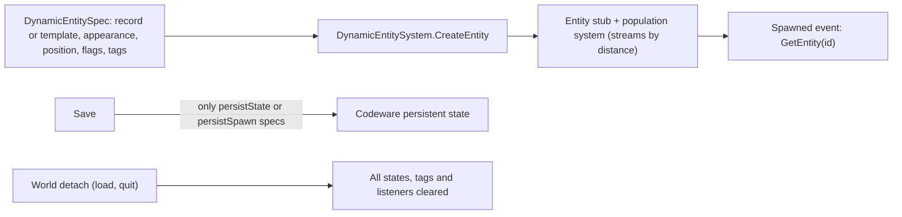
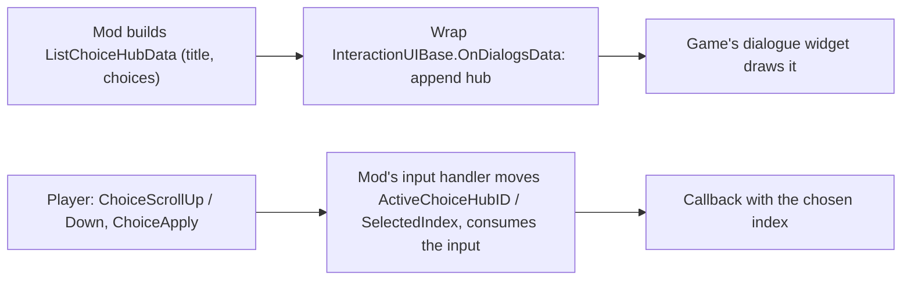

# NPC direction: spawning, moving, speaking and choices from a mod

**Maturity: Draft.** How a mod spawns or chooses an NPC, makes it walk, turn and follow through the game's AI commands, makes it speak (its own voice or text), gives it a face, a gaze and a gesture, offers V dialogue choices and receives the answer, and cleans up so nothing reaches a save. Consolidated on 30 September 2026 from the decompiled 2.31 script bundle (redscript-cli 0.5.31, `final.redscripts` SHA-256 `2119046f…ee86`), the game's REDmod TweakDB sources, Codeware (`v1.20.4`, `613a1cb8`), TweakXL (`v1.11.4`), ArchiveXL (`v1.27.3`), the Modding Docs at `a54b0873`, and installed mods read in place (Appearance Menu Mod 2.12.5 with its GitHub clone `5427235`, Native Interactions Framework f1.05b with its clone `041f17e`, keanuWheeze's InteractionUI module inside Immersive V Dialogue Expanded 1.1.0.0, Dark Future 2.0.3, Audioware 1.8.0, Immersive Food Vendors 1.2.2). **Nothing on this page has runtime evidence yet.** Grades follow the [knowledge rules](README.md). The bridge design built on it, with provenance, commands, a first scenario and a test card, is [NPC direction design](../research/runtime/npc-direction-design.md). Crowd reactions, voicesets and overhead barks are on [NPC reactions](npc-reactions.md).

Game-script citations are paths inside the decompiled bundle; installed-mod citations are paths inside the mod's folder in the mod manager (`mods/<mod name>/`).

## 1. The short answers

| Question | Answer | Grade |
|---|---|---|
| Can a mod spawn an NPC that never reaches a save? | Yes: Codeware's `DynamicEntitySystem` with `persistState` and `persistSpawn` off writes nothing at save time and clears everything at world detach | [source] |
| Can it make an NPC walk somewhere? | Yes: `AIMoveToCommand` through the NPC's AI component, with Walk, Run or Sprint, a stop distance and a facing target | [source]; AMM ships it |
| Can it make an NPC say something? | In the NPC's own voice, only a line its voiceset has for a generic trigger; any text as a subtitle or overhead line | [source] |
| Can it offer V dialogue choices and learn the answer? | Yes, without a scene: add a hub to the game's own dialogue widget and read the player's choice keys; or author a `.scene` with a choice node | [source] (a shipping CET module); [wiki] |
| Can it play a gesture? | A facial reaction yes; a body gesture through a workspot carrier entity | [source] |
| Do crowd NPCs obey commands? | Unknown; crowd NPCs are driven by the crowd system and change AI role only once, per AMM | [hypothesis] |

## 2. Spawning and choosing

- **Spec and system:** `DynamicEntitySpec { recordID | templatePath, appearanceName, position, orientation, persistState, persistSpawn, alwaysSpawned, spawnInView, active, tags }`; `CreateEntity`, `DeleteEntity`, `IsSpawned`, `GetEntity`, `GetTagged`, `DeleteTagged`, and tag listeners receiving `Created`, `Deleted`, `Spawned`, `Despawned`, `Dead` [source] Codeware `scripts/World/DynamicEntitySpec.reds`, `DynamicEntitySystem.reds`, `DynamicEntityEvent.reds`.
- **Streaming:** a record spawn registers an entity stub with the population system, honouring `spawnInView` and `alwaysSpawned` [source] `src/App/World/DynamicEntitySystem.cpp:247-280`.
- **Persistence is opt-in:** save writes only specs with either persist flag; load respawns only `persistSpawn`; world detach clears all; a non-persistent spec gets a transient entity id [source] `DynamicEntitySystem.cpp:24-100, 282-325`.
- **Records:** crowd citizens derive from `Crowd_NPC_Base` (`isCrowd = true`, civilian attitude group, `ReactionPresets.Civilian_Neutral`, senses off at start); 122 records derive from it, several on Phantom Liberty templates [resource] REDmod `characters/bases/base_records.tweak:42-68`, `characters/npcs/records/crowds/communities.tweak`. A TweakXL clone (`$base`) can change such flags without touching the vanilla record [source] TweakXL `YamlReader.cpp:8`. Changing a vanilla record's flats at run time (as AMM does to arm its spawns) changes every NPC of that record for the session [source] AMM `Modules/spawn.lua:588-594`.
- **Friendly and unhurt:** `GetAttitudeAgent().SetAttitudeTowards(player, AIA_Friendly)`; `GodModeSystem.AddGodMode(id, Immortal, n"Default")` [source] AMM `Modules/director.lua:1426-1427`, `Modules/util.lua:906-916`.
- **Choosing an existing NPC:** `GameObject.GetNPCsAroundObject(range)` [source] `core/entity/gameObject.script:715-731`. Protection checks on `ScriptedPuppet` [source] `cyberpunk/puppet/scriptedPuppet.script`: `IsQuest()` (3000), `IsPlayerCompanion()` (1693), `IsBoss()` (1299), `IsVendor()` (1336), `IsCharacterPolice()` (1398), `IsCharacterChildren()` (1414), `IsCrowd()` (1425), `IsOnAutonomousAI()` (1603, false when the AI story tier is `Cinematic`); plus `SceneSystemInterface.IsEntityInScene` / `IsEntityInDialogue` [source] `orphans.script:32250-32252` and `WorkspotGameSystem.IsActorInWorkspot`. On objects of unknown type use only entity-level natives (the bridge 0.7 world-object rule, after a session-7 crash; [game crashes](game-crashes.md)).
- **Crowd NPCs** walk traffic lanes owned by the crowd system (`CrowdMemberComponent`: `IsInCrowd`, `TryStopTrafficMovement`, `ChangeMoveType`, `AllowWorkspotsUsage`) [source] `orphans.script:24142-24175`; AMM respawns a crowd NPC rather than change its role a second time [source] `Modules/util.lua:871-893`.

## 3. AI commands

| Command | Key fields | Grade |
|---|---|---|
| `AIMoveToCommand` | `movementTarget` / `facingTarget` (`AIPositionSpec`: an entity or a world position), `movementType` (Walk, Run, Sprint), `desiredDistanceFromTarget`, `finishWhenDestinationReached`, `ignoreNavigation`, `useStart`, `useStop`, `rotateEntityTowardsFacingTarget` | [source] `orphans.script:44519-44540, 29704-29720, 2-6` |
| `AIFollowTargetCommand` | `target`, `desiredDistance`, `tolerance`, `stopWhenDestinationReached`, `movementType`, `lookAtTarget`, `matchSpeed`, `teleport` | [source] `orphans.script:47171-47188` |
| `AIRotateToCommand` | `target`, `angleTolerance`, `angleOffset`, `speed` | [source] `:47141-47150` |
| `AIHoldPositionCommand` | `duration` | [source] `:28790-28793` |
| `AITeleportCommand` | `position`, `rotation`, `doNavTest` | [source] `:47349-47356` |
| `AIUseWorkspotCommand` | a *placed* workspot's `workspotNode` (node ref), `jumpToEntry`, `entryId`, `moveToWorkspot`, `forceEntryAnimName`, `movementType` | [source] `:47358-47376` |
| `AIEquipCommand`, `AIUnequipCommand`, `AIJoinCrowdCommand` | slot and item; none | [source] `:47378-47394, 47190` |

- All derive from `AICommand { id, state }`; moves add `removeAfterCombat`, `ignoreInCombat`, `alwaysUseStealth` [source] `:25056-25066, 28774-28781`. **There is no voice-over AI command**; speech is an event on the NPC [source].
- **Send, track, cancel:** `AIComponent.SendCommand`, `GetCommandState` (NotExecuting, Enqueued, Executing, Cancelled, Interrupted, Success, Failure), `IsCommandExecuting` / `IsCommandWaiting` by class, `StopExecutingCommand(cmd, success)`, `CancelCommand(cmd)`, `CancelCommandById`, `CancelOrInterruptCommand`; `AIHumanComponent.GetActiveCommandID(class)` [source] `core/components/aiComponent.script:14-34, 977-983`, `orphans.script:276-284`. The game's ForceMoveInCombat effector sends a move and, on cleanup, stops it if executing or cancels it if waiting [source] `core/gameplay/effectors/quickhackEffectors.script:883-925`.
- **AMM's Director** chains teleport, move, arrival by distance (< 1 m), look-at, voice trigger, facial reaction, pose and a hold per node [source] AMM `Modules/director.lua:1151-1377`. Arrival by distance suggests command state alone may not signal arrival [hypothesis].

## 4. Speech

- **Own voice:** `GameObject.PlayVoiceOver(npc, trigger, …)` queues `SoundPlayVo { voContext }`; the voice's voiceset scene plays a random line for that trigger with audio, subtitle and lip sync [source] `core/entity/gameObject.script:743-770` ([NPC reactions §3](npc-reactions.md#3-how-an-npc-picks-and-plays-a-voice-line)). AMM's Director offers 26 triggers [source] AMM `init.lua:2792-2830`.
- **Text:** `scnDialogLineData` on `UIGameData.ShowDialogLine`, types `Regular` (bottom subtitle with the speaker's name), `OverHead`, `OverHeadAlwaysVisible`, `Holocall`, `Narrator`, …; hidden by id [source] `orphans.script:7396-7410, 44905-44926` ([NPC reactions §4](npc-reactions.md#4-text-only-barks-and-subtitles)). No audio means no lip sync [hypothesis].
- **Custom audio:** Audioware's `AudioSystemExt.Play(event, entityID, emitter, lineType, settings)` and emitters [source] Audioware `r6/scripts/Audioware/Ext.reds:11-36`; needs a consenting voice.
- **Holocalls** are phone machinery plus an ordinary scene over it, started from a quest phase; the answer comes back as a fact [wiki] `modding-guides/quest/custom-video-holocalls.md` (`holocall-phase-3-answer-wait.png`).

## 5. Dialogue choices

- **Data:** `UIInteractions.DialogChoiceHubs` → `ListChoiceHubData { id, activityState, flags, isPhoneLockActive, title, choices, timeProvider }` → `ListChoiceData { localizedName, type, inputActionName, captionParts, timeProvider }`; `ActiveChoiceHubID`, `SelectedIndex` [source] `orphans.script:42023-42026, 54489-54517`. Codeware adds `hubPriority` [source] Codeware `scripts/Base/Addons/ListChoiceHubData.reds`. `InteractionUIBase` listens with `OnDialogsData`, `OnDialogsActivateHub`, `OnDialogsSelectIndex`, `OnInteractionData` [source] `cyberpunk/UI/interactions/interactionUIBase.script:32-89`.
- **Runtime hubs (no scene):** keanuWheeze's InteractionUI module overrides `OnDialogsData` to append its hub, handles the three choice actions from `PlayerPuppet.OnAction`, sets the active hub and index on the blackboard, consumes what it handles, and guards `OnDialogsSelectIndex`, `OnInteractionData` and `dialogWidgetGameController.OnDialogsActivateHub` [source] `…/ImmersiveVDialogueExpanded/modules/interactionUI.lua:117-413`. Six installed CET mods ship it.
- **In redscript:** `GameObject.RegisterInputListener(listener, n"ChoiceApply")` is how the tutorial popup hears the apply key; `ListenerAction.GetName/GetType`, `ListenerActionConsumer.Consume` [source] `gameObject.script:152`, `cyberpunk/UI/popups/tutorialGameController.script:105-108`, `orphans.script:31981-32023`. Whether a listener sees the scroll actions and whether consuming stops the native handling is [hypothesis].
- **Reading any pick:** `UIInteractions.LastAttemptedChoice` (`InteractionAttemptedChoice`), as Dark Future does [source] `DFInteractionSystem.reds:405-408, 1088-1101`.
- **Scene choices:** `scnChoiceNode` options, one output socket each, text from `screenplayStore.options[].locstringId`, optional actor reminders [wiki] `modding-guides/quest/scene-node-definitions.md` (Choice Nodes; its example image shows the ordinary widget). Mods start scenes from an ArchiveXL-injected phase through facts and hear the end through an `ActionEvent` on the player; NIF patches scenes at load to shift choice-node ids, retarget node refs and swap option text [source] NIF `modules/utils/resourceHelper.lua:47-146, 199-349`, `modules/classes/interaction.lua:88-142`. Custom scene text is registered with ArchiveXL `localization: subtitles:` [source] ArchiveXL `Localization/Config.cpp:8-36`; [resource] Immersive Food Vendors.
- **Runtime hub versus scene:** a runtime hub needs no authoring and touches no save; a scene adds the conversation state and camera, timed choices and reminders, voiced lines with lip sync and timeline animations, at the cost of authoring, an injected phase and facts in saves ([quests and story §2](quests-and-story.md#2-the-parts-of-a-mod-quest)).

## 6. Face, gaze and gestures

- **Face:** `AnimFeature_FacialReaction { category, idle }` applied as `FacialReaction` [source] `orphans.script:32382-32387`; AMM's labelled pairs (joy 3/5, smile 3/6, sad 3/3, surprise 3/8, anger 3/1, disgust 3/7, fear 3/11, interested 1/3, neutral 2/2) [source] AMM `init.lua:2832-2857`.
- **Gaze:** `LookAtAddEvent.SetEntityTarget(target, n"pla_default_tgt", offset)`, style, limits, head and chest parts; removed with `LookAtRemoveEvent.QueueRemoveLookatEvent(owner, event)` [source] `reactionComponent.script:3539-3600`, `core/events/lookAtEvents.script:2-10`; AMM `Modules/util.lua:762-804`.
- **Gestures:** `WorkspotGameSystem.PlayInDeviceSimple(carrier, npc, …)` then `SendJumpToAnimEnt(npc, clip, instant)`; `StopInDevice`, `SendFastExitSignal` [source] `orphans.script:18381-18420`. AMM spawns its own carrier entity and catalogues 43,963 clips per rig [source] AMM `Modules/anims.lua:328-400`; [resource] its `db.sqlite3`.

## 7. Safety and clean-up

- Refuse in tier-3+ scenes, dialogue, combat, vehicles and busy states; never direct protected NPCs (§2).
- Non-persistent spawns never reach a save and vanish at a load [source] (§2); a save lock covers the rest.
- Release: cancel or stop commands, hide lines, withdraw a hub, remove look-ats, reset faces, stop workspots, delete by tag (AMM teleports its actors behind V first) [source] AMM `Modules/director.lua:1051-1091`.
- No facts or quest phases are needed for any of the runtime routes; the scene route adds both.

## Open questions

1. Does a TweakXL clone of a crowd record with `isCrowd: false` take commands like a named NPC?
2. Is `AICommandState.Success` reported on arrival?
3. Does a redscript input listener see and consume the choice actions while a dialogue hub is shown?
4. Which reaction preset keeps a spawned actor calm and quiet to crime but still expressive?
5. Does a spawned actor's own proximity reaction fight a mod's look-at and lines?
6. Does the `Holocall` subtitle style render with no call in progress?
7. Which workspot clips play on every rig, and what is the smallest carrier resource that plays them?

## Related pages

[NPC reactions](npc-reactions.md) · [Quests and story](quests-and-story.md) · [Player control](player-control.md) · [Lip sync](lipsync.md) · [Facial expressions](facial-expressions.md) · [World and streaming](world-and-streaming.md) · [Runtime access](runtime-access.md) · [NPC direction design](../research/runtime/npc-direction-design.md)
</content>
</invoke>
