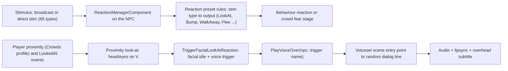
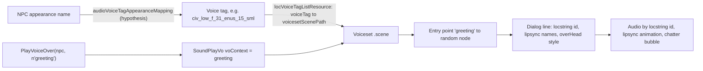

# NPC reactions, crowd barks and what NPCs can notice about V

**Maturity: Draft.** How Cyberpunk 2077's NPCs react to V (stimuli, the reaction manager, crowd fear, look-at and facial reactions), how an NPC picks and plays a generic voice line, which of those lines could plausibly comment on V, what a script can read about V's appearance, V's car and the district, what existing mods already do here, and how a mod could add reactions and text-only barks. Consolidated on 27 September 2026 from the decompiled 2.31 script bundle (`final.redscripts` SHA-256 `2119046f…ee86`, redscript-cli 0.5.31), the game's voiceset scenes and English subtitle files serialised with WolvenKit CLI 9.0.1 in a private scratch folder, WolvenKit's generated type definitions (`11720772`), the Modding Docs at `be2f44ee`, and four installed mods read in place. **Nothing on this page has runtime evidence yet.** Grades follow the [knowledge rules](README.md): **[source]** decompiled game scripts, mod scripts or type definitions; **[resource]** game resources we serialised; **[wiki]** Modding Docs; **[hypothesis]** not yet established.

This page answers: *can NPCs notice how V looks and what V drives, and react through the game's own reaction, voice and subtitle systems?* The product idea and its feasibility note are in the [alive ideas register](../research/backlog/alive-ideas.md#the-world).

## Sources

| Source | Version studied | Used for |
|---|---|---|
| Game scripts (decompiled bundle) | 2.31 | `ReactionManagerComponent`, stimuli, `GameObject.PlayVoiceOver`, subtitle and chatter controllers, `PlayerPuppet.IsNaked`, equipment, district and vehicle records |
| Voiceset scenes `base\open_world\voicesets\**\versions\gold\*.scene` | 2.31, 529 scenes | Trigger names, randomised lines, dialog-line parameters |
| English voiceset subtitles `base\localization\en-us\subtitles\open_world\voicesets\*.json` | 2.31, 525 files, 16,356 entries | Line text by string id (paraphrased here, never quoted at length) |
| WolvenKit type definitions | `11720772` | `locVoiceTag`, `locVoiceTagListResource`, `audioVoiceTagAppearanceMapping`, `entInjectVoiceTagEvent`, `questPlayVoiceset_NodeTypeParams` |
| Modding Docs | `be2f44ee` | `modding-guides/quest/adding-a-custom-voiceline-to-a-scene.md` (chromoxolon, September 2026); `modding-guides/quest/generating-vanilla-lipsync-animation-sets.md` |
| Street Sense (Nexus 28989) | installed 5.2.2 | Clothing-driven crowd reactions and scores |
| Responsive NPCs (Nexus 14800) | installed 0.26 | Clothing, district, wealth and vehicle-aware reactions |
| Responsive V (Nexus 22694) | installed 1.4 | Patching a voiceset scene at load |
| Audioware (Nexus 12001) | installed 1.8.0 | Script-built subtitle lines, custom audio with subtitles |

Game-script citations are paths inside the decompiled bundle. Installed-mod citations are paths inside each mod's folder in the mod manager (`mods/<mod name>/`). Who made each mod and what it taught us is in the [community credits](../docs/community-credits.md).

## 1. The short answers

- **The game already has one appearance reaction.** When a crowd NPC does its proximity look-at and V wears nothing in the legs, inner-chest and outer-chest slots, it pulls a disgusted face and plays its "being followed" line instead of a greeting [source] `core/components/scriptComponents/reactionComponent.script:2853-2858`, `cyberpunk/player/player.script:5404-5409`. Everything else about V's look is ignored.
- **Crowd voice lines are chosen by trigger name, not by content.** `GameObject.PlayVoiceOver(npc, n"greeting", …)` queues a `SoundPlayVo` with that name as `voContext` [source] `core/entity/gameObject.script:743-770`. Each generic voice is a `.scene` whose entry points carry the same names (`greeting`, `bump`, `fear_foll`, …) and lead through a random node to one of about two lines [resource]. So an NPC can only "say something about V" if its own voice happens to have such a line under a trigger we can fire.
- **A few such lines exist.** About 15 of the 538 civilian greeting lines comment on V's looks (compliments on style, face or attractiveness; one "you need a new wardrobe"; one "look what the cat dragged in"), each in one specific voice [resource]. None comments on a car.
- **Text-only barks are easy and look native.** A script can build a `scnDialogLineData` (text, speaker, type `OverHead`, duration) and post it to the UI blackboard; the chatter controller draws it above the NPC like any vanilla overhead line [source] `cyberpunk/UI/subtitles/baseSubtitlesControllers.script:120-212`, Audioware `r6/scripts/Audioware/Codeware.reds:47-66`.
- **Everything the assessment needs is readable from script:** worn and displayed items with their tags, hidden slots, V's body gender, the observer's archetype visual tags (`anim_Posh`, `anim_Lowlife`, …) and affiliation, V's mounted vehicle record (manufacturer, type, UI data) and its damage level, and the current district record [source]. There is **no wealth or class attribute** on districts or vehicles [source]; that has to come from data we derive.
- **Two installed mods already do a rule-based version** (Street Sense, Responsive NPCs). Both classify clothing through tags or hand-kept item lists and reuse the vanilla `greeting`, `bump` and `fear_foll` triggers with a matching facial reaction [source]. Their limits (random line content, curated per-mod item lists) are exactly what XF Studio's resolver can improve.

## 2. The reaction pipeline

### 2.1 Stimuli and presets [source]

- A stimulus is a `StimuliEvent`: source object and position, radius, a `Stim_Record`, visual or audio propagation, and one of 65 `gamedataStimType` values (from `AimingAt`, `Bump` and `CrimeWitness` to `VehicleHorn`, `WeaponDisplayed` and `Whistle`) [source] `core/events/stimuliEvents.script:1-60`, `orphans.script` (`enum gamedataStimType`). The set is a fixed enum, so a mod cannot add a stim type; it can only send existing ones.
- Stims are sent by the `StimBroadcasterComponent`: `TriggerSingleBroadcast`, the static `BroadcastStim(obj, type, radius)` and `SendDrirectStimuliToTarget` (sic) [source] `core/components/stimBroadcasterComponent.script`, `reactionComponent.script:3395-3430`.
- Each NPC's `ReactionManagerComponent` maps a stim to a `ReactionOutput` through its preset's `Rule_Record`s (`GetRules`, `GetReactionOutput`) [source] `reactionComponent.script:1519-1600`. Outputs are the 24 `gamedataOutput` values (`LookAt`, `TurnAt`, `Bump`, `WalkAway`, `BackOff`, `Reprimand`, `CallPolice`, `Flee`, `Panic`, …); priorities come from `ReactionOutput.<name>` records [source] `reactionComponent.script:3441-3447`. Presets are typed (`Civilian_Neutral`, `Civilian_Passive`, `Ganger_Aggressive`, `Police_Passive`, `Child`, `NoReaction`, … 27 in all) [source].
- A `LookAt` output makes the NPC grunt (`stlh_curious_grunt`) and look at the source if it is in front [source] `reactionComponent.script:1664-1680`.
- `ScriptedReactionSystem` only counts fleeing NPCs and picks one police caller [source] `core/systems/reactionSystem.script:2-85`; the reaction logic lives per NPC.
- Crowd NPCs keep a fear stage (`Relaxed`, `Stressed`, `Alarmed`, `Panic`) and their own crowd handling (`HandleCrowdReaction`, `OnCrowdReaction`) that plays `fear_beg`, `fear_run` and similar triggers [source] `reactionComponent.script:2323-2760`.

### 2.2 Proximity look-at and the facial reaction [source]

This is the path that matters for "NPCs notice V":

1. When V enters an NPC's `Crowds` proximity profile, `OnPlayerProximityStartEvent` checks `CanTriggerExpressionLookAt` and, if V is in front within 45°, starts a look-at; two seconds later `OnProximityLookatEvent` calls `TriggerFacialLookAtReaction` if V is still in front [source] `reactionComponent.script:5210-5262`.
2. `CanTriggerExpressionLookAt` refuses NPCs in combat or alerted, ragdolling, blinded, with `NoReaction` or `Follower` presets, bosses, those in a reaction sequence or alarmed/panicking, in lore animations, busy, asleep or in braindance workspots, in dialogue or scenes, or not on autonomous AI [source] `reactionComponent.script:2919-2960`.
3. `TriggerFacialLookAtReaction` picks a facial reaction and a voice trigger [source] `reactionComponent.script:2835-2874`:
   - outside a crowd: facial category 3, idle 1, trigger `greeting`;
   - V armed (or forced fear): category 3, idle 10 (fear), no line;
   - **V naked (`IsNaked`): category 3, idle 7 (disgust), trigger `fear_foll`, look-at held;**
   - otherwise a random personality from nine (`SelectFacialEmotion`) sets the facial idle, and the trigger is `greeting`.
   Vendors never speak here. A `MapLookAtVO` table that pairs personalities with triggers exists but is not called [source] `reactionComponent.script:3504-3537`.
4. The facial reaction is `AnimFeature_FacialReaction { category, idle }` applied with `AnimationControllerComponent.ApplyFeatureToReplicate(npc, n"FacialReaction", …)`, and reset after a cooldown [source] `reactionComponent.script:2869-2917`. The personality table gives the known idles: category 3 idle 1 aggressive, 5 joy or funny, 7 disgust, 8 shock or surprise, 10 fear, 3 sad; category 1 idle 3 curiosity [source] `reactionComponent.script:3456-3502`. The clips are the generic NPC emotion idles ([facial expressions](facial-expressions.md)).
5. Standing too close in front of an NPC repeatedly ("comfort zone") forces the fear face and sends a `CrowdIllegalAction` stim back to the NPC [source] `reactionComponent.script:3380-3435`.

`IsNaked` reads the **gameplay** items (`GetActiveItem` on `Legs`, `OuterChest`, `InnerChest`), not what is drawn [source] `player.script:5404-5409`. A V dressed in gameplay slots but showing nothing through the wardrobe is not "naked" to the game, and a wardrobe outfit over empty slots is. What is actually drawn is readable too (§5).

### 2.3 Look-at from script [source]

`ActivateReactionLookAt` builds a `LookAtAddEvent` targeting V's `pla_default_tgt` slot with style and optional repeat, duration and upper-body parts; `DeactiveLookAt` removes it [source] `reactionComponent.script:3539-3670`. It refuses in combat and during lore animations. The same event type is how AMM aims a character's eyes and head ([poses](poses.md)).

## 3. How an NPC picks and plays a voice line

### 3.1 Voicesets are scenes [resource]

- The game ships 529 generic voiceset scenes (`sceneCategoryTag: voiceset`) under `base\open_world\voicesets\` (civilian low, mid, high, homeless, prostitutes and others; gangs; NCPD; security; mercs; a few named characters) [resource]. Each has one actor, entry points named after triggers, `voInfo` pairs (`inVoTrigger` → `outVoTrigger` such as `greeting` → `greeting_var_1`, with durations), and a screenplay store of dialog lines [resource].
- A trigger's entry point leads to a `scnRandomizerNode` (equal weights) whose outputs are section nodes, each holding one `scnDialogLineEvent` with `visualStyle: overHead`, a `voContext` and a `voExpression`, pointing to a screenplay line (`locstringId`, male and female lipsync animation names, gender mask) [resource].
- The trigger names match the names scripts pass to `PlayVoiceOver` exactly (`greeting`, `bump`, `fear_foll`, `fear_beg`, `fear_run`, `stlh_curious`, …), so the voice context selects the entry point [resource + source; the native lookup itself is a hypothesis].
- Civilians share a small vocabulary: `greeting` (522 scenes), `bump` (511), `phone_start`/`phone`/`phone_end` (501), `fear_run`/`fear_beg`/`fear_foll` (275), the security reprimands `rep_*` (≈270), stealth `stlh_*` and combat barks [resource]. There is no trigger for compliments, stares, outfits or cars.
- Subtitle entries are keyed by string id and have a female and a male variant chosen by **V's** gender (for example "look at her" / "look at him") [resource]. Voiced audio and lipsync come from the same string id and the voice's lipsync set ([Modding Docs lipsync guide](https://wiki.redmodding.org/cyberpunk-2077-modding/modding-guides/quest/generating-vanilla-lipsync-animation-sets) [wiki]).

### 3.2 From NPC to voiceset

- `locVoiceTagListResource` (extension `.voicetags`) lists `locVoiceTag { voiceTag, voicesetScenePath, id, isApuc }` [source: WolvenKit types]. Named characters set `voiceTag` in TweakDB (`jackie`, `panam`, …) [wiki]; crowd `Character` records in the REDmod TweakDB sources do not [resource].
- `audioVoiceTagAppearanceMapping` lists groups of appearance names with candidate voice tags [source: WolvenKit types]. That this is how crowd NPCs get a voice from their appearance is the likely reading [hypothesis]. `entInjectVoiceTagEvent { voiceTagName, forceInjection }` and `communityVoiceTagInitializer` can set a voice tag at run time or from a community spawn [source: WolvenKit types].
- Quest graphs can play a voiceset trigger directly (`questPlayVoiceset_NodeType`: puppet, `voicesetName`, overriding context, expression and visual style) [source: WolvenKit types].

### 3.3 Lines that could comment on V [resource]

Census of the civilian `greeting` entry points (269 civilian voices, 538 lines, 500 distinct texts):

| Kind | Count | Examples (voice, string id; paraphrased) |
|---|---|---|
| Compliment on looks or style | ≈10 | `civ_low_m_89_chn_10_chd` 1922672978275344388 (a child admiring V's outfit); `civ_low_f_31_enus_15_sml` 1949184078459297796 (V has style); `civ_mid_m_33_afam_20` 1948838854256091140 (calls V gorgeous); `civ_high_m_33_ind_30` 1948863777079336964; `civ_low_f_10_enus_30_fat` 1949169821449576452 (gendered: pretty / handsome); `civ_low_m_106_nat_30` 1922697659841781764 (gendered); `civ_mid_m_29_enus_40` 1948819995004362756 (V's face); `civ_high_f_22_jap_30` 1882070430938308612 |
| Put-down of looks | 2 | `civ_mid_f_48_chn_20` 1954532098822938628 (V needs a new wardrobe, names a fashion brand); `civ_mid_f_54_jap_20` 1954539339500265476 (look what the cat dragged in) |
| "Why are you staring" | ≈10 | `civ_mid_f_29_enus_40` 1954504293389213700; `civ_mid_m_77_rus_25` 1949012166571581440 |
| Car or vehicle comment | 0 | none in any civilian greeting |

- Each voice's greeting randomiser picks between its two lines, so even the right voice says the compliment only half the time [resource].
- The `fear_foll` lines that the naked reaction plays are "stop following me" lines (tour guide, stop tailing me, I'm broke) [resource]: they fit only loosely.
- Car comments would need new lines. The voiced route is a consenting voice actor or text only; cloning the original actors' voices is ruled out ([alive ideas](../research/backlog/alive-ideas.md#the-world)).

## 4. Text-only barks and subtitles [source]

- Subtitle and chatter controllers listen to the UI blackboard `UIGameData.ShowDialogLine`, `HideDialogLine` (by `CRUID`) and `HideDialogLineByData`, each a variant holding an array [source] `baseSubtitlesControllers.script:120-252`.
- A line is `scnDialogLineData { id: CRUID, text, type, speaker, speakerName, isPersistent, duration }` (an `importonly` struct scripts can fill) [source] `orphans.script:44905-44926`. Line types include `Regular`, `Holocall`, `OverHead`, `OverHeadAlwaysVisible`, `Radio` and `Narrator` [source] `orphans.script:7396-7410`.
- The chatter controller draws `OverHead` lines above the speaker when the speaker is set and is not V or a vehicle, the scene tier is below 3, no main dialogue blocks broadcasts, and V is within 150 m (20 m in tighter scene tiers); `OverHeadAlwaysVisible` skips those checks. Players can switch chatter off in the subtitle settings [source] `cyberpunk/UI/subtitles/chattersControllers.script:1-10, 175-206`.
- Audioware does exactly this for its sounds: it builds the struct with `CreateCRUID`, posts `[line]` to `ShowDialogLine` and hides it by id after the duration [source] Audioware `r6/scripts/Audioware/Codeware.reds:47-66`, `Callback.reds:1-12`. Localised text can come from ArchiveXL `localization: onscreens:` files, as Responsive NPCs ships [source] Responsive NPCs `archive/pc/mod/responsive_npcs.archive.xl`.
- A text bark therefore costs no audio and no voice rights, respects the player's chatter setting, and looks like the vanilla overhead chatter [source]. Without audio or lipsync the NPC's mouth does not move [hypothesis]; a facial reaction plus look-at covers most of that.

## 5. What a script can read

| Fact | How | Grade |
|---|---|---|
| Gameplay items per slot | `EquipmentSystem.GetData(player).GetActiveItem(area)` | [source] |
| What is drawn | `GetActiveVisualItem`, `IsSlotHidden`, `IsSlotOverriden`, `GetSlotOverridenVisualItem`, `GetActiveWardrobeSet` in `cyberpunk/systems/equipmentSystem.script:1163-1546, 4493, 4883-4890`; EquipmentEx outfits through its own API (both installed mods read it) | [source] |
| Item tags | `TweakDBInterface.GetItemRecord(id).TagsContains(tag)`; iterating `Tags()` with `for` crashes per Street Sense's note, so it uses `TagsContains` | [source] |
| Nudity (vanilla) | `PlayerPuppet.IsNaked()`: no gameplay item in legs, outer or inner chest | [source] |
| V's body gender | `GetResolvedGenderName()` (Street Sense notes `GetGender()` returns empty on the player) | [source] |
| Observer's social archetype | `npc.MatchVisualTag(n"anim_Posh")` and 20 more (`anim_Lowlife`, `anim_MidCorp`, `anim_LowCorp`, `anim_Nightlife`, `anim_Homeless`, `anim_Junkie`, `anim_Freak`, `anim_Mallrat`, `anim_Worker`, `anim_Elder`, …); the game uses them to pick locomotion styles | [source] `cyberpunk/NPC/NPCPuppet.script:1000-1075` |
| Observer's faction and preset | `Character_Record.Affiliation().Type()`, the reaction preset type, `IsCharacterCivilian()`, `IsVendor()` | [source] |
| V's vehicle | `GetMountedVehicle(player)` or `VehicleComponent.GetVehicle`; `Vehicle_Record`: `Manufacturer`, `Type` (car, bike), `VehicleUIData` (production year, horsepower, mass, info text), `Affiliation`, `DisplayName`, `Tags` | [source] `core/gameplay/vehicles.script:1489`, `orphans.script` (`Vehicle_Record`) |
| Car condition | `VehicleComponent.m_damageLevel` 0–3 (from destruction ≤50 %, ≤25 %, near zero), also on the `Vehicle.DamageState` blackboard | [source] `core/components/scriptComponents/vehicleComponent.script:3698-3735, 3944-3962` |
| Car price | Only vehicle-shop offers carry a price (`VehicleOffer_Record` → `PurchaseOffer.Price()`); how an offer names its vehicle was not found in script | [source]; the link is a [hypothesis] |
| District | `PreventionSystem` → `DistrictManager.GetCurrentDistrict()` → `District_Record`: `Type` (district and subdistrict enum), `ParentDistrict`, `Gangs`, `CrimeMultiplier`, `PreventionPreset`, `IsQuestDistrict`; the UI's `UI_Map.currentLocationEnumName` blackboard | [source] `core/systems/prevention/districtManager.script:14-190` |
| District wealth | none in the record | [source] |

## 6. What existing mods do

| Mod | What it does | How | What it teaches |
|---|---|---|---|
| **Street Sense** | Clothing changes detection and crowd reactions: revealing, positive, intimidating, fear and annoyed outfits, weighted by V's gender and street cred | Scans equipped and EquipmentEx outfit items on slot changes; classifies each by TweakXL tags (`Revealing`, `Intimidating`, `FearReaction`, `PositiveReaction`, `AnnoyedReaction`) or a JSON list of 361 mod item-record prefixes, because ArchiveXL dynamic items "eat" TweakXL tags; per class a distance, chance, trigger (`stlh_curious_grunt`, `greeting`, `bump`, `fear_foll`) and facial idle | [source] `r6/scripts/StreetSense/UNR_PlayerClothing.reds:9-88, 330-500`, `r6/storages/StreetSense/clothingmap.json` |
| **Responsive NPCs** | NPCs react to clothing affiliation, a "buck naked" V, a broke V near posh NPCs (disgust), cyberpsychosis, gang vehicles and district | Replaces or wraps several `ReactionManagerComponent` methods (`OnLookedAtEvent`, bump and crowd handling); reads NPC `anim_*` visual tags and affiliation; listens to `UI_Map.currentLocationEnumName` for the district | [source] `r6/scripts/responsive_npcs/ReactionComponentOverrides.reds:176-480`, `PlayerPuppetOverrides.reds:1-200` |
| **Responsive V** | V answers NPCs with her own voiced lines | Codeware `Resource/PostLoad` callback on V's voiceset scene; swaps the scene's graph, entry points and screenplay for its own and retargets a section's line at run time; a commented draft detects civilian voiceset scenes by `sceneCategoryTag` | [source] `r6/scripts/responsivev/responsivev_vset_v_patch.reds`, `responsivev_vset_civ_listener.reds` |
| **Audioware** | Audio framework: custom sounds from YAML manifests or scripts, with subtitles | Its own audio backend (RED4ext); subtitles through the UI blackboard as in §4 | [source] `r6/scripts/Audioware/Codeware.reds`, `Callback.reds` |

Both reaction mods reuse only vanilla triggers, so what an NPC actually says is whatever its voice's `greeting` or `bump` line happens to be [source]. Street Sense's hand-kept list of mod item records is the per-mod approach XF Studio's architecture contract rules out.

## 7. How a mod could add reactions

1. **Hook the existing moment.** Wrap `ReactionManagerComponent.TriggerFacialLookAtReaction` (or `OnProximityLookatEvent`) with redscript `@wrapMethod`, which works on private methods: Responsive NPCs wraps the private `Initialiaze` and replaces the private `CheckStalk` and `HandleCrowdReaction` of the same class [source] `ReactionComponentOverrides.reds:587-1040`. The vanilla gating, cooldowns, look-at and reset already apply; the wrapper decides whether V's appearance overrides the vanilla choice [source: the vanilla methods]. A scriptable system could instead poll nearby NPCs, at higher cost and with none of the gating [hypothesis].
2. **Choose a face and a look.** `AnimFeature_FacialReaction` with the idles in §2.2 and `ActivateReactionLookAt` with `repeat` for a stare [source].
3. **Say something:**
   - **Text bark** (§4): cheapest, no rights questions, localisable [source].
   - **A vanilla line in the NPC's own voice:** add entry points (for example `xfs_compliment`) to civilian voiceset scenes at `Resource/PostLoad`, each leading to lines that voice already has and that fit the context (the census in §3.3, extended by tagging lines offline). `PlayVoiceOver(npc, n"xfs_compliment")` then plays with the right voice and lipsync, and silently does nothing for voices without one [hypothesis: Responsive V proves scene patching at load; whether the voiceset system accepts new entry-point names needs a game test].
   - **New voiced lines:** a `voiceovermap.json` registered through ArchiveXL `localization: vomaps:` ties a `.wem` to a string id in a scene [wiki] `modding-guides/quest/adding-a-custom-voiceline-to-a-scene.md`; Audioware plays arbitrary audio with subtitles [source]. Both need consenting voices. Extracting and repacking vanilla VO, as some dialogue mods do, redistributes game audio and is not a route for XF mods.

## 8. Design implications for XF Studio

- **The assessment layer should read what is drawn**, not gameplay slots: wardrobe, hidden slots and EquipmentEx outfits. The Studio's clothing resolver already knows the drawn garments, their visual tags and what they hide ([worn clothing](clothing.md)), which gives coverage ("revealing") from data instead of a curated list.
- **"Fancy" or "shabby" can come from data the game already has:** item quality and tags, the garment's resolved materials, the vehicle manufacturer and UI data. District wealth can be derived from the crowd itself: the share of `anim_Posh`/`anim_MidCorp`/`anim_Nightlife` against `anim_Lowlife`/`anim_Homeless`/`anim_Junkie` NPCs near V, which follows the game's own population data instead of a hand-written district table [hypothesis: needs a sample in game].
- **The observer matters as much as V:** a posh NPC and a lowlife should read the same outfit differently; `anim_*` tags, affiliation and preset type are the inputs [source].
- **Lines from data too:** an offline pass could tag all 14,003 distinct voiceset lines by what they could plausibly be about (looks, style, staring, weather, …) with evidence, so the in-game mod ships only a table of (voice, trigger, string id), never audio.

## Open questions

1. Does the voiceset system accept a new entry-point name added at `Resource/PostLoad`, or does it cache entry names natively?
2. Which resource holds the crowd appearance → voice tag mapping, and can a script read an NPC's current voice tag?
3. Does a script-built `OverHead` line on an NPC show reliably in open world (distance, scene tier, chatter setting), and does it collide with the NPC's own voiced chatter?
4. Where does a vehicle offer name its vehicle, and do all player vehicles have an offer (gifts and quest cars do not appear in shops)?
5. Do `anim_*` visual tag shares around V actually separate rich and poor districts?
6. Does `IsNaked` also trigger other vanilla behaviour (for example in scenes or vendors) that an XF reaction should respect?

## In-game test asks

Not scheduled; for a later session once a prototype exists: walk into a Japantown crowd (a) naked, (b) with the prototype's "revealing" outfit, (c) in a luxury car and a wrecked one in Kabuki and Charter Hill; capture the chatter bubbles, facial reactions and log lines the prototype writes.

## Related pages

[Facial expressions](facial-expressions.md) · [Worn clothing](clothing.md) · [Photo-mode poses](poses.md) · [Runtime access](runtime-access.md) · [World and streaming](world-and-streaming.md) · [Alive ideas](../research/backlog/alive-ideas.md)
