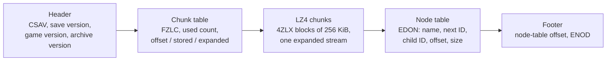

# Save files

**Maturity: Draft.** Consolidated on 27 September 2026 from WolvenKit's save code, the scripting RTTI dump, Codeware, EquipmentEx, Cyber Engine Tweaks and redscript source, the Modding Docs, and read-only structural probes of three private 2.31 saves (save version 269), which printed layout, class and field names, counts and sizes only. Nothing on this page has runtime evidence except where marked. Evidence grades follow the [knowledge rules](README.md): **[source]** engine, framework or tool source; **[resource]** bytes of real saves or game files; **[wiki]** Modding Docs; **[runtime]** running game; **[offline]** measured by our own probes; **[hypothesis]** not yet established. The evidence, the node-by-node catalogue and the editor design are in the [save editor design](../research/save/save-editor-design.md).

This page answers four questions for XF Studio agents:

1. How is a save laid out, and which parts hold what?
2. Which parts can be decoded generically, from type information, and which need a hand-written layout?
3. Where do mods keep their data, in the save or elsewhere?
4. What must an editor preserve so the game still accepts the save?

## Evidence snapshot

| Source | Version | What it established |
|---|---|---|
| WolvenKit | commit `11720772` (GPL-3.0; studied only): `WolvenKit.RED4/Save/` (reader, writer, node writer, 56 node parsers, hash helper), `Archive/IO/RedPackageReader*.cs` | Container, node dispatch, the bespoke node layouts, the hash-keyed persistency stream, how unknown classes are handled |
| Scripting RTTI dump | `red-dump-json` at `a8e52990` (exported by psiberx, before 2.31) | Type names, enum names and members, `PlayerDevelopmentData` fields |
| Codeware | [`613a1cb8`](https://github.com/psiberx/cp2077-codeware/tree/613a1cb830ecf33508ffca839d3ea631073504ef) (MIT) | Where script services and dynamic entities persist |
| EquipmentEx | [`3208ff4c`](https://github.com/psiberx/cp2077-equipment-ex/tree/3208ff4c1caa2e3f08c3e20a8e7c3e6b1e95124d) (MIT) | A script mod's persistent fields, including a mod enum |
| Cyber Engine Tweaks | `9a8522f` (MIT), `src/scripting/LuaSandbox.cpp` | CET mods keep their state in their own `db.sqlite3` |
| Modding Docs | `be2f44ee`: [CyberCAT page](https://github.com/CDPR-Modding-Documentation/Cyberpunk-Modding-Docs/blob/be2f44eed8419342ec13f72ed9cab008e9f7b289/for-mod-creators-theory/modding-tools/savegame-editor-cybercat.md) (manavortex), [save file page](https://github.com/CDPR-Modding-Documentation/Cyberpunk-Modding-Docs/blob/be2f44eed8419342ec13f72ed9cab008e9f7b289/for-mod-creators-theory/files-and-what-they-do/file-formats/save-file-.dat.md) (darkcart) | Editor version dependence, the risk of editing quest facts, the header and tables |
| Three private 2.31 saves | 169, 330 and 336 nodes | Everything marked [resource] or [offline] |

## 1. The container [source] [resource]

A save is a folder under `%USERPROFILE%\Saved Games\CD Projekt Red\Cyberpunk 2077\` holding `sav.dat`, `metadata.9.json` and `screenshot.png`.

- The expanded stream is cut into fixed-size chunks with no regard for node boundaries; node offsets count the header and table as if they were part of the stream. Details: [save write-back design §2](../research/character-customization/save-writeback-design.md#2-the-save-container-source-resource).
- **Nodes form a tree** of named nodes, at most two levels deep in 2.31 saves [resource]. A node's ID is its position in the table, and its data starts with that ID as a u32. A parent's size includes its children (`questSystem` → `FactsDB` → ten `FactsTable` nodes; `inventory` → one `itemData` per item).
- **No integrity data:** no checksum, hash or signature [source: WolvenKit reader and writer].
- **`metadata.9.json`** is the load menu's summary (life path, genders, level, attributes and skills, location, player position, quests, a few facts, `isModded`, DLC ids, `fileSize`). It also holds the platform user name, so it is personal. `fileSize` must equal the length of `sav.dat` [resource].
- **Layout by position** [resource: one 2.31 save]: the type database and the 5.5 MB world persistency node are at the front of the stream; inventory, the journal, script systems, stats, facts, the creator node and the wardrobe are all in the last three of 32 chunks. Editing one of those re-compresses little; editing world persistency re-compresses everything.

## 2. Three encodings

Every node is one of three kinds [source] [offline]:

| Encoding | Nodes | Self-describing? | Decode |
|---|---|---|---|
| **Object package** | `ScriptableSystemsContainer` (every script system, vanilla and modded) and nine native systems: `StatsSystem`, `StatPoolsSystem`, `godModeSystem`, `tierSystem`, `scanningController`, `MovingPlatformSystem`, `RenderGameplayEffectsManagerSystem`, `GuardAreaManager`, `PreventionSpawnSystem` | Yes: class names, field names, stored types and offsets are written in the package | Generic; enum-typed fields need type information (§3) |
| **Hash-keyed persistency stream** | `PersistencySystem2`: the persistent states (`…PS` classes) of devices, doors, vehicles, containers and other world objects, 55,000–95,000 entries | Partly: each property is a name hash, a type hash and a value; each entry has a size | Generic with the save's own type database (§3) |
| **Bespoke binary** | Everything else: the creator node, `inventory`/`itemData`, `FactsDB`/`FactsTable`, `JournalManager`, `WardrobeSystem*`, world, AI, loot, time and UI nodes | No | A hand-written codec per node; WolvenKit's has many "unknown" fields; nodes without one are kept as raw bytes |

**Object packages** share the layout of the `compiledData` packages in `.ent` and `.app` resources ([archive format](archive-format.md)): `ScriptableSystemsContainer` carries a u32 CRUID count and CRUIDs after the section offsets (the save variant [worn clothing §2.5](clothing.md#25-in-the-reference-save-resource) describes), the nine native-system packages carry none [offline]. A field at its default value is **not written**: a Corporate V's `PlayerDevelopmentData` has no `lifePath` field, a Nomad V's has one [resource].

**Bespoke nodes that matter most to players** [source: WolvenKit]:

- **Inventory:** per inventory (u64 ID), items whose `ItemID` is a TweakDBID, a u32 seed, a structure byte, a u16 unique counter and a flags byte, then a quantity and, for items with parts, a recursive list of attached parts. `UniqueItemCounter` keeps item IDs unique.
- **Facts:** each `FactsTable` is a VLQ count, then all fact-name hashes (FNV-1a **32**; the names are not stored), then all values (u32), sorted by hash.
- **The creator node:** fully decoded, see [save import](../research/eye-artistry/save-import.md) and [the CC file chain §7](cc-file-chain.md#7-how-a-save-stores-cc-choices).

## 3. The save's own type database [offline]

`TypeDatabase_v2` records the schema of the script and persistency data the save holds. No tool we know decodes it; measured layout:

| Part | Layout |
|---|---|
| Header | u32 node ID, u32 body size, u32 3, u64 unknown, three u32 counts: types *T*, an unknown section *B*, properties *P* (890, 616 and 8,893 in one save; 32 + 20*T* + 8*B* + 12*P* is the node size exactly) |
| Types, 20 bytes each | u64 FNV-1a 64 of the type name, sorted ascending; u64 hash of the element or pointee type (`array:X`, `handle:X`) or 0; u16 flags; u16 count. Flag bits 4–7 are the RTTI type kind (0 name, 1 fundamental, 2 class or struct, 3 array, 4 simple, 5 enum, 6 static array, 7 native array, 9 handle); bits 12–15 the byte size of fixed-size values |
| Unknown, 8 bytes each | – |
| Properties, 12 bytes each | u64 FNV-1a 64 of the property name; u32 whose low 16 bits index the type table |

It lists script-system classes, including mod classes (`EquipmentEx.OutfitState`) and their enums (`gamedataEquipmentArea` has kind 5), and the persistency classes; it does not list the nine native-system package classes. 728 of its 890 type hashes and 8,286 of its 8,893 property hashes match names in the vanilla RTTI dump; the rest are script, mod or newer types.

**What that makes possible** [offline, three saves]:

- All objects of `ScriptableSystemsContainer`, about 60 mod classes among them, decode with enum information taken **only from the save itself**; without any enum information 26 of 451 fail.
- The native-system packages decode once the vanilla RTTI's enum names are added: 472 of 472 objects in one save.
- 99.4–99.7 % of non-empty `PersistencySystem2` entries walk exactly to their end from the type database alone; static and native arrays are the known gaps, and every entry stays preservable byte for byte through its size.
- Opaque values that stay bounded and preservable: `NodeRef`, static arrays and `DataBuffer` (stat modifiers, which WolvenKit reads with a bespoke layout).

A hash becomes a name by hashing candidate names (the vanilla RTTI, the installed script bundle) and looking them up.

## 4. Where mods keep their data

| Mechanism | Stored in | Grade |
|---|---|---|
| redscript `persistent` fields of a `ScriptableSystem` (EquipmentEx's `OutfitSystem.m_state` → `OutfitState` → outfits and parts) | `ScriptableSystemsContainer`, as ordinary objects (the `m_` prefix dropped), described by the save's type database | [source] [offline] |
| `persistent` fields of game objects' persistent states | `PersistencySystem2` | [source] |
| Codeware dynamic entities with `persistState` or `persistSpawn` | `PersistencySystem2`, as `App.DynamicEntitySystemPS` | [source: Codeware `DynamicEntitySystem.cpp`] |
| Codeware `ScriptableService` persistent fields | **Not the save:** `red4ext/plugins/Codeware/Persistent/ScriptableServiceContainer.dat`, shared by all playthroughs | [source: `ScriptableServiceContainer.cpp`; wiki `Home.md`] |
| CET Lua mods | **Not the save:** each mod's `db.sqlite3` and files | [source: CET `LuaSandbox.cpp`] |
| TweakXL and ArchiveXL additions | Not the save; the save references their records (TweakDBIDs) and resources (hashes) | [source] |

So a save's mod data can be read with **no per-mod schema**: the package names every class and field, and the save's type database settles which types are enums. Readable labels for hashes and enum members can come from the user's installed `r6/cache/final.redscripts`, which holds every compiled script class, field (with its `persistent` flag) and enum, vanilla and modded [source: redscript `crates/io`]. What happens to a removed mod's data on the next save is untested [hypothesis].

## 5. Editing safely

- **The game validates nothing we know of when loading,** beyond the structure being readable [hypothesis: no load-time checks found in source or tools]. Mistakes surface later: CyberCAT's page warns that an edited save can load and still be broken, and that a quest fact changed at the wrong moment can stall a quest for good, with no fix but an older save [wiki].
- **Save editors are version-bound.** CyberCAT lists which of its versions match which game versions [wiki]; a writer should accept only the save and game versions it was tested with.
- **Everything is cross-referenced by ID:** node IDs are table positions written into each node, items by `ItemID` (with the unique counter), equipment by item, stats by object ID, package handles by chunk index, persistency entries by persistent ID, dynamic entities by IDs from `DynamicEntityIDSystem` [source]. Inserting a node renumbers every later node.
- **Defaults are omitted,** so setting a value to its default removes a field and setting an absent one inserts it; both re-lay out the package [resource].
- The Studio's rules for writing (new save folder only, minimal diff, identity gates, only types the save already knows, value edits before structural ones, facts read-only by default) are in the [save editor design §7](../research/save/save-editor-design.md#7-edit-safety) and the [write-back design](../research/character-customization/save-writeback-design.md). Structural changes such as adding items are safer through the game's own systems over the runtime bridge [source; not built].

## 6. What XF Studio reads today [source]

- `save-reader.ts`: the container and the creator node, byte for byte ([save import](../research/eye-artistry/save-import.md)).
- `save-package.ts` and `save-loadout.ts`: the vanilla equipment loadout from `ScriptableSystemsContainer` and the active wardrobe set ([worn clothing §2.6](clothing.md#26-what-the-studio-reads-source)). The package reader is told the enums by a hand list; the save's type database could replace it.
- Nothing else: no inventory, facts, progression, persistency or mod data, and no writer. The design proposes one container codec, one generic object layer with a type oracle, bespoke node codecs and domain views, starting with a read-only Save Explorer.

## Open questions

1. Where is the authoritative player position (the metadata copy serves the load menu)?
2. What are the type database's 8-byte section, the high bits of each property record and the header's u64?
3. Does the game re-save a removed mod's classes, drop them, or fail?
4. Does the game read `TypeDatabase_v2` when loading, and what happens if a package uses a type it doesn't list?
5. How many fact names can be recovered by hashing names found in the installed quest resources and scripts?
6. Which nodes does the game rewrite on every save even when nothing changed (the baseline an editor's diff is judged against)?

## In-game test asks

Batched in the [save editor design §11](../research/save/save-editor-design.md#11-in-game-checks-one-batched-session-later): a read cross-check of offline values against the bridge's live reads, a no-change container rewrite, a scalar edit in a script system, a field insertion, and a mod-data edit (an EquipmentEx outfit name), each followed by the game's own re-save.

## Related pages

[Save editor design](../research/save/save-editor-design.md) · [Save write-back design](../research/character-customization/save-writeback-design.md) · [Save import](../research/eye-artistry/save-import.md) · [Worn clothing](clothing.md) · [CC file chain](cc-file-chain.md) · [Archive and resource formats](archive-format.md) · [Runtime access](runtime-access.md)
