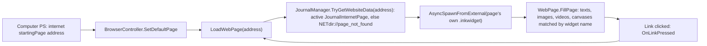
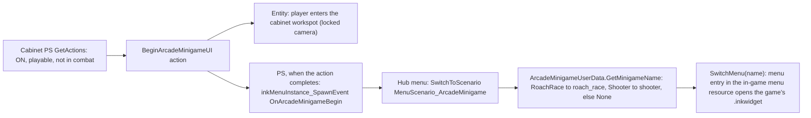

# Terminals, the in-game browser, messages and arcade cabinets

**Maturity: Draft.** How Cyberpunk 2077's computers and terminals render their screens, how the in-game browser finds and draws web pages, how mods add sites, shops, phone messages and devices without replacing the game's own content, and how arcade cabinets launch their built-in games. Consolidated on 26 September 2026 from the decompiled 2.31 script bundle (redscript-cli 0.5.31), installed mods read in place, their public source where it exists, one mod's world resources read as JSON outside the repository, and the source of ArchiveXL, Codeware and Red Hot Tools. Nothing here has been seen in a game session. Grades follow the [knowledge rules](README.md).

This page answers: *what can a mod add to terminals, the browser and arcade cabinets, how do the existing frameworks do it additively, and how could XF Studio author such content later?*

## Sources

| Source | Version studied | Used for |
|---|---|---|
| Game scripts (decompiled bundle) | 2.31 | Computer, terminal and browser controllers, journal types, arcade devices, minigames, menu scenarios |
| Browser Extension (Nexus 10038), by r457 and gh057 per its script headers | installed 0.9.7 | The site-registration API and the paginated home page |
| [Virtual Atelier](https://github.com/djkovrik/CP77Mods/tree/main/src/Virtual%20Atelier) (Nexus 2987), Virtual Atelier Delivery (21482), Virtual Car Dealer (4454) | installed 1.4.8, 1.0.10, 2.2.8; public source in djkovrik's GPL-3.0 `CP77Mods` repository, `729fc702` (Virtual Atelier's last change there `a3f511fe`, also 1.4.8) | Store registration, the virtual vendor, the computer tab, runtime phone messages, spawned devices, adverts |
| Virtual Atelier store mods: Lime Makeup Atelier (18322), Anrui's Netrunner Emporium (12328) | installed 1.1.0, 1.0.0 | What a store mod ships |
| High Resolution Garment Preview (21745) | installed 1.0.0 | Archive file list only |
| Urmland Street Arcade (23908) | installed 1.0.0 | `.xl` files; its sector and device resources read as JSON in a scratch folder |
| Gambling System: Pachinko (19889), by Boe6 per its Lua headers | installed 1.1.4 | The spot-addon format that Urmland Street Arcade uses |
| [ArchiveXL](https://github.com/psiberx/cp2077-archive-xl) | `v1.27.3` (`5474e34`) | Ink spawner, journal merging, resource patches |
| [Codeware](https://github.com/psiberx/cp2077-codeware) | `v1.20.4` (`613a1cb8`) | Script-built ink, popups, callback system, raw input, menu-resource imports |
| [Red Hot Tools](https://github.com/psiberx/cp2077-red-hot-tools) | `b4d3415` (after `v1.3.0-rc.2`) | Hot reload of scripts, tweaks and archives |

Installed-mod citations give paths inside each mod's folder in the mod manager (for MO2, `mods/<mod name>/`). Game-script citations are paths inside the decompiled bundle. Who made each mod and what it taught us is in the [community credits](../docs/community-credits.md).

## 1. The short answers

| Question | Answer | Grade |
|---|---|---|
| How does a computer draw its screen? | The device's world-widget component hosts an ink game controller (`ComputerInkGameController`), which spawns every part (mails, files, news, browser) from TweakDB widget records. The player zooms in and clicks with a cursor (§2). | [source] |
| How does the browser know what a page is? | A page is **journal data**: `JournalManager.TryGetWebsiteData(address)` returns a `JournalInternetPage`, which names its own `.inkwidget` and the texts, images and videos to fill into it (§3). | [source] |
| Can a mod add a site without replacing anything? | **Yes, three ways:** a `.journal` merged by ArchiveXL (data-only page); a Browser Extension listener that returns a script-built or mod-supplied widget for an address; or a new computer menu tab (§3.4). | [source] |
| How do Virtual Atelier stores plug in? | Each store mod adds one callback that receives the `VirtualShopRegistration` event and calls `AddStore(id, name, items, prices, atlas, icon, qualities, quantities)`. Items are ordinary TweakDB item records (§5). | [source] |
| Can a mod send V phone messages? | **Within pre-authored slots, yes:** Virtual Atelier Delivery ships a contact and conversation in a `.journal`, rewrites each message's text from script, and reactivates the entry to notify (§6.1). New journal entries cannot be created from script. | [source] |
| What else fits in a browser page or terminal? | Any ink UI with a script controller: lists, forms, popups, animations, game loops driven by delay callbacks. Codeware builds widgets entirely from script (§7). | [source]; performance limits [hypothesis] |
| How does an arcade cabinet start its game? | The device's Play action queues `OnArcadeMinigameBegin`, the menu system switches to `MenuScenario_ArcadeMinigame`, and a script switch turns the cabinet's `ArcadeMinigame` value into a menu name (`roach_race` or `shooter`). Only Roach Race and the shooter are playable (§8). | [source] |
| Can a new arcade game be registered additively? | **Probably, by script:** wrap the name switch and the playable check for tagged cabinets, and show a pure-script ink game. The minigame engine and the `ArcadeMinigame` enum are native and closed (§8.4). | [source] limits; route [hypothesis] |
| What does Urmland Street Arcade add? | A small World Builder location in Little China: vanilla arcade, pachinko, vending and TV devices placed as a new streaming block, three vanilla nodes deleted where it stands, plus three pachinko betting spots for the Gambling System mod (§8.5). | [resource] |

## 2. Computers and terminals

### 2.1 Entities, state and screens

- **Classes:** `Computer extends Terminal extends InteractiveMasterDevice extends InteractiveDevice extends Device` [source] `cyberpunk/devices/masters/computer.script:53`, `terminal.script:2`. The terminal requests its screen as the component `terminalui` (`worlduiWidgetComponent`) [source] `terminal.script:11`.
- **Persistent state:** `ComputerControllerPS` holds a persistent `ComputerSetup` [source] `computerController.script:49-68`. It carries the starting menu, one enable flag per menu (mails, files, system, internet, news feed), a style preset, the mail and file folders (`[GenericDataContent]`), a news feed, and `m_internetSubnet`, whose only field is the browser's `startingPage` address [source] `orphans.script:36131-36188, 44150-44153`.
- **Screen binding:** a device's `SUIScreenDefinition` pairs two TweakDB ids, a `DevicesUIDefinitions` screen (with ratio, content ratio and library path) and a `DevicesUIStyles` style [source] `orphans.script:33261-33274, 15427-15438`. A world node's component can override it; otherwise the entity default applies, `DevicesUIDefinitions.Computer_21x9` for computers [source] `core/deviceBase.script:887-896`, `computer.script:325-332`.

### 2.2 How the screen is built

- `ComputerInkGameController` spawns the layout record `DevicesUIDefinitions.ComputerLayoutWidget`, then each part from its own record: screensaver, wallpaper, `MenuMailsWidget`, `MenuFilesWidget`, `MenuNewsFeedWidget`, `MenuMainWidget` and `InternetBrowserWidget` [source] `UI/computer/computerGameController.script:63-114`, `computerMainLayoutController.script:100-338`.
- **Library lookup:** widget requests try library ids `LibraryID[_style][_ratio]`, most specific first, in the record's local and external libraries [source] `core/deviceGameControllerBase.script:144-199`, `core/ui/baseControllers/widgetController.script:93-200`.
- **Navigation is local to the UI.** Menu buttons carry a `widgetName` (`mails`, `files`, `devices`, `newsFeed`, `mainMenu`, `internet`), and `ShowMenuByName` dispatches on it. There are no device actions for opening mail or the browser; data requests go UI → entity event → PS → blackboard → UI [source] `computerGameController.script:201-226, 391-416, 705-710`, `computer.script:225-233`, `computerController.script:416-423`.

### 2.3 Input

- **Camera zoom, not a menu.** Examining a computer pushes the `DeviceZoom` game context, registers the device as an input listener and sets `IsUIZoomDevice`. The player aims a cursor at the world widget and clicks; every handler tests `IsAction(n"click")`. The hints are `click`, `right_stick_y` and `UI_Exit` [source] `core/deviceBase.script:1266-1375`, `core/scriptableDeviceBasePS.script:1563-1566, 4264-4273`. The cursor mechanics are native [hypothesis].
- **Other device screens** use the same pattern: the drop point's sell screen and the vending terminal each host a `DeviceInkGameControllerBase` on a `ui` component [source] `UI/drop_point_terminal/dropPointTerminalGameController.script:2`, `vendingMachines/vendingTerminal.script:12, 116-122`.

## 3. The in-game browser

### 3.1 Pages are journal entries

- `BrowserController.LoadWebPage` asks the journal for the address and spawns the page's `GetWidgetPath()` library asynchronously into the page root [source] `UI/internet/browserController.script:109-156`.
- `JournalInternetPage` is `importonly`: address, widget path, scale, facts to set, and lists of texts, rectangles, images, videos and canvases [source] `orphans.script:44172-44195`. `JournalInternetSite` gives the short name, icon atlas and part, and whether the desktop ignores it [source] `orphans.script:44224-44233`.
- **Filling:** `WebPage.FillPageFromJournal` matches each journal element's name against the widgets in the page controller's lists and sets text and tint, atlas and part, video path, or visibility [source] `browserController.script:265-273, 396-499`. Links call back through `OnLinkPressed`, and the controller loads the clicked address [source] `browserController.script:125-128, 501-538`.
- **The home page** `NETdir://ncity.pub` is filled from script: all active sites from `JournalManager.GetInternetSites`, into slots named `TextLink01…` and `ImageLink01…` [source] `browserController.script:277-370`. Browser Extension's notes say the home-page widget has 10 such slots [source] Browser Extension `browserController.overrides.reds:3-12`.
- **Pages can carry their own game controllers,** as the Yaiba showroom and the vehicle shop do [source] `UI/internet/YaibaShowroom.script:2`, `vehicleShopGameController.script:2`.

### 3.2 Mails, files and news

- A mail or file is a `DataElement`: journal path, or inline owner, date, title and content strings, video path, and persistent `isEncrypted`, `wasRead` and `isEnabled` [source] `orphans.script:36257-36296`. The PS reads the `JournalEmail`/`JournalFile` entry first and falls back to the inline strings; a document is valid with either a journal path or a title [source] `computerController.script:499-551, 813-815`.
- **Adding mail at run time:** the PS API only enables, disables, encrypts or decrypts existing slots [source] `computerController.script:900-1032`. Pushing a new `DataElement` into `m_mailsStructure` from an added method, then refreshing the thumbnails, may work; whether script can build that native struct and whether the change survives a save is untested [hypothesis].

### 3.3 Messages on the phone

The journal types for contacts, conversations and messages are `importonly` with getters only, and `JournalManager` offers reads and `ChangeEntryState` but no way to create entries [source] `orphans.script:32999-33113`, `core/systems/journalManager.script:62-98`. New threads must come from a `.journal` resource; §6.1 shows how a mod still makes their text dynamic.

### 3.4 Three additive ways to add a site

| Route | What the mod ships | Strengths | Limits | Grade |
|---|---|---|---|---|
| **Journal site** | A `.journal` with a site and pages, listed under `journal:` in an `.xl`, plus the page `.inkwidget`s. ArchiveXL merges the entries into the game's journal tree at start-up. | No script. The vanilla loader, links and home page handle it. | Content is static data filled by widget name; interactivity needs script anyway. The home page's slot count caps what it lists. | [source] ArchiveXL `src/App/Extensions/Journal/Extension.cpp:58-135, 383-460`; home-page listing [hypothesis] |
| **Browser Extension listener** | A `BrowserEventsListener` subclass that names an address and icon and returns a widget for any address under it (§4). | Pages are ordinary ink with a script controller. The paginated home page lists every registered site. | Requires Browser Extension, RED4ext, redscript and Codeware. | [source] |
| **Computer menu tab** | Wraps `ComputerControllerPS.GetMenuButtonWidgets` to append a tab, `ShowMenuByName`/`HideMenuByName` to handle it, and fills the browser area when it opens. Virtual Atelier and Virtual Car Dealer use this when Browser Extension is absent. | A first-class app beside Mails and Files. | Several mods wrapping the same functions must each call the wrapped method; tab-icon handling is a hack both mods credit to NexusGuy999. | [source] Virtual Atelier `SetupNewTab.reds:18-111` |

## 4. Browser Extension

- **Registry:** a `ScriptableSystem`, `BrowserExtension.System.BrowserExtensionSystem`, keeps listeners, a block list of addresses, and a config (enabled, show all journal sites, AutoFixer and EZEstates first) exposed through Mod Settings when installed [source] `BrowserExtension.System.reds:9-110`, `BrowserExtension.Config.reds`, `ModSettingsConditional.reds`.
- **A site is a listener.** `BrowserEventsListener.Init(BrowserGameController)` registers itself for that one browser instance and fills `CustomInternetSite {address, shortName, iconAtlasPath, iconTexturePart}`; `GetWebPage(address)` returns an `inkCompoundWidget` [source] `BrowserExtension.Classes.reds:8-52`, `BrowserExtension.DataStructures.reds`. Consumer mods create their listener by wrapping `BrowserGameController.OnInitialize` and release it in `OnUninitialize` [source] Virtual Atelier `SetupNewSite.reds:40-56`.
- **Loading:** a wrap on `BrowserController.LoadWebPage` asks the registry first. The first listener whose address is a **prefix** of the requested one supplies the widget, which is reparented into the page root; otherwise the vanilla journal path runs [source] `BrowserExtension.System.reds:70-78`, `browserController.overrides.reds:222-262`. Because custom sites are asked first, a listener could shadow a vanilla address; XF content must not.
- **Home page:** `FillCustomHomePage` merges custom sites, the home page's own journal links and (optionally) every active journal site, de-duplicated by address, and shows 10 per page. `UI_MoveUp`/`UI_MoveDown` (usually the mouse wheel) page through them through a player input listener [source] `browserController.overrides.reds:266-507`, `HomePagePagination.reds:7-34`.
- **Public calls added to `BrowserGameController`:** `LoadPageByAddress`, `LoadHomePage`, `RefreshHomePage`, `IsHomePage`, `GetCustomSites`, `GetBlockedSites` [source] `browserController.overrides.reds:14-90`. It steps aside during the Corpo prologue and the Phantom Liberty epilogue [source] `BrowserExtension.System.reds:80-96`.
- **The widget can come from anywhere.** Virtual Atelier returns `SpawnFromExternal(root, r"base\gameplay\gui\virtual_atelier_stores.inkwidget", n"AtelierStores:VirtualAtelier.UI.AtelierStoresListController")` [source] `SetupNewSite.reds:22-29`. The `item:Controller` form is ArchiveXL's ink-spawner extension: it adds the external library to the spawning library and attaches the named script controller class to the spawned root [source] ArchiveXL `src/App/Extensions/InkSpawner/Extension.cpp:53-67, 126-180`. Browser Extension itself builds its page counter with `new inkCanvas()` and `new inkText()` [source] `browserController.overrides.reds:470-497`.

## 5. Virtual Atelier and store mods

- **Registration is an event.** When the hub menu opens, `VirtualAtelierStoresManager.BuildStoresList` clears the list and queues a `VirtualShopRegistration` event on the UI system [source] `core/systems/VirtualAtelierStoresSystem.reds:52-58, 177-181`. Each store mod adds one callback method to `gameuiInGameMenuGameController` whose parameter is that event, and calls `AddStore` [source] Lime Makeup Atelier `r6/scripts/LIMEMAKEUPATELIER-atelier-store.reds`; Anrui's Netrunner Emporium `r6/scripts/Anrui_ANE-atelier-store.reds`. The event reaches every such method by its parameter type, so any number of stores coexist.
- **`AddStore(storeID, storeName, items, prices, atlasResource, texturePart, opt qualities, opt quantities)`**: items are TweakDB item record names (`"Items.…"`); shorter price or quality arrays fall back to their first value [source] `core/Classes.reds:12-30`, `virtual-store/VirtualStoreController.reds:792-819`. A store mod ships only this script and an `.inkatlas` icon; its items come from its own or another mod's TweakXL records [resource] Lime Makeup Atelier and Anrui archives.
- **Categories** are derived from the first and last item's type (clothes, weapons, cyberware, consumables, other) [source] `VirtualAtelierStoresSystem.reds:60-80, 150-181`. **Bookmarks** and the "new" badge persist in the save through `persistent` fields [source] `VirtualAtelierStoresSystem.reds:10-11`.
- **The shop is the vanilla vendor screen, repurposed.** Clicking a store calls `UISystem.RequestVendorMenu` with vendor id `"VirtualVendor"`; a wrap on `FullscreenVendorGameController.OnInitialize` clears the screen and spawns Atelier's own widget and controller when it sees that id [source] `stores-list/AtelierStoresListController.reds:156-182`, `virtual-store/HijackVendorController.reds:5-19`, `vendor-preview/FullscreenVendor.reds:185-187`. Large stock lists use virtualised item lists (`ScriptableDataView`, virtual item controllers) [source] `virtual-store/VirtualStoreDataView.reds`.
- **Safe zones only** for the computer tab [source] `SetupNewTab.reds:48-67`. Pad and keyboard get different action bindings, picked from `PlayerLastUsedPad()` [source] `core/AtelierActions.reds:15-40`.
- **High Resolution Garment Preview** ships only same-path replacements of `base\gameplay\gui\widgets\notifications\garments_preview.ent` and `garments_preview.dtex` [resource] archive list. That the `.dtex` sets the garment-preview render resolution is [hypothesis]. It is a replacement, not an addition.

## 6. Beyond the browser: Delivery and Car Dealer

### 6.1 Virtual Atelier Delivery

- **Phone messages from script.** The mod ships a contact with a conversation of pre-authored message slots in `djkovrik\atelier\delivery.journal`, merged by ArchiveXL [resource] `VirtualAtelierDelivery.archive.xl`. At run time a scriptable system loads that journal resource through Codeware's resource depot, keeps the conversation, writes each slot's `text` from its persistent history, and toggles the last message inactive then active with `JournalNotifyOption.Notify` to raise the notification [source] `VirtualAtelierDelivery.reds:1887-1995`. It also wraps the messenger to mark the thread unread [source] `VirtualAtelierDelivery.reds:1857-1885`. The number of slots caps the visible history.
- **Spawned devices with their own actions.** Drop points are spawned with Codeware's `DynamicEntitySystem` (`persistSpawn`, `alwaysSpawned`, tags) from a mod `.ent`; a wrap on `DropPointControllerPS.GetActions` adds a new device action (`OpenVaDeliveryUI extends ActionBool`) only for those tagged entities, with a TweakXL interaction choice [source] `VirtualAtelierDelivery.reds:596-921, 2020-2070`; [resource] `r6/tweaks/VirtualAtelierDelivery/DropPointAction.yaml`.
- **Popups and components built in script** with Codeware's `InMenuPopup`, `inkComponent` and `CustomButton` [source] `VirtualAtelierDelivery.reds:2088-2600`. World-map pins and tooltips are extended by wraps [source] `VirtualAtelierDelivery.reds:3439-3589`.
- **Billboards:** TweakXL `gamedataAdvertisement_Record`s point at the mod's advert `.inkwidget`s and are appended to every district's advertisement list [resource] `r6/tweaks/VirtualAtelierDelivery/NewAdvert.yaml`.
- **Not purely additive:** it deletes a few world nodes where drop points stand and ships a same-path vanilla van `.ent` [resource] `.xl` and `VirtualAtelierDeliveryColumbus.archive` list.

### 6.2 Virtual Car Dealer

- Registers `NETdir://cyber.car` as a Browser Extension site, or a computer tab without it, with its own `.inkwidget` and a controller that extends `inkGameController` [source] `overrides/SetupNewSite.reds`, `overrides/SetupNewTab.reds`, `content/CarDealerContentController.reds:9`.
- Sets vehicle prices at TweakDB load with Codeware's `ScriptableTweak` and `TweakDBManager.SetFlat` [source] `core/CarDealer-ScriptableTweak.reds:1-60`.

## 7. What is possible inside a page or terminal

| Capability | Mechanism | Evidence | Grade |
|---|---|---|---|
| Custom layout from a resource | An `.inkwidget` spawned with ArchiveXL's `item:Controller` form | Virtual Atelier, Car Dealer | [source] |
| Custom layout with no resource | Widgets created in script (`new inkText()`, Codeware `inkComponent`) | Browser Extension, Delivery | [source] |
| Animation | `.inkanim` libraries (Delivery ships two); `inkAnimProxy` callbacks | Delivery archive list; `orphans.script:31502-31536` | [resource] [source] |
| Game loop | `DelaySystem.DelayCallback` / `DelayCallbackNextFrame` from script; `onUpdate` every frame in CET | `orphans.script:11818-11826`; Delivery; Pachinko `init.lua` | [source] |
| Pointer input | `RegisterToCallback(n"OnRelease", …)` with `IsAction(n"click")` | Every game page | [source] |
| Keys and pad buttons | A player input listener receiving `ListenerAction`s (Browser Extension); Codeware's `Input/Key` and `Input/Axis` raw events | `HomePagePagination.reds`; Codeware `src/App/Callback/Controllers/RawInputHook.hpp:18-119` | [source] |
| Persistence in the save | `persistent` fields on a `ScriptableSystem` | Atelier bookmarks, Delivery orders | [source] |
| Settings | Mod Settings attributes; CET Native Settings | Browser Extension; Pachinko | [source] |
| Messages | Journal slots rewritten from script (§6.1) | Delivery | [source] |
| New world devices | Codeware dynamic entities or a World Builder block, plus wrapped `GetActions` | Delivery; Urmland | [source] [resource] |
| Opening another game screen | Menu scenarios and hub events, for example the vendor screen or the character creator ([photo mode §3](photo-mode.md#3-opening-confirming-and-leaving-the-character-creator)) | Atelier; Character Customization Anywhere | [source] |

**Limits.**

- **Input:** in camera-zoom mode the player has a cursor and `click`; typing needs raw key events or Codeware's text input widgets [source] Codeware `scripts/UI/TextInput`. Controller play works through mapped actions, but a cursor-driven page is clumsy on a pad [hypothesis]. A fullscreen popup avoids the world-widget cursor entirely [hypothesis].
- **Performance:** redscript runs in the game's script VM. Menus and turn-based games fit; per-frame physics for many objects is untested [hypothesis]. Large lists should be virtualised as Atelier's are [source]. A world widget re-renders to a texture on the device screen [hypothesis].
- **Compatibility:** every page mod wraps the same few browser functions. A wrap that forgets `wrappedMethod()` breaks all the others, and a redscript compile error stops every mod's scripts ([runtime access §2](runtime-access.md#2-rules-learned-the-hard-way-from-source)).

## 8. Arcade cabinets

### 8.1 The device

- `ArcadeMachine extends InteractiveDevice`, with `ArcadeMachineController`/`ArcadeMachineControllerPS`; pachinko subclasses all three [source] `cyberpunk/devices/arcadeMachines/arcadeMachine.script:2`, `arcadeMachineController.script:2-17`, `pachinkoMachine.script:2`.
- Two **native** enums: `ArcadeMinigame {Quadracer, RoachRace, Shooter, Tank, Retros, INVALID}` and `ArcadeMachineType {Default, Pachinko}` [source] `orphans.script:9361-9373`.
- **Which game a cabinet runs** is decided on every attach, not saved (the PS field is not `persistent`) [source] `arcadeMachineController.script:16-17`, `arcadeMachine.script:37-40`. `SetupMinigame` uses the entity's `m_minigame` if set; otherwise it matches the PS's `m_gameVideosPaths` choice against hard-coded `.bk2` paths (`retros.bk2` counts as the shooter); with no video it rolls at random. It then sets the attract video, music events and mesh appearance `ap1`…`ap4` [source] `arcadeMachine.script:202-272`, `arcadeMachineController.script:119-136`.
- **The attract screen** is `ArcadeMachineInkGameController`, which loops that video in an `inkVideo` [source] `cyberpunk/devices/UI/arcadeMachine/arcadeMachineGameController.script:2-108`.

### 8.2 Launching the game

- `IsPlayable()` is true only for Roach Race and the shooter, so Quadracer and Tank cabinets show the attract video without a Play prompt [source] `arcadeMachineController.script:28-54`.
- The action's completion queues the menu event; the scenario's switch picks the menu name [source] `arcadeMachineController.script:67-85`, `cyberpunk/UI/fullscreen/ingame/inGameScenarios.script:114-116`, `arcadeMinigameScenario.script:1-36`. The name-to-widget mapping lives in the menu resource, which scripts never name [hypothesis].
- The scenario ignores Back; `OnArcadeMinigameEnd` returns to idle, and the hub controller's `OnArcadeMinigameEvent` is probably called natively when a game ends [source] `arcadeMinigameScenario.script:9-15`, `inGameMenuGameController.script:337-343`; the native call [hypothesis].

### 8.3 The minigames

- Roach Race and QuadRacer run on the native `MinigameController`/`MinigameLogicController` pair, Panzer on `MinigameControllerAdvanced`, and the shooter is native throughout, configured by TweakDB `Shooter*` records. The native engine sends state updates; script only reacts (HUD, lives, laps, collisions) [source] `cyberpunk/UI/miniGames/sideScrollerMiniGameController.script:2-16`, `roachRace/roachRaceController.script:17-37`, `orphans.script:16110-16141, 55017-55147`.
- In-game controls are native; script handles menu clicks only [source] `roachRace/roachRaceGameController.script:35-74`, `roachRacePlayer.script:28-44`.
- High scores live in memory in `SideScrollerMiniGameScoreSystem`, which knows three game names [source] `sideScrollerScoreSystem.script:4-17`.
- **Pachinko machines have no game:** music, a screen and a distraction quickhack [source] `pachinkoMachine.script:16-52`, `pachinkoMachineController.script:15-25`.

### 8.4 Registering a new game

The built-ins stay untouched if a mod:

1. **Tags its cabinets** without reusing the enum's meaning: a custom attract video path in the cabinet's instance data, or a device-id set in a scriptable system [hypothesis].
2. **Wraps** `ArcadeMachineControllerPS.GetActions` (or `IsPlayable`) so tagged cabinets offer Play, and `ArcadeMinigameUserData.GetMinigameName` so they return the mod's menu name [source] for the functions; route [hypothesis].
3. **Adds a menu entry.** Codeware imports `inkMenuResource.menusEntries` (`name`, `menuWidget`, `depth`, `spawnMode`, `inputContext`) and raises `Resource/PostLoad`, so a script could append an entry when the menu resource loads [source] Codeware `scripts/Base/Imports/inkMenuResource.reds`, `inkMenuEntry.reds`, `src/App/Callback/Controllers/ResourcePostLoadHook.hpp:16`. ArchiveXL's resource patches cover device, appearance and ink-animation resources but not menu resources [source] ArchiveXL `src/App/Extensions/ResourcePatch/Extension.cpp:223-241`. Whether an appended entry opens is [hypothesis]. The simpler fallback is to skip the scenario and open a Codeware in-game popup, or draw the game on the cabinet's own screen [hypothesis].
4. **Writes the game in script:** an `inkGameController` with its own loop (delay callbacks) and input (§7). The native minigame engine only drives its built-in types [hypothesis].
5. **Ends cleanly:** fires the scenario's end event and releases the workspot [hypothesis].

### 8.5 Urmland Street Arcade

- `urmland_street_arcade.xl` adds the streaming block `urmland_street_arcade/all.streamingblock` and patches its `custom_devices.devices` into `03_night_city.devices` with ArchiveXL [resource] `.xl`. The separate `Urmland_street_arcade_removal.xl` deletes a door, a neon sign with its light, and a decal from three vanilla sectors, each checked against the sector's expected node count [resource].
- The sector holds 157 nodes: meshes, decals, collisions, lights, sound, a community area, and ten device nodes: four vanilla `arcade_machine_1.ent` cabinets (appearances `arcade_machine_1`…`4`), three `pachinko_machine.ent`, a vending machine, a TV and a door. Each cabinet's instance data only restates a default world-widget component, so the cabinets pick their games the vanilla way (§8.1) [resource]. Its `.devices` file registers only the TV's `TVControllerPS` [resource].
- The CET addon JSON adds three `"type": "arcade"` spots at the pachinko machines to the Gambling System's pachinko mod, which reads every JSON file in its `addons/` folder and offers a bet interaction at each spot with a random payout [resource] `…/gambling-system-pachinko/addons/Urmland_Street_Arcade.json`; [source] Pachinko `init.lua`, `JsonData.lua`. Its code carries a no-reuse notice; only the data format is described here.
- So the arcade adds **places and props**, not new games.

## 9. How XF Studio could author this later

Nothing below is built or decided; it records options for discussion.

### 9.1 A terminal-app or arcade feature module

- **Outputs:** redscript (a site listener or tab, a controller, a scriptable system), optional `.inkwidget`/`.inkatlas` resources, TweakXL records (items, interaction choices, adverts), and an `.xl` declaring journals, localisation and world additions. XF branding applies by default (for example a site called "XF …").
- **Avoid binary ink authoring at first.** Script-built widgets (Codeware) need no `.inkwidget`, so the first version could emit only text files (redscript, YAML, `.xl`) plus icon atlases [hypothesis]. `.journal` and `.inkwidget` writers would come later.
- **Data-driven runtime.** One versioned XF runtime mod could interpret app definitions (screens, widgets, bindings, a small state machine) exported as data, rather than generating new redscript per app. That matches the project's data-driven principle and lets a preview swap data without recompiling scripts [hypothesis].
- **Reading installed content:** Atelier stores exist only as script calls, so the Studio cannot read them the way the game does offline. A bridge query of `VirtualAtelierStoresManager.GetStores()` could list them at run time [hypothesis].

### 9.2 Live preview through the bridge

- Red Hot Tools exposes `ReloadScripts`, `ReloadTweaks`, `ReloadArchives` and `HotInstall(path)` to scripts [source] Red Hot Tools `src/App/Facade.hpp:9-40`. It does not reinitialise struct fields or register new scriptable-system request handlers until the session reloads [source] Red Hot Tools `README.md`.
- A bridge command could reload the app's data or scripts, then open it: on a computer through Browser Extension's `LoadPageByAddress`, or in a popup without a device [hypothesis]. Captures would use the bridge's existing capture path ([runtime access §5](runtime-access.md#5-phase-2-commands-writes-and-captures)).
- A quick HTML approximation inside the Studio could cover layout iteration between game checks [hypothesis].

### 9.3 Scripting in TypeScript

| Option | How | Feasibility | Risks | Grade |
|---|---|---|---|---|
| **A. TypeScript to redscript** | Compile a TypeScript subset to `.reds`; generate type declarations from the RTTI dump and the decompiled bundle | Medium: redscript is statically typed and class-based, but has no closures, generics beyond arrays, or exceptions, so only a subset maps | Semantic mismatch; a compile error blocks all mods' scripts, so output must lint cleanly (`redscript-cli` is in the toolchain) | [hypothesis] |
| **B. TypeScript to Lua for CET** | TypeScriptToLua has a LuaJIT target ([docs](https://typescripttolua.github.io/docs/configuration)); CET can call script-visible classes and observe methods | High for logic; needs CET typings | Depends on CET; CET's sandbox has no network and confines files ([runtime access §2](runtime-access.md#2-rules-learned-the-hard-way-from-source)); ink callbacks need a script object, which Lua may not provide | [hypothesis] |
| **C. A JavaScript engine in game** | Embed a small engine in an XF RED4ext plugin that calls RTTI the way CET does | Low: effectively a new CET | Crash surface, maintenance on every game patch, security | [hypothesis] |
| **D. Scripts in the Studio driving the game** | TypeScript in the Studio calls bridge commands | High for tests, tooling and previews | Not shippable: players would need the Studio running | [hypothesis] |
| **E. Declarative apps plus a fixed runtime** | TypeScript (or a visual editor) authors app data and small logic compiled to data that the XF runtime interprets (§9.1) | Medium; best fit for live preview and the data-driven rule | Interpreter speed in the script VM; limited expressiveness | [hypothesis] |

A plausible path is E for shipped content, D for development, and A later for escape hatches. Choosing is the maintainer's decision.

## Open questions

1. Does a journal-only site (ArchiveXL `journal:`) appear on the vanilla home page, and how many sites fit before the slots run out?
2. Can script construct a `DataElement` and add a mail to a computer, and does it persist?
3. Does appending an `inkMenuEntry` at `Resource/PostLoad` open a custom arcade game through `MenuScenario_ArcadeMinigame`? Which resource holds the in-game menus?
4. What ends the arcade scenario natively, and how does a script game release the workspot?
5. What frame budget can a script-driven ink game sustain on a world widget versus a fullscreen popup?
6. Can CET Lua register ink callbacks without a redscript helper class?
7. Does the vanilla `arcade_machine_1.ent` preset `m_gameVideosPaths` per appearance, which would decide the Urmland cabinets' games?

## Related pages

[Runtime access](runtime-access.md) · [Photo mode and the creator from script](photo-mode.md) · [Mod loading](mod-loading.md) · [World and interactive ideas](../research/backlog/world-and-interactive-ideas.md) · [Feature-module platform](../research/authoring/feature-module-platform.md)
