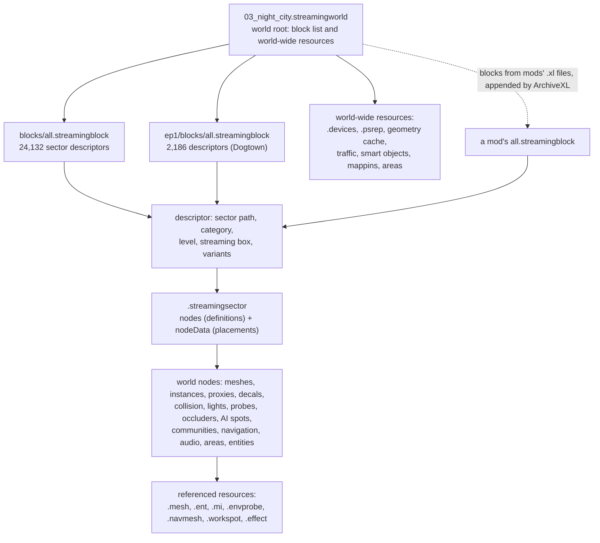
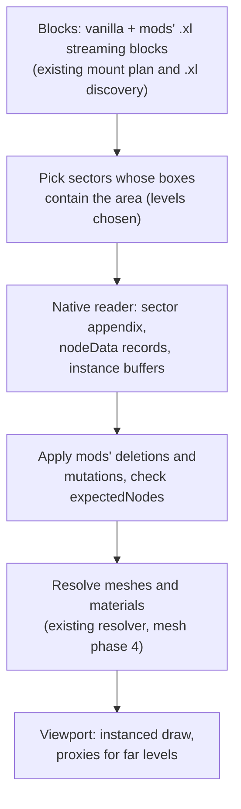

# The game world, streaming and location mods

**Maturity: Draft.** How Cyberpunk 2077 stores Night City in files and streams it, the additive ways mods add, remove and change world content, and what XF Studio would need to show a location offline and author additions later. Consolidated on 26 September 2026 from game 2.31 (with Phantom Liberty) read offline with XF Studio's native reader and WolvenKit CLI 9.0.1, the source of ArchiveXL, Codeware, World Builder, Appearance Menu Mod and WolvenKit, the Modding Docs, and installed location mods read in place. Nothing here has been seen in a game session. Grades follow the [knowledge rules](README.md).

This page answers: *how is the world organised in files, how do location mods change it without replacing each other, and what would loading, drawing and authoring a location take?*

## Sources

| Source | Version studied | Used for |
|---|---|---|
| Game archives `basegame_3_nightcity*`, `ep1_1_nightcity*`, `basegame_4_gamedata`, `ep1_2_gamedata` | 2.31 | Streaming world, blocks and sectors: sizes, counts, node classes (§1) |
| WolvenKit ([GitHub](https://github.com/WolvenKit/WolvenKit), GPL-3.0) | source `11720772`, CLI 9.0.1 | Sector, node-data and instance-transform layouts (documentation only); name lists and JSON conversions as the oracle |
| [ArchiveXL](https://github.com/psiberx/cp2077-archive-xl) (MIT) | `v1.27.3` (`5474e34d`) | `streaming:` blocks, sector deletions and mutations, resource patches, quest phases (§2.1–2.4) |
| [Codeware](https://github.com/psiberx/cp2077-codeware) (MIT) | `v1.20.4` (`613a1cb8`) | Entity spawning, world-state and node access from script (§2.6) |
| [Red Hot Tools](https://github.com/psiberx/cp2077-red-hot-tools) (MIT) | `b4d34152` | World inspector, node registry, streaming override, archive hot reload (§2.6, §3.3) |
| RED4ext.SDK (MIT) and the RTTI dump in `red-dump-json` | `ad772771`; `a8e52990` | World class layouts; the 122 `worldNode` subclasses |
| [World Builder](https://github.com/justarandomguyintheinternet/CP77_entSpawner) (Nexus 20660), by keanuWheeze | source `d9680f4d` (1.0.81 + 4); installed 1.0.7 | Authoring model, export format and in-game preview (§2.5). The repository has no licence file; its `init.lua` notice forbids reuse of its code without credit or permission, so only its data formats are described here |
| [Appearance Menu Mod](https://github.com/MaximiliumM/appearancemenumod) | `1.8.4-167-g5427235` (no licence file; techniques only) | Spawning, decor presets and teleports (§2.6) |
| Cyberpunk 2077 Modding Wiki (local clone) | `be2f44eed841` | Sector, block, variant, node-ref, removal, community and World Builder pages and their screenshots |
| Location mods in the reference mod list (§2.8) | as installed | Worked examples; `.xl` files read in place, sector class tables read with the native reader |

Installed-mod citations give paths inside each mod's folder in the mod manager (for MO2, `mods/<mod name>/`). Wiki citations are paths inside the Modding Docs repository. Who made each mod and what it taught us is in the [community credits](../docs/community-credits.md).

## 1. How the world is organised



### 1.1 The world root

The world is one `worldStreamingWorld` resource, `base\worlds\03_night_city\_compiled\default\03_night_city.streamingworld` (3.5 KB) [resource]. It lists the streaming blocks (`blockRefs`: the main block and the Phantom Liberty block) and the world-wide resources: `.devices` and `03_night_city_init.devices`, the persistent-state replica `.psrep`, the collision geometry cache (`03_night_city.geometry_cache`), eight traffic resources, `all.smartobjects`, `.mappins` and `.poimappins`, `.areas`, `.location`, `.loot`, `.locopaths`, `.streamingquerydata`, the auto-foliage mapping and the master environment (`cp2077_master_env_ep1_v006.env`). Its bounding box spans about 33 km by 100 km by 100 km [resource]. Mods never edit this file; ArchiveXL registers extra blocks beside it (§2.1).

### 1.2 Streaming blocks

A block is a `worldStreamingBlock`: an array of `worldStreamingSectorDescriptor`s, each naming one sector file with its `category`, `level`, `streamingBox` (an axis-aligned box in world metres), `numNodeRanges` and `variants` [resource] [wiki] `.../the-whole-world-.streamingsector/.streamingblock-sector-definitions-and-variants.md`.

| Block (effective copy) | Descriptors | Size |
|---|---|---|
| `blocks\all.streamingblock` | 24,132 | 9.7 MB raw, 0.76 MB stored |
| `ep1\blocks\all.streamingblock` | 2,186 | 2.0 MB raw |

Both paths exist in `basegame_3_nightcity.archive` **and** in `ep1_1_nightcity.archive`. The Phantom Liberty copies are larger (the base archive's Phantom Liberty block is a 1.5 KB stub), and the `ep1` mount group comes before `content` ([mod loading §1](mod-loading.md#1-the-stages-in-order)), so owners of the expansion stream the `ep1` copies [resource]; which copy a game without the expansion uses is [hypothesis]. The same holds for the `always_loaded_*` sectors. The two blocks together hold 26,318 sectors, matching the wiki's "more than 26,300" [resource] [wiki].

Descriptors by category and level in the main block (the Phantom Liberty block has the same pattern at a tenth of the scale) [resource]:

| Category | Level | Sectors | Streaming box width (median, m) |
|---|---|---|---|
| Exterior | 0 | 6,623 | 282 |
| Exterior | 1 | 6,483 | 507 |
| Exterior | 2 | 1,403 | 1,099 |
| Exterior | 3 | 517 | 2,236 |
| Exterior | 4 | 278 | 3,282 |
| Exterior | 5–6 | 58 | 8,369–38,064 |
| Interior | 0–4 | 2,517 | 138 (L0) to 1,024 (L4) |
| Navigation | 3 | 3,846 | 712 |
| Quest | 0 | 2,404 | unbounded (float max) |
| AlwaysLoaded | 0 | 3 | unbounded |

- **Levels are distance bands.** Level 0 holds nearby detail with small boxes; each level up covers a wider area with coarser content, and levels 5–6 hold city-scale proxies [resource] (box sizes; node classes in §1.4). The wiki's grid-size table is marked legacy by its authors [wiki] `.../the-whole-world-.streamingsector/README.md` §Theory.
- **Quest and AlwaysLoaded sectors have unbounded boxes**, so distance does not stream them; quest sectors are instead gated by their variants and quest prefab references [resource] (boxes); the gating mechanism [hypothesis]. A quest sector's own file says level 255 where its descriptor says 0 [resource].
- **Variants** switch ranges of a sector's nodes. 4,224 main-block sectors have variants (14,815 in total, at most 138 on one sector); Phantom Liberty's block has 5,963 on 833 sectors. A variant has a name, a node ref, `rangeIndex` (never 0, the always-on default range), `enabledByDefault` and a `variantId` [resource] [wiki] `.../switching-between-sector-states.md` (its `world_streamingsector__resume.png` diagram links a descriptor's variant to the sector's `variantIndices`). Quest phases and `WorldStateSystem.TogglePrefabVariant` switch them [wiki] `object-spawner/features-and-guides/creating-sector-variants.md`.
- **A location is spread over many sectors.** The sectors are generated from a larger editor dataset with arbitrary cut-offs, one set per level [wiki] `.../the-whole-world-.streamingsector/README.md`. At one sample point in Watson (-1200, 1562, 22, a point the wiki uses), 251 exterior, interior and navigation sectors have boxes that contain it: 29 exterior L0, 33 L1, 33 L2, 29 L3, 30 L4, 63 L5–L6, 33 interior and 1 navigation [resource].

### 1.3 Sector files

A sector is a `worldStreamingSector` CR2W resource with a few ordinary properties (`category`, `level`, inplace-resource references) followed by **class-specific data after the property terminator**, which is why the native reader does not read sectors yet (it refuses trailing data it does not know, [archive format §3](archive-format.md#3-cr2w-resources)) [resource]. The trailing block, as WolvenKit reads it [source] WolvenKit `Types/ClassesExt/Appendix/worldStreamingSector.cs`; layout confirmed on the sample sectors [resource]:

| Field | Encoding |
|---|---|
| version | i32 (62 in 2.31) |
| size | i32 |
| `nodeData` | `DataBuffer` reference (a CR2W buffer) |
| `nodes` | variable-length count, then `handle:worldNode` export indexes |
| `nodeRefs` | variable-length count, then node-ref strings |
| `variantIndices` | variable-length count, then i32 |
| `persistentNodeIndex` | i32 |

- **`nodes` are definitions, `nodeData` are placements.** Each node is its own CR2W export (a `worldStaticMeshNode` with `mesh`, `meshAppearance`, shadow flags, `forceAutoHideDistance`…). Each `nodeData` record places one node. The record is a fixed **144 bytes**, the same layout the engine keeps in memory as `CompiledNodeInstanceSetupInfo` [source] ArchiveXL `src/Red/StreamingSector.hpp:7-30`; WolvenKit `Archive/IO/worldNodeDataReader.cs` reads the same fields under older names. The size is confirmed on sectors with 214, 275 and 99 records whose buffers are exactly 144 bytes per record [resource].

  | Offset | Field (ArchiveXL name; WolvenKit name) |
  |---|---|
  | 0x00 | transform: position (4 f32) and orientation (quaternion i, j, k, r) |
  | 0x20 | scale (3 f32) |
  | 0x2C | secondary reference point (`Pivot`) |
  | 0x38 | streaming reference point (`Bounds.Min`) |
  | 0x44 | unknown vector (`Bounds.Max`) |
  | 0x50 | node pointer at runtime (`Id` on disk) |
  | 0x58 | global node id, the node-ref hash (`QuestPrefabRefHash`) |
  | 0x60 | proxy node id (`UkHash1`) |
  | 0x68 | resource path (`CookedPrefabData`) |
  | 0x70 | secondary reference distance (`MaxStreamingDistance`) |
  | 0x74 | streaming distance (`UkFloat1`) |
  | 0x78 | node index into `nodes` (u16), then three unknown u16 and two unknown u64 |

  One node can be placed several times; the interior sample has 264 nodes and 275 placements [resource]. The wiki maps the placement fields to editor names from REDmod's `metadata.json` [wiki] `.../the-whole-world-.streamingsector/README.md` §nodeData.
- **Placement indexes are the join key for mods.** ArchiveXL's `expectedNodes` is the number of placements, and a deletion's `index` is a placement index, checked against the type of the node it places [source] ArchiveXL `WorldStreaming/Extension.cpp:155-240`. Red Hot Tools shows the same pair as "Node Instance *i* / *n*" [wiki] `removing-objects/world-editing-deleting-objects.md` (`removal_editor_redhottools_integration.png`). The wiki warns the indexes can change with any game update [wiki].
- **Node refs** are `$/`-rooted paths (for example `$/03_night_city/#c_city_center/corpo_plaza/...`). At runtime each is a compound hash of its segments; `#alias` segments also register a global alias [wiki] `.../noderefs.md` (psiberx's explanation, collected). Placements carry the ref hash; the sector lists the ref strings [resource].
- **Variants** are ranges of `nodeData`: `variantIndices` holds one start index per range, range 0 always on [resource] [wiki].
- **Instanced meshes** (`worldInstancedMeshNode`, `worldInstancedDestructibleMeshNode`) keep many copies of one mesh in a shared data buffer. Each instance transform is 48 bytes: three i32 translations in 1/131072 m fixed point (2^-17), padding, a quaternion and a scale [source] WolvenKit `Archive/IO/WorldTransformsReader.cs`. World Builder writes collision actor positions in the same fixed point [source] World Builder `modules/classes/spawn/collision/collider.lua`.
- **Sizes.** The 47,935 sector files in both archives (26,318 distinct paths streamed) have a median size of 117 KB uncompressed, 90th percentile 0.95 MB, 99th 4.6 MB and a maximum of 50 MB; `always_loaded_1` alone is 43 MB with 91,298 objects [resource]. Objects per sector: median 93, 90th percentile 833, 99th 2,614 [resource].

### 1.4 What is in the world: node classes

A census of all 26,318 streamed sectors (CR2W export tables only, read natively in 22 s) counted 7.79 million objects and 64,612 distinct mesh references [resource]. The main node classes, grouped:

| Group | Classes (count) | Notes |
|---|---|---|
| Geometry | `worldStaticMeshNode` 1,676,438; `worldInstancedMeshNode` 1,385,864 (nodes, each with many instances); `worldInstancedDestructibleMeshNode` 526,657; `worldBendedMeshNode` 29,203 (roads); `worldRotatingMeshNode`, `worldDynamicMeshNode`, `worldMeshNode`, `worldCableMeshNode`; `worldTerrainMeshNode` 15,805 | A static mesh node "has no collision" [wiki] `reference-.streamingsector-node-types.md`. Terrain meshes live in `basegame_3_nightcity_terrain.archive` (21,256 meshes, 5.6 GB raw) [resource] |
| Level of detail | `worldGenericProxyMeshNode` 240,358; `worldEntityProxyMeshNode` 52,595; `worldRoadProxyMeshNode`, `worldBuildingProxyMeshNode`, `worldTerrainProxyMeshNode`, `worldDestructibleEntityProxyMeshNode` | Proxies stand in for detail at higher levels; `nbNodesUnderProxy` counts what a proxy replaces, and deleting an object can leave its proxy visible [wiki] `environment-level-of-detail.md`, archived file-edit page |
| Decals and effects | `worldStaticDecalNode` 639,392; `worldStaticParticleNode` 58,278; `worldEffectNode` 11,817; `worldAdvertisementNode` 11,056 | |
| Collision and physics | `worldCollisionNode` 230,903 (with 594,055 `physicsFilterData`); `worldTerrainCollisionNode` 15,805; `worldPhysicalDestructionNode`, `worldBakedDestructionNode`, `worldFoliageDestructionNode` | A collision node's `compiledData` holds actors with shapes (box, sphere, capsule, convex or triangle mesh by hash into the world geometry cache) [resource] [source] WolvenKit `CollisionReader`. Collision is separate from what is drawn |
| Lighting | `worldStaticLightNode` 153,070; `worldReflectionProbeNode` 7,751 (each references an `.envprobe`); `worldLightChannelVolumeNode`; `worldGINode` 23,063 and `worldGISpaceNode` (reference `.gidata`); `worldStaticFogVolumeNode` | Precomputed GI is the largest world payload: `basegame_3_nightcity_gi.archive` is 22,322 `.gidata` files, 27.9 GB raw [resource]; envprobes are 5,689 files, 4.3 GB raw [resource] |
| Occlusion | `worldStaticOccluderMeshNode` 17,924 (engine plane and box occluder meshes); `worldInstancedOccluderNode` 11,950; plus each mesh node's `occluderType` | Occluders hide what is behind them; removing vanilla occluders was the old fix for pop-in around out-of-bounds builds [wiki] `occluders-light-and-light-blocking.md`, archived `removing-occlusion.md` |
| Foliage | `worldFoliageNode` 196,485 (`.cfoliage` references; 39,321 `worldFoliageCompiledResource`) | Grass and pebbles are generated at runtime on terrain, masked by the terrain material's foliage mask [wiki] `removing-grass-and-small-foliage.md` |
| AI, crowds and communities | `worldAISpotNode` 112,366 (with `AIActionSpot`, `.workspot` references); `worldSmartObjectNode` 140,703; `worldCompiledCommunityAreaNode_Streamable` 6,617 (with `communitySpawnPhase`, `communitySpawnEntry`); `worldPopulationSpawnerNode` 4,221; `worldTrafficCompiledNode` 6,484; `gameCoverDefinition` 125,775 | Community registries (`worldCommunityRegistryNode`) live in always-loaded sectors; streamable community areas reference spots by node ref; `.community` files are unused leftovers [wiki] `how-to-use-worldcommunityregistry-and-worldcompiledcommunity.md`, `.community-files.md` |
| Navigation | `worldNavigationNode` 17,363, each with a `worldNavigationTileResource` and a `.navmesh` reference; `worldOffMeshSmartObjectUserData` 55,744 | All navigation lives in the 3,846 + Phantom Liberty navigation sectors at level 3 (the sample navigation sector: 4 navigation nodes, 4 inplace resources and 101 buffers) [resource]. The wiki has no navmesh authoring guide [wiki] |
| Audio | `worldAcousticSectorNode` 220,274 (`.acousticdata`); `worldStaticSoundEmitterNode` 32,549; `worldAmbientAreaNode` 8,362 | |
| Areas and markers | `worldTriggerAreaNode` 16,706; `worldStaticMarkerNode` 15,976; `worldInterestingConversationsAreaNode`; `AreaShapeOutline` 47,433; `MinimapDataNode` 11,383 (embedded `.cminimap`) | |
| Entities and devices | `worldEntityNode` 144,734 (80,229 with `entEntityInstanceData`); `worldDeviceNode` 8,228; `worldWaterPatchNode` 77,369 | Devices are also registered world-wide in `.devices` and `.psrep` (§2.3) |

References by extension over the whole world: 1.52 million `.mesh`, 187,153 `.mi`, 180,815 `.effect`, 72,010 `.ent`, 60,022 `.workspot` [resource].

### 1.5 How the game streams it

- **Two ranges apply to every node.** The sector streams in when the observer enters its descriptor's streaming box, and each node then streams within its own range; when a sector unloads, all its nodes unload [wiki] `object-spawner/exporting-from-object-spawner.md` (World Builder's streaming explanation). The per-node distances are in the placement record (§1.3) [source].
- **Levels overlap.** Near and far levels are loaded together (the sample point sits in 29 L0 boxes and 37 L6 boxes), with proxies and `forceAutoHideDistance`/`nearAutoHideDistance` handing detail between them [resource] (counts) [wiki] `environment-level-of-detail.md`. How the engine chooses between a proxy and its detail at a given distance is [hypothesis].
- **Always-loaded sectors** hold world-wide content: community registries, metro arrival markers, and fast-travel data. The wiki says custom fast-travel points and non-streamable community areas must sit in an AlwaysLoaded sector [wiki] `devices/custom-fast-travel-points.md`, `how-to-use-worldcommunityregistry-and-worldcompiledcommunity.md`.
- **Streaming is observed around the player,** which is why a teleport needs a streaming wait before a capture ([runtime bridge design](../research/runtime/runtime-bridge-design.md), teleport row) [source]; how far ahead the engine prefetches is [hypothesis].

## 2. How mods change the world additively

Directly editing a vanilla sector and shipping the copy is archived practice: any two mods doing it overwrite each other, and every game update breaks them [wiki] `modding-guides/world-editing/README.md`, `archived-guides/archived-world-editing-via-file-edit.md`. Every current technique is additive:

| Technique | What ships | Mechanism | Since ArchiveXL |
|---|---|---|---|
| New content | New sectors, a block, `.xl` `streaming: blocks:` | ArchiveXL appends the block to the world (§2.1) | 1.4.0 |
| Remove vanilla content | `.xl` `streaming: sectors:` with `nodeDeletions` | Applied in memory when a sector loads; soft (§2.2) | 1.8.0 (collision actors), 1.22–1.27 (instances, shapes) |
| Move or retarget vanilla content | `nodeMutations` | Same hook (§2.2) | 1.16.0 (transforms), 1.22–1.23 (resources, appearances, records, instances, actors) |
| Devices and their state | `resource: patch` onto the world's `.devices` and `.psrep` | Merged when the world loads (§2.3) | 1.20.0 |
| Quest-driven changes | `quest: phases:`, sector variants | A phase injected into a vanilla quest; variants switched by quest nodes or script (§2.4) | 1.9.0 |
| Map pins | `journal:` | Cooked mappins synthesised for journal entries anchored to node refs (§2.4) | 1.4.1 |
| Runtime objects | CET or redscript | Codeware's entity systems, AMM (§2.6) | — |

Versions are the first release tags containing each feature's commit [source] ArchiveXL git history (no changelog file).

### 2.1 New blocks

- **Registration.** For each path under `streaming: blocks:`, ArchiveXL registers a resource patch on `base\worlds\03_night_city\_compiled\default\03_night_city.streamingworld`. When the world resource loads, it appends a block reference to `blockRefs`, after checking the patch is a `worldStreamingBlock` (it waits up to 2 × 250 ms and logs a failure) [source] ArchiveXL `WorldStreaming/Extension.cpp:9, 103-116`, `ResourcePatch/Extension.cpp:859-893, 1419-1462`. Only the main world can receive blocks.
- **A mod block is an ordinary block**: descriptors naming the mod's own sector paths, with category, level, streaming box and variants. World Builder writes `numNodeRanges` = 1 + variants and `variantId` from an FNV-1a 32 hash of the variant's ref and name [source] World Builder `script/import_object_spawner.wscript:172-211`.
- **Communities and AI spots** in added blocks are merged into the AI workspot manager's spot list instead of replacing it [source] ArchiveXL `WorldStreaming/Extension.cpp:621-639` (1.17.0). A community needs a registry node in an always-loaded sector of the mod, plus streamable community areas and AI spots with unique node refs [wiki] [resource] (§2.8).

### 2.2 Deleting and mutating vanilla nodes

```yaml
streaming:
  sectors:
    - path: base\worlds\03_night_city\_compiled\default\exterior_-4_0_0_3.streamingsector
      expectedNodes: 2236              # the sector's placement count
      nodeDeletions:
        - index: 2182                  # a placement index
          type: worldCollisionNode     # must match the placed node's class
          expectedActors: 1
          actorDeletions: [0]          # or [actor, shape] pairs (1.27.0)
    - path: base\worlds\03_night_city\_compiled\default\always_loaded_0.streamingsector
      expectedNodes: 15072
      nodeMutations:
        - index: 7392                  # a metro arrival marker
          type: worldStaticMarkerNode
          position: [-1477.87, -1885.47, 70.84, 0.0]
```

The first entry is from Crunch Plaza Expanded's `archive/pc/mod/RealJonCrossRange.xl`, the second from Inside The NCART Station's `InsideStation.xl` [resource]. The grammar [source] ArchiveXL `WorldStreaming/Config.cpp`:

- **Sector entries** need `path` and `expectedNodes` (> 0). An entry with neither deletions nor mutations is dropped (`Config.cpp:11-100, 319`).
- **Deletions** take `index` and `type`; instanced meshes add `expectedInstances` and `instanceDeletions`, collision nodes `expectedActors` and `actorDeletions` (`:106-148, 369-436`).
- **Mutations** take `position` (3 or 4 floats), `orientation` (quaternion `[i, j, k, r]`) and `scale`; a resource (`resource`, `mesh`, `entityTemplate`, `material`, `effect`…) for mesh, instanced mesh, entity, effect, decal, destruction, occluder, foliage and terrain nodes; an `appearance`; a `recordID` for population spawners; `nbNodesUnderProxyDiff` for prefab proxies; and per-instance or per-actor transforms (`:155-314, 438-575`; targets in `Extension.cpp:307-490`).
- **Malformed entries are mostly skipped silently** during parsing; only sector-level problems are logged (`Config.cpp:103`, a TODO for more errors) [source].

How it applies them [source] ArchiveXL `WorldStreaming/Extension.cpp:30, 118-305, 492-616`:

- After each sector loads (`StreamingSector::PostLoad`), each mod's edits for that sector are validated **all or nothing**: the placement count must equal `expectedNodes`, every addressed node must have the stated type, and instance, actor and shape counts must match. One failure skips every edit from that mod in that sector, and the log says whether all, some or none of the mods' patches applied.
- **Deletion only hides.** A static mesh is scaled to 0; instanced meshes have their instances scaled to 0; advertisements and all other nodes are scaled to 0, moved to Z = -2000, have their global node id cleared and their placement pointed at a hidden dummy node; collision actors move to Z = -2000; a single collision shape gets a "No Collision" preset. Indexes therefore stay stable for the next mod.
- Mods are applied one after another, each **mutations first, then deletions**. Validation reads the original node definitions, so a second mod deleting a node another already deleted passes and changes nothing. A later mod's mutation that sets scale or position on a node another mod deleted could bring a hidden static mesh back [hypothesis] (inferred from the code).
- **Tools that write deletions:** the Removal Editor (a separate optional CET tool on World Builder's Nexus page, fed by Red Hot Tools' inspector), VolumetricSelection2077 for areas, and a Blender route through the IO Suite's sector import [wiki] `removing-objects/README.md`, `world-editing-deleting-objects.md`, `world-object-removal-with-blender.md`. The Removal Editor's JSON `.xl` also records each node's debug name, ref, resource, position and orientation, which ArchiveXL ignores but which lets a deletion be re-matched after a game update [resource] (Eden Plaza's `Charter Hill Removals.xl`, World Objects Removed).

### 2.3 Devices, persistent state and other patches

- **Devices** are registered world-wide, not per sector: `resource: patch` of a mod's `.devices` onto `03_night_city.devices` merges its cooked device entries into the world's device resource, and the same for `.psrep` persistent state [source] ArchiveXL `ResourcePatch/Extension.cpp:948-992` (1.20.0). World Builder's export writes both for any project with devices, with persistent ids computed as the game does for components [source] World Builder `modules/ui/exportUI.lua:637-678`. 22 mods in the reference list patch `.devices` [resource].
- **Other resource patches** (`.ent`, `.app`, `.mesh`, `.morphtarget`, curve sets, ink animations) and `resource: link`/`copy` are the same mechanism the character resolver already replicates ([mod loading](mod-loading.md)) [source].

### 2.4 Quest-driven world changes

- **Quest phases.** `quest: phases:` injects a mod's `.questphase` into a vanilla quest (`path`, `parent`, and either `connection`/`input`/`output` node ids and sockets or `intercept`); phases merged into a `.quest` are force-started on game load and quest start [source] ArchiveXL `QuestPhase/Config.cpp:10-60`, `QuestPhase/Extension.cpp:17-238` (1.9.0). Underground Casino adds one phase to both `base\quest\cyberpunk2077.quest` and `ep1\quest\ep1_standalone.quest` to run its doors [resource]. The wiki's community guide uses a phase with a `SpawnManager` node to activate a community [wiki] `how-to-use-worldcommunityregistry-and-worldcompiledcommunity.md` (`image (299).png`).
- **Variants.** A new sector can carry variants that a quest node or script switches: World Builder turns each child of a root group into a variant, toggled with `WorldStateSystem.TogglePrefabVariant(CreateNodeRef(ref), name, on)` [wiki] `object-spawner/features-and-guides/creating-sector-variants.md`. Codeware's `WorldStateSystem.ToggleVariant` and `ToggleNode` run the game's own quest node types from script [source] Codeware `src/App/World/WorldStateSystem.cpp:149-187`.
- **Map pins.** ArchiveXL's `journal:` merges journal trees and synthesises cooked mappins whose position resolves a node ref in a (possibly new) sector [source] ArchiveXL `Journal/Extension.cpp:28-32, 245-291`.

### 2.5 World Builder

World Builder (formerly Object Spawner, CET folder `entSpawner`) is the community's in-game location editor [source] [wiki] `modding-guides/world-editing/object-spawner/`. It needs CET, Codeware ≥ 1.16.0 and ArchiveXL ≥ 1.23.0 [source] `modules/ui/baseUI.lua:1-3`. It lets a modder build a location in the running game, then converts it into ordinary streaming sectors ("native world edits"), so the finished mod does not need World Builder.

**Authoring model** [source] (formats only; `modules/classes/editor/*.lua`, `modules/classes/spawn/**`):

- A tree of elements: groups (plain, randomised, scattered) and leaves that each own one *spawnable*. **One root group saved to `data/objects/<name>.json` becomes one sector.**
- A spawnable stores its type (`modulePath`), `spawnData` (a depot path, record or shape), appearance, position, Euler rotation, `primaryRange`/`secondaryRange` (defaults 120 and 100; an "Auto-Set" from the bounding box), `uk10`/`uk11` (1024 or 1040, and 512), a node ref, an optional streaming reference point, and type-specific fields.
- Each exportable type maps onto one node class: entity templates and AMM props → `worldEntityNode` (with instance data), records → `worldPopulationSpawnerNode` (required for vehicles), devices → `worldDeviceNode`, meshes (static, rotating, cloth, dynamic, proxy) → the matching mesh nodes, collision shapes → `worldCollisionNode`, lights, reflection probes, light-channel areas, fog, decals, particles, effects, audio emitters, water patches, occluders, markers, splines, trigger/ambient/conversation/kill/prevention/water-null/crowd-null/guard areas, AI spots and communities [source] `modules/ui/spawnUI.lua:10-87` and each type's `export()` [wiki] `supported-nodes.md`.
- **Not supported:** instanced or destructible meshes, terrain, foliage, prefab nodes, navigation and traffic [source].

**Export** [source] `modules/ui/exportUI.lua`, `script/import_object_spawner.wscript`:

1. In game, the Export tab collects saved groups with per-sector settings (category, level 0–6, streaming box extents with an "Auto" mode, variants, prefab ref) and writes `export/<project>_exported.json`: sectors, each with bounds, category, level and a node list whose `data` is already the node class's WolvenKit JSON, plus device links and persistent-state entries. Checks run first: duplicate node refs, areas without outlines, splines without points, community entries pointing at missing spots.
2. Projects with communities or AI spots get an extra AlwaysLoaded sector holding one `worldCommunityRegistryNode`; spot ids are FNV-1a 64 hashes of the node ref without `#` [source] `exportUI.lua:706-940`.
3. A WolvenKit script (`import_object_spawner.wscript`, run in a WolvenKit project) turns the JSON into `.streamingsector` files (version 62), `all.streamingblock`, `.devices`/`.psrep` and the `.xl` (`streaming: blocks:` plus the device patches). The modder packs the project by hand.
4. Placement records are filled from the node: position, rotation, scale, the streaming reference point, the two ranges, and the node ref hash (or an FNV-1a 64 of the node's JSON when it has none). The streaming box's Z extent is taken from the Y setting in the current source, a bug [source] `exportUI.lua:955-956`.

**Removals** are not part of World Builder; the separate Removal Editor writes them (§2.2).

**In-game preview** [source] `modules/classes/spawn/spawnable.lua:135-173`, `mesh/mesh.lua:152-254`, `modules/utils/editor/*.lua`: most types spawn as real entities through Codeware's `StaticEntitySystem`; meshes spawn an empty entity and add a mesh component when it assembles; lights, decals, particles, effects, sounds, probes and fog add the matching component; records, AI-spot and spline preview NPCs use `DynamicEntitySystem`. A small redscript service forwards entity-lifecycle and resource-load callbacks to Lua. The editor moves the camera, picks by ray tests against bounding boxes plus a physics raycast, uses Blender-style keys, and teleports with the teleportation facility. Areas, device connections, communities and several physics behaviours only work after export [source] (per-type preview notes).

**Shipped data** is path lists, not world dumps: 47,000 mesh paths, 21,000 entity paths, 8,700 envprobes, 8,760 records, and (in the newer source) 146,000 cooked collision shapes by sector hash and shape hash [source] `data/spawnables/**`.

### 2.6 Runtime spawning and inspection

| API | What it does | Grade |
|---|---|---|
| Codeware `DynamicEntitySystem` | `CreateEntity(spec)` from a record or template path, appearance, position and orientation; optional persistence of state and spawn; streamed by distance through the population system; tags, listeners and events (created, spawned, despawned, deleted, dead) | [source] Codeware `scripts/World/DynamicEntitySystem.reds`, `DynamicEntitySpec.reds`, `src/App/World/DynamicEntitySystem.cpp:237-296` |
| Codeware `StaticEntitySystem` | Spawn, despawn, attach and detach through the entity spawner directly: no persistence, no streaming. The fit for preview props | [source] `StaticEntitySystem.cpp:116-144` |
| Codeware `WorldStateSystem` | Toggle nodes and variants by node ref; activate, reset or re-phase communities and population spawners | [source] `scripts/World/WorldStateSystem.reds` |
| Codeware sector access | `worldStreamingSector.GetNodes`, `GetNodeSetup(i)` (transform, scale, node ref, ids, streaming distance, all settable), `GetNodeRefs`; node instances' transforms; raycast hits that return a node instance. There is no sector loaded or unloaded event; `Resource/PostLoad` filtered to sectors probably serves as a load event [hypothesis] | [source] `scripts/World/worldStreamingSector.reds`, `WorldNodeSetupWrapper.reds`, `src/App/Physics/TraceResultEx.hpp` |
| Red Hot Tools world inspector | Tracks streamed sectors and node instances; resolves a node to sector hash and placement index; lists nodes in the frustum or crosshair; toggles node visibility; highlights; **overrides the streaming reference position** so the world streams around any point; hot-reloads archives and `.xl` files dropped in `archive/pc/hot` | [source] Red Hot Tools `src/App/World/WorldNodeRegistry.*`, `WorldInspector.cpp:1732-1744`, `ArchiveWatcher.cpp` |
| Appearance Menu Mod | NPCs and vehicles through `DynamicEntitySystem`; props through `exEntitySpawner`; decor saved in SQLite and exported as JSON presets (name, props, lights); despawned world objects remembered by entity hash; teleports through the teleportation facility, with saved locations as `{x, y, z, w, yaw}` and shareable location packs | [source] AMM `Modules/spawn.lua`, `props.lua:1307-1329, 1590-1640, 2143-2400`, `tools.lua:1779-1855` |

- **Runtime objects are not world content.** They exist only while the script runs (or while Codeware persists them), are not in any sector, and are not seen by other mods' deletions. World Builder bridges the two: AMM decor presets can be imported into World Builder and exported as sectors [wiki] `object-spawner/ui-tabs-explained/tab-saved.md`.
- Playable Roulette is the mixed case: its tables are static sectors, while the wheel, ball, chips and dealer are spawned at runtime by CET through `DynamicEntitySystem` [resource] (§2.8).

### 2.7 Replacing instead of adding

Some world mods still replace resources in place. New Lore Friendly Holographic Ads ships no `.xl` and no sectors: its archive holds four textures at the paths of vanilla giant hologram stripes (`base\environment\decoration\advertising\holograms\giant_commercial_stripe\giant_commercial_stripe_{a,b,b_censored,c}.xbm`), so every such hologram changes and any other mod replacing them conflicts by archive order [resource] (hashes matched against the game's name list). The Infinite Randomizer Framework swaps resource paths as sectors load instead of deleting and re-adding nodes [wiki] `infinite-randomizer-framework/README.md`.

### 2.8 Worked examples

All from the reference mod list, read in place; sector contents are class tables read with the native reader. "WB export" means World Builder's output (a one-line JSON `.xl` pointing at `<name>/all.streamingblock`). Nexus ids and versions are from each mod's `meta.ini` [resource].

| Mod (Nexus id, version) | Technique | What it contains |
|---|---|---|
| World Objects Removed (19615, 1.50) | Deletions only (Removal Editor JSON) | 127 deletions in 50 sectors: destructible and static meshes, AI spots, crowd parking |
| Crunch Plaza Expanded (21675, 2.21) | Two WB exports plus a hand-written YAML block and deletions (collision actors) | Its two main sectors hold 1,282 + 952 entity nodes and 607 + 189 meshes: prop-built interiors (AMM-style `.ent` props). Interactions come from Native Interactions Framework project files |
| Japantown North Verticality Expanded (25441, 1.0) | 29 WB exports (19 with device patches for elevators and doors) and 17 removal files | 275 deletions and 30 proxy mutations (`nbNodesUnderProxyDiff`) in 28 sectors |
| Northside Metro (19487, 1.0.3) and Inside The NCART Station (15212, 1.1.2), both by tidusmd per their script headers | Blocks, deletions, **mutations** that move 16 metro arrival markers in the always-loaded sectors and 18 trigger areas; CET clones fast-travel records and hooks the metro screen | Shows mutations used to reroute vanilla systems rather than hide things |
| Underground Casino (20280, 2.21) | One block (431 entity nodes) and a **quest phase** for its doors | The only studied location that hooks a vanilla quest |
| Playable Roulette (15450, 1.1.2), by Boe6 per its script headers | Three blocks plus deletions; CET spawns the game pieces at runtime | Static place, dynamic game |
| Apartments Enhanced (19521) | CORE is an archive of sectors (7), blocks (3) and assets with **no `.xl`**; each addon's `.xl` enables one block and deletes vanilla clutter (H10: 158 deletions, 15 mutations) | Sectors of 214–264 static meshes, 69–100 entities and 15–21 lights each, plus always-loaded community registries for their NPCs. Separate addon builds exist for Eviction Notice, deleting that mod's nodes too |
| The Glen PROJECT (20191) | WB export with device patches, removers (709 deletions, one mutating a building proxy's pivot) and add-ons that delete nodes from the mod's **own** sectors | Mods editing their own sectors with the same mechanism |
| Corpo Rooftop Bar (16048, 2.21) | WB export, block only | One sector: 534 entity nodes, 123 meshes |
| Ghosts of Night City, Echos of Loss, People of Night City (22321, 22378, 22424) | WB exports, blocks only | One sector per scene. Echos of Loss places each NPC with an AI spot and a streamable community area, plus an always-loaded registry sector; Ghosts of Night City's scenes are meshes, lights and particles only. No scripts or quests |
| Urmland Street Arcade (23908, 1.0.0) | WB export with a devices patch, plus a removal `.xl` ([terminals and arcade §8.5](terminals-and-arcade.md#85-urmland-street-arcade)) | 65 meshes, 41 decals, 27 collision nodes, 10 devices, 4 AI spots and a community |
| Eden Plaza penthouse (25409, 1.0; disabled) | Three WB exports and a Removal Editor file | 48 deletions in 10 sectors, typed by what sits in the way: instanced meshes, collision, occluders, proxies |
| New Lore Friendly Holographic Ads (22292, 2.22) | Texture replacement (§2.7) | Four vanilla textures |

Across the reference mod list, 74 mods carry a `streaming:` block (62 enabled), 22 patch `.devices` and 11 add quest phases [resource].

## 3. What XF Studio would need

XF Studio's world domain is later work: nothing below is scheduled, and the ranked plan is in the [world and interactive ideas backlog](../research/backlog/world-and-interactive-ideas.md). What follows is the evidence for it.

### 3.1 Loading a location offline



1. **Find the sectors.** Read the effective blocks (vanilla plus every mod block from `.xl` files, through the [mod loading](mod-loading.md) mount plan that already resolves `.xl` discovery and precedence) and select descriptors whose streaming boxes contain the area [resource] (the 251-sector sample in §1.2 was selected this way from the block JSON in under a second).
2. **Read the sectors natively.** The container, Oodle and CR2W tables already work: the census read all 26,318 sectors' tables in 22 s, and the 251 sample sectors in 0.4 s [resource]. What is missing is the sector appendix (§1.3), the 144-byte placement records, the instance-transform buffer (48 bytes per instance) and the collision buffer. These are small, fixed layouts: an estimated two to four days in TypeScript, with WolvenKit's JSON as the oracle [hypothesis].
3. **Apply mod edits** the way ArchiveXL does: deletions by index with the node-count check, and mutations (§2.2), so the view matches what the game loads. This belongs in the generic resolver, not a per-mod adapter ([architecture contract](../research/authoring/architecture-contract.md)).
4. **Resolve meshes and materials** through the existing resolver. This needs the native reader's mesh phase (render blobs to GLB, planned) for any volume: the sample point's 83 near sectors (exterior L0–L1 and interior L0–L2) reference 6,022 distinct meshes, 514 MB raw, median 39 KB each; all 251 sectors reference 17,016 meshes, 1.9 GB raw [resource]. WolvenKit's `uncook` at 2.6–3 s per launch ([archive format §7](archive-format.md#7-evidence-and-performance)) cannot serve that.
5. **Draw it.** A location is hundreds of thousands of nodes (the sample point: 247,789 objects, with 44,946 instanced-mesh nodes and 42,755 static meshes) [resource]. The viewport needs instanced drawing per mesh and appearance, frustum culling, and the game's own level structure (near sectors at level 0–1, proxies beyond). Environment probes and GI are optional for a first viewer.

**Where native code pays** (Rust, C or C++ through `bun:ffi`, the approved direction in the [native reader backlog](../research/backlog/native-archive-reader.md)): mesh vertex unpacking and BCn texture decoding (tight loops over hundreds of megabytes per location), and instance-transform expansion into GPU buffers. Sector reading itself is table parsing and small records, which TypeScript already does fast enough [resource] (timings above). The rule stays: a TypeScript reference first, native code only where measurement shows it matters.

**Budget for a first viewer** [hypothesis]: a 100–200 m area at levels 0–1 plus proxies for the skyline; about 6,000 meshes and 0.5 GB of mesh data decoded once into a cache; one draw call per mesh-appearance with instancing.

### 3.2 Authoring additions

Every studied location mod ships the same artefacts, so an XF export can target them directly (§2.8):

- **A new block and sectors:** one sector per compact area, a block with one descriptor per sector (category, level, streaming box from node ranges, variants), and an `.xl` with `streaming: blocks:` [resource] [source]. World Builder writes these through a WolvenKit script from its own JSON export (§2.5); XF Studio would write the CR2W itself, as it already does for other resources, or emit World Builder's export JSON for users who want to keep editing in game.
- **Deletions** as an `.xl` `streaming: sectors:` list, each entry carrying `expectedNodes` and, for re-matching after game updates, the node's type, debug name, ref, resource and transform, as the Removal Editor records them [resource].
- **Devices** as a `.devices`/`.psrep` patch, **communities** as an always-loaded registry sector plus streamable areas and AI spots with unique node refs, and **quest-driven changes** as variants toggled by a quest phase (§2.3–2.4).
- **Collision** must be authored separately from visuals: shapes (box, capsule, sphere) or references to vanilla cooked meshes by hash. Cooking new collision meshes is not covered by any studied tool [source] World Builder `collision/meshCollider.lua`.
- **Navigation cannot be authored.** No studied tool writes navmesh; spawned NPCs rely on AI spots and existing navigation (§4) [source] [wiki].

### 3.3 The runtime bridge

The [runtime bridge](runtime-access.md) could later preview additions in game under the maintainer's supervision:

| Step | Mechanism | Grade |
|---|---|---|
| Put V at a location | `GetTeleportationFacility().Teleport(player, position, orientation)`, then wait for streaming ([bridge autonomy backlog](../research/backlog/bridge-autonomy.md), item 8) | [source] |
| Spawn preview objects | Codeware's static and dynamic entity systems, as World Builder's preview does (meshes as components on an empty entity) (§2.6) | [source] |
| Hide vanilla nodes live | Red Hot Tools' world inspector toggles node visibility at runtime, and Codeware's `WorldStateSystem.ToggleNode` hides a node by ref; a bridge command could preview a planned deletion either way (§2.6) | [source] tools; bridge route [hypothesis] |
| Stream a location without moving V | Red Hot Tools' streaming override replaces the streaming reference position | [source]; use for captures [hypothesis] |
| Load a built block | Red Hot Tools reloads `.archive` and `.xl` files dropped in `archive/pc/hot` and reloads ArchiveXL's extensions; whether an already-loaded world picks up a new block without a reload of the save is [hypothesis] | [source] |
| Identify a node | The world inspector's sector, node index and node count, which is exactly what a deletion needs | [source] [wiki] `rht-the-world-inspector.md` |

## 4. Risks and conflicts

| Risk | What the evidence shows | Grade |
|---|---|---|
| **Two mods editing one sector** | In the reference mod list, 62 enabled mods use `streaming:`; 26 sector paths are edited by more than one mod, all agreeing on `expectedNodes`. Only one node was deleted by two mods (a screen entity in V's H10 apartment, by an Apartments Enhanced addon and Eviction Notice) [resource]. Repeating a deletion is harmless, because validation reads the original node definitions and deletion only hides (§2.2) [source]. The real risk is a count mismatch: one mod's stale `expectedNodes` drops all of that mod's edits in the sector, while other mods' edits still apply | [resource] [source] |
| **Game updates** | Deletions address nodes by index and are guarded by the sector's node count; after a patch that changes a sector, the patch fails safely instead of deleting the wrong node [wiki] `world-object-removal-with-blender.md` [source] | [source] |
| **Additions that overlap** | Two new blocks can place geometry in the same space; nothing detects it. Apartment mods ship "Eviction Notice" variants that delete each other's nodes [resource] | [resource] |
| **Same-path files** | A `.xl` with the same file name in two mods is one file in the virtual folder; MO2 priority decides which loads (The Glen PROJECT's two variants) [resource] | [resource] |
| **Replacement instead of addition** | Replacing a vanilla resource in place (New Lore Friendly Holographic Ads replaces four hologram textures) changes it everywhere and conflicts with other replacers [resource] | [resource] |
| **Navigation** | New floors, stairs and rooftops get no navmesh, so NPCs placed there need AI spots, and combat or crowds may not path [hypothesis]; no tool authors navmesh [wiki] [source] | [hypothesis] |
| **Collision** | Visual meshes carry no collision unless a collision node or the mesh's embedded physics is added; mods shipping sector collision meshes need UnlimitedGeometryCacheStreaming [wiki] `modding-guides/world-editing/README.md`, `enable-embedded-collisions.md` | [wiki] |
| **Saves** | Sector content itself is not saved, but device and persistent state is (`.psrep`, persistent IDs), community spawns re-roll on load, and custom fast-travel points need a fresh save [wiki] [source] | [wiki] |
| **Performance** | A dense addition is one sector with one streaming box; Crunch Plaza Expanded's two sectors hold 1,889 and 1,141 nodes, mostly entities, where a vanilla L0 sector's median is 93 objects [resource]. World Builder advises splitting far-apart parts into separate root groups [wiki] `project-structure.md` | [resource] |
| **Occlusion and pop-in** | Vanilla occluders and proxies hide or replace new content at a distance; deleting an object may need its proxy deleted too [wiki] | [wiki] |

## Open questions

1. How does the engine pick sectors at runtime: box containment only, or a prefetch margin, and in what order by level?
2. What gates quest sectors (unbounded boxes): the quest prefab node ref, variants, or quest-phase commands?
3. What do the placement record's unknown fields (`Uk10`–`Uk14`, the second hash) mean? World Builder writes fixed values (1024 or 1040, 512).
4. Does a game without Phantom Liberty stream the base archive's copies of the blocks and always-loaded sectors?
5. Can new navmesh be generated and loaded (a `.navmesh` tile in a mod's navigation sector), or is it baked into the world only?
6. How is the collision geometry cache indexed by sector hash, and could a mod add cooked meshes without UnlimitedGeometryCacheStreaming?
7. Can a mutation from one mod bring back a node another mod deleted (a scale or position mutation on a scaled-to-zero static mesh)? The code suggests yes (§2.2).
8. Does Codeware's `Resource/PostLoad` fire for every streamed sector, making it a usable sector-load event for the bridge?

## Related pages

[Archive and resource formats](archive-format.md) · [Mod loading](mod-loading.md) · [Runtime access](runtime-access.md) · [Terminals and arcade](terminals-and-arcade.md) · [World and interactive ideas](../research/backlog/world-and-interactive-ideas.md)
