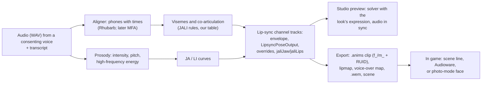

# Voiced lines with lip sync: design

**Status: R&D and design (27 September 2026); nothing built in the Studio.** A proof of concept ran offline ([experiment 027](../../experiments/027-lipsync-poc/README.md)). This page proposes how XF Studio could let people voice new lines for V or other characters with matching lip sync, preview them on V's face, and export them so a voiced line plays in game. Facts and grades come from [lip sync](../../knowledge/lipsync.md), [facial expressions](../../knowledge/facial-expressions.md), [facial animation](../../knowledge/facial-animation.md) and [NPC reactions](../../knowledge/npc-reactions.md). Evidence grades follow the [knowledge rules](../../knowledge/README.md); anything ungraded is a design choice.

## 1. Verdict

**Feasible, in stages, with one hard dependency on Wwise for in-game audio.**

- **Preview on V: yes, soon.** The game's lip-sync clips are ordinary facial clips in a dedicated channel [resource]; the Studio already decodes clip tracks and runs the solver that implements that channel's stages [source]; open tools give phone timing; the proof of concept's solved motion falls in vanilla ranges [offline].
- **Export as game data: likely.** A lip-sync clip is a vanilla-shaped `.anims` entry with float tracks, which WolvenKit's importer writes [source, end to end untested]; lipmaps, voice-over maps and scenes are documented and used by installed mods [wiki] [resource].
- **In-game playback: needs one session to settle** how a new line reaches V's face (scene, Audioware or photo mode) and whether a `.wem` must carry it (knowledge questions 1–3 and 6).
- **Quest integration: later,** with the quest designer.

## 2. The chain

### 2.1 The mapping onto the game's controls

In JALI's spirit the generator keeps **jaw** and **lips** separate, and writes into the channel the game itself uses rather than into the expression controls, so the look's expression stays a separate layer that the facial setup blends exactly as it blends vanilla speech ([lip sync §3](../../knowledge/lipsync.md#3-how-the-face-combines-an-expression-with-speech)).

| Speech feature | Game tracks (as `…LipsyncPoseOutput` unless noted) | Driven by |
|---|---|---|
| Jaw open/close envelope | `jaw_mid_open`; `jaliJaw` (smoothed, delta about −0.45 to +0.7) | Per-viseme target × JA; JA from the vowel's intensity against the line's mean and spread (JALI Table 1 bands 0.1–0.2 / 0.3–0.6 / 0.7–0.9) |
| Lip closure (P, B, M) | `lips_together_up`, `lips_together_dn` at 1.05, jaw narrowed | Always, whatever the strength (JALI constraint 1) |
| Labiodental (F, V) | `lips_suck_dn`, a little `lips_[lr]_upper_raise` | × LI |
| Rounding (OO, OH, W, SH, R) | `lips_[lr]_purse`, `lips_[lr]_funnel` | × LI; lip-heavy timing (150 ms lead and tail) |
| Spreading (EE, IH, EH, S) | `lips_[lr]_stretch`, `lips_[lr]_corner_stretch`, `lips_[lr]_corner_up` | × LI; `jaliLips` from high-frequency energy of fricatives and plosives |
| Tongue (T, D, N, L, K, G, TH) | `tongue_mid_lift`, `tongue_mid_tip_up`, `tongue_mid_base_up`/`_back`/`_fwd` | Tongue-only: no lip shape of their own |
| Channel fade | `lipSyncEnvelope`, `muzzleLips` (tracks, not poses) | 0.4 s in, 0.5 s out (vanilla medians 0.43 s and 0.6 s) |
| Expression muting | `…AnimOverrideWeight` = −(lip-sync value); lip-corner family at least −0.5 × envelope | As vanilla clips do |
| Emphasis | `eye_[lr]_brows_raise_in/out` (small), later blinks and gaze | Loud stressed vowels; later pitch |

The PoC's table ([`lipsync_poc.py`](../../experiments/027-lipsync-poc/lipsync_poc.py)) is the starting point. **Calibration** against the game's own clips is possible locally (decode vanilla clips, align their audio with their subtitles, fit per-viseme weights); the Studio would do that on the player's machine from the player's files and keep the result local, like every other game-derived cache.

## 3. Phased plan

| Phase | Delivers | Depends on | Effort |
|---|---|---|---|
| **0. Reader and reference** | Decode any installed lip-sync clip (the native `.anims` decoder already reads float tracks) and play it on V in the preview through the warm solver, with its `.wem` decoded to audio when WolvenKit is present; a small "voice line browser" over the resolved lipmap. Gives preview parity checks and a reference for tuning | Studio clip playback of float tracks (new, small) | S (2–3 agent days) |
| **1. Preview on V** | A `speech` feature part: a line = audio (stored in the local library, never shipped by default) + transcript + generation settings; consented download of Rhubarb (MIT) into XF Studio's tools folder; the generator in TypeScript (our own, from the PoC rules), with the solver's lip-sync stages; timeline with scrub, play with audio (Web Audio), and edits (move a viseme, strength per word, global JA/LI, articulation style); combined with the look's expression and blink; Undo; readiness in plain words | Phase 0; expression module (built); the TS solver (expression design phase 5) would remove Python from the loop but isn't required | M (6–8 days) |
| **2. Export** | Clip: an `.anims` with `f_`/`m_` + RUID clips on the speaker's face skeleton, 30 fps `AdditiveFromRefPose`, written through WolvenKit's importer; a lipmap per language; a voice-over map; a `.wem` (Wwise; see risks); subtitles; an XF-branded mod. Check/Build/verify and the manifest, pipeline doc and diagrams updated | Phase 1; the phase-3 session's answers on route | L (7–10 days) |
| **3. In-game proof** | One prepared session (checklist in §5); the bridge reads the face rig and can trigger a scene or photo-mode face | Phase 2 test package | M (3–4 days + one session) |
| **4. Quest integration** | Lines as nodes in the future quest designer; NPC speakers on their own face rigs (they share the 414-track vocabulary [resource: Judy's set]); per-language lines and lipmaps; voiceset-style barks for the NPC reactions idea | World and quest tools | later |
| **Later** | Real-time lip sync through the runtime bridge (streaming tracks into a live face), consented voice swap feeding the same chain, MFA for other languages, learned calibration | Maintainer decisions | — |

## 4. Risks

| Risk | Effect | Mitigation |
|---|---|---|
| **`.wem` needs Wwise** (proprietary, account-gated; the game wants 2023.1.14 output) | The Studio can't make game audio itself; a line's lip sync may need its `.wem` to play | Detect a user's Wwise install and drive its command-line tool with consent (that it can convert unattended is a hypothesis to check); test Audioware's silent-`.wem` route; ask whether one silent `.wem` per length bucket is enough (knowledge question 2) |
| **V's lip sync may not show where we want it** | Mirror and third-person scenes only; photo mode unknown | Session checks 1 and 4; photo-mode route as a silent-face fallback for screenshots and video |
| **Setup mismatch** | Vanilla clips target the male player skeleton; the female V may solve with either setup | Rides on the facial-setup runtime check R1 already prepared |
| **Quality** | Rule-based speech looks mechanical beside JALI's | Vanilla-range calibration, emphasis and blink layers, editable timeline; users judge in the preview |
| **Patents** | JALI Inc. may hold patents on its method | Check before release; our generator follows long-published phonetic rules and our own table, and never uses JALI software or data |
| **Voice rights** | Cloning actors' voices harms them and is against their rights | Consent gate (§7) |
| **Language coverage** | Rhubarb recognises English only | MFA models for other languages later; transcript-only fallback (timing from text and audio energy) |
| **Single-owner files** | `stringidvariantlengthsreport.json` can't be merged by ArchiveXL | A Codeware hook as Audioware's guide does, or confirm it isn't needed |

## 5. In-game checks (one prepared session)

Throwaway MO2 profile, one test mod, no framework changes; record the game version, face-rig mods and the Audioware version.

1. **Vanilla V lip sync:** visit the Wellsprings ripperdoc (`hey_spr_ripperdoc_01`) and watch V in the mirror during the dialogue: does V's mouth move? Capture a clip.
2. **Mod scene, V speaking:** a one-line test scene with V's voice tag, our generated clip in a mod lipmap, a `.wem` of the same length: does the mouth follow the audio? Then with a silent `.wem` and the audio played by Audioware.
3. **Mod scene, NPC speaking:** the same line on an NPC actor with that NPC's voice tag and face skeleton.
4. **Photo mode:** an animated photo-mode face carrying the lip-sync channel: does V's mouth move, and does it loop?
5. **Expression plus speech:** the same line while V holds a smiling expression: does the smile persist partly, as the solver predicts?
6. **Bridge:** `face.rig.read` during 2 and 4 to record which facial setup V's face uses.

## 6. Questions for the maintainer

| # | Question | Proposed default |
|---|---|---|
| 1 | Whose voice first? | The player's own recorded voice, plus synthetic voices whose terms allow game use; no voice cloning in the first version |
| 2 | Where should a line play first in game? | A scene line (the game's own path, lipmap + voice-over map), with Audioware as the audio carrier if the session shows it's needed; photo mode as the silent fallback |
| 3 | Aligner | Rhubarb (MIT, consented download) for English first; Montreal Forced Aligner later for other languages |
| 4 | Wwise | Detect and use a user's own Wwise install with consent, and explain plainly when it's missing; never bundle it |
| 5 | Calibrate against the game's own clips? | Yes, locally on the player's machine from their files; never ship fitted tables |
| 6 | Speaker scope | V first (both body genders from one line: `f_` and `m_` clips), NPCs with the quest tools |
| 7 | Timing | After the expression editor's export (phase 3 of its design), since it shares the clip writer and the photo-mode route |

## 7. Voices and consent

- **New voiced lines must come from voices used with consent:** the player's own, a performer who agreed, or a synthetic voice whose licence allows this use.
- **The game's voice actors are not to be cloned.** Their performances and voices belong to them, and a clone would speak lines they never agreed to. The Studio won't offer a clone of a game character's voice, and XF mods never redistribute game audio.
- **Voice swap needs consent from whoever's voice is used,** for any real-time or offline conversion. If a swap feature is ever built, it asks for that consent explicitly and records it with the line.
- The Studio stores recordings only in the user's local library and exports them only into the user's own mod.

## Related

[Lip sync](../../knowledge/lipsync.md) · [Expression editor design](expression-editor-design.md) · [Alive ideas](../backlog/alive-ideas.md) · [NPC reactions](../../knowledge/npc-reactions.md) · [Runtime access](../../knowledge/runtime-access.md)
