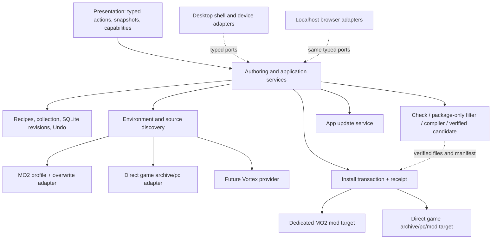

# XF Studio desktop, environment and installation architecture

## Current state

Reviewed 25 September 2026. Details and evidence live in the [desktop README](../../projects/xf-studio/authoring/desktop/README.md); release process and decisions in the [release decisions](desktop-release-decisions.md).

- **Shell.** An Electrobun 2.0.1 Windows/WebView2 host with a Bun main process wraps the shared Studio UI. It is the shell for the alpha pre-releases. Electron remains the fallback if a later gate below fails. The localhost editor stays independently usable.
- **Working in installed disposable canaries:** first-run Local setup with a persisted "continue without paths" choice; a UV-only editor, library and Check without any game asset; strict five-file private preview intake; Check in a bounded worker; host-gated Build with game and WolvenKit inputs and the eye plate derived automatically from the installed game (Build no longer needs Python; the TypeScript builder has run through the desktop Build host from source but not yet in an installed canary); workspace persistence across restarts and native close; About from packaged metadata; quiet uninstall with and without data.
- **Release pipeline.** `desktop/package.json` `version` (now `0.1.0-alpha.1`) is the single app version. `.github/workflows/desktop-release.yml` builds and gates the unsigned installer from source on `windows-2025`. A matching `v*` tag produces a **draft** GitHub pre-release with checksums, build information and provenance attestations, and a maintainer publishes it by hand. A clean-clone rehearsal with an empty Hutch home passed locally; the workflow has not yet run on GitHub.
- **Updates.** Disabled. The consent state machine (Check → Download → Apply and restart), shared busy-work gate, nonce-bound save acknowledgement and `before-quit` veto are tested only with fake ports. `main.ts` never wires the native updater, and the canary gate rejects any packaged feed URL. The [A→B gate](desktop-update-ab-gate.md) and the release decisions define the authenticated-feed design required first.
- **Not yet proven:** standard-user install and reinstall over retained data, interactive uninstall choices, a WebView2-absent machine, GPU fallback and 4K cadence in the packaged app, source discovery and Install in the desktop host, third-party notices, signing and any game runtime behaviour.

This expands the earlier wrapper assessment into a release boundary and acceptance plan. Electron's bundled Chromium and process separation remain the fallback baseline ([official introduction](https://www.electronjs.org/docs/latest), [process model](https://www.electronjs.org/docs/latest/tutorial/process-model)). Bun's built-in [SQLite driver](https://bun.com/docs/runtime/sqlite) currently serves the local prototype. Neither choice entails rewriting the Three.js editor or placing wrapper APIs in its domain model.

## Decision and present boundary

Use **Electrobun 2.0.1 on Windows/WebView2** because it keeps a Bun main process and the existing Three.js view. Alpha pre-releases ship on it; a stable release still requires the gates below for the real editor, library, package and update workload. Electron is the fallback if native WebView2, shell APIs, packaging or recovery fail those gates; switching shells must not change collection semantics, package eligibility or installation policy. The wrappers are adapters, not application architectures.

Today `server.ts` creates Bun SQLite libraries under `XFAS_DATA_DIR` or ignored `authoring/data/`. `package-server.ts` owns a same-origin, loopback-only request; its WolvenKit and game paths come from private local settings or server environment overrides, and it derives the eye plate from that game (a hidden `XFS_PACKAGE_PLATE` override remains for development). Localhost Build runs the TypeScript package CLI with Bun from the HQ tree, plus WolvenKit; no Python. The desktop host instead bundles that CLI as one asset-free Bun script, keeps work/staging/candidates in Electrobun user data and takes external inputs only from its private settings. Both hosts use the shared filter and final result gate. The manifest schema is `xfs/local-package-1`, with `installed: false` and `gameRenderingVerified: false`; it lacks a complete compiler/toolchain lock. `catalog_readonly.py` is a research probe for MO2/direct physical candidates and selected hashes, not a production asset resolver or proof of a runtime winner. [Current implementation](../../projects/xf-studio/authoring/src/package-server.ts), [desktop adapter](../../projects/xf-studio/authoring/desktop/package.ts), [local setup](../../projects/xf-studio/authoring/LOCAL-SETTINGS.md), [package CLI](../../projects/xf-studio/authoring/tools/build_collection_package.ts), [catalog limits](../character-customization/catalog-prototype.md).

The application layer owns validation, readiness, async state, cancellation, install consent and recovery policy. The environment layer inventories candidates and their provenance; it does not decide how an authored recipe compiles. The package layer remains the only source of package eligibility, omissions, names and verification. The install layer accepts an immutable verified candidate and a separately validated target. Shell adapters own window, dialogs, privileged file operations and native update mechanics. Presentation cannot write game files, choose an executable path for a request, or infer readiness from labels. A desktop main process or local service must revalidate each typed request and bound every path; renderer compromise must not become arbitrary SQL, command execution or filesystem access.

## Typed local configuration and readiness

Keep configuration outside portable recipe/collection JSON and immutable SQLite look revisions. Introduce a versioned local settings document under the OS user-data directory, with atomic write, previous-good backup and explicit migrations. Retain current developer `XFAS_DATA_DIR` as an override only in localhost/development mode; desktop release paths come from its app identity and cannot silently point into the installed program directory. Settings types should include `gameRoot`, `launchRoute` (`direct` or `mo2`), optional `mo2Root` and profile ID, optional separate manual mod root, `plateInput`, `wolvenKitCli` (Python and Bun paths are no longer used; saved ones are ignored, and Build runs XF Studio's own Bun), source-cache location/limit, target install mode, update channel and update-check preference. Defaults may be suggested from discovery; they are never baked-in developer paths. Store canonical paths and last validation metadata locally; redact paths from shared error reports and portable exports.

For Windows desktop releases, prefer an ordinary **per-user, writable application installation under AppData** so first installation and subsequent updates work without an administrator prompt. Keep program binaries and packaged resources separate from `library.sqlite`, local settings, private extracted/source caches, package receipts, logs and backups. Electrobun's [uninstall guide](https://framework.blackboard.sh/electrobun/guides/uninstalling/) documents its standalone uninstaller at `%LOCALAPPDATA%\<identifier>\<install-root>\uninstall.exe` and its managed `userData`, `userCache` and `userLogs` under `%LOCALAPPDATA%`; the [Paths API](https://framework.blackboard.sh/electrobun/apis/paths/) says those three names resolve to the same channel root on Windows. These current docs do **not** establish the exact app-binary directory, a setup location picker or whether all update writes avoid elevation for the targeted v2.0.1 build. Verify the actual packaged Windows setup and A-to-B update on a standard user account before selecting it. If the shell cannot meet the per-user/easy-update requirement, choose a supported packaging configuration or the Electron fallback rather than assuming `%LOCALAPPDATA%` from the uninstaller path alone.

Within the managed user-data root, use distinct Studio-owned subdirectories for the SQLite library and backups, versioned settings, private asset/source cache, installation receipts/journals and diagnostics; record whether cache/log cleanup is optional while the library is retained. Package resources are read-only. Keep data location stable across app updates and document any stable/canary channel separation. Electrobun's [uninstall behavior](https://framework.blackboard.sh/electrobun/guides/uninstalling/) offers `App` (default, preserves user data), `App and Data` (explicitly removes its recorded managed directories) and Cancel. XF Studio should keep that default, show the consequence clearly, and never delete external exports, source plate files, installed game mods or other user-chosen paths during app uninstall. Test reinstall against preserved data, plus explicit full-removal behavior. If another shell is selected, implement and test equivalent choices rather than assuming its uninstaller behaves the same.

Secrets, if later required for account-backed downloads, belong in OS credential storage (Windows DPAPI/Credential Manager) with opaque references in settings. Existing locally protected Nexus material is not migrated into a recipe, manifest, release image or log. Neither MO2 installation nor direct game copying needs a Nexus key. Never make a credential a prerequisite for offline authoring or package Check.

Each setting is independently validated for existence, kind, access, expected executable identity/version and safe root relationship. Distinguish `unconfigured`, `discovering`, `ready`, `stale`, `unsupported-version`, `permission-denied` and `error`; publish a specific action-level disabled reason. Revalidate at operation time because a drive, profile or file may change after Settings was opened. Record exact detected versions and hashes separately: source checkout, installed CLI metadata and runtime game logs are different evidence. Profile `+` indicates intended activation, not effective archive ownership or a particular game launch.

Use a provider-neutral `SourceCandidate` record: virtual/depot path or hash, physical container, provider, selected route/profile, active state, priority evidence, size/hash, discovery timestamp and limitations. Resolve loose-file precedence, archive-index candidates and ArchiveXL transformations in distinct steps. A result reports `observed`, `source-derived`, `ambiguous` or `unknown` confidence and every relevant contender; only a game trace can upgrade a runtime-loaded claim. The first production adapters are game vanilla/manual `archive/pc/*` and MO2 profiles/mods/overwrite. A route choice excludes staged MO2 content in direct mode. Keep Vortex as a typed future adapter; do not fake its semantics with a directory scan. Cache by source fingerprints and invalidate on profile, modlist, archive, `.xl` or game-version changes. [Source design](../backlog/jewellery-and-customization.md), [catalog prototype](../character-customization/catalog-prototype.md).

Settings UI should group Game, Mod sources, Build tools, Installation and Desktop updates. Each row needs Browse/Detect, a precise validation result, provenance and a safe retry action. The export screen distinguishes Check readiness (no game/tool paths required), Build readiness and Install readiness; a partial export lists every omitted active layer/preset before the build. A tool version being present does not certify package compatibility. The Desktop updates group appears only when the shell provides an updater; localhost displays no dead update control.

A **clean-slate first launch** opens a guided, resumable setup instead of importing a developer's paths or silently adopting an old localhost workspace. First confirm the user-data location and whether an existing desktop library is being reopened; then detect or browse the Cyberpunk game root, choose **MO2 profile** or **direct game** launch route, validate MO2 root/profile and the manual `archive/pc/mod` overlay where relevant, and configure WolvenKit CLI, source plate/private asset inputs and remaining build-tool dependencies. Show what each dependency enables: editing and collection Check can proceed without a game or mod manager, Build waits for its validated tool/assets, and Install waits for a verified candidate plus writable target. Offer Skip/Resume for optional steps; save only validated selections or an explicit incomplete state. Suggested discoveries must show their origin and require selection. A migration assistant may later import local-development settings, but must preview and validate each path and never treat historical keys as a complete setup. A versioned setup-progress record survives restart without creating a false `ready` state.

## One authoring product, two hosts

Keep the independent localhost entry and its browser/loopback adapters. Desktop constructs the same trusted application services, file/package ports and `StudioPresentationPort`; it adds narrowly typed `Environment`, `Install` and `Update` capability/action ports. The UI can query them and handle unavailable results. No desktop import may enter recipe, compiler, library schema, package filter or Three renderer core. A shell does not need to expose the HTTP server publicly; if it reuses loopback transport, bind `127.0.0.1`, use a per-session capability token and origin validation, and close it at shutdown. Prefer direct typed IPC where shell maturity allows it. Desktop file dialogs yield vetted handles/paths to privileged adapters, never unrestricted renderer-supplied paths.

Both hosts must open/edit/Undo, persist workspace and SQLite revisions, import/export portable collections, Check and Build with the same collection snapshot and omission list. Localhost can configure paths and build when its external tools exist, but desktop-only installation/update features remain explicitly unavailable. Preserve verification mode (`?verify=1`) and never use the maintainer's active draft as a packaging or UI acceptance fixture.

## Build, install and removal sequence

### Transport core checkpoint (24 September 2026)

`projects/xf-studio/authoring/src/mod-install-transport.ts` now supplies a trusted offline transport API for the exact verified `.archive`/`.archive.xl` pair. It takes host-owned absolute candidate and private receipt roots plus parsed local settings. A caller selects only a single candidate ID under that configured store; the module rechecks the package manifest schema, namespace, exact two relative paths, byte counts and SHA-256 values at operation time. It also validates the configured game executable, direct or MO2 route, MO2 profile, target path components and existing file ownership. No browser-provided destination is accepted. The API offers `preflight`, `install`, `receipt`, `recover`, `rollback` and `uninstall`; host and UI adapters are still to be connected.

Direct mode targets the configured game's `archive/pc/mod`; MO2 mode targets a dedicated `mods/XF Eye Artistry/archive/pc/mod` folder (an existing legacy `XF Studio` folder blocks install rather than gaining a second copy). MO2 profile IDs follow the local-settings single-directory rule, allowing real names such as `2025 (again)` while rejecting traversal and path separators. It never edits `modlist.txt`: MO2 lists a new, unlisted mod folder at the bottom of the left pane, disabled, and the user enables it. Where a Studio tool does write a profile's list (the diagnostic stage's private copy), it adds only its own entry, placed by the [MO2 placement rule](framework-version-check.md#mo2-placement-rule). Existing same-name files without a matching private receipt are refused. An update requires both currently owned files to match their receipt; unrelated files in the destination are left alone. Copies are staged as temporary siblings and checked by hash before the paired rename. A private journal precedes the swap, and one receipt records the owned pair and a prior version's backup for rollback. Malformed receipt or journal identities, paths and backup references stop recovery before any target change. Recovery restores the pre-transaction pair only when each observed file is missing or matches either expected hash; a later user edit is reported as a conflict and left untouched. Uninstall similarly journals and backs up its pair before removing it. A process lock blocks concurrent work and stale dead-process locks can be reclaimed. The API never changes the collection, package manifest or compiler output and never labels a file install as game rendering proof.

The test fixture uses temporary fake game/MO2 roots only. It covers both routes, ownership conflicts, hash tampering, pair updates/rollback, unrelated files, interrupted swaps, conflict-aware recovery and stale locks. It has **not** installed anything into a real game or MO2 instance. Before a user-facing Install control, the host must restrict candidate selection to a package it has independently verified and promoted, keep receipt storage in managed user data, surface the preflight/activation warning, offer recover/rollback flows, and exercise locked-file/disk-failure and packaged-app restart cases. A manifest's verifier fields are a local build claim, not independent verification performed by this transport. The planned diagram below still describes the same boundary; no recipe, compiler, manifest or promotion path changed in this checkpoint.

A later, separate [first-game diagnostic transfer](../../projects/xf-studio/authoring/src/runtime-diagnostic-promotion.ts) now has a read-only preview and an explicit, fixture-tested operation to create a **new** MO2 profile plus the dedicated mod from an ignored scratch stage. It checks exact candidate/stage/source hashes, current collisions and destination ownership; a private journal/receipt supports conflict-aware recovery and removal. It does not edit the original profile or MO2's selected-profile setting. This is a local diagnostic command, not a desktop Install action or a runtime-verified deployment. Its 25 September run against the reference MO2 instance is recorded in [validation](../../docs/validation.md#staging-record).

**Frameworks are the user's.** Install and diagnostic tools never install, replace, disable or duplicate ArchiveXL, TweakXL, Codeware, RED4ext, redscript, CET or similar frameworks, and never reorder other mod entries. The read-only [framework version check](framework-version-check.md) (`detect.frameworkVersions`, and the advisory `frameworks` readiness entry) tells the user which framework to update, from which version to which, with Nexus Mods and GitHub links. An Install flow should show that guidance before installing; it must not block building or installing the mod files themselves.

1. Finish a first release-safe authored eye-makeup mod: confirm eligible flat finishes, preserve every omission, pin compiler/tool versions, keep the built-in plate's recipe and source gate current for each supported game version, and pass the full mesh/morph/pose gates. The current plate still has unresolved contact failures. Check and Build must agree on original/filtered hashes, IDs and omissions; a completely empty filtered package fails.
2. Build in a package-only copy and ignored intermediate directory. Run independent resource/mip/wiring/manifest verification; promote a unique immutable candidate with `.archive`, `.archive.xl` and manifest only on success. Never mutate SQLite revisions, draft recipes or authored collection; do not silently treat skipped layers as installed. Do not put private game-derived resources in a public release artifact.
3. Present target, source collection/revision or unsaved-snapshot hash, omitted details, expected files, versions, conflicts and backup plan. Require an explicit Install action for the selected target. An exported candidate remains useful without installation.
4. For MO2, create or update a dedicated XF Studio mod folder under the chosen MO2 instance; write into staging, verify hashes, then rename/swap atomically where possible. Keep a receipt with profile/target identity, before-state and files owned. Do not edit another mod or assert that changing `modlist.txt` proves a runtime winner. If activation is supported, make it a separate explicit step with MO2-compatible handling and a reversible backup; otherwise guide the user to enable the dedicated mod in MO2.
5. For direct install, stage only owned `.archive` and `.archive.xl` in the configured game's `archive/pc/mod` target; detect same-name files and refuse an unexplained overwrite. Hash/backup each replaced owned file, copy to temporary siblings, verify and swap, then record a receipt. Handle locked files, partial copy and crash recovery before showing success. The installer never guesses a game path from the current checkout.
6. Rollback restores only files this transaction changed, from verified backups, and records any conflict since install instead of overwriting a user's later edits. Uninstall removes only still-matching receipt-owned files; a missing or modified file is surfaced for review. Keep archive and `.xl` paired. Installation proof is file/hash state; activation is target/profile state; game registration, A/B/Off clearing, save identity and visual appearance require the prepared runtime session in [validation](../../docs/validation.md).

```mermaid
flowchart LR
  SNAP["Draft or exported collection snapshot"] --> CHECK["Shared validation + partial filter"]
  CHECK -->|"eligible"| BUILD["Isolated compile + resource build"]
  CHECK -->|"empty or invalid"| STOP["No package"]
  BUILD --> VERIFY["Independent verifier"]
  VERIFY -->|"pass"| CAND["Immutable local candidate + manifest"]
  VERIFY -->|"fail"| STOP
  CAND --> CHOOSE["Explicit target and conflict review"]
  CHOOSE --> STAGE["Stage + hash + backup"]
  STAGE --> SWAP["Commit paired archive / XL files"]
  SWAP --> RECEIPT["Install receipt + rollback/uninstall"]
  RECEIPT -. "separate game session" .-> RUNTIME["Runtime registration / rendering proof"]
```

An installation receipt is a private, versioned local record, not a claim in `xfs/local-package-1`; future manifests may cross-reference its ID but must keep build and install facts separate. Serialize one install per target and one package build per source workspace. Cancellation before swap removes staging; after swap it triggers rollback or a visible recoverable state. A crash journal is replayed on startup before another install.

## Shell choice, assets and distribution gates

[Electrobun v2.0.1](https://github.com/blackboardsh/electrobun/releases/tag/v2.0.1) hosts the alpha builds but is not yet proven against every gate. Its [Windows build configuration](https://framework.blackboard.sh/electrobun/apis/cli/build-configuration/) offers native WebView2 by default and optional bundled CEF. WebView2 depends on the machine runtime; CEF gives a pinned browser at larger size. Benchmark both against the actual skinned/animated head, UV picking, 4K masks, saved-V assets, file dialogs, background conversion, close/restart and GPU failure. Measure installer/update size, cold start, memory, frame cadence and crash recovery on clean and modded Windows machines. Verify WebView2 runtime bootstrap/failure messages. Avoid broad `autoGrantPermissions` (applies to every native view origin). The [Updater API](https://framework.blackboard.sh/electrobun/apis/updater/) exists for Bun/Cottontail main processes, not the native main runtimes. Electron's [documented process model](https://www.electronjs.org/docs/latest/tutorial/process-model) and bundled Chromium provide the fallback if Electrobun fails a required gate; compare the same fixture and typed adapter behavior, not a toy window.

Before shipping, prove the packaged executable can open the SQLite library, migrate/back up data, spawn or replace every required build component and locate all static/runtime assets without developer source paths. The installed WolvenKit CLI is not assumed redistributable or present; the builder itself is a bundled Bun script and needs no Python. Prefer a user-configured, version-checked external WolvenKit CLI for the first private build, then evaluate a legally reviewed bundling strategy. [WolvenKit 9.0.1](https://github.com/WolvenKit/WolvenKit/releases/tag/9.0.1) is the current official release while the measured builder uses CLI 8.17.4; move only after the full resource round-trip and verifier pass. Its repository is GPL-3.0; bundling it would require license/notice and integration review. The 9.0.1 release notes require .NET 10 runtime prerequisites. The official source checkout used for study is commit `11720772f1e20581301b3dec88a59f7b5ee05675`; local working-tree changes are irrelevant to this design and were not used. [Toolchain record](../../docs/toolchain.md), [WolvenKit source](https://github.com/WolvenKit/WolvenKit/tree/11720772f1e20581301b3dec88a59f7b5ee05675).

Ship no game-derived mesh/morph, extracted texture, private save, MO2 inventory, credential or user's SQLite database in the desktop installer or update. Define a first-run local asset intake and hash/provenance check; if required private inputs are absent, authoring and Check remain available while Build explains the missing prerequisite. Produce a release SBOM/notices from actual dependency artifacts. Electrobun's [MIT license](https://github.com/blackboardsh/electrobun/blob/main/LICENSE) requires retaining its copyright/license notice for copies. Review separately the licenses and redistribution terms of Bun/Cottontail, WebView2 bootstrap or CEF, Three, Python/.NET and WolvenKit, plus game/mod asset rights. Learning from a tool does not grant redistribution of its binaries or source.

## Consented desktop updates

Updater is a desktop shell capability only. Default to an explicit Check for updates action and an opt-in automatic check preference; never silently download or apply. The view reports current channel/version, available version, release notes, signed publisher, download size where known, and `checking`, `available`, `downloading`, `ready-to-restart`, `applying`, `recovered` or `error`. Download and apply require separate user actions; apply checks active edits/build/install transactions and persists/backs up user data before restart. An update changes app code and packaged assets, never user settings, source bindings, SQLite look history or installed game mod files as a hidden side effect.

The desktop **About** view always shows the installed application version, release channel and build identity, including when offline or when update checks are disabled. The Update view uses the same read-only installed-version snapshot beside any available version and links back to About; it must not substitute a website's latest release or the source `package.json` version for what is running. For an Electrobun trial, the [Updater API](https://framework.blackboard.sh/electrobun/apis/updater/) exposes packaged `getLocalInfo()` version/hash/channel data; wrap that in a typed shell metadata port and check it against the built artifact. If the backend is unavailable or metadata cannot be read, display an explicit unavailable state and diagnostics rather than a guessed version. Localhost may display its development build label independently and has no desktop updater action.

The first update gate is a two-version trial: sign and install version A, exercise library/settings/source discovery and a staged package; publish version B to a test channel; check by consent, download by consent, inspect authenticity, restart/apply by consent, verify preserved settings/library and resumable or rolled-back install journal; simulate interrupted download, missing patch, failed replace, rollback and offline restart. Test an actual packaged canary/stable build because Electrobun's `dev` channel does not report updates. Its [update guide](https://framework.blackboard.sh/electrobun/guides/updates/) says static HTTPS hosting can serve full bundles and optional hash-routed delta patches, with full-bundle fallback. The hash routes patches; it is not code signing. The API describes transactional app replacement with previous-app restoration after a failed replacement, but Studio must still prove this with its own two-version test. Pin release base URL, app identity, channel, artifact retention and publisher identity; verify metadata/content authenticity under the selected signing scheme before enabling general distribution. Electrobun's [signing guide](https://framework.blackboard.sh/electrobun/guides/code-signing/) says Hutch does not currently sign Windows releases, so add a separate Windows Authenticode signing and verification stage or withhold automatic Windows update distribution. Prepare visible acknowledgements and third-party notices before publishing any release. No updater is installed or configured by this document. The [release decisions](desktop-release-decisions.md#updater-github-feed-and-authenticity) record why a GitHub `releases/latest` feed cannot serve pre-releases and the signed-envelope check required before `applyUpdate()`.

## Acceptance matrix and forbidden coupling

| Gate | Minimum evidence | Status (25 September) |
| --- | --- | --- |
| Host parity | Same fixture edits/Undo/reload/SQLite revisions/import/export and exact Check/Build identities/omissions in localhost and desktop; one source compiler/filter. | Partial: Check identities/omissions match localhost for the shared fixture; Build resource parity observed; archive bytes not reproducible. |
| Settings | Fresh install, invalid/moved game, MO2 profile change, tool version mismatch, migration and restore from previous-good file; disabled reasons and no personal path in portable output. | Partial: fresh setup, defer choice, previous-good recovery and tool probes tested; moved-path and profile-change UI pending. |
| First run and data | Clean machine guided MO2/direct setup, skip/resume, no borrowed developer path, editor/Check usable before Build readiness, OS user-data durability, reinstall with preserved SQLite/settings/private cache, explicit data removal. | Partial: asset-free first run and restart persistence in disposable installs; clean-machine kit prepared; reinstall and clean-machine run pending. |
| Source provenance | MO2/direct route exclusion, disabled and competing files, overwrite, archive hash ambiguity, ArchiveXL merge limits, cache invalidation; no `+` to runtime-winner claim. | Not started in the desktop host (read-only discovery research only). |
| Package | Empty/invalid rejection, partial export disclosure, independent verifier failure blocking promotion, hash/identity match and private payload exclusion. | Met offline through the shared filter, verifier and allowlist gates. |
| Installation | MO2 and direct staging, collisions, locked files, disk failure, crash journal, paired archive/XL rollback, altered-file uninstall refusal and receipt accuracy. | Not started in the desktop host; transport core is fixture-tested only. |
| Shell | Real editor frame cadence, 4K preview memory/cancellation, file dialogs, SQLite durability, external-tool execution, WebView2 absent/CEF comparison, clean-machine startup. | Partial: installed editor, WebGL2 and workers work; cadence, 4K memory, WebView2-absent and CEF comparison pending. |
| Windows installation | Inspect the actual installed binary/data/update paths and setup choices on a standard user account; prove install and A-to-B update without elevation, app-only uninstall preserving data, and explicit app-plus-data removal. | Partial: quiet app-only and full-data uninstall observed with a redirected LocalAppData; standard user, interactive choices and reinstall pending. |
| Update | Signed A-to-B consent flow, offline/no update, delta/full fallback, interrupted download, failed replace restoration, data preservation and busy-transaction guard. | Not met: updater disabled. |
| About/version | Installed version/channel/hash come from packaged local metadata and agree across About and Updates, including offline and update-service error states. | Met for packaged metadata in installed canaries; update agreement tested with fakes only. |
| Release pipeline | Tag/version agreement, tests and allowlist gate in CI from a clean runner; checksums, attestation, draft-only publication and a human publish step. | Partial: workflow authored and rehearsed in a clean local clone; first GitHub run pending. |
| Runtime | Separate versioned game session proves selector registration, A/B/Off clearing, save identity, plate poses and material appearance; offline checks never fill this row. | Not started. |

Forbidden dependencies: `recipe.ts`, `preset-collection.ts`, `preset-compiler.ts`, `package-filter.ts` and library models importing Electrobun/Electron, `process.env` installation paths, UI elements or source-provider rules; presentation reading mutable recipes, SQLite or filesystem; installer compiling or altering authoring data; settings changing package output without recorded tool/source fingerprints; update service writing mod target files; source discovery claiming executed ArchiveXL or game-loaded winners from physical inventory alone. Add typed actions/capabilities and boundary tests with each user-visible step, and record any unavoidable exception with owner and removal criterion in [UI boundary assessment](ui-architecture-boundary.md).

Documentation consistency: this proposal changes no recipe, compiler, manifest or promotion code, so the existing pipeline diagrams remain the current factual flow and need no new render checkpoint. On the first implementation change to that flow, update and visually review them under the [pipeline guide's maintenance rule](studio-to-mod-pipeline.md#maintenance-and-visual-review-record). The diagrams above describe planned boundaries, not present features.
