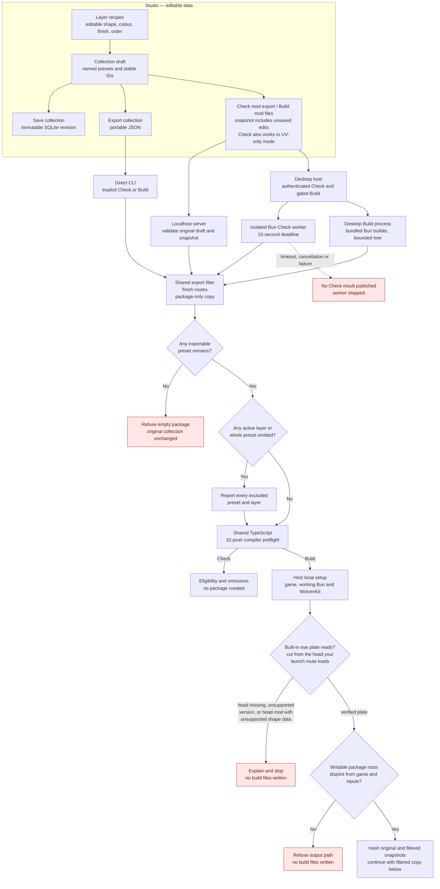
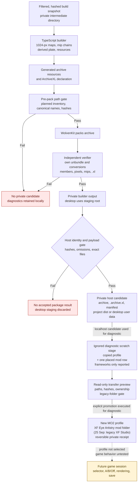
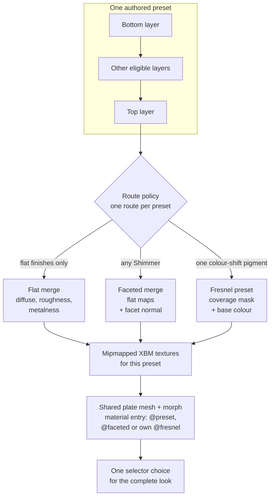

# From XF Studio collection to a Cyberpunk mod candidate

25 September 2026. This is a map of the **current local pipeline**, for a reviewer who knows the idea of a mod but not the file formats. Build produces an offline-verified, private **candidate**. One diagnostic copy has been placed in a new MO2 profile, but that profile has not been selected or observed rendering in Cyberpunk 2077. “Loadable” here means the expected archive/declaration files have been built and independently unpacked and checked; it does **not** mean ArchiveXL registration, selector switching, visual fidelity or save persistence have passed an in-game test.

The short version: the Studio saves editable makeup as data. Check and Build make a package-only copy that omits active layers with unsupported finishes and presets left without active exportable layers. They report every omission while leaving the authored collection untouched. Build then merges each retained preset's visible layers into one decal draw: a small set of 1024-pixel texture maps chosen by the preset's finish route (three for flat finishes), attached to that route's eye-plate material pattern, writes a character-creator selector with an Off choice, packs the resources, independently checks the package, and places only a verified copy in a host-owned private candidate directory. Localhost uses the project's ignored `dist/`; desktop uses private Electrobun user data. Build does not install files; the separately invoked diagnostic transfer copied one **localhost** candidate pair into a new MO2 profile and mod. [Product decision](../../projects/xf-studio/data/product-direction.md), [local build boundary](local-package-build.md), [runtime test card](../../docs/validation.md#prepared-single-session-test-card).

## The pipeline at a glance

Solid arrows below are implemented local data/build steps. The final dashed arrow is **work still to be observed in game**. A red rejection means no eligible preset remains; structural or integrity failures also prevent promotion. A partial result carries explicit omissions. The first diagram follows authoring through eligibility; the second begins with the same validated build snapshot.





The diagram has entries into the same TypeScript filter from a localhost Studio request, an authenticated desktop request and an exported collection JSON file explicitly passed to the CLI. All use the same filter and 32-pixel compiler preflight; the arrows show this shared policy, not one shared running process. **Check mod export** stops after eligibility and needs no WolvenKit, game file or 3D preview. The desktop host runs Check in a fresh bundled Bun worker, with a 15-second deadline; timeout or cancellation publishes no result. **Build mod files** uses the same partial-export filter and the same TypeScript resource builder and independent verifier in either host; **Python is not involved**. Each host runs that builder as one bounded Bun child process: localhost runs `tools/build_collection_package.ts` from the source tree, desktop runs its single bundled `build.js`. Before the builder starts, each host prepares the [built-in eye plate](#where-the-eye-plate-comes-from) from the head the game is expected to load for the saved launch route (direct or the selected MO2 profile), including a head supplied or patched by a mod; a missing or unsupported head resource, or a head mod whose shape data does not fit the plate recipe, stops Build with a plain explanation. The direct CLI does not derive a plate; it takes an explicit `--plate` directory. Desktop checks readiness before starting that work: its asset-free packaged builder bundle, WolvenKit and game inputs must pass. A bounded probe also executes a small script through the selected Bun path (or Electrobun's main executable when unset); file presence alone cannot enable Build. The browser sends the action and collection snapshot, with no tool or output paths. Desktop keeps its writable work, staging and candidate roots under Electrobun user data, disjoint from the configured game, MO2 and all input paths. The read-only packaged tools legitimately share the Electrobun channel root, so the gate checks each writable package subtree rather than rejecting that common parent. Build stops a timed-out or cancelled process tree (the builder and any WolvenKit child it started) and removes per-build intermediates. It verifies builder output against the original and filtered identities, exact archive/XL file set, lengths and SHA-256 values before moving the staged candidate into the private candidate store. A disposable installed canary, built while Build still ran the Python programs, completed the authenticated host Build route with four presets and 16 independently verified resources. Its archive payloads match the earlier localhost candidate after independent unbundling, but archive-file hashes differ because the index records build times. The TypeScript desktop Build route has been run from source with the real bundled builder, WolvenKit 9.0.1 and a fresh private data root (see [Build pipeline port](#build-pipeline-port)); it has not yet been repeated in an installed canary. Localhost retains its server overrides and project dist root. [Installed trial](../../projects/xf-studio/authoring/desktop/README.md), [server boundary](../../projects/xf-studio/authoring/src/package-server.ts), [result identity gate](../../projects/xf-studio/authoring/src/package-result-verifier.ts), [desktop adapter](../../projects/xf-studio/authoring/desktop/package.ts), [shared preflight](../../projects/xf-studio/authoring/src/package-preflight.ts), [local setup](../../projects/xf-studio/authoring/LOCAL-SETTINGS.md), [package service](../../projects/xf-studio/authoring/src/package-build-service.ts), [CLI](../../projects/xf-studio/authoring/tools/build_collection_package.ts).

Separate disposable installed WebView2 trials exercised the visible editor. One completed an edit, Undo, SQLite Save, Check and a **Build now** click for one preset with zero omissions; the private manifest matched its archive and ArchiveXL file hashes, and Check after Build returned the same filtered snapshot hash. Another verified that saved and unsaved collection work and selection survived full close/relaunch after the desktop workspace storage repair, then imported a prepared five-file private preview set and reached Ready. Those are installed-app UI and offline package observations, not a game session or evidence that an immediate close during a pending workspace save is safe. [Installed WebView2 record](../../projects/xf-studio/authoring/desktop/README.md#installed-webview-acceptance-and-restart-repair-25-september).

## What each kind of data means

| Thing | What it contains | What it is **not** |
|---|---|---|
| Recipe | A versioned, editable ordered layer stack: contours, warp fields, pigment/softness, colour, opacity and finish. Current schemas include `xfs/recipe-6` through `xfs/recipe-10`; legacy recipes migrate on read. | A texture, mod or saved V. The browser preview resolution is independent of the recipe. |
| Collection | `xfas/collection-1` JSON with a stable collection UUID and named preset UUIDs/revisions, each carrying a recipe. The `xfas` schema name is retained for compatibility after the XF Studio rename. | A game selector by itself. It can travel between Studio installations. |
| Workspace draft | Unsaved collection edits plus editor selections and preview context, in origin-bound browser storage on localhost or a host-owned private workspace file on desktop. | A new SQLite revision or packaged mod. |
| SQLite revision | Explicit, immutable local library snapshot with conflict protection. | The latest browser draft unless the user saved it. |
| Package-only filtered snapshot | A validated copy with unsupported **active** layers removed and any now-empty preset removed. It keeps IDs/revisions of included presets; Check and Build use the same filter. | A change to the authored recipe, browser draft or SQLite library. |
| Build plan | Deterministic proposed resource names/paths for the **retained subset**. | An installable mod. |
| Intermediate build | Generated maps, JSON resources, conversion logs, packed archive and verifier evidence under ignored project `build/` for localhost, or private Electrobun user data for desktop. | Public distribution content. |
| Private candidate | Verified `.archive`, `.archive.xl` and a manifest in ignored project `dist/` for localhost, or private Electrobun `package-candidates/` for desktop. | An installed, activated or game-proven mod. |

The new-layer template starts with a mirrored four-point upper-lid contour and no warp field. Reset applies that same starting shape, while duplicate and imported or saved recipes retain their authored geometry. This changes only the recipe produced by future Add/Reset actions; the filter, compiler, package identities and historical four-layer startup recipe are unchanged. [Layer action](../../projects/xf-studio/authoring/src/layer-stack.ts), [template](../../projects/xf-studio/authoring/src/recipe.ts).

For example, the checked-in four-preset fixture has collection ID `0ec3546e-3fac-43e7-8c19-a65d20383d41`. Its namespace is `xfs_c0ec3546e3fac43e78c19a65d20383d41`. Preset `f25f8eb1-8a83-4f65-a111-b83086382c18` gets mesh appearance `xfs_pf25f8eb18a834f65a111b83086382c18` and selector appearance `xfs_c0ec3546e3fac43e78c19a65d20383d41__xfs_pf25f8eb18a834f65a111b83086382c18`. Renaming that preset keeps these UUID-derived identities; reordering changes its index, whose save behavior remains unproven. This fixture is an example, not a required preset catalogue. [Identity planner](../../projects/xf-studio/authoring/src/preset-collection.ts), [fixture](../../experiments/005-preset-collection/editor-collection.json).

## Where layers become one look

**The merge happens in the Studio compiler, before WolvenKit and before ArchiveXL.** One preset is evaluated at 1024 × 1024 texels and becomes **one decal draw** on the plate. Only enabled layers with opacity above zero participate. Their masks use the same recipe evaluator as the browser/PNG path. The [route policy](../../projects/xf-studio/authoring/src/finish-export.ts) first picks one route for the whole preset, because one draw has one material template and one set of material constants:

| Route | Adapter | When | Maps per preset | Material entry |
|---|---|---|---|---|
| Flat | `mesh-decal-flat-v1` | Only Matte, Satin, Metallic and game-matched Glossy | diffuse, roughness, metalness | shared `@preset` (`mesh_decal.mt`, normal off) |
| Faceted | `mesh-decal-faceted-v1` | Any game-matched Shimmer layer (flat finishes may share the preset) | diffuse, roughness, metalness, **normal** | shared `@faceted` (`mesh_decal.mt`, `NormalsBlendingMode` 1) |
| Fresnel | `mesh-decal-fresnel-v1` | Every active layer is one game-matched Colour-shifting pigment | **mask**, **gradient** (16 × 16) | per preset `@fresnel_<preset>` (`mesh_decal_gradientmap_recolor_blendable.mt`) with its shift constants |

For flat and faceted presets the compiler walks the layers bottom-to-top, applies each layer's colour and coverage, and accumulates colour, roughness, metalness, coverage and (faceted) the facet normal in destination-channel space. Diffuse alpha stores the square root of coverage for the inspected `mesh_decal.mt` path. A Fresnel preset writes linear coverage (that template does not square it) and a uniform base-colour texture. There is no separate game selector for each layer. Matte/Satin/Metallic values are provisional; Glossy, Shimmer and Colour-shifting are **experimental** and listed as such by Check, Build and the manifest. A flat-only collection produces byte-for-byte the same resources as before the other routes existed. [Finish designs](../materials/finish-designs/README.md), [compiler](../../projects/xf-studio/authoring/src/preset-compiler.ts), [raster evaluator](../../projects/xf-studio/authoring/src/recipe.ts).



Active **Glitter** layers, and Glossy, Shimmer or Colour-shifting layers still in their earlier browser-study model, have no route. So do Colour-shifting layers that share a preset with other finishes or with a different shift. The package filter omits those active layers with the reason, then omits any preset left without active exportable layers. Check and Build both report each excluded layer and whole preset; they refuse the collection only when no exportable preset remains. A disabled or zero-opacity layer does not contribute and is not reported as an omission. The compiler itself still strictly rejects unsupported active layers if called without the package filter; it never silently flattens them. The individual **Export mask** command is a different output: a 2048 × 2048 white-RGB/coverage-alpha PNG for one layer, independent of its enabled state and not the preset package. Preview quality at 512/1K/2K/4K changes generated browser textures only. [Package filter](../../projects/xf-studio/authoring/src/package-filter.ts), [compiler gate](../../projects/xf-studio/authoring/src/preset-compiler.ts).

**Route mip chains.** Flat maps keep the coverage-space chain below. A faceted normal's lower levels are plain means of the decoded facet vectors, so unresolved facets shorten and the shader's mode-1 alpha fades them out; its roughness levels add the lost facet variance (α′² = ᾱ² + v). A Fresnel mask's levels are plain coverage means; its gradient is uniform. The independent verifier restates each rule. [Route chains](../../projects/xf-studio/authoring/src/route-mip-chains.ts).

## Where the eye plate comes from

Every preset is drawn on one **expanded eye plate**: a 3,010-triangle, 1,620-vertex cut of the female player head the game loads (`h0_000_pwa_c__basehead.mesh` and `h0_000_pwa__morphs.morphtarget`, as supplied or patched on the user's launch route), skinned and morphed exactly like the head underneath. The plate is part of XF Studio, but its geometry is CDPR's, so the product ships only an asset-free **recipe** ([`eye-plate-recipe.json`](../../projects/xf-studio/authoring/src/eye-plate-recipe.json)): the selected triangle IDs as 105 inclusive ranges, their face/vertex ID hashes and expected topology, the SHA-256 of each audited source resource revision (currently game 2.31), and the output layout. Build derives the plate from the user's own installed game; nobody configures a plate folder.

```text
Saved launch route (direct, or the selected MO2 profile)
   generic resolver: mounted archives + .xl patches -> winning head .mesh and .morphtarget, patches of plate data
   missing anywhere -> "missing" explanation, Build stops
WolvenKit unbundle each winning archive (and patch sources)  -->  private work dir; hash every resource
   base game, no plate-data patch:   supported recipe revision?   no -> "unsupported" explanation, Build stops
   mod supplies or patches the head: unpatched base-game parts must still be a supported revision
   cache hit (recipe + source hashes + head provenance + deriver version)?   yes -> reuse after re-hashing the cached files
   WolvenKit serialize -> apply .xl patches as ArchiveXL does -> TypeScript byte cut -> WolvenKit deserialize -> serialize again
   independent verifier (decodes plate and head separately)   fail -> no plate, Build stops
      (from a mod's head, a failed cut or check -> "your head mod ... isn't supported yet" + escape hatch)
   publish atomically: <cache>/xfs-expanded-eye-plate-r1-<key>/{resources/, plate-manifest.json}
```

**Which head.** The plate must match the head the game draws, so it is cut from the resources the game is expected to load for the saved launch route, not always from `archive/pc/content`. The host adapter ([`eye-plate-head-resolver.ts`](../../projects/xf-studio/authoring/src/eye-plate-head-resolver.ts)) opens the route with the generic [resolver](../../knowledge/mod-loading.md) (source discovery, mount order, RDAR indexes and `.xl` files; index caches go under the plate cache's `resolver/` folder). The pure planner ([`eye-plate-head-source.ts`](../../projects/xf-studio/authoring/src/eye-plate-head-source.ts)) then applies the same rules the character resolver uses: the first mounted provider of each depot path wins, ArchiveXL copies and links apply only when no archive has the path, and `.xl` patches of the two resources are applied as ArchiveXL 1.27.3 applies them at load time, limited to properties that reach the plate. A mesh patch changes plate data only when it names `renderResourceBlob` (ArchiveXL then also copies the bones, LOD and bounds fields); a morph patch can change `blob` (named explicitly), `boundingBox`, `targets` (merged by name) and `baseTextureParamName`. Patches that change only properties the plate replaces (mesh appearances, morph `baseMesh`, `baseMeshAppearance`, `baseTexture`) are recorded as ignored. Nothing here knows about any particular mod. The [application service](../../projects/xf-studio/authoring/src/eye-plate-service.ts) applies the policy:

- **Base game wins, no plate-data patch:** as before, the head must match a supported recipe revision.
- **A mod supplies or patches the head:** the plate is cut from those resources when the recipe's gates hold: the selected triangles, their order and the vertex mapping must be the audited ones (the recipe's vertex-ID hash), the morph target count must match, the mesh and morph base must agree, and the independent verifier must pass against the effective head. Base-game resources used unpatched must still be a supported revision. Skin bytes are preserved exactly relative to the head actually used.
- **A mod changes the head's topology** (or the gates otherwise fail): Build stops with `plate_source_modded` and names the mod: "Your installed head mod … changes the head's shape data in a way XF Eye Artistry doesn't support yet". The message gives two ways out: disable that mod in the profile chosen in Local setup, or start XF Studio with `XFS_EYE_PLATE_HEAD=base-game`. That escape hatch (both hosts read it from the environment) cuts the plate from the base-game head, records `kind: "base-game-override"` and adds a limit that the makeup may not sit exactly on the modded head.

The plate manifest's `head` record lists, without physical paths, each resource's depot path, winning archive, group, provider (MO2 mod name or installed game) and SHA-256, the SHA-256 of any winning mod archive, each applied patch with the properties it changed, and each ignored patch with the reason. `source.revisionId` is the audited revision for a base-game head and `installed-mods` otherwise. The package manifest's `plate` record carries the same `head` record, and both hosts compare it exactly. The cache key includes that provenance, so a plate cut from one source is never reused for another.

**The reference installation.** Read-only, on 25 September 2026 with WolvenKit 9.0.1, the resolver found for the MO2 profile `XF Studio diagnostic 2026-09-25` (and for `2025 (again)`): the head **mesh** comes from the base game (`basegame_4_appearance.archive`, SHA-256 `e877b91a…`, the audited 2.31 revision), and the `-KS- UV Texture Framework` `.xl` (`!!!_UV4.xl`) patches it from `ks_uv_donor\ks_donor_head_f.mesh` with no `props`. Under ArchiveXL's rules such a patch replaces appearances but not the existing render blob, so it cannot change the plate and is recorded as ignored. The **morph target** comes from the Facial Customisation Rig Fix (`zz_FacialCustomizationFix_xBaebsae.archive`, resource `16ec1fae…`) over the base copy. Its geometry, base buffer, diffs, mapping and target names equal the base game's; it renames six per-target bone names (`l_/r_J_jaw_ear_0..2_JNT` to `…_unused`) in all 105 targets. The topology gates pass. The derived plate mesh is unchanged (`58081caf…`); the morph (`b681d6a9…`) differs from the base-game-derived one (`b8b7c055…`) only in carrying the fix's target metadata, which the plate verifier now requires. With all mods disabled, both resources come from the base game. Real localhost Builds of the four-preset fixture and the private five-look Satin collection through the package handler on this route passed the independent verifier with 16 and 19 members; against base-game-plate builds, only the plate morph target member differs. Resolving the route takes about 2–3 s per Build with warm index caches. This is a tool-source expectation of what the game loads, not runtime evidence; the candidate promoted into the diagnostic profile on 25 September predates it and carries the base-game morph.

The cut ([`eye-plate-cut.ts`](../../projects/xf-studio/authoring/src/eye-plate-cut.ts)) works on WolvenKit's JSON form of both resources and **copies bytes; it never decodes and re-quantizes**. It keeps the selected vertices in ascending head order and the selected triangles in native order and winding, and keeps the head's position quantization. Each retained vertex element is copied from the head rows: position, both skin index/weight pairs, both UV sets, normal, tangent and vertex colour. The mesh render buffer and the morph's embedded base buffer are cut independently, so native skin bytes are preserved in **both**, as the plate rule requires. For every morph target it keeps the head's own 12-byte diff rows and per-target quantization for selected vertices and remaps only their 16-bit vertex indices. The output layout matches what the historical plate used: head-only `PS_ExtraData` and light-blocker streams, garment-support parameters and skin-normal texture deltas are dropped, vertex factory 4, one `xfs_eye_plate` appearance and one local `mesh_decal.mt` material (the builder replaces material and appearances per collection anyway). The [independent verifier](../../projects/xf-studio/authoring/src/eye-plate-verify.ts) re-serializes the finished CR2W resources and, with its own decoder, requires every retained element, triangle, morph-diff row, target name/order and quantization to equal the head, and the topology to match the recipe. The [application service](../../projects/xf-studio/authoring/src/eye-plate-service.ts) owns the source gate, cache policy and cancellation; [WolvenKit execution](../../projects/xf-studio/authoring/src/eye-plate-wolvenkit.ts) and [cache files](../../projects/xf-studio/authoring/src/eye-plate-cache.ts) are adapters. No Python or .NET is involved.

The cache is host-owned private storage: ignored `authoring/data/eye-plate-cache/` on localhost (`XFS_PACKAGE_PLATE_CACHE` relocates it) and `userData/plate-cache/` on desktop. A cache hit still resolves the route and re-extracts and hashes the source files (about 7 s on the reference MO2 route); an unpatched head is serialized only on a cache miss. A first derivation takes about 30–50 s. Cache entries written before head-source resolution have no `head` record and are derived again once. The cache records its last outcome for the game folder; readiness reports `plate_source_missing` or `plate_source_unsupported` with that explanation while the game's content archives are unchanged, so updating or repairing the game (or XF Studio) lets the next Build try again. Localhost keeps a hidden developer override, `XFS_PACKAGE_PLATE`, for an explicit plate directory; the desktop host has none. The wrapper records which plate was packaged in the manifest (`plate`: recipe, source revision, cache key, resource hashes and head provenance, or `source: "override"`), and both hosts reject a result that names a different plate than the one they prepared.

**How it compares with the historical plate.** The previous production input was experiment 004's private conversion of a Blender cut. On the same 2.31 head it covers the same 3,010 triangles in native order and winding, with no baked edits or offsets, but it differs in ways the derived plate fixes. It has 1,635 vertices (15 split duplicates of 13 head vertices). Its skin weights were re-normalized on import and are not the head's bytes in either buffer. Its vertex colour is uniformly white, where the head has 21 distinct values. Its positions, normals, tangents and morph deltas were re-quantized (up to 2.6 µm in positions and 9.4 µm in morph deltas, with 1-LSB normal/tangent differences). Experiment 012's neutral cut already had native triangles, skin, UVs and colour but still re-quantized geometry. The derived plate has **zero** differences from the head in every retained element and morph row. The decal pixel shader reads no vertex-colour input, so the colour difference probably has no visible effect [hypothesis]. Full comparison: [Experiment 012](../../experiments/012-native-plate-bootstrap/README.md#built-in-production-plate).

The derived resources are byte-identical across repeated runs and between WolvenKit CLI 8.17.4 and 9.0.1 (mesh `58081caf…`, morph `b8b7c055…`). A real localhost Build of the four-preset fixture with the derived plate and one with the old private plate each passed the independent verifier with 16 unpacked resources. Fourteen members, including every texture, the `.app`, the customization resource and the `.archive.xl`, were byte-identical; only the plate mesh and morph target differ. The packaged plate still passes the plate verifier after the builder's material/appearance rewrite. Offline equality with the head's bytes does not prove in-game rendering: an exact coincident surface relies on the decal material's depth handling, and eyelid contact behaviour still needs the planned game session.

## How those maps become game resources

The builder's bake step validates the collection, plans its names, calls the flat compiler at 1024 for each preset, and writes three hashed raw maps plus `plan.json` and `compiled.json`. The resource builder then computes a complete mip chain from those maps, writes DDS inputs, and asks WolvenKit to import colour as gamma-aware XBM and scalar maps as linear XBM. It serializes the host-prepared plate mesh/morph, changes **resource references and appearance/material metadata**, then deserializes the new resources. It does not reskin or reshape the plate geometry during this package step. The independent verifier serializes the unbundled plate members and the plate input files itself and compares the mesh render blob/bone data and the morph blob and targets; the target count must equal the plate recipe's (105 for the current recipe). This preserves the head's data but does not resolve the remaining eyelid-contact question. [Bake](../../projects/xf-studio/authoring/src/package-bake.ts), [resource builder](../../projects/xf-studio/authoring/src/package-resource-builder.ts), [resource definitions](../../projects/xf-studio/authoring/src/package-resources.ts), [WolvenKit adapter](../../projects/xf-studio/authoring/src/package-build-wolvenkit.ts), [verifier](../../projects/xf-studio/authoring/src/mod-verifier/verify-build.ts).

The resource graph is deliberately small:

- **One** `xfs_collection.inkcharcustomization` supplies one female head customization option. Its label (`localizedName`) is the mod's name, **XF Eye Artistry** (see [Mod name and MO2 folder](#mod-name-and-mo2-folder)). Its definitions list index `0` as `xfs_off`, followed by one entry per authored preset, with display names from the collection. Current tags name New Game, HairDresser and Ripperdoc contexts in the resource; actual availability in those contexts, and whether the character creator shows the raw label text, are untested.
- **One** `xfs_collection.app` holds an Off definition with no components and a shared template definition with one `entMorphTargetSkinnedMeshComponent`. The preset selector names carry a suffix that the inspected ArchiveXL rules are expected to expand through the template. The independent verifier checks this **source-derived expansion model**; it does not run ArchiveXL.
- **One** copied/referenced `xfs_eye_plate.mesh` and **one** `xfs_eye_plate.morphtarget` serve the collection. The morph resource points to the new mesh path and seed appearance. The model is the [built-in eye plate](#where-the-eye-plate-comes-from) derived from the user's game: 105 morphs, the head's exact vertex and skin bytes and one material entry. Local material instances use soft texture paths with `{material}` substitution: one shared `@preset` (`base/materials/mesh_decal.mt`) for flat presets, one shared `@faceted` for faceted presets, and one `@fresnel_<preset>` (`base/materials/mesh_decal_gradientmap_recolor_blendable.mt`) per colour-shift preset, carrying its shift colour and a distance fade pushed out to 1000 m. Presets on the seed's shared entry stay empty mesh-appearance stubs that ArchiveXL expands from the seed; any other preset names `<appearance>@<entry>` explicitly, which ArchiveXL resolves to the same template entry by the same `@` rule (`Extension.cpp`). Each preset adds a mesh appearance identity and its own route textures, not a separate plate copy.
- **One** `.archive.xl` text declaration tells ArchiveXL about the female customization resource and scope in `player_customization.app`. The `.archive` holds the binary resources. The declaration is beside the archive in `archive/pc/mod/`, not inside it.

For a package of **N retained** presets, the intended resource count is 4 plus each preset's route textures: `4 + 3N` when every preset is flat, one more per faceted preset and one fewer per Fresnel preset. The [finish board](../../experiments/016-finish-board/README.md) (six presets: three flat, one faceted, two Fresnel) verified 21 unpacked resources with four material entries. The unchanged four-preset fixture has 16 unpacked resources, four mesh appearances, four selector looks **plus Off**, and one shared material template. In a local partial-export test, making the fixture's first preset Glitter-only retained three presets and verified 13 unpacked resources; the omitted preset kept its authored ID in the original source but received no selector entry. These are verifier results, not observed game options. [Experiment 005](../../experiments/005-preset-collection/README.md), [resource builder](../../projects/xf-studio/authoring/src/package-resource-builder.ts).

The localhost output tree is conceptually:

```text
projects/xf-studio/dist/<namespace>-<unique-build-time>/
  manifest.json                         local identity, hash and proof record
  archive/pc/mod/
    <namespace>.archive                 packed game resources
    <namespace>.archive.xl              ArchiveXL registration/scope text

Inside the archive (for collection 0ec3546e-…):
  axefrog/appearance_studio/collections/0ec3546e…/
    xfs_collection.app
    xfs_collection.inkcharcustomization
    models/xfs_eye_plate.mesh
    models/xfs_eye_plate.morphtarget
    textures/xfs_p<f25…>_diffuse.xbm
    textures/xfs_p<f25…>_roughness.xbm
    textures/xfs_p<f25…>_metalness.xbm
    ...the route's textures for each other preset
       (faceted adds _normal.xbm; a colour-shift preset has only _mask.xbm and _gradient.xbm)
```

Desktop writes the same three candidate files under its private Electrobun `userData/package-candidates/<namespace>-<unique-build-time>/`. Its snapshot, work and staging subtrees are temporary and are removed after the result gate. The desktop installer carries only asset-free tools and the plate recipe; it does not include plate geometry or a generated package.

The exact real texture filenames concatenate `xfs_p` with the **full hyphenless preset UUID**; the abbreviated examples above are for reading only. Every newly generated archive appearance name starts with lowercase `xfs_`. The derived plate resources are named `xfs_eye_plate.*`; the historical experiment-004 files keep their `xfas_` names and are still accepted through the developer override. Packaged outputs use the new namespace either way. [Naming contract](../../projects/xf-studio/data/naming.md), [planner](../../projects/xf-studio/authoring/src/preset-collection.ts).

### Mod name and MO2 folder

XF Studio is the app; the eye-makeup mod it builds is **XF Eye Artistry**. That name is the in-game selector label, the MO2 mod entry and folder, and the name the Studio shows for the package. It is display text only: the `xfs_` resource names, UUID-derived namespace, schema IDs and `axefrog/appearance_studio` depot root do not change with it.

One constant, `EYE_MAKEUP_MOD` in [`src/mod-branding.ts`](../../projects/xf-studio/authoring/src/mod-branding.ts), defines it. The planner copies it into the export plan as `modName` and `selectorLabel`. Check reports both. The resource builder writes `selectorLabel` into the customization option and refuses a plan without an XF-branded label. The independent verifier checks the converted option's label against the plan. The package service compares the built plan's names with the Check summary and records both in the manifest. The host result gate rejects a manifest or result whose names differ from the current plan. The MO2 install transport, diagnostic stage and promotion tools use `modName` as the dedicated folder and modlist entry. Experiment 011 derives its diagnostic label ("XF Eye Artistry Shimmer diagnostic") from the same plan. A test fails if another TypeScript module or the Experiment 005 Python oracle spells the name itself.

The 25 September diagnostic promotion predates this name. It created the MO2 folder `XF Studio`, and its candidate's selector still reads `XF Studio · Eye makeup`. The tools treat `XF Studio` as a **legacy folder of the same mod**:

- Install and promotion refuse while an `XF Studio` folder exists (case-insensitive), so a second copy is never created beside it. Roll back that promotion, or remove the folder in MO2, first.
- A source profile that enables `XF Studio` is refused as already enabling XF Eye Artistry. The stage planner reports a legacy folder or modlist entry and adds a caution.
- Recovery and rollback still accept a promotion record naming the legacy folder, so the 25 September promotion remains reversible. Any other folder name in a record is refused.
- A scratch stage prepared under the legacy folder name must be staged again before promotion.

The legacy development mod `XF Eye Artistry CCXL - Dev` is a different, older mod; it is not treated as an earlier install. The diagnostic clone disables it in the copied profile only and places the XF Eye Artistry row directly below it in MO2's left pane. Without it, the row goes where MO2 puts a new mod, never inside a framework section; an existing row keeps its position ([placement rule](framework-version-check.md#mo2-placement-rule)). Frameworks are only reported, never installed or toggled.

## What Check, Build and Verify each prove

1. **Check mod export** validates the complete collection, filters a package-only copy, and runs a small 32-pixel compile for each retained preset. It reports the original preset count, packaged identities, every omitted layer/preset, and the filtered snapshot SHA-256. Check makes no archive or SQLite save. It does not need the game or WolvenKit. An invalid or empty collection, one above 16 MB, or one with no exportable preset fails. Desktop Check has a 15-second worker deadline and returns no result on timeout, cancellation or worker failure. This is an eligibility check, not a visual promise.
2. **Build mod files** captures the current Studio draft, even when it has unsaved edits, without creating a SQLite revision. The server accepts only a same-origin request on `127.0.0.1`, computes its own filtered plan and both original/filtered hashes, and writes a temporary original snapshot. The CLI checks that source has not changed, uses the **same filter**, then requires separate private build/dist roots outside the declared game, plate-cache, source and tool directories before writing an immutable filtered build snapshot. Symlinks and Windows junctions in writable root paths are refused, including an `--output-root` link that would escape dist. Its WolvenKit and game paths come from private local settings or higher-priority server environment overrides, never browser package input. The eye plate has no setting: the host derives it from that game before the builder starts. Unset build paths stay unset; there is no developer-specific fallback. Direct CLI use takes an exported collection file instead.
3. **Build conversion and pre-pack gate** produce each preset's route texture maps, full mip chains and mesh/morph/app/customization resources. No PNG copies are written. Before calling WolvenKit's packer, the builder requires the physical generated tree to equal the planned resource paths exactly. Paths must already be lowercase, relative, slash-separated and made from archive-safe characters; no traversal, separator aliases, unsupported extension, symlink or path-hash collision is accepted. This avoids WolvenKit silently normalizing a name or skipping a file. Only then does it write `.archive`, `.archive.xl` and `build.json`. The build record includes per-recipe and map hashes, plate input stem and path/hash entries, each archive member's canonical path, WolvenKit-compatible 64-bit path hash and SHA-256, and the packed archive hash. Localhost build output stays under ignored project `build/`; desktop uses private user-data work and staging roots that are removed after Build. The fixture's checked-in `latest-build.json` belongs to the Experiment 005 oracle and is never changed by Build.
4. **Independent verification** is a separate TypeScript module that imports nothing from the compiler or builder (see [Build pipeline port](#build-pipeline-port)). It sources its own evidence: it copies the packed archive and the plate input files into an empty work directory, unbundles that archive copy with its own WolvenKit call, and requires the exact set and SHA-256 of the unpacked members to equal the build record. Only then does it run its own `convert serialize` on those members and the plate inputs and its own texture `export`, so every check reads data derived from hash-checked members; none of the builder's conversions are read. It rechecks the physical resource inventory against the plan and build record, then checks resource structure and names; preserved model and morph buffers and the recipe's morph target count; the Off/template/preset links; each route's material template, entry name and every material constant (the Fresnel shift constants restated from the preset's recipe, compared at float32 precision); explicit and stub chunk-material bindings; source-derived `{material}` texture paths; imported XBM metadata per channel (`TCM_Normalmap` for facet normals); each supplied mip chain byte for byte against its own restated reference (coverage space, variance-widened roughness, facet normals, linear mask, uniform gradient); decoded base-map colour/coverage/scalar/normal tolerances; and the entire decoded mip chain against those references. It parses the `.archive.xl` as YAML from the same bytes it hashes and requires exactly the female customization registration and the app's `player_customization.app` scope with the planned paths, and nothing else. The plate input hashes must equal the build record and the host's prepared plate at the start and again at the end. It reports the archive, `.archive.xl` and plate input hashes, and `installed: false`, `gameRenderingVerified: false` and explicit limits. It cannot establish actual game shader filtering or executed ArchiveXL expansion.
5. **Promotion** happens only after the verifier succeeds. The package service compares the filtered plan identities, the verified archive and plate input hashes, copies just `.archive` and `.archive.xl` to a staging folder under the host's private dist root, writes `manifest.json`, checks that the promoted archive and `.archive.xl` hash to exactly what the verifier checked, and atomically renames staging to a unique final directory. The host then calls the shared result identity gate with its own dist root: it checks containment and confirms the manifest's original source hash, filtered snapshot hash, omission list, experimental list, original count, retained preset identities and archive hash before returning the path. `--output-root` cannot direct a build outside the chosen private `--dist-root`. Desktop supplies a temporary staging root, then moves a passing candidate into `package-candidates/` and rechecks it there; it removes snapshot, work and staging roots on completion or failure. A failed preflight/verifier does not promote a candidate, and a host identity-gate failure returns no accepted result.

The `xfs/local-package-1` manifest identifies the mod name and selector label (`modName`, `selectorLabel`; absent from candidates built before the XF Eye Artistry name), the original collection SHA-256 and original preset count, the exact filtered snapshot SHA-256, each excluded layer/whole preset, each included layer whose finish adapter is **experimental** (`experimental`: preset, layer, finish, adapter and note), packaged preset IDs/revisions/appearance names, verified file count, hashes and sizes of the archive and `.archive.xl`, which eye plate was packaged (`plate`: the recipe, source revision, cache key, resource hashes and `head` provenance of the built-in plate, or `source: "override"` with resource hashes), and explicit `installed: false` / `gameRenderingVerified: false`. It currently does **not** record an explicit compiler version or complete toolchain/version/provenance lock; those are release-traceability gaps. WolvenKit may place timestamps in the archive index, so two builds from identical resource artifact paths/hashes can have different packed archive hashes. Compare source/resource hashes as well as the packed hash. [Package service](../../projects/xf-studio/authoring/src/package-build-service.ts), [recorded checkpoint](local-package-build.md#offline-checkpoint--24-september-2026).

The separate first-game diagnostic path copies the candidate pair and selected profile metadata into an ignored scratch root. A transfer planner reads that stage and shows exact destination paths, bytes, hashes, profile changes and collision gates without writing to MO2. After the fixture tests and live dry-run, its explicit action created the new `XF Studio diagnostic 2026-09-25` profile and dedicated `XF Studio` mod in the reference MO2 instance. That run predates the XF Eye Artistry name; the folder is now treated as a legacy install of the same mod (see [Mod name and MO2 folder](#mod-name-and-mo2-folder)). The original `2025 (again)` modlist SHA-256 stayed unchanged, the promoted pair matched the candidate manifest, and a private completion receipt was written without a pending journal. MO2's selected profile was not changed. The transfer checks the source candidate against its manifest, the staged transport receipt and staged file hashes, source profile metadata, and current archive filename collisions. Its journal/receipt support conflict-aware recovery and rollback of only unchanged created paths. Neither stage nor transfer reruns the independent archive verifier; neither proves an archive winner or game behavior. [Transfer tool](../../projects/xf-studio/authoring/tools/runtime-diagnostic-promotion.ts), [prepared session card](../../docs/validation.md#prepared-single-session-test-card).

## Build pipeline port

**Build no longer needs Python.** Both hosts run the TypeScript modules below; end users need only the game, WolvenKit CLI and the Bun runtime the app already has. Experiment 005's Python programs (`build.py`, `verify.py`, `mip_maps.py`, `archive_inventory.py`) are kept unchanged as a **research oracle** for comparisons; the product never calls them. The port had two phases: phase 1 ported the arithmetic, the path gate and the verifier; phase 2 ported the orchestration and switched the hosts.

| Python (Experiment 005 and the retired wrapper) | TypeScript | Notes |
|---|---|---|
| `mip_maps.py` mip arithmetic and DDS writer | [`src/flat-mip-chain.ts`](../../projects/xf-studio/authoring/src/flat-mip-chain.ts) | Pure, with no file access. Follows NumPy's float64 order: each 2×2 average is `((a + b) + c) + d` divided by 4, squares are `x * x`, and only the 2.4 and 1/2.4 powers call `Math.pow`. |
| `archive_inventory.py` pre-pack gate | [`src/archive-inventory.ts`](../../projects/xf-studio/authoring/src/archive-inventory.ts) (pure) and [`src/archive-inventory-fs.ts`](../../projects/xf-studio/authoring/src/archive-inventory-fs.ts) (directory walk) | Same canonical-path rules, FNV-1a 64 depot hashes, collision and exact-plan checks. The walk refuses symlinks and junctions rather than following them. |
| `verify.py` independent verifier | [`src/mod-verifier/`](../../projects/xf-studio/authoring/src/mod-verifier/verify-build.ts), CLI [`tools/verify_build.ts`](../../projects/xf-studio/authoring/tools/verify_build.ts) | Keeps every check and the same report fields, with `installed: false` and `gameRenderingVerified: false`, and adds the checked `.archive.xl` and plate input hashes. Unlike `verify.py`, it converts the unbundled members and plate inputs itself (see *Verifier inputs*). |
| `build.py` resource orchestration | [`src/package-resource-builder.ts`](../../projects/xf-studio/authoring/src/package-resource-builder.ts), pure definitions in [`src/package-resources.ts`](../../projects/xf-studio/authoring/src/package-resources.ts), bake in [`src/package-bake.ts`](../../projects/xf-studio/authoring/src/package-bake.ts), WolvenKit process adapter [`src/package-build-wolvenkit.ts`](../../projects/xf-studio/authoring/src/package-build-wolvenkit.ts) | Calls the compiler, `flatMipChain`/`encodeFlatDds` and `archiveInventory` directly; the bake runs in-process. Field order and handle numbering follow `build.py`, and resource JSON escapes non-ASCII text as Python did. It writes no PNG copies and asks WolvenKit for no PNG export, because only `verify.py` read them. |
| `tools/build_collection_package.py` wrapper (removed) | [`src/package-build-service.ts`](../../projects/xf-studio/authoring/src/package-build-service.ts), CLI [`tools/build_collection_package.ts`](../../projects/xf-studio/authoring/tools/build_collection_package.ts) | Keeps every gate: preflight/partial filter identities, stable-source and snapshot hashes, private-root containment and link refusal, plate provenance, verification before promotion, the manifest and cancellation. The preflight now runs in-process instead of in a second Bun process. |

**How the hosts run it.** Localhost runs the CLI with Bun as one child process (a 2-minute Check deadline, a 40-minute Build deadline), so compiling and verifying never block the Studio server. The desktop installer ships one asset-free Bun bundle of the same CLI (`build-tools/app/tools/build.js`, manifest schema `xfs/desktop-build-tools-2`) and runs it with the configured or bundled Bun under its existing deadline and cancellation. Both stop the whole process tree, WolvenKit included. Each WolvenKit step also has its own 4-minute limit, as in `build.py`. The shared [process-tree runner](../../projects/xf-studio/authoring/src/process-tree.ts) also serves the eye-plate derivation. A `pythonExecutable` value saved by an earlier version is dropped when settings load, and Python is no longer part of readiness.

**One deliberate byte detail.** `build.py` wrote the `.archive.xl` declaration in Windows text mode, so every candidate so far has CRLF line endings. The TypeScript builder writes the same CRLF bytes, so the declaration stays byte-identical. YAML accepts either form.

**Verifier independence.** `verify.py` imported `mip_levels`, `destination_contributions` and `read_dds_levels` from the compiler's `mip_maps.py`, and `inventory` from the builder's gate. So a compiler regression could also change the values it was checked against. The TypeScript verifier reimplements the coverage-space arithmetic, the DDS reader and the resource inventory inside its own directory. The [boundary test](../../projects/xf-studio/authoring/tests/mod-verifier.test.ts) allows only `node:` built-ins and imports between the verifier's own files. The supplied mip chain is still compared **byte for byte** with the verifier's reference chain. The float order above is part of that published contract, so this is a comparison between two separate implementations of one specification, not a tolerance check.

**Verifier inputs.** `verify.py`, and the first TypeScript port, read the builder's own round trip, texture export and plate serialization, so a fault in one of the builder's conversions could be checked against itself. The verifier now sources its own evidence. In an empty work directory (`<build>/verify`) it copies the packed archive and the plate inputs, unbundles the archive copy, checks every member against the build record, and runs its own WolvenKit `convert serialize` (members and plate inputs) and `export` (textures; the game folder is passed only because WolvenKit's `export` requires `--gamepath`). The builder therefore no longer round-trips its resources or exports textures. The verifier still reads two builder files, both bound by hash or recomputation: the baked raw base maps (checked against the SHA-256 in `build.json`; `verify.py` read PNG copies of them) and the supplied DDS mip chains, which it compares byte for byte with its own reference chain. It takes decoded base levels from its own DDS export (level 0) instead of a PNG export; `verify.py` already asserted on every build it passed that the exported PNG equals DDS level 0, so the PNG round trip added no evidence. The expected morph target count comes from the plate recipe through the plate manifest; a developer override plate has no recipe, so its own non-zero count is accepted. On 25 September 2026, with WolvenKit 9.0.1, real Builds of the four-preset fixture (16 members, about 18 s of verification) and the private five-look collection (19 members) passed; the four-preset members were byte-identical to the previous TypeScript build's. Private copies of the four-preset build were then rejected in each of four deliberate corruptions: one texture member changed and repacked with the new archive hash re-recorded ("differs from its generated payload"), a declaration with an extra `resource.patch` and one registering `male` instead of `female` (both passed the earlier substring check), and a plate input changed after the build.

**Measured parity, phase 1.** The comparison was run on 25 September 2026 with WolvenKit 8.17.4 and a fresh private build of the four-preset [editor fixture](../../experiments/005-preset-collection/editor-collection.json):

- **Mip chains:** all 12 DDS files byte-identical to Python, both freshly compiled and against the build's Python-written import chains. Three random 1024² stress maps gave 0 differing bytes and 0 differing float64 values across every level. `Math.pow` and NumPy's power do differ by at most 1 ulp on about 0.03% of 2 million sampled inputs (including 1 of the 256 byte values for the 2.4 power), but none of these crossed a `floor(x·255 + .5)` rounding boundary in any test. If one ever does, the verifier's byte comparison refuses the build rather than accepting it silently.
- **Inventory:** all 16 records identical to Python, and path acceptance and hashes agree on the oracle cases.
- **Verifier:** both verifiers pass the same build. The reports have identical structure and values, except four `premultipliedDestination.mean` statistics that differ by at most 2.7 × 10⁻¹⁶ relative. NumPy sums that strided 5-channel view in a different order; 1-D means and the 95th percentile match NumPy exactly. A tampered supplied mip byte fails both verifiers. On this machine the TypeScript verifier took about 5.2 s against Python's 9.4 s.

**Measured parity, phase 2.** On 25 September 2026, with WolvenKit CLI 9.0.1 and the installed game 2.31, both fixtures were built twice: once by the retired Python wrapper and Experiment 005 (with the verified built-in plate), and once through the **real localhost package handler** running the TypeScript builder, which derived its own plate into a fresh private cache. The fixtures were the four-preset [editor fixture](../../experiments/005-preset-collection/editor-collection.json) and a private five-look Satin collection. For each pair:

- **Every unpacked archive member is byte-identical:** 16 of 16 for the four presets and 19 of 19 for the five looks. So are the generated resource trees before packing, the baked raw maps, `plan.json` and `compiled.json`, every DDS mip-chain input and every WolvenKit DDS export. The `build.json` inventories (paths, sizes, SHA-256 and 64-bit path hashes) are equal, and so are the plate stem and plate input hashes. Both builds used the same plate bytes (mesh `58081caf…`, morph `b8b7c055…`).
- **The `.archive.xl` declarations are byte-identical.**
- **The generated resource JSON is equal** once WolvenKit's export header is set aside (its timestamp and source path).
- **The two verifiers' reports agree**, except for the same `premultipliedDestination.mean` statistics as in phase 1 (four or five values, at most 2.7 × 10⁻¹⁶ relative).
- **Packed `.archive` hashes differ,** as expected, because WolvenKit writes build times into the archive index.

The desktop Build host was also run from source with the real bundled `build.js`, a fresh private data root and the four-preset fixture. It derived the plate, built, verified and promoted a candidate, and left its snapshot, work and staging roots empty. Unbundling that candidate's archive gave the same 16 member hashes as the Python build, and its `.archive.xl` was byte-identical. TypeScript localhost Builds took about 43 s with a cached plate and about 64 s including a first plate derivation. These are offline equality results, not a game test.

Rerun the comparisons from the authoring directory with `bun tools/compare-build-port.ts mips | supplied <build> | inventory <build> | verify <build> | builds <python-build> <typescript-build>`. It is a development tool that needs Python, and it writes only to ignored build directories. `builds` only reads two finished, verified intermediates of the same collection and plate. `verify` needs the PNG copies that only the Python oracle writes. The unit tests stand alone; their Python oracle cases are skipped with a message when NumPy is unavailable. Public CI runs without them; before a release, `XFS_REQUIRE_ORACLES=1 bun test` turns those skips into failures ([authoring checks](../../projects/xf-studio/authoring/README.md#checks)).

## Boundaries still needing evidence

The verifier's ArchiveXL path expansion is a **model inferred from inspected resource rules**, not a game execution trace. The archive pair is present in a diagnostic MO2 profile, but that profile has not been selected or launched. The single selector must still be observed appearing in the intended creator contexts; A → B → Off and B → A → Off must clear components correctly; re-entry/save/reload must preserve the intended preset identity; the on-head material and mip/filter response must be compared with game captures; and the plate must pass all relevant pose/contact gates. A proposed plate correction passed selected offline poses but failed the full 664-frame idle gate, so the built-in neutral plate carries no clearance correction. The experimental Glossy, Shimmer and Colour-shifting routes, the faceted normal orientation and the Fresnel colour encoding need the finish board's game session; Glitter and colour shift inside mixed presets remain open. [Runtime checklist](../../docs/validation.md#prepared-single-session-test-card), [plate evidence](../../experiments/006-plate-clearance/research/dense-idle-contact-gate.md).

The package includes plate geometry derived locally from the user's own installed CDPR head; the repository and the desktop installer carry only the asset-free recipe. The plate cache, `build/` and `dist/` directories are ignored and private; do not commit, share or auto-deploy them as a release. A full Build needs an installed game whose head matches a supported recipe revision (currently 2.31), or a mod-supplied head that passes the recipe's topology gates, plus WolvenKit; preview assets are separate. The current target is game 2.31 and stable ArchiveXL 1.27.3; installed versions and actual runtime-loaded versions must be checked separately before any game session. Which head the game really loads is a tool-source expectation: REDengine's own mod-over-base lookup is unread ([mod loading](../../knowledge/mod-loading.md#open-questions)), `.ent` patches of the player entity are not modelled, and the planned game session must confirm the plate sits on the head the route shows. [Authoring setup](../../projects/xf-studio/authoring/README.md), [validation protocol](../../docs/validation.md).

## Maintenance and visual review record

After any change to collection/recipe schema, finish eligibility, map compilation, naming, `.app`/customization/ArchiveXL wiring, package guard, verifier, manifest or promotion, update the diagrams **and** the corresponding explanation in this guide in the same checkpoint. Render all three Mermaid diagrams and inspect them at normal reading width and at an enlarged width. Confirm that every node label is readable, branch direction and Check-versus-Build behavior are clear, the layer merge is located before packaging, and the dashed game boundary cannot be mistaken for completed validation. Compare the diagrams against the changed code and the output tree; record date, rendering tool, visual observations and any limits here. See the companion [AGENTS.md](../../AGENTS.md) rule.

| Date | Render/review method | Result |
|---|---|---|
| 2026-09-24 | Mermaid CLI 11.17.0 with Chrome; rendered all three diagrams to PNG, inspected full-size and 800px-wide versions. [Authoring](evidence/studio-to-mod-authoring-2026-09-24.png), [build](evidence/studio-to-mod-build-2026-09-24.png), [layer merge](evidence/studio-to-mod-merge-2026-09-24.png). | The first overview was too wide, so it was divided into authoring/preflight and build/verification diagrams; the merge diagram was made vertical. Labels, pass/fail branches and the dashed untested-game boundary remain legible at 800px. The authoring flow is tall and requires scrolling. All images are generated from documentation text and contain no game assets. |
| 2026-09-24, partial export | Mermaid CLI 11.17.0 with Chrome; rerendered all three and inspected original resolution and 800px-width images. [Updated authoring](evidence/studio-to-mod-authoring-partial-2026-09-24.png), [updated build](evidence/studio-to-mod-build-partial-2026-09-24.png); the [layer merge](evidence/studio-to-mod-merge-2026-09-24.png) remains visually unchanged. | The new No/Yes exportability branches, partial-warning path, Check/Build split, filtered snapshot, verifier failure and dashed untested-game boundary are visually distinct and legible at 800px. The authoring diagram remains vertically long. These renders contain no game assets. |
| 2026-09-24, archive path gate | Mermaid CLI 11.17.0 with Chrome; rendered all three current diagrams to temporary PNGs at 800px and 1600px and visually inspected both sizes. | The new pre-pack gate sits after resource generation and before WolvenKit pack; its Fail arrow joins No promotion, while Pass reaches the independent verifier. Check remains on the first diagram only. All labels, arrows, layer merge and the dashed untested-game boundary were legible at normal and enlarged widths. Temporary renders were asset-free and remain ignored under project `build/`; no new visual files were committed. |
| 2026-09-24, new-layer contour | Mermaid CLI 11.17.0 with Chrome; rendered all three diagrams to ignored 800px and 1600px PNGs and visually inspected both sizes. | The updated editable-recipe label is readable. The Check and Build branches still diverge after the shared preflight; eligible layers merge before resources are packed; failure paths end without promotion; and the dashed game-session arrow remains visibly unproven. The tall authoring diagram still requires scrolling at normal width. No game-derived pixels were committed. |
| 2026-09-24, local package setup | Mermaid CLI 11.17.0 with Chrome; rendered all three diagrams to ignored 800px and 1600px PNGs and visually inspected both sizes. | The new host setup node is legible solely on the Build branch, with Check ending separately. All arrows and labels remain readable; eligible layers still merge before packing and the dashed game-session boundary remains unproven. The authoring overview remains tall at ordinary reading width. |
| 2026-09-25, desktop Check | Mermaid CLI 11.17.0 with Chrome; rendered all three current diagrams to ignored 800px and 1600px PNGs, then visually inspected normal and enlarged renderings. | The authoring diagram now shows localhost and desktop entering the same filter/preflight. The desktop label states Check only and Build unavailable; the localhost Build branch alone reaches setup and the resource pipeline. The first draft's separate desktop-unavailable arrow looked as though it emerged from localhost, so it was folded into the desktop node and rerendered. Labels, No/Yes arrows, layer merge, verifier failure and dashed untested-game boundary are readable at ordinary width. The overview remains tall; no private images or resources were rendered. |
| 2026-09-25, bounded desktop Check | Mermaid CLI 11.17.0 with Chrome; rendered all three diagrams to ignored PNGs at 800px and 1600px and visually inspected both sizes. | The new desktop worker and dashed timeout/failure branch are legible at normal width. Desktop Check still enters the shared filter while only localhost Build reaches setup and resources. The 32-pixel preflight, omissions, layer merge before packaging, no-promotion failure branches and dashed untested-game boundary remain clear. The authoring diagram remains tall. These renders contain no private resources. |
| 2026-09-25, diagnostic transfer | Mermaid CLI 11.17.0 with Chrome; rendered all three diagrams to ignored PNGs with 800px and 1600px width requests and visually inspected normal and enlarged views. | The build diagram reads from private dist candidate through ignored scratch stage and read-only transfer preview to an explicitly invoked new MO2 profile/mod. The final dashed arrow labels the real-MO2 action and game session unexecuted. The failure label says no *dist candidate* to distinguish build failure from later transfer. Check/Build and the pre-pack layer merge remain readable. Mermaid kept diagrams two and three at intrinsic widths for both requests; enlarged viewing confirmed labels and arrows. Text-only renders remain ignored. |
| 2026-09-25, portable result gate | Mermaid CLI 11.17.0 with Chrome; rendered all three diagrams to ignored PNGs at 800px and 1600px requests and visually inspected each at normal and enlarged size. | The new host manifest gate follows the private dist candidate, with its Fail branch ending at no accepted result while the independent verifier's Fail branch still ends before dist. Labels and directions are readable. Check remains separate from localhost Build; eligible layers merge before resources, and the final game-session arrow remains dashed. Mermaid kept the merge diagram at intrinsic width. No private inputs entered the renders. |
| 2026-09-25, isolated MO2 promotion | Mermaid CLI 11.17.0 with Chrome; rerendered all three current diagrams to ignored PNGs at 800px and 1600px requests and visually inspected them at normal and enlarged widths. | The build diagram now distinguishes the completed diagnostic promotion from the dashed, untested game session. The host result gate and its failure branch remain legible; the authoring diagram still separates Check from localhost Build and shows the path guard before snapshot writing. The layer merge remains ahead of packaging. Mermaid kept build and merge at intrinsic widths for both requests; the authoring diagram widened at 1600px. No private assets entered the renders. |
| 2026-09-25, private-root gate | Mermaid CLI 11.17.0 with Chrome; rendered all three diagrams to ignored PNGs at 800px and 1600px requests and visually inspected each at normal and enlarged size. | The new root decision sits on localhost Build after setup; its No arrow ends before the filtered snapshot and its Yes arrow continues to it. Check ends before this gate. Labels, arrow directions, omissions, independent verifier, layer merge and the dashed untested-game boundary are readable. The authoring diagram remains tall. No private inputs entered the renders. |
| 2026-09-25, desktop Build host | Mermaid CLI 11.17.0 with Chrome; rendered all three diagrams to temporary 800px and 1600px PNGs and visually inspected normal and enlarged views. | The desktop Check worker and separate bounded Build wrapper visibly converge at the shared filter. The Check/Build split, omitted-layer branch and private-root refusal remain clear. In the build diagram, the host gate follows wrapper output; desktop staging is discarded on failure and the candidate follows only a passing result. The layer merge remains before packing, and the game-session arrow remains dashed. The first diagram is tall; Mermaid kept the build and merge diagrams near intrinsic width despite the larger request. No private assets entered the renders. |
| 2026-09-25, Bun readiness gate | Mermaid CLI 11.17.0 with Chrome; rerendered all three diagrams to temporary 800px and 1600px PNGs and visually inspected normal and enlarged views. | The Build setup node now names a working Bun and WolvenKit. It remains separate from the Check-only result, with the private-root decision after setup. The desktop worker and Build wrapper both enter the shared filter; omissions, layer merge before packing, verifier failure and dashed untested-game boundary remain readable. The authoring diagram is tall; the other two retained intrinsic width on enlargement. No private assets entered the renders. |
| 2026-09-25, installed desktop Build | Mermaid CLI 11.17.0 with Chrome; rendered all three diagrams to temporary 800px and 1600px PNGs and visually inspected each at both sizes. | The Build path now labels the **writable package roots** as disjoint, while read-only Electrobun tools may share the channel parent. Check still terminates before setup; the desktop Check worker and Build wrapper converge at the shared filter. Omissions, the pre-pack layer merge, verifier failure, host result gate and dashed untested-game branch remain legible and directionally correct. The first diagram is tall at normal width; diagrams two and three retained intrinsic width when the viewport grew. No private resource entered the renders. |
| 2026-09-25, host candidate and installed UI sync | Mermaid CLI 11.17.0 with Chrome; rendered all three diagrams to ignored PNGs at an 800px width request and an enlarged 1600px request at scale 2. Visually inspected both renderings for each. | The authoring diagram now shows that UV-only Check and explicit JSON CLI input reach the shared policy, while Build continues to local setup. The build diagram labels the host-owned private candidate and the **localhost** candidate used for diagnostic MO2 promotion; failed gates have no accepted candidate. The layer merge remains before resource packing, and the final game-session arrow is dashed. Labels and directions are readable at normal and enlarged sizes. The authoring overview still requires vertical scrolling; Mermaid kept the build and merge diagrams at intrinsic width for the 800px request, so scale 2 supplied a real enlarged view. Temporary renders contain only text and remain ignored under authoring `build/`. |
| 2026-09-25, XF Eye Artistry mod name | Mermaid CLI 11.17.0 with Chrome; rendered all three diagrams to temporary PNGs at an 800px width request and a 1600px request at scale 2 (outside the repository), and visually inspected normal and enlarged views, including an enlarged crop of the build diagram's lower half. | Only the build diagram changed. Its transfer preview names the legacy-folder gate, and the promotion node names the dedicated XF Eye Artistry folder and notes the 25 September run's legacy `XF Studio` folder. The first render wrapped both labels into broken fragments ("ownership / and", "XF Studio" alone on a line), so the labels were shortened and rendered again; all lines now wrap cleanly. The arrows still run from candidate through scratch stage and preview to promotion. The final game-session arrow stays dashed and labelled untested. The authoring and merge diagrams are unchanged and still readable: Check ends before setup, the root gate's No branch ends before the snapshot, and layers merge before packing. The authoring diagram remains tall. Text-only renders; nothing committed. |
| 2026-09-25, built-in eye plate | Mermaid CLI 11.17.0 with Chrome; rendered all three diagrams to ignored PNGs at an 800px width request and a 1600px request at scale 2, and inspected both, including an enlarged crop of the new Build-branch decision. | The Build setup node no longer lists a plate. A new "Built-in eye plate ready?" decision follows setup on the Build branch only: its "head missing or unsupported version" arrow ends at a red explain-and-stop node, and its "verified plate" arrow continues to the writable-root decision. The first label wrapped "head," onto its own line inside the diamond, so it was shortened and rerendered; all three lines now wrap cleanly. Check still ends before setup. The build diagram's Experiment 005 node names the derived plate; the layer merge still precedes packing and the game-session arrow stays dashed. The merge diagram is unchanged. Text-only renders under ignored authoring `build/`; nothing committed. |
| 2026-09-25, framework-safe diagnostic stage | Mermaid CLI 11.17.0 with Chrome; rendered all three diagrams to temporary PNGs outside the repository at an 800px width request and a 1600px request at scale 2, and inspected both, including an enlarged crop of the build diagram's lower half. | Only the build diagram's scratch-stage label changed, to say the copied profile gains one placed mod row and frameworks are only reported. Two earlier wordings wrapped a lone "mod row" or "row" onto its own line, so the label was split explicitly and rerendered; all lines now wrap cleanly (the existing "scratch / stage" wrap is unchanged). Arrows still run from candidate through scratch stage and preview to promotion; the game-session arrow stays dashed and untested. The authoring diagram (Check ends before setup, plate and root gates on Build only) and the merge diagram are unchanged and readable; the authoring diagram remains tall. Text-only renders; nothing committed. |
| 2026-09-25, Python-free Build | Mermaid CLI 11.17.0 with Chrome; rendered all three diagrams to ignored PNGs at an 800px width request and a 1600px request at scale 2, and inspected both, including enlarged crops of the desktop entry nodes, the Build setup node and the top of the build diagram. | The setup node now names only the game, a working Bun and WolvenKit; the desktop node reads "Desktop Build process, bundled Bun builder, bounded tree" and still joins the shared filter beside the Check worker. The build diagram's first node is the TypeScript builder and the verifier is labelled a separate TypeScript module. The first render split "mip / chains," across lines, so the builder label was shortened and rendered again; it now wraps cleanly. The verifier's last word "archive" still wraps onto its own line, as it did before this change. The desktop Build arrow passes behind the Check worker's "timeout, cancellation or failure" label, as in earlier renders; the label stays readable. Check still ends before setup, the plate and root decisions keep their red stop branches, the layer merge (unchanged diagram) still precedes packing, and the game-session arrow stays dashed. The authoring diagram remains tall. Text-only renders under ignored authoring `build/`; nothing committed. |
| 2026-09-25, route-resolved plate and self-sourcing verifier | Mermaid CLI 11.17.0 with Chrome; rendered all three diagrams to ignored PNGs at an 800px width request and a 1600px request at scale 2, and inspected both, including an enlarged crop of the plate decision in the authoring diagram. | The plate decision now reads "cut from the head your launch route loads". Its failure label first read "head missing, unsupported version or head mod", which could suggest that any head mod fails, so it was reworded to "head missing, unsupported version, or head mod with unsupported shape data" and rendered again; all three lines wrap cleanly and the arrow still ends at the red explain-and-stop node, while "verified plate" continues to the writable-root decision. In the build diagram the verifier node reads "own unbundle and conversions; members, pixels, mips, .xl"; "own unbundle and" and "conversions" wrap onto separate lines but stay legible. Its Fail branch still ends before the private builder output. Check still ends before setup, the layer merge (unchanged diagram) precedes packing, and the game-session arrow stays dashed. The authoring diagram remains tall. Text-only renders under ignored authoring `build/`; nothing committed. |
| 2026-09-25, finish export routes | Mermaid CLI 11.17.0 with Chrome (cached package); rendered all three diagrams to temporary PNGs outside the repository at an 800px width request and a 1600px request at scale 2, and inspected both, including an enlarged crop of the authoring diagram around the shared filter. | The merge diagram now shows the route policy deciding one route per preset, with three labelled branches (flat finishes only, any Shimmer, one colour-shift pigment) converging on the mipmapped textures and a plate node naming the `@preset`, `@faceted` or per-preset `@fresnel` material. The first render wrapped the plate node into six broken lines and left "copy" alone in the authoring filter node; both labels were split explicitly and rendered again, and all lines now wrap cleanly. The authoring filter reads "finish routes / package-only copy"; Check still ends before setup and the root and plate gates keep their red stop branches. The build diagram is unchanged and readable; its game-session arrow stays dashed and untested. The authoring diagram remains tall. Text-only renders; nothing committed. |

Primary implementation sources: [recipe](../../projects/xf-studio/authoring/src/recipe.ts), [collection plan](../../projects/xf-studio/authoring/src/preset-collection.ts), [flat compiler](../../projects/xf-studio/authoring/src/preset-compiler.ts), [package server](../../projects/xf-studio/authoring/src/package-server.ts), [built-in eye plate service](../../projects/xf-studio/authoring/src/eye-plate-service.ts), [Build pipeline port](#build-pipeline-port), [package service](../../projects/xf-studio/authoring/src/package-build-service.ts) and its [CLI](../../projects/xf-studio/authoring/tools/build_collection_package.ts), [resource builder](../../projects/xf-studio/authoring/src/package-resource-builder.ts) and [independent verifier](../../projects/xf-studio/authoring/src/mod-verifier/verify-build.ts). The Python [Experiment 005 builder](../../experiments/005-preset-collection/build.py) and [verifier](../../experiments/005-preset-collection/verify.py) remain as a research oracle only. The guide explains the code as checked on this date; it is not a runtime observation.
