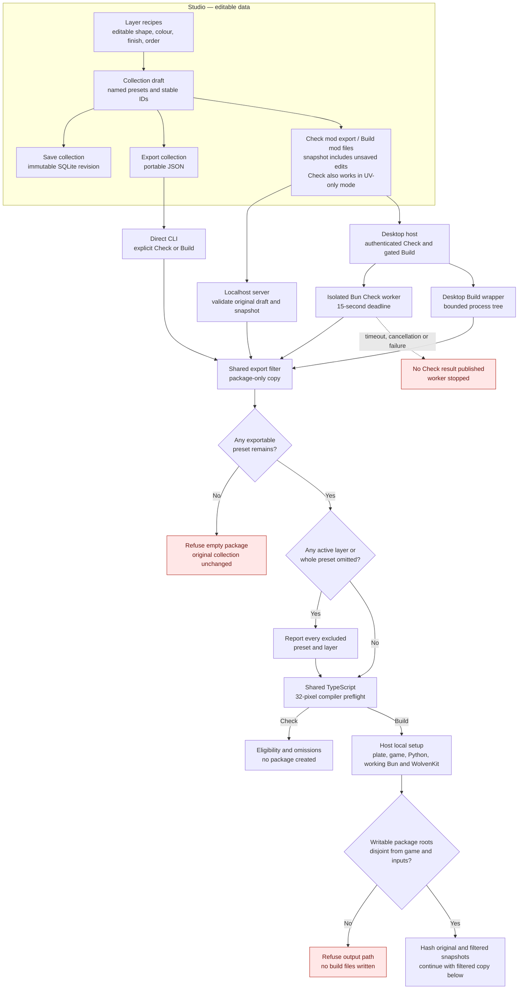
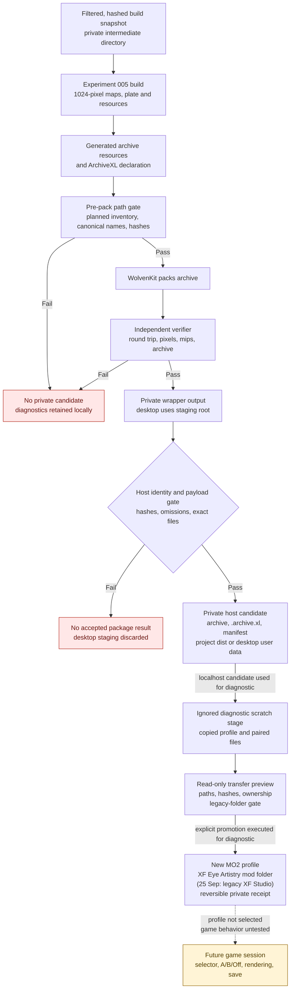
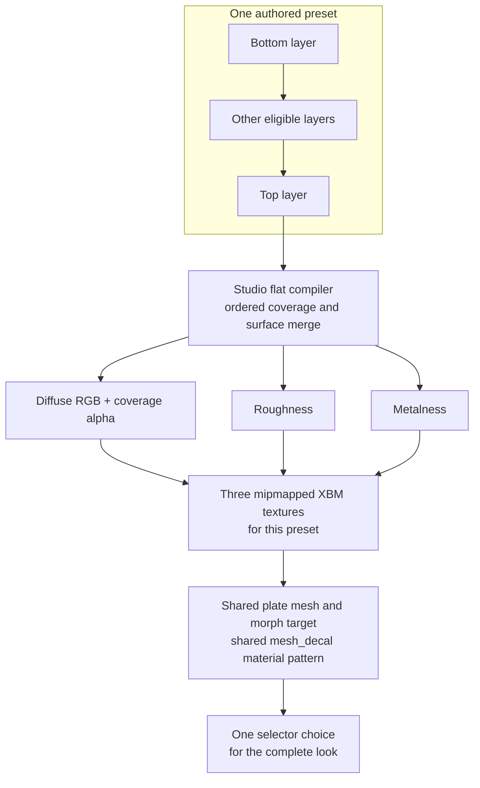

# From XF Studio collection to a Cyberpunk mod candidate

25 September 2026. This is a map of the **current local pipeline**, for a reviewer who knows the idea of a mod but not the file formats. Build produces an offline-verified, private **candidate**. One diagnostic copy has been placed in a new MO2 profile, but that profile has not been selected or observed rendering in Cyberpunk 2077. “Loadable” here means the expected archive/declaration files have been built and independently unpacked and checked; it does **not** mean ArchiveXL registration, selector switching, visual fidelity or save persistence have passed an in-game test.

The short version: the Studio saves editable makeup as data. Check and Build make a package-only copy that omits active layers with unsupported finishes and presets left without active exportable layers. They report every omission while leaving the authored collection untouched. Build then merges each retained preset's visible layers into three 1024-pixel texture maps, attaches those maps to one shared eye-plate material pattern, writes a character-creator selector with an Off choice, packs the resources, independently checks the package, and places only a verified copy in a host-owned private candidate directory. Localhost uses the project's ignored `dist/`; desktop uses private Electrobun user data. Build does not install files; the separately invoked diagnostic transfer copied one **localhost** candidate pair into a new MO2 profile and mod. [Product decision](../../projects/xf-studio/data/product-direction.md), [local build boundary](local-package-build.md), [runtime test card](../../docs/validation.md#prepared-single-session-test-card).

## The pipeline at a glance

Solid arrows below are implemented local data/build steps. The final dashed arrow is **work still to be observed in game**. A red rejection means no eligible preset remains; structural or integrity failures also prevent promotion. A partial result carries explicit omissions. The first diagram follows authoring through eligibility; the second begins with the same validated build snapshot.





The diagram has entries into the same TypeScript filter from a localhost Studio request, an authenticated desktop request and an exported collection JSON file explicitly passed to the CLI. All use the same filter and 32-pixel compiler preflight; the arrows show this shared policy, not one shared running process. **Check mod export** stops after eligibility and needs no plate, WolvenKit, game file or 3D preview. The desktop host runs Check in a fresh bundled Bun worker, with a 15-second deadline; timeout or cancellation publishes no result. **Build mod files** uses the same partial-export filter and Python resource/verifier pipeline in either host. Desktop checks readiness before starting that work: its asset-free packaged code bundle, configured Python with NumPy/Pillow, WolvenKit, private plate and game inputs must pass. A bounded probe also executes a small script through the selected Bun path (or Electrobun's main executable when unset); file presence alone cannot enable Build. The browser sends the action and collection snapshot, with no tool or output paths. Desktop keeps its writable work, staging and candidate roots under Electrobun user data, disjoint from the configured game, MO2 and all input paths. The read-only packaged tools legitimately share the Electrobun channel root, so the gate checks each writable package subtree rather than rejecting that common parent. Build stops a timed-out or cancelled process tree and removes per-build intermediates. It verifies wrapper output against the original and filtered identities, exact archive/XL file set, lengths and SHA-256 values before moving the staged candidate into the private candidate store. A disposable installed canary completed the authenticated host Build route with four presets and 16 independently verified resources. Its archive payloads match the earlier localhost candidate after independent unbundling, but archive-file hashes differ because the index records build times. Localhost retains its server overrides and project dist root. [Installed trial](../../projects/xf-studio/authoring/desktop/README.md), [server boundary](../../projects/xf-studio/authoring/src/package-server.ts), [result identity gate](../../projects/xf-studio/authoring/src/package-result-verifier.ts), [desktop adapter](../../projects/xf-studio/authoring/desktop/package.ts), [shared preflight](../../projects/xf-studio/authoring/src/package-preflight.ts), [local setup](../../projects/xf-studio/authoring/LOCAL-SETTINGS.md), [CLI](../../projects/xf-studio/authoring/tools/build_collection_package.py).

Separate disposable installed WebView2 trials exercised the visible editor. One completed an edit, Undo, SQLite Save, Check and a **Build now** click for one preset with zero omissions; the private manifest matched its archive and ArchiveXL file hashes, and Check after Build returned the same filtered snapshot hash. Another verified that saved and unsaved collection work and selection survived full close/relaunch after the desktop workspace storage repair, then imported a prepared five-file private preview set and reached Ready. Those are installed-app UI and offline package observations, not a game session or evidence that an immediate close during a pending workspace save is safe. [Installed WebView2 record](../../projects/xf-studio/authoring/desktop/README.md#installed-webview-acceptance-and-restart-repair-25-september).

## What each kind of data means

| Thing | What it contains | What it is **not** |
|---|---|---|
| Recipe | A versioned, editable ordered layer stack: contours, warp fields, pigment/softness, colour, opacity and finish. Current schemas include `xfs/recipe-6` through `xfs/recipe-10`; legacy recipes migrate on read. | A texture, mod or saved V. The browser preview resolution is independent of the recipe. |
| Collection | `xfas/collection-1` JSON with a stable collection UUID and named preset UUIDs/revisions, each carrying a recipe. The `xfas` schema name is retained for compatibility after the XF Studio rename. | A game selector by itself. It can travel between Studio installations. |
| Workspace draft | Unsaved collection edits plus editor selections and preview context, in origin-bound browser storage on localhost or a host-owned private workspace file on desktop. | A new SQLite revision or packaged mod. |
| SQLite revision | Explicit, immutable local library snapshot with conflict protection. | The latest browser draft unless the user saved it. |
| Package-only filtered snapshot | A validated copy with unsupported **active** layers removed and any now-empty preset removed. It keeps IDs/revisions of included presets; Check and Build use the same filter. | A change to the authored recipe, browser draft or SQLite library. |
| Build plan | Deterministic proposed resource names/paths for the **retained subset**. | An installable mod. |
| Intermediate build | Generated maps, JSON resources, conversion logs, packed archive and verifier evidence under ignored project `build/` for localhost, or private Electrobun user data for desktop. | Public distribution content. |
| Private candidate | Verified `.archive`, `.archive.xl` and a manifest in ignored project `dist/` for localhost, or private Electrobun `package-candidates/` for desktop. | An installed, activated or game-proven mod. |

The new-layer template starts with a mirrored four-point upper-lid contour and no warp field. Reset applies that same starting shape, while duplicate and imported or saved recipes retain their authored geometry. This changes only the recipe produced by future Add/Reset actions; the filter, compiler, package identities and historical four-layer startup recipe are unchanged. [Layer action](../../projects/xf-studio/authoring/src/layer-stack.ts), [template](../../projects/xf-studio/authoring/src/recipe.ts).

For example, the checked-in four-preset fixture has collection ID `0ec3546e-3fac-43e7-8c19-a65d20383d41`. Its namespace is `xfs_c0ec3546e3fac43e78c19a65d20383d41`. Preset `f25f8eb1-8a83-4f65-a111-b83086382c18` gets mesh appearance `xfs_pf25f8eb18a834f65a111b83086382c18` and selector appearance `xfs_c0ec3546e3fac43e78c19a65d20383d41__xfs_pf25f8eb18a834f65a111b83086382c18`. Renaming that preset keeps these UUID-derived identities; reordering changes its index, whose save behavior remains unproven. This fixture is an example, not a required preset catalogue. [Identity planner](../../projects/xf-studio/authoring/src/preset-collection.ts), [fixture](../../experiments/005-preset-collection/editor-collection.json).

## Where layers become one look

**The merge happens in the Studio compiler, before WolvenKit and before ArchiveXL.** One preset is evaluated at 1024 × 1024 texels. Only enabled layers with opacity above zero participate. Their masks use the same recipe evaluator as the browser/PNG path. The compiler walks the layers bottom-to-top, applies each layer's colour and coverage, and accumulates colour, roughness, metalness and coverage in destination-channel space. It then emits **one diffuse map, one roughness map and one metalness map for that preset**, regardless of how many eligible layers the preset contains. There is no separate game selector for each layer. The current adapter is `mesh-decal-flat-v1` and its Matte/Satin/Metallic parameters are provisional. Diffuse alpha stores the square root of coverage for the inspected `mesh_decal.mt` path; the two scalar maps carry roughness and metalness. Normal contribution is disabled. [Compiler](../../projects/xf-studio/authoring/src/preset-compiler.ts), [raster evaluator](../../projects/xf-studio/authoring/src/recipe.ts).



Currently only active **Matte, Satin** (stored as `regular`) **and Metallic** enter the flat package. Shimmer, Glitter, Glossy and Colour-shifting are meaningful **browser previews** but have no faithful production game adapter. The package filter omits those active layers, then omits any preset left without active exportable layers. Check and Build both report each excluded layer and whole preset; they refuse the collection only when no exportable preset remains. A disabled or zero-opacity experimental layer does not contribute and is not reported as an omission. The compiler itself still strictly rejects unsupported active layers if called without the package filter; it never silently flattens them. The individual **Export mask** command is a different output: a 2048 × 2048 white-RGB/coverage-alpha PNG for one layer, independent of its enabled state and not the three-map preset package. Preview quality at 512/1K/2K/4K changes generated browser textures only. [Package filter](../../projects/xf-studio/authoring/src/package-filter.ts), [compiler gate](../../projects/xf-studio/authoring/src/preset-compiler.ts).

## How those maps become game resources

`bake_collection.ts` validates the collection, plans its names, calls the flat compiler at 1024 for each preset, and writes three hashed raw maps plus `plan.json` and `compiled.json`. Experiment 005 computes a complete mip chain from those maps, writes DDS inputs, and asks WolvenKit to import colour as gamma-aware XBM and scalar maps as linear XBM. It serializes the local source plate mesh/morph, changes **resource references and appearance/material metadata**, then deserializes the new resources. It does not reskin or reshape the source geometry during this package step. The independent verifier compares the mesh render blob/bone data and morph blob/105 targets with the source after a WolvenKit round trip. This preserves the known source data but does not resolve the remaining eyelid-contact problem. [Bake adapter](../../projects/xf-studio/authoring/tools/bake_collection.ts), [resource builder](../../experiments/005-preset-collection/build.py), [verifier](../../experiments/005-preset-collection/verify.py).

The resource graph is deliberately small:

- **One** `xfs_collection.inkcharcustomization` supplies one female head customization option. Its label (`localizedName`) is the mod's name, **XF Eye Artistry** (see [Mod name and MO2 folder](#mod-name-and-mo2-folder)). Its definitions list index `0` as `xfs_off`, followed by one entry per authored preset, with display names from the collection. Current tags name New Game, HairDresser and Ripperdoc contexts in the resource; actual availability in those contexts, and whether the character creator shows the raw label text, are untested.
- **One** `xfs_collection.app` holds an Off definition with no components and a shared template definition with one `entMorphTargetSkinnedMeshComponent`. The preset selector names carry a suffix that the inspected ArchiveXL rules are expected to expand through the template. The independent verifier checks this **source-derived expansion model**; it does not run ArchiveXL.
- **One** copied/referenced `xfs_eye_plate.mesh` and **one** `xfs_eye_plate.morphtarget` serve the collection. The morph resource points to the new mesh path and seed appearance. The model retains 105 morphs, native skin data and one material entry. A single `base/materials/mesh_decal.mt` local material instance uses soft texture paths with `{material}` substitution. Each preset adds a mesh appearance identity and its own three XBM textures, not a separate plate copy.
- **One** `.archive.xl` text declaration tells ArchiveXL about the female customization resource and scope in `player_customization.app`. The `.archive` holds the binary resources. The declaration is beside the archive in `archive/pc/mod/`, not inside it.

For a package of **N retained** presets, the intended resource count is `4 + 3N`: mesh, morph, app and customization plus three XBM maps per preset. The unchanged four-preset fixture has 16 unpacked resources, four mesh appearances, four selector looks **plus Off**, and one shared material template. In a local partial-export test, making the fixture's first preset Glitter-only retained three presets and verified 13 unpacked resources; the omitted preset kept its authored ID in the original source but received no selector entry. These are verifier results, not observed game options. [Experiment 005](../../experiments/005-preset-collection/README.md), [source build](../../experiments/005-preset-collection/build.py).

The localhost output tree is conceptually:

```text
projects/xf-studio/dist/<namespace>-<unique-build-time>/
  manifest.json                         local identity, hash and proof record
  archive/pc/mod/
    <namespace>.archive                 packed game resources
    <namespace>.archive.xl              ArchiveXL registration/scope text

Inside the archive (for collection 0ec3546e-…):
  axefrog/appearance_studio/collections/0ec3546e…/
    xfs_collection.app
    xfs_collection.inkcharcustomization
    models/xfs_eye_plate.mesh
    models/xfs_eye_plate.morphtarget
    textures/xfs_p<f25…>_diffuse.xbm
    textures/xfs_p<f25…>_roughness.xbm
    textures/xfs_p<f25…>_metalness.xbm
    ...three textures for each other preset
```

Desktop writes the same three candidate files under its private Electrobun `userData/package-candidates/<namespace>-<unique-build-time>/`. Its snapshot, work and staging subtrees are temporary and are removed after the result gate. The desktop installer carries only asset-free tools; it does not include the plate or generated package.

The exact real texture filenames concatenate `xfs_p` with the **full hyphenless preset UUID**; the abbreviated examples above are for reading only. Every newly generated archive appearance name starts with lowercase `xfs_`. The original imported plate filenames retain their historical `xfas_` names **as local inputs**; packaged outputs use the new namespace. [Naming contract](../../projects/xf-studio/data/naming.md), [planner](../../projects/xf-studio/authoring/src/preset-collection.ts).

### Mod name and MO2 folder

XF Studio is the app; the eye-makeup mod it builds is **XF Eye Artistry**. That name is the in-game selector label, the MO2 mod entry and folder, and the name the Studio shows for the package. It is display text only: the `xfs_` resource names, UUID-derived namespace, schema IDs and `axefrog/appearance_studio` depot root do not change with it.

One constant, `EYE_MAKEUP_MOD` in [`src/mod-branding.ts`](../../projects/xf-studio/authoring/src/mod-branding.ts), defines it. The planner copies it into the export plan as `modName` and `selectorLabel`. Check reports both. Experiment 005's builder writes `selectorLabel` into the customization option and refuses a plan without an XF-branded label. The independent verifier checks the converted option's label against the plan. The wrapper compares the built plan's names with the Check summary and records both in the manifest. The host result gate rejects a manifest or result whose names differ from the current plan. The MO2 install transport, diagnostic stage and promotion tools use `modName` as the dedicated folder and modlist entry. Experiment 011 derives its diagnostic label ("XF Eye Artistry Shimmer diagnostic") from the same plan. A test fails if another TypeScript module or the Python builder spells the name itself.

The 25 September diagnostic promotion predates this name. It created the MO2 folder `XF Studio`, and its candidate's selector still reads `XF Studio · Eye makeup`. The tools treat `XF Studio` as a **legacy folder of the same mod**:

- Install and promotion refuse while an `XF Studio` folder exists (case-insensitive), so a second copy is never created beside it. Roll back that promotion, or remove the folder in MO2, first.
- A source profile that enables `XF Studio` is refused as already enabling XF Eye Artistry. The stage planner reports a legacy folder or modlist entry and adds a caution.
- Recovery and rollback still accept a promotion record naming the legacy folder, so the 25 September promotion remains reversible. Any other folder name in a record is refused.
- A scratch stage prepared under the legacy folder name must be staged again before promotion.

The legacy development mod `XF Eye Artistry CCXL - Dev` is a different, older mod. The diagnostic clone disables it as before; it is not treated as an earlier install.

## What Check, Build and Verify each prove

1. **Check mod export** validates the complete collection, filters a package-only copy, and runs a small 32-pixel compile for each retained preset. It reports the original preset count, packaged identities, every omitted layer/preset, and the filtered snapshot SHA-256. Check makes no archive or SQLite save. It does not need the plate/game/WolvenKit files. An invalid or empty collection, one above 16 MB, or one with no exportable preset fails. Desktop Check has a 15-second worker deadline and returns no result on timeout, cancellation or worker failure. This is an eligibility check, not a visual promise.
2. **Build mod files** captures the current Studio draft, even when it has unsaved edits, without creating a SQLite revision. The server accepts only a same-origin request on `127.0.0.1`, computes its own filtered plan and both original/filtered hashes, and writes a temporary original snapshot. The CLI checks that source has not changed, uses the **same filter**, then requires separate private build/dist roots outside the declared game, plate, source and tool directories before writing an immutable filtered build snapshot. Symlinks and Windows junctions in writable root paths are refused, including an `--output-root` link that would escape dist. Its source plate, WolvenKit and game paths come from private local settings or higher-priority server environment overrides, never browser package input. Unset build paths stay unset; there is no developer-specific fallback. Direct CLI use takes an exported collection file instead.
3. **Build conversion and pre-pack gate** produce the three texture maps per preset, full mip chains and mesh/morph/app/customization resources. Before calling WolvenKit's packer, Experiment 005 requires the physical generated tree to equal the planned `4 + 3N` resource paths exactly. Paths must already be lowercase, relative, slash-separated and made from archive-safe characters; no traversal, separator aliases, unsupported extension, symlink or path-hash collision is accepted. This avoids WolvenKit silently normalizing a name or skipping a file. Only then does it write `.archive`, `.archive.xl` and `build.json`. The build record includes per-recipe and map hashes, source plate path/hash entries, each archive member's canonical path, WolvenKit-compatible 64-bit path hash and SHA-256, and the packed archive hash. Localhost build output stays under ignored project `build/`; desktop uses private user-data work and staging roots that are removed after Build. The fixture's checked-in `latest-build.json` is not changed by this wrapper.
4. **Independent verification** is a separate Experiment 005 program. It rechecks the physical resource inventory against the plan and build record, then checks resource structure and names; preserved model and morph buffers; the Off/template/preset links; source-derived `{material}` texture paths; imported XBM metadata; decoded base-map colour/coverage/scalar tolerances; the entire decoded mip chain against coverage-space reductions; archive hash; and the exact set and SHA-256 of unpacked archive members. It reports `installed: false`, `gameRenderingVerified: false` and explicit limits. It cannot establish actual game shader filtering or executed ArchiveXL expansion.
5. **Promotion** happens only after the verifier succeeds. The wrapper compares the filtered plan identities and verification/archive hashes, copies just `.archive` and `.archive.xl` to a staging folder under the host's private dist root, writes `manifest.json`, checks the promoted archive hash and atomically renames staging to a unique final directory. The host then calls the shared result identity gate with its own dist root: it checks containment and confirms the manifest's original source hash, filtered snapshot hash, omission list, original count, retained preset identities and archive hash before returning the path. `--output-root` cannot direct a build outside the chosen private `--dist-root`. Desktop supplies a temporary staging root, then moves a passing candidate into `package-candidates/` and rechecks it there; it removes snapshot, work and staging roots on completion or failure. A failed preflight/verifier does not promote a candidate, and a host identity-gate failure returns no accepted result.

The `xfs/local-package-1` manifest identifies the mod name and selector label (`modName`, `selectorLabel`; absent from candidates built before the XF Eye Artistry name), the original collection SHA-256 and original preset count, the exact filtered snapshot SHA-256, each excluded layer/whole preset, packaged preset IDs/revisions/appearance names, verified file count, hashes and sizes of the archive and `.archive.xl`, and explicit `installed: false` / `gameRenderingVerified: false`. It currently does **not** record an explicit compiler version or complete toolchain/version/provenance lock; those are release-traceability gaps. WolvenKit may place timestamps in the archive index, so two builds from identical resource artifact paths/hashes can have different packed archive hashes. Compare source/resource hashes as well as the packed hash. [Local wrapper](../../projects/xf-studio/authoring/tools/build_collection_package.py), [recorded checkpoint](local-package-build.md#offline-checkpoint--24-september-2026).

The separate first-game diagnostic path copies the candidate pair and selected profile metadata into an ignored scratch root. A transfer planner reads that stage and shows exact destination paths, bytes, hashes, profile changes and collision gates without writing to MO2. After the fixture tests and live dry-run, its explicit action created the new `XF Studio diagnostic 2026-09-25` profile and dedicated `XF Studio` mod in the maintainer's MO2 instance. That run predates the XF Eye Artistry name; the folder is now treated as a legacy install of the same mod (see [Mod name and MO2 folder](#mod-name-and-mo2-folder)). The original `2025 (again)` modlist SHA-256 stayed unchanged, the promoted pair matched the candidate manifest, and a private completion receipt was written without a pending journal. MO2's selected profile was not changed. The transfer checks the source candidate against its manifest, the staged transport receipt and staged file hashes, source profile metadata, and current archive filename collisions. Its journal/receipt support conflict-aware recovery and rollback of only unchanged created paths. Neither stage nor transfer reruns the independent archive verifier; neither proves an archive winner or game behavior. [Transfer tool](../../projects/xf-studio/authoring/tools/runtime-diagnostic-promotion.ts), [prepared session card](../../docs/validation.md#prepared-single-session-test-card).

## Boundaries still needing evidence

The verifier's ArchiveXL path expansion is a **model inferred from inspected resource rules**, not a game execution trace. The archive pair is present in a diagnostic MO2 profile, but that profile has not been selected or launched. The single selector must still be observed appearing in the intended creator contexts; A → B → Off and B → A → Off must clear components correctly; re-entry/save/reload must preserve the intended preset identity; the on-head material and mip/filter response must be compared with game captures; and the plate must pass all relevant pose/contact gates. A proposed plate correction passed selected offline poses but failed the full 664-frame idle gate, so the current owned plate has no accepted new correction. Mixed optical finish export and faithful material mapping remain open. [Runtime checklist](../../docs/validation.md#prepared-single-session-test-card), [plate evidence](../../experiments/006-plate-clearance/research/dense-idle-contact-gate.md).

The package includes a locally derived CDPR plate resource. Its `build/` and `dist/` directories are ignored and private; do not commit, share or auto-deploy them as a release. A source clone lacks the private/local plate and other extracted assets needed for a full build. The current target is game 2.31 and stable ArchiveXL 1.27.3; installed versions and actual runtime-loaded versions must be checked separately before any game session. [Authoring setup](../../projects/xf-studio/authoring/README.md), [validation protocol](../../docs/validation.md).

## Maintenance and visual review record

After any change to collection/recipe schema, finish eligibility, map compilation, naming, `.app`/customization/ArchiveXL wiring, package guard, verifier, manifest or promotion, update the diagrams **and** the corresponding explanation in this guide in the same checkpoint. Render all three Mermaid diagrams and inspect them at normal reading width and at an enlarged width. Confirm that every node label is readable, branch direction and Check-versus-Build behavior are clear, the layer merge is located before packaging, and the dashed game boundary cannot be mistaken for completed validation. Compare the diagrams against the changed code and the output tree; record date, rendering tool, visual observations and any limits here. See the companion [AGENTS.md](../../AGENTS.md) rule.

| Date | Render/review method | Result |
|---|---|---|
| 2026-09-24 | Mermaid CLI 11.17.0 with Chrome; rendered all three diagrams to PNG, inspected full-size and 800px-wide versions. [Authoring](evidence/studio-to-mod-authoring-2026-09-24.png), [build](evidence/studio-to-mod-build-2026-09-24.png), [layer merge](evidence/studio-to-mod-merge-2026-09-24.png). | The first overview was too wide, so it was divided into authoring/preflight and build/verification diagrams; the merge diagram was made vertical. Labels, pass/fail branches and the dashed untested-game boundary remain legible at 800px. The authoring flow is tall and requires scrolling. All images are generated from documentation text and contain no game assets. |
| 2026-09-24, partial export | Mermaid CLI 11.17.0 with Chrome; rerendered all three and inspected original resolution and 800px-width images. [Updated authoring](evidence/studio-to-mod-authoring-partial-2026-09-24.png), [updated build](evidence/studio-to-mod-build-partial-2026-09-24.png); the [layer merge](evidence/studio-to-mod-merge-2026-09-24.png) remains visually unchanged. | The new No/Yes exportability branches, partial-warning path, Check/Build split, filtered snapshot, verifier failure and dashed untested-game boundary are visually distinct and legible at 800px. The authoring diagram remains vertically long. These renders contain no game assets. |
| 2026-09-24, archive path gate | Mermaid CLI 11.17.0 with Chrome; rendered all three current diagrams to temporary PNGs at 800px and 1600px and visually inspected both sizes. | The new pre-pack gate sits after resource generation and before WolvenKit pack; its Fail arrow joins No promotion, while Pass reaches the independent verifier. Check remains on the first diagram only. All labels, arrows, layer merge and the dashed untested-game boundary were legible at normal and enlarged widths. Temporary renders were asset-free and remain ignored under project `build/`; no new visual files were committed. |
| 2026-09-24, new-layer contour | Mermaid CLI 11.17.0 with Chrome; rendered all three diagrams to ignored 800px and 1600px PNGs and visually inspected both sizes. | The updated editable-recipe label is readable. The Check and Build branches still diverge after the shared preflight; eligible layers merge before resources are packed; failure paths end without promotion; and the dashed game-session arrow remains visibly unproven. The tall authoring diagram still requires scrolling at normal width. No game-derived pixels were committed. |
| 2026-09-24, local package setup | Mermaid CLI 11.17.0 with Chrome; rendered all three diagrams to ignored 800px and 1600px PNGs and visually inspected both sizes. | The new host setup node is legible solely on the Build branch, with Check ending separately. All arrows and labels remain readable; eligible layers still merge before packing and the dashed game-session boundary remains unproven. The authoring overview remains tall at ordinary reading width. |
| 2026-09-25, desktop Check | Mermaid CLI 11.17.0 with Chrome; rendered all three current diagrams to ignored 800px and 1600px PNGs, then visually inspected normal and enlarged renderings. | The authoring diagram now shows localhost and desktop entering the same filter/preflight. The desktop label states Check only and Build unavailable; the localhost Build branch alone reaches setup and the resource pipeline. The first draft's separate desktop-unavailable arrow looked as though it emerged from localhost, so it was folded into the desktop node and rerendered. Labels, No/Yes arrows, layer merge, verifier failure and dashed untested-game boundary are readable at ordinary width. The overview remains tall; no private images or resources were rendered. |
| 2026-09-25, bounded desktop Check | Mermaid CLI 11.17.0 with Chrome; rendered all three diagrams to ignored PNGs at 800px and 1600px and visually inspected both sizes. | The new desktop worker and dashed timeout/failure branch are legible at normal width. Desktop Check still enters the shared filter while only localhost Build reaches setup and resources. The 32-pixel preflight, omissions, layer merge before packaging, no-promotion failure branches and dashed untested-game boundary remain clear. The authoring diagram remains tall. These renders contain no private resources. |
| 2026-09-25, diagnostic transfer | Mermaid CLI 11.17.0 with Chrome; rendered all three diagrams to ignored PNGs with 800px and 1600px width requests and visually inspected normal and enlarged views. | The build diagram reads from private dist candidate through ignored scratch stage and read-only transfer preview to an explicitly invoked new MO2 profile/mod. The final dashed arrow labels the real-MO2 action and game session unexecuted. The failure label says no *dist candidate* to distinguish build failure from later transfer. Check/Build and the pre-pack layer merge remain readable. Mermaid kept diagrams two and three at intrinsic widths for both requests; enlarged viewing confirmed labels and arrows. Text-only renders remain ignored. |
| 2026-09-25, portable result gate | Mermaid CLI 11.17.0 with Chrome; rendered all three diagrams to ignored PNGs at 800px and 1600px requests and visually inspected each at normal and enlarged size. | The new host manifest gate follows the private dist candidate, with its Fail branch ending at no accepted result while the independent verifier's Fail branch still ends before dist. Labels and directions are readable. Check remains separate from localhost Build; eligible layers merge before resources, and the final game-session arrow remains dashed. Mermaid kept the merge diagram at intrinsic width. No private inputs entered the renders. |
| 2026-09-25, isolated MO2 promotion | Mermaid CLI 11.17.0 with Chrome; rerendered all three current diagrams to ignored PNGs at 800px and 1600px requests and visually inspected them at normal and enlarged widths. | The build diagram now distinguishes the completed diagnostic promotion from the dashed, untested game session. The host result gate and its failure branch remain legible; the authoring diagram still separates Check from localhost Build and shows the path guard before snapshot writing. The layer merge remains ahead of packaging. Mermaid kept build and merge at intrinsic widths for both requests; the authoring diagram widened at 1600px. No private assets entered the renders. |
| 2026-09-25, private-root gate | Mermaid CLI 11.17.0 with Chrome; rendered all three diagrams to ignored PNGs at 800px and 1600px requests and visually inspected each at normal and enlarged size. | The new root decision sits on localhost Build after setup; its No arrow ends before the filtered snapshot and its Yes arrow continues to it. Check ends before this gate. Labels, arrow directions, omissions, independent verifier, layer merge and the dashed untested-game boundary are readable. The authoring diagram remains tall. No private inputs entered the renders. |
| 2026-09-25, desktop Build host | Mermaid CLI 11.17.0 with Chrome; rendered all three diagrams to temporary 800px and 1600px PNGs and visually inspected normal and enlarged views. | The desktop Check worker and separate bounded Build wrapper visibly converge at the shared filter. The Check/Build split, omitted-layer branch and private-root refusal remain clear. In the build diagram, the host gate follows wrapper output; desktop staging is discarded on failure and the candidate follows only a passing result. The layer merge remains before packing, and the game-session arrow remains dashed. The first diagram is tall; Mermaid kept the build and merge diagrams near intrinsic width despite the larger request. No private assets entered the renders. |
| 2026-09-25, Bun readiness gate | Mermaid CLI 11.17.0 with Chrome; rerendered all three diagrams to temporary 800px and 1600px PNGs and visually inspected normal and enlarged views. | The Build setup node now names a working Bun and WolvenKit. It remains separate from the Check-only result, with the private-root decision after setup. The desktop worker and Build wrapper both enter the shared filter; omissions, layer merge before packing, verifier failure and dashed untested-game boundary remain readable. The authoring diagram is tall; the other two retained intrinsic width on enlargement. No private assets entered the renders. |
| 2026-09-25, installed desktop Build | Mermaid CLI 11.17.0 with Chrome; rendered all three diagrams to temporary 800px and 1600px PNGs and visually inspected each at both sizes. | The Build path now labels the **writable package roots** as disjoint, while read-only Electrobun tools may share the channel parent. Check still terminates before setup; the desktop Check worker and Build wrapper converge at the shared filter. Omissions, the pre-pack layer merge, verifier failure, host result gate and dashed untested-game branch remain legible and directionally correct. The first diagram is tall at normal width; diagrams two and three retained intrinsic width when the viewport grew. No private resource entered the renders. |
| 2026-09-25, host candidate and installed UI sync | Mermaid CLI 11.17.0 with Chrome; rendered all three diagrams to ignored PNGs at an 800px width request and an enlarged 1600px request at scale 2. Visually inspected both renderings for each. | The authoring diagram now shows that UV-only Check and explicit JSON CLI input reach the shared policy, while Build continues to local setup. The build diagram labels the host-owned private candidate and the **localhost** candidate used for diagnostic MO2 promotion; failed gates have no accepted candidate. The layer merge remains before resource packing, and the final game-session arrow is dashed. Labels and directions are readable at normal and enlarged sizes. The authoring overview still requires vertical scrolling; Mermaid kept the build and merge diagrams at intrinsic width for the 800px request, so scale 2 supplied a real enlarged view. Temporary renders contain only text and remain ignored under authoring `build/`. |
| 2026-09-25, XF Eye Artistry mod name | Mermaid CLI 11.17.0 with Chrome; rendered all three diagrams to temporary PNGs at an 800px width request and a 1600px request at scale 2 (outside the repository), and visually inspected normal and enlarged views, including an enlarged crop of the build diagram's lower half. | Only the build diagram changed. Its transfer preview names the legacy-folder gate, and the promotion node names the dedicated XF Eye Artistry folder and notes the 25 September run's legacy `XF Studio` folder. The first render wrapped both labels into broken fragments ("ownership / and", "XF Studio" alone on a line), so the labels were shortened and rendered again; all lines now wrap cleanly. The arrows still run from candidate through scratch stage and preview to promotion. The final game-session arrow stays dashed and labelled untested. The authoring and merge diagrams are unchanged and still readable: Check ends before setup, the root gate's No branch ends before the snapshot, and layers merge before packing. The authoring diagram remains tall. Text-only renders; nothing committed. |

Primary implementation sources: [recipe](../../projects/xf-studio/authoring/src/recipe.ts), [collection plan](../../projects/xf-studio/authoring/src/preset-collection.ts), [flat compiler](../../projects/xf-studio/authoring/src/preset-compiler.ts), [package server](../../projects/xf-studio/authoring/src/package-server.ts), [CLI wrapper](../../projects/xf-studio/authoring/tools/build_collection_package.py), [Experiment 005 builder](../../experiments/005-preset-collection/build.py) and [independent verifier](../../experiments/005-preset-collection/verify.py). The guide explains the code as checked on this date; it is not a runtime observation.
