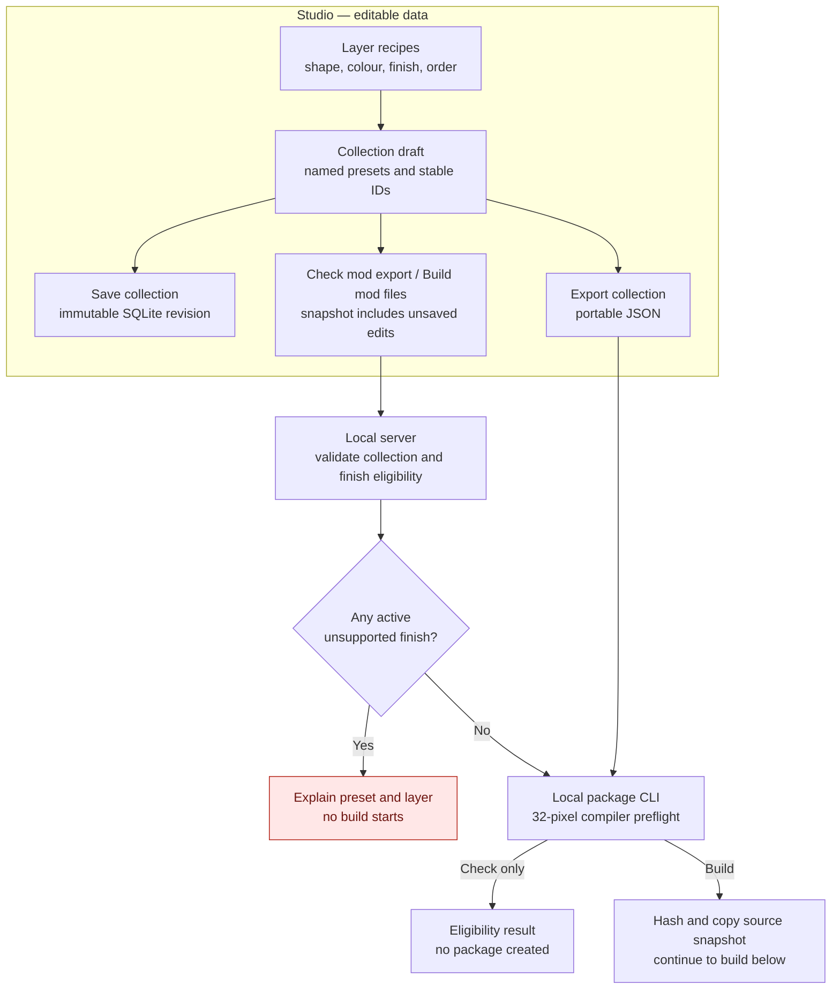
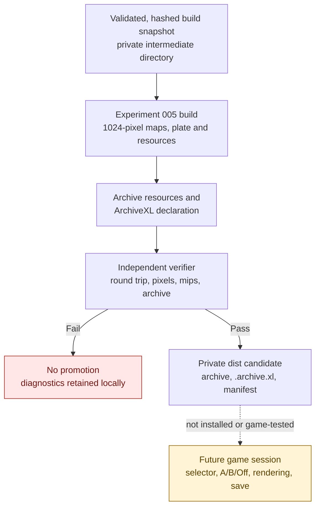
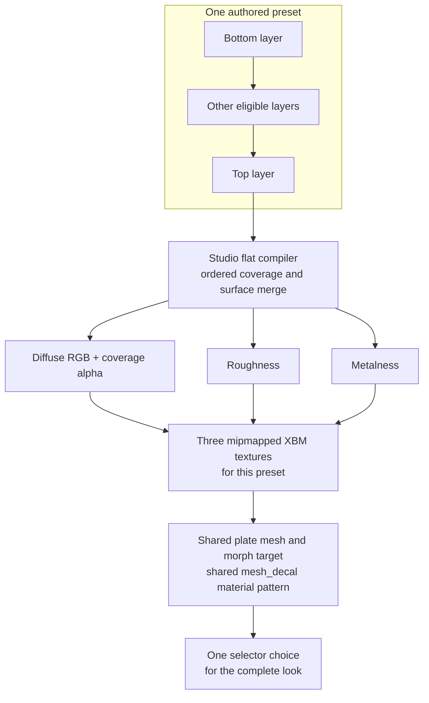

# From XF Studio collection to a Cyberpunk mod candidate

24 September 2026. This is a map of the **current local pipeline**, for a reviewer who knows the idea of a mod but not the file formats. The result is an offline-verified, private **candidate**. No XF Studio package has yet been installed and observed rendering in Cyberpunk 2077. “Loadable” here means the expected archive/declaration files have been built and independently unpacked and checked; it does **not** mean ArchiveXL registration, selector switching, visual fidelity or save persistence have passed an in-game test.

The short version: the Studio saves editable makeup as data. When asked to build, it merges each preset's eligible visible layers into three 1024-pixel texture maps, attaches those maps to one shared eye-plate material pattern, writes a character-creator selector with an Off choice, packs the resources, independently checks the package, and places only a verified copy in a private `dist` folder. It never installs the files. [Product decision](../../projects/xf-appearance-studio/data/product-direction.md), [local build boundary](local-package-build.md), [runtime test card](../../docs/validation.md#prepared-single-session-test-card).

## The pipeline at a glance

Solid arrows below are implemented local data/build steps. The final dashed arrow is **work still to be observed in game**. A red rejection stops before any package is promoted. The first diagram follows authoring through eligibility; the second begins with the same validated build snapshot.





The diagram has two independent entries into the same CLI: a Studio request and an exported collection JSON file. **Check mod export** stops after validation and a small 32-pixel compile; it does not require the local plate, WolvenKit or game files. **Build mod files** needs those inputs and takes longer. Studio requests pass a validated collection snapshot to a same-origin localhost server. The browser cannot choose executables, source-resource paths or output paths. The server runs one build at a time and checks the returned identity and manifest against its own snapshot. An exported collection goes to the same Python CLI manually. [Server boundary](../../projects/xf-appearance-studio/authoring/src/package-server.ts), [CLI](../../projects/xf-appearance-studio/authoring/tools/build_collection_package.py).

## What each kind of data means

| Thing | What it contains | What it is **not** |
|---|---|---|
| Recipe | A versioned, editable ordered layer stack: contours, warp fields, pigment/softness, colour, opacity and finish. Current schemas include `xfs/recipe-6` through `xfs/recipe-10`; legacy recipes migrate on read. | A texture, mod or saved V. The browser preview resolution is independent of the recipe. |
| Collection | `xfas/collection-1` JSON with a stable collection UUID and named preset UUIDs/revisions, each carrying a recipe. The `xfas` schema name is retained for compatibility after the XF Studio rename. | A game selector by itself. It can travel between Studio installations. |
| Browser draft | Unsaved collection edits plus editor selections and preview context in local workspace storage. | A new SQLite revision or packaged mod. |
| SQLite revision | Explicit, immutable local library snapshot with conflict protection. | The latest browser draft unless the user saved it. |
| Build plan | Deterministic proposed resource names/paths for one collection. | An installable mod. |
| Intermediate build | Generated maps, JSON resources, conversion logs, packed archive and verifier evidence in ignored `build/`. | Public distribution content. |
| `dist` candidate | Verified `.archive`, `.archive.xl` and a manifest in ignored project `dist/`. | An installed, activated or game-proven mod. |

For example, the checked-in four-preset fixture has collection ID `0ec3546e-3fac-43e7-8c19-a65d20383d41`. Its namespace is `xfs_c0ec3546e3fac43e78c19a65d20383d41`. Preset `f25f8eb1-8a83-4f65-a111-b83086382c18` gets mesh appearance `xfs_pf25f8eb18a834f65a111b83086382c18` and selector appearance `xfs_c0ec3546e3fac43e78c19a65d20383d41__xfs_pf25f8eb18a834f65a111b83086382c18`. Renaming that preset keeps these UUID-derived identities; reordering changes its index, whose save behavior remains unproven. This fixture is an example, not a required preset catalogue. [Identity planner](../../projects/xf-appearance-studio/authoring/src/preset-collection.ts), [fixture](../../experiments/005-preset-collection/editor-collection.json).

## Where layers become one look

**The merge happens in the Studio compiler, before WolvenKit and before ArchiveXL.** One preset is evaluated at 1024 × 1024 texels. Only enabled layers with opacity above zero participate. Their masks use the same recipe evaluator as the browser/PNG path. The compiler walks the layers bottom-to-top, applies each layer's colour and coverage, and accumulates colour, roughness, metalness and coverage in destination-channel space. It then emits **one diffuse map, one roughness map and one metalness map for that preset**, regardless of how many eligible layers the preset contains. There is no separate game selector for each layer. The current adapter is `mesh-decal-flat-v1` and its Matte/Satin/Metallic parameters are provisional. Diffuse alpha stores the square root of coverage for the inspected `mesh_decal.mt` path; the two scalar maps carry roughness and metalness. Normal contribution is disabled. [Compiler](../../projects/xf-appearance-studio/authoring/src/preset-compiler.ts), [raster evaluator](../../projects/xf-appearance-studio/authoring/src/recipe.ts).



Currently only active **Matte, Satin** (stored as `regular`) **and Metallic** pass the flat export gate. Shimmer, Glitter, Glossy and Colour-shifting are meaningful **browser previews** but have no faithful production game adapter; the preflight names the affected preset/layer and rejects them. A disabled or zero-opacity experimental layer does not contribute and does not block the compiler. The individual **Export mask** command is a different output: a 2048 × 2048 white-RGB/coverage-alpha PNG for one layer, independent of its enabled state and not the three-map preset package. Preview quality at 512/1K/2K/4K changes generated browser textures only. [Finish gate](../../projects/xf-appearance-studio/authoring/src/preset-compiler.ts), [preflight message evidence](../../projects/xf-appearance-studio/authoring/evidence/mod-export-preflight-2026-09-24.md).

## How those maps become game resources

`bake_collection.ts` validates the collection, plans its names, calls the flat compiler at 1024 for each preset, and writes three hashed raw maps plus `plan.json` and `compiled.json`. Experiment 005 computes a complete mip chain from those maps, writes DDS inputs, and asks WolvenKit to import colour as gamma-aware XBM and scalar maps as linear XBM. It serializes the local source plate mesh/morph, changes **resource references and appearance/material metadata**, then deserializes the new resources. It does not reskin or reshape the source geometry during this package step. The independent verifier compares the mesh render blob/bone data and morph blob/105 targets with the source after a WolvenKit round trip. This preserves the known source data but does not resolve the remaining eyelid-contact problem. [Bake adapter](../../projects/xf-appearance-studio/authoring/tools/bake_collection.ts), [resource builder](../../experiments/005-preset-collection/build.py), [verifier](../../experiments/005-preset-collection/verify.py).

The resource graph is deliberately small:

- **One** `xfs_collection.inkcharcustomization` supplies one female head customization option. Its definitions list index `0` as `xfs_off`, followed by one entry per authored preset, with display names from the collection. Current tags name New Game, HairDresser and Ripperdoc contexts in the resource; actual availability in those contexts is untested.
- **One** `xfs_collection.app` holds an Off definition with no components and a shared template definition with one `entMorphTargetSkinnedMeshComponent`. The preset selector names carry a suffix that the inspected ArchiveXL rules are expected to expand through the template. The independent verifier checks this **source-derived expansion model**; it does not run ArchiveXL.
- **One** copied/referenced `xfs_eye_plate.mesh` and **one** `xfs_eye_plate.morphtarget` serve the collection. The morph resource points to the new mesh path and seed appearance. The model retains 105 morphs, native skin data and one material entry. A single `base/materials/mesh_decal.mt` local material instance uses soft texture paths with `{material}` substitution. Each preset adds a mesh appearance identity and its own three XBM textures, not a separate plate copy.
- **One** `.archive.xl` text declaration tells ArchiveXL about the female customization resource and scope in `player_customization.app`. The `.archive` holds the binary resources. The declaration is beside the archive in `archive/pc/mod/`, not inside it.

For a collection of **N** presets, the intended resource count is `4 + 3N`: mesh, morph, app and customization plus three XBM maps per preset. The four-preset fixture therefore has 16 unpacked resources, four mesh appearances, four selector looks **plus Off**, and one shared material template. These are verifier results, not observed game options. [Experiment 005](../../experiments/005-preset-collection/README.md), [source build](../../experiments/005-preset-collection/build.py).

The output tree is conceptually:

```text
projects/xf-appearance-studio/dist/<namespace>-<unique-build-time>/
  manifest.json                         local identity, hash and proof record
  archive/pc/mod/
    <namespace>.archive                 packed game resources
    <namespace>.archive.xl              ArchiveXL registration/scope text

Inside the archive (for collection 0ec3546e-…):
  axefrog/appearance_studio/collections/0ec3546e…/
    xfs_collection.app
    xfs_collection.inkcharcustomization
    models/xfs_eye_plate.mesh
    models/xfs_eye_plate.morphtarget
    textures/xfs_p<f25…>_diffuse.xbm
    textures/xfs_p<f25…>_roughness.xbm
    textures/xfs_p<f25…>_metalness.xbm
    ...three textures for each other preset
```

The exact real texture filenames concatenate `xfs_p` with the **full hyphenless preset UUID**; the abbreviated examples above are for reading only. Every newly generated archive appearance name starts with lowercase `xfs_`. The original imported plate filenames retain their historical `xfas_` names **as local inputs**; packaged outputs use the new namespace. [Naming contract](../../projects/xf-appearance-studio/data/naming.md), [planner](../../projects/xf-appearance-studio/authoring/src/preset-collection.ts).

## What Check, Build and Verify each prove

1. **Check mod export** validates the collection and active finish support. For a Studio request the local server checks finish names first; the CLI also runs a small 32-pixel compile for every preset. Check makes no archive or SQLite save. It does not need the plate/game/WolvenKit files. An invalid or empty collection and a collection above 16 MB fail. This is an eligibility check, not a visual promise.
2. **Build mod files** captures the current Studio draft, even when it has unsaved edits, without creating a SQLite revision. The server accepts only a same-origin request on `127.0.0.1`, computes its own collection plan and SHA-256, and writes a temporary snapshot. The CLI hashes the source file, validates it, checks that it has not changed, and copies it to an ignored intermediate snapshot. Its source plate, WolvenKit and game paths come from the **server environment**, never browser input. Direct CLI use takes an exported collection file instead.
3. **Build conversion** produces the three texture maps per preset, full mip chains, mesh/morph/app/customization resources, `.archive`, `.archive.xl`, and `build.json`. That build record includes per-recipe and map hashes, source plate path/hash entries, archive-member path/hashes and the packed archive hash. Build output stays under ignored project `build/`; the fixture's checked-in `latest-build.json` is not changed by this wrapper.
4. **Independent verification** is a separate Experiment 005 program. It checks resource structure and names; preserved model and morph buffers; the Off/template/preset links; source-derived `{material}` texture paths; imported XBM metadata; decoded base-map colour/coverage/scalar tolerances; the entire decoded mip chain against coverage-space reductions; archive hash; and every unpacked archive member against its recorded hash. It reports `installed: false`, `gameRenderingVerified: false` and explicit limits. It cannot establish actual game shader filtering or executed ArchiveXL expansion.
5. **Promotion** happens only after the verifier succeeds. The wrapper compares the plan identities and verification/archive hashes, copies just `.archive` and `.archive.xl` to a staging folder under ignored `dist/`, writes `manifest.json`, checks the promoted archive hash and atomically renames staging to a unique final directory. The server then checks that directory is within project `dist/`, confirms the manifest's collection ID, source hash, namespace, preset IDs/revisions/appearances and file hash, and returns the path. `--output-root` cannot direct a build into the game or MO2 directory. A failed preflight/verifier does not promote a candidate.

The `xfs/local-package-1` manifest identifies the collection and source SHA-256, preset IDs/revisions/appearance names, verified file count, hashes and sizes of the archive and `.archive.xl`, and explicit `installed: false` / `gameRenderingVerified: false`. It currently does **not** record an explicit compiler version or complete toolchain/version/provenance lock; those are release-traceability gaps. WolvenKit may place timestamps in the archive index, so two builds from identical resource artifact paths/hashes can have different packed archive hashes. Compare source/resource hashes as well as the packed hash. [Local wrapper](../../projects/xf-appearance-studio/authoring/tools/build_collection_package.py), [recorded checkpoint](local-package-build.md#offline-checkpoint--24-september-2026).

## Boundaries still needing evidence

The verifier's ArchiveXL path expansion is a **model inferred from inspected resource rules**, not a game execution trace. The archive has not been installed into a declared MO2/direct launch route. The single selector must still be observed appearing in the intended creator contexts; A → B → Off and B → A → Off must clear components correctly; re-entry/save/reload must preserve the intended preset identity; the on-head material and mip/filter response must be compared with game captures; and the plate must pass all relevant pose/contact gates. A proposed plate correction passed selected offline poses but failed the full 664-frame idle gate, so the current owned plate has no accepted new correction. Mixed optical finish export and faithful material mapping remain open. [Runtime checklist](../../docs/validation.md#prepared-single-session-test-card), [plate evidence](../../experiments/006-plate-clearance/research/dense-idle-contact-gate.md).

The package includes a locally derived CDPR plate resource. Its `build/` and `dist/` directories are ignored and private; do not commit, share or auto-deploy them as a release. A source clone lacks the private/local plate and other extracted assets needed for a full build. The current target is game 2.31 and stable ArchiveXL 1.27.3; installed versions and actual runtime-loaded versions must be checked separately before any game session. [Authoring setup](../../projects/xf-appearance-studio/authoring/README.md), [validation protocol](../../docs/validation.md).

## Maintenance and visual review record

After any change to collection/recipe schema, finish eligibility, map compilation, naming, `.app`/customization/ArchiveXL wiring, package guard, verifier, manifest or promotion, update the diagrams **and** the corresponding explanation in this guide in the same checkpoint. Render all three Mermaid diagrams and inspect them at normal reading width and at an enlarged width. Confirm that every node label is readable, branch direction and Check-versus-Build behavior are clear, the layer merge is located before packaging, and the dashed game boundary cannot be mistaken for completed validation. Compare the diagrams against the changed code and the output tree; record date, rendering tool, visual observations and any limits here. See the companion [AGENTS.md](../../AGENTS.md) rule.

| Date | Render/review method | Result |
|---|---|---|
| 2026-09-24 | Mermaid CLI 11.17.0 with Chrome; rendered all three diagrams to PNG, inspected full-size and 800px-wide versions. [Authoring](evidence/studio-to-mod-authoring-2026-09-24.png), [build](evidence/studio-to-mod-build-2026-09-24.png), [layer merge](evidence/studio-to-mod-merge-2026-09-24.png). | The first overview was too wide, so it was divided into authoring/preflight and build/verification diagrams; the merge diagram was made vertical. Labels, pass/fail branches and the dashed untested-game boundary remain legible at 800px. The authoring flow is tall and requires scrolling. All images are generated from documentation text and contain no game assets. |

Primary implementation sources: [recipe](../../projects/xf-appearance-studio/authoring/src/recipe.ts), [collection plan](../../projects/xf-appearance-studio/authoring/src/preset-collection.ts), [flat compiler](../../projects/xf-appearance-studio/authoring/src/preset-compiler.ts), [package server](../../projects/xf-appearance-studio/authoring/src/package-server.ts), [CLI wrapper](../../projects/xf-appearance-studio/authoring/tools/build_collection_package.py), [Experiment 005 builder](../../experiments/005-preset-collection/build.py) and [independent verifier](../../experiments/005-preset-collection/verify.py). The guide explains the code as checked on this date; it is not a runtime observation.
