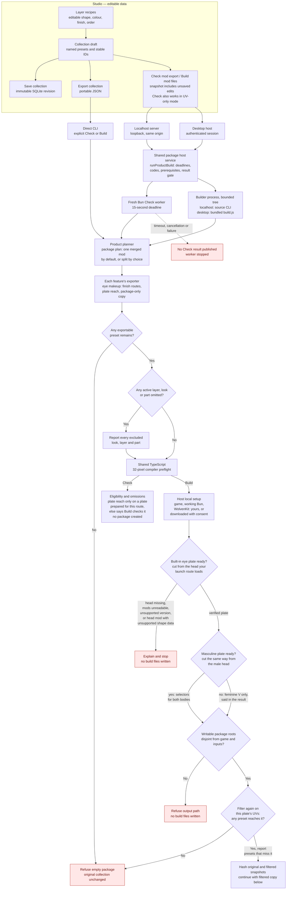
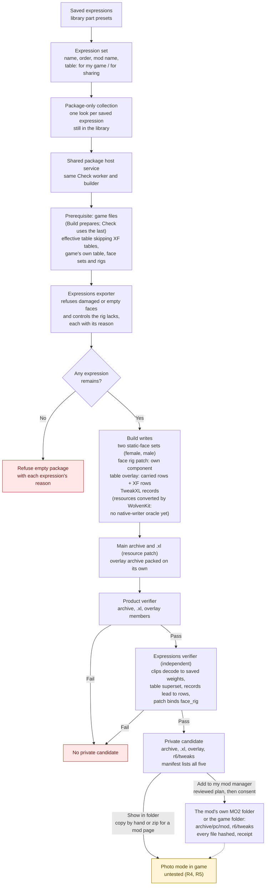
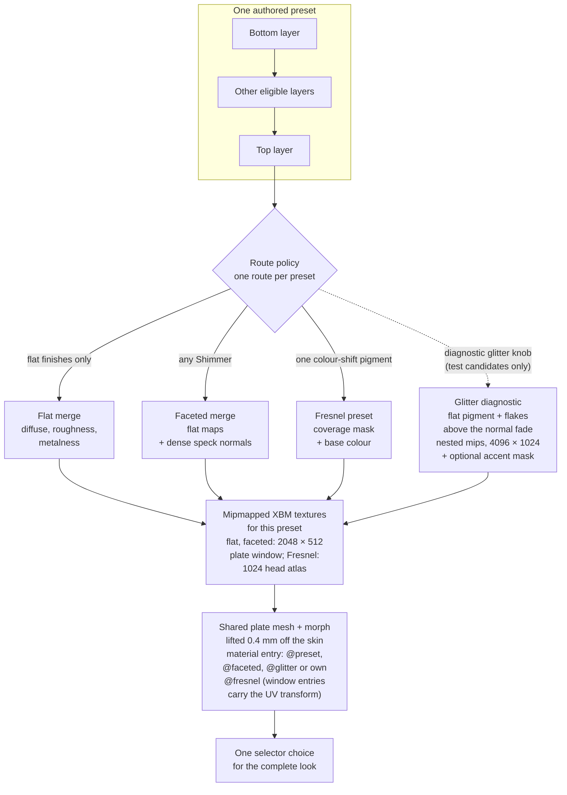
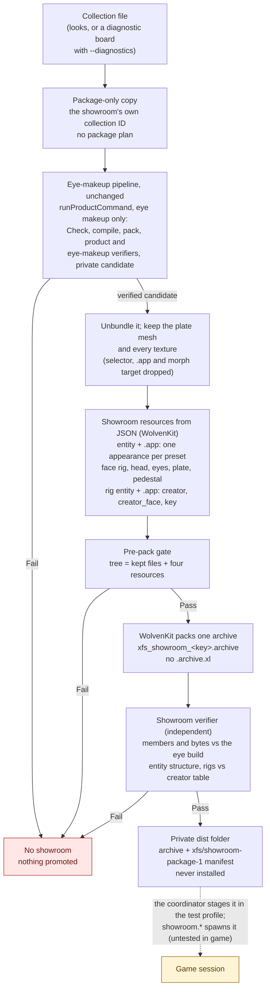

# From XF Studio collection to a Cyberpunk mod candidate

28 September 2026. This is a map of the **current local pipeline**, for a reviewer who knows the idea of a mod but not the file formats. Build produces an offline-verified, private **candidate**. “Loadable” here means the expected archive and declaration files have been built and independently unpacked and checked. On its own it proves nothing in game; the in-game findings below come from three sessions.

**What has been seen in game.** Diagnostic builds in the test MO2 profile were observed in three sessions: the [finish board](../../experiments/016-finish-board/README.md#runtime-results) on 25 September, [experiment 020](../../experiments/020-session-2/README.md#results-26-september-2026-run-through-the-runtime-bridge-partial) on 26 September and [experiment 028](../../experiments/028-session-3/README.md#5-results-28-september-2026) on 28 September. All were with a feminine V on game 2.31. They showed:
- The XF selector registers and switches in the creator, gameplay and photo mode, and saves keep it.
- The window's placement holds, and its sharper lines are visible.
- The 0.4 mm plate lift holds at extreme close range and in motion.
- The closed lids are clean on four eye shapes.
- Colour-shifting behaves as designed.

Still open in game: the flat finishes' separation (inconclusive under creator light), Shimmer (sessions 3 and 4 saw a static grid of oversized dots, and session 6 saw the sparse grain that replaced it as glossy vinyl; rebuilt as dense specks over a satin base, not yet in game), the diagnostic Glitter route (board 1 looked printed in session 6; board 2 not yet in game), the `hx_` component under a head-hiding item, and everything about the masculine V's selector. No build made with the current code has been in game: its feminine resources differ from the tested ones only in values the golden tests pin and in the component name.

**Which V a mod is for.** A mod is for **both a feminine and a masculine V** when Build can prepare the masculine eye plate from the male head the launch route loads; the two creators then each get their own XF selector with the same looks and one shared set of textures ([Masculine V](#the-masculine-vs-selector)). When his plate can't be prepared (his head is missing, not an audited version, changed by an unsupported head mod, or the developer plate override is set), the mod is **for a feminine V only**: Build still makes it. Each feature's result carries whom its mod is for as a plain phrase (`FeatureCheck.audience`, generic: the result card ends the product line with it, "Eye makeup in the “XF” selector, for a feminine and a masculine V" or "…, for a feminine V only") and what it falls short of as warnings (`FeatureCheck.warnings`: one sentence, the reason then the step, with the control that takes the step, e.g. Open Settings). The card shows each warning in the warning tone directly under its product; the manifest records both. Before any Build prepared the plates for the route, Check's one note says what Build still decides ("Build checks which looks reach the eye area and whether the mod can also fit a masculine V.").

The short version: the Studio saves editable makeup as data. Check and Build make a package-only copy that omits active layers with unsupported finishes, presets left without active exportable layers, presets whose makeup never reaches the eye plate (judged on the plate's own UVs), looks with no eye makeup, and other features' parts of a look (no other feature has a mod exporter yet). They report every omission while leaving the authored collection untouched. Build then merges each retained preset's visible layers into one decal draw: a small set of texture maps chosen by the preset's finish route (three for flat finishes), attached to that route's eye-plate material pattern. Flat and faceted maps are 2048 × 512 and cover only the plate's own UV rectangle, which the material maps back with a UV transform ([plate-local UV window](#the-plate-local-uv-window)); colour-shift maps stay on the 1024 head atlas. A prepared **diagnostic** collection can also send a flat-pigment preset through the [diagnostic Glitter route](#the-diagnostic-glitter-route) (4096 × 1024 flake maps with nested mips, optionally an emissive accent on a second plate chunk); the Glitter finish itself still has no route. Build then writes a character-creator selector with an Off choice for each body the mod is for, packs the resources, independently checks the package, and places only a verified copy in a host-owned private candidate directory. Since platform step 8 each exportable feature has an **exporter**, and a collection builds one or more **mods** (products): one merged mod by default, split when the person chooses ([Mods and the package plan](#mods-and-the-package-plan)). A look collection's only exporting feature is eye makeup, so every collection build is one mod, **XF Eye Artistry** unless renamed, byte for byte what the one-product pipeline built. Expressions export through **expression sets** instead: a set of saved expressions builds its own photo-mode expression mod through the same host, builder, verifiers and manifest ([Expression sets](#expression-sets-photo-mode-expression-mods)). A separate developer command builds **XF Finish Showroom**, an in-game test mod of mannequin heads wearing the presets, around the same verified eye-makeup output ([XF Finish Showroom](#xf-finish-showroom-a-test-mod-of-mannequin-heads)). Localhost uses the project's ignored `dist/`; desktop uses private Electrobun user data. Build does not install files: after Build, **Add to my mod manager** installs a mod only once the person has read and accepted its plan ([below](#adding-a-built-mod-to-the-mod-manager)), and the separately invoked diagnostic transfer copied one **localhost** candidate pair into a new MO2 profile and mod. [Product decision](../../projects/xf-studio/data/product-direction.md), [local build boundary](local-package-build.md), [runtime test card](../../docs/validation.md#prepared-single-session-test-card).

## The pipeline at a glance

Solid arrows below are implemented local data/build steps. The final dashed arrow is **work still to be observed in game**. A red rejection means no eligible preset remains; structural or integrity failures also prevent promotion. A partial result carries explicit omissions. The first diagram follows authoring through eligibility; the second begins with the same validated build snapshot.


```mermaid
flowchart TB
  subgraph editor["Studio — editable data"]
    recipe["Layer recipes<br/>editable shape, colour, finish, order"] --> draft["Collection draft<br/>named presets and stable IDs"]
    draft --> sqlite["Save collection<br/>immutable SQLite revision"]
    draft --> export["Export collection<br/>portable JSON"]
    draft --> ui["Check mod export / Build mod files<br/>snapshot includes unsaved edits<br/>Check also works in UV-only mode"]
  end

  ui --> server["Localhost server<br/>loopback, same origin"]
  ui --> desktop["Desktop host<br/>authenticated session"]
  server --> hostsvc["Shared package host service<br/>runProductBuild: deadlines,<br/>codes, prerequisites, result gate"]
  desktop --> hostsvc
  hostsvc --> worker["Fresh Bun Check worker<br/>15-second deadline"]
  hostsvc --> buildWrapper["Builder process, bounded tree<br/>localhost: source CLI<br/>desktop: bundled build.js"]
  worker --> products
  buildWrapper --> products
  worker -. "timeout, cancellation or failure" .-> noresult["No Check result published<br/>worker stopped"]
  export --> cli["Direct CLI<br/>explicit Check or Build"]
  cli --> products["Product planner<br/>package plan: one merged mod<br/>by default, or split by choice"]
  products --> filter["Each feature's exporter<br/>eye makeup: finish routes,<br/>plate reach, package-only copy"]
  filter --> decision{"Any exportable<br/>preset remains?"}
  decision -- No --> reject["Refuse empty package<br/>original collection unchanged"]
  decision -- Yes --> omitted{"Any active layer, look<br/>or part omitted?"}
  omitted -- Yes --> warn["Report every excluded<br/>look, layer and part"]
  omitted -- No --> preflight["Shared TypeScript<br/>32-pixel compiler preflight"]
  warn --> preflight
  preflight -- Check --> ready["Eligibility and omissions<br/>plate reach only on a plate<br/>prepared for this route,<br/>else says Build checks it<br/>no package created"]
  preflight -- Build --> setup["Host local setup<br/>game, working Bun,<br/>WolvenKit: yours, or<br/>downloaded with consent"]
  setup --> plate{"Built-in eye plate ready?<br/>cut from the head your<br/>launch route loads"}
  plate -- "head missing,<br/>mods unreadable,<br/>unsupported version,<br/>or head mod with<br/>unsupported shape data" --> noplate["Explain and stop<br/>no build files written"]
  plate -- "verified plate" --> his{"Masculine plate ready?<br/>cut the same way from<br/>the male head"}
  his -- "yes: selectors<br/>for both bodies" --> roots{"Writable package roots<br/>disjoint from game and inputs?"}
  his -- "no: feminine V only,<br/>said in the result" --> roots
  roots -- No --> unsafe["Refuse output path<br/>no build files written"]
  roots -- Yes --> replan{"Filter again on<br/>this plate's UVs:<br/>any preset reaches it?"}
  replan -- No --> reject
  replan -- "Yes, report<br/>presets that miss it" --> snapshot["Hash original and filtered snapshots<br/>continue with filtered copy below"]

  classDef blocked fill:#ffe7e7,stroke:#b42318,color:#6e1611;
  class reject,noresult,unsafe,noplate blocked;
```


```mermaid
flowchart TB
  snapshot["Filtered, hashed build snapshot<br/>private intermediate directory"] --> bake["Eye makeup's exporter<br/>UV window from plate UVs<br/>2048 × 512 maps<br/>and their mip chains<br/>each body's plate<br/>lifted 0.4 mm<br/>resources written natively<br/>(WolvenKit if refused)"]
  bake --> resources["Resources in the mod's<br/>one staging tree<br/>(every feature of the mod)"]
  resources --> gate["Pre-pack path gate<br/>tree = union of features' files<br/>canonical names, hashes"]
  gate -- Fail --> stop
  gate -- Pass --> pack["One archive packed natively<br/>(WolvenKit if refused)<br/>host writes the .archive.xl<br/>merged from each feature's entries"]
  pack --> productVerifier["Product verifier<br/>own copy,<br/>WolvenKit unbundle<br/>(each overlay alongside)<br/>members = features' files<br/>.xl = merged entries"]
  productVerifier -- Fail --> stop
  productVerifier -- Pass --> verifier["Each feature's own verifier<br/>(features side by side;<br/>eye makeup's serialize<br/>beside its texture export)<br/>eye makeup: routes<br/>re-derived, each body's<br/>plate vs its input, lift,<br/>UV window, pixels, mips"]
  verifier -- Fail --> stop["No private candidate<br/>diagnostics retained locally"]
  verifier -- Pass --> dist["Private builder output<br/>one folder per mod<br/>xfs/local-package-2 manifest"]
  dist --> resultGate{"Host result gate<br/>answer = host's own plan,<br/>exact files and hashes"}
  resultGate -- Fail --> unaccepted["No accepted package result<br/>desktop staging discarded"]
  resultGate -- Pass --> candidate["Private host candidate<br/>archive, .archive.xl, manifest<br/>(+ extras: overlay archive,<br/>TweakXL file, expression sets)<br/>project dist or desktop user data"]
  candidate -- "Add to my mod manager<br/>reviewed plan, then consent" --> install["The chosen MO2 profile:<br/>the mod's own folder<br/>+ one placed mod row<br/>(or the game's archive/pc/mod<br/>and r6/tweaks)<br/>every file hashed, receipt, backup"]
  install -. "diagnostic builds seen in game;<br/>this build untested" .-> runtime
  candidate -- "localhost candidate used for diagnostic" --> scratch["Ignored diagnostic scratch stage<br/>copied profile<br/>+ one placed mod row<br/>frameworks only reported"]
  scratch --> preview["Read-only transfer preview<br/>paths, hashes, ownership<br/>legacy-folder and overlap gates"]
  preview -- "explicit promotion executed for diagnostic" --> mo2["New MO2 profile<br/>the mod's own folder<br/>(XF Eye Artistry by default;<br/>25 Sep: legacy XF Studio)<br/>reversible private receipt"]
  mo2 -. "sessions 1–3<br/>(25–28 Sep)" .-> runtime["Game sessions<br/>seen: selector, switching,<br/>save, lift, lids, density<br/>open: finishes, hide_Head"]

  classDef blocked fill:#ffe7e7,stroke:#b42318,color:#6e1611;
  classDef pending fill:#fff4d6,stroke:#946200,color:#594000;
  class stop,unaccepted blocked;
  class runtime pending;
```

The diagram has entries into the same TypeScript filter from a localhost Studio request, an authenticated desktop request and an exported collection JSON file explicitly passed to the CLI (a prepared test candidate's diagnostic knobs only with `--diagnostics`, which neither host passes). All use the same filter and 32-pixel compiler preflight; the arrows show this shared policy, not one shared running process. **Check mod export** stops after eligibility and needs no WolvenKit, game file or 3D preview. Both hosts run Check and Build through one package host service (`runProductBuild`, [`platform/export/product-host.ts`](../../projects/xf-studio/authoring/src/platform/export/product-host.ts)): Check in a fresh Bun worker with a 15-second deadline (localhost used to run it through the CLI with 2 minutes); timeout or cancellation publishes no result. **Build mod files** uses the same partial-export filter and the same TypeScript resource builder and independent verifier in either host; **Python is not involved**. Each host runs that builder as one bounded Bun child process: localhost runs `tools/build_collection_package.ts` from the source tree, desktop runs its single bundled `build.js`. Before the builder starts, each host prepares the [built-in eye plate](#where-the-eye-plate-comes-from) from the head the game is expected to load for the saved launch route (direct or the selected MO2 profile), including a head supplied or patched by a mod; a missing or unsupported head resource, or a head mod whose shape data does not fit the plate recipe, stops Build with a plain explanation. The direct CLI does not derive a plate; it takes an explicit `--plate` directory. Desktop checks readiness before starting that work: its asset-free packaged builder bundle, WolvenKit and game inputs must pass. A bounded probe also executes a small script through the selected Bun path (or Electrobun's main executable when unset); file presence alone cannot enable Build. The browser sends the action and collection snapshot, with no tool or output paths. Desktop keeps its writable work, staging and candidate roots under Electrobun user data, disjoint from the configured game, MO2 and all input paths. The read-only packaged tools legitimately share the Electrobun channel root, so the gate checks each writable package subtree rather than rejecting that common parent. Build stops a timed-out or cancelled process tree (the builder and any WolvenKit child it started) and removes per-build intermediates. It requires the builder's answer to equal its own plan of the same snapshot (every mod, feature, look, omission, hash and the plate's provenance) and each candidate folder to hold exactly its manifest and the archive/XL pair it names, with their lengths and SHA-256 values, before moving the staged candidates into the private candidate store and checking them there again. A disposable installed canary, built while Build still ran the Python programs, completed the authenticated host Build route with four presets and 16 independently verified resources. Its archive payloads match the earlier localhost candidate after independent unbundling, but archive-file hashes differ because the index records build times. The TypeScript desktop Build route has been run from source with the real bundled builder, WolvenKit 9.0.1 and a fresh private data root (see [Build pipeline port](#build-pipeline-port)); it has not yet been repeated in an installed canary. Localhost retains its server overrides and project dist root. [Installed trial](../../projects/xf-studio/authoring/desktop/README.md), [server boundary](../../projects/xf-studio/authoring/src/package-server.ts), [package host service and result gate](../../projects/xf-studio/authoring/src/platform/export/product-host.ts), [desktop adapter](../../projects/xf-studio/authoring/desktop/package.ts), [product Check](../../projects/xf-studio/authoring/src/platform/export/product-check.ts), [local setup](../../projects/xf-studio/authoring/LOCAL-SETTINGS.md), [builder](../../projects/xf-studio/authoring/src/platform/export/product-builder.ts), [CLI](../../projects/xf-studio/authoring/tools/build_collection_package.ts).

Separate disposable installed WebView2 trials exercised the visible editor. One completed an edit, Undo, SQLite Save, Check and a **Build now** click for one preset with zero omissions; the private manifest matched its archive and ArchiveXL file hashes, and Check after Build returned the same filtered snapshot hash. Another verified that saved and unsaved collection work and selection survived full close/relaunch after the desktop workspace storage repair, then imported a prepared five-file private preview set and reached Ready. Those are installed-app UI and offline package observations, not a game session or evidence that an immediate close during a pending workspace save is safe. [Installed WebView2 record](../../projects/xf-studio/authoring/desktop/README.md#installed-webview-acceptance-and-restart-repair-25-september).

## Mods and the package plan

A collection's exportable features are grouped into **mods** (products) by its **package plan**, which is stored with the collection only when it differs from the default ([feature-module platform §6](feature-module-platform.md#6-export-mod-products-and-the-package-plan-pipe-12), [step 8 status](feature-module-platform.md#step-8-status)):

| Choice | Default | The person may |
|---|---|---|
| Which features ship together | one mod holding every exportable feature | move a feature into a mod of its own, or merge mods (`package.split`, `package.assign`, `package.merge`) |
| Archive name | `xfs_c<collection>` for the default mod (the name every eye-makeup build has had); `xfs_m<product>` for another | never shown or edited; ID-based, so renaming never changes load order |
| Mod name (mod-manager folder) | one feature: its brand (**XF Eye Artistry**); several: **XF Looks** | rename it (`package.rename`; the "XF " prefix is a default, not a rule) |
| Selector and resources | per feature, the same whichever mod carries them | — |

The **Mod package** panel lists the mods with a menu that offers only what applies: Rename, "Use the default name" once renamed, and moving or merging features once the collection holds more than one exportable feature. Renaming a mod to another mod's name of the same collection is refused ("Another mod of this collection is already called …"); when two derived names clash, the later mod gets the collection's name added, or a number when that would not be a valid folder name. "Save as copy" gives every mod of the copy a fresh ID (the default mod the copy's collection ID, every split-off mod a new UUID), so no archive of the copy shares a name with, and hides, one of the original's. A feature may be in only one mod: a plan that puts it into two is refused (named by the feature's label), two features claiming one namespace or depot path are refused at Check in plain words (the namespace or path goes to the host log only), and the diagnostic transfer refuses to place a build any installed mod already holds part of.

A package plan this version can't use is kept exactly as it was stored: a later `xfs/package-plan-N` schema, or a `xfs/package-plan-1` plan with a field this version doesn't know (such as the planned per-feature selector labels), counts as made with a newer version; anything else unreadable counts as damaged. The collection still opens, edits and saves with the plan written back unchanged; the panel shows why in plain words, and the `package.*` actions, Check and Build refuse it (actions and requests with reason code `unavailable`; the export host with `package_plan_newer` or `package_plan_damaged`).

Check and Build plan every mod, run each feature's exporter (its eligibility, plan and, for Check, preflight), then the mod's checks: no shared depot path or namespace, `.xl` entries that merge, and the highest version per framework requirement. Omissions are decided once, by the export host: a **whole look** is left out only when no feature of any mod packages anything of it (with the reason of the feature that left it out, or "Nothing in it can be made into mod files yet." when it holds no part an exporter packages or the features' reasons differ); a part of a feature that has no exporter is reported once for the whole collection; a feature with nothing left to package is reported and left out while the others still build. Each feature's own list keeps what it leaves out of looks that are packaged: its layers (labelled with the feature in the result's wording when several features export), and its part of a look another feature packages. Each verified mod gets its own candidate folder and `xfs/local-package-2` manifest, which records only that mod's omissions (see [promotion](#what-check-build-and-verify-each-prove)).

## Expression sets: photo-mode expression mods

An **expression set** is a named, ordered list of saved expressions in the local library (`part_preset_sets`, beside `part_presets`; [expression editor design §6](../animation/expression-editor-design.md#6-export-route)). The Expression sets panel creates, renames and deletes sets, adds, removes and reorders their expressions, names the set's mod (**XF Expressions - <set name>** by default; a colon can't be in a folder name) and chooses which expression table it carries. Check and Build of a set send a **package-only collection** built from it to the same package route a look collection uses: the set's ID and name, one look per saved expression still in the library (in the set's order), a package plan naming the mod, and a `presetSet` mark with the table choice. Only the expressions exporter reads that mark, so a look collection's expression parts never join its mods.


```mermaid
flowchart TB
  saved["Saved expressions<br/>library part presets"] --> set["Expression set<br/>name, order, mod name,<br/>table: for my game / for sharing"]
  set --> pkg["Package-only collection<br/>one look per saved expression<br/>still in the library"]
  pkg --> hostsvc["Shared package host service<br/>same Check worker and builder"]
  hostsvc --> prereq["Prerequisite: game files<br/>(Build prepares; Check uses the last)<br/>effective table skipping XF tables,<br/>game's own table, face sets and rigs"]
  prereq --> exporter["Expressions exporter<br/>refuses damaged or empty faces<br/>and controls the rig lacks,<br/>each with its reason"]
  exporter --> ok{"Any expression<br/>remains?"}
  ok -- No --> refuse["Refuse empty package<br/>with each expression's reason"]
  ok -- Yes --> write["Build writes<br/>two static-face sets (female, male)<br/>face rig patch: own component<br/>table overlay: carried rows + XF rows<br/>TweakXL records<br/>(resources converted by WolvenKit:<br/>no native-writer oracle yet)"]
  write --> pack["Main archive and .xl (resource patch)<br/>overlay archive packed on its own"]
  pack --> pverify["Product verifier<br/>archive, .xl, overlay members"]
  pverify -- Fail --> stop["No private candidate"]
  pverify -- Pass --> fverify["Expressions verifier (independent)<br/>clips decode to saved weights,<br/>table superset, records lead to rows,<br/>patch binds face_rig"]
  fverify -- Fail --> stop
  fverify -- Pass --> candidate["Private candidate<br/>archive, .xl, overlay, r6/tweaks<br/>manifest lists all five"]
  candidate -- "Add to my mod manager<br/>reviewed plan, then consent" --> placed["The mod's own MO2 folder<br/>or the game folder:<br/>archive/pc/mod, r6/tweaks<br/>every file hashed, receipt"]
  candidate -- "Show in folder<br/>copy by hand or zip for a mod page" --> runtime["Photo mode in game<br/>untested (R4, R5)"]
  placed -.-> runtime

  classDef blocked fill:#ffe7e7,stroke:#b42318,color:#6e1611;
  classDef pending fill:#fff4d6,stroke:#946200,color:#594000;
  class refuse,stop blocked;
  class runtime pending;
```

| Step | What happens | Evidence |
|---|---|---|
| Game files | The host's `expressions/game` prerequisite resolves, on the saved launch route, the table photo mode reads (skipping any `0xfs_…_table` overlay), the game's own table and V's photo-mode face rig as shipped (taken only from the base archives, `content` or `ep1`, never a mod's or ArchiveXL's bundle), the female and male vanilla photo-mode face sets and the rigs they name, and the facial setup's main-pose block; untrimmed WolvenKit JSON in the host's private cache, never committed. The prepared file belongs to one installation: it is keyed on `expressionsGameFingerprint` (the route, its mod-folder stamps, the installation registry's generation and the reader version), and the three newest per route are kept. One read runs per route at a time, each in its own work folder; a Build joins a read a Check started, or stops it when the installation has changed. | [source] `src/expressions-game-prerequisite.ts` |
| Eligibility | An expression is left out, with its reason in Check, Build and the manifest, when it is damaged, holds no control, or uses a control either rig's main poses lack; nothing left is a refusal that carries each expression's reason (`ExportRefusal.omissions`, passed by the Check worker and both hosts' JSON answers) so the set's result lists them with Start from it. Reasons name the expression and its face movements in words. Before the game files have been read for this installation (none prepared, or the mods changed since), Check says they are being read, starts reading them in the background, leaves indices open and runs again by itself. A set's result records the set's and each member's revision, so changing a listed expression makes it stale. | [offline] tests |
| Clips | One entry per expression in each gender's set, laid out as a vanilla static face and written straight to WolvenKit JSON (no glTF import); names `<namespace>_<saved expression ID>`, stable across renames. | [offline] exact round trip through WolvenKit and the Studio's decoder, 28 September |
| Attachment | An ArchiveXL `resource: patch:` of `h0_000__basehead_face_rig_photomode.app` adds one `entAnimationSetupExtensionComponent` per gender appearance, named for the namespace and bound to `face_rig`; ArchiveXL adds a component whose name and id are new, so other expression mods' `PhotomodeAnimations` stay. | [source] ArchiveXL `MergeComponents`; runtime untested |
| Table | For my game: the effective table's rows unchanged, then one row per expression from the next index. For sharing: the game's 15 rows, neutral filler to 999, XF rows from 1000. `Index` equals position either way. Packed alone in `0<archive>_table.archive`, which sorts first; Check warns when a visible `modlist.txt`, another XF expressions table or an archive sorting earlier would decide otherwise. | [offline] tests and dry run |
| Records | `r6/tweaks/<archive>/<archive>.yaml`: `PhotoModeFaces.<clip>` (`$base: PhotoModeFaces.facial_neutral`, literal `displayName`, `faceId`) and `!append-once` to `photo_mode.character.faceAnimations`. | [resource] the Mega Pack's route |
| Product extras | A platform capability: a feature's outcome may name TweakXL files and overlay archives; the builder checks the files against the plan, packs each overlay on its own, verifies it, and promotes and records them in the manifest after the archive and `.xl`. The install host places them from the manifest: overlay archives beside the main one in `archive/pc/mod` (each named for the product, `0<archive>_table`: the manifest reader and the install refuse an overlay without the product's own archive name, so it can't collide with another mod's archive there), the TweakXL file in `r6/tweaks/<archive>/`, below the mod's own MO2 folder or the game folder ([Adding a built mod](#adding-a-built-mod-to-the-mod-manager)). A set's Build result offers Add to my mod manager and Show in folder, as the Mod package panel does. | [source] `platform/export/product-builder.ts`, `manifest.ts`, `mod-install-transport.ts` |

A dry run on the reference setup (five natural samples, 28 September, `tools/expression_set_dry_run.ts`, private output only) built and verified a candidate in about 84 s: the table carried the Mega Pack's 217 rows and added indices 217 to 221; both genders' clips, unbundled and serialised by WolvenKit 9.0.1, decode with the Studio's own decoder to exactly the saved weights. Nothing was installed and nothing has been seen in game.

## What each kind of data means

| Thing | What it contains | What it is **not** |
|---|---|---|
| Recipe | A versioned, editable ordered layer stack: contours, warp fields, pigment/softness, colour, opacity, finish and optional layer effects (mottle). In the Studio it is eye makeup's part (`xfs/eye-makeup-part-2`), with no recipe schema of its own: each layer's Glitter, game-matched optics and mottle models are versioned by their own IDs. Recipe files (`eye-artistry/recipe-1`, `xfs/recipe-2` through `xfs/recipe-12`) migrate on read; writers, including collection-1 files, use the oldest `xfs/recipe-N` that holds every layer, and a collection-1 file read by Check or Build keeps its recipes' own schemas. | A texture, mod or saved V. The browser preview resolution is independent of the recipe. |
| Collection | A collection of looks with a stable collection UUID and named preset UUIDs/revisions. Export collection writes `xfas/collection-1` JSON (each preset carrying a recipe) whenever that format holds the looks exactly, and `xfs/collection-2` (each preset carrying parts by feature) otherwise; Check, Build and the CLI read both and package each look's eye-makeup part. The eye-makeup view of a collection-2 collection lists what it leaves out (`omitted`: a look without eye makeup, another feature's part); the Studio sends that view, and Check, Build and the manifest report each entry as an omission. The `xfas` schema name is retained for compatibility after the XF Studio rename. An exported file prepared as an in-game test candidate may also carry diagnostic-only `diagnostics` (`xfs/export-diagnostics-1`: a per-preset plate lift, flat-surface override, head-UV layout or glitter flake field, see [Plate lift](#plate-lift-at-build) and [the diagnostic Glitter route](#the-diagnostic-glitter-route)); the Studio never writes, shows or keeps them. Both hosts' own collection parsers drop them before Check or Build, and the CLI honours them only with an explicit `--diagnostics` (without it such a file is refused with that reason), so only a deliberately built test candidate carries them. | A game selector by itself. It can travel between Studio installations. |
| Workspace draft | Unsaved collection edits plus editor selections and preview context, in origin-bound browser storage on localhost or a host-owned private workspace file on desktop. | A new SQLite revision or packaged mod. |
| SQLite revision | Explicit, immutable local library snapshot with conflict protection. | The latest browser draft unless the user saved it. |
| Package-only filtered snapshot | A validated copy with unsupported **active** layers removed and any now-empty preset removed. It keeps IDs/revisions of included presets; Check and Build use the same filter. | A change to the authored recipe, browser draft or SQLite library. |
| Build plan | Deterministic proposed resource names/paths for the **retained subset**. | An installable mod. |
| Intermediate build | Generated maps, JSON resources, conversion logs, packed archive and verifier evidence under ignored project `build/` for localhost, or private Electrobun user data for desktop. | Public distribution content. |
| Private candidate | Verified `.archive`, `.archive.xl` and a manifest in ignored project `dist/` for localhost, or private Electrobun `package-candidates/` for desktop. An expression set's candidate also holds its table overlay archive and its TweakXL file ([product extras](#expression-sets-photo-mode-expression-mods)), listed in the manifest after the pair. | An installed, activated or game-proven mod. |

The new-layer template starts with a mirrored four-point upper-lid contour and no warp field. Reset applies that same starting shape, while duplicate and imported or saved recipes retain their authored geometry. This changes only the recipe produced by future Add/Reset actions; the filter, compiler, package identities and historical four-layer startup recipe are unchanged. [Layer action](../../projects/xf-studio/authoring/src/engines/layered-makeup/layer-stack.ts), [template](../../projects/xf-studio/authoring/src/engines/layered-makeup/recipe.ts).

For example, the checked-in four-preset fixture has collection ID `0ec3546e-3fac-43e7-8c19-a65d20383d41`. Its namespace is `xfs_c0ec3546e3fac43e78c19a65d20383d41`. Preset `f25f8eb1-8a83-4f65-a111-b83086382c18` gets mesh appearance `xfs_pf25f8eb18a834f65a111b83086382c18` and selector appearance `xfs_c0ec3546e3fac43e78c19a65d20383d41__xfs_pf25f8eb18a834f65a111b83086382c18`. Renaming that preset keeps these UUID-derived identities; reordering changes its index, whose save behavior remains unproven. This fixture is an example, not a required preset catalogue. [Identity planner](../../projects/xf-studio/authoring/src/preset-collection.ts), [fixture](../../experiments/005-preset-collection/editor-collection.json).

## Where layers become one look

**The merge happens in the Studio compiler, before WolvenKit and before ArchiveXL.** One preset is evaluated on its route's texture grid (2048 × 512 texels over the [plate-local UV window](#the-plate-local-uv-window) for flat and faceted presets, 1024 × 1024 over the head atlas for colour shift) and becomes **one decal draw** on the plate. Only enabled layers with opacity above zero participate. Their masks use the same recipe evaluator as the browser/PNG path. The [route policy](../../projects/xf-studio/authoring/src/engines/layered-makeup/finish-export.ts) first picks one route for the whole preset, because one draw has one material template and one set of material constants. Its per-finish table (game-matched model, route, surface values and user notes) is the single source for the finish catalogue, recipe validation, the preview's surface values and the compiler:

| Route | Adapter | When | Maps per preset | Texture grid | Material entry |
|---|---|---|---|---|---|
| Flat | `mesh-decal-flat-v1` | Only Matte, Satin, Metallic and game-matched Glossy | diffuse, roughness, metalness | 2048 × 512 plate window | shared `@preset` (`mesh_decal.mt`, normal off, UV transform) |
| Faceted | `mesh-decal-faceted-v1` | Any game-matched Shimmer layer (flat finishes may share the preset) | diffuse, roughness, metalness, **normal** | 2048 × 512 plate window | shared `@faceted` (`mesh_decal.mt`, `NormalsBlendingMode` 1, UV transform) |
| Fresnel | `mesh-decal-fresnel-v1` | Every active layer the game can draw is one game-matched Colour-shifting pigment (Glitter and earlier-model layers are left out first) | **mask**, **gradient** (16 × 16) | 1024 × 1024 head atlas (the template has no UV transform) | per preset `@fresnel_<preset>` (`mesh_decal_gradientmap_recolor_blendable.mt`) with its shift constants |
| Glitter (diagnostic) | `mesh-decal-glitter-diagnostic-v1` | Only a prepared collection's `glitter` knob, over flat-finish pigment layers ([below](#the-diagnostic-glitter-route)) | diffuse, roughness, metalness, **normal**, **flakes** (+ **accent**, 2048² head UV) | 4096 × 1024 plate window | shared `@glitter` (`mesh_decal.mt`, `NormalAlphaTex` flake mask, `NormalsBlendingMode` 1, UV transform); accent `@accent_<preset>` (`mesh_decal_emissive_subsurface.mt`) on the accent chunk |

**A layer's coverage includes its mottle.** A mottled layer (`effects.mottle`, `mottle-1`; [vector engine extensions §7](vector-engine-extensions.md#7-mottle-skin-like-breakup-for-eye-makeup)) has its coverage modulated inside the shared evaluator, at each texel's authored UV in skin millimetres (the region's `skin` scale) and at the route grid's own texel spacing. So the window maps, the Fresnel head mask, the diagnostic route's pigment coverage and the verifier's 4096 head-UV reference all carry it, and nothing else in the pipeline changes: Check and Build treat mottle as a layer property (no eligibility rule, no new map or material constant), and the game draws the alpha it always draws. The plate-reach test judges a mottled layer on its mottled coverage, as the verifier's reference has it (step 4 of [the plate-local UV window](#the-plate-local-uv-window)), because mottle can break a soft edge up to nothing. Unmottled layers compile byte-identically to before.

For flat and faceted presets the compiler walks the layers bottom-to-top, applies each layer's colour and coverage, and accumulates colour, roughness, metalness, coverage and (faceted) the grain normal in destination-channel space. Diffuse alpha stores the square root of coverage for the inspected `mesh_decal.mt` path. A Fresnel preset writes linear coverage (that template does not square it) and a uniform base-colour texture; its `FresnelColor` constant is stored sRGB-encoded, because the engine sRGB-decodes every `Color` parameter before the program reads it ([materials open question 11](../../knowledge/materials-and-shaders.md#7-open-questions)). There is no separate game selector for each layer. Each flat finish writes one constant surface from the route policy's table: Matte roughness 1.0, Satin 0.38 and game-matched Glossy 0.12 at metalness 0, Metallic 0.27 at metalness 0.65; a Fresnel preset writes roughness 0.32 and metalness 0.08 as material biases, below the 0.1 at which skin leaves subsurface scattering ([decal reference §10](../materials/shader-decal.md#10-recommended-changes-ranked)). The browser preview reads the same table. Matte/Satin/Metallic values are provisional; Glossy, Shimmer and Colour-shifting are **experimental** and listed as such by Check, Build and the manifest. Game-matched Shimmer writes one uniform surface (roughness 0.32, metalness 0.3) and a grain normal: about a quarter of the texels (0.4 × the layer's density) tilt 12° or more at random azimuths, so every tilted grain clears the mode-1 fade, and the rest stay flat so the skin's normal shows. The grain is white noise at one grain per window texel (about 0.13 × 0.12 mm; on the built-in plate's window that is 4376 × 3420 grains per unit of head UV, which the manifest records); a window compile that would put more than one grain in a texel is refused rather than exported faint. A map coarser than that, such as a head-UV diagnostic, holds its grains' mean with roughness widened by what the texel hides, and from 16 grains per texel a flat normal. BC5 compression lowers about 2 % of the tilted grains below the fade's full weight (WolvenKit 9.0.1, measured offline in [experiment 030](../../experiments/030-shimmer-grain/README.md#through-wolvenkits-bc5-offline)), and the manifest says so ([Shimmer design](../materials/finish-designs/shimmer.md), [grain](../../projects/xf-studio/authoring/src/engines/layered-makeup/shimmer-grain.ts)). [Finish designs](../materials/finish-designs/README.md), [compiler](../../projects/xf-studio/authoring/src/engines/layered-makeup/preset-compiler.ts), [raster evaluator](../../projects/xf-studio/authoring/src/engines/layered-makeup/recipe.ts).


```mermaid
flowchart TB
  subgraph one["One authored preset"]
    direction LR
    low["Bottom layer"] --> mid["Other eligible layers"] --> top["Top layer"]
  end
  top --> route{"Route policy<br/>one route per preset"}
  route -- "flat finishes only" --> flat["Flat merge<br/>diffuse, roughness,<br/>metalness"]
  route -- "any Shimmer" --> faceted["Faceted merge<br/>flat maps<br/>+ dense speck normals"]
  route -- "one colour-shift pigment" --> fresnel["Fresnel preset<br/>coverage mask<br/>+ base colour"]
  route -. "diagnostic glitter knob<br/>(test candidates only)" .-> glitter["Glitter diagnostic<br/>flat pigment + flakes<br/>above the normal fade<br/>nested mips, 4096 × 1024<br/>+ optional accent mask"]
  flat --> maps["Mipmapped XBM textures<br/>for this preset<br/>flat, faceted: 2048 × 512<br/>plate window; Fresnel:<br/>1024 head atlas"]
  faceted --> maps
  fresnel --> maps
  glitter --> maps
  maps --> shared["Shared plate mesh + morph<br/>lifted 0.4 mm off the skin<br/>material entry: @preset,<br/>@faceted, @glitter or own<br/>@fresnel (window entries<br/>carry the UV transform)"]
  shared --> choice["One selector choice<br/>for the complete look"]
```

Active **Glitter** layers, and Glossy, Shimmer or Colour-shifting layers still in their earlier browser-study model, have no route (the diagnostic Glitter route below draws flakes from a test candidate's knob over flat pigment layers; it never carries a Glitter layer). So do Colour-shifting layers that share a preset with other exportable finishes or with a different shift. Layers no route can carry are left out first, so a Colour-shifting layer beside a Glitter layer still exports on the Fresnel route with only the Glitter layer omitted. The package filter omits those active layers with the reason, then omits any preset left without active exportable layers. Check and Build both report each excluded layer and whole preset; they refuse the collection only when no exportable preset remains. A look nothing is packaged of is reported once as an omitted whole preset by the export host (a look with no part any exporter packages: "Nothing in it can be made into mod files yet."; eye makeup no longer reports a look without eye makeup as its own omission, since another feature may package it), and another feature's part of a look as an omitted `part`; the original preset count includes looks without eye makeup, and the packaged copy and its hash never carry the list. The Studio offers Check, Build and Export build plan only while at least one look this version can edit has eye makeup: a look made with a newer version of XF Studio is left out as an omitted whole preset ("It was made with a newer version of XF Studio.") and never counts, and a collection with nothing else is refused with that reason. An exported build plan (`xfas/export-plan-1`) carries the view's `omitted` list whenever the view leaves something out; the field is optional, so readers that don't know it are unaffected, and the package pipeline plans its packaged copy, which never carries it. A disabled or zero-opacity layer does not contribute and is not reported as an omission. The compiler itself still strictly rejects unsupported active layers if called without the package filter; it never silently flattens them. The individual **Export mask** command is a different output: a 2048 × 2048 white-RGB/coverage-alpha PNG for one layer, independent of its enabled state and not the preset package. Preview quality at 512/1K/2K/4K changes generated browser textures only. [Package filter](../../projects/xf-studio/authoring/src/package-filter.ts), [compiler gate](../../projects/xf-studio/authoring/src/engines/layered-makeup/preset-compiler.ts).

**Route mip chains.** Flat maps keep the coverage-space chain below. A faceted normal's lower levels are plain means of the decoded speck vectors, so unresolved specks shorten and the shader's mode-1 alpha fades them out; its roughness levels add the lost speck variance to the mean roughness (α′² = ᾱ² + v). Shimmer's *shimmer-grain-2* writes glossy specks (roughness 0.26, metalness 0.35) on about 86 % of texels and a satin base (0.5, 0.05) on the rest, so its level 0 varies per texel and its lower levels average ([Shimmer design](../materials/finish-designs/shimmer.md)). A Fresnel mask's levels are plain coverage means; its gradient is uniform. Window maps are non-square: 2048 × 512 halves to 4 × 1 and then along its length alone (two-texel means) to 1 × 1, 12 levels. A diagnostic glitter preset's chains are **drawn per level** (nested flake mips, [below](#the-diagnostic-glitter-route)), 13 levels at 4096 × 1024, and only its diffuse alpha follows the flat coverage chain. The independent verifier restates each rule. [Route chains](../../projects/xf-studio/authoring/src/engines/layered-makeup/route-mip-chains.ts).

## The plate-local UV window

The plate keeps the head's UV0, so a head-atlas texture spends only the plate's rectangle (0.453 × 0.145 of the atlas) on it: about 0.56 × 0.40 mm per texel on the lids at 1024. `mesh_decal` transforms the UV of every texture it samples, t = `UVScale`·(uv − 0.5) + 0.5 + `UVOffset`, from the UV as stored in the mesh (decompiled programs; [experiment 019](../../experiments/019-uv-window/README.md)). Build therefore spends every texel on the plate:

1. **Derive the window from the plate being packaged.** The builder serializes the plate first and reads its stored UV0 bounds (U 0.2732–0.7266, V 0.6763–0.8213 for the built-in plate). Each axis is widened by 1/64 of the window's span on each side and clamped to the atlas, so 62/64 of each axis's texels land on the plate and the finer levels' filter taps never wrap across an edge. [`plate-uv-window.ts`](../../projects/xf-studio/authoring/src/engines/layered-makeup/plate-uv-window.ts).
2. **Rasterise into it.** The compiler evaluates each layer with the recipe's own evaluator at each window texel's authored UV (`rasterWindow`), so the recipe and the UV editor are unchanged; Shimmer's grain is drawn per window texel. Each window preset also writes a head-UV coverage reference over the window (4096 texels across the atlas, about 0.14 × 0.10 mm) for the verifier; it is not packaged. The reference is a crop of the **head-atlas raster** (`raster`, the editor's and preview's path), deliberately not `rasterWindow`: a fault in the window code (a mirror, offset or scale) then moves the maps but not their reference, and the verifier's mapping gate fails. A test bakes with `rasterWindow` mirrored in its own process and requires that failure.
3. **Map it back in the material.** `@preset` and `@faceted` carry `UVScaleX`, `UVOffsetX`, `UVScaleY` and `UVOffsetY` (for the built-in plate 2.136780, 0.000261, 6.680135, −1.661879). V is signed for two facts checked offline: the Studio authors in glTF UV, 1 − the stored V, and WolvenKit's XBM import stores image rows bottom to top (its export flips them back). So the window's stored-V rectangle maps to t ∈ [0, 1] with the compiler's rows in natural order, and `UVOffsetY` is negative.
4. **Plan on where the plate is.** The plate's **UV footprint** (its stored UV0 bounds, the window, every vertex UV and triangle; [`plate-uv-window.ts`](../../projects/xf-studio/authoring/src/engines/layered-makeup/plate-uv-window.ts)) decides which presets can show at all. A preset whose exportable layers reach at least 2/255 coverage at none of the plate's sample points (every vertex and six points inside every triangle, the verifier's own set) is drawn off the plate's rectangle or in one of its holes, so it would be invisible and its window map would fail the verifier. Check and Build omit it as a reported omission ("Its makeup doesn't reach the eye plate, so it wouldn't show in game"; [`plate-reach.ts`](../../projects/xf-studio/authoring/src/plate-reach.ts)); if no preset reaches the plate, nothing is built and the message says to move the shapes onto the eyelids. An unmottled layer is judged on its coverage at each sample point (smooth, so the step above the verifier's 1/255 covers interpolation between reference texels). A **mottled** layer is judged as the verifier will read it: its bytes at the 4096 reference raster's texel centres (mottle sampled at that raster's spacing), interpolated bilinearly at each sample. Otherwise a preset whose only contact is a soft edge that mottle breaks up would pass Check and then fail Build's verifier ("no content at the plate's UVs") instead of being reported; now Check and Build both omit it, and for a one-layer preset the test is exactly the verifier's own `authored` count.
5. **Keep what cannot move on head UV.** The Fresnel route's template has no UV transform, so colour-shift presets keep 1024 head-atlas maps. A diagnostic collection may keep a flat or faceted preset on head UV (`uvSpace: "head"`, entry suffix `_head`, no UV constants) to compare densities side by side.

At 2048 × 512 a texel is about 0.13 × 0.12 mm on the lids: today's texel count and GPU memory (2.67 MiB per flat preset, 4.0 MiB faceted, with full chains), about 4.3 times the linear density across the lids and 3.3 times down them. `build.json` records the bounds, the window, its constants and the footprint's SHA-256 (`plateUv`); each compiled record names its `uvSpace`, grid and window. Check, the build result and `manifest.json` record the plate they planned on (`plateUv`: window, bounds and footprint SHA-256; null in a Check made before any plate was prepared). Whether the game samples the window exactly as the decompiled programs say is the first question of experiment 019's test card; nothing here has been seen in game.

## The diagnostic Glitter route

The [Glitter game route](../../knowledge/glitter-in-game.md#3-primary-route-resolved-glint-flakes-mesh_decal-plate-local-window) is built as a **diagnostic** route for in-game tests ([experiment 021](../../experiments/021-glitter-board/README.md)). The Glitter finish itself keeps no route: Glitter layers in any collection, this one included, are still omitted with a reason. Only a prepared collection's `glitter` knob (`xfs/export-diagnostics-1`, [`export-diagnostics.ts`](../../projects/xf-studio/authoring/src/export-diagnostics.ts)) selects the route, for a preset whose active layers are all flat finishes. Its `base` surface (roughness, metalness) replaces the pigment layers' own; each `region` names one pigment layer and gives flake statistics (width, spread, cover, tilt, roughness, metalness, colour, seed), a mip rule (`nested` or `box`), or mirrors another region's flakes across u = ½; an optional `accent` takes the lowest-key share of one region's flakes. The knob cannot be combined with a surface override or head UV. Only the CLI's `--diagnostics` honours it; both hosts drop it.

**Glitter flakes 2** (after session 6; [experiment 033](../../experiments/033-finishes-rework/README.md)). A region's flakes may also set:
- `tiltMinDeg`: every flake tilts at least this much, then |N(0, σ)| up to the maximum;
- `roughnessMax` and `metalnessMin`: each flake draws its own roughness and metalness in those ranges;
- `largeShare` with `largeSizeMm`: a share of larger flakes;
- `clusterMm` with `clusterFloor`: a value-noise density envelope.

Each field is optional; pairs go together. A region without them draws exactly the first recipe's catalogue: same draw order, same bytes. The extra draws follow the first recipe's per flake, and a clustered flake redraws its centre until it is accepted, at most 64 times. The sheen's roughness and metalness use the middle of the per-flake ranges, and its variance the floored tilt distribution. [`glitter-studio-flakes.ts`](../../projects/xf-studio/authoring/src/glitter-studio-flakes.ts) derives these fields from a Studio glint layer's settings, and the board uses it. The verifier restates the fields' rules, the draw order and the envelope flake for flake, and checks that no fully covered flake texel tilts less than its floor.

**Regions** ([`glitter-region.ts`](../../projects/xf-studio/authoring/src/glitter-region.ts)). A region's rectangle is its layer's **outline bounds**: everywhere the layer's coverage can be non-zero. The drawn curve lies in the convex hull of its control polygon (each knot and both tangent endpoints on a Bézier outline, or each Catmull–Rom knot with the segment's equivalent Bézier controls, which covers overshoot); coverage reaches half the widest softness width (layer or knot feather) beyond the curve; warp fields move it by at most their summed displacement. Build clips the rectangle to the plate window before sizing the flake catalogue (cover × area over the mean flake area), and a region may hold at most **200,000** flakes. Planning applies the same rules over the head's UV square, whose count bounds the window's from above, so Check refuses what Build would: a region layer mirrored by symmetry, one outside the UV square, or one over the flake budget, each with a plain reason.

1. **Maps** ([`glitter-route.ts`](../../projects/xf-studio/authoring/src/glitter-route.ts)): 4096 × 1024 over the plate window (about 0.065 × 0.059 mm per texel). Diffuse RGB is the pigment mixed toward the flake colour; diffuse alpha is √coverage of the pigment layers with the flat coverage chain, so the decal covers exactly what they cover. Roughness and metalness composite the base surface toward each flake's. The normal holds each flake's tangent X, Y, dilated two texels beyond its box. `flakes` is the flake mask (`NormalAlphaTex`), clipped by the region layer's coverage and never outside the pigment's.
2. **Nested mips:** each level re-draws a region's flakes at width max(w, 2 texels), keeping the key-ordered prefix that covers cover × 0.7^(L − L*) and none wider than 1.2 mm; the rest becomes sheen (roughness toward ((r_f²)² + E[sin²θ])^¼, metalness and colour toward the flake's). A `box` region keeps its level 0 and takes each lower level from the plain 2 × 2 BOX chain of the level-0 bytes. The bake records every channel's whole chain (`levels`), and the builder writes it as the DDS input unchanged.
3. **Material:** one shared `@glitter` `mesh_decal` entry with `NormalAlpha` 1, `UseNormalAlphaTex` 1, `NormalsBlendingMode` 1, the surface alphas and scales at 1, and the window's UV transform.
4. **Accent chunk:** a preset with an accent gets a 2048² head-UV mask (the emissive template has no UV transform) with the accent flakes at least 2 texels wide and nested the same way, and its own `@accent_<preset>` entry on `mesh_decal_emissive_subsurface.mt` (`EmissiveMask`, `EmissiveMaskChannel` (1, 0, 0, 0), `EmissiveColor` the flake colour's sRGB bytes, the knob's `EmissiveEV`, `AlphaThreshold` 0). The template multiplies the colour by `EmissiveEV` directly, so the knob parser and the verifier both refuse an accent at 0 or below (it would draw black); the board uses 1, the flake colour itself. The plate gains one last render chunk at the accent presets' lift (`plan.plate.accentChunk`, so `liftsMm` is `[0.4, 0.4]` for the board): the accent preset binds it to its accent entry, every other preset to `xfs_hidden`.
5. **Verification:** the verifier restates the route from the recipe and knob (including the region, catalogue-size and flake-budget rules above), the material and accent constants, the chunk bindings and texture sizes, and checks the chains' published properties and the flakes' contents rather than re-drawing them ([What Check, Build and Verify each prove](#what-check-build-and-verify-each-prove), item 4).

A normal collection never reaches any of this: its plan, materials and chunks are unchanged. A golden test pins every committed ordinary collection's plan, plate materials, appearances, `.archive.xl` and (for the finish board and session 2) every baked map to the results from before the route's cleanup, updated deliberately only for the finish defaults (Matte's roughness maps, the Colour-shifting materials and plans) ([`ordinary-package-golden.test.ts`](../../projects/xf-studio/authoring/tests/ordinary-package-golden.test.ts)), and a rebuild of the session-2 candidate gave the same 41 archive members, byte for byte ([experiment 021](../../experiments/021-glitter-board/README.md#consistency)).

## XF Finish Showroom: a test mod of mannequin heads

**XF Finish Showroom** is in-game test equipment, not a player export: a separate XF-branded mod whose one archive holds a mannequin head for every preset of a collection, each wearing that preset's eye plate on a black pedestal, plus creator-style light rigs. The runtime bridge's `showroom.*` commands set the heads out side by side in front of the camera, light each with the same rig in its own frame and turn them for highlight sweeps, so finishes are judged under identical light instead of in successive creator visits ([bridge README](../../projects/xf-runtime-bridge/README.md), [test card](../runtime/runtime-bridge-test-card.md#finish-showroom-checks-bridge-050)). Why a static head can show makeup at all, and the prior art, are on [skin and makeup on spawned objects](../../knowledge/skin-on-spawned-objects.md).

It is built by the pipeline from a collection, **without changing any stage of it**: the eye-makeup exporter compiles, packs and independently verifies the presets exactly as for XF Eye Artistry, and the showroom only adds its own resources around that verified output.


```mermaid
flowchart TB
  coll["Collection file<br/>(looks, or a diagnostic board<br/>with --diagnostics)"] --> copy["Package-only copy<br/>the showroom's own collection ID<br/>no package plan"]
  copy --> eye["Eye-makeup pipeline, unchanged<br/>runProductCommand, eye makeup only:<br/>Check, compile, pack, product and<br/>eye-makeup verifiers, private candidate"]
  eye -- Fail --> stop["No showroom<br/>nothing promoted"]
  eye -- "verified candidate" --> keep["Unbundle it; keep the plate mesh<br/>and every texture<br/>(selector, .app and morph target dropped)"]
  keep --> own["Showroom resources from JSON (WolvenKit)<br/>entity + .app: one appearance per preset<br/>face rig, head, eyes, plate, pedestal<br/>rig entity + .app: creator, creator_face, key"]
  own --> gate["Pre-pack gate<br/>tree = kept files + four resources"]
  gate -- Fail --> stop
  gate -- Pass --> pack["WolvenKit packs one archive<br/>xfs_showroom_&lt;key&gt;.archive<br/>no .archive.xl"]
  pack --> verify["Showroom verifier (independent)<br/>members and bytes vs the eye build<br/>entity structure, rigs vs creator table"]
  verify -- Fail --> stop
  verify -- Pass --> dist["Private dist folder<br/>archive + xfs/showroom-package-1 manifest<br/>never installed"]
  dist -. "the coordinator stages it in the test profile;<br/>showroom.* spawns it (untested in game)" .-> game["Game session"]

  classDef blocked fill:#ffe7e7,stroke:#b42318,color:#6e1611;
  classDef pending fill:#fff4d6,stroke:#946200,color:#594000;
  class stop blocked;
  class game pending;
```

**Command** (from `projects/xf-studio/authoring`; developer only, no host or UI runs it):

```powershell
bun tools/build_showroom_package.ts --collection <file> --plate <prepared plate resources> --plate-manifest <its plate-manifest.json> `
  --wolvenkit <WolvenKit.CLI.exe> --gamepath <game folder> [--diagnostics] [--skin 01_ca_pale] [--eyes gradient_brown]
```

| Step | What happens | Where |
|---|---|---|
| Identity | `showroomCollectionId`: a UUID-shaped SHA-256 prefix of `xfs:showroom:<collection id>`. The copy keeps the looks and drops `packagePlan`, so the eye-makeup exporter builds under `axefrog/appearance_studio/collections/<showroom key>/`, a depot no XF Eye Artistry build uses: both mods of one collection can be installed together, and two showrooms of different collections too. Preset appearances (`xfs_p<preset>`) keep their names. | [`src/showroom/build.ts`](../../projects/xf-studio/authoring/src/showroom/build.ts) |
| Plates and textures | The export host's builder with the eye-makeup exporter alone, into private build and dist folders under the work root; its product and eye-makeup verifiers run as usual. The showroom unbundles the verified archive (after checking its hash against the build's) and keeps `models/xfs_eye_plate.mesh` (lifted 0.4 mm, its `{material}` paths and appearance stubs expanded by ArchiveXL when the mesh loads) and `textures/*.xbm`. | `runProductCommand` |
| Heads | `xfs_showroom.ent` (`gameObject`, so the bridge can turn it) with one appearance per preset naming the same appearance of `xfs_showroom.app`. Each appearance: `face_rig` (`entAnimatedComponent` with the player head's skeleton rig, paperdoll face graph and facial setup, by path), `xfs_head` (`h0_000_pwa_c__basehead.mesh`, skin `01_ca_pale` unless `--skin`), `xfs_eyes` (`he_000_pwa_c__basehead.mesh`: lashes, eye, wetness; `gradient_brown` unless `--eyes`) and `xfs_plate` (the kept plate, appearance `xfs_p<preset>`), all skinned to `face_rig`; `xfs_pedestal`, the creator box's black panel `q110_black_box.mesh` (bounds x −1…0, y −1…0, z 0…1) scaled into a 0.24 m column from 1.5 m below the origin up to 1.52 m, 6 cm above the neck's cut at 1.462 m, so the neck sits down into it (session 5 saw every head draw a few centimetres above a column that ended 8 mm above the cut) and a head the bridge raises to the camera's eye line still stands on the floor; the base slab is gone. | [`src/showroom/resources.ts`](../../projects/xf-studio/authoring/src/showroom/resources.ts) |
| Rigs | `xfs_showroom_rig.ent` / `.app`, appearances `xfs_rig_creator` (the feminine creator rig's 15 lights with the resource's shadow flags), `xfs_rig_creator_face` (the 13 whose cone and radius reach the head, shadows off) and `xfs_rig_key` (Main_Face). Each light is an `entLightComponent` with the rig table's native values (lumens, falloff and radius, cone angles, softness, colour, source radius, shadow flags; unset colour written as white), placed by Studio (x, y, z) → entity (x, −z, y) moved so the creator's head slot (1.62 m) sits on the head's `Head` joint (1.640 m), and aimed by the shortest rotation of +Y onto its axis. | `rigLights`, `rigAppearanceResource` |
| Gate and pack | The staged tree must be exactly the kept files (byte-identical to the verified eye build's) plus the four resources; WolvenKit packs `xfs_showroom_<key>.archive`. No `.archive.xl`: nothing is registered, the bridge spawns by path. | `buildShowroom` |
| Verification | [`src/showroom/verify.ts`](../../projects/xf-studio/authoring/src/showroom/verify.ts), which imports nothing from the builder or the resource definitions: copies and hashes the archive, unbundles it, requires exactly the plate, the eye build's textures and the four resources, each plate and texture byte-identical to the verified eye build; serializes the five resources itself and checks every appearance's five components (resource paths restated, each skinned mesh bound to `face_rig`, the plate's appearance its own name and present in the plate, the pedestal centred under the head, rising at least 4 cm past the neck's cut and reaching below the origin) and every rig light against the creator rig table with its own restated conversion (position within 1.5 FixedPoint steps, aim within 0.001). | tests: [`tests/showroom.test.ts`](../../projects/xf-studio/authoring/tests/showroom.test.ts) |
| Manifest | `xfs/showroom-package-1`: mod name, archive, source and showroom collection IDs and the source file's SHA-256, entity and rig paths, the look (skin, eyes), head joint, pedestal, every piece (preset ID, name, appearance, route), every rig's lights in the entity frame (what the bridge's tools plan with), requirements (ArchiveXL and game from the eye build; Codeware for the bridge), the eye build's archive and manifest hashes, experimental notes and warnings, the file list and the verification report; `installed: false`, `gameRenderingVerified: false`. | `ShowroomManifest` |

**Limits.** Feminine heads only (the plate the host prepares first is hers); the masculine plate and head would follow the same route. The heads show a neutral head, not the player's own face: skin tone and eyes are build options, and face shape, brows, hair and other decals are absent. Everything past the archive is untested in game: that the entity spawns and draws, that `entAnimatedComponent` without a driving animation holds the rig's reference pose, that the rig's spot axes are +Y, and that photo mode's exposure and the world's light leave the comparison usable ([knowledge open questions](../../knowledge/skin-on-spawned-objects.md#open-questions)).

**Builds so far** (29 September 2026 on `claude/finishes-rework`, code as committed in `1e28c7f`, WolvenKit 9.0.1, the reference installation's cached built-in plate; feminine only; private in the ignored `dist/`; an archive's hash changes with every rebuild because its index records build times):

| Source collection | Showroom archive | SHA-256 | Pieces | Members |
|---|---|---|---:|---:|
| [Session 2's](../../experiments/020-session-2/session-2.collection.json) (`--diagnostics`: Depth A–D, Gloss A–D, Shimmer · strong compiled as *shimmer-grain-2*, Metal ramp, Lines) | `xfs_showroom_4426018f6966620881cdcb78569544ab` | `60e5ed41b3a0721c00253339b51dffa6111d9fa5bf0c85e57938d3ad2e0ccc04` | 12 | 42 |
| [The Glitter board](../../experiments/021-glitter-board/glitter-board.collection.json), board 2 (`--diagnostics`: the six glitter-flakes-2 presets, the accent chunk included) | `xfs_showroom_d11f5a7fd3192b9e4f6dd14f343578b8` | `998d4bf55d6e5f270ae29a68248bdc04ee6ad080f633329ba2d359974c7fe05d` | 6 | 36 |

The 28 September builds (`a5166b65…412c`, `fef65ae8…fb49`, commit `d5c9e34`) carried shimmer-grain-1 and board 1; session 6 saw them.

## Where the eye plate comes from

Every preset is drawn on one **expanded eye plate** per body. The feminine plate is a 3,010-triangle, 1,620-vertex cut of the female player head the game loads (`h0_000_pwa_c__basehead.mesh` and `h0_000_pwa__morphs.morphtarget`, as supplied or patched on the user's launch route), skinned and morphed exactly like the head underneath. The plate is part of XF Studio, but its geometry is CDPR's, so the product ships only an asset-free **recipe** ([`eye-plate-recipe.json`](../../projects/xf-studio/authoring/src/eye-plate-recipe.json)): the selected triangle IDs as 105 inclusive ranges, their face/vertex ID hashes and expected topology, the SHA-256 of each audited source resource revision (currently game 2.31), and the output layout. Build derives the plate from the user's own installed game; nobody configures a plate folder. The masculine plate is the same kind of cut of the male head, from its own recipe; [below](#the-masculine-plate).

```text
Saved launch route (direct, or the selected MO2 profile)
   generic resolver: mounted archives + .xl patches -> winning head .mesh and .morphtarget, patches of plate data
   a mod folder, or an archive index searched before the head, unreadable -> "couldn't read" explanation, Build stops
   missing anywhere -> "missing" explanation, Build stops
   same chosen archives (path, size, time), recipe and head choice as a published plate? yes -> reuse it, no extraction
WolvenKit unbundle each winning archive (and patch sources)  -->  private work dir; hash every resource
   base game, no plate-data patch:   supported recipe revision?   no -> "unsupported" explanation, Build stops
   mod supplies or patches the head: unpatched base-game parts must still be a supported revision
   cache hit (recipe + source hashes + head provenance + deriver version)?   yes -> reuse after re-hashing the cached files
   WolvenKit serialize (mesh and morph in one launch) -> apply .xl patches as ArchiveXL does -> TypeScript byte cut
      -> WolvenKit deserialize -> serialize again (one launch)
   independent verifier (decodes plate and head separately)   fail -> no plate, Build stops
      (from a mod's head, a failed cut or check -> "your head mod ... isn't supported yet" + escape hatch)
   publish atomically: <cache>/xfs-expanded-eye-plate-r1-<key>/{resources/, plate-manifest.json, json-<WolvenKit id>/}
      (json-<id>/: that serialize-again readback, kept so every Build reads the plate without starting WolvenKit)
```

**Which head.** The plate must match the head the game draws, so it is cut from the resources the game is expected to load for the saved launch route, not always from `archive/pc/content`. The host adapter ([`eye-plate-head-resolver.ts`](../../projects/xf-studio/authoring/src/eye-plate-head-resolver.ts)) opens the route with the generic [resolver](../../knowledge/mod-loading.md) (source discovery, mount order, RDAR indexes and `.xl` files) through the host's shared installation registry: an installation the preview already opened is reused only while every folder and file it read is unchanged, and the route is opened again otherwise (index caches go under the plate cache's `resolver/` folder when Build opens it first). The pure planner ([`eye-plate-head-source.ts`](../../projects/xf-studio/authoring/src/eye-plate-head-source.ts)) then applies the same rules the character resolver uses: the first mounted provider of each depot path wins, ArchiveXL copies and links apply only when no archive has the path, and `.xl` patches of the two resources are applied as ArchiveXL 1.27.3 applies them at load time, limited to properties that reach the plate. A mesh patch changes plate data only when it names `renderResourceBlob` (ArchiveXL then also copies the bones, LOD and bounds fields); a morph patch can change `blob` (named explicitly), `boundingBox`, `targets` (merged by name) and `baseTextureParamName`. Patches that change only properties the plate replaces (mesh appearances, morph `baseMesh`, `baseMeshAppearance`, `baseTexture`) are recorded as ignored. Nothing here knows about any particular mod. The [application service](../../projects/xf-studio/authoring/src/eye-plate-service.ts) applies the policy:

- **Base game wins, no plate-data patch:** as before, the head must match a supported recipe revision.
- **A mod supplies or patches the head:** the plate is cut from those resources when the recipe's gates hold: the selected triangles, their order and the vertex mapping must be the audited ones (the recipe's vertex-ID hash), the morph target count must match, the mesh and morph base must agree, and the independent verifier must pass against the effective head. Base-game resources used unpatched must still be a supported revision. Skin bytes are preserved exactly relative to the head actually used.
- **A mod changes the head's topology** (or the gates otherwise fail): Build stops with `plate_source_modded` and names the mod: "Your installed head mod … changes the head's shape data in a way XF Eye Artistry doesn't support yet". The message gives the way round: set "Head used for the eye plate" to "The unmodified game head" under Game & tools in the Mod package panel (or disable that mod in the selected profile). That choice is the typed Local setup field `eyePlateHead` (`installed` by default, or `base-game`); both hosts read it for every Build, and `XFS_EYE_PLATE_HEAD=base-game` remains a developer override. It cuts the plate from the base-game head, records `kind: "base-game-override"` and adds a limit that the makeup may not sit exactly on the modded head.
- **The route could not be read completely enough** to trust which head it loads: Build stops with `plate_source_incomplete` and one next step. That happens when source discovery could not read a mod folder, profile or entry that may hold an archive or `.xl` file (a skipped link to a plain text file does not count), or when an archive's index is unreadable and the game searches that archive before the head's winning archive (or a head resource or plate-relevant patch source was found nowhere). An unreadable archive searched after the winner cannot change the head and is only noted.

The plate manifest's `head` record lists, without physical paths, each resource's depot path, winning archive, group, provider (MO2 mod name or installed game) and SHA-256, the SHA-256 of any winning mod archive, each applied patch with the properties it changed, and each ignored patch with the reason. `source.revisionId` is the audited revision for a base-game head and `installed-mods` otherwise. The package manifest's `plate` record carries the same `head` record, and both hosts compare it exactly. The cache key includes that provenance, so a plate cut from one source is never reused for another.

**The reference installation.** Read-only, on 25 September 2026 with WolvenKit 9.0.1, the resolver found for the MO2 profile `XF Studio diagnostic 2026-09-25` (and for `2025 (again)`): the head **mesh** comes from the base game (`basegame_4_appearance.archive`, SHA-256 `e877b91a…`, the audited 2.31 revision), and the `-KS- UV Texture Framework` `.xl` (`!!!_UV4.xl`) patches it from `ks_uv_donor\ks_donor_head_f.mesh` with no `props`. Under ArchiveXL's rules such a patch replaces appearances but not the existing render blob, so it cannot change the plate and is recorded as ignored. The **morph target** comes from the Facial Customisation Rig Fix (`zz_FacialCustomizationFix_xBaebsae.archive`, resource `16ec1fae…`) over the base copy. Its geometry, base buffer, diffs, mapping and target names equal the base game's; it renames six per-target bone names (`l_/r_J_jaw_ear_0..2_JNT` to `…_unused`) in all 105 targets. The topology gates pass. The derived plate mesh is unchanged (`58081caf…`); the morph (`b681d6a9…`) differs from the base-game-derived one (`b8b7c055…`) only in carrying the fix's target metadata, which the plate verifier now requires. With all mods disabled, both resources come from the base game. Real localhost Builds of the four-preset fixture and the private five-look Satin collection through the package handler on this route passed the independent verifier with 16 and 19 members; against base-game-plate builds, only the plate morph target member differs. Resolving the route takes about 2–3 s per Build with warm index caches. This is a tool-source expectation of what the game loads, not runtime evidence; the candidate promoted into the diagnostic profile on 25 September predates it and carries the base-game morph.

The cut ([`eye-plate-cut.ts`](../../projects/xf-studio/authoring/src/eye-plate-cut.ts)) works on WolvenKit's JSON form of both resources and **copies bytes; it never decodes and re-quantizes**. It keeps the selected vertices in ascending head order and the selected triangles in native order and winding, and keeps the head's position quantization. Each retained vertex element is copied from the head rows: position, both skin index/weight pairs, both UV sets, normal, tangent and vertex colour. The mesh render buffer and the morph's embedded base buffer are cut independently, so native skin bytes are preserved in **both**, as the plate rule requires. For every morph target it keeps the head's own 12-byte diff rows and per-target quantization for selected vertices and remaps only their 16-bit vertex indices. The output layout matches what the historical plate used: head-only `PS_ExtraData` and light-blocker streams, garment-support parameters and skin-normal texture deltas are dropped, vertex factory 4, one `xfs_eye_plate` appearance and one local `mesh_decal.mt` material (the builder replaces material and appearances per collection anyway). The [independent verifier](../../projects/xf-studio/authoring/src/eye-plate-verify.ts) re-serializes the finished CR2W resources and, with its own decoder, requires every retained element, triangle, morph-diff row, target name/order and quantization to equal the head, and the topology to match the recipe. The [application service](../../projects/xf-studio/authoring/src/eye-plate-service.ts) owns the source gate, cache policy and cancellation; [WolvenKit execution](../../projects/xf-studio/authoring/src/eye-plate-wolvenkit.ts) and [cache files](../../projects/xf-studio/authoring/src/eye-plate-cache.ts) are adapters. No Python or .NET is involved.

The cache is host-owned private storage: ignored `authoring/data/eye-plate-cache/` on localhost (`XFS_PACKAGE_PLATE_CACHE` relocates it) and `userData/plate-cache/` on desktop. Every Build still resolves the route: it checks the shared opened installation against the mod setup (its mod lists and folders, the MO2 ones where the instance's `ModOrganizer.ini` puts them, PIPE-05; about 50 ms on the reference route) and opens it again (source discovery, index caches and `.xl` files, synchronously in the host) only when something changed. When the chosen archives (path, size, modification time and entry paths), patches, recipe and head choice equal those of a published plate, that plate is reused without extracting, serializing or hashing the head: on 25 September on the reference MO2 route, a first derivation took 32.6 s and the next run 2.2 s in total (previously about 7 s for a cache hit). Otherwise the head is read again and the full cache key decides. Mod archive hashes for provenance are remembered by path, size and time for the host session. Cache entries written before head-source resolution have no `head` record and are derived again once. Each entry also holds the plate's UV footprint, `plate-uv.json`, computed from the finished mesh resource and recorded in the manifest's `uv` record (file, SHA-256, bounds and window); entries without it, with a footprint that no longer matches its record, or with a window that the current window rule (recomputed from the recorded bounds) would not give, are derived again once (on the reference installation the rederived mesh and morph are byte-identical, `58081caf…` and `b8b7c055…`). A change to how the footprint itself is read from the mesh changes the footprint schema, which has the same effect. Should the resource builder still find that the plate's own UVs give another footprint than the recorded one, it stops with `package_prerequisite_stale` naming the plate; the shared host service then discards that cache entry and build once more on a freshly derived plate (once only), so the user never has to delete the cache or build again. The cache records its last outcome for the game folder, content archives, and launch route and head choice (`routeKey`); readiness reports `plate_source_missing` or `plate_source_unsupported` with that explanation while the game's content archives are unchanged, so updating or repairing the game (or XF Studio) lets the next Build try again. **The plate's JSON is kept with it (PIPE-130).** Each entry also keeps WolvenKit's JSON of its two resources in `json-<id>/`, one folder per WolvenKit identity (`wolvenKitIdentityKey`), with a record binding each document to the SHA-256 of the resource bytes it was serialized from and to its own SHA-256 and length (kept conversions in [`derived-cache.ts`](../../projects/xf-studio/authoring/src/derived-cache.ts)). A new plate keeps the readback that verified it; an entry published before, or for another WolvenKit, gets it once (both files in one launch) when a Build reuses it. It is published by renaming a finished folder into place and is advisory: when it can't be written, the Build serializes the plate as before. The host checks only the record and the documents' lengths (so it never hashes 30 MB on its event loop); the resource builder reads it only when the record names exactly the plate's resources by name and SHA-256 and this Build's WolvenKit, and every document still has its SHA-256, and otherwise serializes the plate itself. A changed head (a game patch, a head mod, another head choice) gives another cache entry through the archive stamps above, so its JSON is never read for another plate. The independent verifier never reads it. Localhost keeps a hidden developer override, `XFS_PACKAGE_PLATE`, for an explicit plate directory; the desktop host has none. The wrapper records which plate was packaged in the manifest (`plate`: recipe, source revision, cache key, resource hashes and head provenance, or `source: "override"`), and both hosts reject a result that names a different plate than the one they prepared.

**How it compares with the historical plate.** The previous production input was experiment 004's private conversion of a Blender cut. On the same 2.31 head it covers the same 3,010 triangles in native order and winding, with no baked edits or offsets, but it differs in ways the derived plate fixes. It has 1,635 vertices (15 split duplicates of 13 head vertices). Its skin weights were re-normalized on import and are not the head's bytes in either buffer. Its vertex colour is uniformly white, where the head has 21 distinct values. Its positions, normals, tangents and morph deltas were re-quantized (up to 2.6 µm in positions and 9.4 µm in morph deltas, with 1-LSB normal/tangent differences). Experiment 012's neutral cut already had native triangles, skin, UVs and colour but still re-quantized geometry. The derived plate has **zero** differences from the head in every retained element and morph row. The decal pixel shader reads no vertex-colour input, so the colour difference probably has no visible effect [hypothesis]. Full comparison: [Experiment 012](../../experiments/012-native-plate-bootstrap/README.md#built-in-production-plate).

The derived resources are byte-identical across repeated runs and between WolvenKit CLI 8.17.4 and 9.0.1 (mesh `58081caf…`, morph `b8b7c055…`). A real localhost Build of the four-preset fixture with the derived plate and one with the old private plate each passed the independent verifier with 16 unpacked resources. Fourteen members, including every texture, the `.app`, the customization resource and the `.archive.xl`, were byte-identical; only the plate mesh and morph target differ. The cached plate still passes the plate verifier. A surface exactly coincident with the head relied on the decal pass's depth bias alone, and in game (25 September) it broke into skin-coloured patches close up; packaging therefore lifts it (next section).

### The masculine plate

The masculine V's plate ([`eye-plate-recipe-pma.json`](../../projects/xf-studio/authoring/src/eye-plate-recipe-pma.json), `xfs_eye_plate_pma`) is cut from `h0_000_pma_c__basehead.mesh` and `h0_000_pma__morphs.morphtarget` by the same code, service, cache, route resolution and verifier as the feminine plate. Its selection is the male head's triangles whose three corner UVs are all feminine-plate UVs ([male V plan §4.1](../character-customization/male-v-plan.md#41-a-masculine-plate-is-required)): 3,010 triangles and 1,627 vertices, all 100 morph targets, audited against the 2.31 male head. Its raw topology has 11 boundary loops and one pinched vertex where the feminine plate has 6 and none. Every extra loop is a **native seam of the male head**: 23 vertices that the head stores twice at one position, with byte-identical normal, skin indices and weights and every morph row, so the two copies never part under skinning, any morph target or the lift. The head's own triangles leave a zero-width slit between them. The recipe declares them (`selection.seams`), and the verifier finds them from the plate's own bytes and requires the welded surface to be closed and unpinched: two eye rings of 802 vertices, 198 boundary edges in 4 loops, the feminine plate's shape (its own 16 seam pairs, where its corner strips meet the rings, leave its raw topology closed, so its recipe declares none). Welding is only a topology check; the plate keeps the head's triangles and bytes. On the reference installation (28 September 2026) the plate derived in 24 s and passed with exact native bytes in the mesh and the morph's base buffer (69,920 morph rows); WolvenKit CLI 8.17.4 and 9.0.1 give identical files (mesh `7e8975c2…`, morph `4397f3aa…`). Its stored UV bounds and so its texture window are exactly the feminine plate's. Evidence and method: [male V plan §4.1](../character-customization/male-v-plan.md#41-a-masculine-plate-is-required).

The masculine plate is an **optional** Build prerequisite (`eye-makeup/plate-masculine`, `optionalPrerequisites` in the exporter): the host prepares it after the feminine plate when it offers it (both hosts do) and never stops a Build over it; only cancellation stops. Its outcome is recorded in its own status file in the plate cache (`status-xfs-expanded-eye-plate-pma.json`; the feminine plate keeps `status.json`), which Check reads for the same route: a ready plate, or a missing, unsupported or modded masculine head with its reason and step. The head-mod step names “The unmodified game head”, which is one setting for both heads, so the sentence says it covers both V's. An isolated test server can stand the masculine plate in with a fixed outcome (`XFS_TEST_MASCULINE_PLATE=<plate code>`, for UI checks of a feminine-only Build). The developer plate override (`XFS_PACKAGE_PLATE`) has no masculine plate, so such a build is for a feminine V only. The CLI takes `--plate-masculine` and `--plate-masculine-manifest` beside `--plate`.

### Plate lift at Build

Every vanilla face decal measured (2.31 female eye makeup, lips, freckles, pimples) is the head's vertices pushed **0.40 mm** out along the head's normals, with morph targets that keep the offset along each target's normal; the legacy eye-makeup build and a community eyeshadow mod reuse that geometry ([experiment 017](../../experiments/017-plate-depth/README.md)). Build does the same to the packaged copy of the built-in plate ([`plate-lift.ts`](../../projects/xf-studio/authoring/src/plate-lift.ts)): base positions become p + 0.4 mm × n with the head's stored shading normal n, and each morph row's position delta gains 0.4 mm × (normalize(n + Δn) − n). Skin indices and weights, normals, tangents, UVs, colour, triangles, morph mappings and every morph normal/tangent delta stay the head's bytes, and the mesh and the morph's base buffer receive identical bytes, so the skin-byte rule holds. The head's position quantization still covers the lifted plate, and must: a lift that would leave it is refused rather than re-quantizing every position. 24 of the 105 targets need a slightly wider delta range and are re-encoded to exactly the range of their lifted deltas (largest error 7.5 µm). The masculine plate is lifted the same way; 22 of its 100 targets are re-encoded (largest position error 3.0 µm, largest morph delta error 6.6 µm, reference installation). The cache keeps the exact cut, so the preview and the cached plate's head correspondence are unchanged. `build.json` records the lift (`plateLift`, and `masculine.plateLift`). The lift follows the vanilla construction, and like vanilla eye makeup it lets the lids overlap where eye shapes close them. In game it holds: the 0 mm plate broke up at extreme close range while 0.1 mm and 0.4 mm held (26 September). In motion, blinking and turning showed no edge, no lifted look and no skin at the inner corners (28 September). At full closure on eye shapes 01, 02, 10 and 12, no eye showed between the lids, the lashes sat on the lid line, no bare skin showed between crease and lashes, and nothing poked through. That closes the eyelid-contact gates of experiments [006](../../experiments/006-plate-clearance/README.md) and [012](../../experiments/012-native-plate-bootstrap/README.md) for the shipping plate at normal viewing, as "not visible in game". The offline dense-idle, subframe and finite-contact gates were not rerun on the lifted plate. The creator's eye crop can't resolve sub-millimetre contact either, so contact below that scale is neither excluded nor visible. A clearance correction is not needed, and the work stays paused; any later candidate must still be morph-aware and finite-contact-aware and keep the skin-byte rule.

A diagnostic collection can ask for other lifts per preset, and a diagnostic glitter accent adds one more chunk at its presets' lift ([above](#the-diagnostic-glitter-route)). Distinct lifts become one plate render chunk each, laid out like vanilla multi-chunk decals; each preset's mesh appearance binds its own chunk and binds the others to `xfs_hidden`, a `mesh_decal` instance whose colour, normal and surface alphas are all 0, so hidden chunks write nothing. A diagnostic flat-surface override gets its own material entry (`@flat_<hash>`). A normal collection builds one chunk and the unchanged materials. So that a diagnostic package is never mistaken for a production one, Check, `manifest.json` and the build result record the plate's lifts (`plateLiftsMm`, `[0.4]` for a normal collection), and each packaged preset that carries knobs lists them in its identity (`presets[].diagnostics`); the host's result gate requires both to equal its own plan.

## How those maps become game resources

The resource builder first reads the host-prepared plate mesh/morph as WolvenKit JSON (the copy [kept with the cached plate](#where-the-eye-plate-comes-from) when it still matches, else its own `convert serialize`) and derives the [plate-local UV window](#the-plate-local-uv-window) from the plate's UVs; the plate's whole UV footprint must equal the one the preflight planned on, or Build stops with `package_prerequisite_stale` naming the plate (the host service then discards that cached plate and builds once more; see [the cache](#where-the-eye-plate-comes-from)). Its bake step then validates the collection, plans its names, compiles each preset through its route on that route's grid, and writes the hashed raw maps (plus each window preset's coverage reference), `plan.json` and `compiled.json`. The resource builder then computes a complete mip chain from those maps, writes DDS inputs, and asks WolvenKit to import colour as gamma-aware XBM, scalar maps as linear XBM and facet normals as normal maps (one launch per group: a group's import settings are process-wide environment values). The imports start at once and run while it **lifts the plate positions** as described in [Plate lift](#plate-lift-at-build) and changes **resource references and appearance/material metadata** (window entries gain the UV transform); then one `convert deserialize` over the model, `.app` and customization folders converts every new resource (its output is flat; each file then moves to its depot folder). At most two WolvenKit processes run at once (`DEFAULT_WOLVENKIT_CONCURRENCY`: each takes about 1.2 GB whatever its input), and the build waits for every one it started before it reports a failure. It never reskins the plate. With the masculine V it serializes his plate beside hers and checks that its UVs give her footprint's texture window, lifts it with the same lifts, gives it the same appearances and materials and binds his morph target to his mesh. The independent verifier serializes the unbundled plate members and the plate input files itself and, with its own decoder, requires every non-position byte to equal the input, each chunk's positions to be the input lifted along its normals within half a quantization step, each morph row to be the lifted input delta, and mesh and morph base to be identical; bone data and morph targets must equal the input, and the target count must equal the plate recipe's (105 for the current recipe). Eyelid contact was checked in game ([Plate lift](#plate-lift-at-build)). [Bake](../../projects/xf-studio/authoring/src/package-bake.ts), [resource builder](../../projects/xf-studio/authoring/src/package-resource-builder.ts), [resource definitions](../../projects/xf-studio/authoring/src/package-resources.ts), [WolvenKit adapter](../../projects/xf-studio/authoring/src/package-build-wolvenkit.ts), [verifier](../../projects/xf-studio/authoring/src/features/eye-makeup/verify/verify-build.ts).

The resource graph is deliberately small:

- **One** `xfs_collection.inkcharcustomization` supplies one female head customization option (the masculine V's twin is [below](#the-masculine-vs-selector)). Its label (`localizedName`) is just **XF** (see [Mod name and MO2 folder](#mod-name-and-mo2-folder)): the creator row shows the label and the chosen preset name on one line, and in game (25 September) a long label such as "XF Eye Artistry" let preset names of about 28 characters or more overlap it. Its definitions list index `0` as `xfs_off`, followed by one entry per authored preset, with display names from the collection. The option joins two head groups, as vanilla eye makeup's appearance options do: `character_customization` (the creator screen) and `face` (the player entities' face controller in gameplay and photo mode). In game, a build listed only in `character_customization` rendered in the creator but not in photo mode; the verifier now requires both groups. Current tags name New Game, HairDresser and Ripperdoc contexts in the resource; the creator showed the label and every preset name as plain text [runtime, 25 September].
- **One** `xfs_collection.app` holds an Off definition with no components and a shared template definition with one `entMorphTargetSkinnedMeshComponent`. The preset selector names carry a suffix that the inspected ArchiveXL rules are expected to expand through the template. The independent verifier checks this **source-derived expansion model**; it does not run ArchiveXL.
- **The component is `hx_xfs_c<collection>_makeup`** (`MAKEUP_COMPONENT_PREFIX` in [the planner](../../projects/xf-studio/authoring/src/preset-collection.ts)). It is the one generated name that doesn't start with `xfs_`, so that a head-hiding item hides the makeup with the head.
  - **How ArchiveXL matches it.** A component's ArchiveXL prefix is the text up to and including the first `_`, when that `_` is at index 2–5 [source: ArchiveXL 1.27.3 `Garment/Prefix.cpp`]. Chunk-mask overrides apply to a component by exact name and by that prefix (`States.cpp` `ApplyChunkMaskOverride`).
  - **What `hide_Head` hides.** ArchiveXL's bundled `hide_Head` hides the prefixes `h0_`, `he_`, `heb_`, `ht_`, `hx_` and `i1_`, plus beards and four head morph components (`bundle/source/resources/VisualTags.xl`). It is registered from the `visualTags` of an equipped item's `.app` definition (`Garment/Extension.cpp` `RegisterComponentOverrides`).
  - **Why `hx_`.** Vanilla eye makeup's component is `hx_000_pwa__basehead_makeup_eyes_01` (`pma` for masculine V) [resource: `hx_000__basehead_makeup_eyes_01.app`]. `hx_` is the prefix of every creator head decal ([CC file chain](../../knowledge/cc-file-chain.md#naming-conventions-resource)). The old name, `xfs_c<collection>_makeup`, had the prefix `xfs_`, which no rule hides, so the makeup would have floated where the head was.
  - **Nothing else catches `hx_`.** No other bundled ArchiveXL tag names `hx_`. The garment layer order doesn't list it, and the component isn't a garment. A mod's own `.xl` tag that hides `hx_` now hides the XF makeup exactly as it hides vanilla makeup.
  - **What the base game carries.** No vanilla item carries `hide_Head`: the 2.31 TweakDB holds no `hide_Head`, `hide_H1` or `hide_F1` string [resource: byte search of `tweakdb_ep1.bin`], and the cooked visual-tag preset (`ep1\entities\appearancename_visualtags.json`) has none either. Its head tags are `hide_H1`, `hide_F1`, `hide_Hair`, `hide_Beard` and, on the eight `outfit_01__q307__*` quest looks only, `hide_FacialCustomization` [resource]. Vanilla helmets therefore cover the makeup rather than hide the head.
  - **Evidence status.** The Modding Docs head diagram lists `hide_Head` as an ArchiveXL tag, apart from the base-game `hide_H1`, `hide_F1` and `hide_Hair` [wiki, image: [LadyLea's head guide](https://github.com/CDPR-Modding-Documentation/Cyberpunk-Modding-Docs/blob/be2f44eed8419342ec13f72ed9cab008e9f7b289/.gitbook/assets/VisualGuide%20-%20AXL%20Tags%20%26%20Base%20Tags%20-%20Head%20-%20By%20LadyLea.png) on the [tags page](https://github.com/CDPR-Modding-Documentation/Cyberpunk-Modding-Docs/blob/be2f44eed8419342ec13f72ed9cab008e9f7b289/for-mod-creators-theory/core-mods-explained/archivexl/archivexl-tags.md)]. The behaviour is source-derived and untested in game ([next-sessions plan](../runtime/next-sessions-plan.md#n2-finish-close-out-headgear-kill-switch) 2.6).
  - **What the verifier checks.** It requires the component to be exactly `hx_<namespace>_makeup`, and it restates ArchiveXL's prefix rule to confirm the prefix is `hx_`. Every other generated name must still start with `xfs_`.
  - **Effect on identity.** The rename changes the component's name and its derived ID. Appearance, selector, resource and archive names are unchanged, so a saved selection should still resolve [hypothesis: the save records the option and appearance, not the component].
- **One** copied/referenced `xfs_eye_plate.mesh` and **one** `xfs_eye_plate.morphtarget` serve the collection. The morph resource points to the new mesh path and seed appearance. The model is the [built-in eye plate](#where-the-eye-plate-comes-from) derived from the user's game: 105 morphs, the head's exact vertex and skin bytes and one material entry. Local material instances use soft texture paths with `{material}` substitution: one shared `@preset` (`base/materials/mesh_decal.mt`) for flat presets, one shared `@faceted` for faceted presets, and one `@fresnel_<preset>` (`base/materials/mesh_decal_gradientmap_recolor_blendable.mt`) per colour-shift preset, carrying its shift colour and a distance fade pushed out to 1000 m. A diagnostic glitter preset uses a shared `@glitter`, and one with an accent adds its `@accent_<preset>` (`base/materials/mesh_decal_emissive_subsurface.mt`). Presets on the seed's shared entry stay empty mesh-appearance stubs that ArchiveXL expands from the seed; any other preset names `<appearance>@<entry>` explicitly, which ArchiveXL resolves to the same template entry by the same `@` rule (`Extension.cpp`). Each preset adds a mesh appearance identity and its own route textures, not a separate plate copy.
- **One** `.archive.xl` text declaration tells ArchiveXL about each body's customization resource (`female:`, and `male:` with the masculine V) and each body's `.app` in the `player_customization.app` scope. The `.archive` holds the binary resources. The declaration is beside the archive in `archive/pc/mod/`, not inside it.

### The masculine V's selector

When the mod is for a masculine V too, it adds **four** resources and shares everything else ([male V plan §4.3](../character-customization/male-v-plan.md#43-declaring-the-masculine-selector)):

| Resource | Masculine | Shared with the feminine selector |
|---|---|---|
| `xfs_collection_pma.inkcharcustomization` | One head option with index **541**, right after the masculine creator's teeth (540) and before its eye makeup (550); `resource` names his `.app`. The feminine option keeps 311, after her teeth (310): in the masculine creator 311 is `beard_color5_0`, and two options with one index show only the first [wiki] | Selector name and slot, label, groups (`character_customization`, `face`), Off and every preset definition, edit tags |
| `xfs_collection_pma.app` | Off plus the template, whose component binds `models/xfs_eye_plate_pma.morphtarget`; visual tag **`Male`**, as vanilla eye makeup tags its `pma` appearances [resource: `hx_000__basehead_makeup_eyes_01.app`] | Definition, template and component names (`hx_xfs_c<key>_makeup`), component ID |
| `models/xfs_eye_plate_pma.mesh`, `.morphtarget` | His plate, lifted 0.4 mm | Appearances, material entries and their UV transform, so every texture path |

ArchiveXL merges `customizations.female` into the feminine creator resource and `customizations.male` into the masculine one, so each creator sees one XF row; the same selector and appearance names never meet. A separate `.app` per body keeps ArchiveXL's template choice (the first appearance whose name starts with the requested name's part before its last `__`) free of any ordering hazard [source: ArchiveXL 1.27.3 `Customization/Extension.cpp`]. His resources are written with their own handle counter after hers, so every feminine resource is byte for byte what a feminine-only build writes: a real Build of the four-preset fixture for both bodies and one for a feminine V only (28 September, WolvenKit 9.0.1) gave the same 16 feminine members, and the first added exactly the four above. Shared textures rest on the male head using the female head's UVs around the eyes; that the same texel lands on the same anatomical spot of both faces is a hypothesis for the masculine session ([male V plan §4.2](../character-customization/male-v-plan.md#42-one-texture-set-for-both-plates)).

For a package of **N retained** presets, the intended resource count is 4 plus each preset's route textures (8 with the masculine V): `4 + 3N` when every preset is flat, one more per faceted preset, one fewer per Fresnel preset, and two more per diagnostic glitter preset (three with an accent). The [finish board](../../experiments/016-finish-board/README.md) (six presets: three flat, one faceted, two Fresnel) verified 21 unpacked resources with four material entries. The unchanged four-preset fixture has 16 unpacked resources, four mesh appearances, four selector looks **plus Off**, and one shared material template. In a local partial-export test, making the fixture's first preset Glitter-only retained three presets and verified 13 unpacked resources; the omitted preset kept its authored ID in the original source but received no selector entry. These are verifier results, not observed game options. [Experiment 005](../../experiments/005-preset-collection/README.md), [resource builder](../../projects/xf-studio/authoring/src/package-resource-builder.ts).

The localhost output tree is conceptually:

```text
projects/xf-studio/dist/<archive>-<unique-build-time>/   one folder per mod
  manifest.json                         xfs/local-package-2 identity, hash and proof record
  archive/pc/mod/
    <archive>.archive                   packed game resources
    <archive>.archive.xl                ArchiveXL registration/scope text (every feature's entries)

Inside the archive (for collection 0ec3546e-…):
  axefrog/appearance_studio/collections/0ec3546e…/
    xfs_collection.app
    xfs_collection.inkcharcustomization
    models/xfs_eye_plate.mesh
    models/xfs_eye_plate.morphtarget
    xfs_collection_pma.app              with the masculine V: his selector and plate
    xfs_collection_pma.inkcharcustomization
    models/xfs_eye_plate_pma.mesh
    models/xfs_eye_plate_pma.morphtarget
    textures/xfs_p<f25…>_diffuse.xbm
    textures/xfs_p<f25…>_roughness.xbm
    textures/xfs_p<f25…>_metalness.xbm
    ...the route's textures for each other preset
       (faceted adds _normal.xbm; a colour-shift preset has only _mask.xbm and _gradient.xbm)
```

For the default mod `<archive>` is the collection's namespace (`xfs_c…`); a mod split off has `xfs_m<product>`. Desktop writes the same three candidate files under its private Electrobun `userData/package-candidates/<archive>-<unique-build-time>/`. Its snapshot, work and staging subtrees are temporary and are removed after the result gate. The desktop installer carries only asset-free tools and the plate recipe; it does not include plate geometry or a generated package.

The exact real texture filenames concatenate `xfs_p` with the **full hyphenless preset UUID**; the abbreviated examples above are for reading only. Every newly generated archive appearance name starts with lowercase `xfs_`. The derived plate resources are named `xfs_eye_plate.*` (`xfs_eye_plate_pma.*` for the masculine V); the historical experiment-004 files keep their `xfas_` names and are still accepted through the developer override. Packaged outputs use the new namespace either way. [Naming contract](../../projects/xf-studio/data/naming.md), [planner](../../projects/xf-studio/authoring/src/preset-collection.ts).

### Mod name and MO2 folder

XF Studio is the app; the eye-makeup mod it builds is **XF Eye Artistry**. That name is the MO2 mod entry and folder and the name the Studio shows for the package; the in-game selector label is the short brand **XF** so preset names fit beside it. It is display text only: the `xfs_` resource names, UUID-derived namespace, schema IDs and `axefrog/appearance_studio` depot root do not change with it.

One constant, `EYE_MAKEUP_MOD` in [`src/mod-branding.ts`](../../projects/xf-studio/authoring/src/mod-branding.ts), defines it. The planner copies it into the export plan as `modName` and `selectorLabel`. Check reports both. The resource builder writes `selectorLabel` into the customization option and refuses a plan without an XF-branded label. The independent verifier checks the converted option's label against the plan. The mod name a product carries comes from the package plan: a name the person gave, else the brand of its one feature (`FeatureModule.exports.brand`, which eye makeup takes from `EYE_MAKEUP_MOD`), else "XF Looks". The builder records it in the manifest (`modName`, with `nameSource` saying whether the person chose it), and the host result gate rejects a manifest or result whose names differ from its own plan. The feature's plan (`plan.json`) keeps the brand, so moving a feature between mods changes no resource. The MO2 install transport, diagnostic stage and promotion tools use the candidate manifest's `modName` as the dedicated folder and modlist entry, so a renamed mod stages and promotes under its own name (the stage plan and the promotion record carry it; older ones without it mean XF Eye Artistry). The name is checked as a folder name first. The transport never writes into an MO2 folder of that name that XF Studio didn't create (no live install of its own and files in it): it refuses in plain words and suggests renaming one of the two. Staging and promotion refuse a build that any installed mod already holds part of: every MO2 mod folder (enabled or not) and the game's `archive/pc/mod` are read for `.archive.xl` files declaring one of the resources the candidate's declaration declares, which finds a copy whichever stage or install put it there (each stage's own install receipts can't). Add to my mod manager reads only what the game would load ([below](#adding-a-built-mod-to-the-mod-manager)). Experiment 011 derives its diagnostic label ("XF Eye Artistry Shimmer diagnostic") from the same plan. A test fails if another TypeScript module or the Experiment 005 Python oracle spells the name itself.

The 25 September diagnostic promotion predates this name. It created the MO2 folder `XF Studio`, and its candidate's selector still reads `XF Studio · Eye makeup`. The tools treat `XF Studio` as a **legacy folder of the same mod**:

- Install and promotion refuse while an `XF Studio` folder exists (case-insensitive), so a second copy is never created beside it. Roll back that promotion, or remove the folder in MO2, first.
- A source profile that enables `XF Studio` is refused as already enabling XF Eye Artistry. The stage planner reports a legacy folder or modlist entry and adds a caution.
- Recovery and rollback still accept a promotion record naming the legacy folder, so the 25 September promotion remains reversible. Any other folder name in a record is refused.
- A scratch stage prepared under the legacy folder name must be staged again before promotion.

The legacy development mod `XF Eye Artistry CCXL - Dev` is a different, older mod; it is not treated as an earlier install. The diagnostic clone disables it in the copied profile only and places the XF Eye Artistry row directly below it in MO2's left pane. Without it, the row goes where MO2 puts a new mod, never inside a framework section; an existing row keeps its position ([placement rule](framework-version-check.md#mo2-placement-rule)). Frameworks are only reported, never installed or toggled.

## What Check, Build and Verify each prove

1. **Check mod export** validates the complete collection, filters a package-only copy, and runs a small 32-pixel compile for each retained preset. It reports the original preset count, packaged identities (with any diagnostic knobs), every omitted layer, preset and part, the plate lifts and the filtered snapshot SHA-256. When the host's plate cache holds a plate prepared for the same game folder, unchanged game content archives, the same recipe, and the same launch route and head choice, Check also plans on that plate's UV footprint (both hosts read it through the cache status; the CLI takes `--check --plate-manifest <file>`), omits presets that do not reach it and records it (`plateUv`). The route identity (`eyePlateRouteKey`) covers the route settings, the head choice, and the size and time of the game's mod folder and `modlist.txt`, the MO2 profile's `modlist.txt`, MO2's overwrite folder and the manual mod folder, so installing, enabling, disabling or reordering mods, switching profile or changing the head choice all count; editing files inside an existing MO2 mod folder does not (the next Build resolves the head anyway). The footprint must also follow the current window rule. Without such a plate (a fresh install, or any of those changes since the last Build) Check cannot judge plate reach: it records `plateUv: null` and says so plainly in its `notes` ("Whether each look reaches the eye area is checked when you Build."), and Build then reports any such omission. Shipping the vanilla head's plate footprint with XF Studio, so Check could always plan on it, was considered and not done: the footprint is every plate vertex's UV and every triangle of the CDPR head's eye area, a verbatim extract of game mesh data rather than asset-free metadata, and it would still not describe a modded head. Check makes no archive or SQLite save. It does not need the game or WolvenKit. An invalid or empty collection, one above 16 MB, or one with no exportable preset fails. Desktop Check has a 15-second worker deadline and returns no result on timeout, cancellation or worker failure. This is an eligibility check, not a visual promise.
2. **Build mod files** captures the current Studio draft, even when it has unsaved edits, without creating a SQLite revision. The server accepts only a same-origin request on `127.0.0.1`, computes its own filtered plan and both original/filtered hashes, and writes a temporary original snapshot. The CLI checks that source has not changed, uses the **same filter**, then requires separate private build/dist roots outside the declared game, plate-cache, source and tool directories before writing an immutable filtered build snapshot. Symlinks and Windows junctions in writable root paths are refused, including an `--output-root` link that would escape dist. Its WolvenKit and game paths come from private local settings or higher-priority server environment overrides, never browser package input. The eye plate has no setting: the host derives it from that game before the builder starts. Build then filters again on **that** plate's UV footprint: the host from the plate manifest's `uv` record (localhost reads a developer-override plate's mesh with its own WolvenKit serialize), the CLI from the same record or, for an override or an older manifest, by serializing the plate mesh once; both must agree, as the result gate checks. Unset build paths stay unset; there is no developer-specific fallback. Direct CLI use takes an exported collection file instead.
3. **Build conversion and pre-pack gate** produce each preset's route texture maps, full mip chains and mesh/morph/app/customization resources. No PNG copies are written. Before calling WolvenKit's packer, the builder requires the physical generated tree to equal the planned resource paths exactly. Paths must already be lowercase, relative, slash-separated and made from archive-safe characters; no traversal, separator aliases, unsupported extension, symlink or path-hash collision is accepted. This avoids WolvenKit silently normalizing a name or skipping a file. Each feature writes into its mod's one staging tree and checks its own files against its plan; the host then requires the whole tree to be exactly the union of every feature's files before it packs once, renames the archive to the mod's archive name and writes the `.archive.xl` merged from each feature's entries. Eye makeup's build record (`features/eye-makeup/build.json`) includes per-recipe and map hashes, plate input stem and path/hash entries, each archive member's canonical path, WolvenKit-compatible 64-bit path hash and SHA-256; the mod's `build.json` records the packed archive and `.archive.xl` hashes and each feature's files. Localhost build output stays under ignored project `build/`; desktop uses private user-data work and staging roots that are removed after Build. The fixture's checked-in `latest-build.json` belongs to the Experiment 005 oracle and is never changed by Build.
4. **Independent verification** is a separate TypeScript module that imports nothing from the compiler or builder (see [Build pipeline port](#build-pipeline-port)). It sources its own evidence: it copies the packed archive and the plate input files into an empty work directory, unbundles that archive copy with its own WolvenKit call, and requires the exact set and SHA-256 of the unpacked members to equal the build record. Only then does it run its own `convert serialize` on those members and the plate inputs (one launch; its copies of the plate inputs are named `plate-input.<name>` apart from the packaged plate members of the same stem) and its own texture `export`, so every check reads data derived from hash-checked members; none of the builder's conversions are read. **It does not take routes on trust:** it re-derives each preset's route from its packaged recipe with its own restated finish rules (any colour shift means the Fresnel route with one pigment and nothing else, otherwise any Shimmer means faceted, otherwise flat; Glitter and earlier-model layers have none), and the plan's route and material entry and the compiled record must match; a missing route fails instead of counting as flat. Since platform step 8 the archive-level part runs once per mod in the **product verifier** (`platform/export/product-verifier.ts`): it copies the archive into an empty folder, hashes and unbundles it, and requires the members to be exactly the features' generated files and the `.archive.xl` exactly the merged declaration; each feature's verifier (eye makeup's in `features/eye-makeup/verify/`) then checks its own members, converting a copy of its subset when the mod holds other features. The builder also passes the packaged collection it prepared, and every recipe in `build.json` must equal it. It rechecks the physical resource inventory against the plan and build record, then checks resource structure and names; the plate against its input and the recipe's morph target count. Every top-level plate field the build does not own must be the input's (only appearances and materials of the mesh, and the base mesh reference and seed appearance of the morph, are the build's). The mesh render blob, the morph base blob and the morph blob are compared with the input **as whole objects**: the only fields allowed to differ are those the lift changes, and each is re-derived rather than read from the package: the chunk list (byte offsets, index offsets), topology, buffer sizes and offsets, zero padding, morph counts, starts, totals and the mapping buffer (the input's, once per chunk). The head's position quantization must be the input's, and a morph target's delta quantization either the input's or exactly the range of its lifted deltas. Positions must be the input lifted along its normals (the restated 0.4 mm default or each preset's diagnostic lift, one chunk per lift, hidden chunks writing nothing) within half a quantization step and 0.01 mm, and every morph delta the lifted input delta within half a step and 0.02 mm; any diagnostic surface override, which must equal the packaged collection's; the Off/template/preset links; each route's material template, entry name and every material constant (the Fresnel shift constants restated from the preset's recipe; the stored `FresnelColor` is not restated but decoded with the verifier's own sRGB decoder, each channel within one byte of the normalised linear shift colour, so an encoding in the wrong direction, or none, fails; and each window entry's UV transform re-derived from the packaged plate's own UVs with the restated window rule, compared at float32 precision); each preset's texture space (window unless its route cannot transform UVs or a diagnostic keeps it on head UV) and every texture's dimensions; that a BC4 level decoded by the verifier itself from each preset's stored XBM is the exported level with its rows reversed (the import flip every UV mapping relies on); that each window map, sampled at 19,680 points of the packaged plate through the restated shader transform and row flip, matches the authored head-UV coverage reference (mean error below 0.03, under 1 % of points off by more than 0.5, and a signed offset estimate within one window texel on each axis: a joint search over shifts of the map lookup up to ±8 texels, refined to 1/16 texel, for the least total difference, made only with at least 24 samples of authored content and an edge strength of 8 (below that, as for makeup that barely reaches the plate or is very faint, the estimate would be noise and is not made); a map with no content at the plate, a map empty at the plate wherever the authored makeup reaches it at 2/255 or more however faint, or a decoded check with nothing to compare, is a plain verification error); explicit and stub chunk-material bindings; source-derived `{material}` texture paths; imported XBM metadata per channel (`TCM_Normalmap` for facet normals); each supplied mip chain byte for byte against its own restated reference (coverage space, variance-widened roughness, facet normals, linear mask, uniform gradient); decoded base-map colour/coverage/scalar/normal tolerances; and the entire decoded mip chain against those references. It parses the `.archive.xl` as YAML from the same bytes it hashes and requires exactly each planned body's customization registration (`female`, and `male` with the masculine V) and each body's app in the `player_customization.app` scope with the planned paths, and nothing else. It restates per body the template's visual tag (`Female` or `Male`) and the option's index (311 or 541). For the masculine V it also requires his four files to be the feminine ones' `_pma` twins, checks his customization, `.app` and plate exactly as hers against **his own** plate input (hashed at the start and the end, lifted along his normals, his recipe's 100 targets), requires his plate's UV window to be hers and every look to resolve to the same textures through his selector; the pixel and mip checks run once, on her plate's UVs, since the textures are shared. The plate input hashes must equal the build record and the host's prepared plate at the start and again at the end. It reports the archive, `.archive.xl` and plate input hashes, each preset's re-derived route, and `installed: false`, `gameRenderingVerified: false` and explicit limits. For a diagnostic glitter preset ([Glitter route](#the-diagnostic-glitter-route); [`glitter-checks.ts`](../../projects/xf-studio/authoring/src/features/eye-makeup/verify/glitter-checks.ts)) it re-derives the route from the recipe and the restated knob, checks `@glitter` and the accent entry's template and constants, the accent chunk's lift and bindings, and 4096 × 1024 and 2048² texture sizes, and requires every supplied chain to be the baked chain byte for byte. It restates the knob's rules too: the planning rules for regions (outline bounds clipped to the window, no symmetry, at most 200,000 flakes), `tiltMaxDeg` at least a quarter of the tilt spread, and no surface override or head UV beside the knob. Since nested levels are drawn, not reduced, it checks their published properties instead of recomputing them: the diffuse alpha is the flat coverage chain of level 0 exactly; flakes lie only inside the pigment's coverage and near their regions; no normal tilts beyond the knob's maximum, and no fully covered flake texel less than its region's tilt floor (glitter flakes 2); each nested region's level-0 mask mean is between 0.5 and 1.6 times its cover; every fully covered flake component in a nested region holds at least 2.3 texels² of mask (a 2-texel flake holds 2.6); at least half of each coarser level's component centroids fall on a finer-level flake (an independently drawn level would score near its cover); `box` regions equal the BOX chain of level 0 byte for byte; and flake-free levels carry the restated sheen within one byte. It also reads the **flakes' contents**. On every texel whose flake mask is 255 inside exactly one region (every level of a nested region, level 0 of a `box` one), roughness and metalness must be within one byte of that region's flake values and the diffuse must be the flake colour. Most such texels must be tilted (when the spread is at least 1°), and at least 99 % must carry the tangent (X, Y) of one of the region's catalogue flakes near the texel, within one byte. That catalogue is the verifier's own restatement of the seeded generator (xoshiro128**, draw order, mirror), which pins the tangent frame's signs and the flakes' places. At level 0, fully covered texels without flakes must carry a pigment within the active layers' colours and the knob's base surface, moved by the region's restated sheen share. So all-flat normals, flake material reset to the base, a negated normal Y, flipped rows and a grey pigment each fail. For the accent, at least three quarters of its level-0 components away from the feathered edge must sit within one window texel of a flake. A BC4 level the verifier decodes itself from the accent's stored XBM must be the exported level with its rows reversed. Sampled at the packaged plate's own UVs on a dense barycentric grid (91 points per triangle), the accent mask must fall on its own layer's authored head-UV coverage (Build records that layer's reference beside the preset's): at most 2 % of its drawn mass may lie where the layer has none. Against the decoded XBMs it bounds every level's error, the flake normals' angle error (BC5) and the flake-edge mask error (BC4), and requires the decoded levels 1–3 to be closer to the supplied nested chain than to a BOX chain (WolvenKit kept the supplied mips). It cannot establish actual game shader filtering or executed ArchiveXL expansion.
5. **Promotion** happens only after every mod's verifiers succeed. The exporter compares its verifier's report with its plan (the re-derived routes, the plate input hashes and the plate lifts must equal Check's); the builder copies just each mod's `.archive` and `.archive.xl` to a staging folder under the host's private dist root, writes `manifest.json`, checks that the promoted files hash to exactly what the verifiers checked, and renames every staging folder to its unique final directory only once all mods verified; if one rename fails, the ones already renamed are removed, so a Build promotes all of its mods or none. The host then calls the shared result gate with its own root: it checks containment and requires the builder's answer to equal its own `checkProducts` plan of the same snapshot (the collection hash, original count, omissions, and per mod its name, archive, own omissions and features with their looks, routes, diagnostic knobs, omissions, experimental finishes, packaged hash, plate lifts, the plate footprint it planned on and the plate's provenance), and each manifest to say the same, each feature's plan hash included, before returning the paths. Moving the candidates into the store is all or nothing too: every destination is checked before the first move, and a failure (or a failed gate in the store) removes the ones already moved. Containment holds on canonical paths (so a root named by a Windows 8.3 short form, as on CI runners, matches its long form) and lexically: the result must be written below the root, as given or in canonical form (the folders the path and root share, such as an 8.3 temporary folder, are compared in canonical form, but links in the path's own segments are not followed), so a path outside the root that reaches in through a junction is refused, and a package folder inside that is a junction leading out is refused too. A missing result, manifest or payload gives the same plain containment error. Every containment check on the way (the builder's private roots, the result gate, the install transport's store, receipts and target, the diagnostic staging, the desktop's writable build folders, zip extraction and the cache removals) uses one helper, [`src/platform/api/path-containment.ts`](../../projects/xf-studio/authoring/src/platform/api/path-containment.ts) (PIPE-08): absolute paths only, `..` folded, Windows case, slashes, drive letters, UNC shares and device prefixes compared as Windows compares them, and the real checks through links. `--output-root` cannot direct a build outside the chosen private `--dist-root`. Desktop supplies a temporary staging root, then moves a passing candidate into `package-candidates/` and rechecks it there; it removes snapshot, work and staging roots on completion or failure. A failed preflight/verifier does not promote a candidate, and a host identity-gate failure returns no accepted result.

The `xfs/local-package-2` manifest (one per mod; [`platform/export/manifest.ts`](../../projects/xf-studio/authoring/src/platform/export/manifest.ts), whose reader also accepts the one-feature `xfs/local-package-1` every earlier build wrote) identifies the mod (`productId`, `modName` and `nameSource`, `archive`), the original collection SHA-256 and original preset count, **this mod's own omissions** (the whole looks, parts and features of the collection's omissions that belong to its features and looks; one no built mod owns, such as a look holding no exportable part, goes to the first mod, the default one when it builds, so every omission is in some manifest), the highest framework requirements, and per feature: its exporter and version, namespace, brand, selector label and placement (its own selector or vanilla option sets), packaged preset IDs/revisions/appearance names with each preset's export `route` (as the verifier re-derived it), each excluded layer and its part of any look another feature packages, each included layer whose finish adapter is **experimental**, the packaged snapshot's SHA-256, the plan's SHA-256, eye makeup's `details` (the plate lifts, the plate footprint the omissions were judged on, which eye plate was packaged: the recipe, source revision, cache key, resource hashes and `head` provenance of the built-in plate, or `source: "override"` with resource hashes; `bodies`, whose creators get the selector; and `masculinePlate`, his plate's record, when he is included) and its verification (looks, files, limits). It also records hashes and sizes of the archive and `.archive.xl`, the verified file count, and explicit `installed: false` / `gameRenderingVerified: false`. It currently does **not** record an explicit compiler version or complete toolchain/version/provenance lock; those are release-traceability gaps. WolvenKit may place timestamps in the archive index, so two builds from identical resource artifact paths/hashes can have different packed archive hashes. Compare source/resource hashes as well as the packed hash: `tools/compare-package-candidates.ts` is the re-runnable byte-identity gate (it unbundles two candidates with WolvenKit and compares their members, `.archive.xl` bytes and manifests, and any intermediate folder pairs with `--tree`, JSON without WolvenKit's export-time `Header`). [Builder](../../projects/xf-studio/authoring/src/platform/export/product-builder.ts), [recorded checkpoint](local-package-build.md#offline-checkpoint--24-september-2026).

### Adding a built mod to the mod manager

After Build, each mod in the result offers **Add to my mod manager** and **Show in folder**: the Mod package panel's mods and each expression set's mod (the set panel composes the same button and review sheet through its view context, `ctx.modInstall`; the part preset service offers each set's latest verified Build, `PartPresetService.builtMods`). The page names a build only by its candidate ID; the host decides every path from the settings (Settings › Game). Adding is two steps, served by [`src/mod-install-host.ts`](../../projects/xf-studio/authoring/src/mod-install-host.ts) at `/api/mod-install` on both hosts (UI-82).

- **Plan.** The host says in plain words exactly what would change: on the MO2 route, the mod's files in its own `mods/<mod name>` folder (the instance's configured folders, not assumed defaults) and one row added, switched on, to the chosen profile's `modlist.txt` by the [MO2 placement rule](../../projects/xf-studio/authoring/src/mo2-placement.ts) (the file is the reverse of MO2's left pane; the row goes to the bottom of the lowest section without frameworks, beside an earlier name of the mod if one is listed; an existing row keeps its place and is only switched on); on the direct route, the files in the game folder. A mod's files keep their paths below that folder: the archive and `.archive.xl` in `archive/pc/mod`, and a product's [extras](#expression-sets-photo-mode-expression-mods) from its manifest (overlay archives beside the main one, TweakXL files in `r6/tweaks/<archive>/`). A plain archive and `.xl` are one line; a mod with extras names every file, the folder it goes into and what it is, and an update names any file of the earlier install the new build no longer has, which it removes. A build with a file of any other kind (a newer XF Studio's) is refused in plain words, naming the file, before the manifest reader would call it unreadable (the host reads the manifest as written; the transport's `extraFileKind` knows these two kinds only), with Show in folder, which still opens it, as the way on: its plan's `next` is `reveal`, and the sheet makes Show in folder its primary button, focused, in place of Add. A mod with extras names its folder (or the game folder) once in the plan's first line and every other folder relative to it. The success message says where to see the mod: the character creator for eye makeup, photo mode for expressions. A blocked plan says why and carries its one next step as data (`next`: open Game & tools, rename the mod in Mod package, or check again), which the sheet shows as the button (UI-99). A plan changes nothing, with one exception: an earlier install that was interrupted is finished or undone first, and the plan says which (below).
- **Consent.** `install` carries the plan's token, which covers everything the plan showed: the files and target, the settings revision, the mod list's exact bytes, where the row goes and why (its placement, which depends on the frameworks found) and the earlier install. Anything different since, and the install is refused with nothing changed (INSTALL-07).
- **Ownership.** The trusted transport ([`mod-install-transport.ts`](../../projects/xf-studio/authoring/src/mod-install-transport.ts)) refuses an MO2 folder of that name XF Studio didn't create (files in it and no live install of its own; MO2's own `meta.ini` doesn't count), a file it didn't put there (checked by hash, extras included: a TweakXL file another tool placed at the same path refuses), and a feature another XF mod already holds. Every candidate file is checked against the manifest's hash before copying, and every copy again after staging and after it is moved into place. It keeps a receipt naming every file (the extras too), a journal and a backup of every earlier file, so an update replaces, and uninstall or rollback removes, exactly its own files; the product's own `r6/tweaks/<archive>` folder is removed once empty, never `r6/tweaks` or another mod's file. The receipts are **per user on this computer**, shared by localhost and the desktop app ([`src/host-state.ts`](../../projects/xf-studio/authoring/src/host-state.ts): `%LOCALAPPDATA%\XF Studio\install-receipts`), so each recognises the other's install and they share one lock; a record in a host's earlier own folder (`<data>/install-receipts`) is taken over once and set aside there (INSTALL-04). A recorded install whose files are gone (the mod removed in MO2, or its files deleted) counts as uninstalled: the plan offers a fresh install and says so, and a file of it still present is replaced only while it is exactly the one recorded (INSTALL-03).
- **Interrupted installs.** The journal holds the receipt the install was about to write. On the next plan the host finishes an install whose new files are all in place (removing any earlier file the new build no longer has), undoes one that is partly done (the earlier files come back from their verified backup), or forgets one whose files are all gone; a file that is neither the new nor the earlier one is named and left alone (INSTALL-02).
- **Mod Organizer 2 and the game.** One `tasklist` run, off the server thread and bounded by a timeout, says whether Mod Organizer 2 and Cyberpunk 2077 are running. MO2 open blocks an MO2 install (it rewrites its mod list when it closes); the game running blocks replacing an `.archive` and finishing an interrupted install (it holds the file open). Where the process list can't be read, the install waits too (INSTALL-10).
- **The mod list, byte for byte.** `modlist.txt` is read as bytes and decoded as UTF-8 (with or without a BOM) or, failing that, the system's single-byte ANSI code page; the decode is used only if encoding it again gives back the same bytes, and every row keeps its own line ending and trailing spaces ([`mo2-modlist-text.ts`](../../projects/xf-studio/authoring/src/mo2-modlist-text.ts), INSTALL-05). A list that can't be read back exactly, is read-only, is linked to another file or is missing is refused in the plan with the step that fixes it (MO2 rewrites its list when a mod is switched off and on). At install the new list is written and flushed beside the old one **before** any mod file is copied, then moved into place; the previous list is kept in the private receipts folder (INSTALL-08). Every reader of the list (the install plan, the placement, the framework check, source discovery and the runtime diagnostics) reads its rows through one reader, `mo2ModlistRows` in [`mo2-instance.ts`](../../projects/xf-studio/authoring/src/mo2-instance.ts), as MO2 does: spaces around a row ignored, `+` or no prefix enabled, `-` disabled, `*` foreign, `_separator` rows carry no files (PIPE-10).
- **Duplicates.** Part of the build already loaded from somewhere else blocks the install: the profile's switched-on mods, MO2's Overwrite folder and the game's `archive/pc/mod` are read for `.archive.xl` files declaring one of the candidate's resources (at most 64 per folder, 1 MB each). A switched-off or unlisted MO2 mod is not loaded, so it never blocks. The advice fits the place: switch the MO2 mod off, move the file out of Overwrite, remove a hand-copied file, or disable a Vortex mod and deploy; a file Vortex deployed (by its `vortex.deployment.json`) is never to be renamed, since that breaks Vortex's record of it (INSTALL-06, UI-100). The legacy `XF Studio` diagnostic folder is refused with its one action (remove that mod in MO2).
- **Failures.** A first install that fails before any file is in place removes the empty folders it created, so MO2 never lists an empty mod (INSTALL-09). A mod name ending in `_separator` is a rename step on the MO2 route (INSTALL-11).
- **Test copies never write.** A verification workspace (`?verify`) uses `/api/verification/local-settings`, a settings store of its own that starts from the host's settings and keeps every change to itself, and `/api/verification/mod-install`, which plans read-only and refuses every change. A localhost server with its own data folder (`XFAS_DATA_DIR`, as every test and acceptance server has) or settings folder (`XFS_SETTINGS_DIR`) keeps its settings and receipts there, never reads or writes the person's real ones, and doesn't add mods unless `XFS_MOD_INSTALL=on` (for install tests against temporary fixtures). Neither recovers an interrupted install (INSTALL-01, UI-98).

Frameworks and every other mod are never installed, replaced, switched off or moved; an older eye-makeup mod still switched on is named in the plan for the person to decide. A successful add says where the mod is and to start the game from Mod Organizer 2; it proves nothing about game behavior. **Show in folder** opens the build's `archive` folder (beside its `r6` folder when it has one) for installing by hand. Report a problem recognises XF Studio's own installs by these receipts, extras included: each file is matched in the folder the receipt placed it in, so an expression mod's table overlay is known as XF Studio's.

The separate first-game diagnostic path copies the candidate pair and selected profile metadata into an ignored scratch root. A transfer planner reads that stage and shows exact destination paths, bytes, hashes, profile changes and collision gates without writing to MO2. After the fixture tests and live dry-run, its explicit action created the new `XF Studio diagnostic 2026-09-25` profile and dedicated `XF Studio` mod in the reference MO2 instance. That run predates the XF Eye Artistry name; the folder is now treated as a legacy install of the same mod (see [Mod name and MO2 folder](#mod-name-and-mo2-folder)). The original `2025 (again)` modlist SHA-256 stayed unchanged, the promoted pair matched the candidate manifest, and a private completion receipt was written without a pending journal. MO2's selected profile was not changed. The transfer checks the source candidate against its manifest, the staged transport receipt and staged file hashes, source profile metadata, and current archive filename collisions. Its journal/receipt support conflict-aware recovery and rollback of only unchanged created paths. It writes its journal and receipt with the install transport's durable writer and checks links with its link walk (`writeJsonDurably`, `assertNoLinkedPath`), and its clone's list switches the predecessor off with the placement's row rewrite (`disableMo2Mods`), whatever the file's line endings. Neither stage nor transfer reruns the independent archive verifier; neither proves an archive winner or game behavior. [Transfer tool](../../projects/xf-studio/authoring/tools/runtime-diagnostic-promotion.ts), [prepared session card](../../docs/validation.md#prepared-single-session-test-card).

## Build speed and stage progress

A Build of the two-preset reference collection with both bodies' plates reaches its last step, **Checking the mod files**, 2.8–2.9 s after **Build now** when the plates are cached, and the verified result arrives **14.0–16.0 s** after it, the verifier's WolvenKit steps running side by side; measured through the host service on the development PC with WolvenKit 9.0.1, 30 September 2026 (`tools/build-bench.ts --alternate-verifier`, six warm runs interleaved run by run with five in the earlier one-at-a-time order, which took 18.1–19.7 s; the CPU at 19–79 % when sampled, 27 GB free; the [performance backlog](../backlog/performance.md) has every run). Written wholly by WolvenKit, the same collection reached step 5 at 13.4–13.8 s and its result at 28.5–29.8 s (pass 2's interleaved runs). The six-preset finish board (25 resources) reaches step 5 at 7.1 s warm (4.5 s of it compiling its six looks) and its result at 23.8 s. The first Build, which cuts both plates with WolvenKit, reached step 5 at 47 s and its result at 62 s (WolvenKit-only: 57 s and 72 s); cutting the plates is 44 s of that. What each stage does now:

| Stage (`PackageBuildStage`) | Work | WolvenKit launches (warm) |
|---|---|---|
| `prepare` (host) | resolve the route's head; reuse the cached plates and their [kept JSON](#where-the-eye-plate-comes-from); settled `.xl` additions are kept per opened installation; start the builder | none |
| `compose` (builder) | read each plate's kept JSON, compile the looks' maps | none |
| `convert` (builder) | mip chains and DDS; every texture imported and every resource written [natively](#native-resource-writer) | none (one per kind the native writer refuses) |
| `pack` (builder) | pack the staging tree into one archive natively | none |
| `verify` (builder) | product verifier's unbundle (each overlay archive's beside it); then the features' verifiers side by side: eye makeup's one serialize of members and plate inputs beside its texture export | 3, at most 2 at once |

Everything before `verify` now takes about 2.8 s; the verifier's launches are almost all of the rest (11–13 s: the unbundle alone, then serialize and texture export together). Each WolvenKit launch still costs about 2.3 s before it does any work, and about 1.2 GB of memory.

**Stage progress (PIPE-131).** The builder prints `XFS_PACKAGE_PROGRESS={"stage": …}` as each stage starts (the platform: `compose`, `pack`, `verify`; a feature may report `convert`), and the host's service (`PackageHostService.buildProgress`) keeps the running Build's stage, its step among the five and how many looks it builds; it reports `prepare` itself. `GET /api/package/progress` answers it on both hosts (codes and counts only). The page asks every 400 ms while its Build runs and shows "Step 3 of 5: Converting 2 looks…" in the Mod package panel's one progress line, with the bar filled to the middle of that step. Stages only move forward, and the Build's own answer is the last word. Step 5, "Checking the mod files…", starts once the archive is written: the mod is built, and not yet offered until the check passes.

**Compression.** Buffers are compressed at Oodle Kraken Optimal2 and resource bodies at Normal, as WolvenKit does ([archive formats §2](../../knowledge/archive-format.md#2-compression-kark-and-oodle)); in a native Build that is about 0.9 s of the convert and pack stages, mostly the two morph targets' buffers and the BC7 textures.

## Native resource writer

**Build writes the mod's resources itself (PIPE-130), and WolvenKit only checks them.** The builder's conversions go through the native writer's tools ([`native-resource-tools.ts`](../../projects/xf-studio/authoring/src/native-resource-tools.ts)) in place of WolvenKit's:

| Step | Written natively by | What WolvenKit did before |
|---|---|---|
| Eye makeup's CR2W resources (plate meshes and morph targets, `.app`, `.inkcharcustomization`) from the builder's JSON | [`cr2w-writer.ts`](../../projects/xf-studio/authoring/src/native/write/cr2w-writer.ts) with [`package-writer.ts`](../../projects/xf-studio/authoring/src/native/write/package-writer.ts) for each appearance's compiled components | `convert deserialize` |
| Every texture (`.xbm`) from its DDS mip chain | [`xbm-writer.ts`](../../projects/xf-studio/authoring/src/native/write/xbm-writer.ts) with XF Studio's texture compressor | `import`, one launch per texture group |
| The archive from the staging tree | [`rdar-writer.ts`](../../projects/xf-studio/authoring/src/native/write/rdar-writer.ts) | `pack` |
| The expressions exporter's resources (two animation sets, the face-rig `.app` patch, the expression table) | Not written natively: WolvenKit, until an oracle proves them | `convert deserialize`, as before |

The bytes are WolvenKit's, not an approximation of them ([archive formats §14](../../knowledge/archive-format.md#14-writing-resources-and-archives-as-wolvenkit-does)): a property is left out exactly when WolvenKit leaves it out (its generated classes' defaults, read into [`writer-classes.json`](../../projects/xf-studio/authoring/src/native/write/writer-classes.json) by `tools/native-writer-classes.ps1`); buffers and archive segments are compressed by the player's own copy of the game's Oodle at the levels WolvenKit uses (Optimal2 for buffers, Normal for bodies); textures are flipped as WolvenKit's import flips them and compressed by the same DirectXTex encoders it runs (BC4 and BC5 on the CPU, BC7 by DirectXTex's DirectCompute encoder on the GPU). That compressor is `xfs_bcn.dll` ([`native/bcn`](../../projects/xf-studio/authoring/native/bcn/xfs_bcn.cpp), built from the official DirectXTex source by `tools/build-native-bcn.ts`; it needs nothing but Windows and Direct3D 11).

**Byte for byte.** Two real Builds were written both ways on the development PC on 30 September 2026 and compared ([`tools/native-writer-oracle.ts`](../../projects/xf-studio/authoring/tools/native-writer-oracle.ts), `tests/native-writer.test.ts`): the two-preset reference collection for both bodies (14 resources: four plate meshes and morph targets, two `.app`, two `.inkcharcustomization`, four BC4 and two BC7 textures) and the six-preset finish board (flat, faceted and colour-shift routes, 25 resources including a BC5 normal map). Every resource is identical to WolvenKit 9.0.1's, and so is each archive except the file time each index entry records (and the index CRC over them), which differs between two WolvenKit runs too. Every Build written natively passed the independent verifier.

**Only what an oracle proves (NATIVE-72, PIPE-135).** The writer can encode any class in its table, but its bytes have been compared with WolvenKit's only on eye makeup's resources. So a `deserialize` is written natively only when the exporter names an oracle (eye makeup's `deserialize` passes `{ oracle: "eye-makeup" }`) and each document's root class is one that oracle covers (`NATIVE_WRITER_ORACLES` in [`native-resource-tools.ts`](../../projects/xf-studio/authoring/src/native-resource-tools.ts): `CMesh`, `MorphTargetMesh`, `appearanceAppearanceResource`, `gameuiCharacterCustomizationInfoResource`; with the `CMaterialInstance` files inside the mesh and the `CBitmapTexture` textures, the six classes the oracles cover). An exporter that names no oracle (expressions, whose face-rig `.app` has the same root class as eye makeup's) has every document converted by WolvenKit as given, in one launch, and each is recorded with the reason. The writer also reads only WolvenKit 9.0.1's JSON (`WKitJsonVersion` 0.0.9), and with any other WolvenKit (8.17.4 is still accepted for Builds) the whole Build is WolvenKit's, since the class table and the oracles come from 9.0.1. A new exporter's resources move to the native writer only once an oracle of its own is captured, compared and listed.

**WolvenKit per file.** The native writer refuses what it can't write exactly: a class or property its table doesn't know, a reference stored as a hash, a texture setting or format it hasn't matched to WolvenKit, a staging tree with a link, or a missing prerequisite (the game's Oodle library, or the compressor or a Direct3D 11 device for BC7). Each refused file is made by WolvenKit, all of a kind in one launch, and the rest stay native. The build record and the manifest's `resourceWriters` list the files written natively (and `archive` for the pack) and each file WolvenKit made, with the reason; with nothing refused, a Build starts no WolvenKit process until verification. `XFS_NATIVE_WRITER=off` (a developer switch) sends everything to WolvenKit, which is how the oracles are captured.

**The verifiers stay independent.** The product verifier unbundles the archive with WolvenKit, and eye makeup's verifier serializes the members and exports the textures with WolvenKit, as before; neither imports anything from `src/native/write/` or the tools adapter (`tests/native-boundary.test.ts`, `tests/mod-verifier.test.ts`). The verifier tools are asynchronous and cancellable (`VerifierTools`, [`verifier-wolvenkit.ts`](../../projects/xf-studio/authoring/src/verifier-wolvenkit.ts)): steps that don't depend on each other run side by side through `sideBySide` ([`platform/api/export.ts`](../../projects/xf-studio/authoring/src/platform/api/export.ts)), at most two WolvenKit processes at once (the Build's own limit, about 1.2 GB each; the Build's tree peaked at 3.1 GB). The product archive's unbundle runs beside each overlay archive's; then the features' verifiers run side by side, and eye makeup's serialize runs beside its texture exports. Every step follows the Build's `AbortSignal`; the first step to fail aborts its siblings and is the failure reported (never a sibling's cancellation), and a Build cancelled during verification answers `package_build_cancelled`. A mod is promoted only after every step has passed, so nothing is offered for **Add to my mod manager** before it is verified: the Build's answer still comes after verification. The progress line's step 5 ("Checking the mod files…") starts as soon as the archive is written. `XFS_VERIFIER_CONCURRENCY=1` (a developer switch; it can only lower the limit) runs the steps one at a time in the order they were queued, which is how the before-and-after was measured.

**In the desktop app.** The compressor ships in the app's build tools at `app/native/xfs_bcn.dll`, listed with its SHA-256 in their manifest (`desktop/prepare-build-tools.ts`, which builds it with the same `tools/build-native-bcn.ts` localhost uses). CI's Windows runner builds it from the pinned DirectXTex release (`native/bcn/directxtex.json`: release, URL and SHA-256; the script refuses any other bytes) with its Visual Studio C++ tools, CMake and the Windows SDK's `fxc`, deterministic (`/Brepro`: two clean local builds gave the same bytes) and with a static C runtime; `verify-canary.ts` requires it in the update archive, loads the packaged bytes and compresses a block with them, and scans its strings for user paths. Which compressor a Build may load is [`packaged-build-tools.ts`](../../projects/xf-studio/authoring/src/packaged-build-tools.ts)'s decision: in the desktop app only the packaged copy, and only when its bytes match the manifest (the developer's `XFS_BCN_LIBRARY` is ignored there); in the source tree `XFS_BCN_LIBRARY` as given, then the one built into the ignored `data/tools/xfs-bcn`, only when its bytes match the SHA-256 its `xfs_bcn.json` records (NATIVE-75; with no record it isn't loaded). The host's readiness check treats it as optional: a manifest-listed compressor that is missing leaves Build ready, and one whose bytes changed makes the install need repairing. Missing, changed or failing to load, the Build imports its textures with WolvenKit (one launch per texture group, a few seconds) and the manifest's `resourceWriters` says why; the person sees no difference but the time. The packaged builder from a canary archive built all eleven resources of a feminine two-preset Build natively, textures included, and with the compressor's bytes altered fell back to WolvenKit for the textures with that reason (30 September 2026).

**Cancellation (NATIVE-74).** The native tools take the Build's signal: they check it between files and before packing, and stop with the Build's cancellation. One texture's compression or one document's conversion runs to its end.

**Not yet done.** The expressions exporter's resources have no oracle yet, so WolvenKit converts them. The plate cut is still WolvenKit's (44 s of a first Build); the verifier's unbundle must finish before its conversions start.

## Build pipeline port

**Build no longer needs Python.** Both hosts run the TypeScript modules below; end users need only the game, WolvenKit CLI and the Bun runtime the app already has. WolvenKit resolves as a developer override (`XFS_PACKAGE_WOLVENKIT`, localhost only), then the path in Build setup, then XF Studio's own copy of the pinned official 9.0.1 release, downloaded once with the user's consent and verified by SHA-256 ([WolvenKit on first use](../../projects/xf-studio/authoring/desktop/README.md#wolvenkit-on-first-use)). Readiness checks the CLI's version, commands and .NET runtime before Build starts. Experiment 005's Python programs (`build.py`, `verify.py`, `mip_maps.py`, `archive_inventory.py`) are kept unchanged as a **research oracle** for comparisons; the product never calls them. The port had two phases: phase 1 ported the arithmetic, the path gate and the verifier; phase 2 ported the orchestration and switched the hosts.

| Python (Experiment 005 and the retired wrapper) | TypeScript | Notes |
|---|---|---|
| `mip_maps.py` mip arithmetic and DDS writer | [`src/engines/layered-makeup/flat-mip-chain.ts`](../../projects/xf-studio/authoring/src/engines/layered-makeup/flat-mip-chain.ts) | Pure, with no file access. Follows NumPy's float64 order: each 2×2 average is `((a + b) + c) + d` divided by 4, squares are `x * x`, and only the 2.4 and 1/2.4 powers call `Math.pow`. |
| `archive_inventory.py` pre-pack gate | [`src/archive-inventory.ts`](../../projects/xf-studio/authoring/src/archive-inventory.ts) (pure) and [`src/archive-inventory-fs.ts`](../../projects/xf-studio/authoring/src/archive-inventory-fs.ts) (directory walk) | Same canonical-path rules, FNV-1a 64 depot hashes, collision and exact-plan checks. The walk refuses symlinks and junctions rather than following them. |
| `verify.py` independent verifier | [`src/features/eye-makeup/verify/`](../../projects/xf-studio/authoring/src/features/eye-makeup/verify/verify-build.ts) (moved from `src/mod-verifier/` in platform step 8; the archive copy and unbundle run once per mod in the product verifier), CLI [`tools/verify_build.ts`](../../projects/xf-studio/authoring/tools/verify_build.ts) | Keeps every check and the same report fields, with `installed: false` and `gameRenderingVerified: false`, and adds the checked `.archive.xl` and plate input hashes. Unlike `verify.py`, it converts the unbundled members and plate inputs itself (see *Verifier inputs*). |
| `build.py` resource orchestration | [`src/package-resource-builder.ts`](../../projects/xf-studio/authoring/src/package-resource-builder.ts), pure definitions in [`src/package-resources.ts`](../../projects/xf-studio/authoring/src/package-resources.ts), bake in [`src/package-bake.ts`](../../projects/xf-studio/authoring/src/package-bake.ts), WolvenKit process adapter [`src/package-build-wolvenkit.ts`](../../projects/xf-studio/authoring/src/package-build-wolvenkit.ts) | Calls the compiler, `flatMipChain`/`encodeFlatDds` and `archiveInventory` directly; the bake runs in-process. Field order and handle numbering follow `build.py`, and resource JSON escapes non-ASCII text as Python did. It writes no PNG copies and asks WolvenKit for no PNG export, because only `verify.py` read them. |
| `tools/build_collection_package.py` wrapper (removed) | the export host's builder [`src/platform/export/product-builder.ts`](../../projects/xf-studio/authoring/src/platform/export/product-builder.ts) with eye makeup's exporter [`src/features/eye-makeup/export/`](../../projects/xf-studio/authoring/src/features/eye-makeup/export/index.ts), CLI [`tools/build_collection_package.ts`](../../projects/xf-studio/authoring/tools/build_collection_package.ts) | Keeps every gate: preflight/partial filter identities, stable-source and snapshot hashes, private-root containment and link refusal, plate provenance, verification before promotion, the manifest and cancellation. It replaced `package-build-service.ts` in platform step 8 (one staging tree, pack and verification per mod). |

**How the hosts run it.** Both hosts hand requests to the one package host service (`runProductBuild`, PIPE-03): Check in a fresh Bun worker (`tools/package_check_worker.ts`, bundled into the desktop view as `check-worker.js`) with a 15-second deadline, Build as one bounded child process with a 40-minute deadline, so compiling and verifying never block the host. Localhost runs the CLI from the source tree with Bun; the desktop installer ships one asset-free Bun bundle of the same CLI (`build-tools/app/tools/build.js`, manifest schema `xfs/desktop-build-tools-2`) and runs it with XF Studio's own Bun. The host passes the prepared plate in a `--prerequisites` file; the builder checks its provenance before it creates any build folder. Both stop the whole process tree, WolvenKit included. Each WolvenKit step also has its own 4-minute limit, as in `build.py`. Every WolvenKit command in Build, the independent verifier, the eye-plate derivation and the 3D preview runs through one [WolvenKit runner](../../projects/xf-studio/authoring/src/wolvenkit-cli.ts) over the shared [process-tree runner](../../projects/xf-studio/authoring/src/process-tree.ts): one success policy (exit code, time limit, cancellation, `Unhandled exception`), a typed missing-.NET-runtime failure with one shared plain message, and the version probe; each consumer maps its errors to its own codes. The verifier is synchronous, so it uses the runner's blocking form through an injected adapter ([`verifier-wolvenkit.ts`](../../projects/xf-studio/authoring/src/verifier-wolvenkit.ts)) and still judges each result with its own checks; the character resolver's fetcher is the one WolvenKit caller left outside the runner. A `pythonExecutable` value saved by an earlier version is dropped when settings load, and Python is no longer part of readiness.

**One deliberate byte detail.** `build.py` wrote the `.archive.xl` declaration in Windows text mode, so every candidate so far has CRLF line endings. The TypeScript builder writes the same CRLF bytes, so the declaration stays byte-identical. YAML accepts either form.

**Verifier independence.** `verify.py` imported `mip_levels`, `destination_contributions` and `read_dds_levels` from the compiler's `mip_maps.py`, and `inventory` from the builder's gate. So a compiler regression could also change the values it was checked against. The TypeScript verifier reimplements the coverage-space arithmetic, the DDS reader and the resource inventory inside its own directory. The [boundary test](../../projects/xf-studio/authoring/tests/mod-verifier.test.ts) allows only `node:` built-ins, imports between the verifier's own files, the platform's export types and eye makeup's export info (its exporter ID), so WolvenKit reaches it only as injected tools; the architecture boundary test also forbids it to reach its exporter, any engine or the pipeline modules the exporter wraps, even through other modules. Its finish rules are a deliberate restatement of the builder's table, and a [test](../../projects/xf-studio/authoring/tests/mod-verifier-routes.test.ts) fails if the two disagree. The supplied mip chain is still compared **byte for byte** with the verifier's reference chain. The float order above is part of that published contract, so this is a comparison between two separate implementations of one specification, not a tolerance check.

**Verifier inputs.** `verify.py`, and the first TypeScript port, read the builder's own round trip, texture export and plate serialization, so a fault in one of the builder's conversions could be checked against itself. The verifier now sources its own evidence. In an empty work directory (`<build>/verify`, the product verifier's) the archive copy is unbundled and every member checked against the features' build records; in its own (`<build>/features/eye-makeup/verify`) eye makeup's verifier copies the plate inputs, checks its members, and runs its own WolvenKit `convert serialize` (members and plate inputs) and `export` (textures; the game folder is passed only because WolvenKit's `export` requires `--gamepath`). The builder therefore no longer round-trips its resources or exports textures. The verifier still reads three kinds of builder file, each bound by hash or recomputation: the baked raw base maps (checked against the SHA-256 in `build.json`; `verify.py` read PNG copies of them), the supplied DDS mip chains, which it compares byte for byte with its own reference chain, and each window preset's head-UV coverage reference (checked against its SHA-256 and crop in `build.json`). The reference is the one input that states what was authored rather than what was built, so the builder produces it through the head-atlas raster, never the window rasterizer that made the maps (see [the plate-local UV window](#the-plate-local-uv-window)); the verifier cannot import either, so that separation, and the test that mirrors `rasterWindow`, are what keep the mapping gate independent. It takes decoded base levels from its own DDS export (level 0) instead of a PNG export; `verify.py` already asserted on every build it passed that the exported PNG equals DDS level 0, so the PNG round trip added no evidence. The expected morph target count comes from the plate recipe through the plate manifest; a developer override plate has no recipe, so its own non-zero count is accepted. On 25 September 2026, with WolvenKit 9.0.1, real Builds of the four-preset fixture (16 members, about 18 s of verification) and the private five-look collection (19 members) passed; the four-preset members were byte-identical to the previous TypeScript build's. Private copies of the four-preset build were then rejected in each of four deliberate corruptions: one texture member changed and repacked with the new archive hash re-recorded ("differs from its generated payload"), a declaration with an extra `resource.patch` and one registering `male` instead of `female` (both passed the earlier substring check), and a plate input changed after the build.

**Since the plate-local UV window**, production flat and faceted maps are 2048 × 512 window maps, which the Python oracle does not model. `tools/bake_collection.ts`, which the oracle calls, keeps the historical head-UV layout, and the plan it writes says so (every preset `uvSpace: "head"`, under its route's historical entry name, which the oracle writes without UV constants), so the parity results below describe that layout and the head-UV code paths the window left unchanged (the flat, faceted and mask chain arithmetic on square maps, the inventory and the resources other than the plate mesh's material values).

**Measured parity, phase 1.** The comparison was run on 25 September 2026 with WolvenKit 8.17.4 and a fresh private build of the four-preset [editor fixture](../../experiments/005-preset-collection/editor-collection.json):

- **Mip chains:** all 12 DDS files byte-identical to Python, both freshly compiled and against the build's Python-written import chains. Three random 1024² stress maps gave 0 differing bytes and 0 differing float64 values across every level. `Math.pow` and NumPy's power do differ by at most 1 ulp on about 0.03% of 2 million sampled inputs (including 1 of the 256 byte values for the 2.4 power), but none of these crossed a `floor(x·255 + .5)` rounding boundary in any test. If one ever does, the verifier's byte comparison refuses the build rather than accepting it silently.
- **Inventory:** all 16 records identical to Python, and path acceptance and hashes agree on the oracle cases.
- **Verifier:** both verifiers pass the same build. The reports have identical structure and values, except four `premultipliedDestination.mean` statistics that differ by at most 2.7 × 10⁻¹⁶ relative. NumPy sums that strided 5-channel view in a different order; 1-D means and the 95th percentile match NumPy exactly. A tampered supplied mip byte fails both verifiers. On this machine the TypeScript verifier took about 5.2 s against Python's 9.4 s.

**Measured parity, phase 2.** On 25 September 2026, with WolvenKit CLI 9.0.1 and the installed game 2.31, both fixtures were built twice: once by the retired Python wrapper and Experiment 005 (with the verified built-in plate), and once through the **real localhost package handler** running the TypeScript builder, which derived its own plate into a fresh private cache. The fixtures were the four-preset [editor fixture](../../experiments/005-preset-collection/editor-collection.json) and a private five-look Satin collection. For each pair:

- **Every unpacked archive member is byte-identical:** 16 of 16 for the four presets and 19 of 19 for the five looks. So are the generated resource trees before packing, the baked raw maps, `plan.json` and `compiled.json`, every DDS mip-chain input and every WolvenKit DDS export. The `build.json` inventories (paths, sizes, SHA-256 and 64-bit path hashes) are equal, and so are the plate stem and plate input hashes. Both builds used the same plate bytes (mesh `58081caf…`, morph `b8b7c055…`).
- **The `.archive.xl` declarations are byte-identical.**
- **The generated resource JSON is equal** once WolvenKit's export header is set aside (its timestamp and source path).
- **The two verifiers' reports agree**, except for the same `premultipliedDestination.mean` statistics as in phase 1 (four or five values, at most 2.7 × 10⁻¹⁶ relative).
- **Packed `.archive` hashes differ,** as expected, because WolvenKit writes build times into the archive index.

The desktop Build host was also run from source with the real bundled `build.js`, a fresh private data root and the four-preset fixture. It derived the plate, built, verified and promoted a candidate, and left its snapshot, work and staging roots empty. Unbundling that candidate's archive gave the same 16 member hashes as the Python build, and its `.archive.xl` was byte-identical. TypeScript localhost Builds took about 43 s with a cached plate and about 64 s including a first plate derivation. These are offline equality results, not a game test.

Rerun the comparisons from the authoring directory with `bun tools/compare-build-port.ts mips | supplied <build> | inventory <build> | verify <build> | builds <python-build> <typescript-build>`. It is a development tool that needs Python, and it writes only to ignored build directories. `builds` only reads two finished, verified intermediates of the same collection and plate. `verify` needs the PNG copies that only the Python oracle writes. The unit tests stand alone; their Python oracle cases are skipped with a message when NumPy is unavailable. Public CI runs without them; before a release, `XFS_REQUIRE_ORACLES=1 bun test` turns those skips into failures ([authoring checks](../../projects/xf-studio/authoring/README.md#checks)).

## Boundaries still needing evidence

The verifier's ArchiveXL path expansion is a **model inferred from inspected resource rules**, not a game execution trace; the diagnostic builds that match it registered and switched in game (see the top of this guide). Still without game evidence:
- The separation of the flat finishes under a controlled directional light. Under the creator's soft light Gloss A–D barely separated.
- Shimmer's faceted route: sessions 3 and 4 saw a static, regular grid of oversized dots, and session 6 saw the sparse grain that replaced it ([experiment 030](../../experiments/030-shimmer-grain/README.md)) read as glossy vinyl. The route now writes dense specks over a satin base ([experiment 033](../../experiments/033-finishes-rework/README.md)); Shimmer stays experimental until that build has been seen in game.
- The diagnostic Glitter route: board 1 looked printed in session 6; board 2 (glitter flakes 2) is built into XF Finish Showroom for session 7 ([experiment 021](../../experiments/021-glitter-board/README.md)).
- The faceted normal orientation.
- The makeup under a `hide_Head` item with the `hx_` component.
- Everything about the masculine V's selector: that it registers in his creator, gameplay and photo mode at index 541, the plate's placement and 0.4 mm lift on his lids with the blink and eye shapes, the shared textures landing on the same spots of both faces, and saves ([next-sessions plan](../runtime/next-sessions-plan.md#n12-masculine-v-xf-eye-artistry-for-him)).
- Save and index behaviour when looks are reordered or removed.
- The diagnostic Glitter board ([experiment 021](../../experiments/021-glitter-board/README.md)), built and verified offline but not staged.
- Colour shift inside mixed presets.

A proposed plate correction passed selected offline poses but failed the full 664-frame idle gate; the built-in neutral plate carries no clearance correction and, with the in-game lid check above, needs none. [Runtime checklist](../../docs/validation.md#prepared-single-session-test-card), [plate evidence](../../experiments/006-plate-clearance/research/dense-idle-contact-gate.md).

The package includes plate geometry derived locally from the user's own installed CDPR head; the repository and the desktop installer carry only the asset-free recipe. The plate cache, `build/` and `dist/` directories are ignored and private; do not commit, share or auto-deploy them as a release. A full Build needs an installed game whose female head matches a supported recipe revision (currently 2.31), or a mod-supplied head that passes the recipe's topology gates, plus WolvenKit (the male head likewise, for the masculine selector); preview assets are separate. The current target is game 2.31 and stable ArchiveXL 1.27.3; installed versions and actual runtime-loaded versions must be checked separately before any game session. Which head the game really loads is a tool-source expectation: REDengine's own mod-over-base lookup is unread ([mod loading](../../knowledge/mod-loading.md#open-questions)), `.ent` patches of the player entity are not modelled, and the planned game session must confirm the plate sits on the head the route shows. [Authoring setup](../../projects/xf-studio/authoring/README.md), [validation protocol](../../docs/validation.md).

## Maintenance and visual review record

After any change to collection/recipe schema, finish eligibility, map compilation, naming, `.app`/customization/ArchiveXL wiring, package guard, verifier, manifest or promotion, update the diagrams **and** the corresponding explanation in this guide in the same checkpoint. Render all three Mermaid diagrams and inspect them at normal reading width and at an enlarged width. Confirm that every node label is readable, branch direction and Check-versus-Build behavior are clear, the layer merge is located before packaging, and the dashed game boundary cannot be mistaken for completed validation. Compare the diagrams against the changed code and the output tree; record date, rendering tool, visual observations and any limits here. See the companion [AGENTS.md](../../AGENTS.md) rule.

| Date | Render/review method | Result |
|---|---|---|
| 2026-09-24 | Mermaid CLI 11.17.0 with Chrome; rendered all three diagrams to PNG, inspected full-size and 800px-wide versions. [Authoring](evidence/studio-to-mod-authoring-2026-09-24.png), [build](evidence/studio-to-mod-build-2026-09-24.png), [layer merge](evidence/studio-to-mod-merge-2026-09-24.png). | The first overview was too wide, so it was divided into authoring/preflight and build/verification diagrams; the merge diagram was made vertical. Labels, pass/fail branches and the dashed untested-game boundary remain legible at 800px. The authoring flow is tall and requires scrolling. All images are generated from documentation text and contain no game assets. |
| 2026-09-24, partial export | Mermaid CLI 11.17.0 with Chrome; rerendered all three and inspected original resolution and 800px-width images. [Updated authoring](evidence/studio-to-mod-authoring-partial-2026-09-24.png), [updated build](evidence/studio-to-mod-build-partial-2026-09-24.png); the [layer merge](evidence/studio-to-mod-merge-2026-09-24.png) remains visually unchanged. | The new No/Yes exportability branches, partial-warning path, Check/Build split, filtered snapshot, verifier failure and dashed untested-game boundary are visually distinct and legible at 800px. The authoring diagram remains vertically long. These renders contain no game assets. |
| 2026-09-24, archive path gate | Mermaid CLI 11.17.0 with Chrome; rendered all three current diagrams to temporary PNGs at 800px and 1600px and visually inspected both sizes. | The new pre-pack gate sits after resource generation and before WolvenKit pack; its Fail arrow joins No promotion, while Pass reaches the independent verifier. Check remains on the first diagram only. All labels, arrows, layer merge and the dashed untested-game boundary were legible at normal and enlarged widths. Temporary renders were asset-free and remain ignored under project `build/`; no new visual files were committed. |
| 2026-09-24, new-layer contour | Mermaid CLI 11.17.0 with Chrome; rendered all three diagrams to ignored 800px and 1600px PNGs and visually inspected both sizes. | The updated editable-recipe label is readable. The Check and Build branches still diverge after the shared preflight; eligible layers merge before resources are packed; failure paths end without promotion; and the dashed game-session arrow remains visibly unproven. The tall authoring diagram still requires scrolling at normal width. No game-derived pixels were committed. |
| 2026-09-24, local package setup | Mermaid CLI 11.17.0 with Chrome; rendered all three diagrams to ignored 800px and 1600px PNGs and visually inspected both sizes. | The new host setup node is legible solely on the Build branch, with Check ending separately. All arrows and labels remain readable; eligible layers still merge before packing and the dashed game-session boundary remains unproven. The authoring overview remains tall at ordinary reading width. |
| 2026-09-25, desktop Check | Mermaid CLI 11.17.0 with Chrome; rendered all three current diagrams to ignored 800px and 1600px PNGs, then visually inspected normal and enlarged renderings. | The authoring diagram now shows localhost and desktop entering the same filter/preflight. The desktop label states Check only and Build unavailable; the localhost Build branch alone reaches setup and the resource pipeline. The first draft's separate desktop-unavailable arrow looked as though it emerged from localhost, so it was folded into the desktop node and rerendered. Labels, No/Yes arrows, layer merge, verifier failure and dashed untested-game boundary are readable at ordinary width. The overview remains tall; no private images or resources were rendered. |
| 2026-09-25, bounded desktop Check | Mermaid CLI 11.17.0 with Chrome; rendered all three diagrams to ignored PNGs at 800px and 1600px and visually inspected both sizes. | The new desktop worker and dashed timeout/failure branch are legible at normal width. Desktop Check still enters the shared filter while only localhost Build reaches setup and resources. The 32-pixel preflight, omissions, layer merge before packaging, no-promotion failure branches and dashed untested-game boundary remain clear. The authoring diagram remains tall. These renders contain no private resources. |
| 2026-09-25, diagnostic transfer | Mermaid CLI 11.17.0 with Chrome; rendered all three diagrams to ignored PNGs with 800px and 1600px width requests and visually inspected normal and enlarged views. | The build diagram reads from private dist candidate through ignored scratch stage and read-only transfer preview to an explicitly invoked new MO2 profile/mod. The final dashed arrow labels the real-MO2 action and game session unexecuted. The failure label says no *dist candidate* to distinguish build failure from later transfer. Check/Build and the pre-pack layer merge remain readable. Mermaid kept diagrams two and three at intrinsic widths for both requests; enlarged viewing confirmed labels and arrows. Text-only renders remain ignored. |
| 2026-09-25, portable result gate | Mermaid CLI 11.17.0 with Chrome; rendered all three diagrams to ignored PNGs at 800px and 1600px requests and visually inspected each at normal and enlarged size. | The new host manifest gate follows the private dist candidate, with its Fail branch ending at no accepted result while the independent verifier's Fail branch still ends before dist. Labels and directions are readable. Check remains separate from localhost Build; eligible layers merge before resources, and the final game-session arrow remains dashed. Mermaid kept the merge diagram at intrinsic width. No private inputs entered the renders. |
| 2026-09-25, isolated MO2 promotion | Mermaid CLI 11.17.0 with Chrome; rerendered all three current diagrams to ignored PNGs at 800px and 1600px requests and visually inspected them at normal and enlarged widths. | The build diagram now distinguishes the completed diagnostic promotion from the dashed, untested game session. The host result gate and its failure branch remain legible; the authoring diagram still separates Check from localhost Build and shows the path guard before snapshot writing. The layer merge remains ahead of packaging. Mermaid kept build and merge at intrinsic widths for both requests; the authoring diagram widened at 1600px. No private assets entered the renders. |
| 2026-09-25, private-root gate | Mermaid CLI 11.17.0 with Chrome; rendered all three diagrams to ignored PNGs at 800px and 1600px requests and visually inspected each at normal and enlarged size. | The new root decision sits on localhost Build after setup; its No arrow ends before the filtered snapshot and its Yes arrow continues to it. Check ends before this gate. Labels, arrow directions, omissions, independent verifier, layer merge and the dashed untested-game boundary are readable. The authoring diagram remains tall. No private inputs entered the renders. |
| 2026-09-25, desktop Build host | Mermaid CLI 11.17.0 with Chrome; rendered all three diagrams to temporary 800px and 1600px PNGs and visually inspected normal and enlarged views. | The desktop Check worker and separate bounded Build wrapper visibly converge at the shared filter. The Check/Build split, omitted-layer branch and private-root refusal remain clear. In the build diagram, the host gate follows wrapper output; desktop staging is discarded on failure and the candidate follows only a passing result. The layer merge remains before packing, and the game-session arrow remains dashed. The first diagram is tall; Mermaid kept the build and merge diagrams near intrinsic width despite the larger request. No private assets entered the renders. |
| 2026-09-25, Bun readiness gate | Mermaid CLI 11.17.0 with Chrome; rerendered all three diagrams to temporary 800px and 1600px PNGs and visually inspected normal and enlarged views. | The Build setup node now names a working Bun and WolvenKit. It remains separate from the Check-only result, with the private-root decision after setup. The desktop worker and Build wrapper both enter the shared filter; omissions, layer merge before packing, verifier failure and dashed untested-game boundary remain readable. The authoring diagram is tall; the other two retained intrinsic width on enlargement. No private assets entered the renders. |
| 2026-09-25, installed desktop Build | Mermaid CLI 11.17.0 with Chrome; rendered all three diagrams to temporary 800px and 1600px PNGs and visually inspected each at both sizes. | The Build path now labels the **writable package roots** as disjoint, while read-only Electrobun tools may share the channel parent. Check still terminates before setup; the desktop Check worker and Build wrapper converge at the shared filter. Omissions, the pre-pack layer merge, verifier failure, host result gate and dashed untested-game branch remain legible and directionally correct. The first diagram is tall at normal width; diagrams two and three retained intrinsic width when the viewport grew. No private resource entered the renders. |
| 2026-09-25, host candidate and installed UI sync | Mermaid CLI 11.17.0 with Chrome; rendered all three diagrams to ignored PNGs at an 800px width request and an enlarged 1600px request at scale 2. Visually inspected both renderings for each. | The authoring diagram now shows that UV-only Check and explicit JSON CLI input reach the shared policy, while Build continues to local setup. The build diagram labels the host-owned private candidate and the **localhost** candidate used for diagnostic MO2 promotion; failed gates have no accepted candidate. The layer merge remains before resource packing, and the final game-session arrow is dashed. Labels and directions are readable at normal and enlarged sizes. The authoring overview still requires vertical scrolling; Mermaid kept the build and merge diagrams at intrinsic width for the 800px request, so scale 2 supplied a real enlarged view. Temporary renders contain only text and remain ignored under authoring `build/`. |
| 2026-09-25, XF Eye Artistry mod name | Mermaid CLI 11.17.0 with Chrome; rendered all three diagrams to temporary PNGs at an 800px width request and a 1600px request at scale 2 (outside the repository), and visually inspected normal and enlarged views, including an enlarged crop of the build diagram's lower half. | Only the build diagram changed. Its transfer preview names the legacy-folder gate, and the promotion node names the dedicated XF Eye Artistry folder and notes the 25 September run's legacy `XF Studio` folder. The first render wrapped both labels into broken fragments ("ownership / and", "XF Studio" alone on a line), so the labels were shortened and rendered again; all lines now wrap cleanly. The arrows still run from candidate through scratch stage and preview to promotion. The final game-session arrow stays dashed and labelled untested. The authoring and merge diagrams are unchanged and still readable: Check ends before setup, the root gate's No branch ends before the snapshot, and layers merge before packing. The authoring diagram remains tall. Text-only renders; nothing committed. |
| 2026-09-25, built-in eye plate | Mermaid CLI 11.17.0 with Chrome; rendered all three diagrams to ignored PNGs at an 800px width request and a 1600px request at scale 2, and inspected both, including an enlarged crop of the new Build-branch decision. | The Build setup node no longer lists a plate. A new "Built-in eye plate ready?" decision follows setup on the Build branch only: its "head missing or unsupported version" arrow ends at a red explain-and-stop node, and its "verified plate" arrow continues to the writable-root decision. The first label wrapped "head," onto its own line inside the diamond, so it was shortened and rerendered; all three lines now wrap cleanly. Check still ends before setup. The build diagram's Experiment 005 node names the derived plate; the layer merge still precedes packing and the game-session arrow stays dashed. The merge diagram is unchanged. Text-only renders under ignored authoring `build/`; nothing committed. |
| 2026-09-25, framework-safe diagnostic stage | Mermaid CLI 11.17.0 with Chrome; rendered all three diagrams to temporary PNGs outside the repository at an 800px width request and a 1600px request at scale 2, and inspected both, including an enlarged crop of the build diagram's lower half. | Only the build diagram's scratch-stage label changed, to say the copied profile gains one placed mod row and frameworks are only reported. Two earlier wordings wrapped a lone "mod row" or "row" onto its own line, so the label was split explicitly and rerendered; all lines now wrap cleanly (the existing "scratch / stage" wrap is unchanged). Arrows still run from candidate through scratch stage and preview to promotion; the game-session arrow stays dashed and untested. The authoring diagram (Check ends before setup, plate and root gates on Build only) and the merge diagram are unchanged and readable; the authoring diagram remains tall. Text-only renders; nothing committed. |
| 2026-09-25, Python-free Build | Mermaid CLI 11.17.0 with Chrome; rendered all three diagrams to ignored PNGs at an 800px width request and a 1600px request at scale 2, and inspected both, including enlarged crops of the desktop entry nodes, the Build setup node and the top of the build diagram. | The setup node now names only the game, a working Bun and WolvenKit; the desktop node reads "Desktop Build process, bundled Bun builder, bounded tree" and still joins the shared filter beside the Check worker. The build diagram's first node is the TypeScript builder and the verifier is labelled a separate TypeScript module. The first render split "mip / chains," across lines, so the builder label was shortened and rendered again; it now wraps cleanly. The verifier's last word "archive" still wraps onto its own line, as it did before this change. The desktop Build arrow passes behind the Check worker's "timeout, cancellation or failure" label, as in earlier renders; the label stays readable. Check still ends before setup, the plate and root decisions keep their red stop branches, the layer merge (unchanged diagram) still precedes packing, and the game-session arrow stays dashed. The authoring diagram remains tall. Text-only renders under ignored authoring `build/`; nothing committed. |
| 2026-09-25, route-resolved plate and self-sourcing verifier | Mermaid CLI 11.17.0 with Chrome; rendered all three diagrams to ignored PNGs at an 800px width request and a 1600px request at scale 2, and inspected both, including an enlarged crop of the plate decision in the authoring diagram. | The plate decision now reads "cut from the head your launch route loads". Its failure label first read "head missing, unsupported version or head mod", which could suggest that any head mod fails, so it was reworded to "head missing, unsupported version, or head mod with unsupported shape data" and rendered again; all three lines wrap cleanly and the arrow still ends at the red explain-and-stop node, while "verified plate" continues to the writable-root decision. In the build diagram the verifier node reads "own unbundle and conversions; members, pixels, mips, .xl"; "own unbundle and" and "conversions" wrap onto separate lines but stay legible. Its Fail branch still ends before the private builder output. Check still ends before setup, the layer merge (unchanged diagram) precedes packing, and the game-session arrow stays dashed. The authoring diagram remains tall. Text-only renders under ignored authoring `build/`; nothing committed. |
| 2026-09-25, finish export routes | Mermaid CLI 11.17.0 with Chrome (cached package); rendered all three diagrams to temporary PNGs outside the repository at an 800px width request and a 1600px request at scale 2, and inspected both, including an enlarged crop of the authoring diagram around the shared filter. | The merge diagram now shows the route policy deciding one route per preset, with three labelled branches (flat finishes only, any Shimmer, one colour-shift pigment) converging on the mipmapped textures and a plate node naming the `@preset`, `@faceted` or per-preset `@fresnel` material. The first render wrapped the plate node into six broken lines and left "copy" alone in the authoring filter node; both labels were split explicitly and rendered again, and all lines now wrap cleanly. The authoring filter reads "finish routes / package-only copy"; Check still ends before setup and the root and plate gates keep their red stop branches. The build diagram is unchanged and readable; its game-session arrow stays dashed and untested. The authoring diagram remains tall. Text-only renders; nothing committed. |
| 2026-09-25, merged finish routes and self-sourcing verifier | Mermaid CLI 11.17.0 with Chrome; rendered all three merged diagrams to temporary PNGs at an 800px width request and a 1600px request at scale 2, and inspected both. | Both branches' label changes coexist without collisions: the authoring filter reads "finish routes / package-only copy" and the plate decision reads "cut from the head your launch route loads" with its head-mod failure label; the build diagram's verifier node names its own unbundle and conversions; the merge diagram still shows the three routes converging before packing. All labels wrap cleanly, the Check/Build split and red stop branches are unchanged, and the game-session arrow stays dashed. Text-only renders; nothing committed. |
| 2026-09-25, WolvenKit on first use | Mermaid CLI 11.17.0 with Chrome; rendered all three diagrams to ignored PNGs at an 800px width request and a 1600px request at scale 2, and inspected both, including an enlarged crop of the Build setup node. | Only the authoring diagram changed: the Build setup node now says WolvenKit is the user's own or downloaded with consent. The first wording wrapped "WolvenKit" alone onto a line, so the label was split explicitly and rendered again; all four lines now wrap cleanly. Check still ends before setup; the plate and root decisions keep their red stop branches. The build diagram (pack, independent verifier, host gate, dashed untested-game arrow) and the merge diagram (layers merge before packing) are unchanged and readable. The authoring diagram remains tall. Text-only renders under ignored authoring `build/`; nothing committed. |
| 2026-09-25, merged WolvenKit first use and finish routes | Mermaid CLI 11.17.0 with Chrome; rendered the merged authoring diagram to a temporary PNG outside the repository at a 1600px width request and inspected it at normal and enlarged size. | Both branches' labels sit together cleanly: the shared filter reads "finish routes / package-only copy" and the Build setup node reads "WolvenKit: yours, or downloaded with consent" on four clean lines. Check still ends at "Eligibility and omissions / no package created" before setup; the empty-package, plate and root decisions keep their red stop branches; the Check worker's dashed timeout branch still ends at its red node. The build and merge diagrams were not changed by this merge. The authoring diagram remains tall. Text-only render; nothing committed. |
| 2026-09-25, route checks and head completeness | Mermaid CLI 11.17.0 with Chrome; rendered all three diagrams to temporary PNGs outside the repository at an 800px width request and a 1600px request at scale 2, and inspected both, including enlarged crops of the plate decision and the verifier node. | The plate decision's failure label now also names unreadable mods; the first wording ("mods not fully readable") wrapped into broken fragments ("fully" and "version," alone on lines), so it was split explicitly into five short lines and rendered again; all wrap cleanly and the arrow still ends at the red explain-and-stop node while "verified plate" continues to the root decision. The build diagram's verifier node adds "routes re-derived / from recipes" (first render split "recipes" alone, fixed the same way); its Fail branch still ends before private output and Pass continues to the host gate. Check still ends before setup; the merge diagram is unchanged; the game-session arrow stays dashed. The authoring diagram remains tall. Text-only renders; nothing committed. |
| 2026-09-25, plate lift | Mermaid CLI 11.17.0 with Chrome; rendered all three diagrams to temporary PNGs outside the repository at an 800px width request and a 1600px request at scale 2, and inspected both. | Only the build and merge diagrams changed. The builder node now reads "plate lifted 0.4 mm", the verifier node lists "plate lift" among its checks, and the merge diagram's shared plate node says it is lifted 0.4 mm off the skin; all wrap cleanly at 800px. Pass/Fail branches, the pre-pack gate, the host gate and the dotted untested-game boundary are unchanged and legible; the authoring diagram is unchanged. No game-derived pixels were rendered or committed. |
| 2026-09-25, whole-blob plate verification and recorded lifts | Mermaid CLI 11.17.0 with Chrome; rendered all three diagrams to temporary PNGs outside the repository at an 800px width request, and the build diagram also at a 1600px request at scale 2, and inspected both, including an enlarged crop of the verifier and host gate. | Only the build diagram changed: the verifier node now lists "plate blobs vs input, / lift, members," and the host gate diamond "hashes, omissions, lifts, / exact files". All lines wrap cleanly at both sizes. The verifier's Fail branch still ends at the red no-candidate node beside the pre-pack gate's Fail branch, Pass continues to private output and the host gate, whose Fail ends at the red no-result node; the game-session arrow stays dotted and untested. The authoring and merge diagrams are unchanged and readable. Text-only renders; nothing committed. |
| 2026-09-25, plate-local UV window | Mermaid CLI 11.17.0 with Chrome; rendered all three diagrams to temporary PNGs outside the repository at an 800px width request and a 1600px request at scale 2, and inspected both, including an enlarged crop of the build diagram's builder and verifier nodes. | The build diagram's builder node now reads "UV window from plate UVs / 2048 × 512 maps / mip chains, resources / plate lifted 0.4 mm"; the first wording left "chains" alone on a line, so the label was split explicitly and rendered again, and all lines now wrap cleanly. The verifier node adds "UV window" to its checks; its Fail branch still ends at the red no-candidate node beside the pre-pack gate's Fail branch, and Pass continues to private output and the host gate. The merge diagram's texture node names the 2048 × 512 plate window for flat and faceted presets and the 1024 head atlas for Fresnel, and the plate node says window entries carry the UV transform; the three route branches still converge before packing. The authoring diagram is unchanged (Check ends before setup; red stop branches intact); the game-session arrow stays dotted and untested. Text-only renders; nothing committed. |
| 2026-09-25, plate reach | Mermaid CLI 11.17.0 with Chrome; rendered all three diagrams to temporary PNGs outside the repository at an 800px width request and a 1600px request at scale 2, and inspected both, including an enlarged crop of the Build branch from the plate decision to the snapshot. | Only the authoring diagram changed. The shared filter reads "finish routes, plate reach / package-only copy" on three clean lines. On the Build branch the writable-root decision's Yes arrow now enters a new decision, "Filter again on / this plate's UVs: / any preset reaches it?"; its No arrow runs left to the existing red "Refuse empty package" node (which now has two incoming No arrows, both labelled), and its "Yes, report / presets that miss it" arrow continues down to the snapshot node. All labels wrap cleanly at both sizes and the arrows point the right way. Check still ends at "Eligibility and omissions" before setup, and the plate and root decisions keep their red stop branches. The build diagram (verifier Fail before private output, host gate, dotted untested-game arrow) and the merge diagram (routes converge before packing) are unchanged and readable. The authoring diagram remains tall. Text-only renders; nothing committed. |
| 2026-09-26, look/part collections | Mermaid CLI 11.17.0 with Chrome; rendered all three diagrams to temporary PNGs outside the repository at an 800px width request and a 1600px request at scale 2, and inspected the authoring and build diagrams at 800px. | No diagram changed: the input change (collection-2 accepted, collection-1 still written for eye-makeup looks) is described in the inputs table, and the authoring diagram's "Export collection / portable JSON" and "Collection draft / named presets and stable IDs" labels stay accurate. Check still ends before setup; the plate, root and reach decisions keep their stop branches; the build diagram's verifier Fail ends before private output and the game-session arrow stays dotted and untested. Text-only renders; nothing committed. |
| 2026-09-26, per-layer models (part-2) | Mermaid CLI 11.17.0 with Chrome; rendered all three diagrams to temporary PNGs outside the repository at an 800px width request and a 1600px request at scale 2, and inspected the authoring diagram at both sizes and the build and merge diagrams at 800px. | No diagram changed: the input change (the Studio recipe has no schema of its own; writers use the oldest `xfs/recipe-N` that holds it; collection-1 input keeps its schemas) is described in the inputs table, and "Layer recipes / editable shape, colour, finish, order" and "Export collection / portable JSON" stay accurate. Check still ends before setup; the plate, root and reach stop branches, the verifier Fail before private output, the layer merge before packing and the dotted untested game-session arrow are all readable. Text-only renders; nothing committed. |
| 2026-09-26, omitted looks and parts | Mermaid CLI 11.17.0 with Chrome; rendered the authoring diagram to temporary PNGs outside the repository at an 800px width request and a 1600px request at scale 2, and inspected it at normal size and in an enlarged crop of the filter, omission and preflight nodes. | Only the authoring diagram changed: the omission decision now reads "Any active layer, look / or part omitted?" and its Yes branch "Report every excluded / look, layer and part", both on two clean lines at both sizes. Yes and No still converge on the 32-pixel preflight; Check still ends at "Eligibility and omissions / no package created" before setup; the empty-package No branch, the plate, root and reach stop branches are unchanged. The build and merge diagrams are unchanged. Text-only renders; nothing committed. |
| 2026-09-26, Check plate reach per route | Mermaid CLI 11.17.0 with Chrome; rendered the authoring diagram to temporary PNGs outside the repository at an 800px width request and a 1600px request at scale 2, and inspected both, including an enlarged crop of the Check and Build branches below the preflight. | Only the authoring diagram changed: the Check leaf now reads "Eligibility and omissions / plate reach only on a plate prepared for this route, / else says Build checks it / no package created" on five short lines, fully readable at both sizes, with the Check and Build branch labels and arrows unchanged. The build and merge diagrams are unchanged (the stale-plate retry happens inside the hosts before the builder's result and is described in the text). |
| 2026-09-26, diagnostic Glitter route | Mermaid CLI 11.17.0 with Chrome; rendered all three diagrams to temporary PNGs outside the repository at an 800px width request and a 1600px request at scale 2, and inspected both, including an enlarged crop of the layer-merge diagram's route row. | Only the layer-merge diagram changed: a fourth, dashed branch from the route policy, labelled "diagnostic glitter knob (test candidates only)", leads to a Glitter diagnostic node (flat pigment + flakes, nested mips, 4096 × 1024, optional accent mask) that joins the same texture node; the shared plate node now lists `@glitter`. The dashed style keeps the test-only branch distinct from the three production routes; it sits in a different diagram from the build diagram's dashed game-session arrow, so the two cannot be confused. All labels wrap cleanly and every arrow still points down into the texture node before the plate and selector. The authoring and build diagrams are unchanged and still render; the authoring diagram remains tall. Text-only renders; nothing committed. |
| 2026-09-26, mods and the package plan (platform step 8) | Mermaid CLI 11.17.0 with Chrome (`bunx -p @mermaid-js/mermaid-cli@11.17.0 mmdc`); rendered all three diagrams to temporary PNGs outside the repository at an 800px width request and a 1600px request at scale 2, and inspected both, including an enlarged crop of the authoring diagram's host section. | Authoring: the localhost server and desktop host both enter one "Shared package host service" node, which fans out to the Check worker (its dashed timeout branch still ends in "No Check result published") and the builder process; the worker, the builder and the direct CLI all enter the new "Product planner" node, then "Each feature's exporter", then the unchanged eligibility decisions; arrows point down, labels are readable at both sizes, and the Check and Build branches still separate after the preflight. Build: the exporter writes into the mod's one staging tree; the pre-pack gate (tree = union of features' files), one WolvenKit pack with the merged `.archive.xl`, the product verifier and then each feature's verifier follow in order, and their three Fail arrows all join "No private candidate"; the output node names one folder per mod and the `xfs/local-package-2` manifest, and the host result gate compares the answer with the host's own plan. The layer-merge diagram is unchanged. Limits: the authoring diagram still draws plate preparation after the exporter's filter, as before; the host prepares the plate before it plans, which the text says. |
| 2026-09-26, cleanup after step 8 (omissions per mod, mod names through staging) | Mermaid CLI 11.17.0 with the installed Chrome (`bunx -p @mermaid-js/mermaid-cli@11.17.0 mmdc`); rendered all three diagrams to temporary PNGs outside the repository at an 800px width request and a 1600px request at scale 2, and inspected both, including an enlarged crop of the build diagram's lower half. | Only the build diagram changed: the transfer preview now names its legacy-folder and overlap gates, and the promoted MO2 node says the mod's own folder (XF Eye Artistry by default), keeping the 25 September legacy note. Labels are readable at both sizes; arrows still run from the host candidate through the scratch stage and preview to the explicit promotion, with the dashed, untested game session last. The authoring diagram (omissions reported after the exporters, Check and Build still diverging after the shared preflight) and the layer-merge diagram are unchanged and still agree with the text. Limits: rendering is not a runtime test, and no game session was run. |
| 2026-09-27, finish defaults | Mermaid CLI 11.17.0 with Chrome (`bunx -p @mermaid-js/mermaid-cli@11.17.0 mmdc`); rendered all three diagrams to temporary PNGs outside the repository at an 800px width request and a 1600px request at scale 2, and inspected the layer-merge diagram at both sizes and the authoring and build diagrams at 800px. | No diagram changed: the change is in the finish values the flat and Fresnel merges write (Matte roughness 1.0, Colour-shifting metalness 0.08) and the diagnostic accent's `EmissiveEV` (1, with 0 or below refused), described in the text. The merge diagram still shows one route per preset, the dashed diagnostic glitter branch and all four merges joining at the mipmapped textures; labels and arrows are readable at both sizes; the Check and Build branches, omissions and verifier gates are unchanged. Limit: rendering proves the diagrams, not game behaviour. |
| 2026-09-27, mottle (vector extensions V4) | Mermaid CLI 11.17.0 with Chrome (`bunx -p @mermaid-js/mermaid-cli@11.17.0 mmdc`); rendered all three diagrams to temporary PNGs outside the repository at an 800px width request and a 1600px request at scale 2, and inspected the layer-merge diagram at both sizes and the authoring and build diagrams at 800px. | No diagram changed: mottle changes a layer's coverage inside the shared evaluator, before any route merges, which the diagrams draw as one layer node each; the text above says where it applies (window maps, Fresnel mask, diagnostic pigment, the verifier's head reference) and that Check and Build need no new rule. The merge diagram still shows one route per preset, the dashed diagnostic branch and all four merges joining at the mipmapped textures; the authoring diagram's Check and Build branches and omission reports, and the build diagram's gates, Fail arrows and dashed untested game session, are unchanged and readable at both sizes. Limit: rendering proves the diagrams, not game behaviour; mottle has not been seen in game. |
| 2026-09-27, plate reach on mottled coverage (PIPE-113) | Mermaid CLI 11.17.0 with Chrome (`bunx -p @mermaid-js/mermaid-cli@11.17.0 mmdc`); rendered all three diagrams to temporary PNGs outside the repository at an 800px width request and a 1600px request at scale 2, inspected all three at both sizes, and inspected enlarged crops of the authoring diagram's exporter node and its Build plate-reach branch. | No diagram changed: the change is how plate reach judges a mottled layer (the verifier's 4096 reference raster, read bilinearly at each plate sample), described in step 4 of the plate-local UV window and the mottle paragraph. The authoring diagram's exporter node still names plate reach; Check's node still says reach is judged only on a plate prepared for the route; Build's "Filter again on this plate's UVs" decision still has its No arrow to the refused empty package and its "Yes, report presets that miss it" arrow to the hashed snapshots, which now covers a contact that mottles away. Labels and arrows are readable at both sizes; the build diagram's gates, Fail arrows and dashed untested game session and the merge diagram's four routes are unchanged. Limit: rendering proves the diagrams, not game behaviour. |
| 2026-09-28, expression sets (phase 3 export) | Mermaid CLI 11.17.0 with Chrome (`bunx -p @mermaid-js/mermaid-cli@11.17.0 mmdc`); rendered all four diagrams to temporary PNGs outside the repository at an 800px width request and a 1600px request at scale 2, and inspected the new expression-set diagram and the build diagram at both sizes. | New diagram: saved expressions → set → package-only collection → the shared host service → the game-files prerequisite → the expressions exporter, whose No branch ends in the red "Refuse empty package"; Build writes the two gender sets, the face rig patch, the table overlay and the TweakXL records, packs the main archive with its resource-patch `.xl` and the overlay on its own, then the product verifier and the independent expressions verifier, both Fail arrows joining "No private candidate"; the candidate lists its five files, and Show in folder leads to the dashed, untested photo-mode step. Arrows run top to bottom, labels readable at both sizes. Build diagram: only the candidate node changed (it names the extras an expression set adds); its gates, Fail arrows and dashed game session are unchanged. Authoring and layer-merge diagrams unchanged. Limit: rendering proves the diagrams, not game behaviour; no expression mod has been loaded in game. |
| 2026-09-28, expression sets after the UI review | Mermaid CLI 11.17.0 with Chrome (`bunx -p @mermaid-js/mermaid-cli@11.17.0 mmdc`); re-rendered the expression-set diagram to temporary PNGs at an 800px width request and a 1600px request at scale 2 and inspected both. | Two labels changed: the package-only collection holds the saved expressions "still in the library" (deletes now take expressions out of their sets), and the red No branch reads "Refuse empty package with each expression's reason". Arrows, the Pass/Fail branches, the two red stops and the dashed untested photo-mode step are unchanged and readable at both sizes. The other three diagrams are unchanged. Limit: rendering proves the diagram, not game behaviour. |
| 2026-09-28, `hx_` makeup component and session 3 in game | Mermaid CLI 11.17.0 with Chrome (`bunx -p @mermaid-js/mermaid-cli@11.17.0 mmdc`); rendered the build diagram (the only one changed) to temporary PNGs outside the repository at an 800px width request and a 1600px request at scale 2, and inspected the whole diagram at 800px and an enlarged crop of its runtime end at 1600px. | No diagram shows the component name, so the rename changed no node. Only the runtime end changed: the MO2-profile edge now reads "sessions 1–3 (25–28 Sep)" and the install edge "diagnostic builds seen in game; this build untested", both still dashed into the pending (amber) node. That node now lists what was seen (selector, switching, save, lift, lids, density) and what is open (finishes, `hide_Head`); a first render left "save," alone on a line, so the label was rebalanced and re-rendered. Labels are legible at both sizes, the arrows still point into the runtime node, the Fail branches and the host result gate are unchanged, and the private candidate stays separate from the runtime evidence. Limits: rendered by Mermaid, not GitHub's renderer. |
| 2026-09-28, masculine V's selector | Mermaid CLI 11.17.0 with the installed Chrome (`bunx -p @mermaid-js/mermaid-cli@11.17.0 mmdc`); rendered the authoring and build diagrams (the two changed) to temporary PNGs outside the repository at an 800px width request and a 1600px request at scale 2, and inspected both whole at 800px and enlarged crops of the authoring diagram's plate decisions and the build diagram's upper half. | Authoring: after "verified plate" a new decision "Masculine plate ready? cut the same way from the male head" has two labelled arrows, "yes: selectors for both bodies" and "no: feminine V only, said in the result", both into the writable-root decision, so it reads as a choice of scope, never a stop; the feminine plate's red explain-and-stop branch, the root and reach decisions and Check's end before setup are unchanged. Build: the exporter node ends "each body's plate / lifted 0.4 mm" and the feature verifier "routes / re-derived, each body's / plate vs its input, lift, / UV window, pixels, mips"; the first render left "0.4 mm", "derived," and "mips" alone on lines, so both labels were split explicitly and rendered again, and all lines now wrap cleanly. Fail arrows, the host gate and the dotted untested-game end are unchanged; the expression-set and layer-merge diagrams are unchanged. Limit: rendering proves the diagrams, not game behaviour; nothing about the masculine selector has been seen in game. |
| 2026-09-28, Add to my mod manager places product extras | Mermaid CLI 11.17.0 with Chrome (`bunx -p @mermaid-js/mermaid-cli@11.17.0 mmdc`); rendered the build diagram (the only one changed) to temporary PNGs outside the repository at an 800px width request and a 1600px request at scale 2, and inspected it whole at 800px and an enlarged crop of its lower half at 1600px. | Only the install node changed: it now reads "(or the game's archive/pc/mod and r6/tweaks)" and "every file hashed, receipt, backup"; it grew by two lines and still sits under the solid "Add to my mod manager, reviewed plan, then consent" arrow from the candidate, with its dotted "this build untested" edge into the game-sessions node. Labels are readable at both sizes; the diagnostic branch, gates and Fail arrows are unchanged. The expression-set diagram (rendered the same way, inspected whole at 800px and its lower half enlarged at 1600px) gained a solid "Add to my mod manager, reviewed plan, then consent" arrow from the private candidate to a new node "The mod's own MO2 folder or the game folder: archive/pc/mod, r6/tweaks, every file hashed, receipt", with a dotted arrow on to the dashed "Photo mode in game, untested" node; the Show in folder arrow is unchanged beside it and no label overlaps. Authoring and layer-merge diagrams unchanged. Limit: rendering proves the diagram, not game behaviour; no expression mod has been placed by the host into a real mod manager or loaded in game. |
| 2026-09-28, Shimmer grain (experiment 030) | Mermaid CLI 11.17.0 with the installed Chrome (`bunx -p @mermaid-js/mermaid-cli@11.17.0 mmdc`); rendered the layer-merge diagram (the only one changed) to temporary PNGs outside the repository at an 800px width request and a 1600px request at scale 2, and inspected it whole at 800px and an enlarged crop of the route row at 1600px. | Only the faceted node's third line changed, from "+ facet normal" to "+ grain normal"; the node keeps its size and its place under the solid "any Shimmer" arrow, and all four route branches still converge on the mipmapped-textures node with no label overlap. Authoring, build and expression-set diagrams unchanged. Limit: rendering proves the diagram, not game behaviour; the grain build has not been in game. |
| 2026-09-28, XF Finish Showroom | Mermaid CLI 11.17.0 with the installed Chrome (`bunx -p @mermaid-js/mermaid-cli@11.17.0 mmdc`); rendered the new showroom diagram (the only one added; the other diagrams are unchanged) to temporary PNGs outside the repository at an 800px width request and a 1600px request at scale 2, and inspected both whole. | Reads top to bottom from the collection through the package-only copy and the unchanged eye-makeup pipeline to the kept plate and textures, the showroom's own resources, the pre-pack gate, the pack, the independent showroom verifier and the private dist folder. All three Fail arrows (eye-makeup pipeline, gate, verifier) end at the one red "No showroom" node; Pass continues. The last arrow is dotted and its label says the game session is untested. Mermaid kept the diagram at its intrinsic width (about 560px) for both requests, so it is tall and narrow; every label was legible at both sizes. No game assets entered the renders. |
| 2026-09-28, Shimmer grain pitch and BC5 (code-health PIPE-124, PIPE-125) | Mermaid CLI 11.17.0 with the installed Chrome (`bunx -p @mermaid-js/mermaid-cli@11.17.0 mmdc`); rendered the layer-merge diagram to temporary PNGs outside the repository at an 800px width request and a 1600px request at scale 2, and inspected both whole. | No diagram text changed: the change is a compile refusal inside the faceted merge (a window with more than one grain per texel) and the manifest's Shimmer note (the real grain pitch, and BC5's measured effect). The faceted node ("flat maps + grain normal") and the textures node ("flat, faceted: 2048 × 512 plate window") still agree with the compiler; all four branches converge on the textures node without label overlap at both sizes. Authoring, build and expression-set diagrams untouched. Limit: the BC5 figure is WolvenKit's encoder read by the Studio's decoder offline, not the game. |
| 2026-09-29, Glitter flakes 2 and shimmer-grain-2 (experiment 032) | Mermaid CLI 11.17.0 with the installed Chrome (`bunx -p @mermaid-js/mermaid-cli@11.17.0 mmdc`); rendered the layer-merge diagram (the only one changed) to temporary PNGs outside the repository at an 800px width request and a 1600px request at scale 2, and inspected both whole. | Two node labels changed: the faceted node reads "flat maps + dense speck normals" and the Glitter diagnostic node gained the line "above the normal fade" (five lines now, still under its dotted "diagnostic glitter knob (test candidates only)" arrow). All four route branches still converge on the mipmapped-textures node with no label overlap at either size; the solid, dotted and route labels are unchanged. The authoring, build, expression-set and showroom diagrams are unchanged: no stage, gate or file changed. Limit: rendering proves the diagram's layout, not the pipeline's behaviour; the tests and the independent verifier do that. |
| 2026-09-30, Build speed and stage progress (PIPE-130, PIPE-131) | Mermaid CLI 11.17.0 with the installed Chrome (`bunx -p @mermaid-js/mermaid-cli@11.17.0 mmdc`); rendered the authoring and build diagrams to temporary PNGs outside the repository at an 800px width request and inspected the build diagram whole. | No diagram changed: the kept plate JSON, the batched conversions, the two-at-a-time WolvenKit steps and the stage reports change how stages run, not which stages exist or where they branch. The build diagram still reads from the snapshot through the exporter, the pre-pack gate, pack, the product and feature verifiers and the host gate, with every Fail arrow ending before promotion; its labels stay true. The new stages and their timings are in the prose section [Build speed and stage progress](#build-speed-and-stage-progress). |
| 2026-09-30, one containment helper, one precedence rule, MO2 folders from the ini (PIPE-05, PIPE-06, PIPE-08, PIPE-10) | Mermaid CLI 11.17.0 with the installed Chrome, headless (`bunx -p @mermaid-js/mermaid-cli@11.17.0 mmdc`); rendered the build diagram to a temporary PNG outside the repository at an 800px width request and inspected it whole. | No diagram changed: the result gate, the install transport and the diagnostic staging and promotion check containment, precedence and MO2 folders with shared helpers, but the same gates stand in the same places. The build diagram still runs from the snapshot through the exporter, the pre-pack gate, pack, the product and feature verifiers and the host result gate, every Fail arrow ends before a candidate, and the consent-gated install and the diagnostic promotion branch as before; its labels stay true. |
| 2026-09-30, the native resource writer (PIPE-130, claude/build-native) | Mermaid CLI 11.17.0 with the installed Chrome (`bunx -p @mermaid-js/mermaid-cli@11.17.0 mmdc`); rendered the build diagram (the only one changed) to temporary PNGs outside the repository at an 800px width request and a 1600px request at scale 2, inspected the 800px render whole and the 1600px render's top third (the changed nodes) enlarged. | Three node labels changed: the exporter node ends "resources written natively (WolvenKit if refused)" and its map line was split ("2048 × 512 maps / and their mip chains") so no word wraps alone; the pack node reads "One archive packed natively (WolvenKit if refused)"; the product verifier reads "own copy, WolvenKit unbundle". Every label is readable at both sizes, the Pass and Fail arrows and their ends are unchanged, and every Fail still ends before promotion. The authoring, layer-merge, expression-set and showroom diagrams are unchanged: no stage, gate or branch moved. Limit: the diagram does not show the per-file fallback's one launch per kind; the prose section [Native resource writer](#native-resource-writer) does. |
| 2026-09-30, async verifier and the packaged compressor (PIPE-130, claude/build-native-2) | Mermaid CLI 11.17.0 with the installed Chrome (`bunx -p @mermaid-js/mermaid-cli@11.17.0 mmdc`); rendered the build diagram to temporary PNGs outside the repository at an 800px width request and a 1600px request at scale 2, and inspected both, including enlarged crops of the product and feature verifier nodes. | Only the build diagram changed: the product verifier node adds "(each overlay alongside)" and the feature verifier node "(features side by side; eye makeup's serialize beside its texture export)". The first render left "unbundle" alone on a line, so the label was split explicitly ("own copy," / "WolvenKit unbundle") and rendered again; every line now wraps cleanly at both sizes. Both verifiers' Fail branches still end at the red no-candidate node and the Pass branch still leads to the builder output, so the diagram still shows that nothing is promoted before every check passes. The exporter node's "resources written natively (WolvenKit if refused)" now holds for the desktop app too, so it is unchanged. The dotted untested-game boundary is unchanged. No game-derived pixels were rendered. |
| 2026-09-30, native writing only under an oracle (NATIVE-72, claude/cleanup-r9) | Mermaid CLI 11.17.0 with the installed Chrome (`bunx -p @mermaid-js/mermaid-cli@11.17.0 mmdc`); rendered the expression-set diagram (the only one changed) to temporary PNGs outside the repository at an 800px width request and a 1600px request at scale 2, inspected the 800px render whole and the 1600px render's middle (the changed node) enlarged. | One node label changed: the Build node ends "(resources converted by WolvenKit: no native-writer oracle yet)", on three lines with no word alone. Every label is readable at both sizes; the No/Yes, Pass and Fail arrows and their ends are unchanged, and every Fail still ends at "No private candidate". The authoring, build, layer-merge and showroom diagrams are unchanged (eye makeup's build node already says "written natively (WolvenKit if refused)"). Limit: the diagram doesn't show that the archive is still packed natively; the prose [Native resource writer](#native-resource-writer) does. |

Primary implementation sources: [recipe](../../projects/xf-studio/authoring/src/engines/layered-makeup/recipe.ts), [collection plan](../../projects/xf-studio/authoring/src/preset-collection.ts), [flat compiler](../../projects/xf-studio/authoring/src/engines/layered-makeup/preset-compiler.ts), [package server](../../projects/xf-studio/authoring/src/package-server.ts), [built-in eye plate service](../../projects/xf-studio/authoring/src/eye-plate-service.ts), [Build pipeline port](#build-pipeline-port), [export host](../../projects/xf-studio/authoring/src/platform/export/product-builder.ts), [package host service](../../projects/xf-studio/authoring/src/platform/export/product-host.ts), eye makeup's [exporter](../../projects/xf-studio/authoring/src/features/eye-makeup/export/index.ts) and the [CLI](../../projects/xf-studio/authoring/tools/build_collection_package.ts), [resource builder](../../projects/xf-studio/authoring/src/package-resource-builder.ts) and [independent verifier](../../projects/xf-studio/authoring/src/features/eye-makeup/verify/verify-build.ts). The Python [Experiment 005 builder](../../experiments/005-preset-collection/build.py) and [verifier](../../experiments/005-preset-collection/verify.py) remain as a research oracle only. The guide explains the code as checked on this date; it is not a runtime observation.
