# Creator choice icons in the Character panel: design

**Status: design proposal, 27 September 2026. Nothing is built.** How the character creator's per-choice icons (the round swatches for skin tones, eye colours, hair and makeup colours, and the thumbnails CCXL mods add) can be resolved from the player's own game and mods and drawn in the Studio's Character panel. It is item 1 of *Next* in the [CC controls and presets backlog](../backlog/cc-controls-and-presets.md), and it closes the icon gap the [creator catalogue](../../knowledge/cc-file-chain.md#presentation-order-rows-sections-labels-and-swatches) and the [clothing render plan](../backlog/clothing-render.md) (phase 5, R11) both record: icons that mods declare in TweakXL YAML.

Evidence grades follow the [knowledge rules](../../knowledge/README.md): **[source]** engine, framework or tool source or decompiled scripts; **[resource]** extracted game or mod resources, including the Studio's own catalogue report of the reference installation; **[wiki]** Modding Docs; **[runtime]** seen in the running game; **[hypothesis]** not yet established.

## 1. Summary

| Question | Answer | Grade |
|---|---|---|
| How does the creator draw a choice? | It tints the swatch with the choice's `color` and draws the choice's `icon`: a TweakDB `UIIcon` record naming an `.inkatlas` (`atlasResourcePath`) and a part in it (`atlasPartName`). | [source] |
| How much does the Studio resolve today? | Of 131,856 feminine choices on the reference installation, 129,146 name an icon record. The compiled TweakDB resolves 23,516 of them, all to **one** vanilla atlas. The other **105,630 choices (534 records from 15 mods)** name records that only TweakXL YAML defines. | [resource] |
| What's missing to draw them? | (1) A reader for the atlas (its parts' rectangles and its texture), (2) the texture as an image, which the Studio's exporter already makes from any `.xbm`, and (3) a TweakXL YAML reader for mod-declared icon records, shared with clothing. | – |
| Recommendation | Two steps. **Step 1, vanilla atlas:** read the atlas, export its texture once, cut a compact icon sheet per atlas, and send the panel a part rectangle per choice. That draws every skin tone and eye colour, and the 17,855 mod choices that reuse vanilla icons. **Step 2:** a generic TweakXL YAML reader that overlays the compiled TweakDB for any record lookup, used first for icons and then by clothing. | – |

## 2. How the creator draws a choice [source] [resource] [wiki]

- **Data.** Each appearance choice (`gameuiIndexedAppearanceDefinition`) has `color` (RGBA) and `icon`, a TweakDBID stored as a record name such as `OptionsIcons.Pale` or as a bare ID [resource: 2.31 creator resources; `cc-presentation.ts` `iconKey`]. `gamedataUIIcon_Record` has two fields, `atlasResourcePath` (a resource reference to an `.inkatlas`) and `atlasPartName` (a name) [source: RTTI dump].
- **Drawing.** The creator's list item tints the swatch with `color` and sets the icon's atlas and part (`SetTintColor` in `characterCreationBodyMorphListItem`) [source]. An option with `useThumbnails` opens the colour grid (six per row); others use the stepper [source]. A part name the atlas lacks shows an empty icon [wiki: inkatlas page]; an empty `icon` value shows a black icon [wiki: CCXL eye guide troubleshooting].
- **The atlas** (`inkTextureAtlas`) holds `texture` (an `.xbm`), `parts` (each `{partName, clippingRectInPixels, clippingRectInUVCoords}`), `slices`, `textureResolution`, `isSingleTextureMode`, a `dynamicTexture`, and three `slots`, each with its own `texture`, `parts` and `slices`, one per texture resolution [source: RTTI dump]. Parts are given as fractions of the texture from the top-left corner, and modders work in slot 0 [wiki: inkatlas page]. Which slot the game picks is not read [hypothesis: by the player's texture-resolution setting].
- **Mod icons.** CCXL guides make 160 × 160 pixel icons (optionally 80 × 80 for the mini preview), generate an `.inkatlas` from a folder of PNGs with WolvenKit, and declare one `UIIcon` record per choice in a YAML file, using a TweakXL instance template: a record named `OptionsIcons.<mod>_$(eyename)` of `$type: gamedataUIIcon_Record` [wiki: CCXL eye texture guide by nutboy and island_dancer, edited by icxrus, step 7–8 text and screenshots `ccxleyes023.png`, `ccxleyes025.png`]. The choice's `icon` field names that record.

## 3. What the Studio has today [resource]

`cc-presentation.ts` reads the icon records the merged creator resource names from the installed TweakDB blob (`tweakdb_ep1.bin` with Phantom Liberty) and keeps, per record, the atlas depot hash and the part name (`IconRef`). The catalogue carries it on each appearance choice's swatch; the panel projection (`xfs/cc-panel-2`) sends only the swatch colour; the panel shows colour or text.

Counts from the host's catalogue report on the reference installation (26 September, MO2 route; aggregate only):

| | Feminine | Masculine |
|---|---|---|
| Choices | 131,856 | 46,958 |
| Choices naming an icon record | 129,146 (776 distinct records) | 45,281 (577) |
| Resolved from the compiled TweakDB | 23,516: 5,661 vanilla choices and 17,855 mod choices reusing vanilla records | 10,941: 7,793 vanilla, 3,148 mod |
| Distinct atlases among resolved icons | **1** (depot hash `13149114288664055403`) | **1** (the same) |
| Unresolved (records only YAML defines) | 105,630 choices, 534 records, from 15 mods (1 vanilla choice names a bare ID the blob lacks) | 34,340 choices, 335 records, from 12 mods |
| Options with `useThumbnails` | 1,184 | 529 |

So one vanilla atlas covers every vanilla swatch, and most mod choices bring their own atlas through YAML.

## 4. Design

### 4.1 Pipeline

```mermaid
flowchart LR
  C["Choice icon<br/>(record name or ID)"] --> T["TweakDB view<br/>compiled blob + TweakXL YAML overlay"]
  T --> R["UIIcon record<br/>atlas depot hash + part name"]
  R --> W["Winning archive<br/>for the atlas (resolver precedence)"]
  W --> A[".inkatlas decoded<br/>parts and texture per slot"]
  A --> X[".xbm exported to PNG<br/>(game-asset-export)"]
  X --> S["Icon sheet per atlas<br/>only the parts in use, cached"]
  S --> P["Panel: swatch draws its part<br/>over the tint colour"]
```

1. **Record lookup** through a TweakDB view: the compiled blob, overlaid with the YAML records TweakXL would add (§4.3). Output unchanged: `IconRef {record, atlas {hash, path}, part}`, with a provenance note naming the YAML file's mod when the overlay supplied it.
2. **Atlas resolution** like any other resource: the depot hash through the resolver's mounted archives and precedence ([mod loading](../../knowledge/mod-loading.md)). A mod that replaces the vanilla atlas wins, as in game. A YAML path is hashed with the shared `depotHash` (FNV-1a 64 of the lower-case path).
3. **Atlas decoding**: the native reader when `inkTextureAtlas` is added to its verified roots, else WolvenKit's JSON, through the fetch port the resolver already uses. Keep the parts' UV rectangles and the texture reference of slot 0 and of the top-level `texture`. Pick the texture: slot 0 when it has one, else the top-level `texture`, else the first slot that has one [hypothesis; the choice is recorded per atlas in the report].
4. **Texture**: `.xbm` to PNG through `game-asset-export.ts`, cached per resource and source as it already is.
5. **Icon sheet**: the host cuts every part the catalogue actually uses out of the PNG, scales each to 64 × 64 (twice the panel's largest swatch), packs them into one sheet per atlas, and caches the sheet beside the export with the list of parts and their cells. For the vanilla atlas this is one sheet of a few hundred cells, made once per installation.
6. **Panel**: the first paint gets an `atlases` table (index, sheet URL, cell size, sheet size). Each choice in a choice page gets an optional `icon: [atlasIndex, cell]`, so the panel projection grows by a few bytes per choice. A swatch draws the tint colour, then its cell as a CSS background image; the sheet URL is fetched once per atlas and cached by the browser. Rows show the current choice's icon the same way.

The host endpoint gains `GET /api/preview-character/creator/icons/<atlas index>`: the sheet PNG, with the same local-only rule as the other creator reads (the page's own origin; refused elsewhere). The sheet is regenerated when the atlas or its texture changes (the derived cache already keys by source identity).

### 4.2 Fallbacks and wording

Following the "it just works" policy, an icon never produces an error in the panel:

| Case | Swatch shows | Recorded |
|---|---|---|
| Icon resolved | Tint, then the icon | – |
| Record not found in the blob or YAML | Tint colour, else the label text (as today) | One gap line in Details: "Some mod choices have no picture; they show their colour." |
| Atlas or texture missing, or part not in the atlas | Same fallback (the creator shows an empty icon here) | The same gap, with the mod named in Details |
| Sheet still being made | Tint colour, no layout change when the icon arrives | – |

### 4.3 The shared TweakXL YAML reader

A generic, data-driven overlay that follows TweakXL's own rules [source: TweakXL 1.11.4, commit `f8da6be4`: `TweakImporter.cpp`, `TweakService.cpp`, `Environment.hpp`, `Yaml/YamlReader*.cpp`], with no mod-specific branch:

- **Where files come from.** TweakXL imports `r6/tweaks` recursively, plus any directory or file a script registers at runtime (`TweakXL.RegisterDirectory`, `RegisterTweak`). Under MO2 the Studio reads the profile's merged view of `r6/tweaks` (enabled mods by priority, then overwrite), exactly as it merges `archive/pc/mod` today; Vortex and manual installs read the real folder. Script-registered paths can't be known offline: a gap, recorded.
- **Order.** Files whose name starts with `_`, `#`, `$` or `!` load first, files starting with `^` last, everything else in between; within each band, directory iteration order [source]. That order is the file system's, which on NTFS is by name [hypothesis]; the reader records when two files set the same record differently.
- **Records.** A top-level key is a record name when its value is a map with `$type` (the full `gamedataUIIcon_Record` or the short `UIIcon`; TweakXL strips `gamedata` and `_Record`) or `$base` (inherit every field of another record, then override). A dotted key such as `OptionsIcons.X.atlasPartName` is a single flat. `$instances` expands templates: every `$(name)` or `${name}` in the record name and its string values is replaced per instance (a value that is only a placeholder takes the instance's value whole), up to 512 characters. `$game` and `$dlc` conditions skip a node unless the installed game version and DLC match.
- **Values.** Scalars for names and resource paths are enough for icons; the reader keeps arrays and the array operations (`!append`, `!append-once`, `!prepend`, `!merge`, `!remove`, and their variants) for clothing, where `visualTags` and similar lists need them.
- **Inline records.** A property of a foreign record type may be written inline; TweakXL names it from the owning record and property. For `UIIcon` it prefixes the name with `UIIcon.` and fills the parent's `iconPath` [source: `YamlReader.cpp`]. Creator icons don't use this, clothing items do.
- **`.tweak` files** (TweakXL's other, Red-syntax format) are recorded as a gap until a mod on a real installation needs them.
- **Parsing.** Bun's built-in YAML parser already reads `.xl` files in `resolver-host.ts`; TweakXL's custom tags (`!append` and the rest) must survive parsing as marked values rather than being dropped.
- **Shape.** `tweakxl-overlay.ts` (pure: files in, a record table out, with provenance and conflicts), and a `TweakDbView` that answers `lookup(ids)` from the overlay first, then the compiled blob. `cc-presentation.ts` switches from the blob to the view without other changes; clothing phase 5 uses the same view for item records.

### 4.4 Cost and privacy

- One vanilla atlas plus one per icon-bearing mod (at most 15 on the reference installation). Each needs one resource read, one texture export and one sheet; all cached. Sheets of used parts only, at 64 px, stay small; the page loads a sheet only when a row that uses it opens.
- Icons are game and mod assets. Sheets live only in the ignored local cache, are served only to the local Studio page, and are never committed, published or packaged, like every other extracted asset.

## 5. Checks

**Offline:** a unit test on a synthetic atlas (two parts, known rectangles) and a synthetic YAML set (a template with `$instances`, `$base`, a flat override, a first-priority and a last-priority file); a report on the real installation that lists, per atlas, parts used and found, and per unresolved record, which file would have defined it.

**In game** (add to the next session with the appearance screen open; no new session needed): screenshots of the eye-colour grid, the skin-tone row and one CCXL mod's colour grid in the creator, beside the Studio's panel for the same V. Expected: same icons in the same order; the mod's icons match its YAML part names.

## 6. Open questions

1. Which slot does the game pick, and does any vanilla creator icon differ between slots?
2. Does any installed mod register tweak directories from script, or ship `.tweak` files for icons?
3. Is directory iteration order under MO2's virtual file system the same as on disk?

## Related

[CC controls and presets backlog](../backlog/cc-controls-and-presets.md) · [CC file chain: presentation](../../knowledge/cc-file-chain.md#presentation-order-rows-sections-labels-and-swatches) · [Clothing render backlog](../backlog/clothing-render.md) · [Mod loading](../../knowledge/mod-loading.md) · [Save write-back design](save-writeback-design.md)
