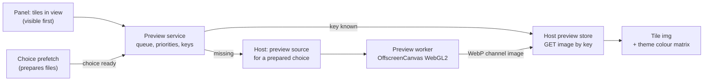

# Choice previews in the Character panel: design

**Status: 27 September 2026. Derived swatches (§5.5), phase 1 (hairstyle pictures) and phase 2 (layouts and turntables) of §10 are built; the rest is a proposal.** How the Character panel can show a picture of each creator choice, in a form chosen per feature type, so that choosing among a hundred hairstyles or thirty brow shapes means looking rather than stepping. It adds to the [choice icons design](choice-icons-design.md) (the game's own atlas icons, swatch tints from the resolved winner) and to item 3 of the [CC controls and presets backlog](../backlog/cc-controls-and-presets.md) (swatches that show what you'll get). It follows the pose library's decision to keep **one preview system for poses and choices** ([pose library Q2](../animation/pose-library-design.md)).

A throwaway prototype in the scratchpad (not committed) rendered flat-shaded hairstyle thumbnails from the reference installation's cached exports, and brow texture crops. Its timings are in §6.

## 1. Summary

| Question | Answer |
|---|---|
| Which choices get a preview? | Every row whose choices differ in **shape** or **pattern**: hairstyles, brows, makeup, freckles, scars, tattoos, face cyberware, piercings, face and body morphs, skin types, nail designs and poses. Rows that differ only in **colour** get a derived swatch, the form they already have. Rows with nothing visual to show (teeth finish, nail length) keep text. The full matrix is §4. |
| What does a preview look like? | One **preview tile** shared by every kind: a bevelled frame on a neutral ground, a neutral grey "subject" (a default head, face region or body) and the choice itself in one **ink** colour, lit by one fixed soft light. Every colour comes from theme tokens, so the tiles belong to the UI rather than being pictures dropped into slots. |
| How is it made? | A small set of **producers**, picked from the resolved data (not from option names): flat 3D render, texture crop, derived swatch and SVG outline. Each writes a **theme-free channel image** (feature coverage, subject coverage, light), and the page colours it with a per-theme SVG colour matrix. So one cached file serves light, dark and "in my V's colours" without being rendered again. |
| Where is it rendered? | In a **preview worker** (OffscreenCanvas, WebGL2, its own context) in the page, off the main thread and outside the viewport's frame budget. The host keeps the results in its derived cache, keyed by the resolved winner. |
| What does it cost? | From already-prepared files: **about 0.1–0.25 s per hairstyle**, dominated by reading a 1–44 MB GLB (median 13 MB). The render itself takes **about 1 ms**. The stored image is **about 2 KB**. The real cost is preparing a choice's files the first time (about 2.8 s and 11.5 MB per mod hairstyle, measured earlier), so previews fill as the row's existing prefetch prepares choices. The native mesh reader later removes that step (phase 7). |
| Layout? | Grid (three sizes), list and details, with a panel-wide default and a remembered choice per feature type. Keyboard use follows the listbox pattern the panel already has. Choices can be grouped by source mod, and a text label is always available. |
| First phase | Hairstyles: worker, channel images, cache, grid sizes and placeholders. About 4 agent-days (§10). |

## 2. Principles

1. **One preview system.** Every kind of choice, and poses, uses the same tile, cache, scheduler, placeholder states and theming. Producers differ only in how they fill the channel image.
2. **Drawn from the resolved winner.** A preview comes from the same resources the 3D view would draw for that choice: the resolver's components, chunk masks, materials and textures after ArchiveXL, TweakXL and archive precedence. A mod that replaces a vanilla hairstyle's mesh changes that hairstyle's preview. Nothing is looked up in a per-mod table, and the producer is chosen from the data (slot group, material template, what the choice changes), never from an option or mod name.
3. **Designed, not captured.** Previews are diagrams of the choice, not photographs. Neutral subject, one ink, one light, a fixed frame per row. The only realistic renders are the few where realism is the point (eye colour, §5.4). The 3D view remains the true preview.
4. **Comparable within a row.** Every choice in a row uses the same camera and frame, derived once per row from the data. Relative length, size and placement are therefore visible: a long ponytail runs out of the frame's bottom edge, a pixie cut doesn't.
5. **Theme-free cache.** The stored image holds coverage and light, not colour, so a theme change, an accent change or tinting in the V's own colour needs no new render.
6. **Instant and stable.** Tiles have their final size from the first paint. A preview arriving, failing or being replaced never shifts layout. The person's clicks come before any preview work (the "respond instantly" rule).
7. **Text is never optional.** Every tile carries its label, as visible text or, at the smallest grid size, as its accessible name and tooltip.
8. **Censored by default.** Body previews follow the uncensored setting exactly as the 3D view does (§5.6).

## 3. The preview tile

### 3.1 Anatomy

```
┌──────────────╮   frame: 1 px --line, bevel 0 var(--bevel-sm) 0 var(--bevel-sm)
│   ground     │   ground: --pv-ground (a flat stage tone, not the radial stage gradient)
│   ▓▓subject  │   subject: --pv-subject, shaded by the light channel
│   ██ ink     │   ink: --pv-ink (or the V's own colour for that part, §3.3)
│            •─┼── corner mark: the existing prepared-ahead mark (never moves layout)
├──────────────┤
│ Label        │   label: --fs-2xs, --text-muted; hidden visually at size S
└──────────────┘
```

- **Aspect per kind:** square for hair, heads, piercings and morphs; 2:1 for brows and lip crops; 1:2 (portrait) for body kinds. A row's tiles share one aspect.
- **States** use the existing choice vocabulary (`components.ts` `c-creator`, `studio.css` `.cc-choice`): hover sets the border to `--line-strong`; **selected** gets the `--signal` border, `--signal-bg` and the inset 2 px bottom bar; **keyboard focus** gets the 2 px `--focus` outline at 2 px offset. A proposed **V's own** marker, a small filled notch in the top-left bevel in `--text-faint`, shows which choice is the saved V's, the target of the row's Reset button.
- **Placeholder** (no image yet): the frame and ground, with a faint glyph for the kind (the hair, brow, face, body or pose icon from `icons.ts`) in `--line`, centred. When the image arrives it fades in over `--dur`, or appears at once under `prefers-reduced-motion`. It never shows a spinner: the corner mark already says the choice is being prepared.
- **No preview possible** (the choice has no geometry, or its files can't be read): the glyph stays. The row's status line and Details explain why, following the choice icons fallbacks; the tile shows no error.

### 3.2 Tokens (proposed; added to `studio.css` and the style guide's colour tokens)

| Token | Light | Dark | Role |
|---|---|---|---|
| `--pv-ground` | `oklch(.93 .004 255)` | `oklch(.27 .006 255)` | Tile ground; the stage's centre tone, flat |
| `--pv-subject` | `oklch(.82 .006 255)` | `oklch(.38 .008 255)` | Neutral head, face or body |
| `--pv-ink` | `oklch(.3 .012 255)` | `oklch(.62 .006 255)` | The choice itself |
| `--pv-shade` | 0.72 | 0.62 | Ink darkening in shadow (a number, used by the colour matrix) |

The prototype used a dark ink of `.92` lightness, which read too white and flat; phase 1's `.86` still read as platinum hair (UI-132). A neutral mid-grey `.62` over a slightly darker subject shows the shape, not a colour, and the stronger shade keeps the hair's form visible.

### 3.3 Channel images and theming

Each producer writes a 4-channel image, unpremultiplied:

| Channel | Meaning |
|---|---|
| R | feature fraction × light |
| G | subject fraction × light |
| B | feature fraction |
| A | total coverage (ground shows through the rest) |

With `f` the feature fraction, `s = 1 − f` and `l` the light, the tile colour is `ink_dark·f + (ink_lit − ink_dark)·f·l + subject_dark·s + (subject_lit − subject_dark)·s·l`. That is linear in R, G and B, so one `feColorMatrix` does it: `filter: url(#xfs-pv-<theme>)` on a plain ``, with `color-interpolation-filters="sRGB"`. The page builds one filter per theme from the computed tokens when the theme changes. It also builds one per row for **"in my V's colours"**: the ink becomes the V's current hair, brow or makeup colour, taken from the same resolved colour the swatch uses. The prototype confirmed this in both themes and with a hair-colour tint, with no per-tile script. Compositing in script instead costs 0.3–0.5 ms per 96–128 px tile (measured) and is the fallback if a platform lacks SVG filters on images.

Texture crops fill the same channels: B is the texture's coverage (for brows, the diffuse alpha plus the powder alpha), R carries the texture's own tone in place of light, and the subject is a flat skin plate.

## 4. The matrix

"Helps" is the value of a preview over the label: **high** where choices differ in shape and names say little (mod hairstyles are often numbered), **low** where the label already says it all. "Source" is what the producer reads, all from the resolved winner. The camera is fixed per row.

| Row group | Helps | Form | Source (resolved winner) | Frame and camera | Notes |
|---|---|---|---|---|---|
| **Hairstyles** (`hairstyle` switcher and twins, mod hair, multi-part hair) | **High** (285 on the reference installation) | Flat 3D render: hair in ink over the default head; turntable strip on hover (L grid, details) | The switcher choice → activated hair options → every component the hair consumers draw: meshes, chunk masks, and per chunk the material's coverage (`Strand_Alpha` for `hair.mt`; the mask or alpha of a cap decal) | Front ¾ (yaw −28°, slight elevation), telephoto (18° FOV), target 0.3 head heights below the head's centre, extent 1.9 head heights. Same for every hairstyle, so length compares | Colour-independent: all 35+ colours of a style share one preview. Multi-part hair draws every part (PREV-109 applies here too) |
| **Hair colours** | Medium | Derived swatch: the `.hp` profile's baked root-to-tip gradient as a narrow vertical chip | The winning `.hp` through the preview's own bake (`hair-colour-model.ts`) | – | Backlog item 3. A pack replacing a vanilla profile changes the swatch |
| **Brow styles** | **High** | Texture crop: diffuse and powder coverage in the V's brow colour over the V's skin tone (or ink over a neutral plate) | The style material's `DiffuseTexture` and `SecondaryDiffuseAlpha`, at a small served mip | **One crop rectangle per row**: the brow mesh's UV footprint (vanilla content spans u 0.03–0.97, v 0.16–0.71, [eyebrows §1](../../knowledge/brows.md#1-the-chain-at-a-glance)), 2:1, never the texture's own bounds | The prototype cropped each texture to its content, which made brows impossible to compare in size. A shared crop fixes that |
| **Brow colours** | Medium | Derived swatch, two stops (primary and powder colour, or the gradient map when `UseGradientMap`) | The colour material's `DiffuseColor`, `SecondaryDiffuseColor` and gradient map | – | |
| **Lash colours** (vanilla: colour only) | Low–medium | Derived swatch | The lash profile's one colour ([hair shading](../../knowledge/hair-shading.md)) | – | |
| **Lash styles** (mods) | Medium | Flat 3D render of the lash cards (coverage from their alpha) over the eye region | The lash components the style draws | Front, eye region, both eyes | Phase 5 |
| **Eye colour** (71 plus mods) | High | **Lit mini-render** of the iris, circular crop | The eye component's resolved material, drawn with the preview's own eye material under a fixed neutral light | Macro front view of one iris | The one realistic kind: eye colour comes from shader arithmetic, so a flat crop would lie. The game's atlas icon is shown until the render exists |
| **Eye shape, nose, mouth, jaw, ears** (morph rows) | Medium | Flat 3D render of the face region, the region's surface in ink and the rest as subject; optional SVG contour | The head morph target's shape keys for that region, applied to the default head | Per region: eyes and mouth front; nose and jaw ¾; ears side | One head, deltas only; cheap once the head is loaded |
| **Skin tone** | Medium | Derived swatch: the tone's `TintColor` and `TintScale` applied to the skin type's mean albedo | The tone chain on the current skin type | – | Round, as the creator shows it |
| **Skin type** (complexion) | Medium | Texture crop of the albedo (cheek and nose), tinted with the current tone | The type's albedo | Fixed cheek rectangle in head UV | |
| **Eye, lip and cheek makeup; freckles; pimples** | **High** (eye makeup is the Studio's own domain) | Flat 3D render: the decal's coverage in ink (or the V's makeup colour) over the face region | The style's decal mesh, chunk mask and mask texture | Per row: eye region front; lips front; cheeks front, slightly wide | Colour rows are derived swatches. The lip finish switcher (none, regular, glossy, matte) uses the style guide's finish swatches |
| **Face scars, face tattoos** | High | As makeup | Scar chunk masks; tattoo mask (tone-linked colour shown as ink) | Front face | |
| **Face cyberware** | High | As makeup (decal coverage plus any geometry) | The cyberware component | Front ¾ face | |
| **Piercings** | High | Flat 3D render: the pieces in ink over the face region | The style's chunk masks over the shared piece banks | Front ¾ face, one frame for every style of the row | Piercing colours: derived metallic swatches |
| **Beard** (masculine) | High | As hairstyles | Beard components | As hairstyles | When the masculine head renders |
| **Teeth** | Low | Derived swatch with the finish style (metallic for gold and silver) | The teeth material | – | |
| **Nails: length** | Low | Text (a morph with two states) | – | – | |
| **Nails: colour and design** | Medium | Derived swatch for plain colours; texture crop of the design, clipped to a nail shape (a UI glyph) | The nail material's colour, or its multilayer design mask | – | |
| **Body shape** (breast morph) | Medium | Flat 3D render of the body, subject only, **censored**: the game's censorship underwear drawn in ink | The body morph target, and the cover the 3D view draws | Portrait, front ¾, chest to hips | Follows the uncensored setting (§5.6) |
| **Nipples, genitals, pubic hair** | Low | **None while censored** (text and the game's icon). With "Show my V uncensored, as the game can" on: flat render, subject only | As the 3D view resolves them | Portrait crop | Evidence captures stay censored |
| **Body tattoos, body scars** | High | Flat 3D render: coverage in ink over the censored body | The tattoo or scar masks and meshes | Portrait, front and back pair | |
| **Poses** (pose library) | High | **SVG outline** from the decoded joints (silhouette or stick figure) | The pose's clip, sampled at its key | Full body, fixed frame | The vector producer writes the same tile; its strokes use `--pv-ink`, so theming is the same |
| Hidden, proxy and link-follower rows | – | None | – | – | Not user-facing |

## 5. Kinds in more detail

### 5.1 Hairstyles (the first phase)

- **What's drawn.** Every chunk the hair components draw, including cap decals and chunks with other templates. The prototype drew only `hair.mt` chunks, so two styles whose volume lives in a cap decal or an untextured chunk (a braided cap, a messy high ponytail) came out patchy. Coverage per chunk comes from the material's own coverage texture (`Strand_Alpha` remapped by the template's `AlphaCutoff` 0.33, as the game does), else its mask or alpha, else solid.
- **Shading.** A soft light term from one fixed key direction (upper left, front), front and back faces lit alike. No specular, no shadow. Hair cards shade with their own normals. Normals derived from screen-space derivatives would give a faceted look, which reads as noise on hair but suits heads; the head keeps smooth normals too, for consistency.
- **Anti-aliasing.** Thin alpha-tested strands alias badly at 56 px. The prototype rendered at 2× with MSAA, which was acceptable at 88 and 132 px and a little noisy at 56 px. The proposal renders once at 256² (2× the largest tile at device pixel ratio 1; 1× at ratio 2) with 4× MSAA and an alpha-to-coverage pass for strands. Smaller sizes are the browser's downscale of the same image.
- **The subject** is the default feminine head, loaded once and not the V's own. That keeps the preview comparable and cacheable once per installation. Whether to offer "on my V's head" is question 2.
- **Turntable.** On hover dwell (400 ms) or focus in the L grid and details, the tile plays an 8-frame strip (8 renders of about 1 ms, one sprite of about 16 KB) with CSS `steps()`. The strip is made the first time it's asked for, and never plays under reduced motion. No GL work happens at hover time once the strip exists.

### 5.2 Texture crops (brows, skin type, nail designs)

The crop rectangle belongs to the **row**: it is derived from the mesh's UV footprint, the same for every choice, so the crops compare. Textures come at the smallest served mip at least twice the tile's size (the native texture reader serves chosen mips already). The prototype decoded full PNGs: 12–18 ms for a 512 × 256 brow and 55–68 ms for a 2048 × 1024 mod brow, mostly decoding and a script bounds scan that the fixed rectangle removes.

### 5.3 Head-region renders (makeup, scars, tattoos, cyberware, piercings, morphs)

These use the hair pipeline with a different feature set. The default head is the subject, the decal or piece meshes are the feature, and coverage comes from the decal's mask texture through its UVs. That keeps the decal's shape on the face exact, which a flat 2D crop of a head-UV mask would not (UV islands are cut and stretched). Morph rows apply the region's shape-key delta to the head and draw the region in ink. Frames are per row, derived from the union of the row's features in head space (piercings), or from the region's vertices (morphs, makeup).

### 5.4 Eye colour: the one lit render

The iris colour is built by the eye shader, not stored as a colour. A flat crop of one texture would therefore show the wrong thing. The producer draws the eye mesh with the preview's own eye material under one fixed neutral light (the creator rig's key, [creator lighting](../../knowledge/creator-lighting.md)), crops a circle around the iris and stores a normal colour image, with no channels, since colour is its content. It sits in the same tile and ground. Until it exists, the tile shows the game's atlas icon from the choice icons work.

### 5.5 Swatches

Colour-only rows keep swatches, derived as backlog item 3 describes: hair and brow gradients, skin tone after the tint, eye colour (the iris render's mean, for the small row swatch), makeup colour. A swatch is a tiny preview in the same system: same tile states, same placeholder rules, derived from the winner, cached by the same key. The game's atlas icon stays as the fallback and as the placeholder (question 6).

**Status (27 September 2026): derived swatches built, with legibility measures.** Built before this design, in `cc-swatch.ts` (host `cc-swatch-host.ts`), and revised after a report that a CCXL brow pack's 35 colours all read as near black:

| What | Decision | Why |
|---|---|---|
| Brow colour derivation | The strand colour, `saturate(gradient × intensity) × tone`, with the diffuse tone read at a **512-px mip** and weighted by **coverage squared** (swatch rules v2) | The old 64-px, linearly weighted read took a mod's own mips, where strands average with black; the pack's tone came out at 0.20 linear against 0.36–0.49 at close-up detail ([hair shading §6.1](../../knowledge/hair-shading.md#61-what-a-brow-colour-looks-like-for-a-swatch)). Two stops (§4) were not adopted: the secondary tint is one constant for every colour of a row, so it tells none apart. A lit strand patch was not adopted either: a swatch shows albedo in sRGB, as the hair profile swatches and the game's icons do, and lighting would change only brightness, not the colour's identity |
| Atlas icons | Unchanged: shown unless a mod replaced the colour's resource | On the reference installation a hair-tone pack replaces the brow gradients, so the vanilla icons (which CCXL brow packs reuse) show colours the game no longer draws; several of the pack's colours are identical in game |
| Tightly clustered sets | **Adaptive per-set contrast** (`swatch-contrast.ts`, `cc-swatch-display.ts`): each maker group (or the whole row) is a set; its members' OKLab distances from the set's mean are scaled per axis (lightness, saturation C/L, chroma-weighted hue), with a gain that is a curve of that axis's spread (1 from a comfortable spread, rising as `(T/σ)^½` below it, capped at 3×) and scaled down to nothing as the set's overall separation approaches a comfortable 0.2. A stretched colour must keep its true colour's name: its chroma grows at most 1.25× its own (lightness does the spreading) and its hue moves at most 5°, not at all below chroma 0.02 (the design gate found near-black maroons turning vivid red at full saturation). Order and identical colours are kept, and every colour is clamped to the sRGB gamut at the same lightness and hue | The brow pack's derived set has an OKLab L spread of 0.10; vanilla hair and lash colours have 0.20–0.21 and come out untouched. The curve is drawn in the style guide's Swatch card entry |
| Truthfulness | The row header's chip always shows the **true** colour; a small marker (a help tip with a half-filled circle: "Colours shown with more contrast so you can tell them apart; hover a swatch for its true colour.") shows only on rows where a group was stretched, and the row's description says so; the swatch card shows the true colour with "True colour. The list shows similar colours further apart." | The list shows relative differences, so the absolute colour must stay one glance away |
| Swatch card | Library component (`components/swatch-card.ts`): after a 120 ms rest, or at once on keyboard focus, a floating card with a 48 px sample (a root-to-tip chip for hair), the name and where it comes from; never moves the layout, takes no clicks, Escape hides it | 30 px swatches are too small to judge by eye |
| Previewing the hovered colour on V | **Not built** | Every choice prepares the V anew; previewing on hover would compete with the person's own clicks, which pre-empt background work. Hovering already prepares the choice next (choice prefetch), so a click shows it quickly |

Captures (light and dark, 340 and 620 px panels, before and after, beside the style-guide specimen) are private evidence under `projects/xf-studio/authoring/evidence/screenshots/colour-swatches/` (`tools/colour-swatch-look.ts`).

### 5.6 Body kinds and the nudity policy

Body previews obey the policy in [body rendering §3](../../knowledge/body-rendering.md#3-censorship-and-nudity-resource-source):

- **Default (censored).** The subject is the body as the 3D view draws it censored: the game's censorship underwear is part of the render (drawn in ink, as a garment), and the censored skin twin is used where the plan uses it. The fail-closed rules apply unchanged, because the producer reads the same plan: if a cover can't be served, the body kind produces no preview.
- **Rows the underwear covers** (nipples, genitals, pubic hair) show no preview while censored: text and the game's icon only.
- **Uncensored** (the opt-in setting on): previews render with nudity allowed, exactly as the 3D view does, as flat subject-only renders.
- **Cache key includes the mode.** Censored and uncensored previews never share an entry. Turning the setting off hides uncensored previews at once, since the tiles switch keys, and they are never used as evidence, in screenshots, committed files or the public site.
- **Tests.** Tests check that a censored request never produces an uncensored key and that a failed cover yields no body preview, beside `tests/uncensored-mode.test.ts`.

### 5.7 Poses (for consistency)

The pose library's phase 5 outlines (a silhouette or stick figure from the decoded joints, generated lazily) become a **vector producer** in this system. It outputs an SVG using `currentColor` and `var(--pv-subject)`, cached by pose clip identity. The tile, placeholder, grid sizes and keyboard behaviour are the same, so the pose tree and the Character panel look alike.

## 6. Generation

### 6.1 Where to render

| Option | For | Against | Verdict |
|---|---|---|---|
| **Preview worker**: a dedicated worker with OffscreenCanvas and its own WebGL2 context | GLB parsing (12–43 ms each on the main thread in the prototype), texture decode, render and WebP encode all run off the main thread. It never competes with the viewport's 12 ms frame budget. Thumbnails need none of the scene's GPU resources: they use their own tiny materials and small textures, and the main scene holds only the chosen choice | A second GL context (well under the browser's cap of about 16). Loaders are duplicated in the worker bundle | **Chosen** |
| Offscreen view in the view graph's one context | Shares the `DetailLoader` cache and the scene's programs | Parsing and uploads on the main thread cause jank. The graph's budget exists for interactive views, and preview batches would erode it | Not for generation. The graph still models previews as derived nodes (§9) |
| Host-side rendering | Previews could be made with no page open, for example during a background "prepare all" | Bun has no GPU. A CPU rasteriser for flat silhouettes is feasible (native modules are allowed) but is new code for little gain while the page is always open when the panel is | Later, only if a page-less path is needed |

Electrobun's Windows host is Chromium-based, so OffscreenCanvas in workers is expected to work there. The first phase checks it in an installed canary.

### 6.2 Pipeline



1. **The panel** asks for previews of the choices it shows, in the order `ChoiceList.visiblePositions` already computes (in view first, then nearest).
2. **The preview service** (application layer, DOM-free) turns each choice into a **preview key** (§6.4) using the host's answer for the choice's parts, and asks the host store for it. A stored preview comes back as a URL at once.
3. **Missing previews** need a **preview source** from the host: for a *prepared* choice, the slot's components as the plan resolved them (geometry file, chunks, per-chunk coverage texture at a small mip, the row's frame). The host derives it from the prepared request's render record, the record the prefetch already produces. For an unprepared choice there is no source yet, and the tile stays a placeholder with its "not prepared" mark.
4. **The worker** renders, encodes WebP and posts it to the host store, which writes it to the derived cache and answers later GETs. The tile gets the URL.
5. **Prefetch drives the fill.** When the row's prefetch marks a choice ready, the service asks for its preview. The prepared mark and the picture therefore arrive together, in the same visible-first order, under the same budgets and pre-emption the prefetch already has.

### 6.3 Scheduling and pre-emption

- **One job at a time in the worker**, from a priority queue: tiles in view, then the rest of the open row, then other open rows. Previews for closed rows are made only when idle and only for choices already prepared.
- **The person comes first.** The service stops dispatching while a person's change is being prepared (the prefetch's `foregroundIdle`) and while a gesture is running in the viewport. A dispatched job is short (tens of milliseconds) and is allowed to finish. Hover and focus move a choice to the front, as for prefetch.
- **Memory.** The worker disposes every geometry and texture after each job and never holds more than one source. The prototype's heap peaked at 150 MB over 27 styles. Sources are fetched one at a time.
- **Context loss** in the worker requeues the job and recreates the context once. A repeated failure marks the choice "no preview" for the session, without a message in the tile. A worker that stops is dropped and started again once, with the subject head loaded first; a second stop leaves previews off for the session (PREV-158).
- **Page memory.** A drawn picture is stored on the host and shown from the host's URL; only one the host couldn't keep is shown from an object URL, at most 48, the oldest revoked first, and all on a row's restart or dispose (PREV-156).

### 6.4 Cache key, storage and invalidation

- **Key** = SHA-256 of canonical JSON: `xfs/choice-preview-1`, the producer kind and its **style version** (camera, frame rule, light, channel encoding, resolution), and for every source resource its depot hash, the winning archive's identity (as the choice manifest records it), the reader or exporter identity, the chunk mask and the coverage texture references, plus the censorship mode for body kinds. Colour is **not** in the key for shape kinds, so every colour of a hairstyle shares one preview.
- **Store.** `preview-cache/choice-previews/<key>.webp` in the host's derived cache. It counts towards the prepared-files budget (8 GB, least recently used first) and is removed by **Clear prepared game files**. Previews are game- and mod-derived assets, local and ignored like every other extracted asset, and are never committed, published or packaged. Size: about 2 KB at 128² (measured median), about 5–6 KB at 256² (estimated), so 300 hairstyles take under 2 MB.
- **Invalidation is by key.** A mod updated, removed or reordered so another archive wins gives a new key (the manifest's rule), and the old entry ages out. A style version bump re-renders in the background, visible rows first, and the previous image stays shown until its replacement arrives: stale but labelled by nothing, since it is a picture of the same choice. Question 9 asks whether that is acceptable.

### 6.5 Measured costs (prototype, 27 September 2026)

Setup: the reference installation's cached exports (27 distinct hairstyles, 24 from mods), the default feminine head, three.js 0.186, Chromium 152 (ANGLE D3D11, RTX 4070), localhost server, 128² output rendered at 256² with MSAA. The tab was hidden, so steps that wait for a frame (copy, readback, encode) are quantised to about 16 ms. Batched renders show the true GPU cost.

| Step | Median | Range | Notes |
|---|---|---|---|
| Source size (GLBs plus coverage PNGs) | 13 MB | 1.2–43.7 MB | 349 MB for 27 styles; 12k–518k triangles |
| Fetch from the host | 44 ms | 6–324 ms | |
| GLB parse | 12 ms | 2–43 ms | Main thread in the prototype, so the worker matters |
| Coverage texture decode | 7 ms | 0–200 ms | 1K–4K PNGs; a 256 px mip removes most of this |
| First render (upload and compile) | 23 ms | 7–129 ms | |
| **Warm render, one angle** | **1.1 ms** | 0.2–1.6 ms | Batched over 16 angles; a turntable strip is about 10 ms |
| Readback and copy | 1–3 ms | (16 ms when frame-bound) | |
| WebP encode | 2–5 ms | (18 ms when frame-bound) | |
| Stored image | 2.0 KB | 1.7–2.6 KB | |
| Colour matrix theming | 0 ms script | – | JS compositing instead: 0.27 ms (96²), 0.48 ms (128²) |
| **Whole run** | **6.2 s for 27 styles** | – | Including 20 extra measurement renders per style in a throttled tab: about 0.23 s per style, 0.1–0.15 s expected when visible |
| Head (loaded once) | 9.4 MB | – | Fetch 45 ms, parse 30 ms |
| Brow crop (full PNG) | 18 ms | 12–68 ms | 512 × 256 vanilla, 2048 × 1024 mod |

**Projection.** All 285 hairstyles of the reference setup, once prepared, take about 30–70 s of background work and under 2 MB of storage. Preparing them is the real cost: about 2.8 s and 11.5 MB each through WolvenKit (measured for the prefetch), roughly 15 minutes and 3 GB for all 285. So previews fill as far as the prefetch has prepared, and phase 7 removes the dependency.

**Cheaper sources (phase 7).** A preview needs only positions, UVs, indices, chunk ranges and a 256 px coverage texture. Normals can come from screen-space derivatives, and skin weights, morphs, tangents and full textures aren't needed. With 16-bit positions and UVs, a 200k-triangle hairstyle's source drops from about 20 MB to about 3.6 MB. Read natively from the `.mesh` (the [native reader](../backlog/native-archive-reader.md)'s phase 4), it needs no WolvenKit export at all, which makes previews of unprepared choices a matter of seconds per row rather than minutes.

## 7. Layout UX

### 7.1 Layouts and sizes

| Layout | Shows | Default for |
|---|---|---|
| **Grid S** (56 px) | Tiles only; label as accessible name and tooltip | Morph rows, colour rows (the existing swatch grid, unchanged in size) |
| **Grid M** (88 px) | Tile and a one-line label | Hairstyles, makeup, piercings, scars, tattoos, cyberware |
| **Grid L** (132 px) | Tile and label; turntable on hover | Brows (2:1, so 132 × 66), eye colour |
| **List** (32 px rows) | 28 px thumbnail, label, source mod, prepared mark | Rows without previews (today's text chips become list rows only if chosen) |
| **Details** | 64 px thumbnail, label, source mod and author, prepared state, "shown in the 3D view" coverage, and for switchers the number of colours; with a larger preview of the focused choice (256 px, turntable) beside or above the list, depending on panel width | Chosen by the person, for close comparison |

- **Scope.** A **panel-wide default** (a segmented control in the panel's toolbar) and an **override per feature type**, remembered in the UI preferences (`UIPreferences`, not the workspace document and not Undo). One choice covers every hairstyle row, both genders and cyberware twins. A per-row control appears in the expanded row's header: a Grid/List/Details segmented control and, in grid, S/M/L. Question 4 asks whether per-type memory is right.
- **Density.** The grid uses `repeat(auto-fill, minmax(size, 1fr))` as the swatch grid does, and the panel's width decides the columns. Tiles use `content-visibility: auto` and images `loading="lazy"`, `decoding="async"`, so a 285-choice row costs little until scrolled. Paging (240 per page) stays.

### 7.2 Keyboard, focus and selection

- The listbox pattern the panel already has: arrow keys move focus without choosing, and Enter or Space chooses. The grid's column count comes from the layout, as today. Added: **PageUp/PageDown** by a visible screenful, **type-ahead** by label (the first matching label after the focus), and Home/End.
- Focus never jumps when previews arrive or the layout changes. Switching layout keeps the focused choice focused and scrolled into view.
- Selection, focus and hover use the existing states (§3.1). The chosen tile is marked at once on click (optimistic, UI-101).

### 7.3 Grouping and search

- **Group by source.** "From the game" first, then each mod, by mod name, with the author once the catalogue carries it, which is being added. Groups are `role="group"` sections inside the listbox, with sticky headers within the row, a count, and collapse. Default: grouped automatically when a row has choices from two or more sources, flat otherwise (question 8).
- **Search** keeps the host search over every choice, and matches mod names and authors too. Results keep their previews, since keys don't depend on the search.

### 7.4 Accessibility

- Every tile has `aria-label` (the choice label) and `aria-description` (source and prepared state), as today. Images are decorative (`alt=""`) because the label is always present.
- In forced-colours mode the colour matrix is dropped (images show their raw channels, recognisable as shapes) and borders use system colours. The selected state keeps a non-colour cue (the inset bar).
- Nothing plays automatically under reduced motion: no fade, no turntable.
- Text alternatives come first: list and details always show text, and the S grid keeps its tooltip.

## 8. Style-guide proposals

To add to the style guide (`src/studio-ui/style-guide/`), as *proposed* patterns until built:

1. **`f-preview-tokens`** (Foundations › Colour tokens): `--pv-ground`, `--pv-subject`, `--pv-ink`, `--pv-shade`, with a light/dark specimen, and a rule: previews use only these tokens, plus the V's own colour when tinted.
2. **`c-choice-preview`** (Components): the tile's anatomy, aspects (1:1, 2:1, 1:2), and states: placeholder glyph, ready, selected, focused, V's own, no preview, and the prepared-ahead corner mark. What: a picture of a choice drawn in the UI's own palette. When: rows whose choices differ in shape or pattern. Not for colour-only rows (use a swatch) or as a substitute for the 3D view.
3. **`c-choice-layouts`** (Components): grid S/M/L, list and details for one sample row, with the layout controls in the row header and the panel toolbar, the grouped variant, and keyboard notes.
4. **`p-preview-kinds`** (Communicating state or a new "Previews" section): one specimen per producer (flat render, texture crop, swatch, lit render, SVG outline) side by side, to review that they read as one family. Each proposal to add a kind is reviewed against it.
5. A **principle** added to Design principles: *"Previews are diagrams. Neutral subject, one ink, one light, one frame per row; the 3D view is the true preview."*

## 9. Architecture fit

- **Reactive graph.** A choice preview is a derived-data node: its inputs are the choice's resolved parts and the producer's style version, and its output is an image URL. Theme and tint are not inputs, since the tile applies them. Any view can subscribe: the Character panel, the Selectors panel's look lists, preset cards, the pose tree. Nothing assumes one panel.
- **Layers.**
  - Domain/application: the preview service (keys, queue, priorities, states) and producer selection from data.
  - Renderer/device adapters: the worker device (OffscreenCanvas, three, encode), the host store, and the host preview-source endpoint.
  - Presentation: the tile, layouts, colour-matrix filters and placeholders.
- **Actions and capabilities.**
  - `character.setChoiceLayout({type, layout, size})` and `character.setChoiceTint({type, on})` are UI-preference actions, with no Undo.
  - `character.previews` is a read-only snapshot of per-choice preview state for the panel and future MCP clients.
  - All three are added to the action catalogue and its golden.
- **Boundary rules.**
  - No producer, frame rule or panel module names an option, slot, mod or resource. Producer selection keys on the slot group, the material template and what the choice changes (the catalogue's existing boundary test is extended).
  - Body producers read the plan's censorship roles only.
- **Host endpoints** (local-only, like the other creator reads):
  - `GET /api/preview-character/creator/previews/<key>` for the image;
  - `POST` of the same path from the page's own origin to store an image;
  - `GET …/preview-source?option=&position=` for a prepared choice's parts.

## 10. Phases

| Phase | Scope | Gate | Effort (agent-days) |
|---|---|---|---|
| **1. Hairstyles** | Preview worker, channel encoding, colour-matrix theming, host store and source endpoint (from prepared records), preview service with visible-first queue driven by prefetch readiness, placeholder states, grid S/M/L for hairstyle rows, tokens, style-guide specimen | Unit tests: key canonicalisation, channel encoding against a synthetic mesh, the colour matrix reproducing the script composite within 1/255, the boundary test. `?verify=1`: a 285-choice hairstyle row fills visible-first with no layout shift, clicks unaffected (choice → V updated within budget while previews run). Installed-canary check of OffscreenCanvas | 4 |
| **2. Layouts** | List and details, panel default and per-type memory, per-row controls, PageUp/PageDown and type-ahead, group by source, turntable strip | Keyboard tests; `?verify=1` session in both themes; forced colours and reduced motion checked | 3 |
| **3. Derived swatches** | Backlog item 3 through the same system: hair and brow gradients, skin tone, makeup, teeth and nail colours; atlas icons as fallback and placeholder | A pack replacing a vanilla profile changes its swatch; report on the reference installation | 2 |
| **4. Texture crops** | Brows (row crop from the UV footprint, tinted in the V's colours), skin type, nail designs; small served mips | Brow crops compare in size; the vanilla set matches its textures | 2 |
| **5. Head-region renders** | Makeup, freckles, scars, face tattoos, cyberware, piercings, morph rows, lash styles; eye-colour lit render | Every head row has its producer, chosen from data; frames per row derived | 4 |
| **6. Body kinds** | Body morph, body tattoos and scars, censored by default; covered rows follow the uncensored setting | Censorship tests (§5.6); evidence stays censored | 2 |
| **7. Sources without preparation** | Compact preview sources read natively from `.mesh` (needs the native reader's phase 4); previews for unprepared choices; an opt-in "Make previews for this row" with its cost shown first | A 285-choice row fills without WolvenKit | 3 (after native phase 4) |
| **8. Poses** | Vector producer for pose outlines in the same tile (with pose library phase 5) | The pose tree and the Character panel share the tile | 1 |

Phases 1–6 come to about 17 agent-days; phases 3 and 4 can run in parallel with phase 2.

### Phase 1 status: hairstyles

Built on `claude/choice-previews` (27 September 2026), awaiting the UI/UX gate and the full suite.

| Part | Where | Notes |
|---|---|---|
| Kinds, sources, keys, theming, camera | `src/choice-preview.ts` | The kind comes from the preview detail an option draws (`CcPanelOption.preview`, from `cc-render-coverage.ts`; colour rows keep swatches). A source is every component of that detail slot in the prepared request's record, with each chunk's coverage from the template table's new `coverage` field (`render-templates.ts`: `hair.mt` `Strand_Alpha` red through `AlphaCutoff` and the dither range; cap decals their mask; decals their diffuse alpha; anything else solid). Key: SHA-256 of the source identities, the style and the subject head's identity, with no colour |
| Rendering | `src/choice-preview-render.ts`, `src/choice-preview-worker.ts` | Raw WebGL 2 on an OffscreenCanvas in a module worker (42 KB, no three.js). Coverage is exact rather than alpha-to-coverage: every chunk is alpha-tested against a 2 × 2 ordered threshold at 512² with 4× MSAA, resolved and blitted 2:1 to 256², so each pixel holds 16 geometric samples and its four thresholds once, and the resolved RGBA is the premultiplied channel image. Style v4: yaw −28°, elevation 8°, 18° field of view, target 0.04 head heights below the head's centre, 1.78 head heights framed, so tall styles keep headroom (v3's 0.12 and 1.65 let buns touch the top edge; the prototype's 0.3 and 1.9 cropped them and left the lower third empty, because the core head's bounds include the neck) |
| Host | `src/choice-preview-host.ts`, `src/choice-preview-server.ts`, `CharacterDetailHost.previewSources` | Images in `choice-previews/images/<key>.webp`, sources indexed by the choice's manifest name and stamp (`XFS_CHOICE_PREVIEW_CACHE` relocates them). A source is derived only for a choice preparing ahead marks ready, by planning and writing its record from the caches **without writing a manifest and without dangle specs** (`skipDangles`: reading a hairstyle's physics rig took 5.5 s and two WolvenKit launches per preparation). Derivations run one at a time, never beside a person's change or a batch prepared ahead; while the page asks, the next batch waits (`PREVIEW_HOLD_MS`); a person's change stops a derivation unless it has reached its writing step. Counted in and removed by Clear prepared game files, and evicted least recently used first with the prepared files' budget (a picture or source served or kept this session is never evicted; PREV-157). A derivation waits at most `PREVIEW_DERIVE_WAIT_MS` (3 s) for the background lane and then answers `busy` (asked again later, not a try), and stops waiting when the page abandons the request (PREV-153) |
| Scheduling | `src/choice-preview-service.ts` | The maintainer's order: the chosen choice, the one under the pointer or focus, the row in view order, then other rows of the same kind shown this session (the feature-set tier). Stored sources are looked up for every choice shown, so a later session fills at once (a picture may be of the choice as it was before a mod update, until replaced: Q9); only ready choices are derived. Three lanes, one job each: lookups, one derivation and one drawing, so a waiting derivation never holds up stored pictures (PREV-153); a derivation is abandoned when its choice leaves the row or the V changes. A failed host question counts a try on the choice being derived (failed at the third) and backs off, doubling from 1 s to 60 s; a host of another version (409) stops previews until reload, and the row's status line says so in plain words, as it does while the host keeps failing (PREV-150). Rows belong to one body and catalogue: another body or a catalogue change starts the row again and releases its pictures (PREV-154). A subject head that couldn't load is asked again later and fails no choice (PREV-155). A started job always finishes and is kept |
| Presentation | `studio-ui/components/choice-preview.ts` (library: `previewTile`, the per-theme filters), `studio-ui/panels/character-choices.ts`, `studio.css` | Tiles in `choiceItem`s in a `.choices.previews[data-size]` grid (S 56, M 88, L 132 px); placeholder glyph, fade-in, no-preview state; Up and Down move by columns. The row's S/M/L Segmented sets the `choiceSize.set` UI preference per kind (the design's `character.setChoiceLayout` with layout fixed to grid for now). One colour matrix per theme (`xfs-pv-light`, `xfs-pv-dark`), so a specimen pane with its own colour scheme is right too; tokens `--pv-ground`, `--pv-subject`, `--pv-ink`, `--pv-shade` (`--pv-shade-light` .72, `--pv-shade-dark` .62) |
| Style guide | Foundations › Preview tokens (`f-preview-tokens`), Component library › Choice preview (`lib-choice-preview`), the "Previews are diagrams" principle | The specimen draws synthetic channel images in the page |

**Tests.** `tests/choice-preview.test.ts` (key canonicalisation, sources from a synthetic record, the colour matrix against the script composite within 1/255 in light, dark and tinted palettes, the camera, the store and source index, the endpoint, the scheduling order, pause and threshold, the boundary scan), `tests/webgl-choice-preview.test.ts` with its probe page (channel encoding of a synthetic feature over a synthetic subject on a real GPU: full coverage, half coverage over the subject, an unlisted chunk, the ground), and `tests/studio-ui-boundary.test.ts` (the tile's one pure import).

**Measured** (reference installation, RTX 4070, headless and pane Chromium; details in [performance](../backlog/performance.md)): the largest row, 283 hairstyles already prepared ahead, fills in 146 s cold (source derivation 117 s of it, median 0.15 s each; drawing median 184 ms per picture, of which draw 27 ms and encode 19 ms, for a median 8.5 MB source) and in 0.76 s warm. 8 KB per 256² picture, 3.0 MB for the row. A click while pictures are drawn: host answer 187 ms and placed at 265 ms, against 319 ms idle for a part new to the page.

**Captures** (private, installed mods' hairstyles): `projects/xf-studio/authoring/evidence/screenshots/choice-previews/` (`tools/choice-preview-look.ts`): light and dark at 300 and 480 px panels, sizes S, M and L, beside the style guide's entries in comparison mode.

**Not in phase 1:** the turntable and **drag-to-spin** (the maintainer's refinement of Q5: press and drag on a preview to turn it) came with phase 2 (below); tinting in the V's colours (Q1) needs only a per-row matrix; a picture replaced within a session after a mod update; the installed-canary OffscreenCanvas check (the worker ships in the desktop bundle; the canary run is the maintainer's).

### Phase 2 status: layouts and turntables

Built on `claude/choice-previews-2` (27 September 2026), awaiting the UI/UX gate and the full suite.

| Part | Where | Notes |
|---|---|---|
| Turntable strips | `src/choice-preview.ts` (`TURNTABLE`, `turntableYaw`, the `"turntable"` key variant, `previewCamera`'s `turn`), `src/choice-preview-render.ts`, `src/choice-preview-worker.ts` | 24 frames one full turn apart (15° steps; frame k at the still's yaw + k·15°, so frame 0 is the still), drawn by the same worker from the same uploaded source (the upload, the costly part, is paid once) and laid side by side in one 6144 × 256 WebP (quality 0.9). Keyed apart: the still's key input is unchanged, the strip's adds the turntable's own style. Stored in the same content-addressed store (`PREVIEW_IMAGE_MAX_BYTES` now 1 MB) |
| Scheduling | `src/choice-preview-service.ts` (`PreviewAsk.spin`, `ChoicePreviewRow.spins`) | Only the one choice the list wants turning gets a strip, never a whole row: the hovered tile in the grid's L size, or in details the choice its large picture shows. It is drawn right after the chosen and hovered stills and before the rest of the row, looked up in the store first, and once started always finishes and is kept (the maintainer's threshold rule) |
| The turn | `studio-ui/components/choice-preview.ts` (`PreviewSpin`, `SPIN`) | Two copies of the strip over the still: the frame under the angle and the next one, blended by the fraction between them, with one colour matrix on the clipping layer. The pointer resting on a picture turns it after 400 ms (one turn in 8 s; never under reduced motion); pressing and dragging turns it at once (one turn per 1.5 frame widths), and a drag past 4 px swallows its closing click, so a drag never chooses and a click still chooses at once. Released, it rests on the nearest frame. The strip is an image source only while it turns, so no tile holds a decoded strip it isn't turning |
| Layouts | `studio-ui/panels/character-choices.ts`, `studio-ui/components/choice-preview.ts` (`previewStage`, `setMeta`), `studio.css` | Grid S/M/L; **list** (32 px rows: 28 px picture, label, and the source only where no heading says it: under the pooled "Other mods"); **details** (the same small rows plus the prepared state only while a choice isn't ready, in the legend's words, and a large picture of the choice under the pointer, else the focused one, else the V's, which never scrolls away: a 180 px picture kept at the top of a column beside the list from a 440 px row; below that a compact block, the picture at most 140 px or 40 % of the window's height with the name and source beside it, kept at the top while the list scrolls beneath and the maker headings stick under it; UI-136). Switching keeps the same items, so focus stays and is brought into view. Maker group headings stay in view while their choices scroll (§7.3's grouping, which the rows already had) |
| Layout memory | `src/ui-preferences.ts` (`choiceLayout.set`, `choiceLayout`, `choiceLayouts`), `studio-ui/panels/character.ts` | Per feature type (picture kind), with a panel-wide default; setting the default clears every type's own, so it shows everywhere at once. The row's header has Grid/List/Details and, in grid, S/M/L. The panel-wide default is in the command palette ("Show every row's pictures as …") rather than a toolbar control while hairstyles are the only pictured type; a toolbar control can follow when a second kind arrives |
| Keys | `studio-ui/components/listbox-keys.ts` (`TypeAhead`, `pageStep`) | PageUp/PageDown by a screenful of the list's scrolling view (its rows times the grid's columns, less one row for context), type-ahead by label (the same letter again cycles; accents and case ignored; a space counts only inside a word). Shared by the library's Choice list |
| Style guide | Component library › Choice preview (a turning L specimen), Choice layouts (`lib-choice-layouts`: the row's controls and all three layouts with a turning large picture) | A synthetic 24-frame strip drawn in the page |

**Tests.** `tests/choice-preview.test.ts` (the strip's key apart from the still's, with the still's key input unchanged; turntable frames about the head's axis; scheduling: a strip only for the wanted choice, after the chosen and hovered stills and before the rest, finished when the pointer moves on, found stored without drawing), `tests/webgl-choice-preview.test.ts` (the strip on a real GPU: 6144 × 256, frame 0 equal to the still within 1/255, from behind the subject hides the feature), `tests/choice-layouts.test.ts` (layouts, the large picture outside the listbox and what it shows, the wanted turntable per layout, a drag turns and never chooses while a click chooses, the dwell, reduced motion, PageUp/PageDown and type-ahead in both lists), `tests/ui-preferences.test.ts` (layout memory).

**Measured** (reference installation, RTX 4070, headless Chromium, `?verify=1`; details in [performance](../backlog/performance.md)): 44 strips drawn cold, end to end median 250–335 ms, p90 480–520 ms, max 725 ms (24 frames drawn in a median 32–41 ms, WebP encode 89 ms, the rest fetching and decoding the source); 139 KB median per strip, 361 KB the largest. Hover to the strip being there: median 247–328 ms; hover to the first turn shown: median 415 ms (the 400 ms dwell), p90 470–540 ms, max 739 ms. No main-thread long task in 35 s of hovering while 20 strips were drawn; the page's JS heap stayed at 243–261 MB. A click made while a strip is drawn wasn't timed: a capture page that prepares new V's needs more than the 2 GB it had beside the server (see performance).

**Captures** (private, installed mods' hairstyles): `projects/xf-studio/authoring/evidence/screenshots/choice-previews-2/` (`tools/choice-layouts-look.ts`): list, details, details turning and mid-drag, grid L, grid L turning and mid-drag, light and dark at 300 and 480 px, and the guide's Choice layouts and Choice preview entries in comparison mode.

**Follow-up: every grid size and live turns** (`claude/spin-all-grids`). Hover and drag now turn pictures in grid S and M too (one strip serves every size; list rows don't turn), and a small turning tick in the frame's corner shows while a picture should turn but its strip is still being drawn on first look. The strip stepping through 24 frames with a blend read as a slideshow, so the one picture being turned is now drawn **live** by the preview worker: `PreviewRenderer.load` keeps its source uploaded and `present` draws it at the exact angle straight to the worker's canvas and hands it over as an ImageBitmap (no readback), shown in a `bitmaprenderer` canvas at up to 30 frames a second, one request at a time. The strip stays the instant fallback until the first live frame and while the live turn is paused; each row owns its wish for a live turn (only that row changes or withdraws it) and the worker's one uploaded source goes to the newest wish, an older one getting it back when the newer is withdrawn (PREV-152); started once the choice's strip is there, stopped when the pointer leaves, paused while a person's change is prepared (`ChoicePreviewRow.live`); a start that a newer one replaced isn't a failure (PREV-151). Measured at 300 px, light and dark, on a base-game style: 29 frames a second; the worker's time per frame median 0.1 ms, 0.2 ms with the GPU waited for (every 15th frame); the main thread 0.45 ms a second; no long tasks; starting the live turn 0.8 s after the strip (the upload waits for the worker's current drawing). Captures: `evidence/screenshots/spin-all-grids/` (grid M turning live and mid-drag).

**Not in phase 2:** a visible toolbar control for the panel-wide default (the palette has it); tinting in the V's colours (Q1); turning the large picture from the keyboard; turntables for the other kinds (they come with their producers).

## 11. Risks


| Risk | Mitigation |
|---|---|
| Thin strands alias at 56 px and look noisy | 256² render, MSAA and alpha-to-coverage; S size downsampled from the same image; judged in the phase 1 `?verify=1` session |
| Hairstyles whose shape lives in cap decals or oddly textured chunks come out patchy (seen in the prototype) | Draw every chunk the components draw, with coverage from whatever mask the material has (§5.1) |
| Large sources (up to 44 MB) exhaust memory | One job at a time in the worker, dispose after each, sources fetched one at a time; compact sources in phase 7 |
| Worker WebGL unavailable in the desktop host | Detected once; fall back to the shared context with small batches at idle (slower but correct) |
| Previews look like a mix of styles as kinds are added | One tile, tokens and light constants in the style version; the `p-preview-kinds` specimen reviewed with each new kind |
| Nudity leaking into previews | Keys include the censorship mode; producers read the plan's roles; covered rows show no preview while censored; tests |
| Stale previews after a mod update | Keys are content-addressed from the winner, so an update gives a new key |
| Previews compete with the V's own preparation | They start only from files already prepared, and dispatch pauses during a person's change |

## 12. Open questions, with proposed defaults

**Decided 27 September 2026:** all proposed defaults accepted, with two refinements:
- **Spin (Q5):** besides the slow spin on hover, pressing and dragging on a preview grabs and turns it directly, so nobody waits for the automatic spin.
- **Preparation (Q7): no manual "load previews" step.** Smart scheduling decides what to prepare, in this priority order:
  1. the active selection;
  2. the choice under the pointer;
  3. the current row;
  4. the current feature set.

  A load already past a progress threshold is never cancelled when priorities change. It finishes at low priority and is cached, so the work already spent isn't wasted. This scheduling rule applies to the Studio's other background preparation too ([performance](../backlog/performance.md)).

| # | Question | Proposed default |
|---|---|---|
| 1 | Hair (and brow, makeup) previews in the theme's ink, or in the V's current colour? | Ink by default, with an **In my V's colours** toggle per feature type (free with channel images) |
| 2 | Previews on the neutral default head, or on the V's own head (morphs, skin)? | Default head: comparable and cached once. Revisit for makeup rows, where the V's own eye shape may matter |
| 3 | Default grid size per type? | M for hairstyles and makeup, L for brows and eye colour, S for morphs and colours |
| 4 | Layout per row, per feature type or panel-wide? | Panel-wide default plus a remembered override per feature type |
| 5 | Turntable on hover? | Yes, in L and details only, after a 400 ms dwell, never under reduced motion |
| 6 | Derived swatches or the game's atlas icons for vanilla colours? | Derived where the Studio can derive them (they follow replacements); atlas icon as fallback and placeholder |
| 7 | Prepare choices just to make their previews? | Only within the existing prefetch budget for the open row; a full row on request, with its time and disk cost shown first |
| 8 | Group by source mod by default? | Automatic when a row has two or more sources |
| 9 | After a style change, keep showing the old preview until the new one arrives? | Yes; it shows the same choice |
| 10 | Should a masculine V's previews wait for the masculine head? | Yes; rows already say they aren't drawn |

## Related

[Choice icons design](choice-icons-design.md) · [CC controls and presets backlog](../backlog/cc-controls-and-presets.md) · [Pose library design](../animation/pose-library-design.md) · [View graph design](../authoring/view-graph-design.md) · [Performance track](../backlog/performance.md) · [CC file chain](../../knowledge/cc-file-chain.md) · [Hair shading](../../knowledge/hair-shading.md) · [Eyebrows](../../knowledge/brows.md) · [Face makeup](../../knowledge/face-makeup.md) · [Body rendering](../../knowledge/body-rendering.md) · [Mod loading](../../knowledge/mod-loading.md)
