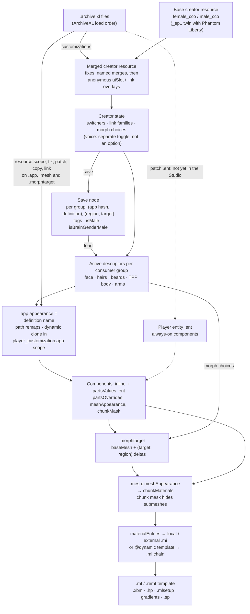

# Character-customisation file chain: the consolidated map

**Status (30 September 2026): consolidated across every creator category.** This page is the navigable index of how the game ties character customisation (CC) together, category by category, and where XF Studio's resolver reproduces each link. The detailed, evidence-graded explanations live in the knowledge pages it links; the [CC file chain](../../knowledge/cc-file-chain.md) is the distilled reference. Evidence grades follow the [knowledge rules](../../knowledge/README.md): **[resource]** extracted 2.31 game or mod resources, **[source]** engine, framework, tool, decompiled-script or Studio source, **[wiki]** Modding Docs text or image, **[runtime]** the running game, **[hypothesis]** not yet established. Nothing new on this page is runtime evidence; the runtime claims it repeats are marked and cited.

## Sources for this consolidation

| Source | Version | Used for |
|---|---|---|
| Vanilla creator resources, extracted and normalised (ignored `research/consumers/cc-file-chain/`) | game 2.31 (`GameVersion` 2310), WolvenKit CLI 8.17.4; hashes in the [option inventory](cc-option-inventory.json) | Every count, slot, link and consumer group below, both body genders, Phantom Liberty (`_ep1`) twins. Re-read on 30 September with a short read-only script (not committed) |
| Representative `.app`, `.ent` and player entities (same folder) | 2.31 | Appearance and component routes; the duplicate cheek `.app` (contradiction C10) |
| ArchiveXL source and bundle `.xl` files, `D:/Dev/cp2077-archive-xl` | 1.27.3, commit `5474e34d` | Customization merge and overlays, `ResourcePatch` (including `.ent` patches), the bundled per-category fixes and scopes |
| Decompiled 2.31 game scripts (ignored `research/consumers/expressions/raw/scripts/`) | `final.redscripts` SHA-256 `2119046f…ee86`, redscript-cli 0.5.31 | The voice-tone row (`characterCreationBodyMorphMenu.script`, SHA-256 `651c706d…66ca`; `characterCreationGenderBackstoryMenu.script`) |
| Studio creator catalogue of the reference installation (ignored `projects/xf-studio/authoring/data/resolver-cache/reports/cc-catalogue-{female,male}.json`) | 26 September 2026 | Which categories installed CCXL mods extend, as counts (the reports name mods, so they stay local) |
| `.xl` files of the reference MO2 instance (1,052 files; 152 mods declare `customizations`) | 30 September 2026, read-only scan | Which mods patch `.ent` files: three, a face-rig fix (every feminine and masculine player entity, 22 targets including an NPC framework's player copies), a body-type tag mod (its patch entity into a scope) and a nail mod (between its own entities); `!exclude`, `!include`, `copy`, `link` use |
| Studio resolver, `projects/xf-studio/authoring/src` | `main` at `2d6752b` | What is reproduced today (`character-resolver.ts`, `cco-model.ts`, `archivexl-config.ts`, `resource-graph.ts`, `character-context.ts`, `character-detail-plan.ts`, `tweakxl-overlay.ts`) |
| Cyberpunk Modding Docs clone `D:/Dev/Cyberpunk-Modding-Docs` | fast-forwarded on 30 September from `be2f44ee` to upstream `a54b0873`; the one new commit adds a quest guide and changes no page cited here, so links pin `be2f44ee` | Text **and** images; see [wiki evidence](#wiki-evidence) |
| Legacy xf-omega generator and its `sx-cp2077` notes | `28c822ea`, `b139ccab` | Already distilled in the knowledge page's [legacy lessons](../../knowledge/cc-file-chain.md#lessons-from-the-legacy-generator); nothing new was taken from them |

## The chain

Read it top-down. The creator state is what the player sets (which switcher choice, which colour index per link family, which morph); the save does **not** store it, only the resolved descriptors per consumer group, and a load starts from those. Every category below runs the same chain; they differ in the option shape (switcher tree or single option), the variant mechanism (mesh appearance, chunk mask or a different resource), which consumer group draws them, and which ArchiveXL framework, if any, extends them. The dotted branch is the one route the Studio does not follow yet ([gap 3](#resolver-gaps-ranked)). Per-resource detail: [CC file chain §1–3](../../knowledge/cc-file-chain.md#1-the-chain-at-a-glance).

## Per-category map: from creator option to appearance

"F/M" counts are the feminine and masculine `_ep1` creators (with Off where the creator shows one). "Save groups" are where the save repeats the chosen descriptor ([save format](../../knowledge/cc-file-chain.md#7-how-a-save-stores-cc-choices)); `cc` abbreviates `character_customization`. Head paths abbreviate `base\characters\head\player_base_heads\appearances\` as `…\`; body paths `base\characters\common\player_base_bodies\appearances\` as `b…\`. All [resource] unless marked.

| Category | Creator options (type, slot) | Appearance route | Variant mechanism | Morphs | Save groups |
|---|---|---|---|---|---|
| **Body gender** | Not an option: the first creator screen picks the male or female creator resource and player entity (`player_wa_*` / `player_ma_*`) [source] | The whole catalogue differs per body | – | 21 vs 20 targets per face region | Node field `isMale` |
| **Voice tone** | Not an option: row 0 of the creator list is a separate voice-over switcher widget that sets `IsBrainGenderMale` and plays a sample (`OnVoiceOverSwitched`, `TriggerVoiceToneSample`); choosing a body gender sets both genders alike (`OnReleaseMale/Female`) [source] | None: no creator resource, group or `.app` names it | – | – | Node field `isBrainGenderMale` (`isMaleVO` in UI presets) |
| **Skin tone** | `skin_color` (appearance, empty `resource`, 12 definitions, link controller of `skin color`), 12/12 | None of its own; drives the same index on 97 F / 72 M followers | Linked index → each follower's mesh appearance | – | Never stored; visible as the tone suffix of every linked definition |
| **Skin type** (complexion) | Switcher `skin_type` (5) → `skin_type_01…05` (12 tones each) | `…head\h0_000__basehead(_d02…d05).app` → `h0_000_pwa__basehead.ent`; also brings the personal-link decal and a shadow-only seam fix | Different `.app` per type; mesh appearance per (tone, type), 60 local materials | Head carries all 105 (F) / 100 (M) | `skin_type_0N` in TPP, TPP_photomode, cc |
| **Face shape** | Morphs `eyes`, `nose`, `mouth`, `jaw`, `ear` (None + 21 F / 20 M) | Every morph component that carries the `(target, region)` pair | Region = option name, target = choice | The whole point | `(region, target)` in TPP, TPP_photomode, cc; `None` not stored |
| **Eye colour** | `eyes_color` (71; 254 on the reference installation) | `…head\he_000__basehead.app` (ArchiveXL remaps to `archive_xl\…\he_000_pwa__basehead.app`) → eye component, own `he_000_pwa__morphs.morphtarget` | Mesh appearance per colour; chunk mask hides the lash chunk | 21 `eyes` targets | `eyes_color` in TPP, TPP_photomode, cc |
| **Eyelashes** | `eyelash_color` (35); no vanilla style row. CCXL lash styles need a core mod's own switcher (`eyelashes_options` on the reference installation) [wiki: icxrus's lash guide] | `…head\hel_000__basehead.app` (remapped) → the **same** eye component | Mesh appearance `eyelashes__<colour>`; chunk mask shows only the lash chunk | 21 `eyes` targets | `eyelash_color` in TPP, TPP_photomode, cc (+ `face` masculine) |
| **Eyebrows** | Switcher `eyebrows` (Off + 13) → `eyebrows_color1…13` (35, link `eyebrows color`) | `…head\eyebrows\heb_000__basehead_NN.app` (remapped per sex) → one shared brow mesh and morph target | Style = texture set on the shared mesh; colour = mesh appearance `<colour>__NN` | All 105 | `eyebrows_colorN` in TPP, TPP_photomode, cc |
| **Hair style and colour** | Switchers `hairstyle` and `hairstyle_cyberware` (51 each, link `hairstyle`; choices carry a length tag) → `hair_colorN` (35, link `hairstyle color`) + hidden `hair_color_fpp_N` | `…hairs\hh_NNN_pwa__hairs_XXX.app` → hair mesh(es), a shadow-only mesh, a dangle animgraph | Mesh appearance = colour name | None | `hair_colorN` in hairs, cc; FPP twin in FPP_hairs; node `tags` = colour tag + length tag (C8) |
| **Beard** (masculine) | Switcher `beard` (Off + 12) → 13 part switchers `beard0…12` (slot `beard_part`, 1–7 choices, 57 in all) → 57 `beard_colorN_M` (slot `beard_color`, 35, link `beard color`) | `…facial_hairs\hb_000_pma__*.app` → stubble decal + card mesh | Mesh appearance with `@beard` names | Beard morph targets | `beard_colorN_M` in beards, cc |
| **Eye makeup** | Switcher `makeupEyes` (Off + 36) → `makeupEyes_01…36` (14 colours) | `…head\makeup_eyes\hx_000__basehead_makeup_eyes_NN.app` → one shared decal mesh | Style = `.app` and material set; colour = mesh appearance | All 105 | face, cc |
| **Lipstick** | Switcher `makeupLips_type` (Off / regular / glossy / matte) → `makeupLips`, `_glossy`, `_matte` (38 each) → 114 style options (1–14 colours) | `…head\makeup_lips\hx_000__basehead_makeup_lips_NN(_02/_03).app` → one shared mesh | Finish = `.app` suffix and appearance suffix; colour row per finish and style [runtime: sessions 5–6] | All 105 | face, cc |
| **Cheeks** (freckles 1–4, blush 5–24) | Switcher `makeupCheeks` (Off + 24) → `makeupCheeks_01…24` (4 or 16 colours) | `…head\makeup_freckles\hx_000__basehead_makeup_{freckles,cheeks}_NN.app` (not the stray `makeup_cheeks\` copy, C10) → one shared 2-chunk mesh | Style = `.app`; colour = mesh appearance | All 105 | face, cc |
| **Blemishes** | Switcher `makeupPimples` (Off + 3) → `makeupPimples_01…03` (6) | `…head\pimples\hx_000__basehead_pimples_01.app` | Mesh appearance + chunk mask | All 105 | TPP, TPP_photomode, cc (+ `face` masculine) |
| **Face scars** | `scars` (Off + 13, one appearance option) | `…head\hx_000__scars.app` → one 11-chunk mesh | **Chunk mask per scar**, one mesh appearance | All 105 | TPP, TPP_photomode, cc |
| **Facial tattoos** | Switcher `facial_tattoo` (Off + 15) → `facial_tattoo_01…15` (12 tones, link `skin color`); hidden legacy `tattoo` (7) | `…head\tattoos\hx_000__tattoo_NN.app` → one mesh per design | Design = `.app`; **tone follows skin tone** | All 105 | TPP, TPP_photomode, cc |
| **Face cyberware** | Switcher `cyberware` (Off + 16; also swaps `hairstyle` ↔ `hairstyle_cyberware`) → `cyberware_01…16` (12 tones) | `…head\hx_000__cyberware.app`; newer designs are appearances of the freckle and tattoo decal meshes | Design = component or appearance; tone linked | All 105 | face, cc |
| **Piercings** | Switcher `piercings` (Off + 14 F / Off + 16 M) → `piercings_NN` (slot `piercings_color`, 16 metals, link `piercings color`) | `…head\piercings\i0_000__earring_NN.app` → up to three components over four shared piece banks | Chunk mask per style; one mesh appearance (metal) for every piece | Only the regions each bank needs (ear, nose, or all five) | face, cc |
| **Teeth** | `teeth` (5) | `…head\ht_000__basehead.app` → `ht_000_pwa__morphs.morphtarget` | Mesh appearance per finish (skin or layered template) | 21 `mouth` targets | TPP, TPP_photomode, cc |
| **Always-on head parts** | Hidden `neck`, `tpp_head_proxy`, `fpp_head_proxy`, `tpp_head_face_rig(_photomode)`; `finalSceneBruises` (quest) | `b…\n0_000_base_fpp__neck.app`, `…head\proxy\…`, `…head\face_rig\h0_000__basehead_face_rig(_ep1).app` | Tone link (neck, proxies) | Face rig 000 whatever the sliders [wiki: saltypigloaf's rig guide] | FPP, TPP_proxy, FPP_proxy, TPP(_photomode); bruises only in `finalSceneBruises` |
| **Body skin** | Hidden `body_color` / `body_color_censored` (+ FPP twins), 12 tones, censorship pair | `b…\t0_000_base__full(_censored).app` | Tone by mesh appearance | Female body carries the breast targets | TPP_Body, character_creation (+ FPP_Body masculine; FPP twins in FPP_Body) |
| **Breast size** (feminine) | Morph `breast` (small / None / big, link `breast_size`) | Female body morph target | Morph | `t0_000_wa_base__full_breast_{small,big}` | breast, character_creation |
| **Nipples** | Switcher `nipples` (4 F / 2 M; the choice labelled Off activates `nipples_04`) → `nipples_01…` (12 tones; `nipples_01` names no `.app`) + FPP twins | `b…\i0_000_base__nipple.app`, `i0_000_fpp__nipple.app` | Tone link; style by mesh appearance | – | TPP_Body, character_creation; FPP twins in FPP_Body |
| **Genitals, size, pubic hair** | Switcher `genitals` (4) → `genitals_0N` (12 tones); morph options `penis_base`, `penis_circumcised` (3 each); `*_hairstyle` switchers → 19 pubic-hair colour options; available to both bodies; excluded from randomise | `b…\i0_000_base__genitals.app`, `i0_000_base__genitals_hairstyle_NN.app` | Tone link; size morphs; hair colour link | Size morphs | genitals, character_creation |
| **Body tattoos** | Switcher `body_tattoo` (Off + 7, link `body_tattoo`) → `body_tattoo_01…07` (12 tones) + FPP twin switcher on the same link | `b…\t0_000_base__tattoo_NN.app`, `t0_000_fpp__tattoo_NN.app` | Design = `.app`; tone link | Feminine: breast targets; masculine: garment meshes | TPP_Body, character_creation (FPP twin in FPP_Body) |
| **Body scars** | Switcher `body_scars` (3 choices over 5 options) | `b…\scars_000_base.app` | Chunk mask per scar; tone link | – | FPP_Body, TPP_Body, character_creation |
| **Nails** | Morph `nails_l` (+ follower `nails_r`, link `nails_size`); `nails_color(_tpp)` (54, link `nails_color`) + FPP and cyberware-arm followers | `b…\a0_000_base__nails.app`, `a0_000_fpp__nails.app` | Length morph; colour or design by mesh appearance | Nail length | Colour: holstered groups + cc; length: nails, cc |
| **Arms and arm cyberware** | About 25 hidden arm options per holster state (12 tones), chosen by equipped cyberware through `perspectiveInfo` | `b…\a0_000_*` and `b…\arms\<cyberware>\…app` | Tone link; state = group | – | `holstered_*` / `unholstered_*` groups (feminine split `_tpp`/`_fpp`) |
| **Feet** | Hidden `flat_feet` / `lifted_feet` (12 tones), chosen by footwear | `b…\l0_000_base__cs_flat.app`, `l0_000_base__full.app` | Tone link; chunk mask | – | flat_feet / lifted_feet (+ character_creation) |
| **Censorship underwear** | Hidden `underpants` (5), `Censor_Nudity` = Activate | `b…\t0_000_base__censored_items.app` | – | – | FPP_Body, TPP_Body, character_creation |

## Per-category map: materials, extension and the Studio

"ArchiveXL framework" means ArchiveXL's own bundle carries a per-category fix, scope and colour patch for it (`bundle/source/resources/PlayerCustomization{Eyes,Lashes,Brows,Hair,Beard}*.xl`) [source]. Only those five categories are in the `player_customization.app` scope, so only their mod options get ArchiveXL's dynamic appearance cloning; a CCXL option in any other category must define every appearance it names (mesh-side `@context`/`*{material}` expansion still works for any mesh) [source]. "Reference installation" counts are CCXL choices from installed mods in the Studio's feminine catalogue (26 September), masculine where noted. "Studio" is the resolver and preview on `main` at `2d6752b`.

| Category | Template and textures | ArchiveXL framework / CCXL routes | Reference installation | Studio |
|---|---|---|---|---|
| Body gender, voice | – | Not extendable through CCXL | – | Body gender picks the creator and core head (both drawn); voice is read from saves, not offered, and must be copied unchanged on write-back ([masculine V plan §1](male-v-plan.md#1-body-gender-and-brain-gender)) |
| Skin tone and type | `skin.mt`: type's `Albedo` `h0_000_pwa_c__basehead_d0N.xbm`, tone = `TintColor`/`TintScale` of a four-level `.mi` chain ([head CC §2](../../knowledge/head-cc-rendering.md#2-skin-type-tone-and-the-complexion-texture-set)) | No framework. Complexion mods replace textures at vanilla paths or patch the head mesh ([head CC §5](../../knowledge/head-cc-rendering.md#5-how-skin-and-complexion-mods-take-effect)) | No creator choices; one replacer and one texture framework | **Resolved, drawn** (SSS approximated) |
| Face shape | – | CCO merge can append morph choices by `localizedName` [source]; whether the engine applies a target only a mod's morph resources carry is untested (C7) | No mod morph choices | **Resolved, drawn** for all five regions |
| Eye colour | `eye_gradient.mt`, `eye.mt` or `multilayered.mt`; wetness `eye_shadow.mt` ([eye rendering](../../knowledge/eye-rendering.md)) | **Framework**: app remap, `player_{wa,ma}_eyes` scopes, `@eyes` names; CCXL eyes are texture-only `eye.mt`; heterochromia adds a second component (slot `eyes_color_2`) | 183 mod colours | **Resolved, drawn**; heterochromia's second component resolves, its override scope is open (eye plan rank 6) |
| Eyelashes | `hair.mt` + `.hp` profile + strand alpha | **Framework**: app remap, `player_{wa,ma}_lashes` scopes, `@lashes`; styles need a core mod's switcher [wiki] | 1 mod style row (3 choices); 2 mod lash options with 370 colour choices, 150 more on vanilla | **Resolved, drawn** |
| Eyebrows | `mesh_decal_double_diffuse.mt`: `_d`, `_ds`, `_n` per style, cap gradient per colour ([eyebrows](../../knowledge/brows.md)) | **Framework**: remap, `player_{wa,ma}_brows` scopes, `@brows`; named merge into the vanilla `eyebrows` switcher | 56 mod styles; 12,460 mod colour choices | **Resolved, drawn, approximate** (normal and roughness writes not drawn, render rank 6) |
| Hair | `hair.mt` strands + `.hp`; caps `mesh_decal_gradientmap_recolor.mt` ([hair shading](../../knowledge/hair-shading.md)) | **Framework**: 19,443-line fix file, scopes, `@long`/`@short`/`@cap`/…; colour packs overlay slots anonymously; multi-part hair needs its own switcher ([CC file chain §5](../../knowledge/cc-file-chain.md#5-how-archivexlccxl-extends-the-lists)) | 466 mod hairstyles on the vanilla switchers; 449 mod colour options (83,065 choices) and 11,100 mod colours on vanilla options; 2 multi-part slots | **Resolved, drawn** (highest LOD; physics off by default) |
| Beard | Stubble `mesh_decal`; cards `hair.mt` | **Framework**: `@beard` names and beard scope | Masculine: 6,555 mod colour choices on vanilla options | Stubble **resolved, drawn**; cards **resolved, not drawn** (masculine plan phase 3) |
| Eye makeup | `mesh_decal.mt` via `makeup_NN_<colour>.mi` | No framework: named merge or a new switcher, every appearance explicit. XF Eye Artistry is a new switcher in `face` + `cc` | Legacy XF selectors only (4 layers) | **Resolved, drawn** (face-decal family); the Studio's own plate on top |
| Lipstick | `mesh_decal` or `mesh_decal_double_diffuse` by style | No framework; worn-item makeup (patches the vanilla lip mesh) is the installed alternative | None | **Resolved, drawn** |
| Cheeks | `mesh_decal.mt`, one mask per style; gold, silver and style 16 write metalness ([face makeup §1](../../knowledge/face-makeup.md#1-vanilla-cheek-makeup)) | No framework; wiki recommends extending `makeupCheeks`; one mesh per style keeps colours extensible [wiki] | None | **Resolved, drawn** |
| Blemishes, scars, facial tattoos | `mesh_decal.mt` (scars add normal and roughness; tattoos tinted by tone) | No framework. Scar and tattoo replacers swap vanilla textures ([wiki: Yggnire's scar guide]); tattoo overlays ride the skin ([tattoos §8](../../knowledge/tattoos.md#8-how-mods-add-tattoos)) | None as creator choices | **Resolved, drawn**. The hidden `tattoo` follower of the `facial_tattoo` switcher is not activated (gap 7) |
| Face cyberware | `mesh_decal.mt` with full colour, normal, roughness and metal maps | No framework. The wiki's custom cyberware route is an **entity patch** into the player entities, not a creator choice [wiki: manavortex's cyberware guide] | None as creator choices | Creator choices **resolved, drawn**; entity-patched cyberware **not resolved** (gap 3) |
| Piercings | `multilayered.mt`, per-metal `.mlsetup`, shared `.mlmask` ([jewellery](../../knowledge/jewellery-resources.md)) | No framework. PRC replaces vanilla style 12/14's `.app` at its path; a CCXL option must keep names and labels new ([jewellery §5](../../knowledge/jewellery-resources.md#5-additive-rules-for-a-ccxl-jewellery-option-source)) | PRC and packs (replacement, no choices); 31 jewellery item mods (worn items) | **Resolved, drawn**, PRC included; skinless linked pieces limited (`rigid-part`, gap 6) |
| Teeth | `skin.mt` with `customisation_teeth.sp`, or `multilayered.mt` finishes | No framework | A morph-additions mod replaces the `.app` (16 same-named components) | **Resolved, drawn** |
| Always-on head parts | Face rig: animation only; proxies | Rig-fix mods **patch the player entities** | 1 rig fix patching 11 feminine and 11 masculine player entities (an NPC framework's player copies included) | Face rig: the creator idle is baked offline; entity patches **not resolved** (gap 3) |
| Body skin, breast, nails, feet | `skin.mt`; nails `skin.mt` or `multilayered.mt` | No framework; body and UV frameworks replace or patch meshes; nail mods patch every nail mesh and hide vanilla nails by visual tag | Nail and body mods (no creator choices) | **Resolved, drawn** ([body rendering](../../knowledge/body-rendering.md)) |
| Nipples, genitals | `skin.mt` | No framework | – | **Resolved**; drawn only in the opt-in uncensored mode, never by default ([body rendering §3](../../knowledge/body-rendering.md#3-censorship-and-nudity-resource-source)) |
| Body tattoos and scars | `mesh_decal.mt` (feminine morph-skinned; masculine garment meshes) | No framework. CCXL body tattoos add an **anonymous switcher overlay on link `body_tattoo`**, which reaches the TPP and FPP switchers at once, naming an inflated overlay mesh [wiki: body-tattoo guide screenshot] | None as creator choices | **Resolved, drawn** |
| Arm cyberware states | Mixed `skin.mt`, `multilayered.mt`, `mesh_decal.mt`, `metal_base.remt`, `glass_onesided.mt` | – | – | Only `holstered_default_tpp` is planned (gap 9) |
| Censorship underwear | `mesh_decal.mt` | – | – | **Resolved, drawn** as the default cover |

## Worked chains with hashes

Each of these traces one saved or chosen option end to end on real files; they are the regression targets for the resolver ([validation](resolver-validation.md)):

- Skin and teeth: [saved skin chain](../eye-artistry/saved-skin-resource-chain.md) and [its shader and winner](../eye-artistry/saved-skin-shader-and-winner.md).
- Eyes: [modded eye resolution](../eye-artistry/modded-eye-resolution.md) (an app override from a CCXL eye mod).
- Brows: [brow texture audit](../eye-artistry/brow-texture-audit.md); hair: [saved hair profile](../eye-artistry/saved-hair-profile-resolution.md); lashes and eye mesh: [head details](../eye-artistry/head-details.md).
- Piercings: [vanilla piercing preview](../jewellery/vanilla-piercing-preview.md), [PRC catalogue audit](../jewellery/prc-catalog-audit.md) and [PRC as vanilla option 12](resolver-validation.md#prc-as-vanilla-piercing-option-12).
- Creator resources themselves: SHA-256 of all four `.inkcharcustomization` files in the [option inventory](cc-option-inventory.json); extraction steps in the [vanilla CCO evidence](vanilla-cco-evidence.md).

## Contradictions between sources, and how they resolve

| # | Claim | Against | Resolution |
|---|---|---|---|
| C1 | This page (until today): the wiki's CC options page `.inkcharactercustomization-cc-options.md` is absent from the clone | The file is there; its name starts with a dot, so a default directory listing hides it | **Resolved** [wiki]. The page (manavortex and redacted-c01, January 2025) documents the option fields and the named/anonymous merge rules |
| C2 | Wiki pages call the resource `.inkcc` or `.inkcharactercustomization` (the lash guide's rename step) | Every vanilla path and every `.xl` example uses `.inkcharcustomization` | **Resolved** [resource]: `.inkcharcustomization`; the others are shorthand or slips |
| C3 | Wiki CC options page: `link` syncs a selection "e.g. hair colour also influences the beard" | Vanilla hair colours use link `hairstyle color`, beard colours `beard color`; nothing links the two families | **Resolved** [resource]: no engine link between hair and beard (or brows, lashes); packs only reuse the same colour names |
| C4 | Wiki: an unnamed option with `uiSlot` merges with every same-slot option; with `link`, every same-link option | ArchiveXL requires **both** to match when both are given; a trailing `*` on the link counts as a wildcard only when the slot ends in `*` (`Extension.cpp` 371–412) | **Resolved** [source]: AND, and the link-wildcard quirk (already in the resolver) |
| C5 | Wiki cheat sheets: eye makeup 1–20, lips 1–20, face cyberware 1–8 | 2.31 resources: 36, 38, 16 | **Resolved** [runtime, session 4]: the creator shows the resource counts |
| C6 | Head cheat sheet: 2.2 face-cyberware appearances are missing from the meshes | The 2.31 player decal meshes carry them | **Resolved** [resource] |
| C7 | Morphtarget guide: mods cannot add new activation names, only reuse existing ones | ArchiveXL appends morph choices whose `localizedName` is new (`Extension.cpp` 504–528) | **Partly resolved** [source]: the creator list can grow; whether the engine applies a target that only mod resources carry is untested [hypothesis]. No installed mod adds morph choices |
| C8 | Knowledge page: the save's `Short` tag is "derived from the hair choice" [hypothesis] | – | **Resolved** [resource]: every non-bald hairstyle switcher choice carries one length tag (`Long` 52, `Short` 22, `Buzz` 18, `Dreads` 8 across the two feminine switchers) and every hair colour definition its colour tag; the node's two tags are those |
| C9 | Beard described as "beard0…12 per-style colour lists", "12 + off" and "13-choice switcher over 13 colour switchers" on different pages | – | **Resolved** [resource]: `beard` (Off + 12) → 13 **part** switchers `beard0…12` (57 part choices) → 57 colour options (35 colours each) |
| C10 | Cheek `.app` path | The game also ships `…head\makeup_cheeks\hx_000__basehead_makeup_{cheeks,freckles}_01.app`; the `cheeks` copy differs (SHA-256 `8d234cd1…e855` against `a69e4614…8996` in `makeup_freckles\`) | **Resolved** [resource]: no vanilla creator resource names `makeup_cheeks\`; replacing that copy changes nothing in the creator |
| C11 | Knowledge R11: TweakXL YAML (mod icons) is not read; the 26 September catalogue report says the same | `tweakxl-overlay.ts` overlays installed `r6/tweaks` YAML on the compiled TweakDB for icons | **Resolved** [source]: read since the overlay landed; the report predates it |
| C12 | Render coverage (27 September): nipples and genitals "not drawn by policy" | Body rendering §3: an opt-in uncensored mode draws what the game's uncensored mode draws | **Resolved** [source]: drawn only when the viewer opts in |
| C13 | Wiki: `useThumbnails` shows a thumbnail instead of the text | Scripts: it spawns the colour grid, each swatch tinted with the definition's `color` and drawing its `icon` | **Compatible** [source]: the thumbnail is the swatch |

## Resolver gaps, ranked

Ranked by what the next features need: XF Eye Artistry's first public release (the 1.0 bar), then piercings, eyebrows and cheek makeup. "Kind" says whether closing it needs code, an in-game test, or both.

| Rank | Gap | Needed by | Kind | Effort | Next step |
|---|---|---|---|---|---|
| 1 | **A saved choice whose `.app` or definition is gone.** The resolver reports `missing` and draws nothing; the game's behaviour is unread. The wiki's lash guide advises selecting Vanilla before uninstalling, since the part otherwise disappears [wiki; community runtime] | XF Eye Artistry (every rebuild of a player's collection), then every CCXL export (piercings, brows, cheeks) | Test | S | CC file chain test ask 5; decide stable identities for rebuilt collections |
| 2 | **Consumer groups for a new option.** The planner draws TPP, `face` and `beards`; which groups reach gameplay and photo mode is established only for `face` (an option only in `cc` missed photo mode [runtime, 25 September]) | Every export: XF Eye Artistry, piercings (`face`), brows (TPP, TPP_photomode, cc), cheeks (`face`) | Test | S | CC file chain test ask 6 |
| 3 | **`.ent` patches** (knowledge rule R6b). ArchiveXL patches entity templates' appearances, dependencies and visual tags, and adds a patch entity's components to entities and parts at extraction (`ResourcePatch/Extension.cpp` 252–345, 740–857) [source]; `resource-graph.ts` applies no `.ent` patch | The face-rig fix on the reference installation (the idle and eye plate binding), entity-patched face cyberware or jewellery, body-type tags for clothing | Code | M | Apply `.ent` patches to part entities and read the player entity's always-on components through the same rules |
| 4 | **Draw order of same-priority face decals.** Unknown in game; the Studio falls back to creator option order with the authored plate on top | Cheek makeup (overlaps the eye plate and eye makeup), brows against eye makeup, XF Eye Artistry over vanilla makeup | Test, then code | S | Head CC test ask 3 |
| 5 | **Morph application to partial-region pieces.** A `(target, region)` pair is applied to every component that carries it [hypothesis]; pieces carrying only some regions (vanilla ear banks) and generated pieces need the rule confirmed | Piercings | Test | S | Jewellery feasibility checks 4–6 ([experiment 024](../../experiments/024-ccxl-piercings/README.md)) |
| 6 | **Skinless linked pieces** bound to the entity's `root` (`rigid-part`): how the engine moves them in animation is unread | Piercings (PRC linked meshes, any generated rigid piece) | Test | S | Same session as rank 5 |
| 7 | **Link and switcher edge cases.** A switcher's link followers (`tattoo` under `facial_tattoo`) are not activated; a follower with fewer choices than its controller keeps its default (`link-index-out-of-range`) [hypothesis] | Tattoos (later); proxies | Code + test | S | CC file chain open question 1; test ask 1 |
| 8 | **Installation view gaps.** REDmod `mods/*/archives` and `archive/pc/mod` subfolders are listed as unmounted; the native archive order is unread (every mod-over-base decision carries an ambiguity) | The public beta's "just works" bar (players whose mods are installed through REDmod) | Code + test | M | [Mod loading](../../knowledge/mod-loading.md#1-the-stages-in-order) adapters; mod loading open question 2 |
| 9 | **Arm cyberware holster state** from the equipped item | Whole-body views | Code | M | [Render coverage rank 5](render-coverage.md#6-ranked-gaps) |
| 10 | **Beard cards and heterochromia's second eye** (resolved, not fully drawn) | Masculine V; heterochromia mods | Code | S–M | Masculine plan phase 3; eye plan rank 6 |
| 11 | **`!exclude` YAML tags** are dropped by the `.xl` parser, so an excluding patch over-applies | None on the reference installation (0 of 1,052 `.xl` files use it; 1 uses `!include`) | Code | S | Parse the tag when a real consumer appears |
| 12 | **Mod morph choices and version migrations.** Morph choices a mod adds (C7) and `versionUpdateInfo` migrations for pre-version-12 saves are merged but never exercised | Later face-shape work; old saves | Test | S | Only when a consumer appears |

Not gaps: the preview's core head is the base game's while Build resolves the winning head and the preview reports `head-shape` when they differ ([head CC P1](../../knowledge/head-cc-rendering.md#6-render-plan-ranked-by-visual-gain-per-effort)); TweakXL icons are read (C11).

## Wiki evidence

Paths are relative to the clone; public links pin commit `be2f44ee`. Images were inspected as evidence, not just the prose; all are resource-editor or editor screenshots, not runtime proof.

| Guide (author as evidenced on the page) | What the text and inspected images establish |
|---|---|
| [Character creator](https://github.com/CDPR-Modding-Documentation/Cyberpunk-Modding-Docs/blob/be2f44eed8419342ec13f72ed9cab008e9f7b289/for-mod-creators-theory/files-and-what-they-do/file-formats/character-creator/README.md) and [CC options](https://github.com/CDPR-Modding-Documentation/Cyberpunk-Modding-Docs/blob/be2f44eed8419342ec13f72ed9cab008e9f7b289/for-mod-creators-theory/files-and-what-they-do/file-formats/character-creator/.inkcharactercustomization-cc-options.md) (manavortex and redacted-c01, January 2025) | Option fields and merge rules (C1, C3, C4, C13). [`inkcc_gameuiAppearanceInfo.png`](https://github.com/CDPR-Modding-Documentation/Cyberpunk-Modding-Docs/blob/be2f44eed8419342ec13f72ed9cab008e9f7b289/.gitbook/assets/inkcc_gameuiAppearanceInfo.png) shows a CCXL hair option: definitions named after the `.app` appearances (`05_brown_liquorice`, icon `OptionsIcons.BrownLiquorice`, tag `brown_liquorice`), `editTags`, link `hairstyle color`, `resource`, slot `hair_color`, `useThumbnails` |
| [Switcher theory](https://github.com/CDPR-Modding-Documentation/Cyberpunk-Modding-Docs/blob/be2f44eed8419342ec13f72ed9cab008e9f7b289/for-mod-creators-theory/core-mods-explained/archivexl/archivexl-character-creator-additions/ccxl-theory-switchers.md) (icxrus) | Switcher choices name other options; [`switcherInfo options.png`](https://github.com/CDPR-Modding-Documentation/Cyberpunk-Modding-Docs/blob/be2f44eed8419342ec13f72ed9cab008e9f7b289/.gitbook/assets/switcherInfo%20options.png), [`appearanceInfo definitions.png`](https://github.com/CDPR-Modding-Documentation/Cyberpunk-Modding-Docs/blob/be2f44eed8419342ec13f72ed9cab008e9f7b289/.gitbook/assets/appearanceInfo%20definitions.png); an option's `index` sets its creator order |
| [CCXL hairs](https://github.com/CDPR-Modding-Documentation/Cyberpunk-Modding-Docs/blob/be2f44eed8419342ec13f72ed9cab008e9f7b289/for-mod-creators-theory/core-mods-explained/archivexl/archivexl-character-creator-additions/ccxl-hairs.md) (manavortex and redacted-c01) | [`ccxl_inkcc_headgroups.png`](https://github.com/CDPR-Modding-Documentation/Cyberpunk-Modding-Docs/blob/be2f44eed8419342ec13f72ed9cab008e9f7b289/.gitbook/assets/ccxl_inkcc_headgroups.png) (groups reference option names), [`ccxl_inkccfile_1.png`](https://github.com/CDPR-Modding-Documentation/Cyberpunk-Modding-Docs/blob/be2f44eed8419342ec13f72ed9cab008e9f7b289/.gitbook/assets/ccxl_inkccfile_1.png), [`ccxl_mesh_file_02 (1).png`](https://github.com/CDPR-Modding-Documentation/Cyberpunk-Modding-Docs/blob/be2f44eed8419342ec13f72ed9cab008e9f7b289/.gitbook/assets/ccxl_mesh_file_02%20%281%29.png) (animated, skinned and shadow components together), [`image (623).png`](https://github.com/CDPR-Modding-Documentation/Cyberpunk-Modding-Docs/blob/be2f44eed8419342ec13f72ed9cab008e9f7b289/.gitbook/assets/image%20%28623%29.png) (`componentName` → `meshAppearance` with an empty `partResource`) |
| [CCXL eyelashes](https://github.com/CDPR-Modding-Documentation/Cyberpunk-Modding-Docs/blob/be2f44eed8419342ec13f72ed9cab008e9f7b289/for-mod-creators-theory/core-mods-explained/archivexl/archivexl-character-creator-additions/ccxl-eyelashes.md) (icxrus, March 2026) | A lash style is a per-sex `.app`, `.mesh` and `.morphtarget` whose lash submesh carries `black_carbon@lashes`, declared into ArchiveXL's `player_{wa,ma}_lashes` scopes ([`ccxl_eyelashes_xledit.png`](https://github.com/CDPR-Modding-Documentation/Cyberpunk-Modding-Docs/blob/be2f44eed8419342ec13f72ed9cab008e9f7b289/.gitbook/assets/ccxl_eyelashes_xledit.png)); the Eyelashes row comes from a required core mod; requires game 2.31 and ArchiveXL 1.26.3; remove a lash only after selecting Vanilla (gap 1) |
| [CCXL eyebrows](https://github.com/CDPR-Modding-Documentation/Cyberpunk-Modding-Docs/blob/be2f44eed8419342ec13f72ed9cab008e9f7b289/for-mod-creators-theory/core-mods-explained/archivexl/archivexl-character-creator-additions/ccxl-eyebrows.md) (lumad11) and [eye textures](https://github.com/CDPR-Modding-Documentation/Cyberpunk-Modding-Docs/blob/be2f44eed8419342ec13f72ed9cab008e9f7b289/for-mod-creators-theory/core-mods-explained/archivexl/archivexl-character-creator-additions/ccxl-eye-textures.md) (nutboy and redacted-c01, edited by icxrus) | Distilled in [eyebrows §4](../../knowledge/brows.md#4-how-mods-add-brows) and [eye rendering §5](../../knowledge/eye-rendering.md#5-mod-eyes-how-ccxl-eyes-plug-in); the `.xl` patch and link screenshots [`ccxleyes008.png`](https://github.com/CDPR-Modding-Documentation/Cyberpunk-Modding-Docs/blob/be2f44eed8419342ec13f72ed9cab008e9f7b289/.gitbook/assets/ccxleyes008.png) and [`ccxleyes017.png`](https://github.com/CDPR-Modding-Documentation/Cyberpunk-Modding-Docs/blob/be2f44eed8419342ec13f72ed9cab008e9f7b289/.gitbook/assets/ccxleyes017.png) |
| [CCXL body tattoos](https://github.com/CDPR-Modding-Documentation/Cyberpunk-Modding-Docs/blob/be2f44eed8419342ec13f72ed9cab008e9f7b289/for-mod-creators-theory/core-mods-explained/archivexl/archivexl-character-creator-additions/ccxl-body-tattoos.md) (no author line; edits by manavortex) | An inflated copy of a body mesh with a local `.mi`; [`ccxl_tattoo_mesh_file.png`](https://github.com/CDPR-Modding-Documentation/Cyberpunk-Modding-Docs/blob/be2f44eed8419342ec13f72ed9cab008e9f7b289/.gitbook/assets/ccxl_tattoo_mesh_file.png) shows an **unnamed** body switcher with link `body_tattoo` whose one choice names the new option, so it joins the vanilla TPP and FPP tattoo switchers by link |
| [Scopes and extensions](https://github.com/CDPR-Modding-Documentation/Cyberpunk-Modding-Docs/blob/be2f44eed8419342ec13f72ed9cab008e9f7b289/for-mod-creators-theory/core-mods-explained/archivexl/archivexl-character-creator-additions/ccxl-theory-scopes-and-extensions.md) (mana vortex, March 2025) | The table of hair-family `@` materials and `@context` parameters; [`ccxl_makeup_mesh_example.png`](https://github.com/CDPR-Modding-Documentation/Cyberpunk-Modding-Docs/blob/be2f44eed8419342ec13f72ed9cab008e9f7b289/.gitbook/assets/ccxl_makeup_mesh_example.png) shows mesh appearances `brown`, `green`, `teal` each expanding `@makeup` to `*…\{material}.mi` beside an `@context` `MakeupBaseMaterial`: one mesh per style keeps colours extensible |
| [Creating facial cyberware](https://github.com/CDPR-Modding-Documentation/Cyberpunk-Modding-Docs/blob/be2f44eed8419342ec13f72ed9cab008e9f7b289/modding-guides/npcs/creating-facial-cyberware.md) (mana vortex, July 2025) | A head-cut decal morph target in a copy of `hx_000_pwa__cyberware_01.ent`, added to every player entity (TPP, photo mode, cutscene, reflection, EP1) by `resource.patch`: always on, not a creator choice (gap 3) |
| [A new head for V](https://github.com/CDPR-Modding-Documentation/Cyberpunk-Modding-Docs/blob/be2f44eed8419342ec13f72ed9cab008e9f7b289/modding-guides/npcs/a-new-head-for-v.md) (mana vortex) | Custom heads are modded morph targets at the vanilla `player_female_average` / `player_man_average` paths, and every face-following morph target (cyberware, tattoos, scars, beards) must be edited with them: the reason the resolver takes each morph target from its archive winner |
| [Replacing vanilla scars](https://github.com/CDPR-Modding-Documentation/Cyberpunk-Modding-Docs/blob/be2f44eed8419342ec13f72ed9cab008e9f7b289/modding-guides/npcs/custom-tattoos-and-scars/creating-replacer-vanilla-scars.md) (Yggnire, February 2024) | Face-scar textures live in `base\characters\common\character_customization_items\scars\face\textures`, shared by both body genders; a scar is replaced by repainting one region of the shared maps |
| [Mesh](https://github.com/CDPR-Modding-Documentation/Cyberpunk-Modding-Docs/blob/be2f44eed8419342ec13f72ed9cab008e9f7b289/for-mod-creators-theory/files-and-what-they-do/file-formats/3d-objects-.mesh-files/README.md), [appearance](https://github.com/CDPR-Modding-Documentation/Cyberpunk-Modding-Docs/blob/be2f44eed8419342ec13f72ed9cab008e9f7b289/for-mod-creators-theory/files-and-what-they-do/file-formats/appearance-.app-files/README.md), [entity](https://github.com/CDPR-Modding-Documentation/Cyberpunk-Modding-Docs/blob/be2f44eed8419342ec13f72ed9cab008e9f7b289/for-mod-creators-theory/files-and-what-they-do/file-formats/entity-.ent-files/README.md), [morph target](https://github.com/CDPR-Modding-Documentation/Cyberpunk-Modding-Docs/blob/be2f44eed8419342ec13f72ed9cab008e9f7b289/for-mod-creators-theory/3d-modelling/morphtargets.md) and [materials](https://github.com/CDPR-Modding-Documentation/Cyberpunk-Modding-Docs/blob/be2f44eed8419342ec13f72ed9cab008e9f7b289/for-mod-creators-theory/materials/README.md) pages | [`meshes_appearances.jpg`](https://github.com/CDPR-Modding-Documentation/Cyberpunk-Modding-Docs/blob/be2f44eed8419342ec13f72ed9cab008e9f7b289/.gitbook/assets/meshes_appearances.jpg) (chunk materials → material entries → local or external `.mi`), [`partsvalues.png`](https://github.com/CDPR-Modding-Documentation/Cyberpunk-Modding-Docs/blob/be2f44eed8419342ec13f72ed9cab008e9f7b289/.gitbook/assets/partsvalues.png), [`root_entity.png`](https://github.com/CDPR-Modding-Documentation/Cyberpunk-Modding-Docs/blob/be2f44eed8419342ec13f72ed9cab008e9f7b289/.gitbook/assets/root_entity.png), [`materials_mt_and_mi.png`](https://github.com/CDPR-Modding-Documentation/Cyberpunk-Modding-Docs/blob/be2f44eed8419342ec13f72ed9cab008e9f7b289/.gitbook/assets/materials_mt_and_mi.png); the `.app` page marks `parentAppearance`, `proxyMesh` and lazy dependencies as uncertain. The mesh page is manavortex's; the `.app`, `.ent`, materials-overview and morph-target pages evidence no page author |
| [Dynamic materials](https://github.com/CDPR-Modding-Documentation/Cyberpunk-Modding-Docs/blob/be2f44eed8419342ec13f72ed9cab008e9f7b289/for-mod-creators-theory/core-mods-explained/archivexl/archivexl-dynamic-materials/README.md) (manavortex) | [`mesh_appearances_auto_expansion.png`](https://github.com/CDPR-Modding-Documentation/Cyberpunk-Modding-Docs/blob/be2f44eed8419342ec13f72ed9cab008e9f7b289/.gitbook/assets/mesh_appearances_auto_expansion.png): later appearances with empty `chunkMaterials` inherit the first list with their own name substituted. Expansion reduces material duplication; the selectable appearance names still exist |

The CC overview, CC options, hair and eye-texture pages also credit a creator who asked not to be named; this repository writes them as redacted-c01.

## Diagram review

| Date | Tool | Observations and limits |
|---|---|---|
| 2026-09-30 | Mermaid CLI 11.17.0 (npx, headless Chrome); rendered to temporary PNGs at 800 px and at 1600 px (scale 2), the large one inspected in halves and zoomed | Every label legible at 800 px. The first render dropped the edge label's second line because of parentheses inside the label; the label was quoted and reworded and re-rendered. Arrow directions follow the data flow (`.xl` → merge → state → save or descriptors → `.app` → components → morph target and mesh → materials → template); the dotted `.ent` patch branch is visibly distinct from the implemented edges; the morph-choice edge enters the morph target from the side. Renders held only documentation text and were not committed |

## Related pages

[CC file chain](../../knowledge/cc-file-chain.md) · [Head CC rendering](../../knowledge/head-cc-rendering.md) · [Body rendering](../../knowledge/body-rendering.md) · [Mod loading](../../knowledge/mod-loading.md) · [Render coverage](render-coverage.md) · [Resolver validation](resolver-validation.md) · [CCXL merge boundary](ccxl-merge-boundary.md) · [Source resolution contract](mod-source-resolution.md) · [Catalogue probe](catalog-prototype.md) · [CC file-chain backlog](../backlog/cc-file-chain.md)
