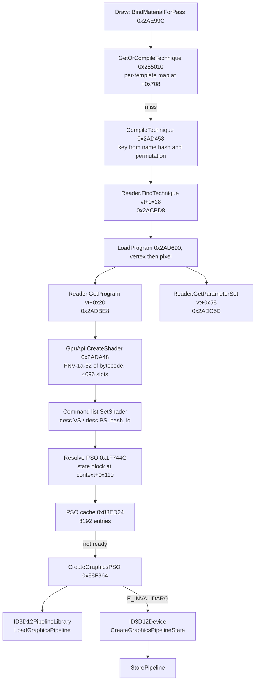

# XF Shaders: from material template to GPU pipeline state (game 2.31)

**Status (30 September 2026): steps (a) and the design half of (b) of the [custom-shader plan](../backlog/README.md#queued-rd-custom-material-shaders-in-redengine-29-september-2026) are done offline.** The whole path from a material template to a D3D12 pipeline state is traced in the 2.31 executable, every function on it has a CD PROJEKT RED address-library ID, and the shader cache's lookup key is reproduced for all 19,647 compiled techniques. Recommended next step: build the read-only probe in the [probe plan](xf-shaders-probe-plan.md) and run it in one supervised session. Nothing here has been observed in a running game.

The distilled answer is in [knowledge/materials-and-shaders.md §8](../../knowledge/materials-and-shaders.md#8-custom-shaders-from-template-to-pipeline-state). The repeatable method is [`exe_shaders.py`](shader-system/exe_shaders.py) (`cache`, `key`, `trace`, `dis`).

**Evidence grades used here:**

- **[observed]**: read directly from the installed files: the cache's bytes, or the executable's instructions at the stated address.
- **[source]**: framework or tool source code (RED4ext, its SDK, ArchiveXL, WolvenKit) or the Direct3D 12 API contract.
- **[hypothesis]**: an inference not yet checked, usually one that needs the running game.

## Contents

1. [Answers in brief](#1-answers-in-brief)
2. [Pinned inputs](#2-pinned-inputs)
3. [The shader cache file](#3-the-shader-cache-file)
4. [The path, step by step](#4-the-path-step-by-step)
5. [What a replacement shader must match](#5-what-a-replacement-shader-must-match)
6. [Route 1: the recommended detour](#6-route-1-the-recommended-detour)
7. [The ArchiveXL playbook](#7-the-archivexl-playbook)
8. [Route 2: shipping compiled shaders](#8-route-2-shipping-compiled-shaders)
9. [Risks](#9-risks)
10. [Open questions](#10-open-questions)
11. [Provenance](#11-provenance)

## 1. Answers in brief

| # | Question | Answer | Grade |
|---|---|---|---|
| 1 | Where the cache lives and how it is keyed | `engine/shader_final.cache` (RDHS v10), opened once at start-up. A compiled technique is found by a 64-bit key: the high word is the template's `name` CName, hashed with FNV-1a-64 and folded to 32 bits; the low word is an FNV-1a-32 hash of the permutation (vertex factory and its flags, technique index, render-stage name, pass index). Records hold a vertex and an optional pixel program GUID; programs are looked up by GUID. | observed (key reproduced 19,647/19,647) |
| 2 | Path from template to PSO | Draw-time binding asks the render template for a technique; on a miss it builds the key, looks it up in the cache reader, loads the two programs, and wraps each as a GpuApi shader (deduplicated by an FNV-1a-32 hash of the bytecode). The command list collects shaders and states into a `D3D12_GRAPHICS_PIPELINE_STATE_DESC`, hashes the state, and resolves a PSO from an 8,192-entry cache: first from an `ID3D12PipelineLibrary` by name, else `ID3D12Device::CreateGraphicsPipelineState`, synchronously or as a `CompilePSOAsync` job. One global graphics root signature serves every material draw. | observed |
| 3 | Best detour for route 1 | The cache reader's `FindTechnique` (and `GetProgram`) calls: rewrite the key of a *renamed* copy of the template to the original's, and hand back our pixel program under our own GUID. Our template is identified by the key's high word. Everything downstream then separates by itself. | observed path; design is a proposal |
| 4 | How ArchiveXL hooks the loader | Functions resolved by address-library ID (not patterns) and detoured through RED4ext's hooking API (Microsoft Detours); a before-hook on `res::ResourceLoader::IssueLoadingRequest` rewrites the requested path. The same move rewrites a technique key. | source |
| 5 | Can a package ship precompiled shaders natively | **No-go.** The engine reads one fixed cache file and no mod location. **Go** for a side cache in the same format that our plugin serves through the route-1 hooks. | observed (single path); hypothesis (no other loader) |
| 6 | Risks | Address-library IDs can vanish in a patch; struct offsets are version-bound; the engine's PSO may compile asynchronously (a first-frame pop); ReShade and frame generation sit below or beside the hooks and are unaffected; the driver recompiles a new shader once. No anti-tamper was seen. | mixed; see §9 |

## 2. Pinned inputs

| Input | Identity |
|---|---|
| `bin/x64/Cyberpunk2077.exe` (2.31) | SHA-256 `a7de82945c03e041fc7339fcf9066224d98db2f5d80fea50f7947bb350a60991`, 59,945,608 bytes, image base `0x140000000` |
| `bin/x64/cyberpunk2077_addresses.json` (CD PROJEKT RED's address library, shipped with the game) | SHA-256 `58da9e852fa519f851eb42fd36fd27c292c5c8585b1ec66cf34d4a2544a5689f`; linker map `68af45ea` (27 August 2025); 987,479 entries, 84 of them with a symbol name |
| `engine/shader_final.cache` | SHA-256 `339145371a3b5aaa08eb4ef82d558f445b632e28603ee0f3b4860270dfc3ccfa`, RDHS v10 (as in the [shader-system note](shader-system/README.md)) |
| Disassembler | Capstone 5.0.9 (the lab's tools register) |
| RED4ext / RED4ext.SDK | `c52c8d80` / `ad727771` |
| ArchiveXL | `5474e34d` |
| WolvenKit | `11720772` (`ShaderCacheReader.cs`, `ShaderStructs.cs`) |

RVAs below are for this executable. The address-library ID next to each resolves the same function in later builds through the library; the `trace` command re-checks each function structurally (a string, an interface ID, an immediate or a call it must contain).

## 3. The shader cache file

### 3.1 Regions [observed]

The 112-byte footer ends with `RDHS` and version 10. WolvenKit's `ShaderCacheReader.cs` named the regions; this pass decoded all of them and what they key:

| Region | Count | Layout | Meaning |
|---|---|---|---|
| Programs (from offset 0) | 19,037 | `u64 guid, u64 paramSetGuid, u32 size, DXBC[size]` | One compiled program per entry. **Every program belongs to exactly one template**, even where two templates' programs are byte-identical, so a GUID names a (template, permutation, stage), not content. |
| Techniques | 19,647 | `u32 permutationKey, u32 templateKey, u16 len+flags, info[len], u32 permutationKey, u64 vertex, u64 pixel, u64 m, u64 m, u64 uid, u32 templateKey, u32 n, u64[n], u32 n, u64[n]` | One record per compiled (template, permutation). The first program is always the vertex program; 2,564 records have no pixel program. `m` is a per-template value (415 distinct over 395 templates; still unexplained). `uid` is a unique 64-bit number whose low words rise within each template, apparently a build sequence (high word `0x7E929C00`). |
| Parameter sets | 1,019 | `u64 guid, u32, u32 n, n × (name, u8, u8)` | The engine-supplied material-modifier slots a program reads (`MatMod_FadeValueSlot`, `MatMod_DismParams`, …). Each program points at one. |
| Templates | 395 | `u32 templateKey, u32 uidLow, u32 uidHigh` | One row per template: its key and the `uid` of one of its records (the highest for 181 of the 395; meaning unknown). |
| Sources | 173 | `name, u64 hash` | The `.fx` source and include files the programs were compiled from, with a hash of each (`vertexFactoryMeshSkinned.fx`, `include_pack.fx`, `scaffolds\transparent_material_scaffold_vs.fx`, …). |

Every program is shader model 6.0 (13,921 `vs_6_0`, 5,116 `ps_6_0`), DXIL 1.0, validator 1.6, with the container parts `SFI0 ISG1 OSG1 PSV0 HASH DXIL` and a non-zero digest (signed). **None embeds a root signature (`RTS0`).** [observed]

### 3.2 The lookup key [observed]

```
templateKey    = lo32(h) ^ hi32(h),  h = FNV-1a-64(CMaterialTemplate.name)
permutationKey = FNV-1a-32 over:  u32 (vertexFactory << 3 | Discarded·2 | PreSkinned·1 | Dismembered·4)
                                  u32 technique index
                                  the render-stage name, e.g. "renderstage_post_gbuffer"
                 then one FNV step with the pass-index byte
key            = templateKey << 32 | permutationKey
```

`exe_shaders.py cache` reproduces the permutation key for all 19,647 records, and all 19,647 64-bit keys are distinct. The engine computes the same thing at `0x2AD458` (flags packed at `0x2AD46B`–`0x2AD4B5`, FNV over them, the index and the stage name, the pass-index step at `0x2AD4F7`–`0x2AD4FD`), and takes the template word from the render template's field `+0x128`.

**The key uses the template's `name`, not its file.** The label in each record starts with the file stem, but three vanilla templates carry a different CName, and their keys match the CName: `base\fx\materials\holograms\silverhand_props_overlay.mt` is named `silverhand_overlay` (key `0xD218B115`), and `base\fx\shaders\water_plane.mt` is named `water_test` (key `0x7CD1600C`). So:

- a copy of `mesh_decal.mt` at another path that keeps `name = mesh_decal` (the legacy XF generator's copy, which drew in game) reaches `mesh_decal`'s programs, as the [knowledge base](../../knowledge/materials-and-shaders.md#31-where-they-are-and-how-templates-map-to-programs) says;
- a copy with a new name (say `xfs_eye_plate`, key `0x070C95F5`) finds **no** compiled technique at all (`exe_shaders.py key xfs_eye_plate renderstage_post_gbuffer` prints "no record").

The `RenderStageContext: [ID: n]` in the label is not part of the key.

## 4. The path, step by step



### 4.1 Start-up: opening the caches [observed]

| RVA | ID | Role |
|---|---|---|
| `0x7B9088` | 2896564515 | Shader-cache init: loads `staticshader_final.cache`, then creates the material-cache object and stores it in the global `g_ShaderCache` (`0x3438990`, ID 1416630103) |
| `0x7B9368` | 4028763339 | Builds the path `…\shader_final.cache`, constructs the 0x248-byte reader (`0x7BA2CC`) and stores it at `g_ShaderCache+0x10` |
| `0x7BA4BC` | 2383096079 | Opens the file (IO tag `ShaderCacheReadOnly`) and reads the last 0x70 bytes |
| `0x7B9FCC` | 3346542106 | Footer callback: `cmp [footer+0x10], 'RDHS'` at `0x7BA03F`, then reads the metadata regions (callbacks `0x7B9494`, `0x7B9770`) |

Only the magic is compared here; no version field, checksum or executable constant was found for the footer's three unknown words (`0x5A3E8D2B`, `0xF0D01334`, `0x02D3E554` do not occur in the executable as immediates). Whether a deeper check happens elsewhere is [open](#10-open-questions).

### 4.2 Reader layout [observed]

The reader's vtable is at `0x2B153F8` (set by its constructor). The three lookups the material path uses all call one hash-map find (`0x2ADCF4`) and return a pointer into a flat array:

| Slot | RVA | ID | Map at | Array at | Entry |
|---|---|---|---|---|---|
| `+0x20` GetProgram(guid) | `0x2ADBE8` | 1196170851 | `+0x118` | `+0x1D8` | 0x38 bytes: `+0x08` parameter-set GUID, `+0x10` bytecode pointer, `+0x18` u32 size |
| `+0x28` FindTechnique(key) | `0x2ACBD8` | 1118057771 | `+0x148` | `+0x1E8` | 0x50 bytes, copied into a new shared record: `+0x08` vertex GUID, `+0x10` pixel GUID, `+0x18` up to three 16-byte extras with a count at `+0x48` |
| `+0x58` GetParameterSet(guid) | `0x2ADC5C` | 587278570 | `+0x178` | `+0x1F8` | 0x20 bytes |

Each returns −1 when the reader is not loaded (`vt+0x88`) and 0 when the key is absent or the reader is disabled (`+0x23A`).

### 4.3 From a draw to a technique [observed]

| RVA | ID | Role |
|---|---|---|
| `0x2AE99C` | 1765683078 | Binds a material for a pass: builds the permutation (pass CName, technique index, vertex factory and flags from the draw), calls GetOrCompileTechnique, then fills the material constants by parameter type (a 32-way switch). On a null technique it returns false and the pass is not bound. |
| `0x255010` | 2138515882 | GetOrCompileTechnique: hashes the permutation, looks in the render template's own map at `+0x708` under a global lock, else calls CompileTechnique and inserts the result. |
| `0x2AD458` | 3718653418 | CompileTechnique: forms the key from `[template+0x128]` and the permutation, calls `FindTechnique`; on a hit loads the pixel program (when the pass enables it) and the vertex program, then builds the technique (`0x2ADFD8`, ID 3160635915). |
| `0x2AD690` | 302009147 | LoadProgram: `GetProgram(record+0x10)` for the pixel stage or `(record+0x08)` for the vertex stage, creates the shader from the entry's bytecode, then `GetParameterSet(entry+0x08)` and merges its modifier slots. |
| `0x2AD7BC` | 3437376499 | CreateShaderFromBlob: refuses an empty blob, calls GpuApi CreateShader, wraps the returned ID in a small ref-counted object. |

### 4.4 GpuApi shaders [observed]

`0x2ADA48` (ID 1811097922) takes the stage and `{pointer, size}`, hashes the bytecode with FNV-1a-32 and scans the shader table at `SDeviceData+0xBDCB00` (4,096 slots of 0x20 bytes; RED4ext.SDK names `SDeviceData`) for a live entry with that hash. A match is reused with its reference count raised; otherwise a new slot stores the pointer, size, hash and stage. **The bytecode is referenced, not copied**, so the blob must outlive the shader. Shader IDs are 1-based, like the SDK's `ResourceContainer`.

### 4.5 From shaders to a pipeline state [observed]

The per-thread command-list context (RED4ext.SDK's `GpuApi::CommandListContext`, `commandList` at `+0x30`) keeps a PSO state block at `+0x110`:

| Offset in the context | Holds |
|---|---|
| `+0x110` | Root signature |
| `+0x118` | Resolved PSO |
| `+0x120` | Dirty flag |
| `+0x128`–`+0x3B8` | A full `D3D12_GRAPHICS_PIPELINE_STATE_DESC` (0x290 bytes; primitive topology type at `+0x364` matches `+0x23C` in the desc) |
| `+0x3B8`, `+0x3BC` | Vertex and pixel shader hashes (the table's FNV-1a-32) |
| `+0x3C0`, `+0x3C4` | Vertex and pixel GpuApi shader IDs |

The per-stage setter at `0x1F4090` (ID 3619168894) writes `desc.VS` (stage 0, context `+0x130`) or `desc.PS` (stage 1, `+0x140`), then the stage's hash and ID; its callers (`0x1F3F2C`, `0x1F557C`) read the bytecode and hash from the GpuApi shader table. At draw time (`0x1F2098`, the indexed-draw path) a dirty block goes to `0x1F744C` (ID 2587628802), which seeds a library name from FNV of the two shader hashes and calls the PSO lookup `0x1F74B0` (ID 3576832786). A ready PSO is bound with `SetPipelineState`; otherwise the engine compiles now (flag `SDeviceData+0x5F0994`) or queues a `CompilePSOAsync` job (`0x88EBDC`).

`0x88ED24` (ID 1693267381) is the PSO cache: FNV-1a-32 over the shader-ID array seeds a hash of the desc's **state fields only** (`0x88EF88`: sample mask, strip cut, topology, render-target and depth formats, sample desc, node mask, flags, each render target's blend, the rasterizer and the depth-stencil state; never the bytecode or pointers). The slot (8,192 of 0x2A8 bytes) moves through empty → compiling → failed or ready.

`0x88F364` (ID 874133590) creates it: `ID3D12PipelineLibrary::LoadGraphicsPipeline` under the decimal name of the shader-hash-seeded state hash (`0x88F668`, vtable `+0x48`); on `E_INVALIDARG` (not found), `ID3D12Device::CreateGraphicsPipelineState` (vtable `+0x50`, `IID_ID3D12PipelineState`), then `StorePipeline` (`0x88F45C`) unless the desc uses conservative rasterisation. The compute twin is `0x88DC58`.

The pipeline library file is `%LOCALAPPDATA%\CD Projekt Red\Cyberpunk 2077\cache\GamePipelineLibrary.cache` (`EditorPipelineLibrary.cache` in editor builds), chosen in the renderer's device initialisation (`0x7E2584`). **It was not present on the reference machine**, so whether retail builds persist it is [open](#10-open-questions).

### 4.6 The root signature [observed]

`0x100EF70` (ID 1517359045) builds one graphics root signature from parameter tables in `SDeviceData` (`+0x1A8EB18`, count at `+0x1A8EF20`), serialises it with `D3D12SerializeRootSignature` (version 1.0; the command line can force 1.1 or none), creates it and keeps it at `SDeviceData+0x13BC638`. The draw path binds that one signature (`SetGraphicsRootSignature`) and one descriptor-heap pair (`+0x13BC640`) whenever they change. Material programs carry no root signature of their own (§3.1), so every material program must fit this one.

## 5. What a replacement shader must match

For a pixel program swapped into an existing technique (the vertex program, vertex factory and input layout stay the game's):

| Must match | Why | Grade |
|---|---|---|
| Input signature (`ISG1`): the same semantics, registers, masks and interpolation modes as the original pixel program (for `mesh_decal` MeshSkinned: `SV_Position` plus `TEXCOORD0–2`, all float4) | It links to the unchanged vertex program's output | observed (signatures); D3D12 linkage rule [source] |
| Output signature (`OSG1`): the same render targets and formats class (for a `post_gbuffer` decal, `SV_Target0–2` float4) | The desc's render-target formats and blend states come from the template pass, not from the shader | observed |
| Resource bindings within the global root signature: the engine buffers (`cb0` `GlobalShaderConsts`, `cb1`, `cb12` `SharedPixelConsts`, …), `cb4` for material constants, `s0…`, `t0, space1` (32,768 bindless textures) and the fixed slots the original uses (`t33`, `t74` for the decal) | One global root signature; a register outside it fails PSO creation | observed (bindings, one signature); failure mode [source: D3D12] |
| `cb4` layout: one 16-byte register per template parameter at the register the template assigns (`usedParameters`); textures are bindless indices in `cb4` | The CPU packs `cb4` from the template, not from the shader | observed ([knowledge §3.1](../../knowledge/materials-and-shaders.md#31-where-they-are-and-how-templates-map-to-programs)) |
| Parameter set: reuse the original program's parameter-set GUID | LoadProgram merges the modifier slots named by it | observed |
| DXIL shader model 6.0, validator-signed container | All vanilla programs are; an unsigned container is refused by the runtime | observed (vanilla); [source: DXIL signing] |
| G-buffer encoding: the decal's target semantics (sqrt albedo, encoded normal lerp, shared roughness/metal alpha) | Otherwise lighting reads garbage | observed ([decal reference](shader-decal.md)) |

A copied template **may add parameters** at new `cb4` registers for the new shader: the original vertex program reads only its own registers, and the CPU packs whatever the template lists [hypothesis; probe step P5].

## 6. Route 1: the recommended detour

### 6.1 Design

1. **The copied template gets its own name** (for example `xfs_eye_plate`), and otherwise keeps the original's techniques, passes, parameters and registers, plus any new parameters. Without the plugin it finds no compiled technique and the plate simply isn't drawn in those passes [observed miss; the not-drawn outcome is a hypothesis for P3].
2. **Hook `Reader.FindTechnique`** (ID 1118057771). If the key's high word is one of our template keys, look up the same permutation under the original's template key (`fold32(FNV-1a-64("mesh_decal"))` = `0xF00041A9`) by calling the original function. If our package supplies a pixel program for that permutation and it passed validation, return a copy of the record with the pixel GUID replaced by ours; otherwise return the original record unchanged. Depth, velocity and other passes we don't override pass through, so the plate keeps the game's behaviour there.
3. **Hook `Reader.GetProgram`** (ID 1196170851). For one of our GUIDs, return our own 0x38-byte entry: the original pixel program's parameter-set GUID at `+0x08` and our bytecode at `+0x10`/`+0x18`, allocated once and kept for the process lifetime (GpuApi keeps the pointer, §4.4).
4. **Validate before serving** (at load, not per draw): parse our DXBC; refuse unless it is `ps_6_0`, signed, its `ISG1`/`OSG1` equal the original pixel program's, and its resource bindings are a subset of the original's (plus `cb4` registers the copied template owns). On refusal, log and pass through: the plate renders exactly like the original template.
5. **Everything downstream separates by itself.** Our bytecode hashes differently, so GpuApi makes a new shader, the PSO cache key differs (new shader ID) and so does the pipeline-library name (new hash). Vanilla `mesh_decal` users (brows, lip and freckle decals) never see our program.

The hooks are cold: `FindTechnique` runs only when a render template's own technique map misses, typically once per (template, permutation) per session.

### 6.2 How our template is recognised

At `FindTechnique`, by the key's high word, which is `[template+0x128]`, the folded FNV-1a-64 of our CName [observed]. The plugin computes it from the names it ships. No resource path or pointer is needed.

### 6.3 Variant: keep the name

Keeping `name = mesh_decal` gives graceful degradation (without the plugin the plate looks vanilla), but then the key is identical to vanilla's and the only distinguishing input is the render template object passed to `GetOrCompileTechnique` (`0x255010`). Mapping that object to our resource path means understanding the render-template object (it holds the name key at `+0x128` and a technique map at `+0x708`; its type is unnamed so far). Worth a probe row (P8), not the first design.

### 6.4 Rejected detour points

| Point | Why not |
|---|---|
| GpuApi `CreateShader` (`0x2ADA48`), swapping by bytecode hash | The copy and the original share the same programs (every program belongs to one template name), so every `mesh_decal` user would change |
| `ID3D12Device::CreateGraphicsPipelineState` (vtable) or `0x88F364` | Same ambiguity, plus overlays such as ReShade wrap the device, and the pipeline library sits in front |
| Patching `shader_final.cache` | See route 2 |

## 7. The ArchiveXL playbook

ArchiveXL (psiberx) declares each engine function as a typed `Core::RawFunc<AddressLib::ID, signature>` and attaches `HookBefore`, `HookAfter` or wrapping `Hook` handlers at plugin load [source: `lib/Core/Raw.hpp`, `lib/Core/Hooking/HookingAgent.hpp`, `src/Red/Addresses/Library.hpp`]. Addresses come from CD PROJEKT RED's address library by ID through RED4ext's resolver (`UniversalRelocBase::Resolve`), not from byte patterns; the attach goes through RED4ext's plugin hooking API, which is built on Microsoft Detours (`src/dll/DetourTransaction.cpp`) [source]. ArchiveXL's own library also carries a MinHook provider.

Its resource-link extension is the model for step 2: a before-hook on `ResourceLoader::LoadAsync`, which is `res::ResourceLoader::IssueLoadingRequest` (ID 2365013187, one of the 84 named entries), replaces `aRequest.path` when the path has a registered link, and wrapping hooks on the depot's request and check calls finish the redirection [source: `src/App/Extensions/ResourceLink/Extension.cpp`]. XF Shaders does the same with a technique key instead of a path.

**Because every function on our path is in the address library**, the plugin needs no signature scanning at all. Offsets inside objects (`+0x128`, the reader's maps, the 0x38/0x50 entry sizes) are still version-bound and must be gated (§9).

## 8. Route 2: shipping compiled shaders

**Native loading: no-go.**

- The engine opens exactly one material cache, `engine/shader_final.cache`, once at start-up (`0x7B9368`); no mod folder, archive or second cache path appears on the load path [observed], and no other loader was found [hypothesis: absence of evidence in the traced code].
- Keys are per template name, and each program belongs to one template, so a new template needs records in *that* file.
- The format is fully decoded and writable in principle, and only the magic check was found. But shipping it means replacing a 162 MB game file, rebuilt by every patch and clobbered by any other mod doing the same. That breaks the additive-mod rule and the user's setup; a dev-build option to reload the cache (`Rendering/ShaderCacheReloadTimeCheck`) exists but no retail path uses it for new files [observed string; hypothesis for its effect].

**Route 2b, a side cache: go.** The XF Shaders plugin reads its own small file in the same RDHS v10 layout (only our programs, technique rows and templates), from our mod folder, validates it and serves it through the route-1 hooks. A package then ships data only, and `exe_shaders.py` already reads the format. The plugin should check the side cache's `sources` hashes against the game's own `shader_final.cache` for the includes it was compiled against, and refuse a stale one after a game update.

## 9. Risks

| Risk | Assessment | Grade |
|---|---|---|
| Patch fragility | Address-library IDs survive patches only while CD PROJEKT RED keeps the entry; RED4ext's "Failed to resolve address for hash" is how that failure shows up for users. Struct offsets (`+0x128`, reader maps, entry sizes, the context's state block) can move with any patch. Mitigation: gate on the game version and on structural checks at load (the `trace` checks, in C++), and refuse to hook on any mismatch. | source (library contract); hypothesis (future patches) |
| Cache format change | The v10 layout and the key recipe are 2.31 facts; the side cache must carry the version it was built for | observed |
| Anti-tamper | None seen on this path; CD PROJEKT RED publishes the address library for native mods, and ArchiveXL, TweakXL and Codeware hook the engine the same way | observed (no checks on the path); hypothesis beyond it |
| Asynchronous PSO compile | When the engine compiles asynchronously, a new PSO is missing for a few frames and the plate pops in once | observed (the async path); hypothesis (visible effect) |
| Driver shader cache | A new DXIL is compiled to GPU code once and then cached by the driver (for example NVIDIA's `DXCache`); first use may hitch | source (driver behaviour) |
| Pipeline library | Named from the shader hashes, so a changed shader can't return a stale PSO; D3D12 also refuses a desc mismatch with `E_INVALIDARG`, which the engine treats as "compile" | observed + source |
| ReShade | It proxies DXGI/D3D12 below the engine; our hooks run above D3D, so it sees an ordinary new PSO. Its depth and effect passes are unaffected. | observed (hook level); hypothesis (no side effects) |
| Frame generation and upscalers | FSR3, DLSS-G and XeSS frame generation use the velocity pass we don't override; a view-dependent sparkle is still temporally unstable and needs in-shader filtering ([experiment 018](../../experiments/018-glitter-route/README.md#taa-and-upscalers)) | observed (pass separation); hypothesis (visual result) |
| Other plugins | Detours chains hooks; a second plugin on the same functions still works if both call the original | source |
| Our bugs | A bad shader can only affect PSOs built with our GUIDs; validation refuses mismatches before any draw | design |

## 10. Open questions

1. What happens on a miss in play: is a renamed template's pass simply not drawn (the code path suggests so), or is there a fallback technique ("Fallback: n" in the labels)? Probe P3.
2. Does the retail build persist `GamePipelineLibrary.cache`? It was absent on the reference machine.
3. The render-template object behind `[+0x128]`: its type, and where the name key is written (no single store was found by pattern).
4. The records' per-template value `m` and the footer's three unknown words.
5. Whether a copied template's extra parameters reach `cb4` as expected (probe P5).
6. The engine's global root signature's exact parameter list (readable at runtime from `SDeviceData`; probe P1).

## 11. Provenance

| Source | What it established |
|---|---|
| The 2.31 executable (SHA-256 above), read with Capstone 5.0.9 | Every RVA and behaviour in §4, found from anchors: the strings `shader_final.cache`, `ShaderCacheReadOnly`, `GamePipelineLibrary.cache`, `CompilePSOAsync`; the D3D12 interface IDs of `ID3D12PipelineState` and `ID3D12RootSignature`; the `RDHS` and FNV immediates; the SDK's `SDeviceData` global |
| CD PROJEKT RED's address library (`cyberpunk2077_addresses.json`, SHA-256 above) | An ID for every traced function and both globals; the named entries `res::ResourceLoader::IssueLoadingRequest` and `wWinMain` |
| `shader_final.cache` (SHA-256 above) | The regions and keys of §3, re-proved by `exe_shaders.py cache` |
| WolvenKit `11720772`: `WolvenKit.RED4/Archive/IO/ShaderCacheReader.cs`, `Archive/Shaders/ShaderStructs.cs` | The footer and region layout (its "pixel/vertex" labels are swapped, as the [shader-system note](shader-system/README.md) records) |
| RED4ext.SDK `ad727771`: `GpuApi/DeviceData.hpp`, `GpuApi/CommandListContext.hpp`, `Detail/AddressHashes.hpp`, `Scripting/Natives/Generated/CMaterialTemplate.hpp`, `MaterialTechnique.hpp`, `MaterialPass.hpp` | `SDeviceData` and its device pointer, the command-list context's `commandList`, the address-library ID of `g_DeviceData`, the template, technique and pass layouts |
| RED4ext `c52c8d80`: `src/dll/Addresses.cpp`, `src/dll/DetourTransaction.cpp` | How IDs resolve; Detours-based hooking |
| ArchiveXL `5474e34d`: `lib/Core/Raw.hpp`, `lib/Core/Hooking/HookingAgent.hpp`, `lib/Support/RED4ext/RED4extProvider.cpp`, `src/Red/Addresses/Library.hpp`, `src/Red/ResourceLoader.hpp`, `src/App/Extensions/ResourceLink/Extension.cpp` | The hooking playbook of §7 |
| Cyberpunk Modding Docs `a54b0873`, `for-mod-users/user-guide-troubleshooting/README.md` ("Failed to resolve address for hash") | How an address-library miss appears to users |
| Direct3D 12 API contract (Microsoft documentation) | Device and pipeline-library vtable slots, `D3D12_GRAPHICS_PIPELINE_STATE_DESC` layout, pipeline-library name matching and `E_INVALIDARG` |

Scratch analysis scripts were not kept; everything they showed is re-provable with `exe_shaders.py`.
