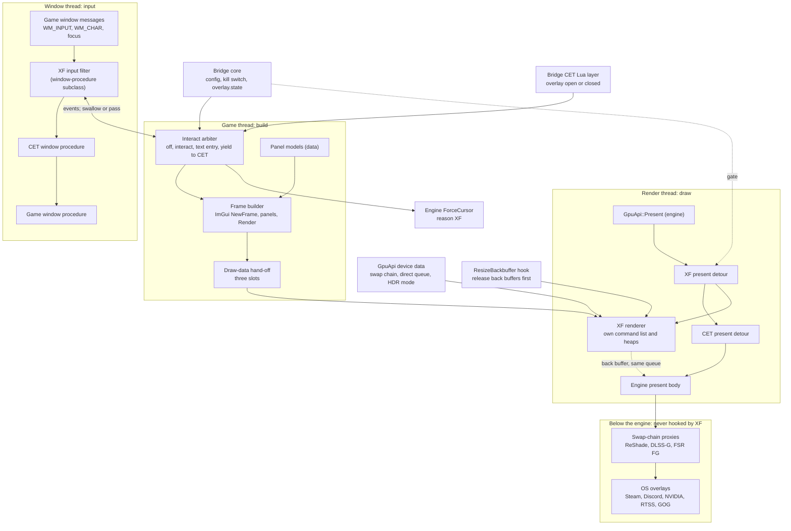

# An XF ImGui overlay host: feasibility, architecture and first prototype

**Status:** offline research, 30 September 2026. Nothing is built and nothing here has been seen in game. This is half 1 of the queued in-game overlay R&D ([backlog](../backlog/README.md#queued-rd-in-game-overlay-and-ui-set-29-september-2026)): our own Dear ImGui host inside the XF Runtime Bridge's RED4ext plugin, drawing XF development panels over the game at all times, with a hotkey **interact mode** that gives the mouse to XF panels without hiding them or pausing the game. The distilled answer is in the [ink knowledge page §8](../../knowledge/ink-ui.md#8-an-xf-imgui-host-beside-cet); the ink route (half 2) and the route map are in [in-game UI design](in-game-ui-design.md).

## In brief

- **Recommendation:** hook the engine's own present function (`GpuApi::Present`, address-library hash `2468877568`) through RED4ext's hooking API, chained with Cyber Engine Tweaks' hook on the same function, and draw with our own command list on the engine's direct queue, which we read from the RED4ext SDK's decoded GPU device data rather than from hard-coded offsets. Build the ImGui frame on the game thread and render it on the render thread through a three-slot hand-off, as CET does. Take input through a window-procedure subclass that swallows only the mouse's Raw Input while interact mode is on, shows the cursor through the engine's own `ForceCursor` with an XF reason, keeps the keyboard flowing to the game unless an XF text field has focus, and yields to CET whenever CET's overlay is open (the bridge's CET layer already receives `onOverlayOpen`/`onOverlayClose`). Never hook DXGI, the swap chain's vtable or `ExecuteCommandLists`: that is where ReShade, frame generation and the OS overlays live.
- **Confidence:** high that drawing works (CET has drawn from this exact hook point on every patch through 2.31, and the SDK's layouts agree byte for byte with CET's offsets); medium for interact mode (legacy mouse messages, `ForceCursor` semantics and window-procedure order need one session); medium-low for frame generation and HDR until tested (CET has open issues in both).
- **First prototype (P0):** draw-only, off by default, SDR only (refuses cleanly in HDR), one diagnostic panel, `overlay.state` for agents. About 4 days of native work plus about 45 minutes of a supervised session. Interact mode (P1) about 3 days more; HDR, own renderer and the panel kit (P2) about 5 days. The earlier "about a week" estimate becomes about two weeks for P0 to P2 with reviews.
- **Order against ink:** unchanged. The [route map](in-game-ui-design.md#an-xf-overlay-imgui-or-ink) keeps the ink interact layer first for anything player-facing; this host is for dense development tools (live-pose gizmos, graphs, the lighting mirror's readouts, agent introspection overlays). P0 is small enough to run beside the ink work.

## 1. Sources

| Source | Revision | What was read |
|---|---|---|
| Cyber Engine Tweaks (yamashi and contributors; the overlay and input code's history is mostly Andrej Redeky's) | `9a8522f2` (9 May 2026, 1.37.x line) | `src/d3d12/*`, `src/window/window.cpp`, `src/VKBindings.cpp`, `src/overlay/Overlay.cpp`, `src/reverse/RenderContext.h`, `src/reverse/Addresses.h`, `src/dllmain.cpp`, `src/imgui_impl/dx12.cpp`, `src/scripting/ScriptContext.cpp`, `xmake.lua` |
| RED4ext SDK | `ad727771` (30 July 2026); the bridge pins tag 1.0.0 `a4a78108` | `include/RED4ext/GpuApi/SwapChain.hpp`, `DeviceData.hpp`, `DeviceData-inl.hpp`, `Api/v1/Hooking.hpp`, `Detail/AddressHashes.hpp` |
| RED4ext (loader) | `c52c8d80` (9 March 2026) | `src/dll/Systems/HookingSystem.cpp`, `src/dll/Hook.hpp`, `src/dll/Hooks/WinMain.cpp`, `src/dll/Hooks/QuickExit.cpp`, `cmake/deps/Detours.cmake` |
| Microsoft Detours | `9764cebc` (the commit RED4ext pins) | `src/detours.cpp` (x64 jump skipping, `DetourAttachEx`) |
| ReShade (Patrick Mours and contributors) | `7bf9de8b` (24 September 2026) | `source/dxgi/dxgi_swapchain.*`, `source/input_windows.cpp`, `source/dll_main.cpp`, `source/hook_manager.cpp`, `source/runtime_gui.cpp`, `res/shaders/imgui_*.hlsl` |
| Dear ImGui (Omar Cornut and contributors) | tag `v1.92.9-docking` = `9b4eb24c` (25 July 2026) | `backends/imgui_impl_dx12.*`, `backends/imgui_impl_win32.*` |
| NVIDIA Streamline | `2122257e` (8 September 2026), docs only | `docs/ProgrammingGuideDLSS_G.md` §5.1, §12.0 |
| CET issue tracker | read 30 September 2026 | [#955](https://github.com/maximegmd/CyberEngineTweaks/issues/955) (overlay too bright in HDR, open), [#1025](https://github.com/maximegmd/CyberEngineTweaks/issues/1025) and [#1047](https://github.com/maximegmd/CyberEngineTweaks/issues/1047) (crash on exit with FSR 3.1 frame generation and CET, open) |
| The reference install (GOG, 2.31) | metadata only | `bin/x64/cyberpunk2077_addresses.json` (linker map 27 August 2025), the loader and overlay files present, a ReShade 6.7.1 log from a 29 September run, `r6/config/inputUserMappings.xml`, a string search of the executable |

Clones: CET, RED4ext and the SDK were already under `D:/Dev/`; ReShade, Dear ImGui, Detours and Streamline (docs only, sparse) are under `D:/Dev/clones/`.

**Grades** follow the [knowledge rules](../../knowledge/README.md#rules-for-knowledge-pages). One extra grade: **[external]** is a public issue report or vendor document, not verified by us.

## 2. Presentation: where to draw

### 2.1 How CET draws

| Fact | Grade |
|---|---|
| CET hooks three engine functions with MinHook from its `DllMain` (it is loaded as an ASI through the version.dll loader): `GpuApi::Present` (hash `2468877568`), `GpuApi::ResizeBackbuffer` (`239671909`) and an unnamed render shutdown (`3192982283`, called about 32 times, once per device slot) | [source] CET `src/d3d12/D3D12_Hooks.cpp:88-111`, `src/reverse/Addresses.h:30-37`, `src/dllmain.cpp:15-45`; names [resource] address library |
| The present detour reads the swap chain for the device index it is given and the engine's direct command queue from the render context, initialises once, then records ImGui into its own command list and submits it on **the engine's direct queue** before calling the original. It never hooks `IDXGISwapChain::Present` or `ExecuteCommandLists` | [source] `D3D12_Hooks.cpp:11-37`, `D3D12_Functions.cpp:380-424` |
| Its render context is a hand-written struct with hard-coded offsets (`devices` at `0xC97F38`, stride `0xB0`; `pDirectQueue` at `0x13BC4D0`) behind the hash `1239944840` | [source] `src/reverse/RenderContext.h:1-24` |
| The RED4ext SDK now decodes the same memory: `GpuApi::GetDeviceData()` (hash `g_DeviceData` = `1239944840`), whose `swapChains` container starts at `0xC97F20` (its first instance's swap chain lands at CET's `0xC97F38`), each `SSwapChainData` `0xA8` bytes with the swap chain, back-buffer index, `fullScreen`, `startupHdrMode` (Disabled, PQ, scRGB), window handle, present fence and back-buffer RTVs; plus `device` and `directCommandQueue` at `0x13BC4D0`. The layout is identical in the tag the bridge pins | [source] SDK `GpuApi/SwapChain.hpp:12-54`, `GpuApi/DeviceData.hpp:72,82-96`, `GpuApi/DeviceData-inl.hpp:9-13`, `Detail/AddressHashes.hpp:113` (1.0.0) |
| On resize it drops all its back-buffer references **before** calling the original (otherwise `ResizeBuffers` fails with outstanding references) and rebuilds lazily on the next present | [source] `D3D12_Hooks.cpp:39-52`, `D3D12_Functions.cpp:12-45` |
| It builds the ImGui frame on the game's main thread (a generic main-thread task: overlay, then every Lua mod's `onDraw`), clones the draw lists into a three-slot buffer, and the render thread swaps in the newest slot | [source] `D3D12.cpp:57-71`, `D3D12_Functions.cpp:346-378` |
| Its own descriptor heaps: a 200-entry shader-visible CBV/SRV/UAV heap (slot 0 the font, the rest for Lua textures) and an RTV heap with one entry per back buffer (up to 3) | [source] `D3D12_Functions.cpp:79-112`, `D3D12_Hooks.cpp:69-86` |
| The ImGui pipeline is built for `DXGI_FORMAT_R8G8B8A8_UNORM` whatever the back buffer's format, and fonts scale by resolution against 1920×1080, not by DPI (a TODO in the code) | [source] `D3D12_Functions.cpp:144-157,286-344` |
| CET exposes no native API: no exports; its draw hook is reachable only as Lua's `onDraw` | [source] no `dllexport` in `src/`; `scripting/ScriptContext.cpp:58-63` |
| CET vendors Dear ImGui 1.91.1 (docking) with its own modified DX12 backend | [source] `xmake.lua:49`, `src/imgui_impl/dx12.cpp` |

`GpuApi::Present` is the engine's wrapper around the DXGI present: everything the engine draws, the HUD and menus included, is already in the back buffer, and anything that sits between the engine and the display (swap-chain proxies, OS overlays) runs after it.

### 2.2 The chain below the engine, and where it conflicts

On the reference install `bin/x64` holds ReShade 6.7.1 as `dxgi.dll`, the Streamline DLLs (`sl.interposer.dll`, `sl.dlss_g.dll`) and the DLSS frame-generation model, CET as an ASI and the RED4ext loader as `winmm.dll`; it is a GOG copy, so the GOG Galaxy overlay may be present too [resource]. The ReShade log records the swap chain: `R8G8B8A8_UNORM`, 3 buffers, flip-discard, windowed, flags `0x840` (tearing allowed, frame-latency waitable object) [runtime] (log of a 29 September run, SDR).

| Layer | How it attaches | What it means for an engine-level hook | Grade |
|---|---|---|---|
| ReShade | Wraps the factory, device, command queue and swap chain in proxy objects; its `Present` applies effects and then calls the real one. The pointer the engine stores as its swap chain is ReShade's proxy | Anything drawn at `GpuApi::Present` is in the back buffer **before** ReShade's effects: ReShade's colour grading or sharpening also applies to XF (and CET) panels. `GetBuffer` and `GetDesc1` through the proxy behave as on the real swap chain | [source] ReShade `dxgi/dxgi_swapchain.cpp:254-256,962-1030`; consequence [hypothesis] |
| Streamline and DLSS frame generation | The game links Streamline's interposer, which proxies the swap chain; with DLSS-G on, **Present runs on a separate thread**, and resizing or switching fullscreen while it is on can deadlock unless the game turns it off first. For clean UI in generated frames the game tags a hudless colour buffer (the scene before UI) and optionally a UI colour-and-alpha buffer | Our pixels are neither in the hudless buffer nor in any UI buffer, so generated frames either warp them (ghosting) or, if the game tags a UI buffer and the frame is recomposed from it, drop them (flicker at the generated rate). Which one happens in Cyberpunk is unknown | [source] Streamline `docs/ProgrammingGuideDLSS_G.md` §5.1 (lines 223-331), §12.0 (lines 753-756); consequence [hypothesis] |
| FSR frame generation | Also replaces the swap chain with a proxy that presents from its own queue and thread | CET has an open crash-on-exit report with FSR 3.1 frame generation (2.31, CET 1.37.1); only with both enabled | [external] CET #1047, #1025; cause unknown |
| A separate presentation queue | ReShade notes that DLSS-G creates its own high-priority queue for presentation, and that the GOG Galaxy overlay, when it can't find the queue in the swap chain's memory, uses the first direct queue that calls `ExecuteCommandLists`; if that isn't the swap chain's queue, D3D12 removes the device | Submitting our work on any queue other than the engine's direct queue (or creating our own queue) risks exactly that. Using the engine's queue, as CET does, avoids it | [source] ReShade `dxgi/dxgi_swapchain.hpp:115-119` |
| OS overlays (Steam, Discord, NVIDIA, RTSS, GOG) | Hook DXGI present or the swap chain's vtable in-process | They draw after the engine and after ReShade; an engine-level hook never shares a function with them | [hypothesis] (general behaviour, not read in their code) |
| CET | MinHook on `GpuApi::Present` | The only component that shares our hook point (§2.4) | [source] |

### 2.3 The options

| Option | For | Against | Verdict |
|---|---|---|---|
| **A. Chained hook on `GpuApi::Present`** (RED4ext hooking API, Detours) | Same point CET has used for years; before every proxy, so independent of ReShade, Streamline and FSR; the engine's queue and back buffers are known; one address-library hash, checked at load | Shares a function with CET; ReShade effects and frame generation treat our pixels as scene content | **Recommended** |
| B. Hook `IDXGISwapChain::Present` (vtable) | Engine-independent | We'd hook whichever proxy the engine got (ReShade's, Streamline's, FSR's), fighting their ordering; with DLSS-G it runs on another thread; the queue is ambiguous | Rejected |
| C. Hook `ID3D12CommandQueue::ExecuteCommandLists` to find the queue | Common in generic overlays | Exactly the GOG failure above; unnecessary when the SDK gives the queue | Rejected |
| D. Draw through CET's `onDraw` (Lua) | No native render code; the existing CET panel does it | Input only while CET's overlay is open (the problem this R&D exists to solve); Lua cost per frame; depends on CET | Keep for the existing CET panel only |
| E. Share CET's ImGui context from native code | One ImGui for both | No export; CET's ImGui is 1.91.1 with a modified backend, ours would have to match its version and allocator; any CET update breaks us | Rejected |
| F. A ReShade add-on overlay | ReShade has a mature ImGui host with HDR handling and an add-on overlay API | Needs the user to run ReShade with add-on support: not self-contained; input again tied to ReShade's own overlay | Rejected as the host; ReShade stays a reference |

### 2.4 Two hooks on one function

- **Order.** CET installs in `DllMain` (ASI loading, before `WinMain`); RED4ext loads plugins at `WinMain` entry, and a plugin attaching at load therefore lands on top of CET: our detour runs first, then CET's, then the engine [source] RED4ext `src/dll/Hooks/WinMain.cpp:14-31`, CET `src/dllmain.cpp:15-45`. Our detour must draw and then call its trampoline, so CET draws on top of XF: CET's windows (opened on purpose) stay above ours.
- **Chaining works either way.** Detours at RED4ext's pinned commit follows a leading `jmp rel32` only after a short `jmp rel8`, so over MinHook's 5-byte `E9` it relocates the jump into its trampoline and the chain holds [source] Detours `src/detours.cpp:390-450,2155`. MinHook likewise relocates a leading jump [hypothesis] (MinHook source not read).
- **Unhooking is the hazard.** Detaching restores the bytes the hooker saw when it attached; if the later hooker detaches first that's correct (LIFO), but if the earlier one detaches first it overwrites the other's jump and frees memory the other's trampoline still jumps into. RED4ext detaches all remaining hooks at `quick_exit` [source] `src/dll/Systems/HookingSystem.cpp:14-44`, `src/dll/Hooks/QuickExit.cpp:15-35`; CET disables all its hooks at `DLL_PROCESS_DETACH` [source] `src/dllmain.cpp:47-58`. With CET first and us second, exit order is LIFO. **Rules:** never detach at run time (disable by an atomic flag that makes the detour a pass-through); let RED4ext's exit detach; stop drawing at the engine's render shutdown. Whether the engine still presents during `quick_exit` is unknown; the exit rows of the test card check it.

## 3. Input

### 3.1 How the game and CET take input

| Fact | Grade |
|---|---|
| The game reads keyboard and mouse as Raw Input (`RegisterRawInputDevices`, `GetRawInputData`), pads through XInput and HID; posted key messages never reach it | [resource] 2.31 imports; [runtime] sessions 4 and 5 ([photo mode §2.3](../../knowledge/photo-mode.md#23-routes-to-the-full-photo-mode)) |
| CET finds the window by class `W2ViewportClass` from a polling thread and subclasses it with `SetWindowLongPtr(GWLP_WNDPROC)`; its procedure runs its key bindings, then its ImGui trap, then the game's procedure; it restores the old procedure in its destructor | [source] CET `src/window/window.cpp:11-95` |
| While CET's overlay is open it passes messages to ImGui's Win32 handler and swallows **every** mouse and keyboard message and every `WM_INPUT`, and shows the cursor through the engine's `input::InputSystemWin32Base::ForceCursor(this, reason "ImGui", show)` (hash `2130646213`, unnamed in the address library) | [source] `src/d3d12/D3D12.cpp:10-55`, `Addresses.h:62-63`; [resource] address library |
| Swallowing `WM_INPUT` in the window procedure is enough to blind the game (it doesn't read Raw Input through `GetRawInputBuffer`, or CET's trap wouldn't work) | [hypothesis], strongly supported by CET's trap working for players |
| CET's own hotkeys are read from Raw Input (`WM_INPUT` keyboard records), and it clears key state on `WM_KILLFOCUS`. While its overlay is open, other mods' bindings don't fire | [source] `src/VKBindings.cpp:537-551,644,680,696-730` |
| The toggle queues the trap change and applies it in the next window message, so the cursor and trap change on the window's thread | [source] `src/overlay/Overlay.cpp:187-198`, `src/d3d12/D3D12.cpp:21-37` |

### 3.2 Lessons from ReShade's input layer

- **Don't swallow a key-up whose key-down reached the game**, or the key sticks down in the game [source] ReShade `source/input_windows.cpp:218,252`.
- **Legacy messages may be off.** When an application registers Raw Input with legacy messages disabled, no `WM_KEYDOWN`/`WM_CHAR`/`WM_LBUTTONDOWN` arrive; ReShade then reads mouse buttons and wheel from the raw records and makes text with `ToUnicode` (flag `0x2` so dead-key state isn't disturbed) [source] `input_windows.cpp:180-235`. Whether Cyberpunk disables legacy messages is unknown; `GetRegisteredRawInputDevices` answers it at run time without a hook [hypothesis].
- **Some games clip the cursor** to a tiny rectangle; ReShade lifts the clip while its overlay is open [source] `input_windows.cpp:365-375`. The engine's `ForceCursor` should do this for us, as it does for CET [hypothesis].

### 3.3 Interact mode

| State | Enter | Mouse | Keyboard | Cursor | Leaves when |
|---|---|---|---|---|---|
| **Off** (default) | start, hotkey, focus lost, kill switch | to the game | to the game (the hotkey is swallowed) | the game's | hotkey |
| **Interact** | hotkey | to XF: raw mouse records swallowed, ImGui fed from them plus `GetCursorPos` mapped to back-buffer pixels | to the game (V keeps walking, time runs) | shown through `ForceCursor(reason "XF")` | hotkey, focus lost, CET opens |
| **Text entry** | an XF text field gets focus (`io.WantTextInput`) | to XF | to XF, except key-ups whose key-downs went to the game | shown | field loses focus |
| **Yield to CET** | CET's overlay opens (the bridge's CET layer calls a native from `onOverlayOpen`) | CET's | CET's | CET's | CET closes; then back to Off, never silently to Interact |

- **The hotkey** is read from raw keyboard records like CET's, and configurable in `config.ini`. Default **F10**: the 2.31 defaults bind F1, F3, F4, F5 and F9 but not F7, F8, F10 or F11 [resource] `r6/config/inputUserMappings.xml`; Home is the game's fast-forward and ReShade's default key; CET's key is whatever the player chose. A single key avoids chords with Ctrl and Shift, which are crouch and sprint.
- **Panels never hide.** Off, they draw and pass everything through (no hover capture); a small interact badge shows the state and the hotkey.
- **Camera look inside interact mode** (a design option for the maintainer): holding the right button outside any XF panel could pass mouse motion to the game, like the Studio viewport's look. Default in P1: not built; the hotkey is the way back.
- **Order-independent.** Whether our subclass is outside or inside CET's, the arbiter yields while CET is open, so the two never fight: if we are outside, we pass everything to CET while it is open; if we are inside, CET swallows before we see anything. Subclass with `SetWindowSubclass` from the window's own thread when the game thread owns the window (it removes cleanly in any order), else with `SetWindowLongPtr` as CET does; unhook only if we are still the current procedure.
- **Threads.** Window messages are queued into our own event queue and drained into ImGui at `NewFrame` on the game thread; ImGui's input API is not thread-safe, and CET feeds it from the window procedure without its lock (`D3D12.cpp:39-41`).
- **Focus loss** (`WM_KILLFOCUS`, `WM_ACTIVATEAPP`) drops to Off and clears key state (CET does the same for its bindings).

## 4. Rendering specifics

| Topic | Design | Grade of the basis |
|---|---|---|
| **Threads and latency** | Game thread: `NewFrame`, panels, `Render`, clone into slot 2, swap with slot 1. Render thread (in the detour): swap slot 1 into 0 if newer, record, submit. Panels are at most one frame behind; the render thread never waits on the game thread | [source] CET `D3D12_Functions.cpp:346-424` |
| **Device, queue, swap chain** | From `GpuApi::GetDeviceData()` and the swap chain whose ID the detour receives; check at first use that the swap chain's `GetDevice` is that device, the queue is `DIRECT`, and the swap chain's window is the `W2ViewportClass` window; refuse (host off, one log line) on any mismatch | [source] SDK; the check is ours |
| **Descriptor heaps** | Our own shader-visible CBV/SRV/UAV heap (64 entries, free list behind ImGui 1.92's `SrvDescriptorAllocFn`/`FreeFn`) and our own RTV heap (one per back buffer); `SetDescriptorHeaps` only on our own command list, so the engine's heaps are untouched | [source] Dear ImGui `backends/imgui_impl_dx12.h:34-54` |
| **Back-buffer state** | Barrier `PRESENT → RENDER_TARGET → PRESENT` on our list, as CET does | [source] CET `D3D12_Functions.cpp:400-419` |
| **Command allocators** | One per back buffer, reset only after our own fence for that buffer has passed (CET resets without a fence and relies on the swap chain's latency) | [source] CET; the fence is ours |
| **Fonts** | ImGui 1.92's dynamic atlas uploads new glyphs inside `RenderDrawData` and **waits on a fence with an infinite timeout** on the render thread [source] `imgui_impl_dx12.cpp:615-645` (v1.92.9). Pre-bake the glyph ranges XF uses at initialisation; P2 takes texture updates out of the draw call (`ImDrawData::Textures = nullptr`, ImGui's own escape hatch) and uploads them with a bounded wait | [source] |
| **Shaders** | The stock DX12 backend compiles its shaders at run time with `D3DCompile` (`d3dcompiler_47.dll`, present on Windows 10 and 11). P0 accepts that; P2's own renderer ships precompiled bytecode | [source] `imgui_impl_dx12.cpp:70-72,756` |
| **Scale and DPI** | Display size = the back buffer's size; mouse = `GetCursorPos` → client coordinates → scaled by back buffer ÷ client size, so borderless, windowed and resolution scaling all map correctly. UI scale = back-buffer height ÷ 1080 × a user factor (the same base as CET). The executable calls `SetProcessDPIAware` (system-aware, not per-monitor) [resource] string search; mixed-DPI monitors are an open row of the test card | [resource]; mapping ours |
| **HDR** | The game has three modes (`startupHdrMode`: Disabled, PQ, scRGB). In HDR the back buffer is 10-bit PQ or 16-bit float, and ImGui's sRGB colours written raw come out far too bright: that is CET issue #955 ("excessively bright in HDR", open since July 2024), consistent with CET's fixed `R8G8B8A8_UNORM` pipeline. ReShade's fix: its ImGui pixel shader converts vertex colours to scRGB (1.0 = 80 nits) or to BT.2020 + PQ at a configurable overlay brightness (default paper white) [source] ReShade `res/shaders/imgui_ps_4_0.hlsl:13-30`, `imgui_hdr.hlsl`, `source/runtime_gui.cpp:2447-2452,4990-5003`. **XF:** P0 refuses in HDR modes (logged, `overlay.state` says why); P2's own renderer builds its pipeline for the real back-buffer format and encodes to scRGB or PQ at a paper-white level (default 203 nits, ITU-R BT.2408's reference white; later read from the game's HDR settings), written from the standards, not copied | [source] SDK, ReShade; [external] #955 |
| **Resize and fullscreen** | Hook `GpuApi::ResizeBackbuffer` (`239671909`): before calling the original, wait for our fence (bounded), release back buffers and RTVs, and mark the host for lazy rebuild on the next present. The engine turns frame generation off around resizes as Streamline requires [hypothesis] | [source] CET `D3D12_Hooks.cpp:39-52`; Streamline §12.0 |
| **Device lost** | Once per frame, `GetDeviceRemovedReason()`; anything but `S_OK` turns the host off for the session (no recreation: the game itself doesn't survive a lost device [hypothesis]); `DXGI_ERROR_DEVICE_REMOVED` from any of our calls does the same | ours |
| **Crash containment** | The detour's body runs in a separate function under a structured-exception guard: an access violation turns the host off and passes through, instead of ending the game. This can't undo a corrupted GPU state, only stop repeating it | ours |
| **Shutdown** | Hook the render shutdown (`3192982283`, as CET does) or react to RED4ext's shutdown state: set the pass-through flag, drop references, never detach at run time | [source] CET `D3D12_Hooks.cpp:54-62` |
| **Captures** | Anything drawn here is in the back buffer, so OS captures (Print Screen, the bridge's window captures, Steam's F12) include XF panels; the engine's photo-mode screenshot renderer doesn't [hypothesis]. `capture.*` commands hide the host for their frames; `overlay.state` reports whether it is hidden | [hypothesis] |

## 5. Alternatives for our uses

| Route | Editing and testing tools (dense, immediate-mode, live values, gizmos) | Always-on panels | Player-facing | Cost and risk |
|---|---|---|---|---|
| **XF ImGui host (this page)** | Best fit: plots, tables, sliders, drag handles, per-frame redraw at no script cost | Yes, with interact mode | No (not the game's look) | About 2 weeks for P0-P2; render-thread crash risk contained by the gates in §4 |
| Ink interact layer ([knowledge §2.5](../../knowledge/ink-ui.md#25-input-on-ink)) | Possible but slow to build: every control is script-built widgets; heavy redraws cost script time | Yes (the XF HUD panel already is) | Yes: the game's font, colours and cursor | About 3 days for the layer; low risk; the route map's first choice |
| CET window (Lua `onDraw`) | Already exists for the bridge panel | Draws always, but takes input only with CET's overlay open, which blocks the game | No | Free; depends on CET |
| ReShade add-on | Good tooling, HDR-correct | Tied to ReShade's overlay for input | No | Not self-contained |
| External transparent window over the game | Zero in-process risk; could be the Studio itself | Forces desktop composition (latency; exclusive fullscreen breaks it); clicking it takes focus from the game | No | Worth keeping in mind for agent-only views, not for in-game editing |

The two halves divide cleanly: **ink** for anything a player sees or that should look like the game, **ImGui** for development tools that need immediate-mode density. Both belong in XF Core once it splits ([XF Core architecture §8](xf-core-architecture.md#8-in-game-ui)); until then they are bridge features marked temporary, like the ink demos.

## 6. Risks

| Risk | Assessment | Mitigation | Grade |
|---|---|---|---|
| **Anti-cheat** | Single-player Cyberpunk ships no anti-cheat: the install has no EasyAntiCheat or BattlEye files, and CET, RED4ext and ReShade inject freely | None needed; the host never touches the network | [resource] reference install |
| **Patch changes** | The hook addresses come from the address library RED4ext ships per build; the SDK's layouts are asserted at compile time but can shift in a patch | Resolve the hashes at load and refuse the host if any is missing (the bridge's existing `ResolveAddresses` pattern); check the device-data sanity rules at first present; ship with the host off by default until a session passes on the current build | [source] bridge `plugin/ScriptCall.cpp:130-155` |
| **CET conflict** | One shared hook; input traps overlap | §2.4 hook rules; §3.3 yield rule; CET always draws on top | [source] |
| **Frame generation** | XF pixels may ghost or flicker in generated frames; CET has an exit crash with FSR 3.1 FG | Detect FG (Streamline's `sl.dlss_g.dll` loaded and the game's setting through `game.options.read`) and show it in `overlay.state` and on the badge; test ghosting, flicker and exit; if it's bad, document "turn FG off while using XF tools" | [hypothesis]; [external] |
| **ReShade** | Effects apply to our panels | Accept for development tools; say so in the panel help | [hypothesis] |
| **OS overlays** (Steam, Discord, NVIDIA, RTSS, GOG) | They hook below the engine and don't share our functions; the GOG overlay's queue heuristic punishes any new queue | Never create a queue; always submit on the engine's direct queue | [source] ReShade `dxgi_swapchain.hpp:115-119` |
| **Performance** | Budget: 0.3 ms game-thread CPU with a busy panel, 0.1 ms GPU at 4K, zero when no panel is visible (one atomic load in the detour) | Our own timers (QPC, GPU timestamp queries) in `overlay.state`; numbers go to the [performance track](../backlog/performance.md) | [hypothesis] until measured |
| **Stuck keys or cursor** | Swallowing a key-up, or leaving `ForceCursor("XF")` set | The key-up rule; every path to Off clears our cursor reason; the kill switch forces Off | [source] ReShade; ours |
| **Render-thread crash** | Ends the game | Refusal gates, exception guard, off by default, supervised tests only | ours |

## 7. Recommended architecture

### Component diagram

The XF detour records and submits its panels, then calls through to CET's detour and the engine; the dotted "same queue" edge is the rule that XF work goes on the engine's direct queue into the back buffer the engine is about to present.

### Where the code goes

The bridge already separates a game-independent core (no RED4ext headers, hosted by the offline self-test) from the plugin. The overlay follows that split:

- **`core/overlay/` (offline-testable):** the interact arbiter as a pure state machine (inputs: hotkey, focus, CET open, text focus, kill; outputs: swallow mouse, swallow keyboard, cursor reason) with the key-up rule; the three-slot hand-off; the HDR encode maths (PQ and scRGB against reference values from BT.2100); the descriptor free list; the panel models. The self-test gets a simulated message stream (including stuck-key and focus-loss sequences) and golden tests for the encoders.
- **`plugin/overlay/` (adapters):** the present, resize and shutdown hooks; the D3D12 renderer; the window subclass; `ForceCursor`. Each adapter is thin and refuses on any failed check.
- **Panels are data.** A panel is a model: rows of controls bound to bridge state paths and bridge commands, with labels and ranges. The frame builder renders any model; the Studio or an agent can declare panels over the existing pipe without a new build. Commands run through the same queue and write classes as pipe commands (never while drawing), so the kill switch, pause and undo apply unchanged.
- **Introspection.** A read-only `overlay.state` command (notify class): hooked, initialised, refusal reason, back-buffer format and count, HDR mode, frame count, CPU and GPU times, interact state, CET open, FG detected, hidden-for-capture. Agents see the host's state without a screenshot.
- **Controls follow the component-first rule.** The in-game ImGui kit is a renderer of the same components the [XF Core §8](xf-core-architecture.md#8-in-game-ui) CET kit specifies (status line, button, toggle, slider with exact entry, list with search, section, progress, hint), themed from the Studio's tokens; the UI component track owns it and its style-guide entry, and it passes the UI/UX gate before any release.
- **Dependencies.** Dear ImGui v1.92.9 (MIT) by `FetchContent`, pinned by hash, no docking branch (floating panels only; docking later if tools need it). No MinHook (RED4ext's hooking API). The Win32 platform backend is not used: our input adapter feeds ImGui directly. P0 uses the stock DX12 backend; P2 replaces it with a small own renderer (precompiled shaders, HDR).

## 8. The minimal first prototype and its test card (planned only)

### P0: draw only (about 4 days, then one session)

- Bridge `[overlay] enabled = 0` by default; the test build turns it on.
- Resolve the three render hashes and the device data at load; attach the present and resize hooks; refuse in HDR, on any sanity failure, or with a missing hash, each with one log line and a reason in `overlay.state`.
- One diagnostic panel, top left, no input: bridge state, frame count, host CPU and GPU times, back-buffer format, HDR mode, CET open, FG detected, and a moving bar (so flicker and ghosting show).
- Resize, shutdown and device-lost handling from §4; pass-through flag instead of detaching.
- Self-test: arbiter-free; the hand-off, descriptor free list and refusal logic.

### P1: interact mode (about 3 days, then a session)

The window subclass, the arbiter, raw-mouse ImGui input, `ForceCursor("XF")`, the F10 default, text entry with the key-up rule, the CET yield native from the bridge's Lua layer, and one interactive test panel (buttons that send `ui.message`, a slider bound to a harmless bridge value, a text field).

### P2: production host (about 5 days)

Own renderer with precompiled shaders and HDR encoding, controlled texture uploads, the panel-model renderer and kit, and the performance numbers in the performance track.

### Supervised test card for P0 and P1

**Prerequisites:** the bridge test build with the overlay on; the XF diagnostic MO2 profile; CET, ReShade (the installed 6.7.1) and Streamline present as on the reference install; the game version and bridge build recorded; evidence into a new `experiments/<id>-overlay-host/` folder (logs, `overlay.state` answers, captures). The maintainer runs the game; the coordinator drives `overlay.state` and the checks through the bridge.

| # | Check | Expect | Evidence |
|---|---|---|---|
| O1 | Start to the main menu | `overlay.hook_attached` and `overlay.init ok` log lines naming format, buffer count and HDR mode; the panel in the main menu | log, `overlay.state`, capture |
| O2 | Load a save; gameplay, pause menu, map, photo mode, character creator | panel drawn in each, above the HUD; the moving bar smooth | captures, maintainer's eye |
| O3 | Open and close CET's overlay | both draw; CET's windows above ours; no flicker; CET's key works | capture |
| O4 | Windowed ↔ borderless ↔ fullscreen, then a resolution change | panel stays, rescales, no crash; `overlay.reset` lines | log, `overlay.state` |
| O5 | ReShade effects on and off; ReShade's own overlay | effects tint our panel (expected); both overlays draw | captures |
| O6 | DLSS frame generation on (and FSR FG if available) | note ghosting or flicker of the moving bar; frame times | maintainer's eye, `overlay.state` |
| O7 | HDR on (if the monitor supports it) | P0 refuses cleanly: no panel, reason in `overlay.state`; game unaffected | `overlay.state` |
| O8 | Performance: panel on and off, in a busy street | host CPU and GPU times within budget; no visible FPS change | `overlay.state`, the game's FPS readout |
| O9 | Quit to desktop three times (once with FG on and CET installed) | no crash dialog; `overlay.shutdown` logged | log, minidump folder empty |
| P1-1 | F10 in gameplay | cursor appears; panel takes clicks; mouse-look stops; WASD still moves V; time runs | maintainer |
| P1-2 | Hold W, press F10 twice, release W | V stops (no stuck key) | maintainer |
| P1-3 | Type in the XF text field | letters go to the field, V doesn't act on them | maintainer |
| P1-4 | With interact on, open CET | XF yields (badge says CET); closing CET returns to Off | `overlay.state` |
| P1-5 | Alt-Tab away with interact on | returns in Off; cursor normal | maintainer |
| P1-6 | Kill switch with interact on | Off at once; cursor normal | `overlay.state` |
| — | Friction log | everything met in passing | session write-up |

## 9. Open questions

1. Does Cyberpunk register Raw Input with legacy messages disabled? (`GetRegisteredRawInputDevices` in P0's log answers it.)
2. Does `ForceCursor` with a second reason behave independently of CET's "ImGui" reason (reference-counted by reason) and release the cursor clip?
3. Does the game tag a UI buffer for DLSS-G, and do XF pixels ghost or flicker with it on?
4. Does the engine still call `GpuApi::Present` after RED4ext's `quick_exit` detach, and is CET's FSR exit crash (#1047) related to hook teardown?
5. Which thread owns the game window (for `SetWindowSubclass`)?
6. On a secondary monitor with a different DPI, does system-DPI awareness distort cursor mapping?

## 10. Visual review of the diagram

| Date | Tool | Observations | Limits |
|---|---|---|---|
| 30 September 2026 | Mermaid CLI 11.17.0 with the installed Chrome (`bunx -p @mermaid-js/mermaid-cli@11.17.0 mmdc`); rendered to temporary PNGs outside the repository at an 800 px width request and a 1600 px request at scale 2, inspected at both sizes | A first draft with nine loose nodes tangled edges across every lane and was unreadable at 800 px; it was cut to four lanes (window thread, game thread, render thread, below the engine) and five shared nodes. Now the message chain runs down the window lane to the game's procedure; the two-headed "events; swallow or pass" edge joins the input filter and the arbiter; the game-thread lane flows arbiter and panel models → frame builder → hand-off → XF renderer; in the render lane `GpuApi::Present` → XF detour → CET detour → engine body, with the XF detour's branch to the renderer and the dotted "back buffer, same queue" edge into the engine body; the engine body is the only arrow into the proxies and OS overlays, and the dashed "gate" edge runs from the bridge core to the XF detour. Labels are readable at both sizes | The arrow into the lower lane brushes its title ("Below the engine…"), which stays readable. The render lane sits lower than the others at 800 px. The renders contain no private data and are not committed |

## Related

[Ink knowledge page](../../knowledge/ink-ui.md) · [in-game UI design](in-game-ui-design.md) · [XF Core architecture](xf-core-architecture.md) · [runtime bridge design](runtime-bridge-design.md) · [runtime bridge README](../../projects/xf-runtime-bridge/README.md) · [runtime access](../../knowledge/runtime-access.md) · [player control](../../knowledge/player-control.md) · [photo mode](../../knowledge/photo-mode.md) · [performance track](../backlog/performance.md)
