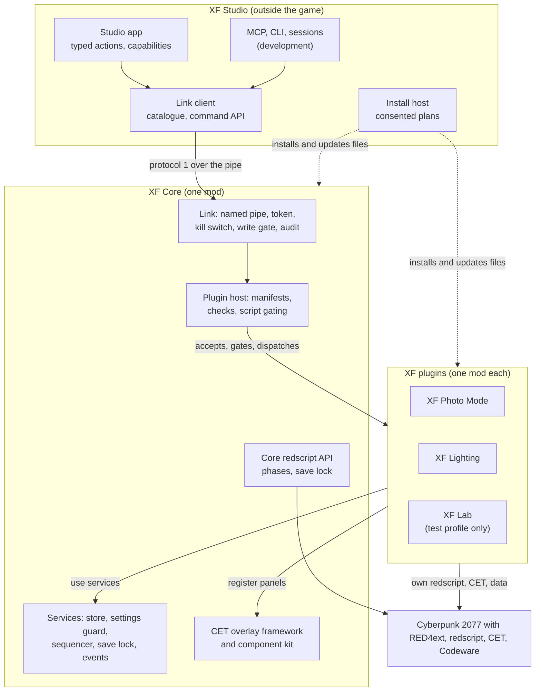
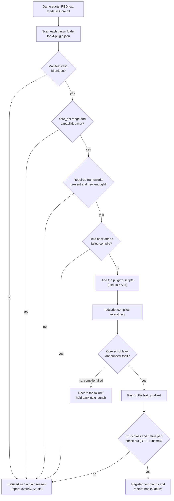
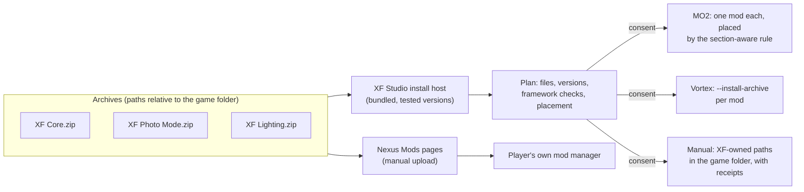

# XF Core architecture: one runtime base, modular XF plugins

**Status: proposed design (27 September 2026); nothing built, nothing published, no game run.** XF Core (working name) is a runtime base mod for Cyberpunk 2077, promoted from the [XF Runtime Bridge](../../projects/xf-runtime-bridge/README.md). Features ship as XF-branded plugin mods that depend on it through a versioned API. The first plugins are **XF Photo Mode**, which carries complete photo-mode snapshots and a properly rebuilt head and eye freeze and succeeds [Photo Mode Tools](../../projects/xf-photo-mode-tools/README.md) on its Nexus page, and **XF Lighting**, the [lighting mirror](lighting-mirror-design.md). Later plugins cover live posing, expressions and more. This page answers the ten design questions with recommendations, lists the decisions for the maintainer with proposed defaults (§11) and gives a phased plan (§12). The companion R&D for the first plugin is the [photo-mode snapshots design](https://github.com/axefrog/xf-studio/blob/claude/rnd-photo-slots/research/runtime/photo-snapshots-design.md) (branch `claude/rnd-photo-slots`, WIP), whose list of needed core services §2.4 takes over.

Evidence grades follow the [knowledge rules](../../knowledge/README.md): **[source]** read in a clone, **[offline]** exercised by our own build or tests, **[runtime]** seen in the game, **[hypothesis]** not yet established.

## In brief

- **XF Core is small and has no game features.** It holds the Studio link (pipe, token, kill switch, write gate, save lock, audit), a lightweight plugin host, the snapshot store, a settings guard, a tick sequencer, consent and framework detection, and the CET overlay framework. Everything the player sees as a feature is a plugin.
- **Plugins are declared as data and written in script.** A plugin is a manifest (`xf-plugin.json`) plus redscript, with an optional CET panel and, for first-party plugins only, an optional native part that XF Core loads through a C interface. XF Core adds a plugin's scripts to compilation only after accepting it, so a plugin whose core is missing or incompatible can never break the game's script compilation [source].
- **Isolation is layered.** XF Core refuses a plugin at load, gates its scripts, holds it back after a failed compile, checks RTTI before each call, bounds results and time, trips a per-plugin circuit breaker, catches each overlay panel's errors and runs each plugin's restore hook separately.
- **The Studio link keeps protocol 1 and every command name,** so the MCP tools, CLI and session scripts keep working while ownership moves into plugins. Release builds compile the research commands out and keep the link off until the player agrees, either in game or in the Studio's install plan.
- **Distribution:** one archive per mod, with paths relative to the game folder. The Studio bundles the tested versions and installs or updates them through its existing consented install host (MO2 with separator sections, Vortex through `--install-archive`, or manual). Nexus gets an XF Core page and XF Photo Mode on the renamed Photo Mode Tools page, and uploads are done by hand.
- **Photo Mode Tools transition:** its only settings are two CET hotkey bindings. Keeping its CET folder name keeps them, and also guarantees the old global LookAt script can't run beside the new one [source]. The freeze is rebuilt so that it leaves nothing behind.
- **Effort:** about 15–20 agent-days before the first in-game session, all of it offline (phases C1–C5), then one session of about 45 minutes.

## 1. Sources and findings

| Finding | Consequence for XF Core | Grade |
|---|---|---|
| RED4ext loads DLLs only from `red4ext/plugins/<dir>/` and its direct files, skips anything deeper, and ignores a folder with no DLL | A plugin folder holding only a manifest and scripts sits beside RED4ext plugins harmlessly. A native part in `red4ext/plugins/<Plugin>/native/` is invisible to RED4ext, so only XF Core can load it, after its own checks | [source] RED4ext v1.30.0 `src/dll/Systems/PluginSystem.cpp` (depth > 1 skipped, `.dll` only) |
| `sdk->scripts->Add` accepts an absolute path or one relative to the calling plugin | XF Core can add each accepted plugin's `.reds` folder to compilation | [source] RED4ext v1.30.0 `ScriptCompilationSystem.cpp:101-134` |
| When redscript fails to compile, the game starts with no scripts in effect: every mod's scripts, not only the broken one | One bad plugin script disables every redscript mod for that session, so XF Core must hold back a plugin that breaks compilation (§3.4) | [source] redscript v0.5.31 `scc/lib/src/lib.rs` (the popup text) |
| CET runs each mod in its own sandboxed context; `GetMod(name)` returns another mod's exported table | Plugin CET parts are isolated from each other by construction and reach the overlay framework through `GetMod("xf_core")` from `onInit` | [source] CET v1.37.1 `src/scripting/ScriptStore.cpp`, `Scripting.cpp:433` |
| CET keeps hotkey bindings in its own `bindings.json`, keyed by the mod's folder name and hotkey id, and by default deletes a mod's bindings once its folder is gone | Photo Mode Tools' only settings are the bindings `photo_mode_tools`/`freeze` and `restore`. A successor that keeps the folder name and ids keeps the players' keys (§6.5) | [source] CET v1.37.1 `src/Paths.cpp:76`, `src/VKBindings.cpp` (`RemoveDeadBindings`) |
| CET's sandbox confines file access to the mod's folder and has no networking | Storage and the external link belong to the native core; the CET layer reaches them through natives | [source] CET `LuaSandbox.cpp` ([runtime access §2](../../knowledge/runtime-access.md#2-rules-learned-the-hard-way-from-source)) |
| Photo Mode Tools sets the global `LookAt/MaxIterationsCount`: 1.0 on start, 0.9 or 1.0 on freeze and a hard-coded 3.0 on restore and shutdown. It never records the original, and AMM writes the same option | The rebuilt freeze needs an actor-scoped route or a managed global one (§6.5), and XF Core provides the settings guard for it (§2.4) | [source] legacy `init.lua`; AMM `Modules/tools.lua:484-491`; the snapshots design §4 |
| Vanilla photo-mode slots live in the save file, store only vanilla attribute keys and one value per NPC row, and are saved and loaded natively | XF Photo Mode's snapshots are its own files, read and applied live through the menu. XF Core stores them and never writes the vanilla slots | [offline] the snapshots design §1–2 |
| The Studio's install host already places one XF mod through a consented plan, with MO2 section-aware placement, receipts and backups, Vortex attribution, and refusal while MO2 or the game runs | XF Core and its plugins extend that host (§6) | [mod-install-host.ts](../../projects/xf-studio/authoring/src/mod-install-host.ts), [mo2-placement.ts](../../projects/xf-studio/authoring/src/mo2-placement.ts), [knowledge/vortex.md](../../knowledge/vortex.md) |
| The desktop release workflow starts on `v*` tags | Mod releases need namespaced tags (`xf-core-v1.0.0-alpha.1`) | [desktop release decisions](../authoring/desktop-release-decisions.md) |

## 2. Boundaries: what lives where



### 2.1 XF Core

| Part | Layer | From the bridge |
|---|---|---|
| Lifecycle, config, logging, build provenance | RED4ext | `core/Config`, `Log`, `BuildInfo`, `plugin/Main` |
| Link: pipe, session file, token, PID check, rate limit, bounded input, kill switch and re-arm, write pause | RED4ext | `core/PipeServer`, `Session`, `Bridge`, `Win32` |
| Dispatcher, access classes, write gate, save lock, undo plumbing, audit, restore-after-kill | RED4ext | `core/Dispatcher`, `Writes` (the generic parts) |
| Game-thread queue and the script-call routine (caller frame and context) | RED4ext | `core/GameThreadQueue`, `ScriptFrame`, `plugin/ScriptCall` |
| Plugin host: manifest scan, compatibility, script gating, quarantine, native-part loader, command registration, circuit breaker | RED4ext | new |
| Services: snapshot store, settings guard, sequencer, event feed, framework detection, consent and user settings | RED4ext + redscript | new; framework markers shared with the Studio's `framework-versions.ts` |
| Core redscript API: `game.status` and `game.wait` phases, save lock, event feed, sequencer steps, logging | redscript | `XFRuntimeBridge.reds` and the status part of `XFRuntimeBridgeActions.reds` |
| Overlay framework: one XF window, status line, Reconnect, Pause and Stop, plugin tabs, the component kit and theme | CET | `cet/xf_runtime_bridge/panel.lua` as its seed |

XF Core ships **no feature**: no photo-mode writes, no creator access, no spawning. The "light host" in the brief is read here as the **lightweight plugin host** above. The lighting mirror's light-host entity is a plugin capability (§2.2).

### 2.2 Plugins

| Plugin | Owns | Requires | Provides to other plugins | Ships to |
|---|---|---|---|---|
| **XF Photo Mode** | The photo-mode model (menu attributes by key, modded keys included, validated against the menu's own options), `photo.state`, `photo.subject`, `photo.camera.set`, `photo.light.set`, `photo.hud.hide`, `photo.expression.set`, `photo.pose.set`, `photo.exit`; complete snapshots (`photo.snapshot.take/apply/list/rename/delete`); the rebuilt freeze; its CET panel | XF Core, redscript, CET for the in-game panel and hotkeys | `photo.model@1` (attributes, stand-in and camera catch) | Nexus (the Photo Mode Tools page), the Studio |
| **XF Lighting** | `lights.mirror.apply/update/clear`, `lights.read`, the light-host archive, following V, its CET panel (later an in-game light editor) | XF Core, Codeware 1.20+ (spawning); optionally `photo.model@1` | `lights.host@1` (spawn, place, read and clear tagged lights) | Nexus (its own page), the Studio |
| **XF Lab** | Every research and test command: `cc.*`, `world.*`, `photo.enter`'s quest route, `face.rig.read`, `photo.expression.index`, `photo.pose.set`'s carrier use, `pose.live.*` (a native part), `game.options.read`, `diag.write_probe`, the test camera presets | XF Core, `lab` flavour | none | The test profile only; never published |

The **light host** that the snapshots design asks for is `lights.host@1`, provided by XF Lighting. XF Photo Mode uses it when present, so a snapshot then saves and restores spawned lights. Without it, snapshots cover the vanilla lights only and report that in plain words.

### 2.3 The Studio

- **Link client:** the command catalogue and command API, framing, captures, the MCP server, the CLI and the session runner (today's `tools/`). The catalogue is composed from the core's commands plus each installed plugin's manifest (§4.2).
- **The photo-mode key** (`photo.open`) stays in the development harness. The release Studio never sends input to the game.
- **Install host:** installs and updates XF Core and the chosen plugins with consent (§6.3).
- **Typed actions and capabilities:** for example `lighting.mirrorToGame` behind a `gameBridge.lights` capability, available only when the link reports the plugin and the capability (reactive-graph rule: the game is one more consumer of a view's lights node).

### 2.4 Core services the plugins use

The snapshots design's first list, mapped:

| Service | Where | Notes |
|---|---|---|
| Studio link, permission classes, write gate, undo, kill switch | Core | Plugin commands pass through the same gate as the bridge's today |
| Photo-mode model and the stand-in and camera catch | **XF Photo Mode** (`photo.model@1`) | Photo-specific, so not core. Other plugins use it through the capability |
| Phase and event feed: photo mode opened or closed, save loaded, CET reloaded, session end, kill switch | Core | Redscript callbacks and a CET event. The same phases as `game.status` |
| Snapshot store | Core | §7 |
| Sequencer: scripted apply with tick waits and per-step confirmation | Core | §4.5. Replaces the bridge's hand-written light select-wait-set and pose category-then-pose steps with one reusable mechanism |
| CET overlay framework | Core | §8 |
| Light host | **XF Lighting** (`lights.host@1`) | Plugin-to-plugin capability |
| Settings guard: capture and restore of any global engine option a plugin changes | Core | §4.6. Enforces "leave nothing global behind" in one place |

## 3. Plugin API

### 3.1 How a plugin registers

A mix of layers, each with one job:

| Layer | Role | Required? |
|---|---|---|
| **Manifest** (`red4ext/plugins/<Plugin>/xf-plugin.json`) | Identity, compatibility, requirements, commands and capabilities. Read by XF Core at load, before compilation, and by the Studio offline | Yes |
| **redscript** (`red4ext/plugins/<Plugin>/scripts/`) | Game hooks and game logic; one command entry point | Yes (a plugin with no game logic has no reason to exist) |
| **CET** (`bin/x64/plugins/cyber_engine_tweaks/mods/<cet_folder>/`) | In-game panel and hotkeys, through `GetMod("xf_core")` | Optional |
| **Native part** (`red4ext/plugins/<Plugin>/native/<Plugin>.dll`) | What script can't do (memory reads and writes, native hooks) and existing tested C++ logic | Optional; first-party only |
| **Data** (`r6/tweaks/XF<Plugin>/`, `archive/pc/mod/XF <Plugin>.archive` + `.xl`) | TweakDB records, resources | Optional |

A manifest is the registration because it can be read **before** script compilation. That lets XF Core decide which scripts compile. The Studio can also read it with the game closed, to build its catalogue and to check compatibility when it plans an install.

### 3.2 The manifest (`xf/plugin-manifest-1`)

```json
{
  "schema": "xf/plugin-manifest-1",
  "id": "xf.photo-mode",
  "name": "XF Photo Mode",
  "version": "2.0.0",
  "core_api": ">=1.0.0 <2.0.0",
  "requires": {
    "capabilities": ["commands@1", "events@1", "store@1", "sequencer@1", "settings-guard@1", "overlay@1"],
    "frameworks": { "redscript": ">=0.5.31" }
  },
  "optional": {
    "capabilities": ["lights.host@1"],
    "frameworks": { "CET": ">=1.37.1" }
  },
  "provides": ["photo.model@1"],
  "namespaces": ["photo"],
  "scripts": ["scripts"],
  "entry": "XFPhotoMode.XFPhotoModePlugin",
  "native": null,
  "cet_folder": "photo_mode_tools",
  "commands": [
    {
      "name": "photo.snapshot.apply",
      "access": "write-photo",
      "summary": "Put back a saved photo-mode snapshot, section by section.",
      "undo": "Takes a snapshot first; undo applies it.",
      "params": { "type": "object", "properties": { "id": { "type": "string", "pattern": "^[a-z0-9-]{1,64}$" },
        "sections": { "type": "array", "items": { "enum": ["pose", "camera", "lights", "environment", "effects", "npcs"] } } },
        "required": ["id"], "additionalProperties": false }
    }
  ],
  "store": { "kinds": ["snapshot"], "quota_mb": 64 }
}
```

| Field | Rule |
|---|---|
| `id` | Reverse-dotted and lowercase, unique. `xf.` is reserved for first-party plugins. Two installed copies of one id: the higher version loads and the other is named in the report |
| `version` | SemVer |
| `core_api` | A SemVer range against XF Core's API version, not its release version |
| `requires.capabilities` | `name@major`. XF Core and other plugins advertise `name@major.minor`. A missing capability refuses the plugin with a plain reason |
| `requires.frameworks` | Names from the shared marker table (RED4ext, redscript, CET, Codeware, ArchiveXL, TweakXL) with a range. Versions come from DLL version resources, as the Studio reads them. redscript is judged by its compiled result (§3.4), since `scc.exe` has no version resource |
| `optional.*` | Checked the same way. The plugin asks at run time (`XFCore.Has("lights.host", 1)`) and degrades plainly |
| `provides` | Capabilities offered to other plugins, with calls routed through XF Core so the provider's circuit breaker still applies |
| `namespaces` | Command prefixes the plugin owns. A second plugin claiming one is refused |
| `entry` | The redscript class whose static `Handle(method: String, params: String, cid: String) -> String` receives every command. It returns `{"ok":true,"result":…,"undo":…}` or `{"ok":false,"error":{"code","message"}}` |
| `commands[].access` | One of XF Core's classes: `read`, `write-photo`, `write-world`, `write-character`, `write-store`. A plugin cannot invent a class; a new class needs a core minor version |
| `commands[].params` | JSON Schema (a bounded subset: types, enums, patterns, ranges, lengths, `additionalProperties: false`). XF Core validates it before dispatch, and the Studio shows it and builds MCP tools from it |
| `native` | Relative path to the native part or `null`; honoured only for signed-off first-party ids in the `xf.` namespace |

### 3.3 Versioning and compatibility

- **Each mod has a SemVer release version.** XF Core also has a separate **API version**. A minor API version adds capabilities or optional fields; a major one removes or changes them. A plugin built for API 1.x is refused by XF Core 2.x with a plain line naming what to update.
- **Capabilities carry their own major version** (`store@1`), so XF Core can offer `store@1` and `store@2` side by side during a transition.
- **The game version:** only XF Core's DLL declares the runtime (as the bridge does), so RED4ext skips it after a patch until it's rebuilt. Script-only plugins need no rebuild. If a patch breaks a plugin's script, the compile gate catches it (§3.4). A native part declares the runtime it was built for, and XF Core refuses it on any other.
- **Protocol:** stays `v:1`. The additions are new methods and optional fields.

### 3.4 Loading, gating and graceful refusal



- **Everything before compilation happens in XF Core's `Main(Load)`,** so a refused plugin's scripts are never compiled. Its data files (tweaks, archives) still load, since TweakXL and ArchiveXL read them independently, so plugin data must be harmless alone. The manifest rules and the packaging test enforce this.
- **Quarantine after a failed compile:**
  - When redscript fails, XF Core's own script layer never announces itself, and CET still runs. XF Core records the plugin set of that launch.
  - On the next launch it adds only the last set that compiled, plus any unchanged plugins. It tells the player in plain words which plugin it held back and why ("XF Lighting 1.2.0 was switched off because the game couldn't compile its scripts. Update it, or tell us.").
  - Where the redscript log names a file inside a plugin's folder, that plugin alone is held back [hypothesis: the log format; check against `r6/logs/redscript_rCURRENT.log`].
  - If nothing of ours changed, the failure is another mod's: XF Core says so and holds nothing back.
- **Refusal wording** follows the "It just works" policy: what is needed, what the player has, and the one next step with a link. For example: "XF Lighting needs Codeware 1.20 or newer; you have 1.18.0. Update it in your mod manager from Nexus Mods or GitHub." It never installs or replaces a framework.

### 3.5 Isolation

| Failure | Containment |
|---|---|
| Bad manifest, missing dependency, API or namespace clash | Refused at load; other plugins unaffected |
| Script compile error | The game's all-or-nothing compile can't be avoided for that session; quarantine limits it to one launch. The plugin build pipeline lints against the pinned core API and the game bundle first (§9) |
| Missing or changed entry function | RTTI check before each call (`rtti_missing`, `rtti_signature`); only that plugin's commands answer `plugin_unavailable` |
| Handler returns malformed, oversized (over 1 MiB) or late output | Bounded parse and the queue's timeouts; the answer is `plugin_failed` |
| Repeated failures | Circuit breaker: three failures or timeouts in a row suspend that plugin's commands for the session (`plugin_suspended`), shown in the overlay with a Try again button |
| A plugin's CET panel throws | `pcall` around every callback; the panel shows one plain line and stops after three errors in a row; other panels keep drawing |
| Kill switch | XF Core refuses everything, then calls each plugin's restore hook in reverse load order, each isolated; one failure is logged and the others still run |
| Storage | Each plugin writes only its own store namespace, within its quota |
| Native part | A C interface with catch-alls at the boundary; no C++ types or exceptions cross it. An access violation can't be contained in-process, so native parts are first-party, reviewed, and `lab`-only until proven |
| A plugin opening its own link | Not allowed: XF Core's pipe is the only external link. The packaging test scans native parts' imports for sockets, HTTP and pipe APIs |

### 3.6 A minimal plugin

```
red4ext/plugins/XFHello/xf-plugin.json
red4ext/plugins/XFHello/scripts/XFHello.reds
```

```json
{ "schema": "xf/plugin-manifest-1", "id": "xf.hello", "name": "XF Hello", "version": "0.1.0",
  "core_api": ">=1.0.0 <2.0.0", "requires": { "capabilities": ["commands@1"] }, "namespaces": ["hello"],
  "scripts": ["scripts"], "entry": "XFHello.XFHelloPlugin",
  "commands": [ { "name": "hello.ping", "access": "read", "summary": "Answers with V's position.",
    "params": { "type": "object", "additionalProperties": false } } ] }
```

```swift
module XFHello
import XFCore.*

public class XFHelloPlugin {
  public static func Handle(method: String, params: String, cid: String) -> String {
    if Equals(method, "hello.ping") {
      let pos = GetPlayer(GetGameInstance()).GetWorldPosition();
      return XFCore.Ok("{\"x\":" + FloatToString(pos.X) + "}");
    }
    return XFCore.Error("unknown_method", "XF Hello doesn't know " + method + ".");
  }
}
```

## 4. Runtime layers and services

### 4.1 Layer per piece, and hard dependencies

| Piece | Layer | Why |
|---|---|---|
| Link, plugin host, store, settings files, framework detection | RED4ext (C++) | Only native code can open a pipe or write outside the mod folder, and it must run before compilation |
| Game hooks and logic, phases, save lock, sequencer steps | redscript | Vanilla APIs, linted against the game's bundle, no per-patch rebuild |
| In-game UI, hotkeys, reading engine options | CET (Lua) | ImGui overlay; `GameOptions` access exists only there |
| Resources, records | ArchiveXL/TweakXL data, per plugin | Only where a plugin needs them |

**XF Core hard dependencies:**
- **RED4ext:** without it nothing loads.
- **redscript:** without it XF Core still answers `bridge.*` and the store, and game methods answer `script_layer_missing`.

**Optional for XF Core:** CET, for the overlay. Without CET, XF Core works through the Studio, and critical guidance appears once per launch as an in-game message through redscript (the on-screen message blackboard [hypothesis: the exact vanilla route to check]).

**Never XF Core dependencies:** Codeware, ArchiveXL and TweakXL. Plugins declare their own.

Frameworks are detected, never installed, replaced or disabled. The marker table (framework, marker file, version source) becomes one data file shared by XF Core's detection and the Studio's `framework-versions.ts`, so both give the same answer.

### 4.2 Commands and the catalogue

- XF Core registers each plugin command with its `Dispatcher` as a game-thread method whose function validates the schema, calls the plugin's `Handle` through the script-call routine (or the native part's handler) and parses the answer. The order of checks stays as in [bridge design §3.2](runtime-bridge-design.md#32-protocol-1), with plugin checks after the allowlist: plugin active, circuit breaker, schema.
- **In the Studio,** `tools/api/catalogue.ts` becomes the core's commands plus a loader that reads installed manifests (offline) or `bridge.methods` (live). Each command keeps its plain text, schema, class and undo note, so the MCP tool list, CLI and session runner derive from it unchanged. The catalogue test becomes: every manifest command has a handler in its plugin, and the self-test host reports the same class.

### 4.3 Access classes

| Class | Meaning | Release flavour | Lab flavour |
|---|---|---|---|
| `read` | Observes | Yes, once the link is on | Yes |
| `write-photo` | Photo mode only; gone when it closes | Yes, with consent | Yes |
| `write-store` | XF's own stored data (snapshots, setups); never the game | Yes, with consent | Yes |
| `write-world` | Clock, freeze | No (compiled out until a product needs it) | Config-gated, as today |
| `write-character` | The creator | No | Config-gated, as today |
| `control` | The kill switch; only takes access away | Yes | Yes |

### 4.4 Events

`events@1` delivers `photo_mode.opened`, `photo_mode.closed`, `save.loaded`, `session.ended`, `cet.reloaded`, `link.killed` and `link.rearmed`. Plugins subscribe from redscript (a callback class registered with `XFCore.Events`) or CET (`xf_core.events.on(name, fn)`). Delivery is on the game thread, isolated per subscriber.

### 4.5 Sequencer

`sequencer@1` runs a list of steps on the game thread. Each step is an action (a plugin call), a wait (ticks, or a condition such as "the pose list rebuilt"), and an optional check (the value the menu shows equals the one asked for). One sequence runs per plugin at a time. The player's own actions pre-empt it, since a sequence yields between steps and stops if photo mode closes. Each step reports progress, so the overlay and the Studio can show "Restoring pose (3 of 9)". A step that fails stops the sequence and runs the undo list collected so far. This one mechanism replaces the bridge's light select-wait-set, `photo.pose.set`'s category-then-pose steps and the snapshot restore order, and the self-test host drives it with a simulated tick.

### 4.6 Settings guard

`settings-guard@1`: a plugin declares a global engine option before changing it, for example `guard("LookAt", "MaxIterationsCount", scope = "photo_mode")`.

- **Capture:** XF Core records the value the first time it's guarded in a session, through CET's `GameOptions` and XF Core's CET layer.
- **Restore** happens when the scope ends: photo mode closes, a save loads, the session ends, CET reloads, the game shuts down or the kill switch runs. It happens only if the current value is still the one the plugin last wrote. If another mod changed it since, XF Core leaves it alone and logs that.
- **Scope:** the guard covers engine options, TweakDB flats and user settings, the same "record and restore" rule [bridge autonomy](../backlog/bridge-autonomy.md#constraints) already sets. A plugin that writes an unguarded global is a review finding.

## 5. Studio link

| Today (bridge) | In XF Core |
|---|---|
| `\\.\pipe\xf-runtime-bridge-<pid>-<random>`, token, PID check, Identification level, 64 KiB, rate limit | Unchanged; the pipe is renamed `xf-core-<pid>-<random>` |
| `%LOCALAPPDATA%\XFStudio\runtime-bridge\session.json` | `%LOCALAPPDATA%\XFStudio\core\session.json`; the tools read both during the transition. The folder stays outside MO2's virtual file system and private to the user |
| `bridge.ping/info/methods/kill`, `layers.status` | Kept; plus `bridge.hello`: API version, flavour, capabilities, plugins with version and state, link consent, framework versions |
| Photo, creator, world and research methods in one DLL | The same names, owned by XF Photo Mode and XF Lab |
| `config.ini` gates, three packages (default, diagnostic, writes) | **Flavours.** `release` compiles the lab methods out, and its `config.ini` gates can only narrow. `lab` keeps today's gates and packages. A packaging test scans the release DLL for lab method names |
| CET panel: Reconnect, Pause, Stop (test builds) | In the overlay framework for every flavour; Reconnect stays a player action only |
| MCP (development) | Unchanged; later hosted by the Studio behind an off-by-default switch ([AI integration](../backlog/ai-integration-mcp.md)). MCP permissions are always a subset of what XF Core grants |

**Security:**
- **Boundary:** unchanged, the Windows user at medium integrity ([bridge design §4](runtime-bridge-design.md#4-safety-model)).
- **Local only:** a named pipe, never TCP, so browsers can't reach it.
- **Consent:** in the release flavour the link is off until the player turns on "Let XF Studio connect" in the XF overlay, or accepts the same line in the Studio's install plan. The choice is kept in `%LOCALAPPDATA%\XFStudio\core\settings.json`, revocable in both places and shown in the overlay's status line.
- **Attach-only:** nothing launches the game.
- **Write gates:** release allows `read`, `write-photo` and `write-store`. World and creator writes, input sending and live-pose memory writes stay in the lab flavour and the test profile, as decided on 26 September.
- **Saves:** every write keeps the save lock and undo rules. Nothing saves the game or touches the vanilla slots.
- **In process:** plugins' native parts may not open links. XF Core's natives trust in-process callers, as today (RB-48).

## 6. Distribution

### 6.1 What each mod ships



| Mod | Files |
|---|---|
| **XF Core** | `red4ext/plugins/XFCore/XFCore.dll`, `config.ini` (flavour defaults, never user-edited), `scripts/*.reds`, `frameworks.json`, `THIRD_PARTY_NOTICES.txt`; `bin/x64/plugins/cyber_engine_tweaks/mods/xf_core/` (`init.lua`, `ui/*.lua`, `theme.lua`) |
| **XF Photo Mode** | `red4ext/plugins/XFPhotoMode/xf-plugin.json`, `scripts/*.reds`, `native/XFPhotoMode.dll` (if the ported C++ stays native, §3.1); `bin/x64/plugins/cyber_engine_tweaks/mods/photo_mode_tools/` (§6.5) |
| **XF Lighting** | `red4ext/plugins/XFLighting/xf-plugin.json`, `scripts/*.reds`; `archive/pc/mod/XF Lighting.archive` (the light host, `xf\lighting\xfs_light_host.ent`); `bin/x64/plugins/cyber_engine_tweaks/mods/xf_lighting/` |
| **XF Lab** | `red4ext/plugins/XFLab/…`, `native/XFLab.dll` (live pose), `r6/tweaks/XFLab/` (camera presets); test profile only |

User data never lives in a mod folder. Settings, consent, the store and quarantine records are in `%LOCALAPPDATA%\XFStudio\core\`, so an update or reinstall keeps them, and MO2 doesn't capture them into `overwrite`.

### 6.2 Per mod manager

- **MO2.** Each XF mod is its own MO2 mod named as above.
  - **Placement rule:** [mo2-placement.ts](../../projects/xf-studio/authoring/src/mo2-placement.ts) adds one row and moves nothing else. `modlist.txt` is the reverse of MO2's left pane.
  - **XF Core:** proposed to go at the bottom of a recognised framework section (such as "CORE, LIBS, FRAMEWORKS"), since other mods depend on it, or by the existing rule when there is none.
  - **Plugins:** beside the nearest XF mod (the `beside-related` rule), else the existing rule.
  - **Separators:** XF Studio never creates one. File sets never overlap, so order doesn't change what the game loads; placement is purely the player's organisation.
- **Vortex.** One archive per mod, handed to the player's own Vortex with `Vortex.exe --install-archive "<path>\XF Core.zip"` after consent. Vortex installs, enables and deploys ([knowledge/vortex.md §6](../../knowledge/vortex.md#6-placing-xf-eye-artistry-in-a-vortex-setup)). Whether the Cyberpunk extension's installer accepts an archive that mixes `red4ext`, CET and `archive` paths needs a Windows Sandbox run like [experiment 023](../../experiments/023-vortex-sandbox/README.md) [hypothesis].
- **Manual.** The direct route copies only XF-owned paths (`red4ext/plugins/XF*`, the CET folders above, `archive/pc/mod/XF *`, `r6/tweaks/XF*`) with receipts and backups. It never writes over a file it didn't put there.

### 6.3 The Studio installs and updates

- **Bundled, not downloaded:** each Studio release carries the XF Core and plugin archives it was tested with. They are published on GitHub Releases too, for standalone users.
- **One plan per change:** the plan lists every mod with its current and new version, the files, the placement, the framework check for each plugin's requirements, the link consent line and anything held back. The existing token, journal, receipts and "MO2 or the game is open" refusals apply unchanged.
- **Updates:**
  - The Studio offers an update when its bundled XF Core or plugin is newer than the installed one, or when an installed plugin's `core_api` range excludes the installed core.
  - It never downgrades a newer XF Core installed from Nexus. It checks compatibility instead and names what's missing.
- **Defaults first:** installing a feature that needs the game side (for example "Show in game") offers XF Core plus that plugin as one plan. The player chooses nothing up front beyond consent.

### 6.4 Nexus packaging and release

- **Pages:** XF Core gets its own page (the requirement other pages list). XF Photo Mode goes on the renamed Photo Mode Tools page (§6.5), and XF Lighting gets its own page. Each page's requirements list XF Core, RED4ext, redscript and CET, plus Codeware for XF Lighting.
- **Archives:** plain zips laid out relative to the game folder, which MO2, Vortex and manual installs all accept. No FOMOD. A short readme, the licence and third-party notices are included.
- **Uploads** are done by hand by the maintainer. Agents never publish, and no Nexus API credential is stored.
- **Tags:** namespaced (`xf-core-v1.0.0-alpha.1`, `xf-photo-mode-v2.0.0-alpha.1`), so they never trigger the Studio's `v*` release. CI builds and drafts them like the desktop app, with checksums and provenance. The version source is each mod's `version` file; `package.ts` refuses a dirty tree, as it does today.

### 6.5 Photo Mode Tools transition

- **Players of the old mod:** its only stored settings are its two CET bindings. XF Photo Mode keeps the CET folder `photo_mode_tools` and the hotkey ids `freeze` and `restore`, so the bindings carry over with no migration code.
  - A same-named folder also means that in MO2, Vortex or a manual install only one `init.lua` exists, so the old global callbacks can't run beside the new mod.
  - If the old mod wins in MO2, XF Photo Mode's CET layer never announces itself. XF Core then says so plainly: "An older Photo Mode Tools is overriding XF Photo Mode's in-game part. Switch off Photomode Tools in Mod Organizer 2."
  - The Studio's install plan names the old mod as a predecessor for the player to decide on, as it does for XF Eye Artistry.
- **The hotkeys:** `freeze` becomes "XF Photo Mode: Freeze or unfreeze V's gaze", and `restore` becomes "XF Photo Mode: Unfreeze and put the look-at back". The names are new, the keys are the same.
- **The freeze, rebuilt** (the snapshots design §4 and [photo-mode §8.2](../../knowledge/photo-mode.md#82-world-npcs-and-v)):
  1. **Actor-scoped first:** a static look-at target on the photo-mode stand-in (`LookAtAddEvent` with per-part weights), or look-at off plus the photo-mode head rotation, or the stand-in's individual time dilation. It needs one in-game check [hypothesis].
  2. **Otherwise the global option, fully managed** through the settings guard: captured before the first write, changed only while photo mode is open, restored on unfreeze, on exit and on every transition, and only while it still holds our value.
  3. **Clean-up of the old mod's leftovers:** on the first launch after upgrading, if the option reads exactly the old mod's 1.0 at start-up, XF Photo Mode offers once to put the engine's default back. Whether 3.0 is that default needs `GameOptions.Print("LookAt", "MaxIterationsCount")` in game.
- **The Nexus page:**
  - Rename it "XF Photo Mode (formerly Photo Mode Tools)".
  - The main file becomes version 2.0.0, which requires XF Core. The last standalone version moves to Old files, with a line saying what it did globally and that 2.0 fixes it.
  - The description covers what's new (complete snapshots, the gaze freeze without side effects), the requirements, and that bindings carry over.
  - Endorsements and tracking stay with the page. It switches over only after the first-release session passes.

## 7. Snapshot store

- **Owner:** XF Core's native layer; `store@1` for redscript and CET through natives, `store.*` on the pipe (`write-store` for put, rename and delete).
- **Location:** `%LOCALAPPDATA%\XFStudio\core\store\<plugin id>\<kind>\<id>.json`, plus an optional `<id>.png` thumbnail. It is outside the game, its saves and MO2's virtual file system, and private to the user.
- **Documents:** JSON with a required `schema` (for example `xfp/photo-snapshot-1`, `xfs/lighting-setup-1`), `id`, `name`, `created`, `rev` and `producer` (plugin id and version, game version). Ids come from a safe character set chosen by XF Core or the caller, and no caller-supplied path is ever used.
- **Operations:** `put` (atomic temp-file-and-rename, compare-and-set on `rev`), `get`, `list` (metadata only), `rename`, `delete` (moves to `.trash`, emptied after 30 days, since the rules forbid permanent deletion without the player). Thumbnails come from the Studio's capture or, later, a photo-mode screenshot.
- **Bounds:** 1 MiB per document, 2 MiB per thumbnail, and each plugin's manifest quota (default 64 MiB). Parsing is bounded like the pipe's, with nesting at most 32.
- **Sharing:** because the store is plain files for the same user, the Studio reads and writes it with the game closed. A lighting setup sent from the Studio is waiting in game next time, which is the lighting design's "mirror without the bridge". With the game running, XF Core re-lists on `store.list` and notices a changed `rev`.
- **Formats belong to plugins:** XF Core checks only the envelope. Snapshot contents (menu attributes by key, modded keys included; the stand-in and camera relative to V; lights as `xfs/lighting-setup-1`; NPCs; plugin sections) are XF Photo Mode's schema, restored through the sequencer in the snapshots design's order.

## 8. In-game UI

- **One XF window in the CET overlay.**
  - **Header:** a status line in plain words ("Connected to XF Studio", "Not connected", "Stopped by the kill switch") with the link toggle, Reconnect, Pause changes and Stop.
  - **Tabs:** one per active plugin, ordered by the manifest, plus a Plugins tab that lists refused or held-back plugins with their one next step.
  - Panels are registered from CET with `GetMod("xf_core").ui.panel{ id, title, order, draw }`.
- **Component kit** (`xf_core/ui/kit.lua`): status line, button, toggle, slider with exact entry, list with search, section, progress, and hint. A hint reserves its height so it never shifts layout.
  - Components follow the component-first rule: plugins compose the kit, and new controls are added to the kit by the UI component track. The kit gets an "In-game (CET)" entry in the Studio style guide.
  - Buttons queue actions that run in `onUpdate`, never while drawing. This is the existing panel's rule.
- **Theme:** generated at build time from the Studio's dark tokens (`public/studio.css`: `--bg-panel`, `--text`, `--accent`, `--signal`, `--danger`, `--warning`, `--success`, radius 2 px, spacing) into `theme.lua` by `tools/gen-cet-theme.ts`, converting OKLCH to sRGB. ImGui colours and styles are pushed and popped around the XF window only, never changed globally, so other mods' windows are untouched.
- **Rules:** actionable only (no section that says nothing is available), and every action shows its effect at once, with progress for sequences. The in-game UI goes through the UI/UX review gate before release.

## 9. Testing

**Runtime-free harness (all offline):**

| Area | How |
|---|---|
| Plugin host | `xfcore_selftest` (grown from `xfb_selftest`) loads real manifests from `projects/xf-core/plugins/*` and fixture manifests: schema, duplicate ids, ranges, capabilities, namespaces, a fake framework table, the release/lab flavour gates |
| Quarantine | A simulated launch whose script layer never announces itself: the next launch holds back only the changed plugin, and holds back nothing when no XF plugin changed |
| Commands | Simulated redscript entry functions (canned JSON, malformed, oversized, late, throwing): schema refusals, `plugin_failed`, circuit breaker, undo, the kill switch's restore order with one failing hook |
| Native parts | The self-test host loads the plugin DLL with a fake services table (the same C interface), so the ported photo logic keeps its unit checks |
| Sequencer and settings guard | Simulated ticks and conditions; pre-emption; restore only while the value is still ours; every transition |
| Store | A temporary folder: atomic writes, `rev` conflicts, quotas, ids, thumbnails, a Studio write while "running" |
| CET | The overlay and kit run in fengari 0.1.5 against stubbed ImGui, `GetMod` and events: registration, `pcall` isolation, the three-error cut-off, the theme load |
| redscript | `redscript-cli` lint against the game's bundle for a compile matrix: core alone, core with each plugin, core with all of them, each without Codeware |
| Packaging | Each zip's layout, only XF-owned paths, no lab file or method name in release archives, native imports scan |
| Studio | Multi-mod plans, the framework-section placement of XF Core, Vortex commands, direct-route receipts, never downgrading, the link client against the self-test host (MCP tests as today) |

**First-release in-game session** (test profile, about 45 minutes; one prepared card with versioned evidence capture):

| # | Check | Pass |
|---|---|---|
| C1 | Install XF Core, XF Photo Mode and XF Lab through the Studio into the test profile | Plan matches the files; MO2 rows where the rule said |
| C2 | Start the game | RED4ext log: XF Core loaded, plugins accepted; redscript compiles; the XF window shows every tab |
| C3 | In a copy of the profile with Codeware switched off, add XF Lighting | Refused with the plain Codeware line; everything else works |
| C4 | Add a deliberately broken lab plugin, restart twice | The first launch shows the compile failure; the second holds back only that plugin and says so |
| C5 | Link toggle off, then on; the Studio connects | `bridge.hello` lists the plugins; reads work; writes follow the flavour |
| C6 | Photo mode: take a detailed snapshot, change everything, apply it | Attribute tables match (the snapshots design's diff), including modded keys |
| C7 | `GameOptions.Print("LookAt", "MaxIterationsCount")` on a clean launch; freeze, leave photo mode, read again | The default is recorded; the value is back after exit |
| C8 | Actor-scoped freeze candidates | Which of them holds the gaze while the camera moves |
| C9 | The kill switch during a snapshot apply; Reconnect | The sequence stops, its undo runs, every plugin's restore runs, and the link comes back |
| C10 | Old Photo Mode Tools installed beside XF Photo Mode | Bindings carried over; the override message when the old mod wins |
| C11 | Load the safety save | Nothing persisted, the save lock gone |

The Vortex check is a separate Windows Sandbox run, not a game session.

## 10. Naming

| Option | For | Against |
|---|---|---|
| **XF Core** (recommended) | Short; players recognise "Core" as the thing other mods need; matches the maintainer's own wording | Generic |
| XF Runtime | Continues the bridge's name | Sounds like a library; less clear to players |
| XF Base | Plain | "Base" already means the base game and `base\` paths in Cyberpunk modding |

- **Plugins:** XF Photo Mode (or XF Photo Mode Tools, which keeps the old name's recognition), XF Lighting, and later XF Posing and XF Expressions. XF Lab is internal only.
- **Internal identifiers:** `XFCore` (RED4ext folder and DLL, redscript module, natives `XFCore_*`), `xf_core` (CET folder), `xf.<name>` plugin ids. New archive resources keep the `xfs_` prefix of the [naming contract](../../projects/xf-studio/data/naming.md).

## 11. Decisions for the maintainer

| # | Decision | Proposed default |
|---|---|---|
| 1 | The base mod's name | **XF Core** |
| 2 | The photo plugin's name | **XF Photo Mode** (the Nexus page title keeps "formerly Photo Mode Tools") |
| 3 | Retire standalone Photo Mode Tools in favour of XF Core plus XF Photo Mode on the same Nexus page, next major version, standalone kept under Old files | Yes, once the first-release session passes |
| 4 | Keep the CET folder `photo_mode_tools` so players keep their bindings and the old script can't run alongside | Yes |
| 5 | Release link off until the player agrees (in game or in the Studio's install plan); release allows only reads, photo-mode changes and XF's own stored data | Yes |
| 6 | XF Core placed at the bottom of a recognised framework section in MO2 (plugins beside other XF mods) | Yes; never create a separator |
| 7 | The Studio bundles the tested XF Core and plugins instead of downloading them | Yes |
| 8 | XF Core its own Nexus page; XF Lighting its own page | Yes |
| 9 | First-party plugins may have a native part loaded by XF Core (XF Photo Mode keeps its ported, tested C++; XF Lab's live pose) | Yes, `lab`-reviewed first |
| 10 | XF Lighting requires Codeware (the lighting design's question 2) | Yes, detected, never installed |
| 11 | AGENTS.md: Photo Mode Tools is no longer "an independent second project" but XF Photo Mode, a plugin on XF Core | Update the rule once approved |
| 12 | Repository layout: rename `projects/xf-runtime-bridge` to `projects/xf-core` (with `plugins/photo-mode`, `plugins/lighting`, `plugins/lab`), and keep `projects/xf-photo-mode-tools` for the Nexus page text and transition notes | Yes |

## 12. Phased plan

| Phase | Scope | Effort | Game needed |
|---|---|---|---|
| C0 | This design | Done | No |
| C1 | **Promote the core:** rename to XF Core, flavours, plugin host (manifests, checks, script gating, quarantine), the C interface and native-part loader, `bridge.hello`, session-file transition, self-test harness growth | M–L, 4–6 days | No |
| C2 | **Split into plugins:** XF Lab (every research and test command, so the session 2 and 3 scripts still pass), XF Photo Mode (photo commands, its native part), the composed catalogue and MCP; every existing test passes through XF Core plus plugins | M, 3–4 days | No |
| C3 | **Services and overlay:** store, sequencer, settings guard, events; the overlay framework, kit and theme generator; the Reconnect panel moved in; UI review | M, 3–4 days | No |
| C4 | **XF Photo Mode features:** complete snapshots on the sequencer (with the snapshots R&D), the rebuilt freeze with its candidates, the Photo Mode Tools continuity | M, 3–4 days | No |
| C5 | **Distribution:** per-mod zips, namespaced tags and CI drafts, the Studio's multi-mod plans, the XF Core placement, Vortex per mod, the direct-route extension; the Vortex sandbox run | M, 3 days | No |
| S1 | **First-release session** (§9) | About 45 minutes | Yes |
| C6 | **XF Lighting:** the lighting mirror's L1–L2 as a plugin with `lights.host@1`, then L3 in the Studio | L, about 7–8 days | One session |
| C7 | **Release:** XF Core alpha and XF Photo Mode 2.0 alpha on GitHub and Nexus (manual upload), after S1 | S | No |
| Later | XF Posing (live pose from lab to product), XF Expressions, an in-game light editor in XF Lighting | — | — |

C1–C5 need no game: about 15–20 agent-days that can run as two or three parallel tracks after C1 (C2 and C3 in parallel, C4 after both, C5 beside C4). The bridge's next in-game sessions can keep using its current packages until C2 is proven, since command names don't change.

## 13. Visual review of the diagrams

| Date | Tool | Observations | Limits |
|---|---|---|---|
| 27 September 2026 | Mermaid CLI 11.17.0 with the installed Chrome; all three rendered to temporary PNGs at 800 px and 1600 px width requests and inspected at normal and enlarged size | **Boundaries:** the first left-to-right draft tangled plugin edges through the core box, so it was redrawn top to bottom with edges between subgraphs. Studio, core and plugins now read as three boxes; the protocol arrow enters XF Core at its link node; the dashed install arrows reach both XF Core and the plugins; the plugins point to the services, the overlay and the game, and the core redscript points to the game. **Gating:** every refusal branch ends at one Refused box, and the compile-failure branch ends separately at the hold-back record; yes/no labels sit on the right edges. Two labels that wrapped mid-phrase were shortened. **Distribution:** the archives feed both the Studio install host and the Nexus pages, and only the Studio route passes a consent-gated plan into MO2, Vortex and manual installs. | The protocol arrow brushes the "XF Core (one mod)" title in the boundaries diagram, but both stay readable. The gating diagram is tall at every width, and Mermaid kept the gating and distribution diagrams near their intrinsic width. The renders contain no private data and are not committed. |

## Related

[Runtime bridge design](runtime-bridge-design.md) · [runtime bridge README](../../projects/xf-runtime-bridge/README.md) · [lighting mirror design](lighting-mirror-design.md) · [bridge autonomy](../backlog/bridge-autonomy.md) · [runtime access](../../knowledge/runtime-access.md) · [photo mode](../../knowledge/photo-mode.md) · [mod loading](../../knowledge/mod-loading.md) · [Vortex](../../knowledge/vortex.md) · [framework version check](../authoring/framework-version-check.md) · [Photo Mode Tools](../../projects/xf-photo-mode-tools/README.md)
