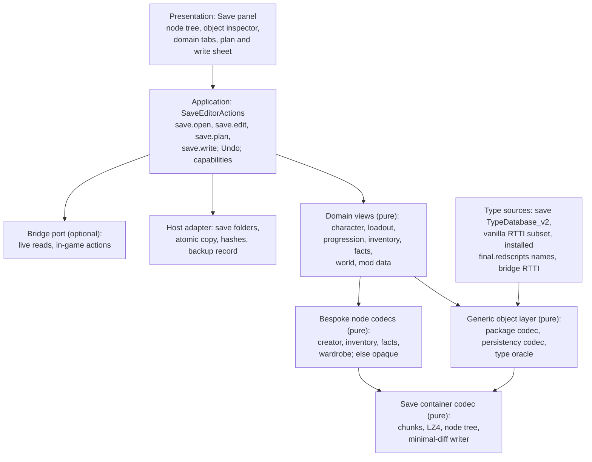

# A full save editor: design study

**Status: R&D and design, 27 September 2026. Nothing is built beyond the read-only pieces the Studio already has.** How a Cyberpunk 2077 save holds everything beyond the creator data (life path, progression, quests and facts, inventory, world state, mod data), how an editor can read and change it generically enough that different mod setups don't break it, and how it fits beside the Studio's existing save reading. The durable facts are in [knowledge/save-files.md](../../knowledge/save-files.md); this page holds the evidence, the design and the plan.

It builds on the [save import](../eye-artistry/save-import.md) note (the reader and the container), the [save write-back design](../character-customization/save-writeback-design.md) (minimal-diff rewrite, never overwrite, apply in game first), [worn clothing](../../knowledge/clothing.md) §2 (the object packages and EquipmentEx), [runtime access](../../knowledge/runtime-access.md) and the [clothing render](../backlog/clothing-render.md) decision on EquipmentEx.

Evidence grades follow the [knowledge rules](../../knowledge/README.md): **[source]** engine, framework or tool source; **[resource]** bytes of real saves or game files; **[wiki]** Modding Docs; **[runtime]** seen in the running game; **[offline]** measured by our own probes; **[hypothesis]** not established.

## 1. Summary

| Question | Answer | Grade |
|---|---|---|
| How is a save built? | One LZ4-chunked stream cut into a **tree of named nodes** (about 170–340 in 2.31 saves, depth ≤ 2) with a node table at the end. No checksum. Each node is one of three encodings: a **bespoke binary layout** (most nodes), a **self-describing object package** (10 nodes, including every script system's data) or a **hash-keyed object stream** (`PersistencySystem2`, the world's persistent object states, about two thirds of the stream). | [source] [resource] |
| Can it be decoded without per-node schemas? | **Mostly yes.** The save carries **its own type database** (`TypeDatabase_v2`): every persisted type by FNV-1a 64 name hash with its kind, size and element type, and every persisted property by name hash and type. With it, and nothing else, all 451 script-system objects of a heavily modded save decode, including about 60 classes from 14 script mods' namespaces, and 99.4 % of the 63,100 persistency entries walk exactly. The native-system packages also need the vanilla engine's enum names, which the RTTI dump gives: then all 472 package objects decode. | [offline] on three private 2.31 saves |
| And mod data? | Script mods' persistent fields (redscript `persistent`) live in `ScriptableSystemsContainer` as ordinary objects whose class names, field names and field types are written in the package, and whose types the save's type database lists. EquipmentEx's `EquipmentEx.OutfitState` decodes generically from the save alone. Codeware services and CET mods keep their state **outside** saves. | [source] [offline] |
| What stays bespoke? | The creator node, inventory and item data, facts, the journal, the wardrobe, and many small world-system nodes. WolvenKit hand-parses these, several with "unknown" fields. They are few and small, but they hold what players most want to edit (items, facts). | [source] |
| Is editing safe? | Value edits inside existing objects can be minimal-diff and verified offline. Structural edits (new items, new nodes, new types) touch IDs, counters and cross-references the game keeps consistent, and quest facts are a known way to brick a save. The game validates nothing we know of up front, so errors show up late. | [source] [wiki] [hypothesis] |
| **Recommendation** | Build a **read-only Save Explorer first**, on one container codec, one generic object layer driven by a type oracle (the save's own type database, then vanilla RTTI, then installed script definitions for names), and domain views. Add writes one class at a time behind the write-back design's gates: the creator node and scalar values in existing objects first, verified by a batched game session. Prefer the runtime bridge (the game's own systems) for structural changes such as adding items or setting facts. | – |

## 2. Evidence

- **Saves:** three private 2.31 saves (save version 269, game version 2310), copied into a scratch folder and opened read-only; the originals were hashed and never opened for writing. The reference save of the [save import](../eye-artistry/save-import.md) (330 nodes), the check save of [worn clothing](../../knowledge/clothing.md) (169 nodes) and a newer quick save (336 nodes, with script mods from 14 namespaces installed). Probes printed layout, class and field names, counts and sizes only, never values or personal data. Saves live under `%USERPROFILE%\Saved Games\CD Projekt Red\Cyberpunk 2077\<save>\`.
- **Probe code:** throwaway Bun scripts using the Studio's own `save-reader.ts` (`Reader`, `decodeLz4`) and `save-package.ts`, in a private scratch folder; not committed (they read private saves).
- **WolvenKit** at commit `11720772` (GPL-3.0, studied, not copied): `WolvenKit.RED4/Save/IO/CyberpunkSaveReader.cs`, `CyberpunkSaveWriter.cs`, `NodeWriter.cs`, `Save/Helper/ParserHelper.cs`, `SaveHashHelper.cs`, `InventoryHelper.cs`, `Save/Parser/*.cs` (56 parsers), `Archive/IO/RedPackageReader*.cs`, `Types/Reflection/RedReflection.cs`.
- **Scripting RTTI dump** `red-dump-json` at `a8e52990` (exported by psiberx, May 2025, before 2.31): 15,715 classes and 1,517 enums.
- **Codeware** at `613a1cb8` (MIT): `src/App/Scripting/ScriptableServiceContainer.cpp`, `src/App/Environment.hpp`, `src/App/World/DynamicEntitySystem.cpp`, `wiki/Home.md`.
- **EquipmentEx** at `3208ff4c` (MIT): `scripts/OutfitState.reds`, `OutfitSystem.reds`, `ViewState.reds`, `ViewManager.reds`.
- **Cyber Engine Tweaks** at `9a8522f` (MIT): `src/scripting/LuaSandbox.cpp` (per-mod `db.sqlite3`).
- **redscript** at `3ca666c` (MIT): `crates/io/src/definition.rs` (`is_persistent` on fields).
- **Modding Docs** at `be2f44ee`: [CyberCAT page](https://github.com/CDPR-Modding-Documentation/Cyberpunk-Modding-Docs/blob/be2f44eed8419342ec13f72ed9cab008e9f7b289/for-mod-creators-theory/modding-tools/savegame-editor-cybercat.md) (manavortex; version table, quest-fact risks, appearance tab) and the [save file page](https://github.com/CDPR-Modding-Documentation/Cyberpunk-Modding-Docs/blob/be2f44eed8419342ec13f72ed9cab008e9f7b289/for-mod-creators-theory/files-and-what-they-do/file-formats/save-file-.dat.md) (darkcart). CyberCAT's own source was not studied (no local clone).

## 3. The container [source] [resource]

The [write-back design §2](../character-customization/save-writeback-design.md#2-the-save-container-source-resource) has the full layout; in brief:

| Part | Layout | Measured (three saves) |
|---|---|---|
| Folder | `sav.dat`, `metadata.9.json`, `screenshot.png` | – |
| Header | `CSAV`, u32 save version, u32 game version, string (empty), u64 timestamp, u32 archive version | 269 / 2310 / 195; 25 bytes |
| Chunk table | `FZLC`, u32 used count, 12-byte entries (offset, stored, expanded) padded to a capacity | Capacity 512; 256 KiB chunks; 25–33 chunks; all `4ZLX` LZ4, no stored chunks |
| Expanded stream | The chunks' contents end to end, addressed as if the header and table were part of it; cut with no regard for node boundaries | 6.5–8.5 MB |
| Node table | Found by the footer: `EDON`, VLQ count, per node name, i32 next ID, i32 child ID, u32 offset, u32 size | 169 / 330 / 336 nodes; **node ID = table position** in all three; the first u32 of each node's data is its own ID; tree depth at most 2 |
| Footer | u32 node-table offset, `ENOD` | – |
| Integrity | None: no hash, CRC or signature anywhere | WolvenKit's reader and writer compute none |
| `metadata.9.json` | The load menu's summary: life path, body and brain gender, level, attributes and skills, location, player position, play time, quests, a short fact list, `isModded`, DLC ids, `fileSize` and more (it also holds the platform user name, so it is personal) | `fileSize` equals `sav.dat`'s length |

**A parent's size includes its children.** 16 root nodes have children (for example `questSystem` holds `FactsDB`, which holds ten `FactsTable` nodes; `inventory` holds one `itemData` node per item). Changing a child's size changes every ancestor's size and every later node's offset.

**Where the player-facing data sits** [resource: quick save]: `TypeDatabase_v2` and `PersistencySystem2` are at the front (chunk 1 of 32; the latter is 5.46 MB, two thirds of the stream). `inventory`, `JournalManager`, `ScriptableSystemsContainer`, `StatsSystem`, `FactsDB`, the creator node and the wardrobe all start after 92 % of the stream, in the last three chunks. A minimal-diff edit to any of them re-compresses only those chunks; an edit to `PersistencySystem2` re-compresses the whole save.

## 4. The node catalogue

Root nodes of the 336-node quick save, grouped. **Encoding:** *P* self-describing object package; *H* hash-keyed persistency stream; *B* bespoke binary; *C* container of child nodes. **Studio:** what XF Studio decodes today.

| Node(s) | Contents | Enc. | Generic? | WolvenKit | Studio |
|---|---|---|---|---|---|
| `GameSessionDesc` → `game::SessionConfig` | World resource and session settings | B | No | Parsed, unknowns | – |
| `DynamicEntityIDSystem` | Next dynamic entity IDs and named ID lists | B | No | Parsed, unknowns | – |
| **`TypeDatabase_v2`** | **The save's own schema:** persisted types and properties by hash (§5.2) | B (fixed tables) | Decoded here | Not parsed | – |
| **`PersistencySystem2`** | Persistent state of world objects: devices, doors, vehicles, containers, NPC component states (`…PS` classes); 57,789–95,176 entries | H | **Yes, from `TypeDatabase_v2`** (§5.3) | Needs its generated RTTI; unknown classes kept raw | – |
| `CCoverManager`, `CAttitudeManager`, `WorkspotInstancesSavedata`, `CommunitySystem` (1.9 MB), `DeviceSystem` → `DS_DynamicConnections`, `DestructionPersistencySystem`, `ComponentsStateSystem`, `TransformAnimator` | AI cover, attitudes, workspots, crowd communities, device links, destruction, component states, animated transforms | B | No | Parsed with mostly unknown fields, or raw | – |
| `ContainerManager*`, `ControlledLootIntroduction`, `ItemDropStorageManager` → `ItemDropStorage`, `LootManager_*` | Looted containers, injected loot, dropped item bags, loot seeds | B | No | Partly parsed | – |
| **`inventory`** → `itemData` ×N | Every inventory (player, stash, others) by u64 inventory ID; items with `ItemID` (TweakDBID, seed, structure, unique counter, flags), quantity, attached parts (mods, attachments) recursively | B + C | No (bespoke, well understood) | Parsed and written | – |
| `UniqueItemCounter` | The counter that makes item IDs unique | B | No | Parsed | – |
| **`ScriptableSystemsContainer`** | **Every script system's persistent fields**, vanilla and modded: equipment and wardrobe state, player development (life path, attributes, perks, skills), crafting recipes, vendors, fast travel points, EquipmentEx outfits and the classes of every other script mod (about 60 classes from 14 mod namespaces in the quick save) | P (save variant with CRUIDs) | **Yes, from the package and `TypeDatabase_v2`** (§5.1) | Generic, but drops fields of unknown mod enums | Loadout only (`save-loadout.ts`) |
| `StatsSystem`, `StatPoolsSystem` | Stat modifiers and pools (health, stamina, memory, item stats) per object | P (no CRUIDs) | Yes with vanilla enum names; stat modifiers are a `DataBuffer` with its own layout | Generic + bespoke modifier buffer | – |
| `godModeSystem`, `tierSystem`, `scanningController`, `MovingPlatformSystem`, `RenderGameplayEffectsManagerSystem`, `GuardAreaManager`, `PreventionSpawnSystem` | Invulnerability overrides, scene tiers, scanning, moving platforms (elevators), screen effects, guard areas, police spawns | P (no CRUIDs; `scanningController` has a 9-byte bespoke tail) | Yes with vanilla enum names | First five parsed generically; the last two **not parsed** (kept raw), though they are packages | – |
| `PlayerSystem`, `LocalPlayer` | Player entity hash and record | B | No | Parsed (`PlayerSystem`), raw (`LocalPlayer`) | – |
| **`questSystem`** → `FactsDB` → `FactsTable` ×10, `eventManager`, `questPrefabsHandler`, `questPhaseFreezer`, … | **Quest facts** (FNV-1a 32 name hash → u32 value, sorted by hash) and quest runtime state | C + B | Facts: layout generic, names not stored; the rest no | Facts parsed; much else raw | – |
| **`JournalManager`** | Quest, objective, codex and message states and the tracked quest | B | No | Parsed, mostly unknown | – |
| `SceneSystem` → `choices`, `instances`, `choiceHubSystem`, … | Dialogue choices made, running scenes | B | No | Partly | – |
| `TimeSystem` → `"Core"`, `"Timers"`; `DelaySystem*` | Game clock, timers, delayed events | B | No | Parsed | – |
| `WorldStateSystem` → `WeatherWorldState`, …; `MappinSystem*`, `GPSSystem`, `DelamainTaxi` | Weather and world toggles, map pins, discovered locations, routes | B | No | Mostly raw | – |
| `VehicleSystem` | Player vehicles and forbidden areas | B | No | Raw | – |
| `GameAudio` → `MusicSystem`, `RadioSystem`, … | Music, radio and conversation history | C + B | No | Parsed | – |
| `photoModeSystem`, `PhotoMode_*` (5) | Photo-mode settings, lights, stickers, outfit and weather | B | No | Raw | – |
| **`CharacetrCustomization_Appearances`** | The creator's resolved choices | B | No (bespoke, fully decoded) | Parsed and written | **Fully decoded, byte-exact round trip** ([save import](../eye-artistry/save-import.md)) |
| `WardrobeSystem`, `WardrobeSystem_ClothingSets` | Known wardrobe appearances; transmog sets | B | No | Parsed, sets mostly unknown | Active set index only |
| `TelemetrySystem`, `AchievementSystem`, `ActivityCardsSystem`, `ArcadeSystem`, `TutorialManager`, `PhoneManager`, `UIGameControllersState`, `AnimationPersistentDataSystem*`, `ModdingSystem`, … | Progress telemetry, achievements, arcade scores, UI state and small flags | B | No | Mixed | – |

**Where the things players ask about live:**

| Topic | Where | Notes |
|---|---|---|
| Life path | `PlayerDevelopmentData.lifePath` in `ScriptableSystemsContainer`; also `metadata.9.json` | **Absent when it is the default**: a Corporate save has no `lifePath` field at all, a Nomad save has it [resource]. Quest facts set at the prologue also depend on it [hypothesis]. |
| Attributes, perks, skills, points | `PlayerDevelopmentData` (`attributes`, `perkAreas`, `proficiencies`, `devPoints`, `traits`) | Generic. Derived stats also live in `StatsSystem` [hypothesis: recomputed on load]. |
| Money | An item's quantity in the player's inventory [hypothesis: the `Items.money` record] | Bespoke node; a quantity is one u32 [source: WolvenKit `ItemData`]. |
| Inventory, equipment, wardrobe | `inventory`; `EquipmentSystemPlayerData` (generic); `WardrobeSystem*` (bespoke) | What is equipped references items by `ItemID`, so the inventory and equipment must agree. |
| Quests and facts | `FactsDB` (facts), `JournalManager` (journal states), `questSystem` children, `SceneSystem` (choices) | Only facts have a clean layout, and their names are hashes. |
| Position | `metadata.9.json` `playerPosition` for the load menu; the authoritative spawn state is not located yet [hypothesis: `PersistencySystem2` or a bespoke node] | Open question 1. |
| Vehicles | `VehicleSystem` (bespoke, raw in WolvenKit), vehicle `…PS` entries in `PersistencySystem2`, mods' own systems | |
| Mod data | `ScriptableSystemsContainer` (redscript systems); `PersistencySystem2` (Codeware dynamic entities, `App.DynamicEntitySystemPS`); **not in the save**: Codeware scriptable services, CET mods, most settings mods (§6) | |

## 5. The three encodings, and decoding them generically

### 5.1 Object packages [source] [offline]

A package (layout in [worn clothing §2.5](../../knowledge/clothing.md#25-in-the-reference-save-resource) and `save-package.ts`) names every object's class and every field's name and stored type in its own string table, with each field's offset. So it is **walkable without any schema**, except for one ambiguity: a field whose stored type is an **enum** holds a u16 name index, while one whose type is a **struct** holds its own field table, and the type name alone doesn't say which. The Studio's reader today needs the caller to name the enums, which is why `save-loadout.ts` carries a hand list.

Two header variants exist in saves: `ScriptableSystemsContainer` has the u32 CRUID count and CRUIDs (WolvenKit's `ScriptableSystem` package type); the nine native-system packages have no CRUID list. Both decode with the same object reader.

Measured on the quick save's ten package nodes (472 objects):

| Enum knowledge | Objects decoded | Failures |
|---|---|---|
| None | 425 of 451 in `ScriptableSystemsContainer`; 7 of 21 elsewhere | Every failure is an unnamed enum (`gamedataEquipmentArea`, mod enums such as EquipmentEx's `WardrobeItemSource`, …) |
| Enums from the save's own `TypeDatabase_v2` (§5.2) | **451 of 451** in `ScriptableSystemsContainer` (all mod classes included); 7 of 21 elsewhere | Native-system enums (`gameStatIDType`-like) are not in the save's type database |
| Plus the vanilla RTTI dump's enum names | **472 of 472** | – |

The check and reference saves give the same result (100 and 466 objects). Values a reader leaves opaque, all bounded by the next field's offset and so preservable byte for byte: `NodeRef` (36 fields), static arrays `[2]T` (61), and `DataBuffer` (stat modifiers, 347; WolvenKit has a bespoke reader for them).

**Default values are omitted.** A field at its default is not written (the life path example above, `activeIndex` 0, `isHidden` false). Setting a field to its default means removing it from the object's field table; setting an absent field means inserting one. Both re-lay out the object and shift every later chunk's offset in the package.

### 5.2 The save's own type database [offline, new]

`TypeDatabase_v2` (129,476 bytes in the quick save, near the start of the stream) was not decoded by any tool we know. Its layout, as far as measured:

| Part | Layout | Evidence |
|---|---|---|
| Header | u32 node ID, u32 body size, u32 3 (a version [hypothesis]), u64 [unknown], then three u32 counts *T*, *B*, *P* (890, 616, 8,893 in the quick save) | Sizes add up exactly: 32 + 20*T* + 8*B* + 12*P* = node size |
| Type table, *T* × 20 bytes | u64 FNV-1a 64 of the type name, **sorted ascending**; u64 hash of the element or pointee type (for `array:X`, `handle:X`), else 0; u16 flags; u16 count | 728 of 890 hashes match names in the pre-2.31 vanilla dump (the rest are script, mod or newer types). Flags: bits 4–7 are the RTTI type kind (0 name, 1 fundamental, 2 class or struct, 3 array, 4 simple, 5 enum, 6 static array, 7 native array, 9 handle), bits 12–15 the size of fixed-size values (Bool 1, Int32 4, enum 4 or 1, CName and TweakDBID 8) |
| *B* × 8 bytes | Unknown (not hashes; pairs of u32) | – |
| Property table, *P* × 12 bytes | u64 FNV-1a 64 of the property name; u32 whose **low 16 bits index the type table** (the property's type); high bits unknown | 8,286 of 8,893 names match the dump; `Bool` properties point at `Bool`'s row |

It lists the classes of **both** hash-keyed and package data: `EquipmentSystemPlayerData`, `gamedataEquipmentArea` (kind 5) and the mod class `EquipmentEx.OutfitState` are all in it; the native-system package classes (`gameStatsStateMapStructure`, …) are not. It therefore answers the enum question for every script system, modded or not, **from the save itself**, which is exactly the "interpret files the way the game does" rule: the game evidently records the schema it wrote with [hypothesis: so it can read old saves after types change].

### 5.3 The hash-keyed persistency stream [source] [offline]

`PersistencySystem2` is a u32 count of IDs and the IDs, a u32, and a u32 count of entries; each entry is u64 persistent ID (0 = empty slot), u64 class name hash, u32 size and that many bytes of properties: (u64 property name hash, u64 type hash, value), top level ending at the entry's size, nested classes ending with a zero name hash [source: WolvenKit `PersistencySystem2Parser.cs`]. Values: names and `NodeRef`s as u64 hashes, enums as integers of their own size, arrays as a u32 count then elements, handles as a class hash then properties.

WolvenKit reads it only for classes its generated RTTI knows. Driven **only by the save's type database** (kind, size and element type per type hash), a short walker read, exactly to each entry's end:

| Save | Non-empty entries | Walked exactly | Not walked |
|---|---|---|---|
| Quick save | 63,100 | 62,730 (99.4 %) | 190 static arrays, 7 native arrays, 173 ending early |
| Check save | 55,996 | 55,818 (99.7 %) | similar |
| Reference save | 64,670 | 64,290 (99.4 %) | similar |

Every entry is bounded by its size, so the unwalked ones stay opaque but preservable. Names come back by hashing candidate names (vanilla RTTI, installed script definitions) and looking them up; about 93 % of property names already resolve from the vanilla dump.

### 5.4 Bespoke nodes [source]

WolvenKit's 56 parsers register by node name (`ParserHelper.LoadParsers`); a node without one is kept as raw bytes and written back verbatim (`DefaultParser`), which is the right default for an editor too. Most of the bespoke parsers have fields named "unknown". The ones worth porting for an editor are few: the creator node (done), `inventory`/`itemData`, `FactsDB`/`FactsTable`, `WardrobeSystem*`, `UniqueItemCounter`, and later `JournalManager` and `TimeSystem`. Each is a small codec with an identity test (decode then encode reproduces the bytes), the pattern the creator node already follows.

## 6. Mod data: what is in the save and what isn't

| Mechanism | Where it persists | How to decode | Grade |
|---|---|---|---|
| **redscript `persistent` fields on a `ScriptableSystem`** (EquipmentEx's `OutfitSystem.m_state`, most gameplay mods) | `ScriptableSystemsContainer`, as the system's object and the objects its persistent handles point to; the `m_` prefix is dropped | Generic: the package names classes, fields and types; the save's type database says which types are enums. Quick save: about 60 mod classes from 14 mod namespaces, all decoded | [source: EquipmentEx, redscript `is_persistent`] [offline] |
| **`persistent` fields on game objects' persistent states** (`…PS` classes, including ones mods extend) | `PersistencySystem2` | Generic from the type database; names by hash | [source] [offline] |
| **Codeware dynamic entities** (`persistState`, `persistSpawn`) | `PersistencySystem2`, as `App.DynamicEntitySystemPS` under the system's persistent ID | Generic (none in the probed saves) | [source: `DynamicEntitySystem.cpp`] |
| **Codeware `ScriptableService` persistent fields** | **Not the save:** one file for all playthroughs, `red4ext/plugins/Codeware/Persistent/ScriptableServiceContainer.dat`, written with the engine's object serializer | Out of scope for a save editor; a later "mod state" view could read it the same generic way | [source: `ScriptableServiceContainer.cpp`, `Environment.hpp`; wiki `Home.md`: "not tied to save files"] |
| **CET Lua mods** | **Not the save:** each mod's own `db.sqlite3` and files in its folder | Out of scope | [source: CET `LuaSandbox.cpp`] |
| **TweakXL / ArchiveXL data** | Not the save; the save only references records (TweakDBIDs) and resources (hashes) they add | Names resolve through the Studio's TweakDB and resolver work | [source] |

**Why this is not a per-mod adapter.** Decoding EquipmentEx's outfits this way uses no knowledge of EquipmentEx: the same code decodes every class in the package, and the save's own type database settles the one ambiguity. That is the resolver rule applied to saves. What stays a decision is whether a *domain view* (the clothing render, for example) may **interpret** one mod's data; the explorer only **shows** it, as the mod's own class and field names. The clothing render's provisional decision 1 is unaffected (question 2).

**Richer names and types for mods.** The save gives structure; installed definitions add readable names for hashes and enum members. Candidate sources, all read from the user's own installation, never shipped: the compiled script bundle `r6/cache/final.redscripts` (every script class, field, `persistent` flag and enum with members, vanilla and modded; redscript's `io` crate reads it) [source]; the vanilla RTTI subset the Studio already ships for native types; and, when the game is running, a live RTTI listing over the bridge (native types plugins register, such as Codeware's) [hypothesis: needs a new read-only bridge command].

**A removed mod.** Its classes stay in the save's package and type database as data. Whether the game drops or keeps them on the next save is untested [hypothesis]; the explorer shows them as "from a mod not installed now", and an editor must never delete them silently.

## 7. Edit safety

### 7.1 What the game checks

Nothing we know of up front: no checksum, and WolvenKit's writer renumbers and re-lays out freely [source]. `metadata.9.json` `fileSize` must match (the write-back design keeps it right). What goes wrong goes wrong **later**: a quest that never triggers, an item with a duplicate ID, a stat pool out of range. The CyberCAT page is explicit that fact edits can leave a save loading but broken, with no way back but an older save [wiki]. So offline verification can only prove the file is well formed; whether the change is *meaningful* needs a game session.

### 7.2 Rules for a writer

1. **New save folder only, never in place,** with the source's hashes checked before and after; every rule of the [write-back design §7](../character-customization/save-writeback-design.md#7-never-overwriting-the-original).
2. **Minimal diff at node level.** Untouched nodes stay byte-identical in the expanded stream; untouched chunks before the first changed byte keep their compressed bytes. Re-encode only the edited nodes, fix the sizes of their **ancestors**, shift later offsets, re-compress from the first changed chunk, rebuild the table and footer.
3. **Identity gate per touched node.** Before any edit, decode and re-encode each node the edit touches; refuse unless the bytes match exactly. Nodes with opaque parts (a static array, a `DataBuffer`) pass if the opaque bytes are carried verbatim.
4. **Only types the save already knows.** An edit may use a type (enum, class, CName value) only if it appears in the save's `TypeDatabase_v2` (for script and persistency data) or the vanilla RTTI (for native packages). No new classes in phase 1; a new enum member or CName is appended to that package's name table.
5. **Value edits before structural edits.** Changing a scalar or enum in an existing object is phase 1. Inserting or removing a field (defaults), array elements, objects, or nodes is later, one kind at a time, each with its own session check.
6. **Nodes keep their IDs.** A node's ID equals its table position and is written into its data, so inserting a node (a new `itemData`) renumbers every later node. Structural node edits need the full renumbering WolvenKit's node writer does, and a cross-check that nothing else stores those numbers [hypothesis: none does].
7. **Cross-references stay consistent or the edit is refused.** Item IDs pair a TweakDBID with a seed and a unique counter (`UniqueItemCounter`); equipment references items by `ItemID`; stat entries reference objects by ID; package handles are chunk indexes; persistency entries are keyed by persistent ID and entity IDs come from `DynamicEntityIDSystem`. Phase 1 edits none of these.
8. **Version gate.** Exactly the save and game versions tested (269 / 2310 today); anything else is read-only until a session confirms it.
9. **Keep the unknown.** Unknown nodes, unknown classes, removed mods' data and opaque values are carried verbatim; an edit that would need to understand them is refused, never guessed.
10. **Quest facts are read-only by default.** Facts are checked by quest logic at specific moments; setting one out of order can block a quest permanently [wiki]. Show them (with names where known); writing is a developer-only tool at most (question 3).

### 7.3 Routes that let the game keep things consistent

For anything structural the runtime bridge is safer, as with "apply in game" for the creator: the game's own systems add an item (`TransactionSystem`), grant a perk point, set a fact (`QuestsSystem.SetFact`) or change the time, keeping IDs, counters, stats and listeners right, and the player saves as usual [source: 2.31 scripts; bridge commands for these are not built]. The editor can offer both: an offline edit where it is a simple value, an in-game action where the game should own the consistency.

## 8. Architecture

### 8.1 Layers

Arrows point from each layer to what it uses. (This diagram and the container diagram in the knowledge page were rendered with Mermaid 11 in a browser on 27 September 2026 and inspected: labels legible at normal size, arrow directions as intended.)

| Layer | Owns | Must not |
|---|---|---|
| **Container codec** (`engines/save/`) | Header, chunk table, LZ4 decode and **encode**, node tree (parents, children, IDs), a read-only `SaveImage` (original bytes + expanded stream + tree), the minimal-diff writer (splice re-encoded nodes, fix ancestors, re-chunk, table, footer, metadata `fileSize`) and its post-write checks | Know any node's meaning |
| **Type oracle** (`engines/red-object/`) | One interface: for a type name or FNV-1a 64 hash, its kind, fixed size, element type and properties; names for hashes. Composed in priority order from the save's `TypeDatabase_v2`, the vanilla RTTI subset (`native/rtti-subset.json`), optional installed script definitions, optional bridge listing. Reports which source answered | Guess: an unknown answer is "unknown", and decoding keeps that value opaque |
| **Generic object layer** (`engines/red-object/`) | The package codec (both save variants and the resource variant), read **and write** (value change in place, field insert and remove, name append, chunk offset fix-up); the persistency codec; a path-addressed object model (`ScriptableSystemsContainer/EquipmentEx.OutfitState/outfits[2].name`) | Know any class's meaning |
| **Bespoke node codecs** (`engines/save/nodes/`) | A registry by node name: decode, encode and an identity test each (creator, inventory and items, facts, wardrobe, unique counter first). Nodes without a codec are opaque | Share state with each other; each is pure over its node's bytes |
| **Domain views** (`features/save-editor/domain/` or shared engines where other features use them) | Typed read models and edit planners per domain: the existing `SavedV` (character) and `SavedLoadout`, then progression (`PlayerDevelopmentData`), inventory, facts (with a name dictionary), world, and a **generic mod-data view** that lists script systems by namespace | Special-case a mod (the mod-data view is generic by construction) |
| **Application** (`SaveEditorActions`) | Open a save (bytes from the host), the edit list as a patch against the original (never a mutated tree), Undo, the plan (what changes, what is refused and why), write through the host; refusals `unsupported_version`, `identity_failed`, `unknown_type`, `structural_edit`, `destination_exists`, `verify_failed`; catalogue entries and boundary tests | Hold renderer or DOM objects |
| **Presentation** | The panel: node tree with sizes and encodings, an object inspector (field, stored type, value, the type source that named it, editable or why not), domain tabs, the plan sheet and "Write to a new save…" | Decide editability (it reads capabilities) |

### 8.2 How the existing modules fit

| Module today | Becomes | Change |
|---|---|---|
| `save-reader.ts` (`Reader`, `decodeLz4`, `readSavedV`, `parseSavedV`) | `Reader`/`decodeLz4` and the container parsing move to the container codec; the creator node's parsing moves to a node codec (`save-appearance-node.ts`, as the write-back design already plans); `readSavedV` stays as the character domain view over a `SaveImage` | Behaviour unchanged; `readSavedV(bytes)` keeps its signature as a thin wrapper, so `SavedAppearanceActions` and the character context don't change |
| `save-package.ts` | Merges into the package codec. Its bounds (`MAX_NAMES`, `MAX_CHUNKS`, depth and value caps, strict offsets) carry over unchanged. The `enums` parameter becomes the type oracle | The enum hand list in `save-loadout.ts` goes away: the save's type database answers |
| `native/red-package.ts` (resource `compiledData`) | Shares the same object reader through the type oracle (the resource variant differs only in its header and in references) | Today there are **two package readers** with different strictness (the resource one refuses types the RTTI subset doesn't know; the save one skips them). One codec with a variant flag and one oracle removes the duplication; the resource path keeps its refusal policy as an option |
| `save-loadout.ts` | A domain view over the object layer, unchanged semantics (vanilla equipment only) | Reads `EquipmentSystemPlayerData` through the object model instead of its own decode call |
| `saved-appearance-actions.ts` | Unchanged; later it can take a `SaveImage` from `SaveEditorActions` so a save is read once | – |
| `tweakdb-flats.ts`, the resolver | Name TweakDBIDs (items, records) and resource hashes in the views | Read-only use |
| The write-back design's planned `save-rewrite.ts`, `lz4-encode.ts`, `save-appearance-plan.ts` | The container codec's writer and the LZ4 encoder are exactly these; the creator plan is the character view's edit planner | Build them once, here, not twice |

**Design for later domains.** The object layer and type oracle are the same machinery the world and quest tools will need (sectors, quest resources and scene files are packages and CR2W data driven by the same RTTI), and the persistency view is where world-object state (doors, devices, vehicles) becomes inspectable. Body customisation reuses the character view; a future "mod state" view can read Codeware's service file with the same codec.

## 9. Phased plan

Effort is agent time for one coordinated track, excluding review.

| Phase | Scope | Effort | Gate |
|---|---|---|---|
| **0. This study** | Format, catalogue, type strategy, design | done | Maintainer review of §12 |
| **1. Read-only Save Explorer** | Container codec split out of `save-reader.ts`; `TypeDatabase_v2` reader; type oracle (save database + vanilla subset); unified package codec (read); persistency walker; node tree, object inspector and hex view for opaque nodes in a Save panel; bounded and lazy (decode a node when opened; the 5 MB persistency node on demand, off the main thread) | 4–6 days | Unit tests on synthetic fixtures; private-save round-trip checks run locally (never committed); performance under the memory guard |
| **2. Domain views (read)** | Progression (life path, attributes, perks, points), inventory and items with TweakDB names, facts with a hash dictionary (names harvested from installed quest resources and scripts [hypothesis: coverage unknown]), a generic mod-data view, time and weather; bridge cross-check commands (read-only `facts.get`, inventory listing) for one session | 5–8 days | Session **X1** (§11) compares a few values with the running game |
| **3. Writer core** | LZ4 block encoder, minimal-diff container writer with ancestor fix-up, package writer (value in place, field insert and remove, name append), identity gates, post-write verification, host adapter (new folder, atomic write, hashes, backup record) | 4–6 days | Byte-identity on every node of the three private saves; a no-change rewrite expands to the same stream |
| **4. First edits** | The creator node (the write-back design's phase B) and scalar and enum values in existing script-system objects (for example unspent attribute and perk points, an EquipmentEx outfit's name); plan sheet and "Write to a new save…" behind a developer flag | 3–5 days | Session **X2** (§11); only then out of the developer flag |
| **5. Structural and in-game edits** | In-game actions over the bridge (add item, set fact, perk point) first; offline structural edits (inserting items and nodes, renumbering) only if a need remains, one kind per session | 1–2 weeks, later | One session per structural kind |

Phases 1–2 are useful alone: an honest look inside any save, modded or not, and ground truth for the creator write-back.

## 10. Risks

| Risk | Mitigation |
|---|---|
| A save that loads but is broken later (facts, IDs, stats) | Value edits only at first; facts read-only; structural changes through the game; every write to a new folder |
| The type database's unknown fields hide a rule (for example that a changed object must match a count) | Phase 1 writes nothing; phase 4 checks with the game re-saving our change (X2) |
| An unknown mod enum or class is misread as a struct | The save's own type database first; anything unresolved stays opaque and uneditable |
| A game patch changes node layouts, the database or package versions | Exact-version gate; the identity gate fails closed; the explorer stays read-only for other versions |
| Hash-name collisions (facts use 32-bit hashes) | Names are labels, never identity: edits address the hash; a collision shows both candidate names |
| The 5 MB persistency node and 1.9 MB community node cost memory and time | Decode lazily per node and per entry, in a worker; bounded like the current reader |
| Personal data | Saves and `metadata.9.json` hold the platform user name and play history. Bytes never leave the machine; nothing save-derived is committed, logged or published |
| Cloud saves upload an edited folder | One sentence in the confirmation (as in the write-back design) |
| Licences | WolvenKit is GPL-3.0: studied only, independent implementation, as for the existing reader. CyberCAT's source was not studied. Codeware, EquipmentEx, CET and redscript are MIT and only read |

## 11. In-game checks (one batched session, later)

Run by the maintainer on the XF test profile with a **throwaway manual save**; record game, Phantom Liberty, framework and bridge versions and the SHA-256 of every file in and out; end by loading the safety save.

| Step | Candidate | Check | Hand back |
|---|---|---|---|
| **X1** Read cross-check (phase 2) | None; the bridge reads live values | The bridge's live life path, attribute points, a few facts and the player inventory's item count equal the explorer's offline decode of a save made at that moment | The bridge log |
| **X2a** Container | The throwaway save rewritten with no change (as write-back step W0) | Listed; loads; nothing looks different | Screenshot |
| **X2b** Scalar in a script system | Unspent perk points +1 (`PlayerDevelopmentData.devPoints`) | The perk screen shows one more point; spend it; save | That save (the game's re-save must keep the change and still decode) |
| **X2c** Field insertion | A value that was at its default and so absent (for example a zero point count raised to one) | As X2b | That save |
| **X2d** Mod data | An EquipmentEx outfit renamed | EquipmentEx's outfit list shows the new name; wearing it still works | Screenshot and a re-save |

Offline afterwards: in each game re-save, the edited objects must decode to what we wrote, and every node we didn't touch must equal the game's own re-save of the unedited throwaway (showing which nodes the game rewrites on every save anyway).

## 12. Questions for the maintainer

Each has a proposed default that the work follows until answered.

1. **Scope and order.** *Default:* a read-only Save Explorer (phases 1–2) queued as R&D, after the current rendering tracks; writes only after session X2, starting with the creator node and scalar values.
2. **Showing mod data.** The explorer decodes every mod's script data generically (EquipmentEx's outfits included) from the save's own type information, with no per-mod code. Is showing it acceptable, while domain views such as the clothing render still don't interpret one mod's data? *Default:* yes: the explorer shows it as the mod's own classes and fields; the clothing decision stays as it is.
3. **Quest facts.** *Default:* read-only with names where known; writing facts only as a developer tool, never offered to users, with the CyberCAT warning in plain words.
4. **Structural edits** (adding items, cyberware, vehicles). *Default:* through the bridge in a running game, not by rewriting the save; offline insertion only if a clear need appears.
5. **Where it lives.** *Default:* inside XF Studio as a feature module with its own panel, since it shares the reader, the resolver (item and resource names), the character context and the bridge. It is not a separate app.
6. **Using installed script definitions for names.** *Default:* yes, read-only from the user's own `final.redscripts` and game files, for labels only; nothing from them is stored or shipped.

## Related

[knowledge/save-files.md](../../knowledge/save-files.md) · [Save import](../eye-artistry/save-import.md) · [Save write-back design](../character-customization/save-writeback-design.md) · [Worn clothing](../../knowledge/clothing.md) · [Clothing render](../backlog/clothing-render.md) · [Runtime access](../../knowledge/runtime-access.md) · [Archive and resource formats](../../knowledge/archive-format.md) · [Architecture contract](../authoring/architecture-contract.md)
